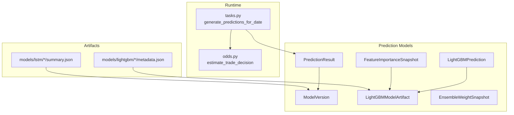
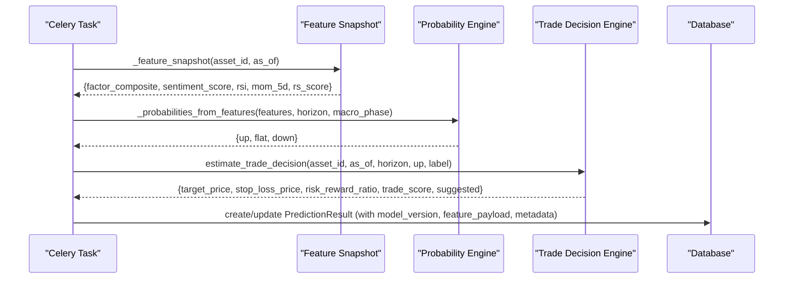
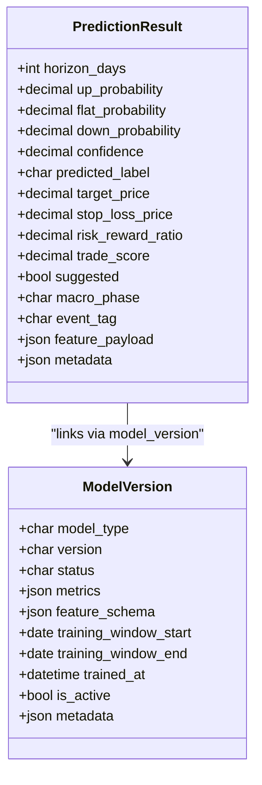
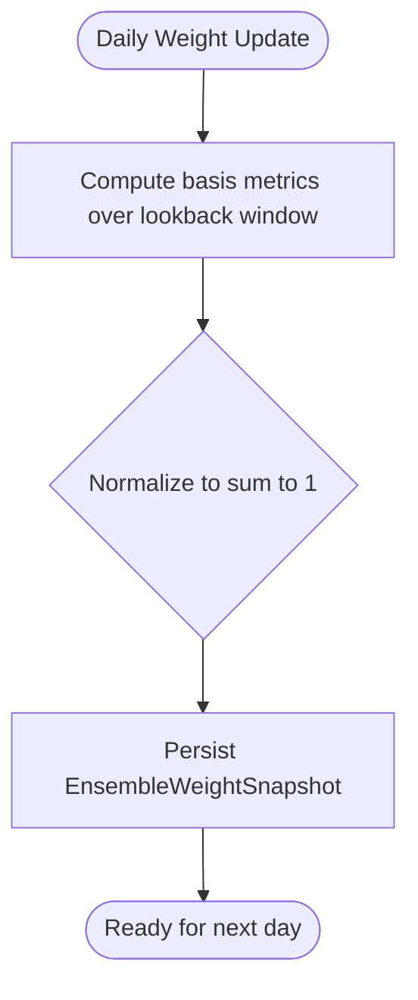
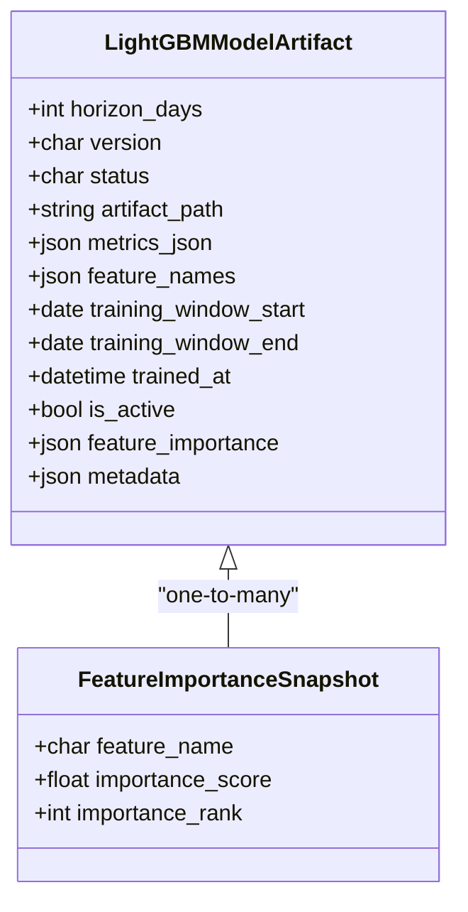
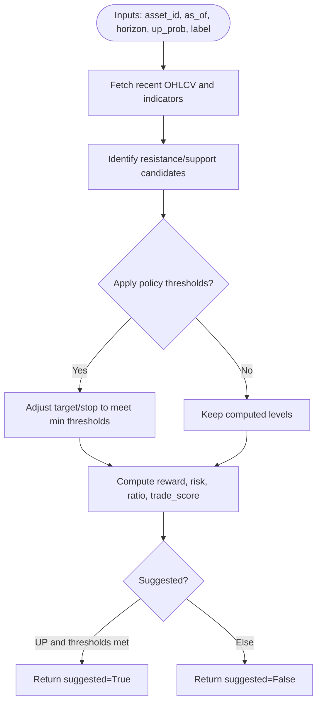
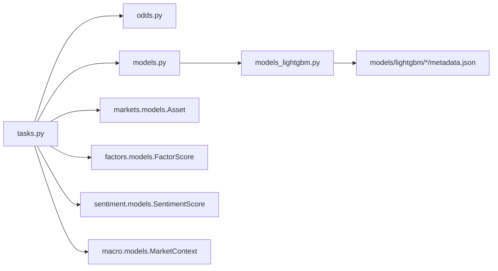

# Prediction & Machine Learning Models

<cite>
**Referenced Files in This Document**
- [models.py](file://apps/prediction/models.py)
- [models_lightgbm.py](file://apps/prediction/models_lightgbm.py)
- [serializers.py](file://apps/prediction/serializers.py)
- [serializers_lightgbm.py](file://apps/prediction/serializers_lightgbm.py)
- [tasks.py](file://apps/prediction/tasks.py)
- [odds.py](file://apps/prediction/odds.py)
- [metadata.json](file://models/lightgbm/30d_lgb-30d-2024-12-31/metadata.json)
- [summary.json](file://models/lstm/lstm-2024-12-31/summary.json)
</cite>

## Table of Contents
1. Introduction
2. Project Structure
3. Core Components
4. Architecture Overview
5. Detailed Component Analysis
6. Dependency Analysis
7. Performance Considerations
8. Troubleshooting Guide
9. Conclusion
10. Appendices

## Introduction
This document describes the data models and workflows for prediction and machine learning entities used to generate trade-oriented predictions across multiple horizons (3, 7, 30 days). It covers:
- PredictionResult: stores predicted labels, probabilities, confidence, and derived trade decisions with risk/reward metrics.
- EnsembleWeightSnapshot: tracks ensemble weights over time for heuristic, LightGBM, and LSTM model types.
- LightGBMModelArtifact: versioned artifacts with comprehensive metadata including training windows, feature sets, and performance metrics.
- FeatureImportanceSnapshot: per-feature importance records enabling interpretability and drift analysis.
- Model lifecycle from training through deployment and monitoring, including rollback support and A/B testing considerations.

## Project Structure
The prediction subsystem is organized into:
- Data models defining core entities and relationships
- Serializers exposing fields for API consumption
- Background tasks orchestrating training and prediction generation
- Trade decision logic computing target prices, stop losses, and scoring
- On-disk artifact directories storing model files and metadata

**Diagram sources**
- [models.py:7-31](file://apps/prediction/models.py#L7-L31)
- [models.py:43-97](file://apps/prediction/models.py#L43-L97)
- [models_lightgbm.py:7-38](file://apps/prediction/models_lightgbm.py#L7-L38)
- [models_lightgbm.py:41-94](file://apps/prediction/models_lightgbm.py#L41-L94)
- [models_lightgbm.py:97-136](file://apps/prediction/models_lightgbm.py#L97-L136)
- [tasks.py:177-243](file://apps/prediction/tasks.py#L177-L243)
- [odds.py:60-158](file://apps/prediction/odds.py#L60-L158)
- [metadata.json:1-112](file://models/lightgbm/30d_lgb-30d-2024-12-31/metadata.json#L1-L112)
- [summary.json:1-41](file://models/lstm/lstm-2024-12-31/summary.json#L1-L41)

**Section sources**
- [models.py:7-97](file://apps/prediction/models.py#L7-L97)
- [models_lightgbm.py:7-136](file://apps/prediction/models_lightgbm.py#L7-L136)
- [tasks.py:177-243](file://apps/prediction/tasks.py#L177-L243)
- [odds.py:60-158](file://apps/prediction/odds.py#L60-L158)
- [metadata.json:1-112](file://models/lightgbm/30d_lgb-30d-2024-12-31/metadata.json#L1-L112)
- [summary.json:1-41](file://models/lstm/lstm-2024-12-31/summary.json#L1-L41)

## Core Components
- ModelVersion: Tracks generic model versions across LIGHTGBM, LSTM, ENSEMBLE with status, artifact path, metrics, feature schema, training window, active flag, and metadata.
- PredictionResult: Stores asset-level predictions with horizon-specific probabilities, label, confidence, and derived trade decision fields (target price, stop loss, risk-reward ratio, trade score, suggested flag), plus macro context and feature payload.
- LightGBMModelArtifact: Versioned LightGBM artifacts with horizon, version, status, artifact path, metrics JSON, feature names, training window, active flag, feature importance snapshot, and metadata.
- LightGBMPrediction: Parallel prediction store for LightGBM with probabilities, label, confidence, trade decision fields, feature snapshot, raw/calibrated scores, and link to model artifact.
- EnsembleWeightSnapshot: Daily snapshots of ensemble weights for LightGBM, LSTM, and Heuristic, with basis lookback window and metrics used to compute weights.
- FeatureImportanceSnapshot: Per-model-artifact, per-horizon feature importance records with rank and score.

Key relationships:
- PredictionResult links to ModelVersion via foreign key.
- LightGBMPrediction links to LightGBMModelArtifact.
- FeatureImportanceSnapshot links to LightGBMModelArtifact.
- EnsembleWeightSnapshot is independent but conceptually ties all three model families together.

**Section sources**
- [models.py:7-31](file://apps/prediction/models.py#L7-L31)
- [models.py:43-97](file://apps/prediction/models.py#L43-L97)
- [models_lightgbm.py:7-38](file://apps/prediction/models_lightgbm.py#L7-L38)
- [models_lightgbm.py:41-94](file://apps/prediction/models_lightgbm.py#L41-L94)
- [models_lightgbm.py:97-136](file://apps/prediction/models_lightgbm.py#L97-L136)

## Architecture Overview
End-to-end flow for generating heuristic ensemble predictions and persisting results:

**Diagram sources**
- [tasks.py:55-112](file://apps/prediction/tasks.py#L55-L112)
- [tasks.py:177-243](file://apps/prediction/tasks.py#L177-L243)
- [odds.py:60-158](file://apps/prediction/odds.py#L60-L158)

## Detailed Component Analysis

### PredictionResult
- Purpose: Store daily predictions per asset and horizon with probabilities, label, confidence, and derived trade decisions.
- Key fields:
  - Horizons: 3, 7, 30 days
  - Label choices: UP, FLAT, DOWN
  - Probabilities: up_probability, flat_probability, down_probability
  - Confidence: margin-based between top two classes
  - Trade decision fields: target_price, stop_loss_price, risk_reward_ratio, trade_score, suggested
  - Context: macro_phase, event_tag
  - Reproducibility: feature_payload capturing input features used
  - Linkage: model_version foreign key; unique constraint on (asset, date, horizon_days, model_version)
- Accuracy/performance indicators:
  - Stored in related ModelVersion.metrics (JSON)
  - Additional per-prediction indicators include confidence and trade_score

**Diagram sources**
- [models.py:43-97](file://apps/prediction/models.py#L43-L97)
- [models.py:7-31](file://apps/prediction/models.py#L7-L31)

**Section sources**
- [models.py:43-97](file://apps/prediction/models.py#L43-L97)
- [serializers.py:16-32](file://apps/prediction/serializers.py#L16-L32)

### EnsembleWeightSnapshot
- Purpose: Track daily ensemble weights for LightGBM, LSTM, and Heuristic to enable retrospective analysis and dynamic blending.
- Fields:
  - lightgbm_weight, lstm_weight, heuristic_weight
  - basis_lookback_days: window used to compute weights
  - basis_metrics: accuracy or other metrics per model over the lookback window
- Usage: Supports A/B testing by comparing weight evolution and basis metrics across dates.

**Diagram sources**
- [models_lightgbm.py:97-110](file://apps/prediction/models_lightgbm.py#L97-L110)

**Section sources**
- [models_lightgbm.py:97-110](file://apps/prediction/models_lightgbm.py#L97-L110)
- [serializers_lightgbm.py:40-46](file://apps/prediction/serializers_lightgbm.py#L40-L46)

### LightGBMModelArtifact
- Purpose: Registry for trained LightGBM model files and rich metadata.
- Fields:
  - horizon_days, version, status, artifact_path
  - metrics_json: accuracy, f1_macro, etc.
  - feature_names: list of features used during training
  - training_window_start/end, trained_at
  - is_active: enables switching between versions for A/B testing and rollbacks
  - feature_importance: top features by importance
  - metadata: additional context
- Artifact storage locations:
  - Filesystem paths under models/lightgbm/<version>/metadata.json and associated model binaries referenced by artifact_path

**Diagram sources**
- [models_lightgbm.py:7-38](file://apps/prediction/models_lightgbm.py#L7-L38)
- [models_lightgbm.py:113-136](file://apps/prediction/models_lightgbm.py#L113-L136)
- [metadata.json:1-112](file://models/lightgbm/30d_lgb-30d-2024-12-31/metadata.json#L1-L112)

**Section sources**
- [models_lightgbm.py:7-38](file://apps/prediction/models_lightgbm.py#L7-L38)
- [metadata.json:1-112](file://models/lightgbm/30d_lgb-30d-2024-12-31/metadata.json#L1-L112)
- [serializers_lightgbm.py:11-18](file://apps/prediction/serializers_lightgbm.py#L11-L18)

### FeatureImportanceSnapshot
- Purpose: Historical per-feature importance for a trained LightGBM artifact, enabling interpretability and drift detection.
- Fields:
  - model_artifact foreign key
  - horizon_days
  - feature_name, importance_score, importance_rank
- Use cases:
  - Explain which features drive predictions
  - Monitor stability of feature influence over time
  - Inform feature selection and pruning

**Section sources**
- [models_lightgbm.py:113-136](file://apps/prediction/models_lightgbm.py#L113-L136)
- [serializers_lightgbm.py:49-58](file://apps/prediction/serializers_lightgbm.py#L49-L58)

### LightGBMPrediction
- Purpose: Parallel prediction store for LightGBM-generated predictions, mirroring PredictionResult structure with additional ML-specific fields.
- Fields:
  - Probabilities, label, confidence
  - Trade decision fields: target_price, stop_loss_price, risk_reward_ratio, trade_score, suggested
  - model_artifact foreign key
  - feature_snapshot: input features used for this prediction
  - raw_scores, calibrated_scores: pre/post calibration values for debugging
- Unique constraints ensure one prediction per (asset, date, horizon_days, model_artifact).

**Section sources**
- [models_lightgbm.py:41-94](file://apps/prediction/models_lightgbm.py#L41-L94)
- [serializers_lightgbm.py:21-37](file://apps/prediction/serializers_lightgbm.py#L21-L37)

### ModelVersion
- Purpose: Generic registry for model versions across LIGHTGBM, LSTM, and ENSEMBLE.
- Fields:
  - model_type, version, status, artifact_path
  - metrics (JSON), feature_schema (list)
  - training_window_start/end, trained_at
  - is_active: supports activation/rollback and A/B testing
  - metadata: arbitrary context
- Used by PredictionResult to attribute each prediction to a specific model version.

**Section sources**
- [models.py:7-31](file://apps/prediction/models.py#L7-L31)
- [serializers.py:6-13](file://apps/prediction/serializers.py#L6-L13)

### Trade Decision Logic (odds.py)
- Purpose: Convert probabilities and market context into actionable trade parameters.
- Inputs:
  - asset_id, as_of, horizon_days, up_probability, predicted_label
  - Optional policy_options for thresholds
- Outputs:
  - target_price, stop_loss_price, risk_reward_ratio, trade_score, suggested
- Algorithm highlights:
  - Uses recent OHLCV to identify resistance/support levels
  - Applies Bollinger Bands and moving averages
  - Enforces minimum return/stop distance policies
  - Computes reward/risk and a composite trade score
  - Suggests trades when label is UP and thresholds are met

**Diagram sources**
- [odds.py:60-158](file://apps/prediction/odds.py#L60-L158)

**Section sources**
- [odds.py:60-158](file://apps/prediction/odds.py#L60-L158)

## Dependency Analysis
- tasks.py depends on:
  - apps.markets.models.Asset and effective_universe_tradeable_assets
  - apps.factors.models.FactorScore
  - apps.sentiment.models.SentimentScore
  - apps.macro.models.MarketContext
  - apps.prediction.historical_features
  - apps.prediction.odds.estimate_trade_decision
  - apps.prediction.models.ModelVersion, PredictionResult
- serializers expose read-only fields that traverse relationships (e.g., asset symbol/name, model version info).
- Artifacts on disk provide external metadata consumed by training pipelines and referenced by model artifacts.

**Diagram sources**
- [tasks.py:1-16](file://apps/prediction/tasks.py#L1-L16)
- [tasks.py:177-243](file://apps/prediction/tasks.py#L177-L243)
- [models.py:7-31](file://apps/prediction/models.py#L7-L31)
- [models_lightgbm.py:7-38](file://apps/prediction/models_lightgbm.py#L7-L38)
- [metadata.json:1-112](file://models/lightgbm/30d_lgb-30d-2024-12-31/metadata.json#L1-L112)

**Section sources**
- [tasks.py:1-16](file://apps/prediction/tasks.py#L1-L16)
- [tasks.py:177-243](file://apps/prediction/tasks.py#L177-L243)
- [models.py:7-31](file://apps/prediction/models.py#L7-L31)
- [models_lightgbm.py:7-38](file://apps/prediction/models_lightgbm.py#L7-L38)
- [metadata.json:1-112](file://models/lightgbm/30d_lgb-30d-2024-12-31/metadata.json#L1-L112)

## Performance Considerations
- Database indexing:
  - PredictionResult indexes on date, horizon_days, predicted_label, and composite (asset, date, horizon_days) for efficient queries.
  - ModelVersion indexes on model_type and is_active for fast active version resolution.
  - LightGBMModelArtifact indexes on horizon_days and is_active; status index for filtering.
  - FeatureImportanceSnapshot indexes on horizon_days, feature_name, and model_artifact with importance_rank.
- Caching:
  - tasks.py uses a runtime cache to avoid repeated OHLCV and indicator lookups within a single run.
  - odds.py caches recent rows to reduce database reads.
- Batch processing:
  - generate_predictions_for_date processes assets in bulk, minimizing per-row overhead.

[No sources needed since this section provides general guidance]

## Troubleshooting Guide
Common issues and diagnostics:
- Missing OHLCV data:
  - If latest bar is absent or invalid, estimate_trade_decision returns nulls and suggested=False. Check asset history availability for the given date.
- Probability normalization:
  - If total probability sums to zero or negative due to edge cases, probabilities are normalized to equal distribution. Inspect feature inputs and macro phase adjustments.
- Active model version not found:
  - If no active ENSEMBLE version exists, a baseline version is created automatically. Verify creation and metadata.
- Duplicate predictions:
  - Unique constraints prevent duplicates per (asset, date, horizon_days, model_version/model_artifact). Ensure idempotent runs.

**Section sources**
- [odds.py:60-80](file://apps/prediction/odds.py#L60-L80)
- [tasks.py:129-146](file://apps/prediction/tasks.py#L129-L146)
- [tasks.py:208-243](file://apps/prediction/tasks.py#L208-L243)
- [models.py:89-97](file://apps/prediction/models.py#L89-L97)
- [models_lightgbm.py:86-94](file://apps/prediction/models_lightgbm.py#L86-L94)

## Conclusion
The prediction system integrates probabilistic forecasts with actionable trade decisions, supported by robust model versioning, artifact management, and interpretability tools. EnsembleWeightSnapshot enables dynamic blending across heuristic, LightGBM, and LSTM models, while FeatureImportanceSnapshot provides ongoing insight into driver features. The design supports A/B testing via active flags and metadata, and offers rollback capabilities by switching active versions.

[No sources needed since this section summarizes without analyzing specific files]

## Appendices

### Field Definitions Summary

- PredictionResult
  - Horizon: 3, 7, 30 days
  - Label: UP, FLAT, DOWN
  - Probabilities: up_probability, flat_probability, down_probability
  - Confidence: margin-based between top two classes
  - Trade decision: target_price, stop_loss_price, risk_reward_ratio, trade_score, suggested
  - Context: macro_phase, event_tag
  - Reproducibility: feature_payload, metadata
  - Linkage: model_version (ModelVersion)

- EnsembleWeightSnapshot
  - Weights: lightgbm_weight, lstm_weight, heuristic_weight
  - Basis: basis_lookback_days, basis_metrics

- LightGBMModelArtifact
  - Identity: horizon_days, version, status, artifact_path
  - Training: training_window_start/end, trained_at
  - Performance: metrics_json
  - Features: feature_names, feature_importance
  - Lifecycle: is_active, metadata

- FeatureImportanceSnapshot
  - Per feature: feature_name, importance_score, importance_rank
  - Scope: model_artifact, horizon_days

- ModelVersion
  - Identity: model_type (LIGHTGBM, LSTM, ENSEMBLE), version, status
  - Training: training_window_start/end, trained_at
  - Schema: feature_schema
  - Performance: metrics
  - Lifecycle: is_active, metadata

**Section sources**
- [models.py:7-31](file://apps/prediction/models.py#L7-L31)
- [models.py:43-97](file://apps/prediction/models.py#L43-L97)
- [models_lightgbm.py:7-38](file://apps/prediction/models_lightgbm.py#L7-L38)
- [models_lightgbm.py:97-136](file://apps/prediction/models_lightgbm.py#L97-L136)

### Model Lifecycle: Training Through Deployment and Monitoring
- Training:
  - LightGBM artifacts stored under models/lightgbm/<version>/metadata.json with feature lists, parameters, and pruning details.
  - LSTM summaries stored under models/lstm/<version>/summary.json with per-horizon metrics and artifact paths.
- Deployment:
  - Set is_active on desired ModelVersion or LightGBMModelArtifact to switch production model.
  - Predictions reference the active model version/artifact, enabling A/B testing by maintaining multiple active entries with distinct versions.
- Monitoring:
  - Track EnsembleWeightSnapshot over time to observe weight shifts and basis metrics.
  - Review FeatureImportanceSnapshot for drift and interpretability.
  - Inspect PredictionResult confidence and trade_score distributions for performance signals.
- Rollback:
  - Revert to previous active version by toggling is_active flags and regenerating or replaying predictions if necessary.

**Section sources**
- [metadata.json:1-112](file://models/lightgbm/30d_lgb-30d-2024-12-31/metadata.json#L1-L112)
- [summary.json:1-41](file://models/lstm/lstm-2024-12-31/summary.json#L1-L41)
- [models.py:7-31](file://apps/prediction/models.py#L7-L31)
- [models_lightgbm.py:7-38](file://apps/prediction/models_lightgbm.py#L7-L38)
- [models_lightgbm.py:97-110](file://apps/prediction/models_lightgbm.py#L97-L110)
- [models_lightgbm.py:113-136](file://apps/prediction/models_lightgbm.py#L113-L136)