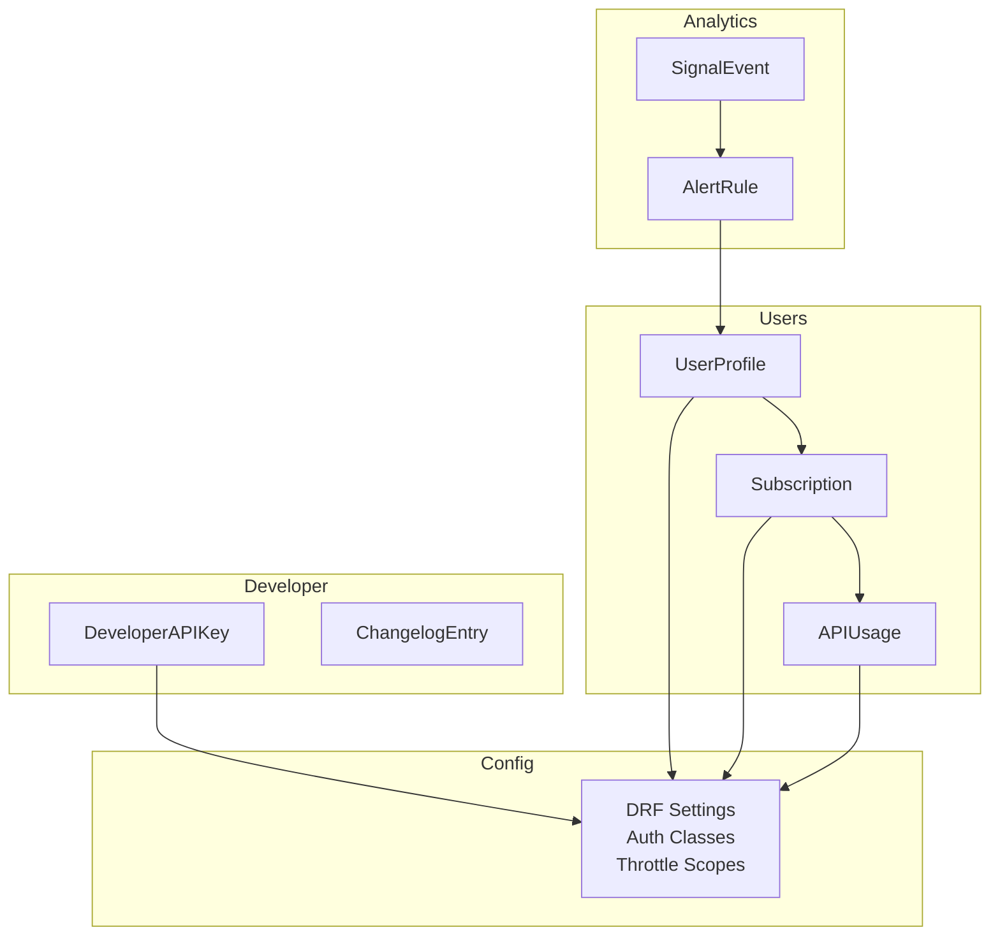
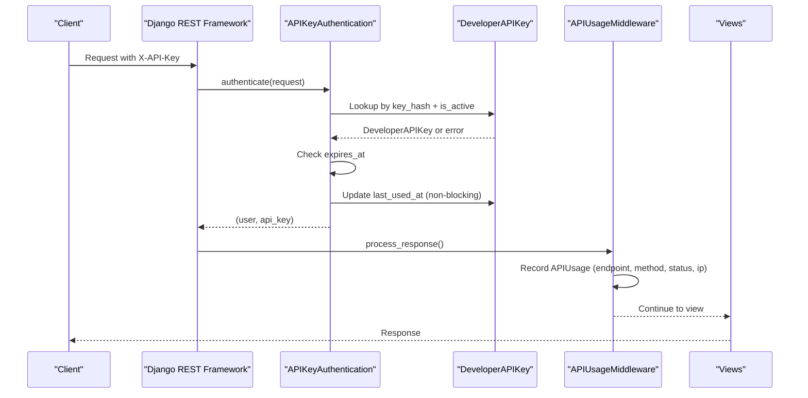
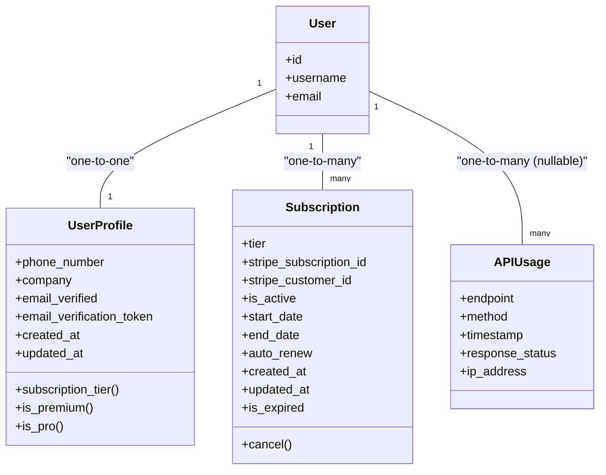
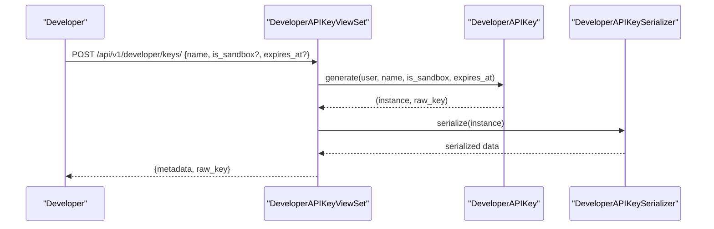
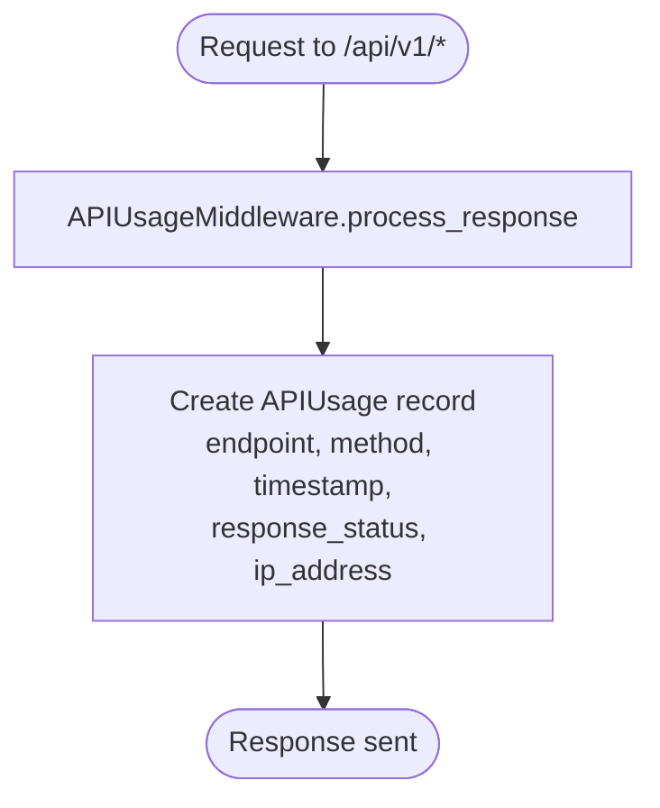
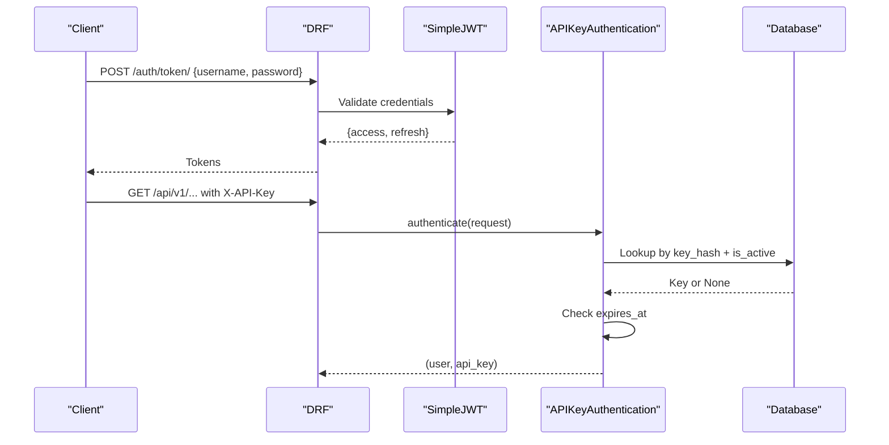
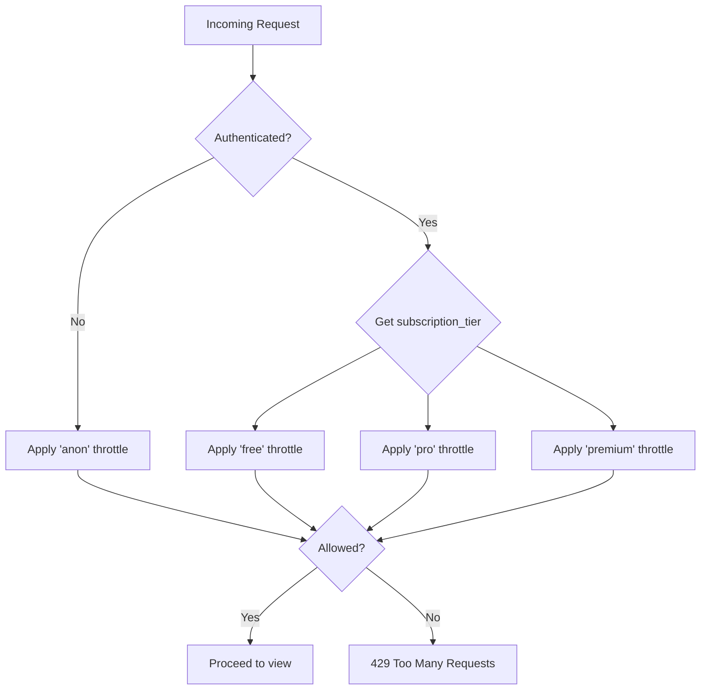
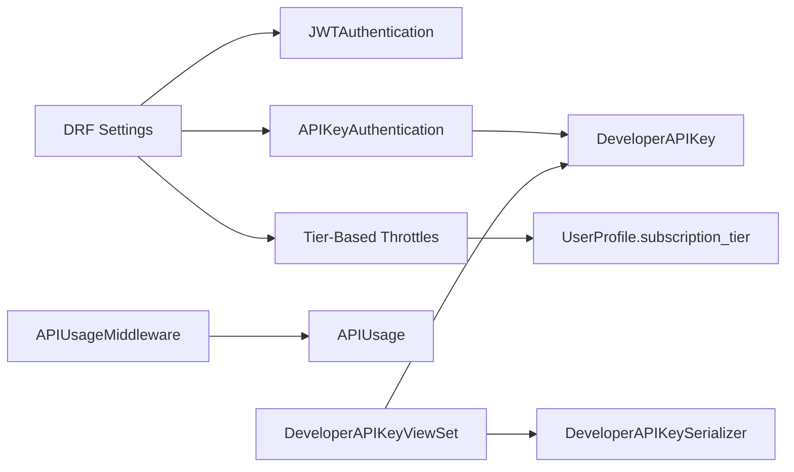

# User & Administration Models

<cite>
**Referenced Files in This Document**
- [apps/users/models.py](file://apps/users/models.py)
- [apps/developer/models.py](file://apps/developer/models.py)
- [apps/analytics/models.py](file://apps/analytics/models.py)
- [config/settings/base.py](file://config/settings/base.py)
- [apps/developer/authentication.py](file://apps/developer/authentication.py)
- [apps/users/middleware.py](file://apps/users/middleware.py)
- [apps/core/throttling.py](file://apps/core/throttling.py)
- [apps/users/views.py](file://apps/users/views.py)
- [apps/users/serializers.py](file://apps/users/serializers.py)
- [apps/developer/views.py](file://apps/developer/views.py)
- [apps/developer/serializers.py](file://apps/developer/serializers.py)
</cite>

## Table of Contents
1. Introduction
2. Project Structure
3. Core Components
4. Architecture Overview
5. Detailed Component Analysis
6. Dependency Analysis
7. Performance Considerations
8. Troubleshooting Guide
9. Conclusion
10. Appendices

## Introduction
This document provides comprehensive data model documentation for user management and administration entities, focusing on:
- User profiles, subscriptions, API keys, and usage metering
- Authentication flows (JWT and API key)
- Subscription tiers and feature access controls via throttling
- Developer portal functionality including public changelog and API key generation workflows
- Field definitions for user preferences, subscription limits, and usage tracking metrics
- Access control mechanisms at the model level and integration with Django’s authentication system
- Data retention considerations and compliance notes for financial applications

## Project Structure
The relevant code is organized across several apps:
- users: core user profile, subscription, and API usage models and views
- developer: API key management, developer portal endpoints, and public changelog
- analytics: additional usage-related models (alerts, signals) that integrate with user ownership
- config/settings: global DRF configuration, authentication classes, throttling scopes, and rate limits

**Diagram sources**
- [apps/users/models.py:13-186](file://apps/users/models.py#L13-L186)
- [apps/developer/models.py:10-156](file://apps/developer/models.py#L10-L156)
- [apps/analytics/models.py:87-255](file://apps/analytics/models.py#L87-L255)
- [config/settings/base.py:266-301](file://config/settings/base.py#L266-L301)

**Section sources**
- [apps/users/models.py:13-186](file://apps/users/models.py#L13-L186)
- [apps/developer/models.py:10-156](file://apps/developer/models.py#L10-L156)
- [apps/analytics/models.py:87-255](file://apps/analytics/models.py#L87-L255)
- [config/settings/base.py:266-301](file://config/settings/base.py#L266-L301)

## Core Components
- UserProfile: Extended user profile linked to Django’s built-in User; includes phone number, company, email verification state, and computed subscription tier properties.
- Subscription: SaaS tier management tied to Stripe identifiers; tracks active status, start/end dates, auto-renewal, and expiration logic.
- APIUsage: Usage metering per request, capturing endpoint, HTTP method, timestamp, response status, and IP address; supports per-user and per-endpoint analytics.
- DeveloperAPIKey: Secure programmatic access keys with hashed storage, prefix display, sandbox mode, expiration, and last-used tracking.
- ChangelogEntry: Public API version changelog for transparency and breaking change notifications.

Key behaviors:
- Tier resolution: UserProfile.subscription_tier resolves the current active subscription or defaults to FREE.
- Rate limiting: Throttling scopes are scoped by subscription tier (free/pro/premium) and enforced globally via DRF settings.
- Authentication: JWT Bearer tokens and X-API-Key header are supported; API key auth updates last_used_at non-blockingly.

**Section sources**
- [apps/users/models.py:13-186](file://apps/users/models.py#L13-L186)
- [apps/developer/models.py:10-156](file://apps/developer/models.py#L10-L156)
- [apps/core/throttling.py:17-88](file://apps/core/throttling.py#L17-L88)
- [apps/developer/authentication.py:10-53](file://apps/developer/authentication.py#L10-L53)
- [config/settings/base.py:266-301](file://config/settings/base.py#L266-L301)

## Architecture Overview
Authentication and authorization flow:
- Requests may authenticate via JWT (Bearer token) or API Key (X-API-Key).
- On successful API key authentication, the key’s last_used_at is updated asynchronously-like (non-blocking update).
- Throttling applies per-tier daily limits; anonymous and authenticated endpoints have separate scopes.
- API usage is recorded for all /api/v1/* requests via middleware.

**Diagram sources**
- [apps/developer/authentication.py:24-49](file://apps/developer/authentication.py#L24-L49)
- [apps/users/middleware.py:11-33](file://apps/users/middleware.py#L11-L33)
- [config/settings/base.py:281-285](file://config/settings/base.py#L281-L285)

**Section sources**
- [apps/developer/authentication.py:10-53](file://apps/developer/authentication.py#L10-L53)
- [apps/users/middleware.py:1-34](file://apps/users/middleware.py#L1-L34)
- [config/settings/base.py:266-301](file://config/settings/base.py#L266-L301)

## Detailed Component Analysis

### User Profile and Subscription Models
- UserProfile
  - One-to-one link to Django User
  - Fields: phone_number, company, email_verified, email_verification_token, timestamps
  - Computed properties: subscription_tier, is_premium, is_pro
- Subscription
  - ForeignKey to User
  - Fields: tier (FREE/PRO/PREMIUM), stripe_subscription_id, stripe_customer_id, is_active, start_date, end_date, auto_renew, timestamps
  - Methods: cancel(), is_expired property
- APIUsage
  - Optional ForeignKey to User (supports anonymous usage)
  - Fields: endpoint, method, timestamp, response_status, ip_address
  - Indexes optimize queries by user+timestamp and endpoint+timestamp

Access control and permissions:
- Views enforce IsAuthenticated for profile and subscription endpoints.
- APIUsage is written by middleware regardless of authentication, enabling anonymous usage tracking.

Data relationships:
- User -> UserProfile (OneToOne)
- User -> Subscription (OneToMany)
- User -> APIUsage (OneToMany, nullable)

**Diagram sources**
- [apps/users/models.py:13-186](file://apps/users/models.py#L13-L186)

**Section sources**
- [apps/users/models.py:13-186](file://apps/users/models.py#L13-L186)
- [apps/users/views.py:160-223](file://apps/users/views.py#L160-L223)
- [apps/users/serializers.py:8-157](file://apps/users/serializers.py#L8-L157)

### API Key Management and Developer Portal
- DeveloperAPIKey
  - Secure key generation using secrets.token_hex and SHA-256 hashing
  - Stores only key_hash and key_prefix; raw key returned once on creation
  - Fields: name, key_prefix, key_hash, is_active, is_sandbox, created_at, last_used_at, expires_at
  - Class method generate(user, name, is_sandbox, expires_at) returns instance and raw key
- ChangelogEntry
  - Public read-only entries documenting API changes, breaking changes, and affected endpoints
  - Fields: version, release_date, change_type, title, description, is_breaking, endpoint, created_at

Developer portal workflows:
- Create API key: POST to developer keys endpoint returns metadata plus raw_key once
- List/Retrieve/Revoke keys: standard CRUD with soft-delete (is_active=False)
- Rotate key: revoke old key and issue new one with same settings
- Public changelog: GET list with filters for version, change_type, is_breaking

**Diagram sources**
- [apps/developer/views.py:39-54](file://apps/developer/views.py#L39-L54)
- [apps/developer/models.py:81-100](file://apps/developer/models.py#L81-L100)
- [apps/developer/serializers.py:6-37](file://apps/developer/serializers.py#L6-L37)

**Section sources**
- [apps/developer/models.py:10-156](file://apps/developer/models.py#L10-L156)
- [apps/developer/views.py:13-100](file://apps/developer/views.py#L13-L100)
- [apps/developer/serializers.py:6-68](file://apps/developer/serializers.py#L6-L68)

### Usage Metering and Analytics
- APIUsage records every /api/v1/* request with endpoint, method, timestamp, response_status, and IP address
- Middleware writes usage after response processing
- Views expose usage stats per user, including daily/monthly counts and top endpoints

**Diagram sources**
- [apps/users/middleware.py:11-33](file://apps/users/middleware.py#L11-L33)

**Section sources**
- [apps/users/middleware.py:1-34](file://apps/users/middleware.py#L1-L34)
- [apps/users/views.py:226-284](file://apps/users/views.py#L226-L284)
- [apps/analytics/models.py:87-255](file://apps/analytics/models.py#L87-L255)

### Authentication Flows
- JWT Authentication:
  - Token obtain/refresh/verify endpoints are throttled separately for auth traffic
  - Simple JWT configured with access/refresh lifetimes and rotation/blacklisting
- API Key Authentication:
  - Header: X-API-Key
  - Validates hash against stored key_hash, checks is_active and expiration
  - Updates last_used_at on each successful use

**Diagram sources**
- [config/settings/base.py:307-321](file://config/settings/base.py#L307-L321)
- [apps/developer/authentication.py:24-49](file://apps/developer/authentication.py#L24-L49)

**Section sources**
- [apps/users/views.py:32-42](file://apps/users/views.py#L32-L42)
- [apps/developer/authentication.py:10-53](file://apps/developer/authentication.py#L10-L53)
- [config/settings/base.py:307-321](file://config/settings/base.py#L307-L321)

### Subscription Tiers and Feature Access Controls
- Tiers: FREE, PRO, PREMIUM
- Throttling scopes:
  - anon: 100/day
  - auth: 100/day (for auth endpoints)
  - free: 100/day
  - pro: 1000/day
  - premium: 10000/day
- Tier-based throttles compute cache keys using user ID and subscription tier
- Views expose current subscription and usage statistics, including daily limits and remaining quotas

**Diagram sources**
- [apps/core/throttling.py:17-88](file://apps/core/throttling.py#L17-L88)
- [config/settings/base.py:287-301](file://config/settings/base.py#L287-L301)

**Section sources**
- [apps/core/throttling.py:17-88](file://apps/core/throttling.py#L17-L88)
- [config/settings/base.py:287-301](file://config/settings/base.py#L287-L301)
- [apps/users/views.py:238-284](file://apps/users/views.py#L238-L284)

### Developer Portal Functionality
- Public changelog:
  - Read-only, no authentication required
  - Filterable by version, change_type, is_breaking; searchable by title/description/endpoint
- API key generation workflow:
  - Requires authentication
  - Creates key with secure hashing; returns raw key once
  - Supports sandbox mode and optional expiration
  - Rotation revokes old key and issues a new one

**Section sources**
- [apps/developer/views.py:86-100](file://apps/developer/views.py#L86-L100)
- [apps/developer/models.py:103-156](file://apps/developer/models.py#L103-L156)
- [apps/developer/serializers.py:53-68](file://apps/developer/serializers.py#L53-L68)

## Dependency Analysis
- Authentication dependencies:
  - DRF uses both JWT and API key authenticators
  - API key authenticator depends on DeveloperAPIKey model and hashing utilities
- Throttling dependencies:
  - Tier-based throttles depend on UserProfile.subscription_tier
  - Global throttle scopes defined in settings
- Usage tracking dependencies:
  - Middleware depends on APIUsage model and request/response lifecycle
- Viewset dependencies:
  - DeveloperAPIKeyViewSet depends on DeveloperAPIKey.generate and serializers
  - Users views depend on UserProfile, Subscription, and APIUsage

**Diagram sources**
- [config/settings/base.py:281-301](file://config/settings/base.py#L281-L301)
- [apps/developer/authentication.py:10-53](file://apps/developer/authentication.py#L10-L53)
- [apps/core/throttling.py:17-88](file://apps/core/throttling.py#L17-L88)
- [apps/users/middleware.py:1-34](file://apps/users/middleware.py#L1-L34)
- [apps/developer/views.py:13-100](file://apps/developer/views.py#L13-L100)

**Section sources**
- [config/settings/base.py:281-301](file://config/settings/base.py#L281-L301)
- [apps/developer/authentication.py:10-53](file://apps/developer/authentication.py#L10-L53)
- [apps/core/throttling.py:17-88](file://apps/core/throttling.py#L17-L88)
- [apps/users/middleware.py:1-34](file://apps/users/middleware.py#L1-L34)
- [apps/developer/views.py:13-100](file://apps/developer/views.py#L13-L100)

## Performance Considerations
- Database indexes:
  - Subscription: user+is_active, stripe_subscription_id
  - APIUsage: user+timestamp, endpoint+timestamp
  - DeveloperAPIKey: key_hash, user+is_active
  - ChangelogEntry: version, release_date
- Query optimizations:
  - select_related('user') in API key authentication reduces N+1 queries
  - Non-blocking last_used_at update avoids request latency spikes
- Throttling efficiency:
  - Cache-based rate limiting with scope and user-specific keys
  - Separate scopes for auth endpoints reduce contention

[No sources needed since this section provides general guidance]

## Troubleshooting Guide
Common issues and resolutions:
- Invalid or revoked API key:
  - Ensure X-API-Key header is present and correct
  - Verify key is active and not expired
  - Check logs for AuthenticationFailed exceptions
- Exceeded rate limits:
  - Confirm subscription tier and expected daily limits
  - Review usage stats endpoint for current consumption
  - Adjust client behavior to respect 429 responses
- Email verification/reset failures:
  - Validate tokens and ensure they haven’t been used
  - Check email delivery and frontend URLs for verification/reset links
- Usage tracking gaps:
  - Ensure requests hit /api/v1/* paths
  - Verify middleware is enabled and response processing occurs

**Section sources**
- [apps/developer/authentication.py:24-49](file://apps/developer/authentication.py#L24-L49)
- [apps/users/views.py:238-284](file://apps/users/views.py#L238-L284)
- [apps/users/middleware.py:11-33](file://apps/users/middleware.py#L11-L33)

## Conclusion
The user management and administration models provide a robust foundation for a financial SaaS platform:
- Secure authentication via JWT and API keys
- Tiered subscriptions with granular rate limiting
- Comprehensive usage metering and analytics
- Transparent developer portal with public changelog and safe API key management
- Strong indexing and query optimization for performance
- Compliance-ready design with hashed secrets and controlled exposure of sensitive data

[No sources needed since this section summarizes without analyzing specific files]

## Appendices

### Field Definitions Summary
- UserProfile
  - phone_number: optional contact info
  - company: optional organization
  - email_verified: boolean flag
  - email_verification_token: temporary token for verification/reset
  - timestamps: created_at, updated_at
- Subscription
  - tier: FREE/PRO/PREMIUM
  - stripe_subscription_id, stripe_customer_id: payment provider references
  - is_active, start_date, end_date, auto_renew: lifecycle control
  - timestamps: created_at, updated_at
- APIUsage
  - endpoint, method, timestamp, response_status, ip_address: request telemetry
- DeveloperAPIKey
  - name, key_prefix, key_hash, is_active, is_sandbox, expires_at, last_used_at, created_at
- ChangelogEntry
  - version, release_date, change_type, title, description, is_breaking, endpoint, created_at

**Section sources**
- [apps/users/models.py:13-186](file://apps/users/models.py#L13-L186)
- [apps/developer/models.py:10-156](file://apps/developer/models.py#L10-L156)

### Access Control Mechanisms
- Model-level:
  - OneToOne/ForeignKey relationships enforce referential integrity
  - Soft deletes via is_active flags for keys and subscriptions
- View-level:
  - DRF permission_classes restrict access to authenticated users where appropriate
  - Public changelog allows anonymous reads
- Integration with Django:
  - Uses django.contrib.auth.models.User
  - JWT and session authentication configured in DRF settings
  - Custom API key authenticator integrates seamlessly with DRF pipeline

**Section sources**
- [apps/users/models.py:13-186](file://apps/users/models.py#L13-L186)
- [apps/developer/models.py:10-156](file://apps/developer/models.py#L10-L156)
- [apps/developer/views.py:13-100](file://apps/developer/views.py#L13-L100)
- [config/settings/base.py:281-301](file://config/settings/base.py#L281-L301)

### Data Retention Policies and Compliance Considerations
- APIUsage:
  - High-volume table; consider periodic archival or partitioning by date
  - Retain recent data for analytics and billing; archive older records for compliance
- DeveloperAPIKey:
  - Store only hashes; never persist raw keys
  - Enforce expiration policies and regular rotation
- Subscription:
  - Maintain historical records for auditability and billing reconciliation
  - Link to external payment systems via Stripe IDs for traceability
- Compliance:
  - Minimize PII exposure in logs and APIs
  - Ensure encryption at rest for sensitive fields if required by policy
  - Implement audit trails for critical operations (key creation, subscription changes)

[No sources needed since this section provides general guidance]