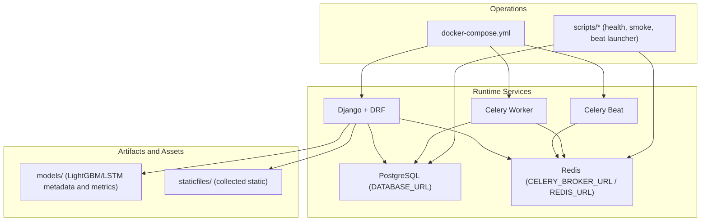
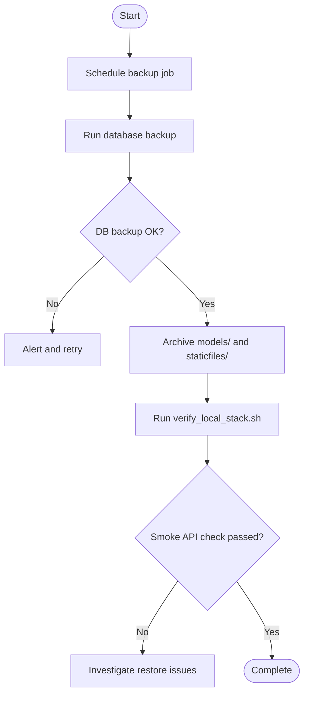
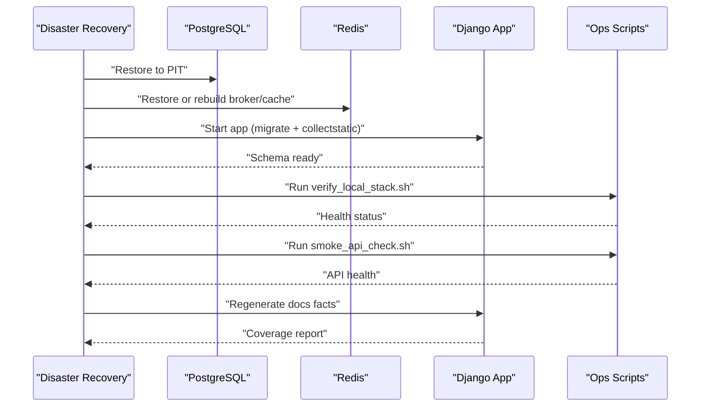
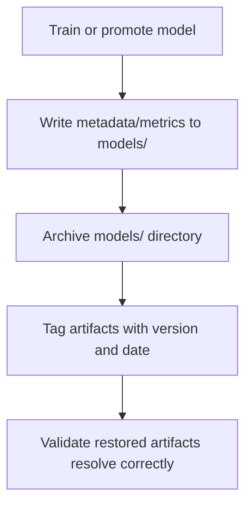
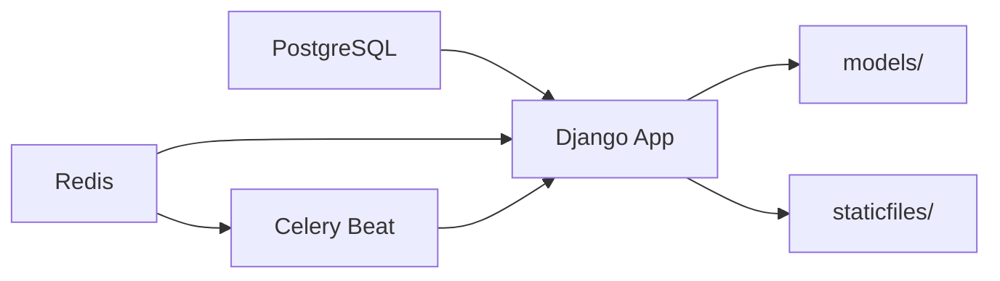

# Backup & Recovery

<cite>
**Referenced Files in This Document**
- [README.md](file://README.md)
- [docker-compose.yml](file://docker-compose.yml)
- [base.py](file://config/settings/base.py)
- [production.py](file://config/settings/production.py)
- [entrypoint.sh](file://compose/local/django/entrypoint.sh)
- [verify_local_stack.sh](file://scripts/verify_local_stack.sh)
- [smoke_api_check.sh](file://scripts/smoke_api_check.sh)
- [run_celery_beat.sh](file://scripts/run_celery_beat.sh)
- [celery.md](file://docs/reference/celery.md)
- [env.md](file://docs/reference/env.md)
- [models.md](file://docs/reference/models.md)
- [retrain.md](file://docs/how-to/retrain.md)
- [runbook-sync-failure.md](file://docs/how-to/runbook-sync-failure.md)
- [runbook-provider-blackout.md](file://docs/how-to/runbook-provider-blackout.md)
- [export_documentation_facts.py](file://apps/core/management/commands/export_documentation_facts.py)
</cite>

## Table of Contents
1. [Introduction](#introduction)
2. [Project Structure](#project-structure)
3. [Core Components](#core-components)
4. [Architecture Overview](#architecture-overview)
5. [Detailed Component Analysis](#detailed-component-analysis)
6. [Dependency Analysis](#dependency-analysis)
7. [Performance Considerations](#performance-considerations)
8. [Troubleshooting Guide](#troubleshooting-guide)
9. [Conclusion](#conclusion)
10. [Appendices](#appendices)

## Introduction
This document defines backup and recovery procedures for FinanceAnalysis, covering database backups, automated scheduling, data retention, disaster recovery, restoration, business continuity, model artifact preservation, configuration and static asset backup, testing safeguards, failover strategies, RTO/RPO considerations, incremental backups, point-in-time recovery, cross-region replication options, and runbooks for common incidents such as data corruption, system failure, and accidental deletion.

FinanceAnalysis is a Django-based platform with PostgreSQL as the primary store, Redis for caching/broker/channel layer, Celery Beat for scheduled tasks, and on-disk model artifacts under models/. The local stack uses Docker Compose to orchestrate services and scripts to verify connectivity and health.

**Section sources**
- [README.md:48-114](file://README.md#L48-L114)
- [docker-compose.yml:1-39](file://docker-compose.yml#L1-L39)

## Project Structure
The operational surface relevant to backup and recovery includes:
- Database: configured via DATABASE_URL in settings; migrations run at startup.
- Cache/Broker/Channels: Redis URL(s) configured in settings.
- Scheduled jobs: Celery Beat schedule defined in settings and executed by the beat process.
- Artifacts: model metadata and metrics stored under models/.
- Static assets: collected into staticfiles during startup.
- Scripts: verification and smoke checks for dependencies and API health.



**Diagram sources**
- [base.py:122-125](file://config/settings/base.py#L122-L125)
- [base.py:174-203](file://config/settings/base.py#L174-L203)
- [base.py:323-339](file://config/settings/base.py#L323-L339)
- [docker-compose.yml:1-39](file://docker-compose.yml#L1-L39)
- [entrypoint.sh:6-12](file://compose/local/django/entrypoint.sh#L6-L12)

**Section sources**
- [base.py:122-125](file://config/settings/base.py#L122-L125)
- [base.py:174-203](file://config/settings/base.py#L174-L203)
- [base.py:323-339](file://config/settings/base.py#L323-L339)
- [docker-compose.yml:1-39](file://docker-compose.yml#L1-L39)
- [entrypoint.sh:6-12](file://compose/local/django/entrypoint.sh#L6-L12)

## Core Components
- Database: PostgreSQL connection via DATABASE_URL; atomic requests enabled.
- Caching and messaging: Redis used for cache, Channels, and Celery broker/result backend.
- Scheduling: Celery Beat with a database scheduler and a fixed schedule for daily syncs, sentiment, predictions, and alerts.
- Artifacts: LightGBM and LSTM artifacts with metadata and metrics stored under models/.
- Static assets: Collected into staticfiles during container entry.
- Health checks: scripts verify PostgreSQL and Redis connectivity and Python dependency availability.

Operational implications for backup and recovery:
- Back up PostgreSQL consistently using native tools or managed service snapshots.
- Back up Redis if state must be preserved (e.g., Celery queues, cache, channels).
- Back up models/ and staticfiles/ as part of application data.
- Back up environment configuration (DATABASE_URL, REDIS_URL, secrets) separately from code.

**Section sources**
- [base.py:122-125](file://config/settings/base.py#L122-L125)
- [base.py:174-203](file://config/settings/base.py#L174-L203)
- [base.py:323-339](file://config/settings/base.py#L323-L339)
- [models.md:109-118](file://docs/reference/models.md#L109-L118)
- [entrypoint.sh:6-12](file://compose/local/django/entrypoint.sh#L6-L12)
- [verify_local_stack.sh:37-62](file://scripts/verify_local_stack.sh#L37-L62)

## Architecture Overview
Backup and recovery spans multiple layers:

```mermaid
sequenceDiagram
participant Ops as "Operator"
participant PG as "PostgreSQL"
participant RS as "Redis"
participant APP as "Django App"
participant ART as "models/"
participant STA as "staticfiles/"
Ops->>PG : "Create consistent snapshot"
Ops->>RS : "Persist dump or enable WAL archiving"
Ops->>APP : "Trigger export_documentation_facts"
APP-->>OPS : "Metrics and coverage report"
Ops->>ART : "Archive model artifacts"
Ops->>STA : "Archive static files"
Note over Ops,PG : "RPO depends on snapshot frequency and WAL retention"
Note over Ops,RS : "Redis state may be ephemeral; back up only if required"
```

**Diagram sources**
- [base.py:122-125](file://config/settings/base.py#L122-L125)
- [base.py:174-203](file://config/settings/base.py#L174-L203)
- [base.py:323-339](file://config/settings/base.py#L323-L339)
- [export_documentation_facts.py:764-824](file://apps/core/management/commands/export_documentation_facts.py#L764-L824)

## Detailed Component Analysis

### Database Backup Strategy
- Primary store: PostgreSQL configured via DATABASE_URL.
- Consistency: Use database-native snapshotting or logical dumps that respect transaction boundaries. Atomic requests are enabled in settings, which helps reduce inconsistent reads during operations but does not replace proper backup mechanisms.
- Point-in-time recovery (PITR): Enable continuous archiving/WAL shipping on the database server to allow recovery to arbitrary points within the retention window.
- Incremental backups: Prefer base backups plus WAL segments for near-zero downtime restores and minimal RPO.
- Cross-region replication: If using a managed PostgreSQL service, enable asynchronous replication to a secondary region for disaster recovery.

Recommended schedule:
- Full base backup daily.
- WAL archiving continuously retained for the desired RPO window.
- Logical schema-only dumps periodically for quick validation and migration safety.

**Section sources**
- [base.py:122-125](file://config/settings/base.py#L122-L125)

### Automated Backup Scheduling
- No built-in backup scheduler exists in the project.
- Use external schedulers (OS cron, cloud job scheduler, or CI/CD) to invoke database-native backup commands and artifact archival.
- Validate success with health checks:
  - Verify database connectivity and schema readiness via verify_local_stack.sh.
  - Optionally run smoke_api_check.sh to ensure the API surface is healthy post-restore.



**Diagram sources**
- [verify_local_stack.sh:37-62](file://scripts/verify_local_stack.sh#L37-L62)
- [smoke_api_check.sh:48-84](file://scripts/smoke_api_check.sh#L48-L84)

**Section sources**
- [verify_local_stack.sh:37-62](file://scripts/verify_local_stack.sh#L37-L62)
- [smoke_api_check.sh:48-84](file://scripts/smoke_api_check.sh#L48-L84)

### Data Retention Policies
- Define retention windows for:
  - Database base backups and WAL archives based on RPO requirements.
  - Model artifacts in models/ with versioning and lifecycle management aligned with retraining and promotion cycles.
  - Static files in staticfiles/ tied to deployment versions.
- Keep at least one known-good baseline per major release plus recent incremental backups.
- Periodically validate backups by restoring to an isolated environment and running verify_local_stack.sh and smoke_api_check.sh.

[No sources needed since this section provides general guidance]

### Disaster Recovery Procedures
- Restore order:
  1) Restore PostgreSQL to the target point-in-time.
  2) Restore Redis if state is required (cache, broker, channels).
  3) Rebuild static assets if necessary.
  4) Run migrations and collect static assets via entrypoint steps.
  5) Validate with verify_local_stack.sh and smoke_api_check.sh.
  6) Regenerate documentation facts to confirm coverage and consistency.



**Diagram sources**
- [entrypoint.sh:6-12](file://compose/local/django/entrypoint.sh#L6-L12)
- [verify_local_stack.sh:37-62](file://scripts/verify_local_stack.sh#L37-L62)
- [smoke_api_check.sh:48-84](file://scripts/smoke_api_check.sh#L48-L84)
- [export_documentation_facts.py:764-824](file://apps/core/management/commands/export_documentation_facts.py#L764-L824)

**Section sources**
- [entrypoint.sh:6-12](file://compose/local/django/entrypoint.sh#L6-L12)
- [verify_local_stack.sh:37-62](file://scripts/verify_local_stack.sh#L37-L62)
- [smoke_api_check.sh:48-84](file://scripts/smoke_api_check.sh#L48-L84)
- [export_documentation_facts.py:764-824](file://apps/core/management/commands/export_documentation_facts.py#L764-L824)

### Business Continuity Planning
- RTO targets:
  - Application restart time after restore (database migrations, static collection).
  - Time to validate health and API functionality.
- RPO targets:
  - Determined by backup frequency and WAL retention.
- Failover strategy:
  - Use managed PostgreSQL with cross-region replication for rapid failover.
  - Maintain Redis replicas or hot standby for low-latency failover if stateful operation is required.
- Communication:
  - Maintain runbooks and escalation paths for incidents.
  - Track incidents and update runbooks post-incident.

[No sources needed since this section provides general guidance]

### Model Artifact Backup
- Artifacts include:
  - LightGBM metadata under models/lightgbm/*/metadata.json.
  - LSTM metrics and summaries under models/lstm/*/metrics.json and summary.json.
- Versioning:
  - Align artifact retention with model lifecycle and retraining cadence.
  - Preserve pre- and post-promotion artifacts for rollback capability.
- Portability:
  - Some artifact paths are absolute and may not resolve across machines; retraining rewrites them.



**Diagram sources**
- [models.md:109-118](file://docs/reference/models.md#L109-L118)
- [retrain.md:1-34](file://docs/how-to/retrain.md#L1-L34)

**Section sources**
- [models.md:109-118](file://docs/reference/models.md#L109-L118)
- [retrain.md:1-34](file://docs/how-to/retrain.md#L1-L34)

### Configuration Backup
- Environment variables:
  - DATABASE_URL, REDIS_URL, CELERY_BROKER_URL, and secrets must be backed up securely outside the repository.
  - Generated environment reference can help audit what variables are read by settings.
- Settings files:
  - Base and production settings should be version-controlled; sensitive values must not be committed.
- Startup behavior:
  - Entrypoint runs migrations and collects static assets; ensure these steps succeed post-restore.

**Section sources**
- [env.md:13-65](file://docs/reference/env.md#L13-L65)
- [base.py:122-125](file://config/settings/base.py#L122-L125)
- [base.py:174-203](file://config/settings/base.py#L174-L203)
- [base.py:323-339](file://config/settings/base.py#L323-L339)
- [entrypoint.sh:6-12](file://compose/local/django/entrypoint.sh#L6-L12)

### Static Asset Preservation
- Static files are collected into staticfiles/ during startup.
- Include staticfiles/ in application backups when serving directly from the application host.
- For containerized deployments, consider persisting staticfiles/ or serving from object storage.

**Section sources**
- [entrypoint.sh:6-12](file://compose/local/django/entrypoint.sh#L6-L12)

### Testing Backup and Recovery Procedures
- Pre-restore validation:
  - Use verify_local_stack.sh to confirm database and Redis connectivity.
- Post-restore validation:
  - Run smoke_api_check.sh to assert API endpoints return expected data.
  - Regenerate documentation facts to compare coverage and detect regressions.
- Test environments:
  - Practice restores regularly to ensure procedures work and RTO/RPO targets are achievable.

**Section sources**
- [verify_local_stack.sh:37-62](file://scripts/verify_local_stack.sh#L37-L62)
- [smoke_api_check.sh:48-84](file://scripts/smoke_api_check.sh#L48-L84)
- [export_documentation_facts.py:764-824](file://apps/core/management/commands/export_documentation_facts.py#L764-L824)

### Failover Strategies
- Database failover:
  - Use managed PostgreSQL with synchronous or asynchronous replication to a secondary region.
  - Automate DNS or load balancer updates to switch traffic to the replica.
- Redis failover:
  - If Redis holds critical state (broker, channels), maintain replicas and automate failover.
  - Ensure CELERY_BROKER_URL and REDIS_URL are updated in configuration.
- Application failover:
  - Stateless Django processes can scale horizontally; ensure they connect to the active database and Redis.

[No sources needed since this section provides general guidance]

### RTO/RPO Considerations
- RPO:
  - Determined by backup frequency and WAL retention.
  - Continuous WAL archiving enables fine-grained recovery points.
- RTO:
  - Minimized by automating restore steps, migrations, and static collection.
  - Validate with health checks and smoke tests to quickly confirm readiness.

[No sources needed since this section provides general guidance]

### Incremental Backups and Point-in-Time Recovery
- Incremental backups:
  - Use base backups plus WAL segments for efficient incremental recovery.
- Point-in-time recovery:
  - Restore to a specific timestamp using WAL archives.
  - Validate restored state with verify_local_stack.sh and smoke_api_check.sh.

[No sources needed since this section provides general guidance]

### Cross-Region Replication Options
- Managed PostgreSQL:
  - Enable cross-region replication for disaster recovery.
  - Plan failover procedures and test regularly.
- Redis:
  - Use managed Redis with multi-zone or cross-region replication if state persistence is required.

[No sources needed since this section provides general guidance]

### Runbooks for Common Recovery Scenarios

#### Data Corruption
- Identify affected tables or ranges using documentation facts and coverage reports.
- Restore database to the last known good point-in-time before corruption.
- Re-run dependent pipelines (syncs, indicators, predictions) as needed.
- Validate with verify_local_stack.sh and smoke_api_check.sh.

**Section sources**
- [export_documentation_facts.py:764-824](file://apps/core/management/commands/export_documentation_facts.py#L764-L824)
- [verify_local_stack.sh:37-62](file://scripts/verify_local_stack.sh#L37-L62)
- [smoke_api_check.sh:48-84](file://scripts/smoke_api_check.sh#L48-L84)

#### System Failure
- Restart services and ensure migrations and static collection complete.
- Confirm database and Redis connectivity with verify_local_stack.sh.
- Run smoke_api_check.sh to validate API health.
- Regenerate documentation facts to confirm pipeline progress.

**Section sources**
- [entrypoint.sh:6-12](file://compose/local/django/entrypoint.sh#L6-L12)
- [verify_local_stack.sh:37-62](file://scripts/verify_local_stack.sh#L37-L62)
- [smoke_api_check.sh:48-84](file://scripts/smoke_api_check.sh#L48-L84)
- [export_documentation_facts.py:764-824](file://apps/core/management/commands/export_documentation_facts.py#L764-L824)

#### Accidental Data Deletion
- Determine scope of deletion and identify the latest safe restore point.
- Restore database to that point-in-time.
- Re-run any downstream tasks that depend on deleted data.
- Validate with health checks and smoke tests.

**Section sources**
- [verify_local_stack.sh:37-62](file://scripts/verify_local_stack.sh#L37-L62)
- [smoke_api_check.sh:48-84](file://scripts/smoke_api_check.sh#L48-L84)

#### Sync and Task Failure
- Follow the existing runbook to diagnose sync failures and stuck tasks.
- Use documented schedules and task inventory to understand dependencies.
- Re-run failed tasks or backfills as appropriate.

**Section sources**
- [runbook-sync-failure.md:1-36](file://docs/how-to/runbook-sync-failure.md#L1-L36)
- [celery.md:13-48](file://docs/reference/celery.md#L13-L48)

#### Provider Blackout
- Use provider blackout runbook to handle gaps and remediation decisions.
- After remediation, regenerate documentation facts and diff coverage changes.

**Section sources**
- [runbook-provider-blackout.md:181-206](file://docs/how-to/runbook-provider-blackout.md#L181-L206)
- [export_documentation_facts.py:764-824](file://apps/core/management/commands/export_documentation_facts.py#L764-L824)

## Dependency Analysis
Key runtime dependencies for backup and recovery:
- PostgreSQL: primary data store; back up consistently.
- Redis: cache, broker, channels; back up if state is required.
- Celery Beat: schedules periodic tasks; ensure scheduler state is preserved if using database-backed scheduler.
- Models and static assets: archive as part of application data.



**Diagram sources**
- [base.py:122-125](file://config/settings/base.py#L122-L125)
- [base.py:174-203](file://config/settings/base.py#L174-L203)
- [base.py:323-339](file://config/settings/base.py#L323-L339)

**Section sources**
- [base.py:122-125](file://config/settings/base.py#L122-L125)
- [base.py:174-203](file://config/settings/base.py#L174-L203)
- [base.py:323-339](file://config/settings/base.py#L323-L339)

## Performance Considerations
- Avoid backing up live databases without consistent snapshots; use database-native tools.
- Limit backup windows to off-peak hours where possible.
- Use incremental backups and WAL archiving to reduce backup size and improve RPO.
- Validate restore performance to meet RTO targets.

[No sources needed since this section provides general guidance]

## Troubleshooting Guide
- Connectivity issues:
  - Use verify_local_stack.sh to check PostgreSQL and Redis connectivity.
- API health:
  - Use smoke_api_check.sh to assert endpoints respond and return expected data.
- Coverage validation:
  - Regenerate documentation facts to compare coverage and detect anomalies.

**Section sources**
- [verify_local_stack.sh:37-62](file://scripts/verify_local_stack.sh#L37-L62)
- [smoke_api_check.sh:48-84](file://scripts/smoke_api_check.sh#L48-L84)
- [export_documentation_facts.py:764-824](file://apps/core/management/commands/export_documentation_facts.py#L764-L824)

## Conclusion
FinanceAnalysis relies on PostgreSQL, Redis, Celery Beat, and on-disk model artifacts. Robust backup and recovery require consistent database snapshots, optional Redis state preservation, artifact archival, and validated restore procedures. External scheduling and automation should drive backups, while health checks and smoke tests ensure successful recovery. Define clear RTO/RPO targets, implement incremental backups and PITR, and plan cross-region replication for disaster recovery. Maintain runbooks and practice restores regularly to keep the system resilient.

[No sources needed since this section summarizes without analyzing specific files]

## Appendices

### Appendix A: Key Operational References
- Celery schedules and task inventory: see celery.md.
- Environment variables read by settings: see env.md.
- Model artifact registry and portability notes: see models.md.
- Retraining and promotion workflow: see retrain.md.

**Section sources**
- [celery.md:13-48](file://docs/reference/celery.md#L13-L48)
- [env.md:13-65](file://docs/reference/env.md#L13-L65)
- [models.md:109-118](file://docs/reference/models.md#L109-L118)
- [retrain.md:1-34](file://docs/how-to/retrain.md#L1-L34)