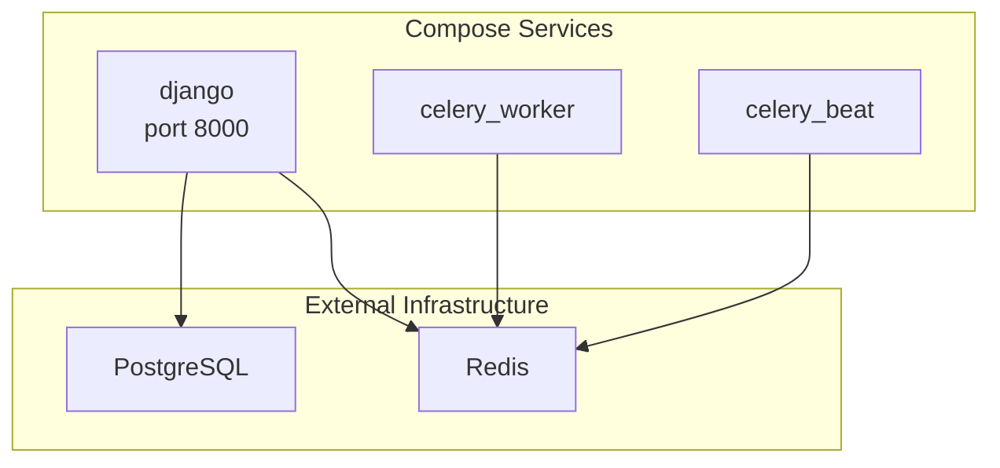
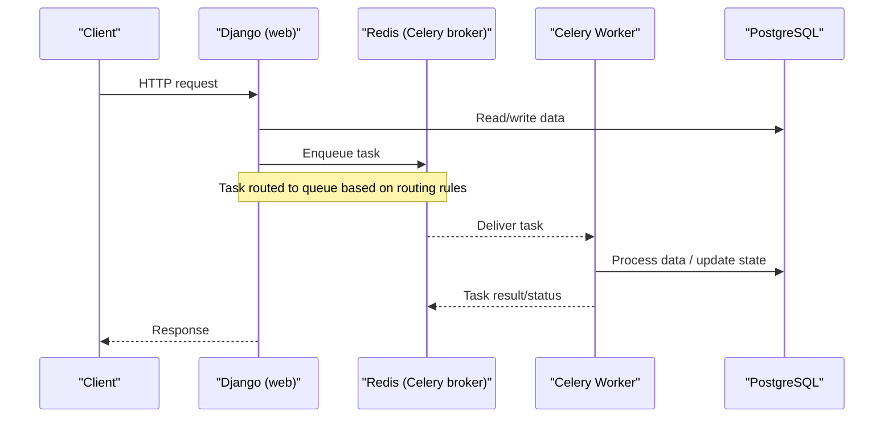
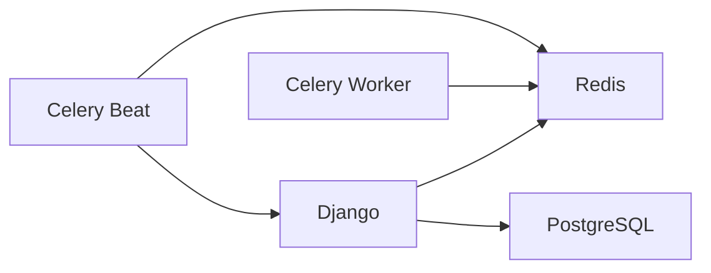

# Deployment & Operations

<cite>
**Referenced Files in This Document**
- [docker-compose.yml](file://docker-compose.yml)
- [Dockerfile](file://compose/local/django/Dockerfile)
- [entrypoint.sh](file://compose/local/django/entrypoint.sh)
- [start.sh](file://compose/local/django/start.sh)
- [base.py](file://config/settings/base.py)
- [local.py](file://config/settings/local.py)
- [production.py](file://config/settings/production.py)
- [celery.py](file://config/celery.py)
- [_native_env.sh](file://scripts/_native_env.sh)
- [run_backend.sh](file://scripts/run_backend.sh)
- [run_celery_worker.sh](file://scripts/run_celery_worker.sh)
- [env.md](file://docs/reference/env.md)
- [local-setup.md](file://docs/how-to/local-setup.md)
</cite>

## Table of Contents
1. [Introduction](#introduction)
2. [Project Structure](#project-structure)
3. [Core Components](#core-components)
4. [Architecture Overview](#architecture-overview)
5. [Detailed Component Analysis](#detailed-component-analysis)
6. [Dependency Analysis](#dependency-analysis)
7. [Performance Considerations](#performance-considerations)
8. [Troubleshooting Guide](#troubleshooting-guide)
9. [Conclusion](#conclusion)
10. [Appendices](#appendices)

## Introduction
This document provides deployment and operations guidance for FinanceAnalysis, focusing on the current local development setup using Docker Compose and planning for production deployments. It covers infrastructure requirements (PostgreSQL, Redis, web server), environment variable management, secrets handling, configuration best practices, monitoring/logging strategies, backup and disaster recovery, scaling considerations for Celery workers, database optimization, cache tuning, security hardening, SSL configuration, network security, operational runbooks, and performance monitoring/alerting.

## Project Structure
FinanceAnalysis is a Django-based backend with:
- A Django application exposing REST APIs and admin
- Celery workers and beat scheduler for background jobs and scheduled tasks
- Redis used as both Celery broker/result backend and Django cache/channel layer
- PostgreSQL as the primary data store
- A frontend served separately during development

The local stack can be run via native scripts or Docker Compose. The Compose file defines Django, Celery worker, and Celery Beat services sharing the same image and environment.

**Diagram sources**
- [docker-compose.yml:1-39](file://docker-compose.yml#L1-L39)
- [base.py:174-255](file://config/settings/base.py#L174-L255)
- [base.py:323-339](file://config/settings/base.py#L323-L339)

**Section sources**
- [docker-compose.yml:1-39](file://docker-compose.yml#L1-L39)
- [local-setup.md:22-23](file://docs/how-to/local-setup.md#L22-L23)

## Core Components
- Web server: Django development server exposed at port 8000 in local mode; entrypoint performs migrations and static collection before starting the server.
- Background processing: Celery worker(s) consume task queues; Celery Beat schedules periodic tasks.
- Data stores: PostgreSQL for persistent data; Redis for messaging, caching, and real-time channels.
- Configuration: Environment-driven via django-environ; settings split into base, local, and production profiles.

Key responsibilities:
- Django handles HTTP requests, authentication, API endpoints, admin, and orchestration of background work via Celery.
- Celery workers execute long-running or offloaded tasks such as data syncs, predictions, backtests, and model training.
- Redis decouples request/response from heavy workloads and powers caching and WebSocket channel layers.
- PostgreSQL persists all domain data and metadata.

**Section sources**
- [entrypoint.sh:6-13](file://compose/local/django/entrypoint.sh#L6-L13)
- [start.sh:1-7](file://compose/local/django/start.sh#L1-L7)
- [base.py:174-255](file://config/settings/base.py#L174-L255)
- [base.py:323-339](file://config/settings/base.py#L323-L339)
- [celery.py:1-17](file://config/celery.py#L1-L17)

## Architecture Overview
The runtime architecture consists of a Django web process, one or more Celery workers, and a Celery Beat scheduler, all backed by PostgreSQL and Redis.

**Diagram sources**
- [base.py:174-203](file://config/settings/base.py#L174-L203)
- [base.py:218-255](file://config/settings/base.py#L218-L255)
- [celery.py:1-17](file://config/celery.py#L1-L17)

## Detailed Component Analysis

### Docker Compose and Container Lifecycle
- Services:
  - django: Runs the Django dev server on port 8000 inside the container.
  - celery_worker: Runs a Celery worker consuming default queue unless overridden.
  - celery_beat: Schedules periodic tasks via Django-Celery-Beat.
- Image: Built from a Python 3.12 slim image that installs TA-Lib C library and project dependencies.
- Entrypoint: Executes Django migrations and collects static files before launching the provided command.
- Volumes: Source code mounted into /app for live reload during development.

Operational notes:
- Ensure external PostgreSQL and Redis are reachable from containers via .env variables.
- For production, replace the dev server with a WSGI/ASGI server behind a reverse proxy.

**Section sources**
- [docker-compose.yml:1-39](file://docker-compose.yml#L1-L39)
- [Dockerfile:1-53](file://compose/local/django/Dockerfile#L1-L53)
- [entrypoint.sh:6-13](file://compose/local/django/entrypoint.sh#L6-L13)
- [start.sh:1-7](file://compose/local/django/start.sh#L1-L7)

### Django Settings and Configuration
- Base settings define databases, caching, Celery, email, DRF, JWT, and scheduled tasks.
- Local settings enable debug and set allowed hosts for development.
- Production settings placeholder exists but requires full hardening and overrides.

Configuration highlights:
- Database URL read from environment; atomic requests enabled.
- Redis used for cache and Channels; separate logical databases for broker vs cache.
- Celery queues: ops, backtest, train-lightgbm, train-lstm with explicit routing.
- Scheduled tasks include daily market syncs, monthly index membership updates, alert checks, macro data syncs, news ingestion, sentiment pipeline, and prediction generation.

Best practices:
- Keep secrets out of version control; use environment injection or secret managers.
- Pin versions in production requirements and rebuild images deterministically.
- Use separate settings modules per environment and validate required variables at startup.

**Section sources**
- [base.py:122-126](file://config/settings/base.py#L122-L126)
- [base.py:174-255](file://config/settings/base.py#L174-L255)
- [base.py:264-339](file://config/settings/base.py#L264-L339)
- [local.py:1-20](file://config/settings/local.py#L1-L20)
- [production.py:1-4](file://config/settings/production.py#L1-L4)

### Celery Workers and Scheduling
- Celery app loads configuration from Django settings under the CELERY namespace.
- Default concurrency and time limits are set; task-specific overrides exist for long-running tasks.
- Queues are explicitly defined and routed; workers must subscribe to relevant queues.

Scaling guidance:
- Run multiple workers per queue for throughput.
- Tune concurrency per CPU cores and workload characteristics.
- Monitor queue depths and task latency; adjust worker counts accordingly.

**Section sources**
- [celery.py:1-17](file://config/celery.py#L1-L17)
- [base.py:174-203](file://config/settings/base.py#L174-L203)
- [base.py:218-255](file://config/settings/base.py#L218-L255)
- [run_celery_worker.sh:1-28](file://scripts/run_celery_worker.sh#L1-L28)

### Environment Variables and Secrets Management
Environment variables drive all runtime configuration. The generated reference documents every variable read by settings, including defaults and locations.

Key variables:
- DATABASE_URL: Required connection string to PostgreSQL.
- REDIS_URL: Cache and Channels layer (logical db 1).
- CELERY_BROKER_URL: Celery broker and result backend (logical db 0).
- DJANGO_SECRET_KEY: Signing key for sessions/JWT.
- TUSHARE_TOKEN: External data provider token.
- Email settings: EMAIL_HOST, EMAIL_PORT, EMAIL_USE_TLS, EMAIL_HOST_USER, EMAIL_HOST_PASSWORD.
- Feature toggles and tuning: MACRO_* and NEWS_BACKFILL_* keys.

Secrets handling:
- Do not commit secrets; inject via orchestrator secrets or secure env files.
- Validate presence of required variables at startup.
- Rotate secrets regularly and ensure dependent services are updated atomically.

**Section sources**
- [env.md:1-65](file://docs/reference/env.md#L1-L65)
- [base.py:30-31](file://config/settings/base.py#L30-L31)
- [base.py:122-126](file://config/settings/base.py#L122-L126)
- [base.py:174-203](file://config/settings/base.py#L174-L203)
- [base.py:323-339](file://config/settings/base.py#L323-L339)
- [base.py:341-393](file://config/settings/base.py#L341-L393)
- [base.py:395-403](file://config/settings/base.py#L395-L403)

### Infrastructure Requirements
- PostgreSQL:
  - Version compatible with Django and psycopg2-binary.
  - Provide a dedicated database and user with least privilege.
  - Configure TLS for connections in production.
- Redis:
  - Separate logical databases for broker (db 0) and cache/channels (db 1).
  - Enable authentication and memory policies suitable for persistence needs.
  - Size memory appropriately; monitor eviction behavior.
- Web Server:
  - In production, place Django behind a reverse proxy (e.g., Nginx/Traefik) for SSL termination, rate limiting, and static asset serving.
  - Use a WSGI/ASGI server optimized for production.

**Section sources**
- [base.py:122-126](file://config/settings/base.py#L122-L126)
- [base.py:174-203](file://config/settings/base.py#L174-L203)
- [base.py:323-339](file://config/settings/base.py#L323-L339)
- [local-setup.md:27-40](file://docs/how-to/local-setup.md#L27-L40)
- [local-setup.md:43-133](file://docs/how-to/local-setup.md#L43-L133)

### Monitoring and Logging
- Application logs: Standard Python logging; configure structured logging in production.
- Celery metrics: Track queue lengths, task durations, failures; integrate with observability platforms.
- Database metrics: Query performance, connection pool usage, slow queries.
- Redis metrics: Memory usage, hit rates, eviction events, client connections.
- Frontend/API metrics: Request latency, error rates, throughput.

Recommendations:
- Centralize logs (e.g., JSON to stdout) and ship to a log aggregator.
- Export Prometheus metrics where applicable; set up dashboards and alerts.
- Instrument Celery tasks with timing and error tracking.

[No sources needed since this section provides general guidance]

### Backup Procedures and Disaster Recovery
- PostgreSQL backups:
  - Schedule regular logical backups (e.g., pg_dump) and physical backups (WAL archiving).
  - Test restore procedures periodically.
  - Retain backups according to compliance requirements.
- Redis:
  - Decide between RDB/AOF persistence based on durability vs performance needs.
  - Back up persisted snapshots if used.
- Model artifacts and static assets:
  - Version and back up model metadata and artifacts stored outside the database.
  - Ensure staticfiles are reproducible from build artifacts.

Disaster recovery plan:
- Define RTO/RPO targets.
- Maintain runbooks for failover, data restoration, and service restarts.
- Practice incident response drills.

[No sources needed since this section provides general guidance]

### Scaling Considerations
- Celery workers:
  - Scale horizontally by adding workers per queue.
  - Tune concurrency based on CPU/memory and task nature.
  - Use separate workers for compute-heavy tasks (backtests, training).
- Database:
  - Index frequently queried columns; analyze query plans.
  - Use connection pooling (e.g., PgBouncer) if needed.
  - Partition large tables if necessary.
- Cache:
  - Size Redis memory; monitor eviction and fragmentation.
  - Use appropriate TTLs and cache invalidation strategies.

**Section sources**
- [base.py:174-203](file://config/settings/base.py#L174-L203)
- [base.py:323-339](file://config/settings/base.py#L323-L339)
- [run_celery_worker.sh:1-28](file://scripts/run_celery_worker.sh#L1-L28)

### Security Hardening, SSL, and Network Security
- Secrets:
  - Never commit secrets; inject via orchestrators or secret managers.
  - Rotate keys and tokens regularly.
- Django:
  - Disable DEBUG in production.
  - Restrict ALLOWED_HOSTS.
  - Enforce HTTPS and secure cookies.
- Reverse Proxy:
  - Terminate SSL at the proxy; enforce strong cipher suites.
  - Enable HSTS and security headers.
- Network:
  - Isolate services in private networks; expose only necessary ports.
  - Use firewall rules to restrict access to PostgreSQL and Redis.
  - Prefer internal service discovery and mTLS where possible.

**Section sources**
- [local.py:1-20](file://config/settings/local.py#L1-L20)
- [base.py:303-321](file://config/settings/base.py#L303-L321)

### Operational Runbooks

#### Database Maintenance
- Verify connectivity and permissions.
- Run migrations safely during low-traffic windows.
- Analyze and vacuum tables; check replication lag if applicable.
- Validate backups and test restores.

**Section sources**
- [entrypoint.sh:6-13](file://compose/local/django/entrypoint.sh#L6-L13)
- [local-setup.md:27-40](file://docs/how-to/local-setup.md#L27-L40)

#### Model Updates
- Store model artifacts with versioned metadata.
- Update references in configuration or database records.
- Roll out changes with feature flags or blue/green strategy.
- Validate predictions post-deployment.

[No sources needed since this section provides general guidance]

#### System Upgrades
- Upgrade Python packages and rebuild images.
- Test migrations and backward compatibility.
- Perform staged rollouts with rollback plans.
- Monitor metrics and logs closely during upgrade.

[No sources needed since this section provides general guidance]

### Performance Monitoring, Error Tracking, and Alerting
- Metrics:
  - Track API latency, error rates, queue depth, task duration, DB query times, Redis memory and hit ratios.
- Error tracking:
  - Capture exceptions with context; correlate with request IDs and task IDs.
- Alerting:
  - Alert on high error rates, queue backlogs, DB connection exhaustion, Redis memory pressure, and failed backups.
- Dashboards:
  - Provide unified views for SREs and developers.

[No sources needed since this section provides general guidance]

## Dependency Analysis
Runtime dependencies:
- Django depends on PostgreSQL and Redis.
- Celery depends on Redis for broker and results.
- Channels depend on Redis for real-time communication.
- Scheduled tasks rely on Celery Beat and database-backed scheduler.

**Diagram sources**
- [base.py:122-126](file://config/settings/base.py#L122-L126)
- [base.py:174-203](file://config/settings/base.py#L174-L203)
- [base.py:218-255](file://config/settings/base.py#L218-L255)
- [base.py:323-339](file://config/settings/base.py#L323-L339)

**Section sources**
- [base.py:122-126](file://config/settings/base.py#L122-L126)
- [base.py:174-255](file://config/settings/base.py#L174-L255)
- [base.py:323-339](file://config/settings/base.py#L323-L339)

## Performance Considerations
- Database:
  - Use appropriate indexes and query optimizations.
  - Monitor slow queries and connection pools.
- Redis:
  - Set memory limits and eviction policies aligned with workload.
  - Avoid large values in cache; prefer references when possible.
- Celery:
  - Tune concurrency and time limits per queue.
  - Separate workers for heavy tasks to avoid contention.
- Static assets:
  - Serve via CDN or reverse proxy in production.

[No sources needed since this section provides general guidance]

## Troubleshooting Guide
Common issues and resolutions:
- Redis authentication errors:
  - Verify REDIS_URL and CELERY_BROKER_URL credentials and ACL configuration.
  - Confirm correct logical databases for broker vs cache.
- Celery tasks not executing:
  - Ensure workers subscribe to the correct queues.
  - Check broker connectivity and queue depths.
- Migrations failing:
  - Validate database connectivity and permissions.
  - Review migration history and apply missing migrations.
- Time limit exceeded:
  - Adjust soft/hard limits for specific tasks if needed.

Verification steps:
- Use provided verification scripts to probe PostgreSQL and Redis connectivity.
- Run Django system checks and confirm migrations are applied.

**Section sources**
- [local-setup.md:43-133](file://docs/how-to/local-setup.md#L43-L133)
- [local-setup.md:249-267](file://docs/how-to/local-setup.md#L249-L267)
- [local-setup.md:334-408](file://docs/how-to/local-setup.md#L334-L408)

## Conclusion
FinanceAnalysis operates as a Django web service backed by PostgreSQL and Redis, with Celery workers and Beat handling background and scheduled workloads. For local development, Docker Compose simplifies orchestration, while production should employ hardened configurations, proper secrets management, reverse proxy SSL termination, robust monitoring, and comprehensive backup and disaster recovery procedures. Scaling focuses on horizontal worker expansion, database tuning, and cache optimization.

[No sources needed since this section summarizes without analyzing specific files]

## Appendices

### Local Development Quick Start
- Provision PostgreSQL and Redis externally.
- Configure .env with required variables.
- Verify connectivity and run migrations.
- Start backend, Celery workers (per queue), and Celery Beat.
- Access API and admin endpoints.

**Section sources**
- [local-setup.md:27-40](file://docs/how-to/local-setup.md#L27-L40)
- [local-setup.md:43-133](file://docs/how-to/local-setup.md#L43-L133)
- [local-setup.md:216-246](file://docs/how-to/local-setup.md#L216-L246)
- [local-setup.md:249-267](file://docs/how-to/local-setup.md#L249-L267)
- [local-setup.md:297-331](file://docs/how-to/local-setup.md#L297-L331)
- [local-setup.md:334-408](file://docs/how-to/local-setup.md#L334-L408)

### Environment Variable Reference Summary
- See the generated environment reference for the complete list of variables, types, defaults, and read locations.
- Ensure critical variables like DATABASE_URL, REDIS_URL, CELERY_BROKER_URL, and DJANGO_SECRET_KEY are configured securely.

**Section sources**
- [env.md:1-65](file://docs/reference/env.md#L1-L65)