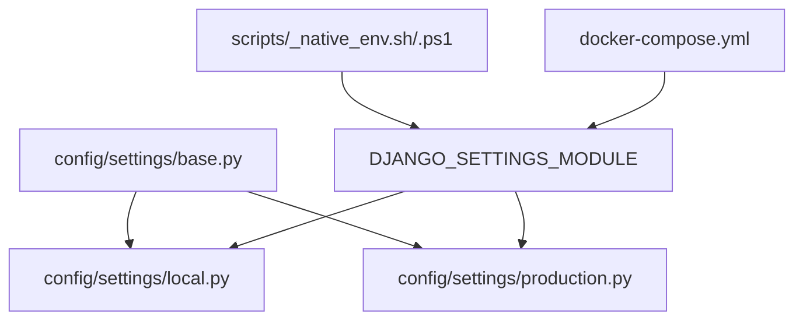
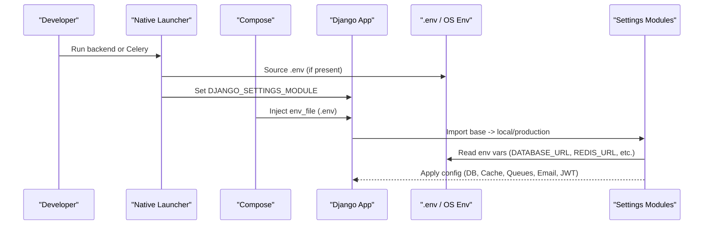
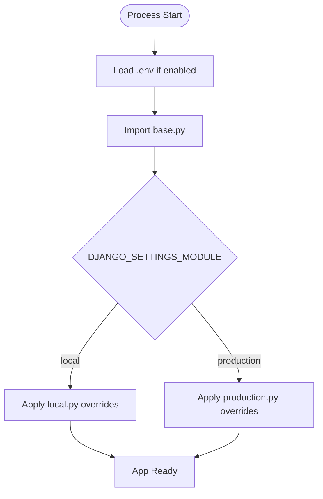
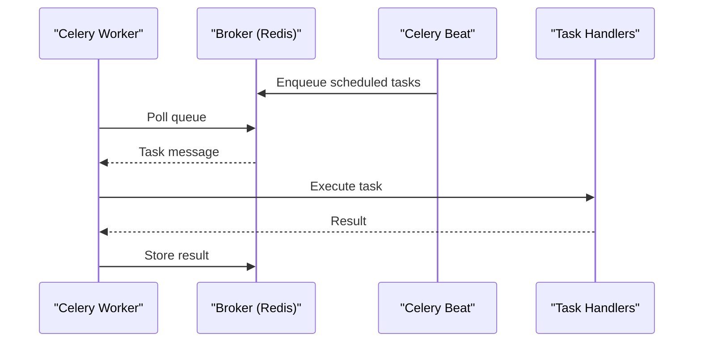
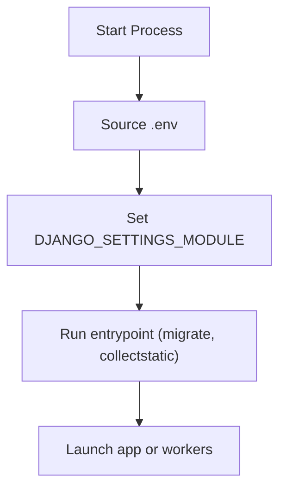
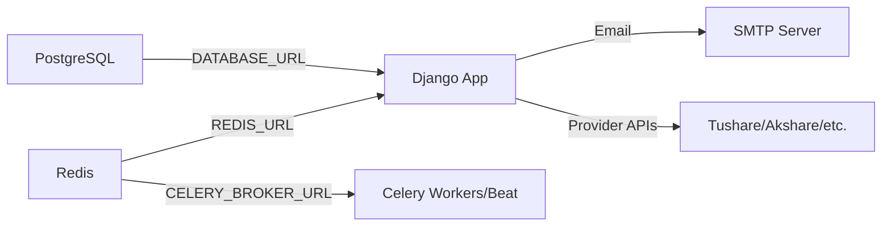

# Environment Configuration

<cite>
**Referenced Files in This Document**
- [base.py](file://config/settings/base.py)
- [local.py](file://config/settings/local.py)
- [production.py](file://config/settings/production.py)
- [_native_env.sh](file://scripts/_native_env.sh)
- [_native_env.ps1](file://scripts/_native_env.ps1)
- [docker-compose.yml](file://docker-compose.yml)
- [Dockerfile](file://compose/local/django/Dockerfile)
- [entrypoint.sh](file://compose/local/django/entrypoint.sh)
- [start.sh](file://compose/local/django/start.sh)
- [env.md](file://docs/reference/env.md)
</cite>

## Table of Contents
1. Introduction
2. Project Structure
3. Core Components
4. Architecture Overview
5. Detailed Component Analysis
6. Dependency Analysis
7. Performance Considerations
8. Troubleshooting Guide
9. Conclusion
10. Appendices

## Introduction
This document explains how FinanceAnalysis loads and applies environment configuration across development, staging, and production. It covers:
- Where settings are defined and how they inherit
- Which environment variables control behavior
- How to configure databases, caching, Celery, email, third-party providers, and security
- Example .env setups per environment
- Validation and troubleshooting tips
- Secrets management and secure configuration practices

## Project Structure
Configuration is layered:
- Base settings define defaults and read environment variables
- Local overrides enable debug and local-friendly defaults
- Production inherits base and should add strict production-only settings
- Launchers (scripts and Docker Compose) set the active settings module and load .env files

**Diagram sources**
- [base.py:23-28](file://config/settings/base.py#L23-L28)
- [local.py:1-12](file://config/settings/local.py#L1-L12)
- [production.py:1-4](file://config/settings/production.py#L1-L4)
- [_native_env.sh:79-83](file://scripts/_native_env.sh#L79-L83)
- [_native_env.ps1:156-159](file://scripts/_native_env.ps1#L156-L159)
- [docker-compose.yml:10-11](file://docker-compose.yml#L10-L11)

**Section sources**
- [base.py:23-28](file://config/settings/base.py#L23-L28)
- [local.py:1-12](file://config/settings/local.py#L1-L12)
- [production.py:1-4](file://config/settings/production.py#L1-L4)
- [_native_env.sh:79-83](file://scripts/_native_env.sh#L79-L83)
- [_native_env.ps1:156-159](file://scripts/_native_env.ps1#L156-L159)
- [docker-compose.yml:10-11](file://docker-compose.yml#L10-L11)

## Core Components
- Settings inheritance:
  - base.py reads env via django-environ and defines defaults for DB, cache, queues, email, JWT, etc.
  - local.py sets DEBUG=True and a local SECRET_KEY; it also allows convenient host lists for dev.
  - production.py imports base and should be extended with production-only hardening.
- Environment loading:
  - Native scripts source .env at project root and export DJANGO_SETTINGS_MODULE and DJANGO_READ_DOT_ENV_FILE.
  - Docker Compose injects .env into containers for Django, Celery worker, and Beat.
- Key runtime toggles:
  - Database URL, Redis URL, broker URL, secret key, allowed hosts, email backend, and feature flags.

**Section sources**
- [base.py:122-126](file://config/settings/base.py#L122-L126)
- [base.py:174-203](file://config/settings/base.py#L174-L203)
- [base.py:303-321](file://config/settings/base.py#L303-L321)
- [base.py:323-339](file://config/settings/base.py#L323-L339)
- [base.py:341-393](file://config/settings/base.py#L341-L393)
- [local.py:1-12](file://config/settings/local.py#L1-L12)
- [_native_env.sh:72-83](file://scripts/_native_env.sh#L72-L83)
- [_native_env.ps1:110-159](file://scripts/_native_env.ps1#L110-L159)
- [docker-compose.yml:1-39](file://docker-compose.yml#L1-L39)

## Architecture Overview
Environment resolution flow from process start to application runtime:

**Diagram sources**
- [_native_env.sh:72-83](file://scripts/_native_env.sh#L72-L83)
- [_native_env.ps1:110-159](file://scripts/_native_env.ps1#L110-L159)
- [docker-compose.yml:10-11](file://docker-compose.yml#L10-L11)
- [base.py:23-28](file://config/settings/base.py#L23-L28)

## Detailed Component Analysis

### Settings Inheritance and Overrides
- base.py:
  - Reads DJANGO_READ_DOT_ENV_FILE to optionally load .env at startup.
  - Defines database, Celery, cache, email, JWT, and feature flags with safe defaults.
- local.py:
  - Enables DEBUG and provides a local SECRET_KEY and ALLOWED_HOSTS list.
- production.py:
  - Inherits base; extend here for production-only values (e.g., strict ALLOWED_HOSTS, logging, secrets).

**Diagram sources**
- [base.py:23-28](file://config/settings/base.py#L23-L28)
- [local.py:1-12](file://config/settings/local.py#L1-L12)
- [production.py:1-4](file://config/settings/production.py#L1-L4)
- [_native_env.sh:79-83](file://scripts/_native_env.sh#L79-L83)
- [_native_env.ps1:156-159](file://scripts/_native_env.ps1#L156-L159)

**Section sources**
- [base.py:23-28](file://config/settings/base.py#L23-L28)
- [local.py:1-12](file://config/settings/local.py#L1-L12)
- [production.py:1-4](file://config/settings/production.py#L1-L4)

### Database Configuration
- Variable: DATABASE_URL (required by base settings)
- Behavior: Parsed by django-environ to build Django’s default database connection.
- Notes: Ensure the database service is reachable and credentials are correct.

**Section sources**
- [base.py:122-126](file://config/settings/base.py#L122-L126)

### Caching and Channels (Redis)
- Variables:
  - REDIS_URL: Used for Django cache backend and Channels layer.
- Behavior: Defaults to localhost Redis on a dedicated DB index.

**Section sources**
- [base.py:323-339](file://config/settings/base.py#L323-L339)

### Celery Broker and Scheduling
- Variables:
  - CELERY_BROKER_URL: Message broker (default Redis).
  - CELERY_RESULT_BACKEND: Result backend (defaults to broker URL).
- Behavior:
  - Default queues and task routing are configured.
  - Scheduled tasks are defined via Celery Beat.

**Diagram sources**
- [base.py:174-203](file://config/settings/base.py#L174-L203)

**Section sources**
- [base.py:174-203](file://config/settings/base.py#L174-L203)

### Email Configuration
- Variables:
  - EMAIL_BACKEND, EMAIL_HOST, EMAIL_PORT, EMAIL_USE_TLS, EMAIL_HOST_USER, EMAIL_HOST_PASSWORD, DEFAULT_FROM_EMAIL
- Behavior: Console backend by default; override for SMTP in non-dev environments.

**Section sources**
- [base.py:341-393](file://config/settings/base.py#L341-L393)

### Authentication and Security
- Variables:
  - DJANGO_SECRET_KEY: Used by SimpleJWT signing key and Django security.
  - DJANGO_ALLOWED_HOSTS: Allowed hosts for requests.
  - DJANGO_DEBUG: Controls debug mode.
- Behavior:
  - JWT token lifetimes and algorithm are set in settings.
  - API authentication supports JWT and API keys.

**Section sources**
- [base.py:303-321](file://config/settings/base.py#L303-L321)
- [local.py:1-12](file://config/settings/local.py#L1-L12)

### Third-Party Providers and Feature Flags
- Variables:
  - TUSHARE_TOKEN: Token for data provider.
  - MACRO_SYNC_PRIMARY_PROVIDER, MACRO_SYNC_FALLBACK_PROVIDER, MACRO_SYNC_PROVIDER_SLEEP_SECONDS
  - NEWS_BACKFILL_ENABLED, NEWS_BACKFILL_PROVIDER, NEWS_BACKFILL_CHUNK_DAYS, NEWS_BACKFILL_FLOOR, NEWS_BACKFILL_LIMIT_PER_PROVIDER
  - CAPITAL_FLOW_DAILY_SYNC_LOOKBACK_DAYS
  - HISTORICAL_DATA_FLOOR
- Behavior: Controls data backfill windows, provider selection, and throttling.

**Section sources**
- [base.py:30-31](file://config/settings/base.py#L30-L31)
- [base.py:204-217](file://config/settings/base.py#L204-L217)

### Frontend Integration
- Variable: FRONTEND_URL
- Behavior: Used by backend to reference frontend origin when needed.

**Section sources**
- [base.py:395-398](file://config/settings/base.py#L395-L398)

### Alerting and SMS
- Variables:
  - ALERTS_ENABLE_SMS: Toggle SMS alerts.
  - SMS_WEBHOOK_URL: Endpoint for sending SMS notifications.

**Section sources**
- [base.py:399-403](file://config/settings/base.py#L399-L403)

### Environment Loading and Launchers
- Native scripts:
  - Source .env at project root.
  - Export DJANGO_SETTINGS_MODULE and DJANGO_READ_DOT_ENV_FILE.
  - Provide sensible defaults for Celery broker/result backend.
- Docker Compose:
  - Injects .env into all services (Django, Celery worker, Beat).
- Entrypoint:
  - Runs migrations and collects static files before starting the server.

**Diagram sources**
- [_native_env.sh:72-83](file://scripts/_native_env.sh#L72-L83)
- [_native_env.ps1:110-159](file://scripts/_native_env.ps1#L110-L159)
- [docker-compose.yml:10-11](file://docker-compose.yml#L10-L11)
- [entrypoint.sh:1-14](file://compose/local/django/entrypoint.sh#L1-L14)
- [start.sh:1-7](file://compose/local/django/start.sh#L1-L7)

**Section sources**
- [_native_env.sh:72-83](file://scripts/_native_env.sh#L72-L83)
- [_native_env.ps1:110-159](file://scripts/_native_env.ps1#L110-L159)
- [docker-compose.yml:1-39](file://docker-compose.yml#L1-L39)
- [entrypoint.sh:1-14](file://compose/local/django/entrypoint.sh#L1-L14)
- [start.sh:1-7](file://compose/local/django/start.sh#L1-L7)

## Dependency Analysis
Key environment dependencies:
- Database: DATABASE_URL must point to a running PostgreSQL instance.
- Cache/Channels: REDIS_URL must reach a Redis server.
- Celery: CELERY_BROKER_URL must reach the same broker used by workers.
- Email: SMTP settings required only if using an email backend other than console.
- Providers: TUSHARE_TOKEN and macro/news backfill flags determine data pipeline behavior.

**Diagram sources**
- [base.py:122-126](file://config/settings/base.py#L122-L126)
- [base.py:174-203](file://config/settings/base.py#L174-L203)
- [base.py:323-339](file://config/settings/base.py#L323-L339)
- [base.py:341-393](file://config/settings/base.py#L341-L393)

**Section sources**
- [base.py:122-126](file://config/settings/base.py#L122-L126)
- [base.py:174-203](file://config/settings/base.py#L174-L203)
- [base.py:323-339](file://config/settings/base.py#L323-L339)
- [base.py:341-393](file://config/settings/base.py#L341-L393)

## Performance Considerations
- Use separate Redis instances or DB indices for cache vs. channels vs. broker to avoid contention.
- Tune Celery time limits and queues based on workload size.
- Limit backfill windows and chunk sizes to balance freshness and throughput.
- Enable TLS for email and use strong secrets in production.

[No sources needed since this section provides general guidance]

## Troubleshooting Guide
Common issues and checks:
- Missing or invalid DATABASE_URL:
  - Verify connectivity and credentials; ensure migrations can run.
- Redis not reachable:
  - Confirm REDIS_URL and firewall rules; check that both cache and channels use the same endpoint.
- Celery cannot connect:
  - Ensure CELERY_BROKER_URL matches the broker address; verify worker and beat processes are running.
- Debugging in production:
  - Keep DJANGO_DEBUG=False; rely on structured logs and metrics instead.
- Allowed hosts errors:
  - Set DJANGO_ALLOWED_HOSTS appropriately for your domain(s).
- Email not sending:
  - Configure EMAIL_* variables and test with a real SMTP backend.
- Provider failures:
  - Check TUSHARE_TOKEN and provider-specific flags; adjust sleep/retry settings if rate-limited.

Validation aids:
- The repository includes a generated environment variable reference that enumerates every env() read and its defaults. Use it to cross-check your .env against what the app actually consumes.

**Section sources**
- [env.md:11-65](file://docs/reference/env.md#L11-L65)

## Conclusion
FinanceAnalysis uses a layered settings approach with explicit environment variable injection. For reliable deployments:
- Define DATABASE_URL, REDIS_URL, and DJANGO_SECRET_KEY in every environment.
- Use local.py for development and extend production.py for hardened production settings.
- Manage secrets via environment variables injected by your platform (Compose, CI/CD, secrets manager).
- Validate configuration using the generated env reference and health checks.

[No sources needed since this section summarizes without analyzing specific files]

## Appendices

### Environment-Specific Examples

- Development (.env):
  - DATABASE_URL pointing to local Postgres
  - REDIS_URL pointing to local Redis
  - DJANGO_DEBUG=True
  - DJANGO_SECRET_KEY set to a local value
  - DJANGO_ALLOWED_HOSTS including localhost and loopback addresses
  - Optional: TUSHARE_TOKEN for data access

- Staging (.env):
  - DATABASE_URL to staging database
  - REDIS_URL to staging Redis
  - DJANGO_DEBUG=False
  - DJANGO_SECRET_KEY from secrets store
  - DJANGO_ALLOWED_HOSTS set to staging domains
  - Email configured for SMTP
  - Provider tokens and flags tuned for staging workloads

- Production (.env):
  - DATABASE_URL to production database
  - REDIS_URL to production Redis
  - DJANGO_DEBUG=False
  - DJANGO_SECRET_KEY from secrets store
  - DJANGO_ALLOWED_HOSTS restricted to production domains
  - Email configured with TLS
  - Strict provider quotas and backfill windows
  - Alerts and monitoring hooks configured

[No sources needed since this section provides example configurations]

### Configuration Validation Checklist
- All required variables are present (e.g., DATABASE_URL).
- URLs are reachable from the application container/process.
- Secret keys are unique per environment and stored securely.
- Allowed hosts match the deployment domain(s).
- Celery queues and schedules align with expected workloads.
- Email backend and credentials are valid for the target environment.

[No sources needed since this section provides general guidance]

### Secrets Management Strategies
- Use platform-provided secrets injection (Compose env_file, CI/CD vaults, cloud secret managers).
- Never commit secrets to version control; keep .env out of repositories.
- Rotate secrets regularly and audit access.
- Prefer environment variables over file-based secrets where possible.

[No sources needed since this section provides general guidance]