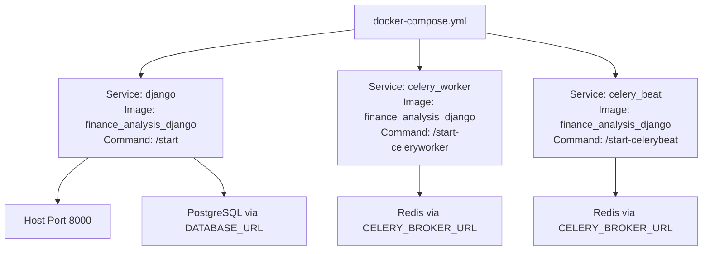
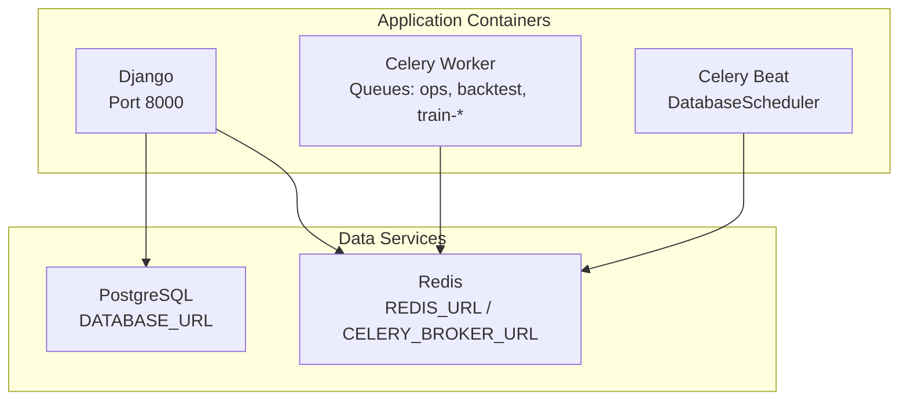
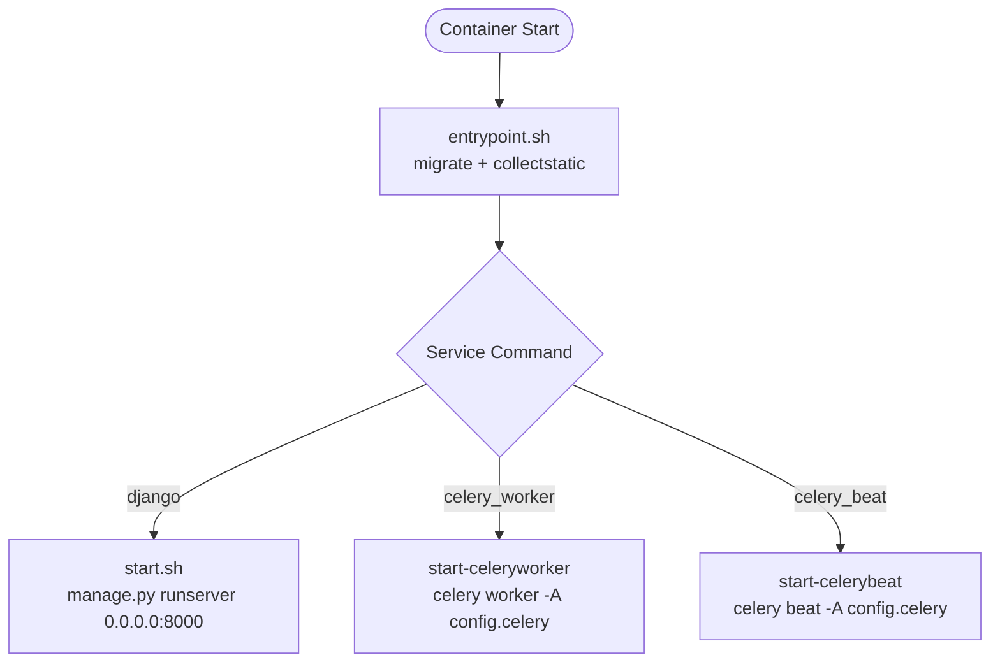
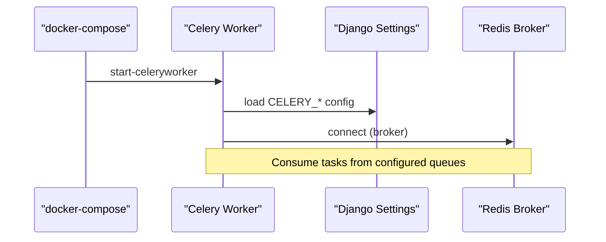
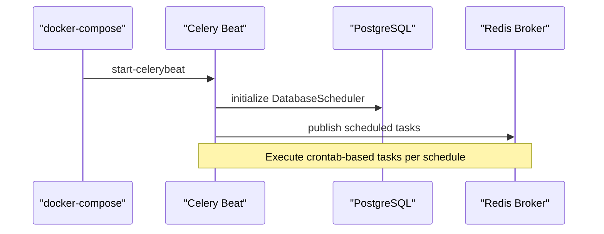
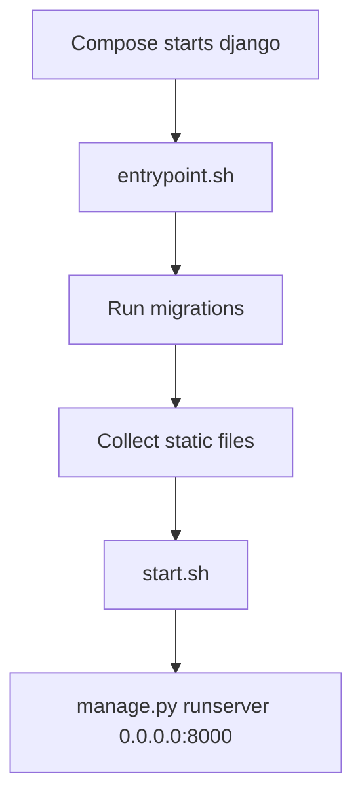
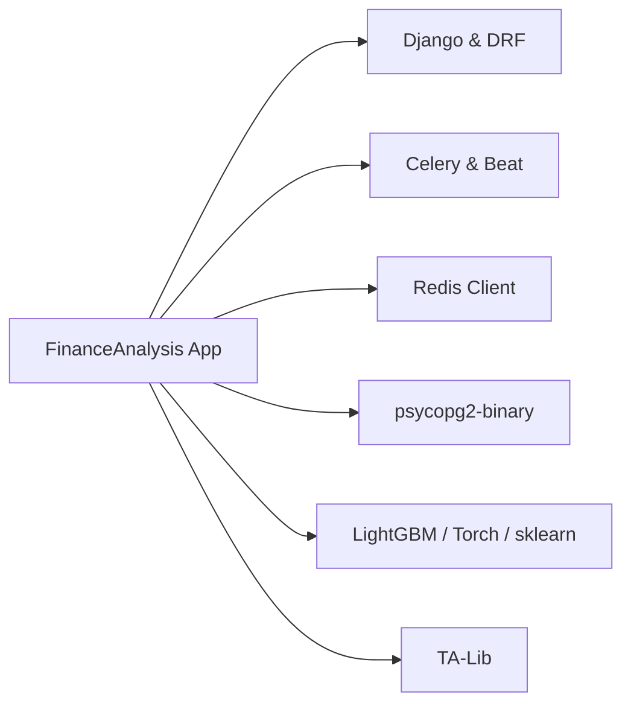

# Infrastructure Setup

<cite>
**Referenced Files in This Document**
- [docker-compose.yml](file://docker-compose.yml)
- [Dockerfile](file://compose/local/django/Dockerfile)
- [entrypoint.sh](file://compose/local/django/entrypoint.sh)
- [start.sh](file://compose/local/django/start.sh)
- [base.py](file://config/settings/base.py)
- [production.py](file://config/settings/production.py)
- [celery.py](file://config/celery.py)
- [run_celery_worker.sh](file://scripts/run_celery_worker.sh)
- [run_celery_beat.sh](file://scripts/run_celery_beat.sh)
- [run_backend.sh](file://scripts/run_backend.sh)
- [base.txt](file://requirements/base.txt)
</cite>

## Table of Contents
1. Introduction
2. Project Structure
3. Core Components
4. Architecture Overview
5. Detailed Component Analysis
6. Dependency Analysis
7. Performance Considerations
8. Troubleshooting Guide
9. Conclusion

## Introduction
This document describes the infrastructure setup for FinanceAnalysis using Docker and docker-compose. It covers the Django web service, Celery worker, and Celery Beat services; their orchestration and networking; PostgreSQL database and Redis cache configuration; external service requirements; environment variable management; secrets handling; and performance tuning recommendations.

## Project Structure
FinanceAnalysis is containerized with a single Python image that runs three services:
- Django (web server on port 8000)
- Celery worker (background task processing)
- Celery Beat (scheduled tasks)

The compose file defines these services, mounts the project directory into containers, loads environment variables from .env, and sets entry commands to start each service. The Dockerfile installs system dependencies (including TA-Lib), Python packages, and copies runtime scripts.

**Diagram sources**
- [docker-compose.yml:1-39](file://docker-compose.yml#L1-L39)
- [base.py:174-255](file://config/settings/base.py#L174-L255)

**Section sources**
- [docker-compose.yml:1-39](file://docker-compose.yml#L1-L39)
- [Dockerfile:1-53](file://compose/local/django/Dockerfile#L1-L53)

## Core Components
- Django Web Service: Serves API and admin, uses PostgreSQL for persistence and Redis for caching and channels.
- Celery Worker: Processes background jobs across multiple queues (ops, backtest, train-lightgbm, train-lstm).
- Celery Beat: Schedules periodic tasks using a database-backed scheduler.

Environment-driven configuration:
- Database URL via DATABASE_URL
- Broker/cache URL via REDIS_URL and CELERY_BROKER_URL
- Feature toggles and provider settings via environment variables

**Section sources**
- [base.py:122-126](file://config/settings/base.py#L122-L126)
- [base.py:174-255](file://config/settings/base.py#L174-L255)
- [base.py:323-339](file://config/settings/base.py#L323-L339)

## Architecture Overview
The system consists of three application containers sharing a common image and environment. They communicate over the default Docker network:
- Django exposes HTTP on port 8000.
- Celery Worker and Beat connect to Redis for messaging and scheduling.
- All services connect to PostgreSQL for data persistence.

**Diagram sources**
- [docker-compose.yml:1-39](file://docker-compose.yml#L1-L39)
- [base.py:174-255](file://config/settings/base.py#L174-L255)
- [base.py:323-339](file://config/settings/base.py#L323-L339)

## Detailed Component Analysis

### Docker Image and Entrypoints
- Base image: Python 3.12 slim with TA-Lib installed at build time.
- Entrypoint performs migrations and static collection before executing the provided command.
- Start scripts launch Django runserver, Celery worker, or Celery Beat depending on the service.

**Diagram sources**
- [Dockerfile:8-48](file://compose/local/django/Dockerfile#L8-L48)
- [entrypoint.sh:1-14](file://compose/local/django/entrypoint.sh#L1-L14)
- [start.sh:1-7](file://compose/local/django/start.sh#L1-L7)

**Section sources**
- [Dockerfile:1-53](file://compose/local/django/Dockerfile#L1-L53)
- [entrypoint.sh:1-14](file://compose/local/django/entrypoint.sh#L1-L14)
- [start.sh:1-7](file://compose/local/django/start.sh#L1-L7)

### Celery Worker Configuration
- Worker discovers tasks from Django apps and reads configuration from Django settings under the CELERY namespace.
- Queues are defined in settings; workers can be launched with specific queues and concurrency via scripts.

**Diagram sources**
- [celery.py:1-17](file://config/celery.py#L1-L17)
- [base.py:174-203](file://config/settings/base.py#L174-L203)
- [run_celery_worker.sh:1-28](file://scripts/run_celery_worker.sh#L1-L28)

**Section sources**
- [celery.py:1-17](file://config/celery.py#L1-L17)
- [base.py:174-203](file://config/settings/base.py#L174-L203)
- [run_celery_worker.sh:1-28](file://scripts/run_celery_worker.sh#L1-L28)

### Celery Beat Scheduler
- Uses Django-Celery-Beat with a database-backed scheduler.
- Periodic tasks are defined in settings and executed by Beat.

**Diagram sources**
- [base.py:203-255](file://config/settings/base.py#L203-L255)
- [run_celery_beat.sh:1-12](file://scripts/run_celery_beat.sh#L1-L12)

**Section sources**
- [base.py:203-255](file://config/settings/base.py#L203-L255)
- [run_celery_beat.sh:1-12](file://scripts/run_celery_beat.sh#L1-L12)

### Django Application Startup
- Entrypoint runs migrations and collects static files before starting the server.
- Server binds to 0.0.0.0:8000 inside the container and is exposed to the host.

**Diagram sources**
- [entrypoint.sh:1-14](file://compose/local/django/entrypoint.sh#L1-L14)
- [start.sh:1-7](file://compose/local/django/start.sh#L1-L7)

**Section sources**
- [entrypoint.sh:1-14](file://compose/local/django/entrypoint.sh#L1-L14)
- [start.sh:1-7](file://compose/local/django/start.sh#L1-L7)

### Environment Variables and Secrets
Key environment variables used by the application:
- Database: DATABASE_URL
- Cache/Broker: REDIS_URL, CELERY_BROKER_URL
- Debug and app flags: DJANGO_DEBUG, DJANGO_READ_DOT_ENV_FILE
- External providers and features: TUSHARE_TOKEN, MACRO_SYNC_PRIMARY_PROVIDER, NEWS_BACKFILL_ENABLED, etc.
- Email: EMAIL_BACKEND, EMAIL_HOST, EMAIL_PORT, EMAIL_USE_TLS, EMAIL_HOST_USER, EMAIL_HOST_PASSWORD
- Frontend: FRONTEND_URL
- Alerts: ALERTS_ENABLE_SMS, SMS_WEBHOOK_URL

Best practices:
- Store secrets in .env files not committed to version control.
- Use environment-specific files (e.g., .envs/.env.local, .envs/.env.production) and reference them via docker-compose env_file.
- Prefer OS-level secret managers or CI/CD secret injection for production.

**Section sources**
- [base.py:23-30](file://config/settings/base.py#L23-L30)
- [base.py:37-37](file://config/settings/base.py#L37-L37)
- [base.py:174-255](file://config/settings/base.py#L174-L255)
- [base.py:323-339](file://config/settings/base.py#L323-L339)
- [base.py:341-347](file://config/settings/base.py#L341-L347)
- [base.py:395-403](file://config/settings/base.py#L395-L403)

### Networking and Ports
- Django service publishes port 8000 to the host.
- Internal communication between services occurs over the default Docker network created by docker-compose.
- Ensure PostgreSQL and Redis are reachable via their service names or URLs if deployed as separate containers.

**Section sources**
- [docker-compose.yml:1-39](file://docker-compose.yml#L1-L39)

## Dependency Analysis
External dependencies and libraries:
- Django, DRF, Channels, Redis client, Celery, Django-Celery-Beat, psycopg2-binary, TA-Lib, ML stacks (LightGBM, PyTorch, scikit-learn), and others.

**Diagram sources**
- [base.txt:1-23](file://requirements/base.txt#L1-L23)

**Section sources**
- [base.txt:1-23](file://requirements/base.txt#L1-L23)

## Performance Considerations
- Database:
  - Tune PostgreSQL parameters (shared_buffers, work_mem, maintenance_work_mem, effective_cache_size) based on available RAM.
  - Use connection pooling (e.g., PgBouncer) in front of PostgreSQL for high concurrency.
  - Ensure indexes exist for frequently queried fields in analytics, markets, and prediction models.
- Redis:
  - Allocate sufficient memory for broker and cache usage; monitor maxmemory and eviction policies.
  - Consider separate databases or namespaces for broker vs cache if needed.
- Celery:
  - Set appropriate concurrency per queue based on CPU cores and task I/O characteristics.
  - Use dedicated queues for heavy tasks (backtest, training) to isolate resources.
  - Monitor task time limits and soft limits to prevent long-running tasks from blocking workers.
- Django:
  - Enable production WSGI server (e.g., gunicorn) behind a reverse proxy for better performance.
  - Configure static files serving via CDN or optimized storage backend.
  - Use caching for expensive computations and frequent reads.
- Hardware guidelines:
  - Development: 2–4 CPU cores, 4–8 GB RAM.
  - Production: Scale horizontally; allocate more CPU/RAM for worker nodes running heavy ML tasks.
  - Disk: Fast SSD for database and model artifacts; plan capacity for historical data growth.

[No sources needed since this section provides general guidance]

## Troubleshooting Guide
Common issues and checks:
- Database connectivity:
  - Verify DATABASE_URL points to the correct host/port and credentials.
  - Ensure migrations have been applied during container startup.
- Redis connectivity:
  - Confirm REDIS_URL and CELERY_BROKER_URL are set and reachable.
  - Check Redis memory usage and authentication if enabled.
- Celery tasks:
  - Inspect worker logs for errors; adjust log level via CELERY_LOG_LEVEL.
  - Validate queue routing and task definitions in settings.
- Static files:
  - Entrypoint collects static files; ensure write permissions in mounted volumes.
- Environment:
  - Confirm DJANGO_SETTINGS_MODULE resolves correctly for Celery processes.
  - Validate all required environment variables are present in .env or injected by orchestrator.

**Section sources**
- [entrypoint.sh:1-14](file://compose/local/django/entrypoint.sh#L1-L14)
- [base.py:174-255](file://config/settings/base.py#L174-L255)
- [run_celery_worker.sh:1-28](file://scripts/run_celery_worker.sh#L1-L28)
- [run_celery_beat.sh:1-12](file://scripts/run_celery_beat.sh#L1-L12)

## Conclusion
FinanceAnalysis uses a straightforward Docker-based architecture with Django, Celery worker, and Celery Beat orchestrated via docker-compose. Configuration is environment-driven, supporting flexible deployments across local and production environments. Properly sizing resources, tuning PostgreSQL and Redis, and managing secrets securely will ensure reliable and performant operation.

[No sources needed since this section summarizes without analyzing specific files]