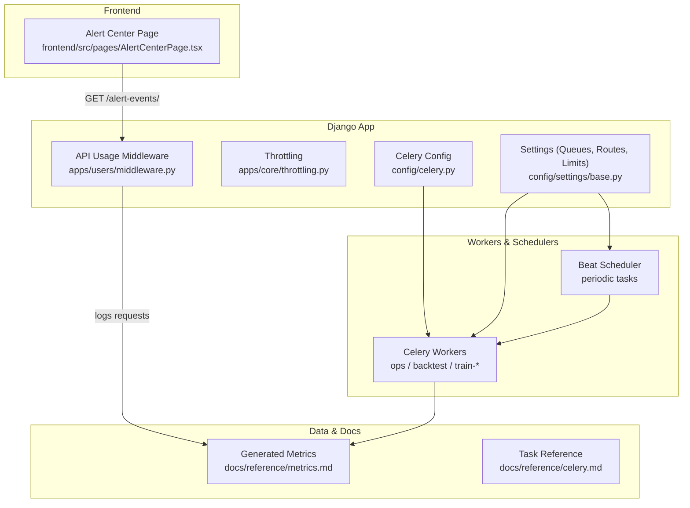
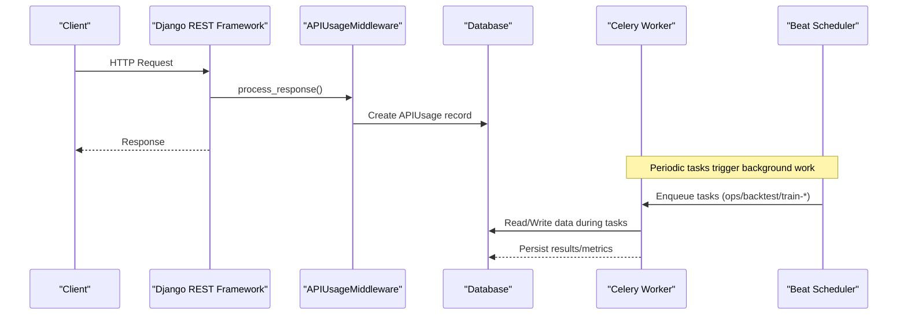
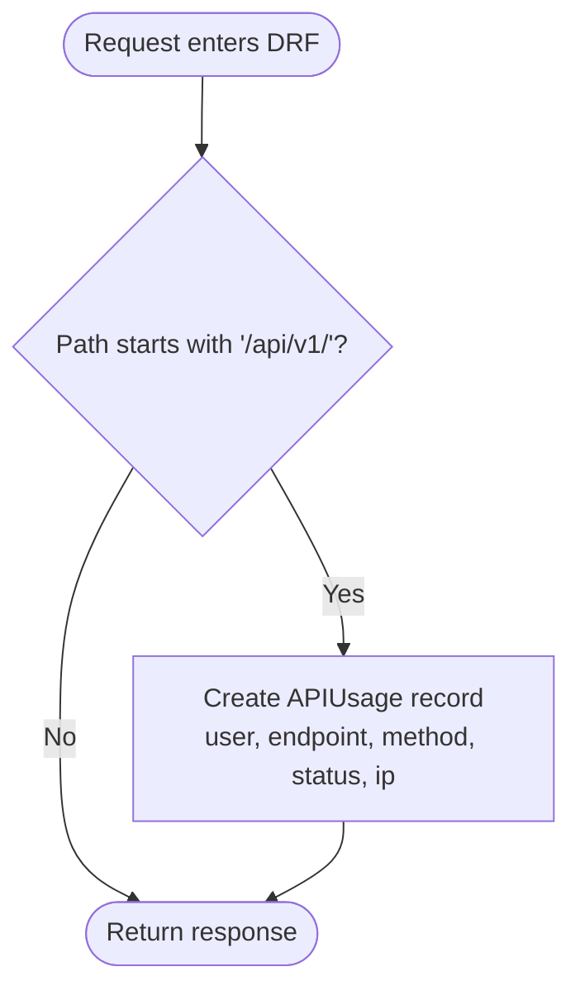
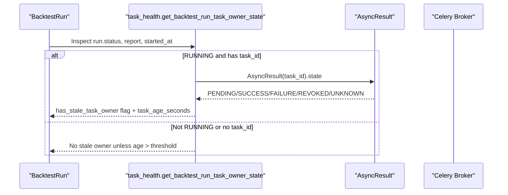
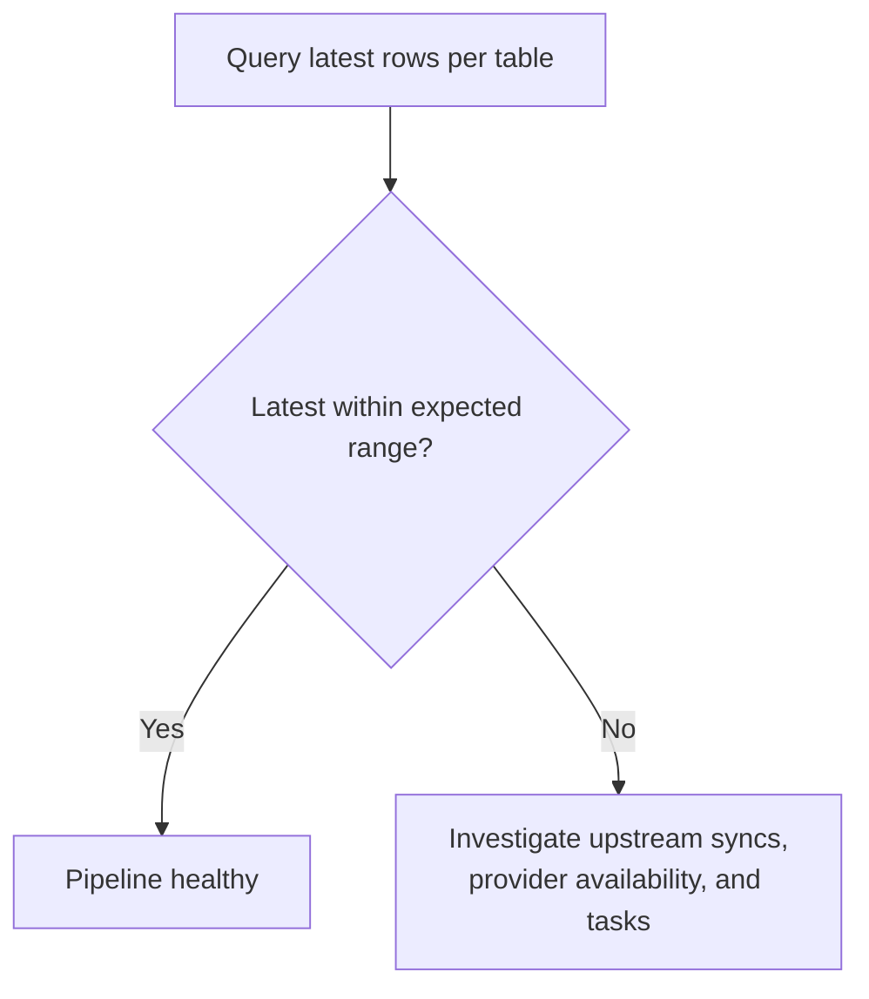
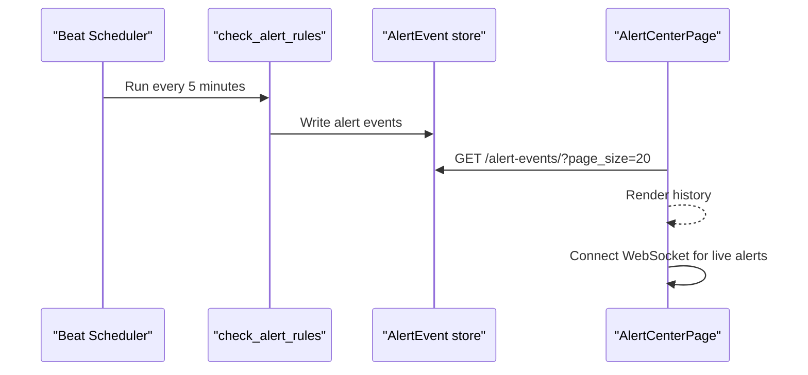
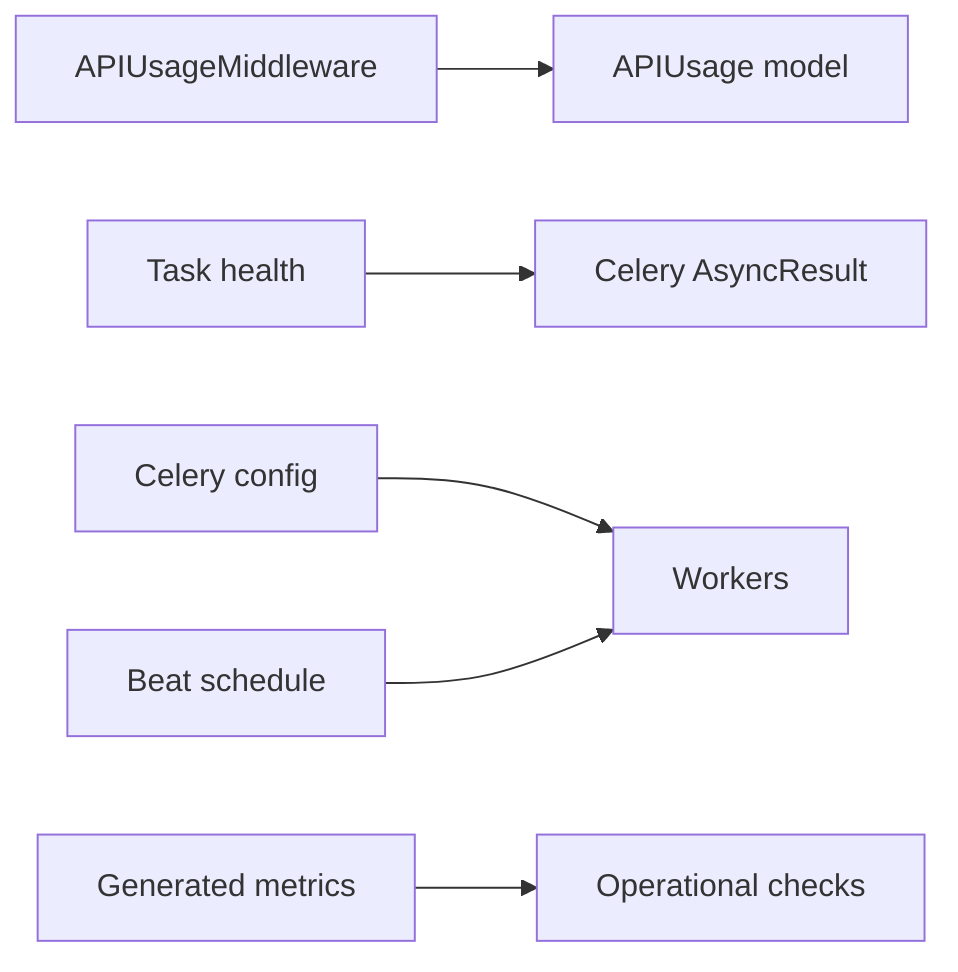

# Monitoring & Logging

<cite>
**Referenced Files in This Document**
- [base.py](file://config/settings/base.py)
- [celery.py](file://config/celery.py)
- [task_health.py](file://apps/backtest/task_health.py)
- [metrics.md](file://docs/reference/metrics.md)
- [celery.md](file://docs/reference/celery.md)
- [runbook-sync-failure.md](file://docs/how-to/runbook-sync-failure.md)
- [middleware.py](file://apps/users/middleware.py)
- [throttling.py](file://apps/core/throttling.py)
- [AlertCenterPage.tsx](file://frontend/src/pages/AlertCenterPage.tsx)
- [api.ts](file://frontend/src/lib/api.ts)
- [tasks.py](file://apps/markets/tasks.py)
</cite>

## Table of Contents
1. Introduction
2. Project Structure
3. Core Components
4. Architecture Overview
5. Detailed Component Analysis
6. Dependency Analysis
7. Performance Considerations
8. Troubleshooting Guide
9. Conclusion
10. Appendices

## Introduction
This document describes the monitoring and logging posture of FinanceAnalysis, focusing on application metrics collection, structured logging, log aggregation strategies, health checks, system monitoring, alerting configuration, Celery task monitoring, database query performance tracking, API response time monitoring, error tracking setup, log rotation policies, log analysis tools, and integration with external monitoring services such as Prometheus, Grafana, or ELK stack. It consolidates existing capabilities and provides guidance for extending observability to production-grade standards.

## Project Structure
Observability-related code spans settings, middleware, Celery configuration, backtest task health utilities, generated metrics documentation, and frontend alerting UI. The key areas are:
- Settings and queues: Celery broker, result backend, queues, routes, time limits, and Beat schedule.
- Middleware: API usage tracking per request.
- Task health: detection of stale or orphaned backtest runs via Celery state inspection.
- Metrics documentation: generated coverage tables for data freshness and pipeline health.
- Frontend: Alert Center page consuming live alerts via WebSocket and historical events via REST.

**Diagram sources**
- [celery.py:1-17](file://config/celery.py#L1-L17)
- [base.py:174-255](file://config/settings/base.py#L174-L255)
- [middleware.py:1-34](file://apps/users/middleware.py#L1-L34)
- [metrics.md:1-53](file://docs/reference/metrics.md#L1-L53)
- [celery.md:13-98](file://docs/reference/celery.md#L13-L98)
- [AlertCenterPage.tsx:1-31](file://frontend/src/pages/AlertCenterPage.tsx#L1-L31)

**Section sources**
- [base.py:174-255](file://config/settings/base.py#L174-L255)
- [celery.py:1-17](file://config/celery.py#L1-L17)
- [middleware.py:1-34](file://apps/users/middleware.py#L1-L34)
- [metrics.md:1-53](file://docs/reference/metrics.md#L1-L53)
- [celery.md:13-98](file://docs/reference/celery.md#L13-L98)
- [AlertCenterPage.tsx:1-31](file://frontend/src/pages/AlertCenterPage.tsx#L1-L31)

## Core Components
- API usage tracking: Every request under /api/v1/ is recorded with user identity, endpoint, HTTP method, status code, and IP address. This enables post-hoc analysis of traffic patterns and abuse detection.
- Throttling: Tier-based rate limiting protects endpoints and provides natural load signals for monitoring.
- Celery task monitoring: Queues, routing, time limits, and Beat schedules define how background work is executed; a task health utility detects stale or orphaned runs by inspecting Celery task states.
- Data freshness metrics: Generated coverage tables show latest dates and row counts across critical tables, enabling automated pipeline health checks.
- Alerting UI: The Alert Center consumes live alerts via WebSocket and historical events via REST.

Key implementation references:
- API usage recording: [middleware.py:6-33](file://apps/users/middleware.py#L6-L33)
- Throttle classes and scopes: [throttling.py:5-88](file://apps/core/throttling.py#L5-L88)
- Celery app and config loading: [celery.py:1-17](file://config/celery.py#L1-L17)
- Queues, routes, time limits, Beat schedule: [base.py:174-255](file://config/settings/base.py#L174-L255)
- Stale task detection logic: [task_health.py:1-95](file://apps/backtest/task_health.py#L1-L95)
- Generated metrics reference: [metrics.md:1-53](file://docs/reference/metrics.md#L1-L53)
- Celery task inventory and schedule: [celery.md:13-98](file://docs/reference/celery.md#L13-L98)
- Alert Center frontend: [AlertCenterPage.tsx:1-31](file://frontend/src/pages/AlertCenterPage.tsx#L1-L31)

**Section sources**
- [middleware.py:6-33](file://apps/users/middleware.py#L6-L33)
- [throttling.py:5-88](file://apps/core/throttling.py#L5-L88)
- [celery.py:1-17](file://config/celery.py#L1-L17)
- [base.py:174-255](file://config/settings/base.py#L174-L255)
- [task_health.py:1-95](file://apps/backtest/task_health.py#L1-L95)
- [metrics.md:1-53](file://docs/reference/metrics.md#L1-L53)
- [celery.md:13-98](file://docs/reference/celery.md#L13-L98)
- [AlertCenterPage.tsx:1-31](file://frontend/src/pages/AlertCenterPage.tsx#L1-L31)

## Architecture Overview
The system combines Django request/response lifecycle instrumentation, Celery worker execution telemetry, and periodic scheduled jobs into a cohesive observability surface.

**Diagram sources**
- [middleware.py:6-33](file://apps/users/middleware.py#L6-L33)
- [base.py:174-255](file://config/settings/base.py#L174-L255)
- [celery.py:1-17](file://config/celery.py#L1-L17)

## Detailed Component Analysis

### API Usage Tracking and Response Time Monitoring
- What it does: Records each API call under /api/v1/ with user, endpoint, method, status code, and IP. This forms the basis for response time and throughput monitoring when combined with timestamps and response duration instrumentation.
- How to extend for response times: Wrap view processing to measure elapsed time and persist it alongside APIUsage records. Use this to compute p50/p95/p99 latencies per endpoint and detect regressions.
- Integration points:
  - Middleware writes to the users APIUsage model.
  - Throttling enforces per-tier quotas that can be monitored for capacity planning.

**Diagram sources**
- [middleware.py:6-33](file://apps/users/middleware.py#L6-L33)

**Section sources**
- [middleware.py:6-33](file://apps/users/middleware.py#L6-L33)
- [throttling.py:5-88](file://apps/core/throttling.py#L5-L88)

### Celery Task Monitoring and Health
- Queue topology and routing: Default queue is ops; heavy backtests go to backtest; training tasks go to train-lightgbm and train-lstm. Routing is explicit for certain tasks.
- Time limits: Global soft and hard limits are set; some tasks override these.
- Beat schedule: Periodic tasks run at defined intervals to keep pipelines current.
- Stale task detection: The backtest task health utility inspects Celery AsyncResult states and run metadata to identify orphaned or stuck runs based on age thresholds and progress presence.

**Diagram sources**
- [task_health.py:37-95](file://apps/backtest/task_health.py#L37-L95)
- [celery.py:1-17](file://config/celery.py#L1-L17)

**Section sources**
- [base.py:174-255](file://config/settings/base.py#L174-L255)
- [celery.md:13-98](file://docs/reference/celery.md#L13-L98)
- [task_health.py:1-95](file://apps/backtest/task_health.py#L1-L95)

### Data Freshness and Pipeline Health Metrics
- Generated metrics provide table-level coverage, date ranges, and breakdowns for key models. These enable automated checks for pipeline liveness and data continuity.
- Operational use: Compare Latest columns against expected trading days; if OHLCV, indicators, factors, and predictions advance together, the pipeline is healthy.

[No diagram sources needed since this diagram shows conceptual workflow]

**Section sources**
- [metrics.md:1-53](file://docs/reference/metrics.md#L1-L53)
- [runbook-sync-failure.md:1-36](file://docs/how-to/runbook-sync-failure.md#L1-L36)

### Alerting and Real-Time Signals
- Backend: Alert rules are checked periodically via a scheduled task; alert events are persisted and exposed via REST.
- Frontend: The Alert Center page fetches recent alert history and connects to a WebSocket stream for real-time updates.

**Diagram sources**
- [base.py:218-255](file://config/settings/base.py#L218-L255)
- [AlertCenterPage.tsx:1-31](file://frontend/src/pages/AlertCenterPage.tsx#L1-L31)

**Section sources**
- [base.py:218-255](file://config/settings/base.py#L218-L255)
- [AlertCenterPage.tsx:1-31](file://frontend/src/pages/AlertCenterPage.tsx#L1-L31)

### Structured Logging and Log Aggregation Strategy
- Current state: Application code uses Python logging in places (e.g., markets tasks). There is no centralized logger configuration in the referenced settings files.
- Recommended strategy:
  - Standardize on JSON logs with consistent fields: timestamp, level, service, trace_id, span_id, component, message, and contextual tags (user_id, endpoint, task_id).
  - Ship logs to an aggregator (e.g., ELK stack or cloud logging service) using sidecar or agent-based collectors.
  - Implement log rotation via the hosting platform or log collector to manage retention and disk usage.
  - Add correlation IDs to requests and tasks to trace end-to-end flows across API and Celery boundaries.

[No sources needed since this section provides general guidance]

### Database Query Performance Tracking
- Current state: No dedicated query profiler or slow-query logger is configured in the referenced settings.
- Recommended approach:
  - Enable Django’s query logging in non-production environments to capture slow queries.
  - Use database-level slow query logs where supported.
  - Correlate slow queries with API endpoints and Celery tasks using trace IDs.
  - Visualize query latency distributions and top offenders in dashboards.

[No sources needed since this section provides general guidance]

### Error Tracking Setup
- Current state: No external error tracking SDK is referenced in the provided files.
- Recommended approach:
  - Integrate an error tracking service (e.g., Sentry) to capture exceptions, stack traces, and context (user, endpoint, task_id).
  - Configure environment-specific sampling and PII redaction.
  - Correlate errors with logs and metrics via shared trace IDs.

[No sources needed since this section provides general guidance]

### External Monitoring Integrations (Prometheus, Grafana, ELK)
- Metrics exposure:
  - Expose custom metrics (request rates, latencies, queue depths, task durations) via a Prometheus-compatible endpoint.
  - Use Django middleware and Celery hooks to emit counters, histograms, and gauges.
- Dashboards:
  - Build Grafana dashboards for API latency percentiles, error rates, queue backlogs, and data freshness indicators from the generated metrics.
- Logs:
  - Aggregate structured logs to ELK or equivalent for search, alerting, and long-term retention.

[No sources needed since this section provides general guidance]

## Dependency Analysis
The observability surface depends on Django middleware, Celery configuration, and generated metrics.

**Diagram sources**
- [middleware.py:6-33](file://apps/users/middleware.py#L6-L33)
- [task_health.py:37-95](file://apps/backtest/task_health.py#L37-L95)
- [base.py:174-255](file://config/settings/base.py#L174-L255)
- [metrics.md:1-53](file://docs/reference/metrics.md#L1-L53)

**Section sources**
- [middleware.py:6-33](file://apps/users/middleware.py#L6-L33)
- [task_health.py:37-95](file://apps/backtest/task_health.py#L37-L95)
- [base.py:174-255](file://config/settings/base.py#L174-L255)
- [metrics.md:1-53](file://docs/reference/metrics.md#L1-L53)

## Performance Considerations
- API throttling: Ensure tiered throttling aligns with capacity targets; monitor throttle rejections as a leading indicator of overload.
- Celery queues: Separate CPU-heavy backtests and training tasks onto dedicated queues and workers to prevent contention.
- Data freshness: Use generated metrics to detect pipeline stalls early; automate alerts when Latest dates lag behind expected trading days.
- Logging overhead: Prefer async log shipping and sampling in high-throughput paths to minimize impact.

[No sources needed since this section provides general guidance]

## Troubleshooting Guide
- Stale or stuck backtest runs:
  - Use the task health utility to identify runs with terminal Celery states but still marked RUNNING, or PENDING runs without progress beyond the age threshold.
  - Restart or fail such runs based on operational policy.
- Pipeline health:
  - Regenerate and compare the metrics reference to verify that key tables advanced to the expected trading day.
  - Follow the runbook for sync failures to validate provider availability and task ordering.
- Alert center:
  - Confirm WebSocket connectivity and REST access to alert events; check for authentication issues if history fails to load.

**Section sources**
- [task_health.py:1-95](file://apps/backtest/task_health.py#L1-L95)
- [runbook-sync-failure.md:1-36](file://docs/how-to/runbook-sync-failure.md#L1-L36)
- [AlertCenterPage.tsx:1-31](file://frontend/src/pages/AlertCenterPage.tsx#L1-L31)

## Conclusion
FinanceAnalysis includes foundational observability components: API usage tracking, tiered throttling, Celery queue/route/time-limit configuration, periodic scheduling, and a backtest task health checker. Generated metrics provide a strong baseline for pipeline health. To reach production-grade monitoring, add structured JSON logging, centralized log aggregation, error tracking, Prometheus metrics exposure, and Grafana dashboards. Integrate alerting around data freshness, task health, and API performance to proactively detect degradation.

## Appendices

### Key Configuration References
- Celery broker, result backend, queues, routes, and time limits: [base.py:174-255](file://config/settings/base.py#L174-L255)
- Celery app initialization and autodiscovery: [celery.py:1-17](file://config/celery.py#L1-L17)
- API usage middleware: [middleware.py:6-33](file://apps/users/middleware.py#L6-L33)
- Throttling tiers and scopes: [throttling.py:5-88](file://apps/core/throttling.py#L5-L88)
- Backtest task health logic: [task_health.py:1-95](file://apps/backtest/task_health.py#L1-L95)
- Generated metrics reference: [metrics.md:1-53](file://docs/reference/metrics.md#L1-L53)
- Celery task inventory and schedule: [celery.md:13-98](file://docs/reference/celery.md#L13-L98)
- Alert Center frontend: [AlertCenterPage.tsx:1-31](file://frontend/src/pages/AlertCenterPage.tsx#L1-L31)
- Example logging usage in tasks: [tasks.py:1-1](file://apps/markets/tasks.py#L1-L1), [tasks.py:209-209](file://apps/markets/tasks.py#L209-L209)