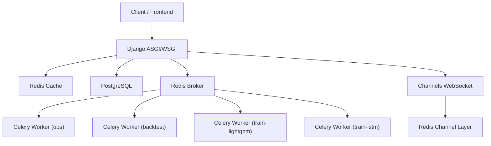
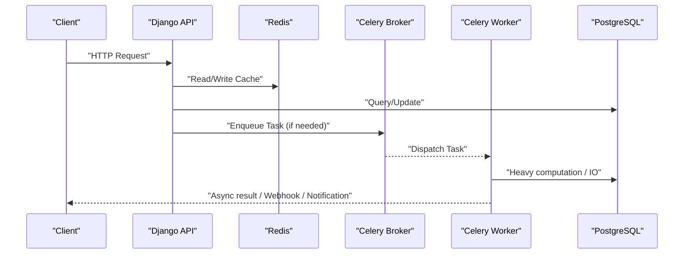
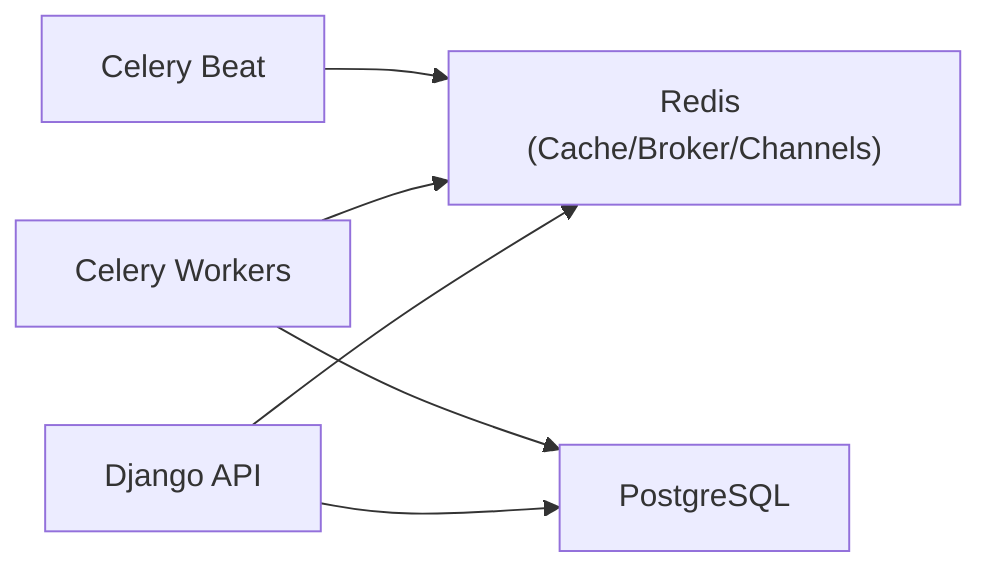

# Scaling & Performance

<cite>
**Referenced Files in This Document**
- [base.py](file://config/settings/base.py)
- [production.py](file://config/settings/production.py)
- [celery.py](file://config/celery.py)
- [docker-compose.yml](file://docker-compose.yml)
- [Dockerfile](file://compose/local/django/Dockerfile)
- [run_celery_worker.sh](file://scripts/run_celery_worker.sh)
- [throttling.py](file://apps/core/throttling.py)
- [tasks.py (backtest)](file://apps/backtest/tasks.py)
- [tasks.py (prediction)](file://apps/prediction/tasks.py)
- [local-setup.md](file://docs/how-to/local-setup.md)
- [testing.md](file://docs/how-to/testing.md)
- [api.md](file://docs/reference/api.md)
- [metrics.md](file://docs/reference/metrics.md)
- [commands.md](file://docs/reference/commands.md)
- [TECHNICAL_GUIDE.md](file://TECHNICAL_GUIDE.md)
</cite>

## Table of Contents
1. Introduction
2. Project Structure
3. Core Components
4. Architecture Overview
5. Detailed Component Analysis
6. Dependency Analysis
7. Performance Considerations
8. Troubleshooting Guide
9. Conclusion
10. Appendices

## Introduction
This document provides comprehensive scaling and performance guidance for FinanceAnalysis, focusing on horizontal scaling for Django, Celery workers, and database connections; load balancing; caching strategies; database optimization; monitoring and bottleneck identification; capacity planning; memory management; auto-scaling and container orchestration patterns; cloud deployment considerations; benchmarking guidelines; load testing procedures; and performance regression detection. It is grounded in the repository’s configuration, task implementations, and operational scripts.

## Project Structure
FinanceAnalysis is a Django + DRF REST API with:
- Redis-backed cache, Celery broker, and Channels layer
- PostgreSQL as the primary data store
- Celery Beat scheduling recurring jobs across multiple queues
- Docker Compose services for Django, Celery worker, and Celery Beat
- A React frontend served separately

**Diagram sources**
- [base.py:174-255](file://config/settings/base.py#L174-L255)
- [base.py:323-339](file://config/settings/base.py#L323-L339)
- [docker-compose.yml:1-39](file://docker-compose.yml#L1-L39)

**Section sources**
- [base.py:64-99](file://config/settings/base.py#L64-L99)
- [base.py:174-255](file://config/settings/base.py#L174-L255)
- [base.py:323-339](file://config/settings/base.py#L323-L339)
- [docker-compose.yml:1-39](file://docker-compose.yml#L1-L39)

## Core Components
- Django REST API with tiered rate limiting via custom throttles
- Celery application configured from Django settings with multiple queues and time limits
- Redis used for caching, result backend, and Channels channel layer
- PostgreSQL as the relational store with atomic requests enabled
- Scheduled tasks via Celery Beat for data syncs, predictions, and alerts

Key configuration highlights:
- Queues: ops, backtest, train-lightgbm, train-lstm
- Time limits: soft and hard limits to protect long-running tasks
- Caching: Redis-backed default cache
- Channels: Redis-backed channel layer for WebSocket alerts

**Section sources**
- [base.py:174-255](file://config/settings/base.py#L174-L255)
- [base.py:264-301](file://config/settings/base.py#L264-L301)
- [base.py:323-339](file://config/settings/base.py#L323-L339)
- [celery.py:1-17](file://config/celery.py#L1-L17)

## Architecture Overview
The runtime architecture separates request handling, background processing, and real-time messaging:
- HTTP requests go through Django middleware and DRF views, using Redis for caching and PostgreSQL for persistence
- Long-running or periodic work runs in Celery workers, routed to dedicated queues
- Real-time alerts stream via Channels over Redis

**Diagram sources**
- [base.py:174-255](file://config/settings/base.py#L174-L255)
- [base.py:323-339](file://config/settings/base.py#L323-L339)
- [celery.py:1-17](file://config/celery.py#L1-L17)

## Detailed Component Analysis

### Horizontal Scaling Strategy
- Django web tier
  - Run multiple containers behind a reverse proxy/load balancer (e.g., Nginx, cloud LB). Each container shares the same Redis and PostgreSQL endpoints.
  - Use environment-driven settings to scale horizontally without code changes.
- Celery workers
  - Scale per queue by running more worker processes targeting specific queues (ops, backtest, train-lightgbm, train-lstm).
  - Tune concurrency per worker process based on CPU/memory and I/O characteristics.
- Database connections
  - Ensure connection pooling at the database driver level and tune pool sizes relative to total worker/web processes.
  - Avoid idle timeouts by closing/reconnecting on errors where applicable.

Operational notes:
- The project uses separate compose services for Django, Celery worker, and Celery Beat, enabling independent scaling.
- Worker startup script supports queue selection and concurrency via environment variables.

**Section sources**
- [docker-compose.yml:1-39](file://docker-compose.yml#L1-L39)
- [run_celery_worker.sh:1-28](file://scripts/run_celery_worker.sh#L1-L28)
- [base.py:174-255](file://config/settings/base.py#L174-L255)

### Load Balancing and Concurrency
- Place a load balancer in front of multiple Django instances to distribute HTTP traffic.
- For Celery:
  - Use multiple worker processes per host with appropriate concurrency.
  - Separate heavy training tasks into isolated queues to prevent contention with ops tasks.
- Channels/WebSocket consumers should be scaled alongside Django to handle concurrent connections.

**Section sources**
- [base.py:174-255](file://config/settings/base.py#L174-L255)
- [docker-compose.yml:1-39](file://docker-compose.yml#L1-L39)

### Caching Strategies
- Default cache backend is Redis; use it for:
  - Response caching (DRF or view-level)
  - Throttle counters (tier-based rate limiting)
  - Process-level caches in long-running tasks (bounded LRU-style caches in backtest execution)
- Channels layer also uses Redis; ensure sufficient memory and noeviction policy to avoid silent key eviction.

Best practices:
- Set explicit TTLs for cache entries.
- Use cache keys that include version/context to invalidate stale data after updates.
- Monitor Redis memory usage and hit rates.

**Section sources**
- [base.py:323-339](file://config/settings/base.py#L323-L339)
- [throttling.py:17-88](file://apps/core/throttling.py#L17-L88)
- [local-setup.md:43-57](file://docs/how-to/local-setup.md#L43-L57)

### Database Optimization Techniques
- Atomic requests are enabled globally; consider disabling for high-throughput batch writes if safe.
- Use bulk operations and chunked writes for large backfills and analytics computations.
- Add indexes for frequently filtered/sorted columns (e.g., date ranges, asset identifiers).
- Partition large tables by date when feasible to improve query performance and maintenance.
- Tune connection pool sizes and timeouts to match expected concurrency.

Observed behaviors:
- Backfill commands and backtest paths implement retries on dropped connections and close all connections before retry.
- Bulk create with batch sizes is used in technical indicator backfills.

**Section sources**
- [base.py:122-125](file://config/settings/base.py#L122-L125)
- [backtest tasks.py:49-52](file://apps/backtest/tasks.py#L49-L52)
- [analytics backfill command:395-425](file://apps/analytics/management/commands/backfill_technical_indicators.py#L395-L425)

### Memory Management and Garbage Collection Tuning
- Process-level bounded caches in backtest execution prevent unbounded growth during long runs.
- Chunked feature extraction and capped sampling keep peak memory bounded during model training/inference.
- Use worker restart policies to reclaim memory periodically in long-lived processes.
- Tune Python GC thresholds if profiling indicates excessive GC overhead.

**Section sources**
- [backtest tasks.py:106-159](file://apps/backtest/tasks.py#L106-L159)
- [TECHNICAL_GUIDE.md:423-429](file://TECHNICAL_GUIDE.md#L423-L429)

### Auto-Scaling and Container Orchestration Patterns
- Containerization:
  - Docker image includes Python, TA-Lib, and entry/start scripts for Django, Celery worker, and Celery Beat.
  - Compose defines three services that can be scaled independently.
- Orchestration:
  - In Kubernetes or managed platforms, define Deployments with replicas for Django and separate Deployments for each Celery queue type.
  - Use Horizontal Pod Autoscaler (HPA) based on CPU/memory or custom metrics (e.g., queue depth).
  - Store models/artifacts in persistent storage accessible to workers.

**Section sources**
- [Dockerfile:1-53](file://compose/local/django/Dockerfile#L1-L53)
- [docker-compose.yml:1-39](file://docker-compose.yml#L1-L39)

### Cloud Deployment Considerations
- Externalize stateful services:
  - Managed PostgreSQL with connection pooling (e.g., PgBouncer)
  - Managed Redis with authentication and memory policies
- Secrets management:
  - Provide DATABASE_URL, REDIS_URL, CELERY_BROKER_URL, and secrets via secure secret stores.
- Observability:
  - Centralized logging and metrics collection for Django, Celery, and databases.
- Network:
  - Restrict database and Redis access to internal networks.

**Section sources**
- [base.py:174-255](file://config/settings/base.py#L174-L255)
- [base.py:323-339](file://config/settings/base.py#L323-L339)
- [local-setup.md:43-57](file://docs/how-to/local-setup.md#L43-L57)

### Performance Monitoring and Bottleneck Identification
- Track:
  - Request latency and error rates at the API gateway and Django level
  - Celery queue depths, task durations, and failure rates
  - Database slow queries and lock waits
  - Redis memory and hit/miss ratios
- Use structured logs and metrics exporters to correlate spikes across components.
- Establish SLOs for critical paths (e.g., daily prediction pipeline completion time).

[No sources needed since this section provides general guidance]

### Capacity Planning
- Estimate capacity based on:
  - Peak concurrent users and request rate
  - Background job volume (daily syncs, predictions, backtests)
  - Data growth rates and retention policies
- Right-size:
  - Web tier replicas
  - Worker concurrency per queue
  - Database instance class and connection pool size
  - Redis memory allocation and eviction policy

[No sources needed since this section provides general guidance]

### Benchmarking Guidelines and Load Testing Procedures
- Define representative workloads:
  - Read-heavy API queries with pagination
  - Write-heavy backfill and analytics pipelines
  - Mixed inference/training workloads
- Tools:
  - Use load generators to simulate realistic traffic patterns
  - Measure p50/p95/p99 latencies, throughput, and error rates
- Baseline and compare:
  - Record baseline metrics before changes
  - Re-run tests after scaling or tuning to validate improvements

[No sources needed since this section provides general guidance]

### Performance Regression Detection
- Integrate automated checks:
  - Post-deployment smoke tests against staging
  - Periodic benchmark suites comparing key metrics
- Alert on:
  - Latency regressions beyond thresholds
  - Increased error rates or task failures
  - Database slow query spikes

**Section sources**
- [commands.md:447-470](file://docs/reference/commands.md#L447-L470)

## Dependency Analysis
The system’s runtime dependencies center around Redis and PostgreSQL, with Celery coordinating background work.

**Diagram sources**
- [base.py:174-255](file://config/settings/base.py#L174-L255)
- [base.py:323-339](file://config/settings/base.py#L323-L339)
- [celery.py:1-17](file://config/celery.py#L1-L17)

**Section sources**
- [base.py:174-255](file://config/settings/base.py#L174-L255)
- [base.py:323-339](file://config/settings/base.py#L323-L339)
- [celery.py:1-17](file://config/celery.py#L1-L17)

## Performance Considerations
- Caching:
  - Prefer Redis for shared cache and throttle counters
  - Use bounded process-level caches for intensive computations
- Database:
  - Index hot filters and joins
  - Use bulk operations and chunked writes
  - Monitor slow queries and adjust queries/indexes accordingly
- Celery:
  - Separate queues by workload type
  - Tune concurrency and time limits per queue
  - Monitor queue depth and task duration distributions
- Memory:
  - Limit process-level cache sizes
  - Restart workers periodically to reclaim memory
  - Profile training/inference paths for memory hotspots

[No sources needed since this section provides general guidance]

## Troubleshooting Guide
Common issues and mitigations:
- Redis authentication or connectivity problems
  - Symptoms: API throttling fails, cache misses, WebSocket drops
  - Mitigation: Verify credentials and URL shape; probe connectivity; ensure noeviction policy
- Dropped database connections during long runs
  - Symptoms: OperationalError/InterfaceError mid-task
  - Mitigation: Retry logic closes connections and re-attempts; resume from checkpoint
- Stuck or failed background tasks
  - Symptoms: Tasks remain RUNNING or fail repeatedly
  - Mitigation: Inspect queue health, worker logs, and task states; restart workers if necessary

**Section sources**
- [testing.md:218-254](file://docs/how-to/testing.md#L218-L254)
- [local-setup.md:43-57](file://docs/how-to/local-setup.md#L43-L57)
- [backtest tasks.py:49-52](file://apps/backtest/tasks.py#L49-L52)
- [analytics backfill command:395-425](file://apps/analytics/management/commands/backfill_technical_indicators.py#L395-L425)

## Conclusion
FinanceAnalysis is designed for scalable operation with clear separation between web, background processing, and real-time messaging. By leveraging Redis for caching and messaging, PostgreSQL for persistence, and Celery for asynchronous work across dedicated queues, the system can scale horizontally across Django, Celery workers, and databases. Proper tuning of concurrency, caching, database connections, and memory usage—combined with robust monitoring and benchmarking—ensures reliable performance under load.

[No sources needed since this section summarizes without analyzing specific files]

## Appendices

### Key Configuration Reference
- Celery queues and routing
- Time limits and scheduler
- Cache and Channels backends
- DRF throttling tiers

**Section sources**
- [base.py:174-255](file://config/settings/base.py#L174-L255)
- [base.py:264-301](file://config/settings/base.py#L264-L301)
- [base.py:323-339](file://config/settings/base.py#L323-L339)

### Data Coverage Metrics
Use generated metrics to understand data volumes and coverage, which inform capacity planning and performance expectations.

**Section sources**
- [metrics.md:1-188](file://docs/reference/metrics.md#L1-L188)