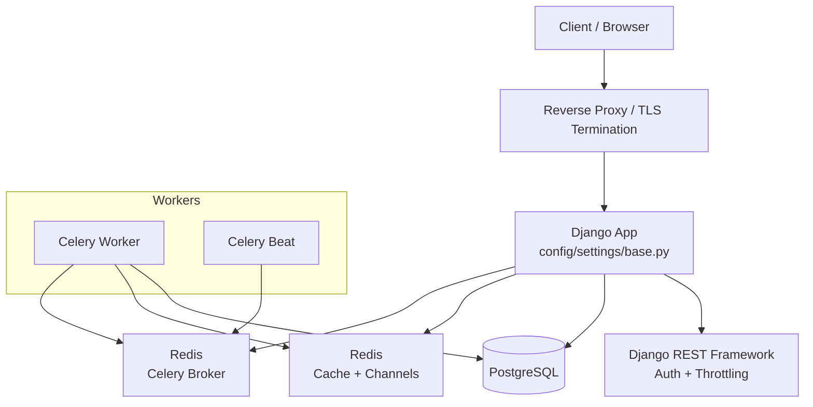
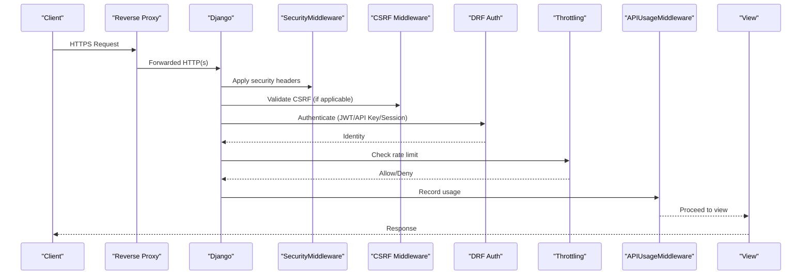
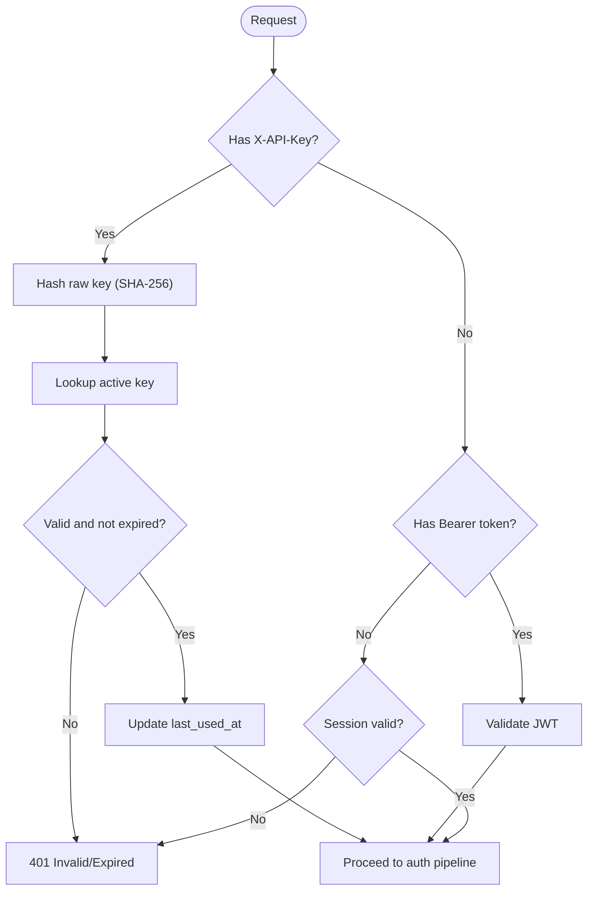
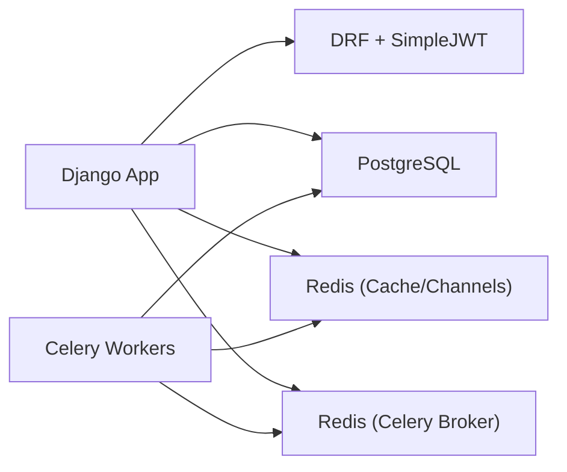

# Security Hardening

<cite>
**Referenced Files in This Document**
- [base.py](file://config/settings/base.py)
- [production.py](file://config/settings/production.py)
- [urls.py](file://config/urls.py)
- [authentication.py](file://apps/developer/authentication.py)
- [middleware.py](file://apps/users/middleware.py)
- [models.py](file://apps/users/models.py)
- [serializers.py](file://apps/users/serializers.py)
- [Dockerfile](file://compose/local/django/Dockerfile)
- [docker-compose.yml](file://docker-compose.yml)
- [verify_local_stack.sh](file://scripts/verify_local_stack.sh)
- [verify_local_stack.ps1](file://scripts/verify_local_stack.ps1)
- [local-setup.md](file://docs/how-to/local-setup.md)
- [env.md](file://docs/reference/env.md)
</cite>

## Table of Contents
1. Introduction
2. Project Structure
3. Core Components
4. Architecture Overview
5. Detailed Component Analysis
6. Dependency Analysis
7. Performance Considerations
8. Troubleshooting Guide
9. Conclusion
10. Appendices

## Introduction
This document provides a comprehensive security hardening guide for FinanceAnalysis. It covers authentication and authorization, API security, input validation, SSL/TLS and HTTPS enforcement, database security, container image security, security headers, CORS and CSRF protection, as well as audit procedures, penetration testing guidelines, incident response, compliance considerations, and monitoring strategies. The guidance is grounded in the repository’s current configuration and code paths and highlights where additional hardening is recommended.

## Project Structure
FinanceAnalysis is a Django-based backend with multiple domain apps (markets, analytics, factors, macro, sentiment, prediction, backtest, developer, users), Celery workers, Redis-backed caching/broker, and a frontend served separately. Security-relevant configuration lives primarily under config/settings, with per-app logic for authentication, throttling, and usage tracking.

**Diagram sources**
- [base.py:122-131](file://config/settings/base.py#L122-L131)
- [base.py:174-203](file://config/settings/base.py#L174-L203)
- [base.py:323-339](file://config/settings/base.py#L323-L339)
- [docker-compose.yml:1-39](file://docker-compose.yml#L1-L39)

**Section sources**
- [base.py:62-99](file://config/settings/base.py#L62-L99)
- [docker-compose.yml:1-39](file://docker-compose.yml#L1-L39)

## Core Components
- Authentication: JWT via SimpleJWT and custom API Key authentication; session auth available for browsable API.
- Authorization: DRF default permission IsAuthenticatedOrReadOnly; per-view permissions can be enforced.
- Rate limiting: Tiered throttling (anonymous, free, pro, premium).
- CSRF: Enabled via middleware; frontend helpers included.
- Usage tracking: Middleware records endpoint, method, status, IP.
- Password policy: Built-in validators configured.
- Environment-driven secrets: All sensitive values loaded from environment variables.

**Section sources**
- [base.py:264-321](file://config/settings/base.py#L264-L321)
- [authentication.py:10-52](file://apps/developer/authentication.py#L10-L52)
- [middleware.py:6-33](file://apps/users/middleware.py#L6-L33)
- [serializers.py:45-84](file://apps/users/serializers.py#L45-L84)
- [base.py:128-144](file://config/settings/base.py#L128-L144)

## Architecture Overview
The request path enforces security at multiple layers:
- Reverse proxy terminates TLS and forwards to Django.
- Django SecurityMiddleware sets secure defaults and clickjacking protection.
- CSRF middleware protects state-changing requests.
- DRF authenticators validate identity (JWT or API key).
- Throttling limits abuse by tier.
- Custom middleware logs API usage for auditing.

**Diagram sources**
- [base.py:90-99](file://config/settings/base.py#L90-L99)
- [base.py:264-301](file://config/settings/base.py#L264-L301)
- [authentication.py:24-49](file://apps/developer/authentication.py#L24-L49)
- [middleware.py:11-31](file://apps/users/middleware.py#L11-L31)

## Detailed Component Analysis

### Authentication and Authorization
- JWT: Access tokens short-lived; refresh tokens rotated and blacklisted; HS256 signing key sourced from environment.
- API Keys: Custom BaseAuthentication hashes incoming keys and validates against active, non-expired keys; updates last-used timestamp.
- Session: Available for browsable API; not intended for programmatic clients.
- Permissions: Default read-only for unauthenticated; write endpoints should enforce IsAuthenticated or role-based checks.

**Diagram sources**
- [authentication.py:24-49](file://apps/developer/authentication.py#L24-L49)
- [base.py:281-321](file://config/settings/base.py#L281-L321)

**Section sources**
- [base.py:264-321](file://config/settings/base.py#L264-L321)
- [authentication.py:10-52](file://apps/developer/authentication.py#L10-L52)

### API Security Measures
- Throttling: Configured tiers for anonymous and authenticated users; prevents brute-force and scraping.
- Pagination: Default page size limits payload sizes.
- Schema: OpenAPI schema generated; Swagger UI enabled for development/testing.
- URL exposure: Sensitive endpoints are explicitly registered; ensure production restricts access.

Recommendations:
- Restrict Swagger UI to internal networks or require authentication in production.
- Enforce strict CORS only for known origins.
- Add explicit permission classes on write endpoints beyond default read-only.

**Section sources**
- [base.py:264-301](file://config/settings/base.py#L264-L301)
- [urls.py:109-128](file://config/urls.py#L109-L128)

### Input Validation Strategies
- Passwords: Validators enforce complexity rules; registration serializer ensures matching passwords and uniqueness.
- Email reset: Serializer avoids leaking existence of accounts.
- General: Use DRF serializers and field-level validation across all inputs.

Recommendations:
- Centralize validation rules in dedicated validators.
- Sanitize and normalize inputs before persistence.
- Enforce allowlists for enums and categories.

**Section sources**
- [base.py:128-144](file://config/settings/base.py#L128-L144)
- [serializers.py:45-84](file://apps/users/serializers.py#L45-L84)
- [serializers.py:174-185](file://apps/users/serializers.py#L174-L185)

### SSL/TLS Configuration, HTTPS Enforcement, and Certificate Management
Current state:
- Django settings do not enforce HTTPS directly; no HSTS or redirect settings visible.
- No explicit SSL certificate management in Django settings.

Recommended hardening:
- Terminate TLS at a reverse proxy (e.g., Nginx/Traefik) and forward HTTP to Django.
- Configure HSTS, strong cipher suites, and modern TLS versions at the proxy.
- Enforce HTTPS redirects in Django if terminating TLS within the app.
- Manage certificates via automated tools (e.g., Let’s Encrypt) and rotate proactively.

Operational notes:
- Ensure DATABASE_URL uses postgresql+psycopg2 with sslmode=require in production.
- Set REDIS_URL and CELERY_BROKER_URL to use TLS where supported by your Redis deployment.

**Section sources**
- [base.py:122-131](file://config/settings/base.py#L122-L131)
- [base.py:174-203](file://config/settings/base.py#L174-L203)
- [base.py:323-339](file://config/settings/base.py#L323-L339)

### Database Security, SQL Injection Prevention, and Encryption
Current state:
- Uses Django ORM with ATOMIC_REQUESTS enabled.
- Credentials loaded from DATABASE_URL environment variable.
- No explicit encryption-at-rest configuration in settings.

Recommendations:
- Enforce encrypted connections (TLS) to the database using connection parameters in DATABASE_URL.
- Use least-privilege database accounts per service.
- Enable column-level encryption for highly sensitive fields if required by compliance.
- Enable storage encryption at the OS/volume level for databases and backups.
- Regularly rotate credentials and audit access logs.

SQL injection prevention:
- Rely on ORM queries and parameterized queries; avoid raw SQL unless necessary.
- If raw SQL is unavoidable, use parameterization and strict allowlists for identifiers.

**Section sources**
- [base.py:122-131](file://config/settings/base.py#L122-L131)
- [env.md:15-48](file://docs/reference/env.md#L15-L48)

### Container Security Best Practices, Image Scanning, and Vulnerability Management
Current state:
- Dockerfile installs build dependencies and Python packages; does not run as root explicitly.
- Compose mounts source code into containers for local development.

Recommendations:
- Run as non-root user inside containers.
- Pin base images and dependencies; rebuild images regularly.
- Scan images with vulnerability scanners (e.g., Trivy, Snyk) in CI.
- Remove unnecessary packages and binaries from images.
- Use multi-stage builds to minimize attack surface.
- Avoid mounting source code volumes in production; use read-only mounts where possible.
- Limit capabilities and use seccomp/AppArmor profiles.

**Section sources**
- [Dockerfile:1-53](file://compose/local/django/Dockerfile#L1-L53)
- [docker-compose.yml:1-39](file://docker-compose.yml#L1-L39)

### Security Headers, CORS, and CSRF Protection
Current state:
- Django SecurityMiddleware and XFrameOptionsMiddleware are enabled.
- CSRF middleware is enabled; frontend includes CSRF helper scripts.
- No explicit CORS configuration found in settings.

Recommendations:
- Configure CORS to allow only trusted origins and methods.
- Add Content-Security-Policy, Referrer-Policy, Permissions-Policy, and X-Content-Type-Options via a reverse proxy or middleware.
- Ensure CSRF tokens are validated for state-changing requests from browsers.
- For APIs consumed by SPAs, prefer JSON APIs with JWT and disable CSRF for pure JSON APIs when appropriate.

**Section sources**
- [base.py:90-99](file://config/settings/base.py#L90-L99)
- [urls.py:109-128](file://config/urls.py#L109-L128)

### API Usage Tracking and Audit Logging
Current state:
- APIUsageMiddleware records endpoint, method, status, and IP for /api/v1/* requests.
- APIUsage model stores timestamps and indexes for efficient querying.

Recommendations:
- Retain logs securely with rotation and tamper-evident storage.
- Include correlation IDs in requests for traceability.
- Export logs to a centralized SIEM for analysis and alerting.
- Periodically review usage patterns for anomalies.

**Section sources**
- [middleware.py:6-33](file://apps/users/middleware.py#L6-L33)
- [models.py:140-186](file://apps/users/models.py#L140-L186)

### Incident Response Protocols
Guidelines:
- Define roles and escalation paths for security incidents.
- Maintain runbooks for common scenarios (credential leak, account takeover, data exfiltration).
- Preserve evidence: logs, network captures, system snapshots.
- Communicate internally and externally as required by compliance.
- Post-incident: conduct blameless postmortems and implement preventive controls.

[No sources needed since this section provides general guidance]

### Compliance Considerations
Guidelines:
- Map controls to frameworks (e.g., ISO 27001, SOC 2, GDPR) based on business needs.
- Implement data minimization, purpose limitation, and retention policies.
- Provide mechanisms for user consent, access, correction, and deletion.
- Conduct regular risk assessments and audits.

[No sources needed since this section provides general guidance]

### Security Monitoring Strategies
Guidelines:
- Monitor authentication failures, rate limit hits, and unusual traffic patterns.
- Alert on privilege escalation attempts and abnormal API usage spikes.
- Integrate application metrics and logs with observability platforms.
- Perform periodic vulnerability scans and dependency audits.

[No sources needed since this section provides general guidance]

## Dependency Analysis
Security-critical runtime dependencies include Django, DRF, SimpleJWT, Redis, PostgreSQL, and Celery. Their configurations and integration points influence overall security posture.

**Diagram sources**
- [base.py:174-203](file://config/settings/base.py#L174-L203)
- [base.py:323-339](file://config/settings/base.py#L323-L339)

**Section sources**
- [base.py:174-203](file://config/settings/base.py#L174-L203)
- [base.py:323-339](file://config/settings/base.py#L323-L339)

## Performance Considerations
- Throttling protects availability but may impact legitimate high-volume clients; tune rates per tier.
- Pagination reduces payload sizes and memory usage.
- Offload heavy tasks to Celery workers to keep API latency low.
- Use Redis for caching and channel layer to reduce database load.

[No sources needed since this section provides general guidance]

## Troubleshooting Guide
Common issues and mitigations:
- Wrong Redis password or malformed URLs cause authentication/cache/channel failures; verify connectivity and redact credentials in logs.
- Misconfigured DATABASE_URL can lead to connection errors; ensure correct scheme, host, port, and sslmode.
- CSRF mismatches in browser flows indicate missing or incorrect token handling; verify header names and cookie settings.
- Swagger UI exposed publicly can leak API details; restrict access in production.

Verification scripts:
- Use provided scripts to probe PostgreSQL and Redis readiness; they redact credentials in output.

**Section sources**
- [verify_local_stack.sh:1-47](file://scripts/verify_local_stack.sh#L1-L47)
- [verify_local_stack.ps1:38-84](file://scripts/verify_local_stack.ps1#L38-L84)
- [local-setup.md:99-127](file://docs/how-to/local-setup.md#L99-L127)

## Conclusion
FinanceAnalysis implements solid foundational security measures including JWT and API key authentication, CSRF protection, throttling, and usage logging. To reach production-grade hardening, prioritize TLS termination and enforcement, strict CORS, hardened container images, database encryption in transit and at rest, comprehensive monitoring, and robust incident response processes. Continuously review and update security controls aligned with evolving threats and compliance requirements.

[No sources needed since this section summarizes without analyzing specific files]

## Appendices

### Production Settings Checklist
- Enforce HTTPS and HSTS at the reverse proxy.
- Lock down allowed hosts and CORS origins.
- Rotate signing keys and secrets regularly.
- Disable debug and verbose error pages.
- Restrict admin and schema endpoints to internal networks.
- Enable database TLS and least-privilege accounts.
- Harden Redis with authentication and TLS.
- Scan and patch images and dependencies continuously.

[No sources needed since this section provides general guidance]