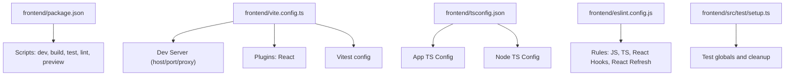
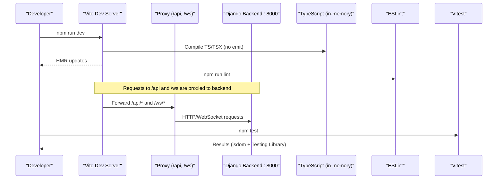
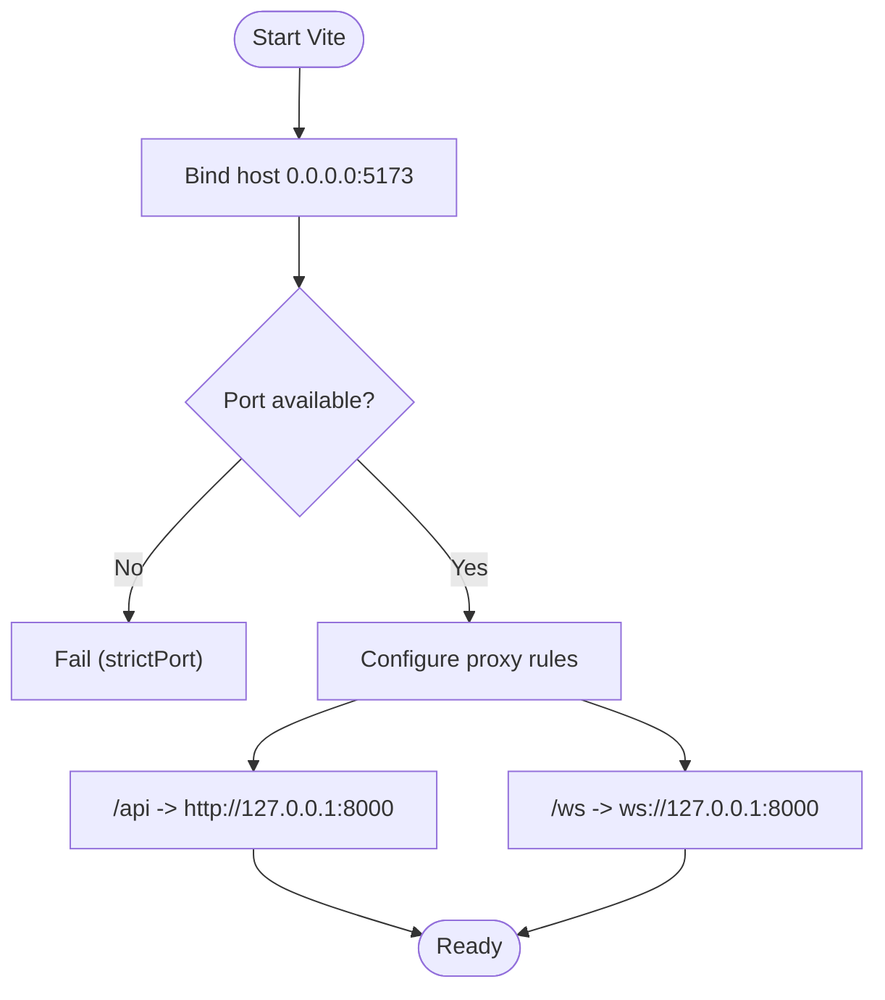
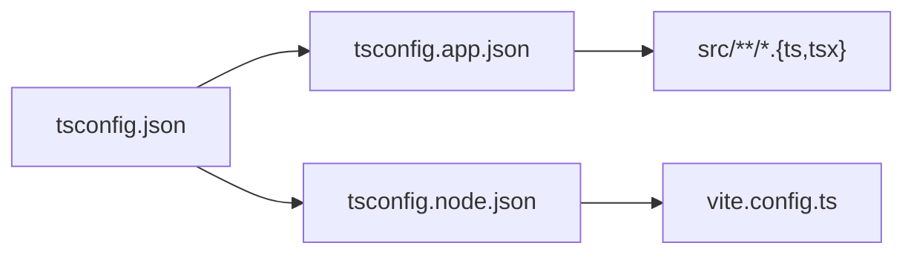
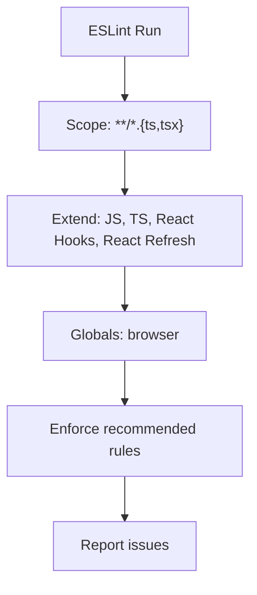
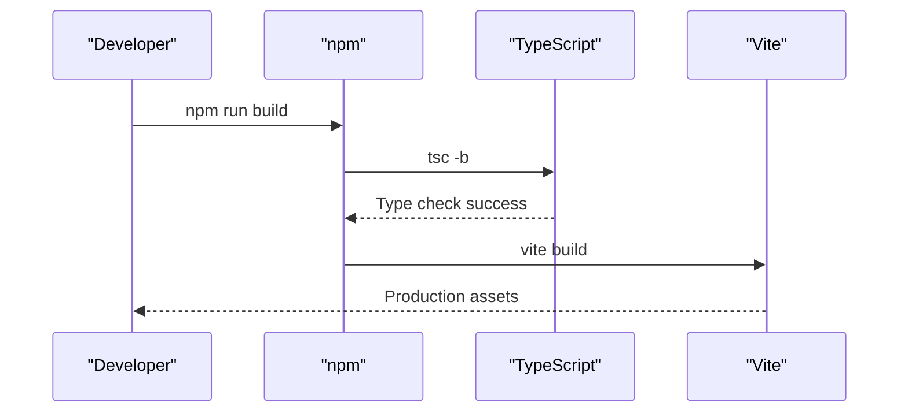
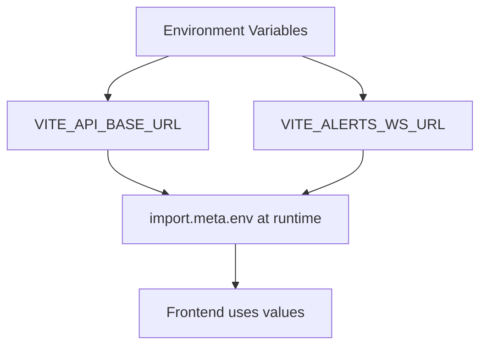
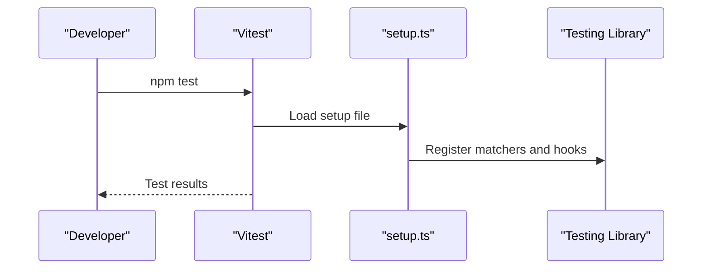
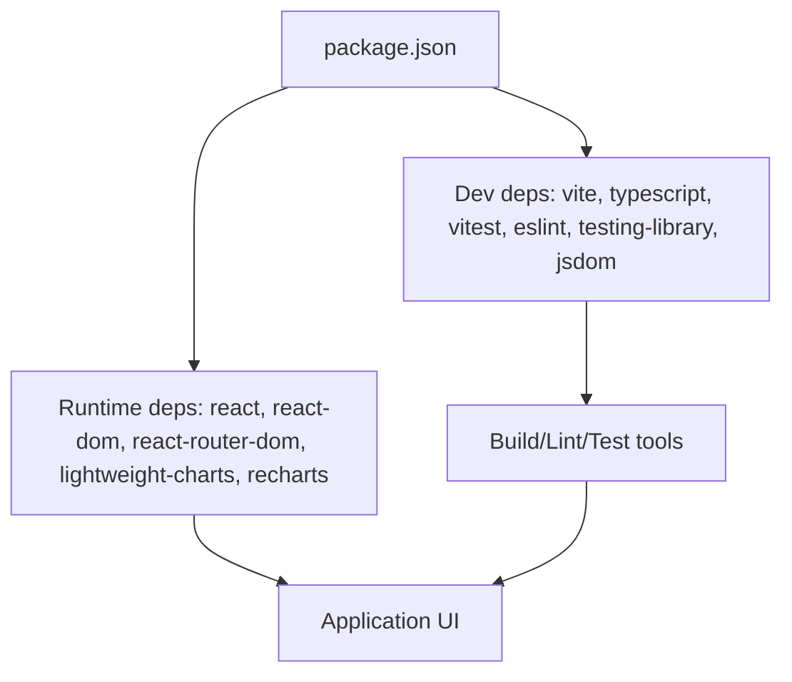

# Build System & Development Workflow

<cite>
**Referenced Files in This Document**
- [package.json](file://frontend/package.json)
- [vite.config.ts](file://frontend/vite.config.ts)
- [tsconfig.json](file://frontend/tsconfig.json)
- [tsconfig.app.json](file://frontend/tsconfig.app.json)
- [tsconfig.node.json](file://frontend/tsconfig.node.json)
- [eslint.config.js](file://frontend/eslint.config.js)
- [README.md](file://frontend/README.md)
- [setup.ts](file://frontend/src/test/setup.ts)
- [api.ts](file://frontend/src/lib/api.ts)
</cite>

## Table of Contents
1. [Introduction](#introduction)
2. [Project Structure](#project-structure)
3. [Core Components](#core-components)
4. [Architecture Overview](#architecture-overview)
5. [Detailed Component Analysis](#detailed-component-analysis)
6. [Dependency Analysis](#dependency-analysis)
7. [Performance Considerations](#performance-considerations)
8. [Troubleshooting Guide](#troubleshooting-guide)
9. [Conclusion](#conclusion)
10. [Appendices](#appendices)

## Introduction
This document explains the build system and development workflow for the FinanceAnalysis frontend application. It covers Vite configuration, TypeScript setup, ESLint rules, dependency management, scripts, environment variables, testing, environment setup, debugging, deployment, and best practices for maintaining a consistent workflow across the team.

## Project Structure
The frontend is a React 19 + TypeScript project built with Vite. The key configuration files are located under the frontend directory:
- package.json defines scripts, dependencies, and devDependencies.
- vite.config.ts configures the dev server, proxying to the backend, and test settings.
- TypeScript configurations are split into app and node contexts.
- ESLint uses a flat config with recommended rules for JavaScript, TypeScript, React Hooks, and React Refresh.
- Tests use Vitest with jsdom and Testing Library.

**Diagram sources**
- [package.json:6-11](file://frontend/package.json#L6-L11)
- [vite.config.ts:6-27](file://frontend/vite.config.ts#L6-L27)
- [tsconfig.json:1-7](file://frontend/tsconfig.json#L1-L7)
- [eslint.config.js:8-23](file://frontend/eslint.config.js#L8-L23)
- [setup.ts:1-7](file://frontend/src/test/setup.ts#L1-L7)

**Section sources**
- [package.json:1-40](file://frontend/package.json#L1-L40)
- [vite.config.ts:1-29](file://frontend/vite.config.ts#L1-L29)
- [tsconfig.json:1-8](file://frontend/tsconfig.json#L1-L8)
- [eslint.config.js:1-24](file://frontend/eslint.config.js#L1-L24)
- [README.md:11-36](file://frontend/README.md#L11-L36)

## Core Components
- Build toolchain: Vite for fast dev server and optimized production builds; TypeScript for type checking; ESLint for code quality.
- Dev server: Hosts on 0.0.0.0:5173 with strict port enforcement and proxies /api and /ws to the Django backend at 127.0.0.1:8000.
- TypeScript: Two projects (app and node) share strict options, bundler module resolution, JSX transform via react-jsx, and no emit during build.
- Testing: Vitest runs in jsdom with Testing Library and jest-dom matchers; setup file registers cleanup after each test.
- Environment variables: Vite exposes only VITE_* variables; API base URL defaults to relative path so the proxy handles routing; WebSocket URL can be overridden.

**Section sources**
- [vite.config.ts:6-27](file://frontend/vite.config.ts#L6-L27)
- [tsconfig.app.json:1-26](file://frontend/tsconfig.app.json#L1-L26)
- [tsconfig.node.json:1-25](file://frontend/tsconfig.node.json#L1-L25)
- [eslint.config.js:8-23](file://frontend/eslint.config.js#L8-L23)
- [setup.ts:1-7](file://frontend/src/test/setup.ts#L1-L7)
- [README.md:252-261](file://frontend/README.md#L252-L261)

## Architecture Overview
The development workflow integrates Vite’s dev server with a reverse proxy to the backend. TypeScript compiles in-memory for speed, while ESLint enforces code quality. Tests run in a browser-like environment using Vitest.

**Diagram sources**
- [vite.config.ts:6-27](file://frontend/vite.config.ts#L6-L27)
- [package.json:6-11](file://frontend/package.json#L6-L11)
- [tsconfig.app.json:10-16](file://frontend/tsconfig.app.json#L10-L16)
- [eslint.config.js:8-23](file://frontend/eslint.config.js#L8-L23)
- [setup.ts:1-7](file://frontend/src/test/setup.ts#L1-L7)

## Detailed Component Analysis

### Vite Configuration and Dev Server
- Host and port: Listens on all interfaces at port 5173 with strictPort enabled to fail fast if the port is taken.
- Proxy: Forwards /api to http://127.0.0.1:8000 and /ws to ws://127.0.0.1:8000 with changeOrigin enabled.
- Plugins: React plugin enables JSX transformation and refresh.
- Test integration: Vitest environment set to jsdom with a setup file for global test utilities.

**Diagram sources**
- [vite.config.ts:6-21](file://frontend/vite.config.ts#L6-L21)

**Section sources**
- [vite.config.ts:6-27](file://frontend/vite.config.ts#L6-L27)
- [README.md:39-64](file://frontend/README.md#L39-L64)

### TypeScript Configuration
- Split configs: App code uses tsconfig.app.json; Node-side config (e.g., vite.config.ts) uses tsconfig.node.json; root tsconfig.json references both.
- Compiler options: Target ES2023, modern module resolution (bundler), JSX react-jsx, no emit, strict linting flags, and skipLibCheck for faster checks.
- Types: Includes vite/client, vitest/globals, and jest-dom types for app; node types for Node context.

**Diagram sources**
- [tsconfig.json:1-7](file://frontend/tsconfig.json#L1-L7)
- [tsconfig.app.json:1-26](file://frontend/tsconfig.app.json#L1-L26)
- [tsconfig.node.json:1-25](file://frontend/tsconfig.node.json#L1-L25)

**Section sources**
- [tsconfig.json:1-8](file://frontend/tsconfig.json#L1-L8)
- [tsconfig.app.json:1-26](file://frontend/tsconfig.app.json#L1-L26)
- [tsconfig.node.json:1-25](file://frontend/tsconfig.node.json#L1-L25)

### ESLint Configuration
- Flat config with recommended rules for JavaScript, TypeScript, React Hooks, and React Refresh.
- Targets .ts/.tsx files, sets ECMAScript version to 2020, and enables browser globals.
- Ignores dist output.

**Diagram sources**
- [eslint.config.js:8-23](file://frontend/eslint.config.js#L8-L23)

**Section sources**
- [eslint.config.js:1-24](file://frontend/eslint.config.js#L1-L24)

### Scripts and Dependency Management
- Scripts:
  - dev: Starts Vite dev server.
  - build: Runs TypeScript build then Vite production build.
  - test: Runs Vitest in single-pass mode.
  - lint: Runs ESLint.
  - preview: Serves the production build locally.
- Dependencies: React, React DOM, React Router, charting libraries (lightweight-charts, recharts).
- Dev dependencies: Vite, TypeScript, Vitest, ESLint ecosystem, Testing Library, jsdom.

**Diagram sources**
- [package.json:6-11](file://frontend/package.json#L6-L11)

**Section sources**
- [package.json:1-40](file://frontend/package.json#L1-L40)
- [README.md:11-36](file://frontend/README.md#L11-L36)

### Environment Variables
- VITE_API_BASE_URL: Defaults to /api/v1; keep relative so the proxy routes correctly.
- VITE_ALERTS_WS_URL: Optional absolute WebSocket URL when not proxied.
- Variables are prefixed with VITE_ and inlined at build time; changes require rebuild.

**Diagram sources**
- [README.md:252-261](file://frontend/README.md#L252-L261)
- [api.ts:3](file://frontend/src/lib/api.ts#L3)

**Section sources**
- [README.md:252-261](file://frontend/README.md#L252-L261)
- [api.ts:1-10](file://frontend/src/lib/api.ts#L1-L10)

### Testing Framework Setup
- Runner: Vitest with jsdom environment.
- Setup: Registers jest-dom matchers and cleans up after each test.
- Libraries: @testing-library/react, @testing-library/user-event, @testing-library/jest-dom.
- Execution: npm test runs tests once; watch mode available by invoking Vitest without run.

**Diagram sources**
- [vite.config.ts:24-27](file://frontend/vite.config.ts#L24-L27)
- [setup.ts:1-7](file://frontend/src/test/setup.ts#L1-L7)
- [README.md:232-248](file://frontend/README.md#L232-L248)

**Section sources**
- [vite.config.ts:24-27](file://frontend/vite.config.ts#L24-L27)
- [setup.ts:1-7](file://frontend/src/test/setup.ts#L1-L7)
- [README.md:232-248](file://frontend/README.md#L232-L248)

### Development Environment Setup and Debugging
- Prerequisites: Node.js and npm installed.
- Install dependencies: npm install.
- Start backend: Ensure Django runs on 127.0.0.1:8000 so proxy works.
- Start frontend: npm run dev opens http://localhost:5173.
- Debugging: Use browser developer tools; network tab shows proxied requests; logs appear in console.
- Preview build: npm run preview serves the production bundle locally.

**Section sources**
- [README.md:11-36](file://frontend/README.md#L11-L36)
- [README.md:39-64](file://frontend/README.md#L39-L64)
- [vite.config.ts:6-21](file://frontend/vite.config.ts#L6-L21)

### Deployment Procedures
- Build: npm run build produces optimized static assets.
- Serve: Deploy the generated dist folder to your web server or CDN.
- Environment: Set VITE_API_BASE_URL appropriately for production (often an absolute path behind TLS); ensure WebSocket endpoint is reachable or configure VITE_ALERTS_WS_URL.
- Proxy note: In production, the dev proxy is not used; ensure your server routes /api and /ws to the backend or configure reverse proxy accordingly.

**Section sources**
- [package.json:6-11](file://frontend/package.json#L6-L11)
- [README.md:252-261](file://frontend/README.md#L252-L261)

### Best Practices
- Adding dependencies:
  - Use npm install <pkg> and commit lockfile changes.
  - Prefer adding to dependencies for runtime libs; devDependencies for tooling.
  - Verify compatibility with React 19 and Vite 8.
- Build optimizations:
  - Keep Vite plugins minimal; rely on built-in optimizations.
  - Avoid large unused imports; leverage tree-shaking.
  - Use relative API paths to benefit from proxy in dev and configurable base in prod.
- Consistent workflows:
  - Run npm run lint before committing.
  - Run npm test to validate changes.
  - Use strictPort to avoid silent port shifts in dev.
  - Store local env overrides in .env.local (gitignored).

**Section sources**
- [package.json:13-38](file://frontend/package.json#L13-L38)
- [vite.config.ts:6-21](file://frontend/vite.config.ts#L6-L21)
- [README.md:23-36](file://frontend/README.md#L23-L36)
- [README.md:252-261](file://frontend/README.md#L252-L261)

## Dependency Analysis
The frontend depends on React ecosystem, charting libraries, and tooling for building, linting, and testing.

**Diagram sources**
- [package.json:13-38](file://frontend/package.json#L13-L38)

**Section sources**
- [package.json:13-38](file://frontend/package.json#L13-L38)

## Performance Considerations
- Dev server: Vite provides instant HMR; strictPort prevents unexpected port changes that could break bookmarks or integrations.
- TypeScript: In-memory compilation with no emit speeds up iteration; skipLibCheck reduces check overhead.
- Bundling: Vite optimizes production builds; keep dependencies lean and avoid heavy unused imports.
- Proxies: Using relative API paths avoids hardcoding origins and simplifies cross-environment routing.

[No sources needed since this section provides general guidance]

## Troubleshooting Guide
- Port conflicts: If port 5173 is taken, Vite will fail due to strictPort; free the port or adjust configuration.
- Proxy failures: Ensure backend is running on 127.0.0.1:8000; verify CORS/changeOrigin behavior if needed.
- Environment variables: Changes to VITE_* variables require a rebuild; confirm values in the built output or runtime.
- Tests failing: Check setup file registration and ensure jsdom environment is active; verify mocks for lib/api.ts.
- Linting errors: Run npm run lint to identify issues; follow recommended rules for consistency.

**Section sources**
- [vite.config.ts:6-21](file://frontend/vite.config.ts#L6-L21)
- [README.md:23-36](file://frontend/README.md#L23-L36)
- [README.md:232-248](file://frontend/README.md#L232-L248)

## Conclusion
The FinanceAnalysis frontend uses a modern, fast, and consistent stack: Vite for building and serving, TypeScript for type safety, ESLint for code quality, and Vitest for testing. The dev server proxies API and WebSocket traffic to the backend, while environment variables control runtime behavior. Following the documented scripts, configurations, and best practices ensures a smooth development experience and reliable production builds.

[No sources needed since this section summarizes without analyzing specific files]

## Appendices

### Quick Commands Reference
- Install dependencies: npm install
- Start dev server: npm run dev
- Run tests: npm test
- Lint code: npm run lint
- Build production: npm run build
- Preview build: npm run preview

**Section sources**
- [README.md:11-36](file://frontend/README.md#L11-L36)