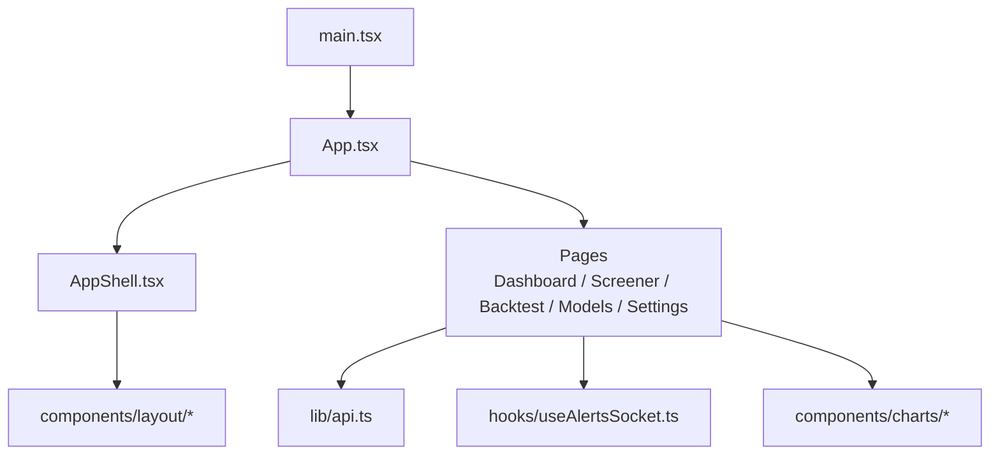
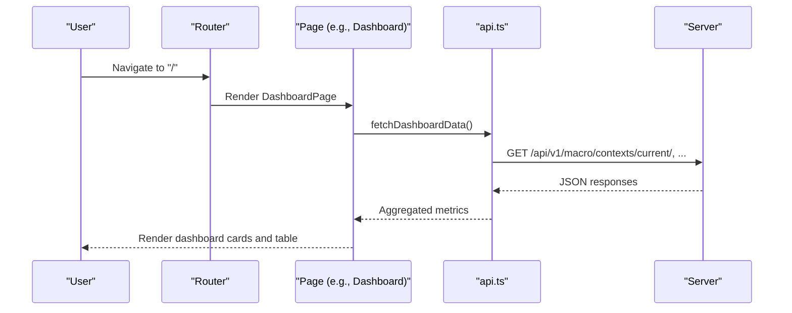
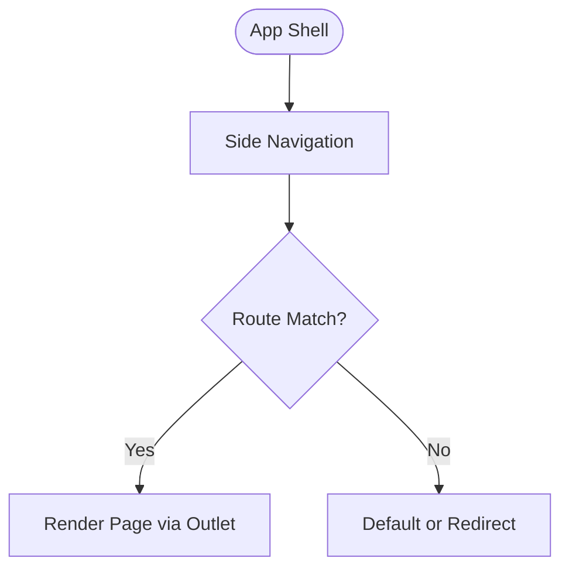
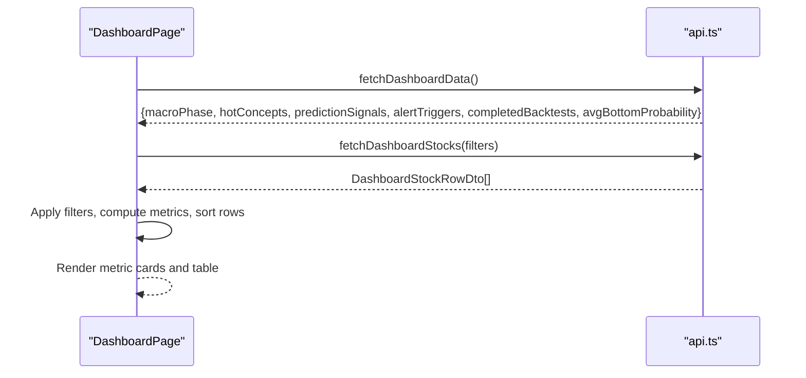
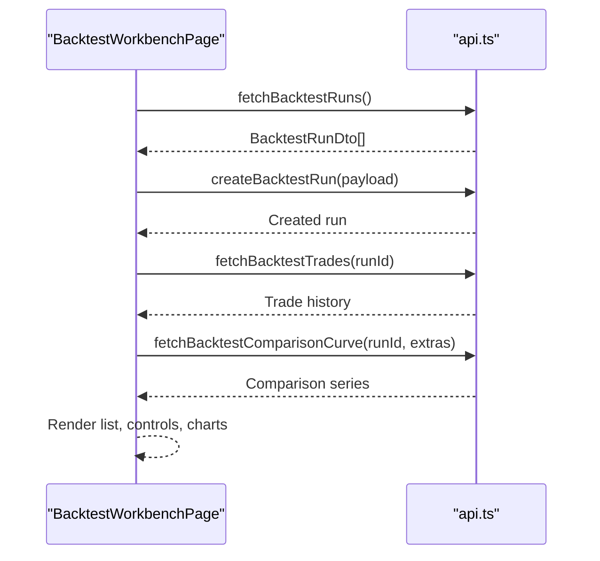
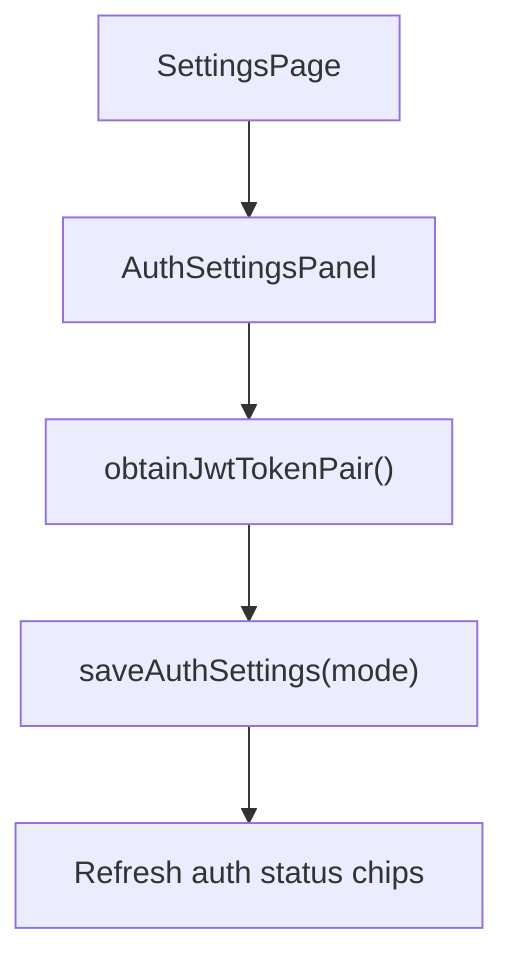
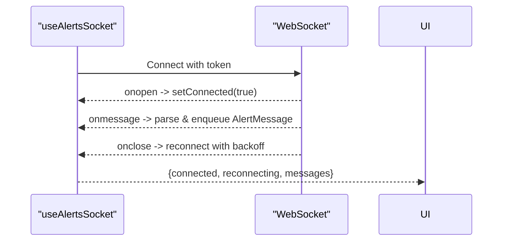
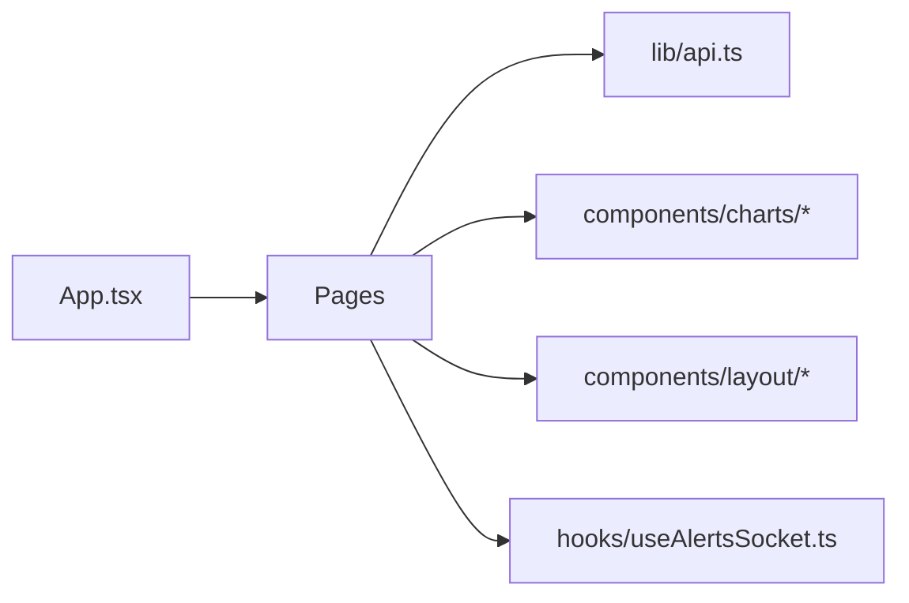

# Frontend Dashboard

<cite>
**Referenced Files in This Document**
- [package.json](file://frontend/package.json)
- [vite.config.ts](file://frontend/vite.config.ts)
- [main.tsx](file://frontend/src/main.tsx)
- [App.tsx](file://frontend/src/App.tsx)
- [i18n.tsx](file://frontend/src/i18n.tsx)
- [AppShell.tsx](file://frontend/src/components/layout/AppShell.tsx)
- [AuthSettingsPanel.tsx](file://frontend/src/components/layout/AuthSettingsPanel.tsx)
- [CandlestickChart.tsx](file://frontend/src/components/charts/CandlestickChart.tsx)
- [BacktestComparisonChart.tsx](file://frontend/src/components/charts/BacktestComparisonChart.tsx)
- [ProbabilityChart.tsx](file://frontend/src/components/charts/ProbabilityChart.tsx)
- [DashboardPage.tsx](file://frontend/src/pages/DashboardPage.tsx)
- [ScreenerPage.tsx](file://frontend/src/pages/ScreenerPage.tsx)
- [BacktestWorkbenchPage.tsx](file://frontend/src/pages/BacktestWorkbenchPage.tsx)
- [ModelMonitoringPage.tsx](file://frontend/src/pages/ModelMonitoringPage.tsx)
- [SettingsPage.tsx](file://frontend/src/pages/SettingsPage.tsx)
- [api.ts](file://frontend/src/lib/api.ts)
- [useAlertsSocket.ts](file://frontend/src/hooks/useAlertsSocket.ts)
</cite>

## Table of Contents
1. Introduction
2. Project Structure
3. Core Components
4. Architecture Overview
5. Detailed Component Analysis
6. Dependency Analysis
7. Performance Considerations
8. Troubleshooting Guide
9. Conclusion
10. Appendices

## Introduction
This document describes the React 19 + TypeScript frontend dashboard for financial analysis. It covers component architecture across pages (dashboard, screener, backtest workbench, model monitoring, settings), state management patterns, API integration strategies, real-time WebSocket alerts, reusable UI elements and charting libraries, build system with Vite, testing setup, development workflow, responsive design, accessibility, internationalization, adding new pages, integrating backend APIs, implementing real-time features, performance optimization for large datasets, browser compatibility, debugging tools, and deployment procedures.

## Project Structure
The frontend is a Vite-based React application using TypeScript. The entrypoint renders an i18n provider and the router-driven app shell. Pages are lazily loaded under routes. Shared logic includes an API client with authentication, pagination helpers, and types; a WebSocket hook for live alerts; and reusable charts and layout components.

**Diagram sources**
- [main.tsx:1-14](file://frontend/src/main.tsx#L1-L14)
- [App.tsx:1-46](file://frontend/src/App.tsx#L1-L46)
- [AppShell.tsx:1-42](file://frontend/src/components/layout/AppShell.tsx#L1-L42)
- [api.ts:1-120](file://frontend/src/lib/api.ts#L1-L120)
- [useAlertsSocket.ts:1-109](file://frontend/src/hooks/useAlertsSocket.ts#L1-L109)

**Section sources**
- [package.json:1-40](file://frontend/package.json#L1-L40)
- [vite.config.ts:1-29](file://frontend/vite.config.ts#L1-L29)
- [main.tsx:1-14](file://frontend/src/main.tsx#L1-L14)
- [App.tsx:1-46](file://frontend/src/App.tsx#L1-L46)

## Core Components
- AppShell: Provides side navigation and content area via Outlet. Navigation items map to routes defined in App.tsx.
- Pages:
  - DashboardPage: Aggregates macro context, hot concepts, signals, alerts, backtests, and candidate stocks with filters and sorting.
  - ScreenerPage: Displays top candidates with sort options.
  - BacktestWorkbenchPage: Runs, controls, and compares backtests; shows trades and equity curves.
  - ModelMonitoringPage: Shows model versions, LightGBM artifacts, feature importance trends, and ensemble weights.
  - SettingsPage: Manages language and authentication (JWT/API key).
- Charts:
  - CandlestickChart: Lightweight-charts-based OHLC visualization.
  - BacktestComparisonChart: Equity curve and drawdown comparison.
  - ProbabilityChart: Multi-horizon probability distribution.
- API Client: Centralized fetch wrapper with JWT refresh, API key headers, error mapping, and typed endpoints.
- Real-time Alerts: useAlertsSocket hook manages WebSocket connection, reconnection, and message queue.

**Section sources**
- [AppShell.tsx:1-42](file://frontend/src/components/layout/AppShell.tsx#L1-L42)
- [DashboardPage.tsx:1-526](file://frontend/src/pages/DashboardPage.tsx#L1-L526)
- [ScreenerPage.tsx:1-83](file://frontend/src/pages/ScreenerPage.tsx#L1-L83)
- [BacktestWorkbenchPage.tsx:1-800](file://frontend/src/pages/BacktestWorkbenchPage.tsx#L1-L800)
- [ModelMonitoringPage.tsx:1-227](file://frontend/src/pages/ModelMonitoringPage.tsx#L1-L227)
- [SettingsPage.tsx:1-52](file://frontend/src/pages/SettingsPage.tsx#L1-L52)
- [CandlestickChart.tsx:1-70](file://frontend/src/components/charts/CandlestickChart.tsx#L1-L70)
- [BacktestComparisonChart.tsx:1-200](file://frontend/src/components/charts/BacktestComparisonChart.tsx#L1-L200)
- [ProbabilityChart.tsx:1-200](file://frontend/src/components/charts/ProbabilityChart.tsx#L1-L200)
- [api.ts:1-936](file://frontend/src/lib/api.ts#L1-L936)
- [useAlertsSocket.ts:1-109](file://frontend/src/hooks/useAlertsSocket.ts#L1-L109)

## Architecture Overview
The application uses React Router v7 for routing with lazy-loaded pages wrapped in Suspense. The AppShell provides persistent navigation. Each page owns its data fetching and local state, calling into lib/api.ts for HTTP requests and hooks/useAlertsSocket.ts for live updates. Charts are rendered by dedicated components that manage their own lifecycle and resize handling.

**Diagram sources**
- [App.tsx:24-39](file://frontend/src/App.tsx#L24-L39)
- [DashboardPage.tsx:121-188](file://frontend/src/pages/DashboardPage.tsx#L121-L188)
- [api.ts:710-738](file://frontend/src/lib/api.ts#L710-L738)

## Detailed Component Analysis

### AppShell and Routing
- Defines nav items and renders NavLink entries with active state styling.
- Uses Outlet to inject page content.
- Routes are configured in App.tsx with lazy loading and Suspense fallbacks.

**Diagram sources**
- [AppShell.tsx:4-42](file://frontend/src/components/layout/AppShell.tsx#L4-L42)
- [App.tsx:24-39](file://frontend/src/App.tsx#L24-L39)

**Section sources**
- [AppShell.tsx:1-42](file://frontend/src/components/layout/AppShell.tsx#L1-L42)
- [App.tsx:1-46](file://frontend/src/App.tsx#L1-L46)

### DashboardPage
- Loads macro context, hot concepts, signals, alerts, backtests, and candidate stocks concurrently.
- Supports candidate filtering (prediction source, horizon, thresholds, candidate mode, trade score scope/threshold, max positions, macro context usage).
- Sortable table with numeric/string comparisons and null-safe ordering.
- Error messages differentiate between missing credentials and server errors.

**Diagram sources**
- [DashboardPage.tsx:121-188](file://frontend/src/pages/DashboardPage.tsx#L121-L188)
- [api.ts:710-803](file://frontend/src/lib/api.ts#L710-L803)

**Section sources**
- [DashboardPage.tsx:1-526](file://frontend/src/pages/DashboardPage.tsx#L1-L526)
- [api.ts:710-803](file://frontend/src/lib/api.ts#L710-L803)

### ScreenerPage
- Fetches top candidates with configurable sort field.
- Displays symbol, name, composite score, bottom probability, trade score, risk-reward ratio, and suggestion flag.

**Section sources**
- [ScreenerPage.tsx:1-83](file://frontend/src/pages/ScreenerPage.tsx#L1-L83)
- [api.ts:768-776](file://frontend/src/lib/api.ts#L768-L776)

### BacktestWorkbenchPage
- Lists backtest runs, supports pause/resume/restart/remove, and auto-refreshes at intervals.
- Submits single or batch rolling-window backtests with rich configuration.
- Loads trades and comparison curves for selected runs; overlays extra completed runs for comparison.
- Builds dashboard filter bundles from runner config to navigate to Dashboard with matching filters.

**Diagram sources**
- [BacktestWorkbenchPage.tsx:316-354](file://frontend/src/pages/BacktestWorkbenchPage.tsx#L316-L354)
- [BacktestWorkbenchPage.tsx:419-492](file://frontend/src/pages/BacktestWorkbenchPage.tsx#L419-L492)
- [BacktestWorkbenchPage.tsx:597-620](file://frontend/src/pages/BacktestWorkbenchPage.tsx#L597-L620)
- [api.ts:810-851](file://frontend/src/lib/api.ts#L810-L851)

**Section sources**
- [BacktestWorkbenchPage.tsx:1-800](file://frontend/src/pages/BacktestWorkbenchPage.tsx#L1-L800)
- [api.ts:810-851](file://frontend/src/lib/api.ts#L810-L851)

### ModelMonitoringPage
- Concurrently loads model versions, LightGBM artifacts, ensemble weights, and feature importance trends.
- Presents tables for inspection and summarizes top features per artifact.

**Section sources**
- [ModelMonitoringPage.tsx:1-227](file://frontend/src/pages/ModelMonitoringPage.tsx#L1-L227)
- [api.ts:901-935](file://frontend/src/lib/api.ts#L901-L935)

### SettingsPage and Authentication
- Language selection persisted via i18n context.
- Auth status display and AuthSettingsPanel for login and API key generation.
- api.ts handles JWT acquisition, refresh token rotation, persistence modes (local/session/none), and automatic header injection.

**Diagram sources**
- [SettingsPage.tsx:1-52](file://frontend/src/pages/SettingsPage.tsx#L1-L52)
- [api.ts:487-529](file://frontend/src/lib/api.ts#L487-L529)
- [api.ts:585-623](file://frontend/src/lib/api.ts#L585-L623)

**Section sources**
- [SettingsPage.tsx:1-52](file://frontend/src/pages/SettingsPage.tsx#L1-L52)
- [api.ts:487-623](file://frontend/src/lib/api.ts#L487-L623)

### Real-time Alerts with WebSocket
- useAlertsSocket connects to ws/alerts with optional token query parameter.
- Implements exponential backoff reconnection up to a maximum attempt count.
- Maintains a bounded message queue and exposes connected/reconnecting states.

**Diagram sources**
- [useAlertsSocket.ts:1-109](file://frontend/src/hooks/useAlertsSocket.ts#L1-L109)

**Section sources**
- [useAlertsSocket.ts:1-109](file://frontend/src/hooks/useAlertsSocket.ts#L1-L109)

### Charting Libraries and Reusable UI
- lightweight-charts for candlestick rendering with responsive resizing and dark theme.
- recharts used for comparative visualizations (equity curves, drawdown, probabilities).
- Cards, tables, and status chips provide consistent UI primitives across pages.

**Section sources**
- [CandlestickChart.tsx:1-70](file://frontend/src/components/charts/CandlestickChart.tsx#L1-L70)
- [BacktestComparisonChart.tsx:1-200](file://frontend/src/components/charts/BacktestComparisonChart.tsx#L1-L200)
- [ProbabilityChart.tsx:1-200](file://frontend/src/components/charts/ProbabilityChart.tsx#L1-L200)

## Dependency Analysis
- Routing dependency: App.tsx defines routes and lazy imports for pages.
- Data dependency: Pages depend on lib/api.ts for all HTTP interactions and type definitions.
- Real-time dependency: AlertCenterPage (if present) would consume useAlertsSocket for live updates.
- UI dependency: Pages compose shared layout and chart components.

**Diagram sources**
- [App.tsx:1-46](file://frontend/src/App.tsx#L1-L46)
- [api.ts:1-120](file://frontend/src/lib/api.ts#L1-L120)
- [useAlertsSocket.ts:1-109](file://frontend/src/hooks/useAlertsSocket.ts#L1-L109)

**Section sources**
- [App.tsx:1-46](file://frontend/src/App.tsx#L1-L46)
- [api.ts:1-120](file://frontend/src/lib/api.ts#L1-L120)

## Performance Considerations
- Lazy loading of pages reduces initial bundle size.
- Concurrent data fetching with Promise.all minimizes load time on dashboards and model monitoring.
- Pagination and limit parameters prevent large payloads; e.g., page_size and top_n controls.
- Auto-refresh intervals for backtest lists and trades avoid excessive polling; consider debouncing user inputs.
- Chart instances are created once per mount and resized efficiently; ensure data arrays are stable or memoized where possible.
- Sorting and filtering are performed client-side on small-to-medium datasets; for larger sets, prefer server-side sorting/filtering.

[No sources needed since this section provides general guidance]

## Troubleshooting Guide
- Authentication failures:
  - If endpoints return 401/403, the client clears stored tokens and may prompt re-login.
  - Use Settings page to configure JWT and API Key; verify persistence mode.
- Network issues:
  - Vite dev proxy forwards /api and /ws to backend; ensure backend is running on port 8000.
  - For production, configure VITE_API_BASE_URL and VITE_ALERTS_WS_URL appropriately.
- WebSocket connectivity:
  - useAlertsSocket attempts reconnection with exponential backoff; check token validity and CORS/WSS settings.
- Empty data:
  - Many pages show “No data” when endpoints return empty results; confirm backend data sync and filters.

**Section sources**
- [api.ts:531-583](file://frontend/src/lib/api.ts#L531-L583)
- [api.ts:653-708](file://frontend/src/lib/api.ts#L653-L708)
- [vite.config.ts:6-22](file://frontend/vite.config.ts#L6-L22)
- [useAlertsSocket.ts:30-105](file://frontend/src/hooks/useAlertsSocket.ts#L30-L105)

## Conclusion
The frontend dashboard is a modular, route-driven React application built with Vite and TypeScript. It centralizes API access and authentication, supports real-time alerts via WebSockets, and offers reusable charting and layout components. Pages implement robust state management, error handling, and user controls for financial workflows such as screening, backtesting, and model monitoring. The project is structured for scalability, maintainability, and clear separation of concerns.

[No sources needed since this section summarizes without analyzing specific files]

## Appendices

### Build System and Development Workflow
- Scripts:
  - dev: Starts Vite dev server with host binding and strict port.
  - build: Type-checks with TypeScript then builds with Vite.
  - test: Runs Vitest tests in jsdom environment.
  - lint: ESLint checks.
  - preview: Serves built assets locally.
- Dev server proxies:
  - /api → http://127.0.0.1:8000
  - /ws → ws://127.0.0.1:8000 with WebSocket support enabled.

**Section sources**
- [package.json:6-11](file://frontend/package.json#L6-L11)
- [vite.config.ts:6-22](file://frontend/vite.config.ts#L6-L22)

### Testing Framework Setup
- Vitest configured with jsdom environment and a setup file for DOM mocks.
- Tests can be run via npm test; add unit tests for components and utilities.

**Section sources**
- [vite.config.ts:24-27](file://frontend/vite.config.ts#L24-L27)

### Adding a New Page
- Create a new page component under src/pages.
- Add a lazy import and route in App.tsx within the children array.
- Wrap the element with the Suspense helper to show localized loading text.
- Implement data fetching via lib/api.ts and handle loading/error states consistently.

**Section sources**
- [App.tsx:6-13](file://frontend/src/App.tsx#L6-L13)
- [App.tsx:15-22](file://frontend/src/App.tsx#L15-L22)
- [App.tsx:24-39](file://frontend/src/App.tsx#L24-L39)

### Integrating with Backend APIs
- Use apiGet/apiPost/apiDelete wrappers for typed requests with automatic JWT refresh and API key headers.
- Define request/response types in lib/api.ts to ensure type safety.
- Handle errors via ApiRequestError with status and detail extraction.

**Section sources**
- [api.ts:403-452](file://frontend/src/lib/api.ts#L403-L452)
- [api.ts:653-708](file://frontend/src/lib/api.ts#L653-L708)

### Implementing Real-time Features
- Use useAlertsSocket to connect to WebSocket endpoints with token-based auth.
- Manage connection state and message queue; render live updates in your page.
- Ensure Vite proxy or production WSS endpoint is correctly configured.

**Section sources**
- [useAlertsSocket.ts:1-109](file://frontend/src/hooks/useAlertsSocket.ts#L1-L109)
- [vite.config.ts:11-21](file://frontend/vite.config.ts#L11-L21)

### Responsive Design and Accessibility
- Use CSS classes like card, data-table, and status chips for consistent layouts.
- Provide labels and accessible names for form controls (e.g., select, input).
- Ensure keyboard navigation for sortable columns and actions.

**Section sources**
- [DashboardPage.tsx:490-523](file://frontend/src/pages/DashboardPage.tsx#L490-L523)
- [ScreenerPage.tsx:44-79](file://frontend/src/pages/ScreenerPage.tsx#L44-L79)

### Internationalization Support
- I18nProvider wraps the app and exposes t(key) function.
- Keys are centralized in i18n.tsx with zh-CN and en-US dictionaries.
- All user-facing strings should use t() for localization.

**Section sources**
- [i18n.tsx:1-636](file://frontend/src/i18n.tsx#L1-L636)
- [main.tsx:7-13](file://frontend/src/main.tsx#L7-L13)

### Browser Compatibility
- Targets modern browsers supported by React 19 and Vite.
- WebSocket support required for live alerts; ensure secure contexts (HTTPS) for WSS in production.

[No sources needed since this section provides general guidance]

### Debugging Tools
- Use browser DevTools network tab to inspect API calls and WebSocket frames.
- Enable Vite dev server logs and console output for errors.
- Leverage ESLint rules and TypeScript compiler errors during development.

[No sources needed since this section provides general guidance]

### Deployment Procedures
- Build the app with npm run build to generate static assets.
- Serve the dist folder via a web server or CDN.
- Configure environment variables:
  - VITE_API_BASE_URL for REST endpoints.
  - VITE_ALERTS_WS_URL for WebSocket alerts.
- Ensure CORS and security headers are set for both HTTP and WebSocket endpoints.

**Section sources**
- [package.json:6-11](file://frontend/package.json#L6-L11)
- [vite.config.ts:1-5](file://frontend/vite.config.ts#L1-L5)