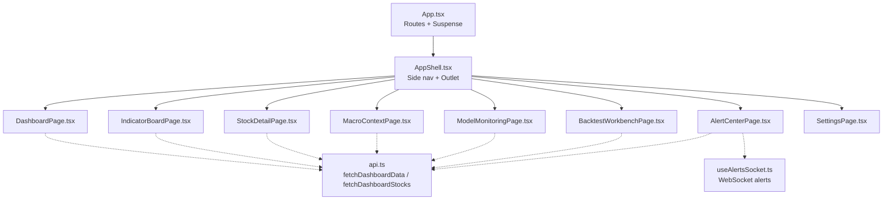
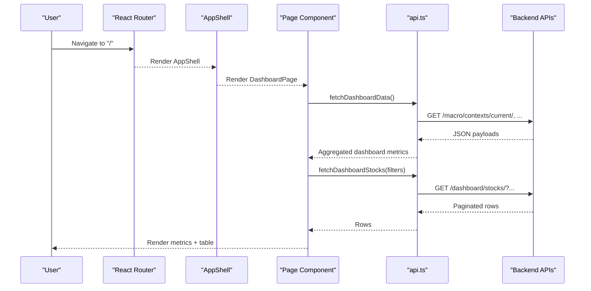
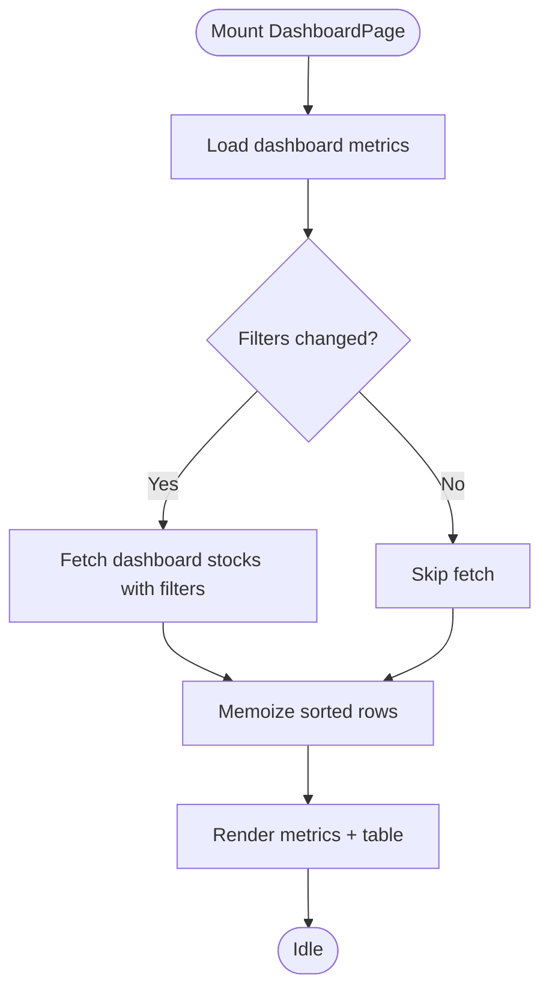
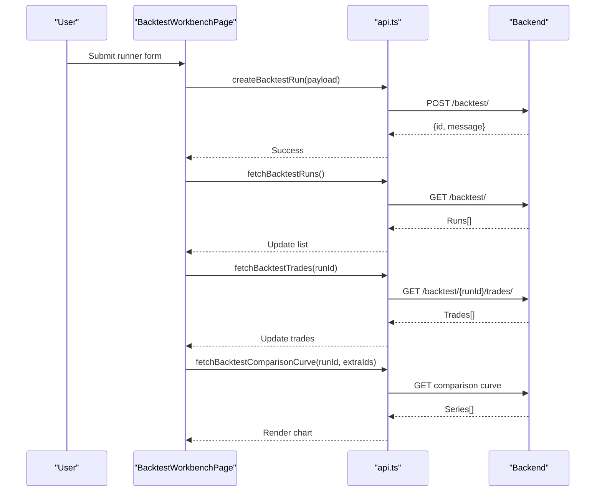
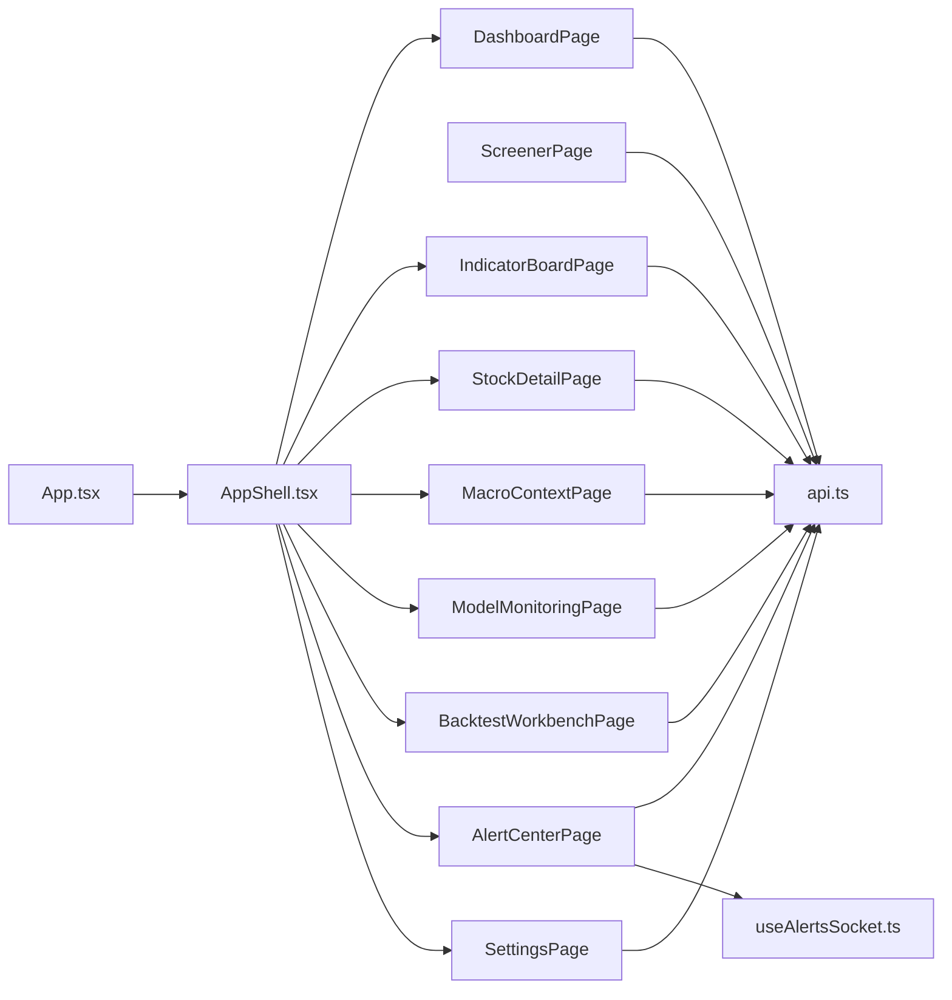

# Page Components

<cite>
**Referenced Files in This Document**
- [App.tsx](file://frontend/src/App.tsx)
- [AppShell.tsx](file://frontend/src/components/layout/AppShell.tsx)
- [DashboardPage.tsx](file://frontend/src/pages/DashboardPage.tsx)
- [ScreenerPage.tsx](file://frontend/src/pages/ScreenerPage.tsx)
- [BacktestWorkbenchPage.tsx](file://frontend/src/pages/BacktestWorkbenchPage.tsx)
- [ModelMonitoringPage.tsx](file://frontend/src/pages/ModelMonitoringPage.tsx)
- [AlertCenterPage.tsx](file://frontend/src/pages/AlertCenterPage.tsx)
- [IndicatorBoardPage.tsx](file://frontend/src/pages/IndicatorBoardPage.tsx)
- [MacroContextPage.tsx](file://frontend/src/pages/MacroContextPage.tsx)
- [SettingsPage.tsx](file://frontend/src/pages/SettingsPage.tsx)
- [StockDetailPage.tsx](file://frontend/src/pages/StockDetailPage.tsx)
- [api.ts](file://frontend/src/lib/api.ts)
- [useAlertsSocket.ts](file://frontend/src/hooks/useAlertsSocket.ts)
- [DashboardPage.test.tsx](file://frontend/src/pages/DashboardPage.test.tsx)
- [BacktestWorkbenchPage.test.tsx](file://frontend/src/pages/BacktestWorkbenchPage.test.tsx)
- [IndicatorBoardPage.test.tsx](file://frontend/src/pages/IndicatorBoardPage.test.tsx)
</cite>

## Table of Contents
1. Introduction
2. Project Structure
3. Core Components
4. Architecture Overview
5. Detailed Component Analysis
6. Dependency Analysis
7. Performance Considerations
8. Troubleshooting Guide
9. Conclusion
10. Appendices

## Introduction
This document explains the React page components that form the main user interface of the FinanceAnalysis dashboard. It covers routing, navigation patterns, state management, data fetching strategies, backend API integration, responsive UI considerations, and testing strategies for each page. The goal is to help both technical and non-technical readers understand how the pages work together and how to maintain consistent UI patterns across the application.

## Project Structure
The frontend uses React Router v6 with lazy-loaded routes and a shared AppShell for navigation. Pages are organized under src/pages and share a common API client in src/lib/api.ts. Charts and layout helpers live under src/components.

**Diagram sources**
- [App.tsx:24-39](file://frontend/src/App.tsx#L24-L39)
- [AppShell.tsx:1-42](file://frontend/src/components/layout/AppShell.tsx#L1-L42)
- [DashboardPage.tsx:1-20](file://frontend/src/pages/DashboardPage.tsx#L1-L20)
- [IndicatorBoardPage.tsx:1-10](file://frontend/src/pages/IndicatorBoardPage.tsx#L1-L10)
- [StockDetailPage.tsx:1-17](file://frontend/src/pages/StockDetailPage.tsx#L1-L17)
- [MacroContextPage.tsx:1-6](file://frontend/src/pages/MacroContextPage.tsx#L1-L6)
- [ModelMonitoringPage.tsx:1-13](file://frontend/src/pages/ModelMonitoringPage.tsx#L1-L13)
- [BacktestWorkbenchPage.tsx:1-26](file://frontend/src/pages/BacktestWorkbenchPage.tsx#L1-L26)
- [AlertCenterPage.tsx:1-6](file://frontend/src/pages/AlertCenterPage.tsx#L1-L6)
- [api.ts:710-738](file://frontend/src/lib/api.ts#L710-L738)

**Section sources**
- [App.tsx:1-46](file://frontend/src/App.tsx#L1-L46)
- [AppShell.tsx:1-42](file://frontend/src/components/layout/AppShell.tsx#L1-L42)

## Core Components
- DashboardPage: Aggregates macro context, hot concepts, signals, alerts, backtests, and screener metrics; displays candidate table with filters and sorting.
- ScreenerPage: Lists bottom candidates sorted by various metrics.
- BacktestWorkbenchPage: Creates, controls, and compares backtest runs; shows trades and performance curves.
- ModelMonitoringPage: Displays model versions, LightGBM artifacts, feature importance trends, and ensemble weights.
- AlertCenterPage: Shows real-time alert messages via WebSocket and historical alert events via REST.
- IndicatorBoardPage: Full indicator table with per-column filtering and sorting.
- MacroContextPage: Lists macro phases and active tags.
- SettingsPage: Configures locale and authentication (JWT/API key).
- StockDetailPage: Asset selector, OHLCV chart, probability charts, and side-by-side model comparisons.

Key patterns:
- State: Local component state via useState; derived values via useMemo; effects for data fetching via useEffect.
- Data fetching: Centralized in api.ts with auth refresh, pagination handling, and typed DTOs.
- Routing: Lazy-loaded routes wrapped in Suspense; programmatic navigation via useNavigate.
- Real-time: WebSocket hook for live alerts; polling intervals for backtest status.

**Section sources**
- [DashboardPage.tsx:93-188](file://frontend/src/pages/DashboardPage.tsx#L93-L188)
- [ScreenerPage.tsx:5-36](file://frontend/src/pages/ScreenerPage.tsx#L5-L36)
- [BacktestWorkbenchPage.tsx:237-404](file://frontend/src/pages/BacktestWorkbenchPage.tsx#L237-L404)
- [ModelMonitoringPage.tsx:27-71](file://frontend/src/pages/ModelMonitoringPage.tsx#L27-L71)
- [AlertCenterPage.tsx:6-31](file://frontend/src/pages/AlertCenterPage.tsx#L6-L31)
- [IndicatorBoardPage.tsx:26-59](file://frontend/src/pages/IndicatorBoardPage.tsx#L26-L59)
- [MacroContextPage.tsx:5-35](file://frontend/src/pages/MacroContextPage.tsx#L5-L35)
- [SettingsPage.tsx:6-49](file://frontend/src/pages/SettingsPage.tsx#L6-L49)
- [StockDetailPage.tsx:19-135](file://frontend/src/pages/StockDetailPage.tsx#L19-L135)
- [api.ts:403-419](file://frontend/src/lib/api.ts#L403-L419)
- [api.ts:653-678](file://frontend/src/lib/api.ts#L653-L678)

## Architecture Overview
The app uses a shell-and-pages architecture:
- App.tsx defines routes and wraps each page in Suspense for lazy loading.
- AppShell renders a side navigation and an outlet for page content.
- Each page owns its state and fetches data from api.ts, which handles authentication, token refresh, and error mapping.
- Real-time features use a dedicated WebSocket hook.

**Diagram sources**
- [App.tsx:24-39](file://frontend/src/App.tsx#L24-L39)
- [AppShell.tsx:15-41](file://frontend/src/components/layout/AppShell.tsx#L15-L41)
- [DashboardPage.tsx:121-188](file://frontend/src/pages/DashboardPage.tsx#L121-L188)
- [api.ts:710-738](file://frontend/src/lib/api.ts#L710-L738)
- [api.ts:778-800](file://frontend/src/lib/api.ts#L778-L800)

## Detailed Component Analysis

### DashboardPage
Responsibilities:
- Fetch aggregated dashboard metrics and candidate stocks based on filters.
- Manage filter state and URL-synced search params.
- Sort and render candidate table with dynamic columns based on prediction source.

State and data flow:
- Uses local state for loading, error, dashboard metrics, rows, sort fields/direction, and draft filters.
- Parses URL search params into filters and applies them to fetch calls.
- Computes displayed rows with memoized sorting.

Integration points:
- Calls fetchDashboardData and fetchDashboardStocks from api.ts.
- Navigates to IndicatorBoardPage.

Routing and navigation:
- Default route "/".
- Uses useSearchParams to sync filters and reminders.

Responsive design:
- Uses semantic sections, cards, and tables; styling classes indicate responsive layout (e.g., metric-grid, card, table-wrap).

Testing highlights:
- Verifies URL-driven filter hydration, mode switching, column visibility, and sorting behavior.

**Diagram sources**
- [DashboardPage.tsx:121-188](file://frontend/src/pages/DashboardPage.tsx#L121-L188)
- [DashboardPage.tsx:266-277](file://frontend/src/pages/DashboardPage.tsx#L266-L277)

**Section sources**
- [DashboardPage.tsx:93-188](file://frontend/src/pages/DashboardPage.tsx#L93-L188)
- [DashboardPage.tsx:242-277](file://frontend/src/pages/DashboardPage.tsx#L242-L277)
- [DashboardPage.tsx:279-293](file://frontend/src/pages/DashboardPage.tsx#L279-L293)
- [DashboardPage.tsx:295-523](file://frontend/src/pages/DashboardPage.tsx#L295-L523)
- [DashboardPage.test.tsx:119-145](file://frontend/src/pages/DashboardPage.test.tsx#L119-L145)
- [DashboardPage.test.tsx:147-184](file://frontend/src/pages/DashboardPage.test.tsx#L147-L184)
- [DashboardPage.test.tsx:186-209](file://frontend/src/pages/DashboardPage.test.tsx#L186-L209)

### ScreenerPage
Responsibilities:
- Display bottom candidates with sortable metrics.

State and data flow:
- Local state for rows, loading, error, and sort field.
- Fetches screener rows on mount and when sort changes.

Integration points:
- Calls fetchScreenerRows from api.ts.

UI:
- Simple card with select for sorting and a data table.

**Section sources**
- [ScreenerPage.tsx:5-36](file://frontend/src/pages/ScreenerPage.tsx#L5-L36)
- [ScreenerPage.tsx:38-82](file://frontend/src/pages/ScreenerPage.tsx#L38-L82)
- [api.ts:768-776](file://frontend/src/lib/api.ts#L768-L776)

### BacktestWorkbenchPage
Responsibilities:
- Create single or batch backtest runs.
- List runs with control actions (pause/resume/restart/remove).
- Show selected run’s trades and comparison curve.
- Auto-refresh running runs and trade lists.

State and data flow:
- Extensive local state for runner form, runs, trades, comparison payload, pagination, and busy states.
- Loads runs on mount with periodic refresh; loads trades when selection changes.
- Builds payloads using helper functions and navigates to Dashboard with current config.

Integration points:
- Calls createBacktestRun, pauseBacktestRun, resumeBacktestRun, restartBacktestRun, deleteBacktestRun, fetchBacktestRuns, fetchBacktestTrades, fetchBacktestComparisonCurve.

UI:
- Runner form with conditional fields based on mode/metric.
- Tables for runs and trades; chart for comparison curve.

Testing highlights:
- Validates mode toggles, horizon sync, reused run config, compare target injection, control actions, dead task handling, and auto-refresh behavior.

**Diagram sources**
- [BacktestWorkbenchPage.tsx:419-475](file://frontend/src/pages/BacktestWorkbenchPage.tsx#L419-L475)
- [BacktestWorkbenchPage.tsx:494-538](file://frontend/src/pages/BacktestWorkbenchPage.tsx#L494-L538)
- [BacktestWorkbenchPage.tsx:540-560](file://frontend/src/pages/BacktestWorkbenchPage.tsx#L540-L560)
- [BacktestWorkbenchPage.tsx:587-620](file://frontend/src/pages/BacktestWorkbenchPage.tsx#L587-L620)
- [api.ts:666-700](file://frontend/src/lib/api.ts#L666-L700)

**Section sources**
- [BacktestWorkbenchPage.tsx:237-404](file://frontend/src/pages/BacktestWorkbenchPage.tsx#L237-L404)
- [BacktestWorkbenchPage.tsx:419-475](file://frontend/src/pages/BacktestWorkbenchPage.tsx#L419-L475)
- [BacktestWorkbenchPage.tsx:494-560](file://frontend/src/pages/BacktestWorkbenchPage.tsx#L494-L560)
- [BacktestWorkbenchPage.tsx:576-620](file://frontend/src/pages/BacktestWorkbenchPage.tsx#L576-L620)
- [BacktestWorkbenchPage.test.tsx:416-519](file://frontend/src/pages/BacktestWorkbenchPage.test.tsx#L416-L519)
- [BacktestWorkbenchPage.test.tsx:521-693](file://frontend/src/pages/BacktestWorkbenchPage.test.tsx#L521-L693)
- [BacktestWorkbenchPage.test.tsx:694-800](file://frontend/src/pages/BacktestWorkbenchPage.test.tsx#L694-L800)

### ModelMonitoringPage
Responsibilities:
- Display model versions, LightGBM artifacts, feature importance trends, and ensemble weights.

State and data flow:
- Single effect fetches all datasets in parallel and sets state.
- Memoizes flattened feature trend rows for display.

Integration points:
- Calls fetchModelVersions, fetchLightGBMModels, fetchEnsembleWeights, fetchLightGBMFeatureImportanceTrends.

UI:
- Multiple cards with tables; no-data fallbacks.

**Section sources**
- [ModelMonitoringPage.tsx:27-71](file://frontend/src/pages/ModelMonitoringPage.tsx#L27-L71)
- [ModelMonitoringPage.tsx:73-88](file://frontend/src/pages/ModelMonitoringPage.tsx#L73-L88)
- [ModelMonitoringPage.tsx:90-227](file://frontend/src/pages/ModelMonitoringPage.tsx#L90-L227)

### AlertCenterPage
Responsibilities:
- Show live alert stream via WebSocket and historical alert events via REST.

State and data flow:
- Uses useAlertsSocket hook for connected state and messages.
- Fetches history on mount.

Integration points:
- Calls apiGet('/alert-events/?page_size=20').

UI:
- Status indicators for connection state; lists for live and historical alerts.

**Section sources**
- [AlertCenterPage.tsx:6-31](file://frontend/src/pages/AlertCenterPage.tsx#L6-L31)
- [AlertCenterPage.tsx:33-67](file://frontend/src/pages/AlertCenterPage.tsx#L33-L67)
- [useAlertsSocket.ts:1-200](file://frontend/src/hooks/useAlertsSocket.ts#L1-L200)

### IndicatorBoardPage
Responsibilities:
- Provide a full indicator board with per-column filtering and sorting.

State and data flow:
- Fetches dashboard stocks once on mount.
- Memoizes filtered and sorted rows.

Integration points:
- Calls fetchDashboardStocks with fixed horizon and page size.

UI:
- Header, status/error messages, table with filter row and sortable headers.

Testing highlights:
- Confirms correct query parameters and rendered content.

**Section sources**
- [IndicatorBoardPage.tsx:26-59](file://frontend/src/pages/IndicatorBoardPage.tsx#L26-L59)
- [IndicatorBoardPage.tsx:61-122](file://frontend/src/pages/IndicatorBoardPage.tsx#L61-L122)
- [IndicatorBoardPage.tsx:124-180](file://frontend/src/pages/IndicatorBoardPage.tsx#L124-L180)
- [IndicatorBoardPage.test.tsx:21-89](file://frontend/src/pages/IndicatorBoardPage.test.tsx#L21-L89)

### MacroContextPage
Responsibilities:
- Display macro contexts with phase, event tag, and active status.

State and data flow:
- Fetches macro contexts on mount.

Integration points:
- Calls fetchMacroContexts.

UI:
- Card with table; no-data fallback.

**Section sources**
- [MacroContextPage.tsx:5-35](file://frontend/src/pages/MacroContextPage.tsx#L5-L35)
- [MacroContextPage.tsx:37-72](file://frontend/src/pages/MacroContextPage.tsx#L37-L72)

### SettingsPage
Responsibilities:
- Configure language and authentication settings.

State and data flow:
- Reads JWT and API key presence; exposes AuthSettingsPanel for updates.

Integration points:
- Uses readAuthToken, readApiKey, and AuthSettingsPanel.

UI:
- Locale selector; auth status chips; panel for credentials.

**Section sources**
- [SettingsPage.tsx:6-49](file://frontend/src/pages/SettingsPage.tsx#L6-L49)

### StockDetailPage
Responsibilities:
- Asset selector, OHLCV candlestick chart, probability chart, and model comparison tables.

State and data flow:
- Fetches asset list once.
- On symbol change, fetches asset details, OHLCV, heuristic predictions, LightGBM predictions, and sentiment; merges results into comparison tables.

Integration points:
- Calls fetchAssets, fetchAssetBySymbol, fetchOhlcvByAsset, fetchPredictionBySymbol, fetchLightGBMPredictionBySymbol, fetchSentimentByAsset.

UI:
- Searchable selector; charts; multiple tables; error handling for HTTP errors.

**Section sources**
- [StockDetailPage.tsx:19-135](file://frontend/src/pages/StockDetailPage.tsx#L19-L135)
- [StockDetailPage.tsx:137-252](file://frontend/src/pages/StockDetailPage.tsx#L137-L252)
- [StockDetailPage.tsx:254-385](file://frontend/src/pages/StockDetailPage.tsx#L254-L385)

## Dependency Analysis
Pages depend on:
- React Router for navigation and URL state.
- i18n for localized labels.
- api.ts for all data operations and auth handling.
- Chart components for visualizations.
- WebSocket hook for live alerts.

**Diagram sources**
- [App.tsx:24-39](file://frontend/src/App.tsx#L24-L39)
- [AppShell.tsx:1-42](file://frontend/src/components/layout/AppShell.tsx#L1-L42)
- [DashboardPage.tsx:1-20](file://frontend/src/pages/DashboardPage.tsx#L1-L20)
- [ScreenerPage.tsx:1-6](file://frontend/src/pages/ScreenerPage.tsx#L1-L6)
- [BacktestWorkbenchPage.tsx:1-26](file://frontend/src/pages/BacktestWorkbenchPage.tsx#L1-L26)
- [ModelMonitoringPage.tsx:1-13](file://frontend/src/pages/ModelMonitoringPage.tsx#L1-L13)
- [AlertCenterPage.tsx:1-6](file://frontend/src/pages/AlertCenterPage.tsx#L1-L6)
- [IndicatorBoardPage.tsx:1-10](file://frontend/src/pages/IndicatorBoardPage.tsx#L1-L10)
- [MacroContextPage.tsx:1-6](file://frontend/src/pages/MacroContextPage.tsx#L1-L6)
- [SettingsPage.tsx:1-6](file://frontend/src/pages/SettingsPage.tsx#L1-L6)
- [StockDetailPage.tsx:1-17](file://frontend/src/pages/StockDetailPage.tsx#L1-L17)
- [api.ts:403-419](file://frontend/src/lib/api.ts#L403-L419)

**Section sources**
- [App.tsx:1-46](file://frontend/src/App.tsx#L1-L46)
- [api.ts:403-419](file://frontend/src/lib/api.ts#L403-L419)

## Performance Considerations
- Use memoization (useMemo) for computed lists and column definitions to avoid unnecessary re-renders.
- Parallel data fetching where possible (e.g., ModelMonitoringPage uses Promise.all).
- Debounce or limit polling frequency for long-running tasks (BacktestWorkbenchPage uses interval-based refresh).
- Prefer server-side pagination and reasonable page sizes (e.g., IndicatorBoardPage uses pageSize 120).
- Avoid redundant requests by guarding with alive flags and request ID refs to prevent stale updates.

[No sources needed since this section provides general guidance]

## Troubleshooting Guide
Common issues and resolutions:
- Authentication failures:
  - api.ts automatically retries on 401 by refreshing JWT tokens; if refresh fails, stored tokens are cleared.
  - Pages show contextual error messages indicating whether credentials are configured.
- Network errors:
  - All pages catch errors and set a disconnected status message; ensure backend endpoints are reachable.
- WebSocket connectivity:
  - AlertCenterPage displays connected/reconnecting/disconnected states; verify WebSocket endpoint configuration.
- Stale or missing data:
  - Some pages handle empty responses gracefully with “no data” placeholders; check backend data pipelines.

**Section sources**
- [api.ts:531-583](file://frontend/src/lib/api.ts#L531-L583)
- [api.ts:653-700](file://frontend/src/lib/api.ts#L653-L700)
- [DashboardPage.tsx:121-188](file://frontend/src/pages/DashboardPage.tsx#L121-L188)
- [AlertCenterPage.tsx:6-31](file://frontend/src/pages/AlertCenterPage.tsx#L6-L31)

## Conclusion
The FinanceAnalysis dashboard is built around a clear separation of concerns: routing and shell in App.tsx and AppShell.tsx, domain-specific pages with focused responsibilities, and a centralized API client for data and authentication. Pages consistently manage local state, fetch data efficiently, and present information with accessible, responsive UI patterns. Testing focuses on user interactions, data flows, and edge cases such as authentication and network errors. Following these patterns ensures maintainability and consistency across the application.

[No sources needed since this section summarizes without analyzing specific files]

## Appendices

### Routing and Navigation Patterns
- Routes are defined centrally and lazy-loaded to reduce initial bundle size.
- Navigation uses React Router hooks (useNavigate, useSearchParams) for programmatic control and URL-driven state.
- AppShell provides a persistent side navigation with active link highlighting.

**Section sources**
- [App.tsx:24-39](file://frontend/src/App.tsx#L24-L39)
- [AppShell.tsx:1-42](file://frontend/src/components/layout/AppShell.tsx#L1-L42)

### Data Fetching Strategies
- Centralized fetch wrappers add auth headers and handle token refresh.
- Pagination utilities normalize paginated responses.
- Safe fetch helpers return fallback values for optional endpoints.

**Section sources**
- [api.ts:403-419](file://frontend/src/lib/api.ts#L403-L419)
- [api.ts:394-401](file://frontend/src/lib/api.ts#L394-L401)
- [api.ts:702-708](file://frontend/src/lib/api.ts#L702-L708)

### Testing Strategies
- Mock API functions to isolate component logic.
- Use MemoryRouter to simulate navigation and URL state.
- Assert user interactions (select options, clicks) and resulting API calls.
- Validate rendering of expected text and structure.

**Section sources**
- [DashboardPage.test.tsx:9-22](file://frontend/src/pages/DashboardPage.test.tsx#L9-L22)
- [DashboardPage.test.tsx:119-209](file://frontend/src/pages/DashboardPage.test.tsx#L119-L209)
- [BacktestWorkbenchPage.test.tsx:30-336](file://frontend/src/pages/BacktestWorkbenchPage.test.tsx#L30-L336)
- [BacktestWorkbenchPage.test.tsx:416-800](file://frontend/src/pages/BacktestWorkbenchPage.test.tsx#L416-L800)
- [IndicatorBoardPage.test.tsx:8-19](file://frontend/src/pages/IndicatorBoardPage.test.tsx#L8-L19)
- [IndicatorBoardPage.test.tsx:21-89](file://frontend/src/pages/IndicatorBoardPage.test.tsx#L21-L89)