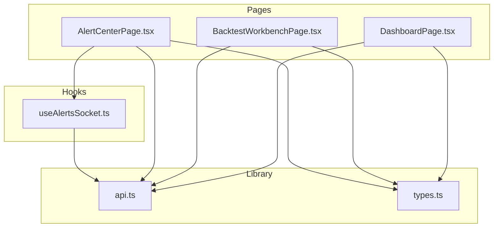
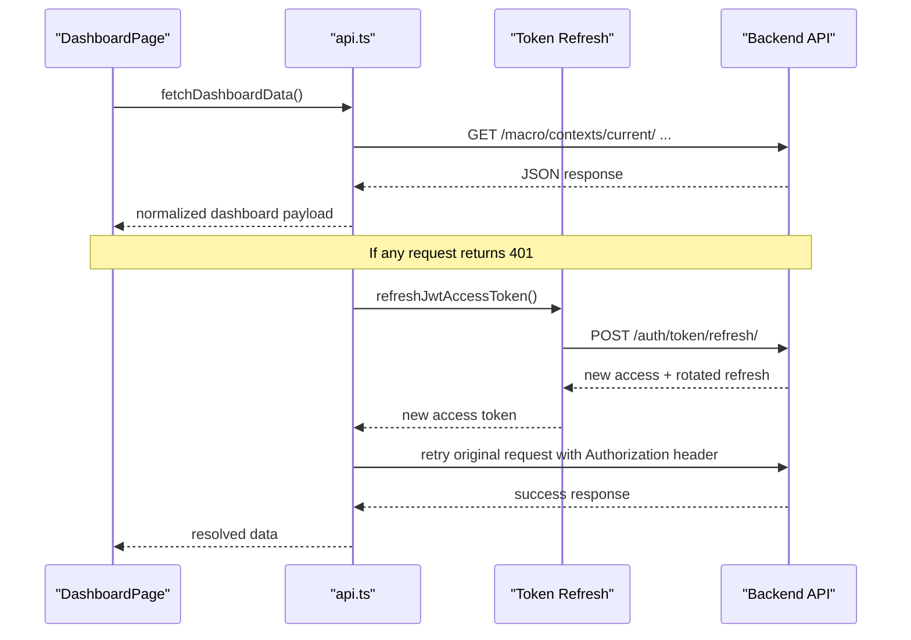
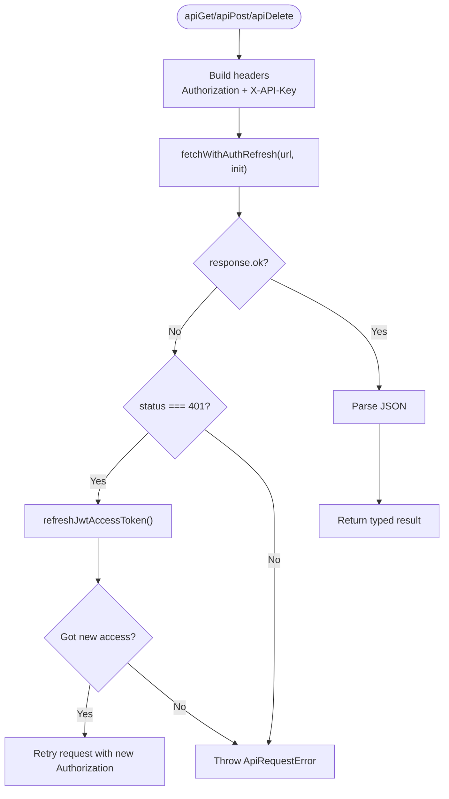
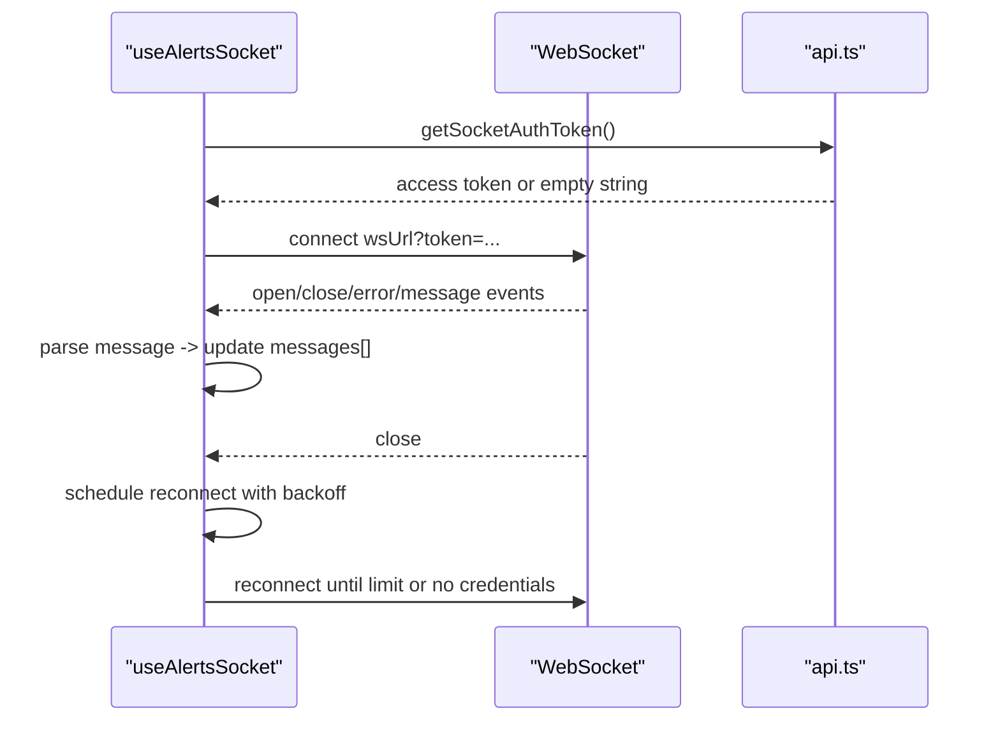
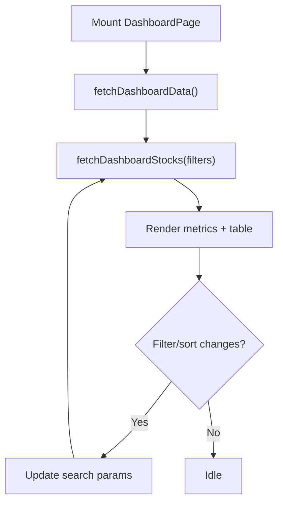
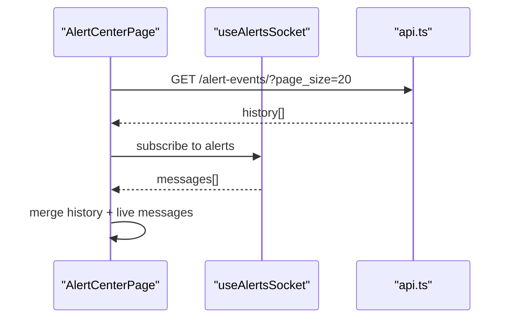
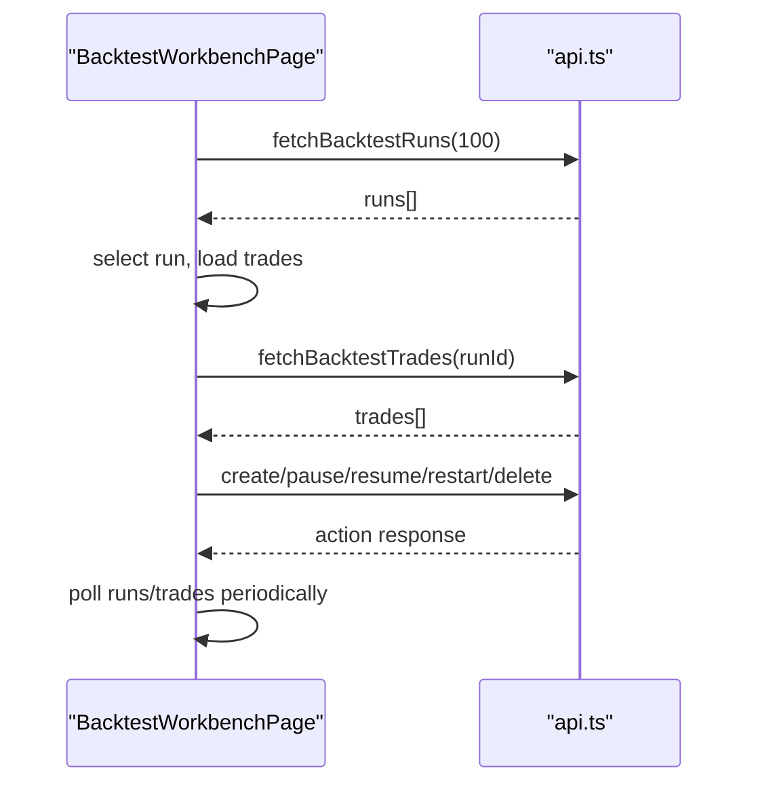
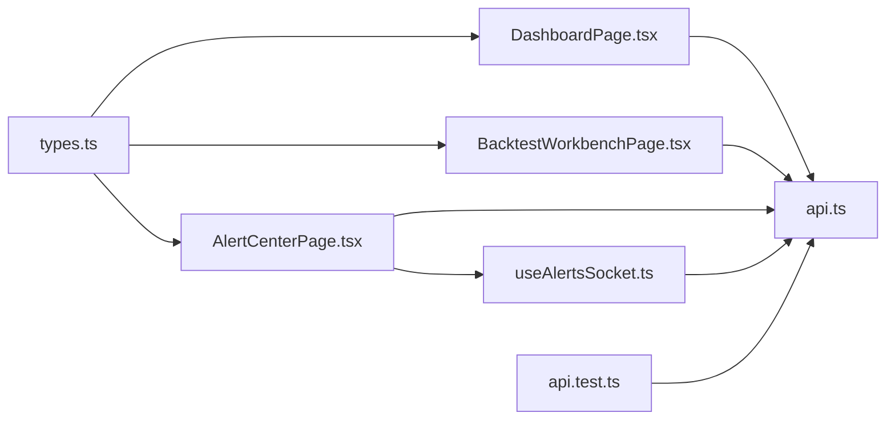

# State Management & API Integration

<cite>
**Referenced Files in This Document**
- [api.ts](file://frontend/src/lib/api.ts)
- [useAlertsSocket.ts](file://frontend/src/hooks/useAlertsSocket.ts)
- [types.ts](file://frontend/src/types.ts)
- [DashboardPage.tsx](file://frontend/src/pages/DashboardPage.tsx)
- [AlertCenterPage.tsx](file://frontend/src/pages/AlertCenterPage.tsx)
- [BacktestWorkbenchPage.tsx](file://frontend/src/pages/BacktestWorkbenchPage.tsx)
- [api.test.ts](file://frontend/src/lib/api.test.ts)
</cite>

## Table of Contents
1. [Introduction](#introduction)
2. [Project Structure](#project-structure)
3. [Core Components](#core-components)
4. [Architecture Overview](#architecture-overview)
5. [Detailed Component Analysis](#detailed-component-analysis)
6. [Dependency Analysis](#dependency-analysis)
7. [Performance Considerations](#performance-considerations)
8. [Troubleshooting Guide](#troubleshooting-guide)
9. [Conclusion](#conclusion)
10. [Appendices](#appendices)

## Introduction
This document explains how the FinanceAnalysis frontend manages state and integrates with APIs. It focuses on:
- The centralized API client in api.ts for request/response handling, error management, and authentication flows
- Real-time alert streaming via WebSocket using useAlertsSocket hook
- TypeScript type definitions used across the app for type safety
- Data fetching patterns, caching strategies, and optimistic updates
- Error handling approaches, loading states management, and performance optimization techniques
- Guidance to extend the API client and implement custom hooks for complex state logic

## Project Structure
The frontend is organized around a small set of core modules:
- lib/api.ts: Centralized HTTP client, auth helpers, typed data fetchers
- hooks/useAlertsSocket.ts: WebSocket integration for live alerts
- pages/*: Feature pages that compose API calls and local React state
- types.ts: Shared domain types used by UI components

**Diagram sources**
- [DashboardPage.tsx:1-20](file://frontend/src/pages/DashboardPage.tsx#L1-L20)
- [AlertCenterPage.tsx:1-10](file://frontend/src/pages/AlertCenterPage.tsx#L1-L10)
- [BacktestWorkbenchPage.tsx:1-20](file://frontend/src/pages/BacktestWorkbenchPage.tsx#L1-L20)
- [useAlertsSocket.ts:1-10](file://frontend/src/hooks/useAlertsSocket.ts#L1-L10)
- [api.ts:1-30](file://frontend/src/lib/api.ts#L1-L30)
- [types.ts:1-20](file://frontend/src/types.ts#L1-L20)

**Section sources**
- [DashboardPage.tsx:1-20](file://frontend/src/pages/DashboardPage.tsx#L1-L20)
- [AlertCenterPage.tsx:1-10](file://frontend/src/pages/AlertCenterPage.tsx#L1-L10)
- [BacktestWorkbenchPage.tsx:1-20](file://frontend/src/pages/BacktestWorkbenchPage.tsx#L1-L20)
- [useAlertsSocket.ts:1-10](file://frontend/src/hooks/useAlertsSocket.ts#L1-L10)
- [api.ts:1-30](file://frontend/src/lib/api.ts#L1-L30)
- [types.ts:1-20](file://frontend/src/types.ts#L1-L20)

## Core Components
- Centralized API client (api.ts):
  - Provides typed GET/POST/DELETE helpers
  - Handles JWT access/refresh token lifecycle and automatic retry on 401
  - Stores credentials in localStorage or sessionStorage based on persistence mode
  - Exposes feature-specific fetchers (dashboard, backtests, assets, predictions, etc.)
- WebSocket hook (useAlertsSocket.ts):
  - Connects to /ws/alerts/ with optional token query parameter
  - Manages connection state, reconnection with exponential backoff, and message parsing
- Page-level state:
  - DashboardPage uses local state for filters, sorting, and fetched rows
  - BacktestWorkbenchPage orchestrates runs, trades, comparison curves, and auto-refresh intervals
  - AlertCenterPage merges live WebSocket messages with historical API data

**Section sources**
- [api.ts:394-700](file://frontend/src/lib/api.ts#L394-L700)
- [api.ts:710-936](file://frontend/src/lib/api.ts#L710-L936)
- [useAlertsSocket.ts:23-108](file://frontend/src/hooks/useAlertsSocket.ts#L23-L108)
- [DashboardPage.tsx:93-188](file://frontend/src/pages/DashboardPage.tsx#L93-L188)
- [BacktestWorkbenchPage.tsx:237-404](file://frontend/src/pages/BacktestWorkbenchPage.tsx#L237-L404)
- [AlertCenterPage.tsx:6-31](file://frontend/src/pages/AlertCenterPage.tsx#L6-L31)

## Architecture Overview
The frontend follows a layered approach:
- Pages manage UI state and orchestrate data fetching
- The API client centralizes HTTP concerns, auth, and error handling
- The WebSocket hook provides real-time updates independent of REST calls
- Types ensure consistent contracts between layers

**Diagram sources**
- [api.ts:531-583](file://frontend/src/lib/api.ts#L531-L583)
- [api.ts:653-678](file://frontend/src/lib/api.ts#L653-L678)
- [DashboardPage.tsx:121-157](file://frontend/src/pages/DashboardPage.tsx#L121-L157)

## Detailed Component Analysis

### Centralized API Client (api.ts)
Responsibilities:
- Request/response handling:
  - Typed wrappers for GET/POST/DELETE
  - Automatic pagination normalization for endpoints returning either paginated or flat results
  - Safe fallbacks for non-critical endpoints
- Authentication:
  - Reads/writes JWT access and refresh tokens from localStorage or sessionStorage
  - Persists API key alongside tokens based on configured persistence mode
  - Transparently refreshes access tokens on 401 and retries the original request once
  - Coalesces concurrent refresh requests to avoid duplicate network calls
- Error management:
  - Normalizes server errors into ApiRequestError with status and detail
  - Extracts user-friendly messages from various error shapes
- Data fetchers:
  - Domain-specific functions for dashboard, screener, backtests, assets, predictions, model versions, and more

Key implementation highlights:
- Token refresh coalescing ensures only one refresh happens even if multiple requests fail simultaneously
- 401 responses clear stored JWT tokens but preserve API keys to support API-key-only flows
- Pagination utilities handle both Paginated<T> and compact result payloads

**Diagram sources**
- [api.ts:403-419](file://frontend/src/lib/api.ts#L403-L419)
- [api.ts:531-583](file://frontend/src/lib/api.ts#L531-L583)
- [api.ts:653-700](file://frontend/src/lib/api.ts#L653-L700)

**Section sources**
- [api.ts:11-21](file://frontend/src/lib/api.ts#L11-L21)
- [api.ts:23-30](file://frontend/src/lib/api.ts#L23-L30)
- [api.ts:394-419](file://frontend/src/lib/api.ts#L394-L419)
- [api.ts:421-583](file://frontend/src/lib/api.ts#L421-L583)
- [api.ts:585-700](file://frontend/src/lib/api.ts#L585-L700)
- [api.ts:710-936](file://frontend/src/lib/api.ts#L710-L936)

### WebSocket Integration (useAlertsSocket.ts)
Responsibilities:
- Connection management:
  - Builds URL from environment or defaults; attaches token when available
  - Tracks connected/reconnecting states
- Message parsing:
  - Parses JSON messages into AlertMessage; falls back to raw text if parsing fails
  - Limits retained messages to a rolling window
- Reconnection logic:
  - Exponential backoff with capped delay
  - Stops reconnecting if no auth credentials are present or max attempts reached

**Diagram sources**
- [useAlertsSocket.ts:11-21](file://frontend/src/hooks/useAlertsSocket.ts#L11-L21)
- [useAlertsSocket.ts:30-105](file://frontend/src/hooks/useAlertsSocket.ts#L30-L105)
- [api.ts:454-469](file://frontend/src/lib/api.ts#L454-L469)

**Section sources**
- [useAlertsSocket.ts:23-108](file://frontend/src/hooks/useAlertsSocket.ts#L23-L108)

### Page-Level State Patterns

#### DashboardPage
- Uses local state for filters, sorting, and fetched rows
- Loads dashboard metrics and candidate rows concurrently
- Displays loading and error states; differentiates between missing credentials and API errors

**Diagram sources**
- [DashboardPage.tsx:121-188](file://frontend/src/pages/DashboardPage.tsx#L121-L188)
- [DashboardPage.tsx:242-268](file://frontend/src/pages/DashboardPage.tsx#L242-L268)

**Section sources**
- [DashboardPage.tsx:93-188](file://frontend/src/pages/DashboardPage.tsx#L93-L188)
- [DashboardPage.tsx:242-268](file://frontend/src/pages/DashboardPage.tsx#L242-L268)

#### AlertCenterPage
- Combines live WebSocket alerts with historical API alerts
- Shows connection status and error messaging

**Diagram sources**
- [AlertCenterPage.tsx:6-31](file://frontend/src/pages/AlertCenterPage.tsx#L6-L31)
- [useAlertsSocket.ts:30-105](file://frontend/src/hooks/useAlertsSocket.ts#L30-L105)

**Section sources**
- [AlertCenterPage.tsx:6-31](file://frontend/src/pages/AlertCenterPage.tsx#L6-L31)

#### BacktestWorkbenchPage
- Orchestrates run creation, control actions, trade history, and comparison curves
- Implements auto-refresh polling for running tasks
- Uses local state for pagination, selection, and UI feedback

**Diagram sources**
- [BacktestWorkbenchPage.tsx:316-404](file://frontend/src/pages/BacktestWorkbenchPage.tsx#L316-L404)
- [BacktestWorkbenchPage.tsx:494-560](file://frontend/src/pages/BacktestWorkbenchPage.tsx#L494-L560)
- [api.ts:810-851](file://frontend/src/lib/api.ts#L810-L851)

**Section sources**
- [BacktestWorkbenchPage.tsx:237-404](file://frontend/src/pages/BacktestWorkbenchPage.tsx#L237-L404)
- [BacktestWorkbenchPage.tsx:494-560](file://frontend/src/pages/BacktestWorkbenchPage.tsx#L494-L560)

## Dependency Analysis
- Pages depend on api.ts for all data operations
- useAlertsSocket depends on api.ts for token retrieval
- Types in types.ts provide shared domain models for UI rendering
- Tests validate token refresh behavior and pagination handling

**Diagram sources**
- [DashboardPage.tsx:1-20](file://frontend/src/pages/DashboardPage.tsx#L1-L20)
- [BacktestWorkbenchPage.tsx:1-20](file://frontend/src/pages/BacktestWorkbenchPage.tsx#L1-L20)
- [AlertCenterPage.tsx:1-10](file://frontend/src/pages/AlertCenterPage.tsx#L1-L10)
- [useAlertsSocket.ts:1-10](file://frontend/src/hooks/useAlertsSocket.ts#L1-L10)
- [api.ts:1-30](file://frontend/src/lib/api.ts#L1-L30)
- [types.ts:1-20](file://frontend/src/types.ts#L1-L20)
- [api.test.ts:1-15](file://frontend/src/lib/api.test.ts#L1-L15)

**Section sources**
- [api.test.ts:33-104](file://frontend/src/lib/api.test.ts#L33-L104)

## Performance Considerations
- Concurrent data fetching:
  - Dashboard aggregates multiple endpoints in parallel to reduce total load time
- Pagination and limits:
  - OHLCV fetching uses large page sizes to minimize round-trips while capping at a safe maximum
- Auto-refresh throttling:
  - Backtest workbench polls at fixed intervals and avoids redundant refreshes when not authenticated
- Token refresh coalescing:
  - Prevents thundering herd during token expiry by sharing a single refresh promise
- Fallbacks and safe reads:
  - Non-critical endpoints return safe defaults to keep UI resilient

[No sources needed since this section provides general guidance]

## Troubleshooting Guide
Common issues and resolutions:
- 401 Unauthorized:
  - The client automatically refreshes the access token and retries once
  - If refresh fails, stored JWT tokens are cleared; users must re-authenticate
  - API keys remain intact to allow API-key-only flows
- WebSocket disconnects:
  - The hook reconnects with exponential backoff up to a maximum number of attempts
  - Reconnection stops if no credentials are present
- Missing data:
  - Some endpoints return safe defaults; check whether the endpoint is critical or optional
- Loading and error states:
  - Each page sets loading flags and displays user-friendly messages based on credential presence

**Section sources**
- [api.ts:531-583](file://frontend/src/lib/api.ts#L531-L583)
- [useAlertsSocket.ts:50-65](file://frontend/src/hooks/useAlertsSocket.ts#L50-L65)
- [DashboardPage.tsx:121-188](file://frontend/src/pages/DashboardPage.tsx#L121-L188)
- [BacktestWorkbenchPage.tsx:316-404](file://frontend/src/pages/BacktestWorkbenchPage.tsx#L316-L404)

## Conclusion
The FinanceAnalysis frontend employs a clean separation of concerns:
- A robust, typed API client handles authentication, retries, and error normalization
- A dedicated WebSocket hook provides real-time alert streaming with resilient reconnection
- Pages manage UI state and orchestrate data fetching with clear loading and error handling
- Shared types enforce consistency across the application

This design supports extensibility: adding new endpoints or features typically involves defining types, writing fetchers in api.ts, and composing them in page-level state.

[No sources needed since this section summarizes without analyzing specific files]

## Appendices

### Extending the API Client
Steps to add a new endpoint:
- Define TypeScript interfaces for request/response in api.ts
- Add a typed fetcher function using apiGet/apiPost/apiDelete
- Use URLSearchParams for query parameters and normalize paginated responses where applicable
- Add tests to verify error handling and token refresh behavior

Guidance:
- Prefer feature-specific fetchers to encapsulate endpoint details
- Use safe defaults for non-critical endpoints to improve resilience
- Ensure 401 handling remains transparent to callers

**Section sources**
- [api.ts:653-700](file://frontend/src/lib/api.ts#L653-L700)
- [api.ts:710-936](file://frontend/src/lib/api.ts#L710-L936)
- [api.test.ts:33-104](file://frontend/src/lib/api.test.ts#L33-L104)

### Implementing Custom Hooks for Complex State Logic
Patterns observed:
- Encapsulate side effects in useEffect with cleanup to prevent memory leaks
- Use refs to track latest request IDs and component mount state
- Debounce or throttle repeated actions (e.g., auto-refresh intervals)
- Combine local state with external data sources (REST + WebSocket)

Example pattern:
- Track requestId to ignore stale responses
- Set loading/error states consistently
- Provide a stable interface for consumers

**Section sources**
- [BacktestWorkbenchPage.tsx:316-404](file://frontend/src/pages/BacktestWorkbenchPage.tsx#L316-L404)
- [useAlertsSocket.ts:30-105](file://frontend/src/hooks/useAlertsSocket.ts#L30-L105)

### Data Fetching Patterns and Caching Strategies
Observed patterns:
- Parallel fetching for dashboard metrics reduces latency
- Large page sizes for time-series data minimize round trips
- Safe defaults for non-critical endpoints maintain UI stability
- No explicit in-memory cache layer; rely on browser caching and minimal re-fetching via intervals

Recommendations:
- Introduce a simple in-memory cache keyed by request parameters for frequently accessed data
- Consider cache invalidation on mutations (e.g., after creating a backtest run)
- Use optimistic updates for fast perceived performance, then reconcile with server state

**Section sources**
- [api.ts:710-738](file://frontend/src/lib/api.ts#L710-L738)
- [api.ts:865-882](file://frontend/src/lib/api.ts#L865-L882)
- [BacktestWorkbenchPage.tsx:390-404](file://frontend/src/pages/BacktestWorkbenchPage.tsx#L390-L404)

### Optimistic Updates
Current approach:
- Mutations trigger immediate UI refresh via polling or direct reload after successful mutation
- No explicit optimistic UI updates are implemented

Recommended approach:
- For actions like pause/resume/restart/delete, optimistically update row status
- Roll back on failure and show an error banner
- Keep server as source of truth and reconcile via periodic refresh

**Section sources**
- [BacktestWorkbenchPage.tsx:494-560](file://frontend/src/pages/BacktestWorkbenchPage.tsx#L494-L560)

### Error Handling Approaches
- Centralized error class with status and detail
- Consistent extraction of user-facing messages from varied error shapes
- Differentiated error messages based on credential presence in pages

**Section sources**
- [api.ts:11-21](file://frontend/src/lib/api.ts#L11-L21)
- [api.ts:421-452](file://frontend/src/lib/api.ts#L421-L452)
- [DashboardPage.tsx:121-188](file://frontend/src/pages/DashboardPage.tsx#L121-L188)

### Loading States Management
- Local loading flags per data source
- Clear transitions between loading, success, and error states
- Avoid setting loading when not necessary (e.g., background refreshes)

**Section sources**
- [DashboardPage.tsx:121-188](file://frontend/src/pages/DashboardPage.tsx#L121-L188)
- [BacktestWorkbenchPage.tsx:316-404](file://frontend/src/pages/BacktestWorkbenchPage.tsx#L316-L404)