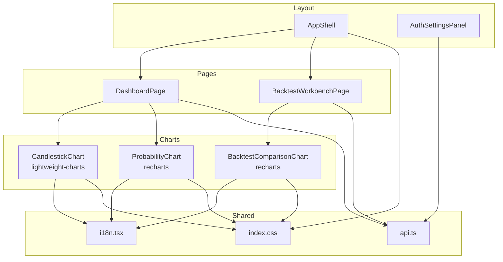
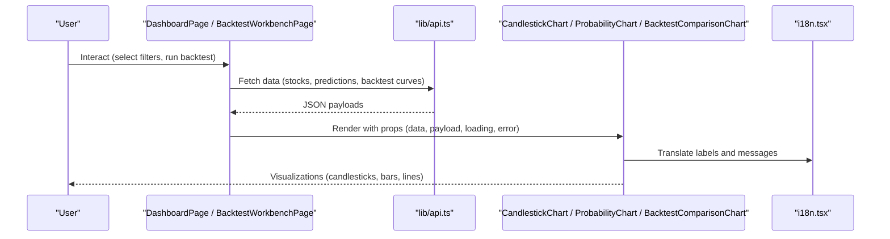
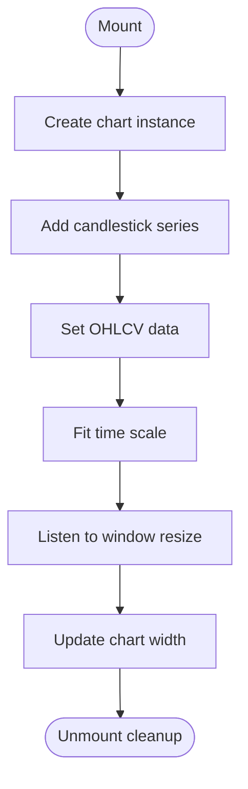
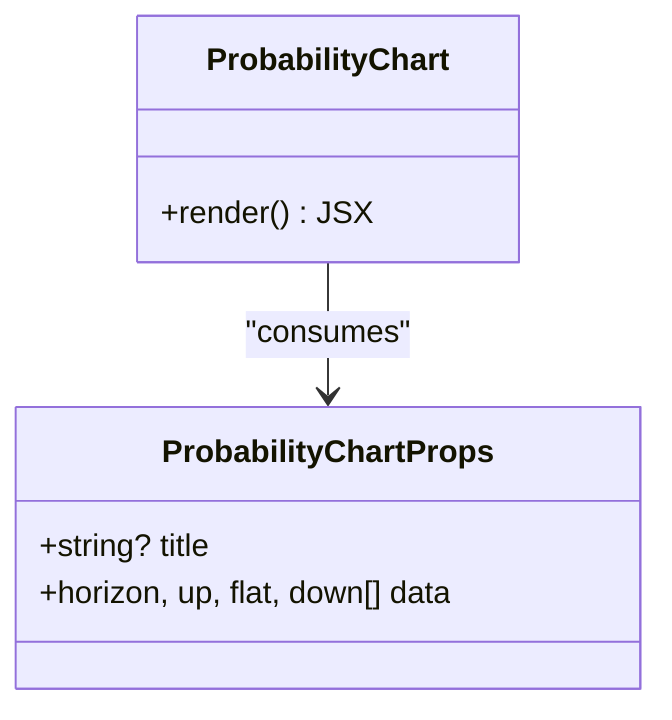
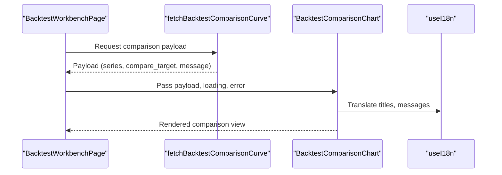
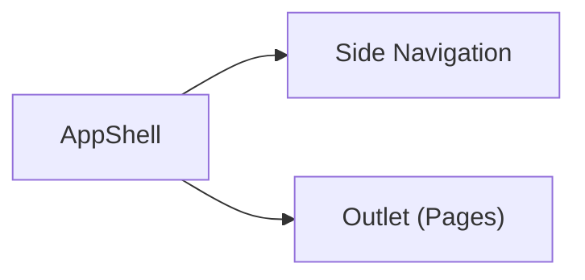
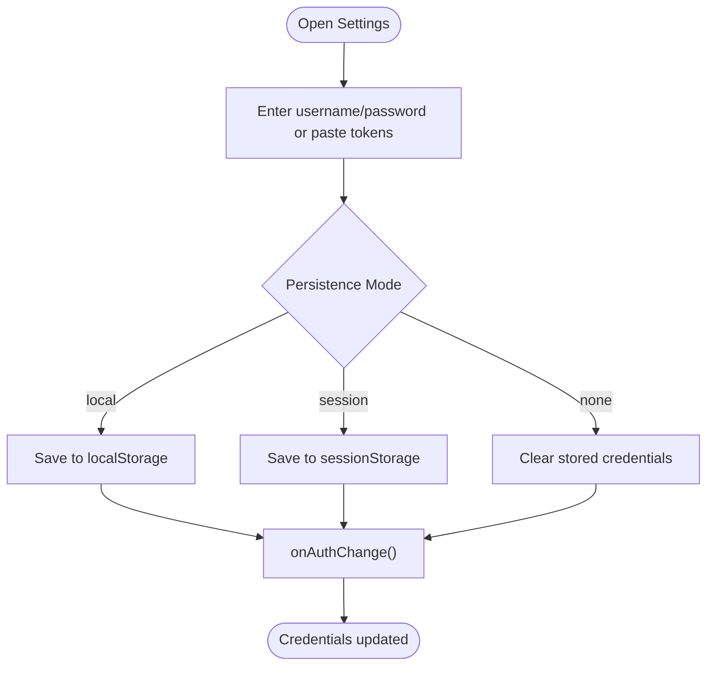
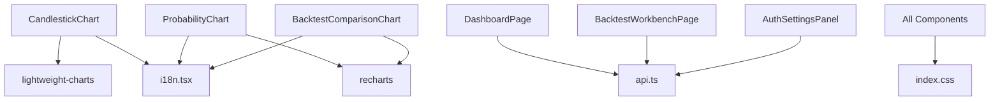

# UI Components & Charts

<cite>
**Referenced Files in This Document**
- [CandlestickChart.tsx](file://frontend/src/components/charts/CandlestickChart.tsx)
- [ProbabilityChart.tsx](file://frontend/src/components/charts/ProbabilityChart.tsx)
- [BacktestComparisonChart.tsx](file://frontend/src/components/charts/BacktestComparisonChart.tsx)
- [AppShell.tsx](file://frontend/src/components/layout/AppShell.tsx)
- [AuthSettingsPanel.tsx](file://frontend/src/components/layout/AuthSettingsPanel.tsx)
- [api.ts](file://frontend/src/lib/api.ts)
- [i18n.tsx](file://frontend/src/i18n.tsx)
- [index.css](file://frontend/src/index.css)
- [package.json](file://frontend/package.json)
- [DashboardPage.tsx](file://frontend/src/pages/DashboardPage.tsx)
- [BacktestWorkbenchPage.tsx](file://frontend/src/pages/BacktestWorkbenchPage.tsx)
</cite>

## Table of Contents
1. [Introduction](#introduction)
2. [Project Structure](#project-structure)
3. [Core Components](#core-components)
4. [Architecture Overview](#architecture-overview)
5. [Detailed Component Analysis](#detailed-component-analysis)
6. [Dependency Analysis](#dependency-analysis)
7. [Performance Considerations](#performance-considerations)
8. [Troubleshooting Guide](#troubleshooting-guide)
9. [Conclusion](#conclusion)
10. [Appendices](#appendices)

## Introduction
This document explains the reusable UI components and charting libraries used across the FinanceAnalysis dashboard. It focuses on:
- Charting components: CandlestickChart for OHLCV visualization, ProbabilityChart for prediction confidence display, BacktestComparisonChart for strategy performance comparison.
- Layout components: AppShell for application structure and AuthSettingsPanel for authentication configuration.
- Integration with lightweight-charts and recharts, including custom configurations and performance techniques for large datasets.
- Styling approach, responsiveness patterns, accessibility considerations, component composition examples, prop drilling alternatives, and state sharing patterns between components.

## Project Structure
The frontend is a React + TypeScript application built with Vite. It uses two charting libraries intentionally:
- lightweight-charts for financial time series (candlesticks).
- recharts for other charts (probability bars, backtest comparison lines).

**Diagram sources**
- [AppShell.tsx:15-41](file://frontend/src/components/layout/AppShell.tsx#L15-L41)
- [CandlestickChart.tsx:17-69](file://frontend/src/components/charts/CandlestickChart.tsx#L17-L69)
- [ProbabilityChart.tsx:9-29](file://frontend/src/components/charts/ProbabilityChart.tsx#L9-L29)
- [BacktestComparisonChart.tsx:89-178](file://frontend/src/components/charts/BacktestComparisonChart.tsx#L89-L178)
- [DashboardPage.tsx:93-526](file://frontend/src/pages/DashboardPage.tsx#L93-L526)
- [BacktestWorkbenchPage.tsx:237-800](file://frontend/src/pages/BacktestWorkbenchPage.tsx#L237-L800)
- [i18n.tsx:610-636](file://frontend/src/i18n.tsx#L610-L636)
- [api.ts:403-506](file://frontend/src/lib/api.ts#L403-L506)
- [index.css:21-503](file://frontend/src/index.css#L21-L503)

**Section sources**
- [package.json:13-19](file://frontend/package.json#L13-L19)
- [index.css:21-503](file://frontend/src/index.css#L21-L503)

## Core Components
- CandlestickChart: Renders OHLCV data using lightweight-charts with dark theme, responsive width, and lifecycle cleanup.
- ProbabilityChart: Renders stacked bar chart of multi-horizon probabilities using recharts with responsive container.
- BacktestComparisonChart: Renders equity curve and drawdown line charts comparing multiple series, with summary cards and formatting helpers.
- AppShell: Provides side navigation and content area via react-router-dom Outlet.
- AuthSettingsPanel: Manages JWT/API key acquisition, persistence mode selection, and credential storage.

Key props interfaces:
- CandlestickChartProps: data array of OHLC points.
- ProbabilityChartProps: optional title and probability data per horizon.
- BacktestComparisonChartProps: payload, loading, error, and optional unavailable message.
- AppShell: no props; renders navigation and outlet.
- AuthSettingsPanelProps: optional callback to notify auth changes.

Styling approach:
- Global CSS variables and utility classes define layout, cards, tables, and chart containers.
- Responsive behavior via CSS media queries and recharts ResponsiveContainer.
- Accessibility: semantic headings, labels, aria-hidden for decorative swatches, keyboard focus styles.

Responsiveness patterns:
- Chart containers adapt to parent width; candlestick chart resizes on window resize.
- Grid-based layouts collapse to single column on small screens.

Accessibility considerations:
- i18n keys provide accessible text for all user-facing strings.
- Inputs have associated labels and IDs.
- Decorative elements use aria-hidden where appropriate.

**Section sources**
- [CandlestickChart.tsx:5-15](file://frontend/src/components/charts/CandlestickChart.tsx#L5-L15)
- [ProbabilityChart.tsx:4-7](file://frontend/src/components/charts/ProbabilityChart.tsx#L4-L7)
- [BacktestComparisonChart.tsx:15-20](file://frontend/src/components/charts/BacktestComparisonChart.tsx#L15-L20)
- [AppShell.tsx:15-41](file://frontend/src/components/layout/AppShell.tsx#L15-L41)
- [AuthSettingsPanel.tsx:16-18](file://frontend/src/components/layout/AuthSettingsPanel.tsx#L16-L18)
- [index.css:204-248](file://frontend/src/index.css#L204-L248)
- [index.css:474-503](file://frontend/src/index.css#L474-L503)

## Architecture Overview
The dashboard composes pages that consume shared layout and chart components. Data flows from API endpoints through lib/api.ts into page state, which then passes props to chart components. Authentication credentials are managed centrally and injected into requests.

**Diagram sources**
- [DashboardPage.tsx:121-188](file://frontend/src/pages/DashboardPage.tsx#L121-L188)
- [BacktestWorkbenchPage.tsx:590-620](file://frontend/src/pages/BacktestWorkbenchPage.tsx#L590-L620)
- [api.ts:653-678](file://frontend/src/lib/api.ts#L653-L678)
- [i18n.tsx:618-636](file://frontend/src/i18n.tsx#L618-L636)

## Detailed Component Analysis

### CandlestickChart
- Purpose: Display OHLCV candlesticks with a dark theme and responsive width.
- Props: data array of { time, open, high, low, close }.
- Behavior:
  - Creates lightweight-charts instance inside a div ref.
  - Adds candlestick series with up/down colors and grid styling.
  - Sets data and fits time scale to content.
  - Listens to window resize to update chart width.
  - Cleans up chart instance on unmount.
- Styling: Uses card and chart-card classes for consistent layout.
- Accessibility: Title via i18n; empty state message when no data.

**Diagram sources**
- [CandlestickChart.tsx:22-60](file://frontend/src/components/charts/CandlestickChart.tsx#L22-L60)

**Section sources**
- [CandlestickChart.tsx:17-69](file://frontend/src/components/charts/CandlestickChart.tsx#L17-L69)

### ProbabilityChart
- Purpose: Show multi-horizon probabilities as stacked bars (up, flat, down).
- Props: optional title; data array of { horizon, up, flat, down }.
- Behavior:
  - Wraps recharts BarChart in ResponsiveContainer for fluid sizing.
  - Configures axes, grid, tooltip, and stacked bars with distinct colors.
  - Displays empty state message when no data.
- Styling: Card wrapper and chart-card class ensure consistent appearance.
- Accessibility: Axes and tooltips provide context; titles via i18n.

**Diagram sources**
- [ProbabilityChart.tsx:4-7](file://frontend/src/components/charts/ProbabilityChart.tsx#L4-L7)
- [ProbabilityChart.tsx:9-29](file://frontend/src/components/charts/ProbabilityChart.tsx#L9-L29)

**Section sources**
- [ProbabilityChart.tsx:9-29](file://frontend/src/components/charts/ProbabilityChart.tsx#L9-L29)

### BacktestComparisonChart
- Purpose: Compare equity curves and drawdowns across multiple series (backtests, benchmarks, targets).
- Props: payload (series, compare target), loading, error, optional unavailableMessage.
- Behavior:
  - Filters visible series with non-empty points.
  - Builds rows by date for value and drawdown metrics.
  - Computes deterministic line colors per series key.
  - Renders summary cards with total return and max drawdown.
  - Renders two LineCharts (equity and drawdown) with legends and formatted tooltips.
  - Handles loading, error, and unavailable states with localized messages.
- Styling: Comparison header, series grid, and chart blocks styled via index.css.
- Accessibility: Legend provides series identification; tooltips format values; headers and subtitles via i18n.

**Diagram sources**
- [BacktestWorkbenchPage.tsx:590-620](file://frontend/src/pages/BacktestWorkbenchPage.tsx#L590-L620)
- [BacktestComparisonChart.tsx:89-178](file://frontend/src/components/charts/BacktestComparisonChart.tsx#L89-L178)
- [i18n.tsx:618-636](file://frontend/src/i18n.tsx#L618-L636)

**Section sources**
- [BacktestComparisonChart.tsx:15-178](file://frontend/src/components/charts/BacktestComparisonChart.tsx#L15-L178)

### AppShell
- Purpose: Provide application chrome with side navigation and main content area.
- Behavior:
  - Defines nav items mapped to routes.
  - Uses NavLink for active state styling.
  - Renders Outlet for nested routes.
- Styling: Side nav and content area styled via index.css grid layout.
- Accessibility: Semantic aside/nav/main; links include translated labels.

**Diagram sources**
- [AppShell.tsx:15-41](file://frontend/src/components/layout/AppShell.tsx#L15-L41)

**Section sources**
- [AppShell.tsx:15-41](file://frontend/src/components/layout/AppShell.tsx#L15-L41)

### AuthSettingsPanel
- Purpose: Manage authentication credentials (JWT, API Key) and persistence mode.
- Behavior:
  - Reads/writes tokens and keys from localStorage/sessionStorage based on mode.
  - Obtains JWT token pair via API and optionally creates developer API key.
  - Provides copy-to-clipboard and masked secret display.
  - Notifies parent via onAuthChange callback after updates.
- Styling: Credential rows, actions, and help text styled via index.css.
- Accessibility: Labels bound to inputs; buttons have clear actions; toast notifications for feedback.

**Diagram sources**
- [AuthSettingsPanel.tsx:87-106](file://frontend/src/components/layout/AuthSettingsPanel.tsx#L87-L106)
- [api.ts:487-506](file://frontend/src/lib/api.ts#L487-L506)

**Section sources**
- [AuthSettingsPanel.tsx:20-259](file://frontend/src/components/layout/AuthSettingsPanel.tsx#L20-L259)
- [api.ts:454-506](file://frontend/src/lib/api.ts#L454-L506)

## Dependency Analysis
- Chart libraries:
  - lightweight-charts: Used exclusively in CandlestickChart for financial time series rendering.
  - recharts: Used in ProbabilityChart and BacktestComparisonChart for general-purpose charts.
- Shared services:
  - i18n.tsx: Centralized translation provider consumed by all components.
  - api.ts: HTTP client, auth storage, and endpoint functions consumed by pages and settings panel.
- Styling:
  - index.css: Global styles, layout grids, card components, and responsive breakpoints.

**Diagram sources**
- [package.json:13-19](file://frontend/package.json#L13-L19)
- [CandlestickChart.tsx:1-3](file://frontend/src/components/charts/CandlestickChart.tsx#L1-L3)
- [ProbabilityChart.tsx:1-2](file://frontend/src/components/charts/ProbabilityChart.tsx#L1-L2)
- [BacktestComparisonChart.tsx:1-13](file://frontend/src/components/charts/BacktestComparisonChart.tsx#L1-L13)
- [i18n.tsx:610-636](file://frontend/src/i18n.tsx#L610-L636)
- [api.ts:403-506](file://frontend/src/lib/api.ts#L403-L506)
- [index.css:21-503](file://frontend/src/index.css#L21-L503)

**Section sources**
- [package.json:13-19](file://frontend/package.json#L13-L19)
- [index.css:21-503](file://frontend/src/index.css#L21-L503)

## Performance Considerations
- Lightweight-charts optimization:
  - CandlestickChart sets fixed height and dynamic width; consider virtualization or downsampling if dataset grows very large.
  - Use fitContent to auto-scale time axis; avoid frequent setData calls by batching updates.
- Recharts optimization:
  - ProbabilityChart and BacktestComparisonChart use ResponsiveContainer; ensure data arrays are pre-aggregated to reduce DOM nodes.
  - For large series in BacktestComparisonChart, consider memoizing computed rows and limiting visible points via sampling.
- State sharing and prop drilling alternatives:
  - Prefer lifting state to page level (DashboardPage, BacktestWorkbenchPage) and passing minimal props to charts.
  - Use URL search params for filter state (as seen in DashboardPage) to share configuration without deep prop drilling.
- Memory management:
  - CandlestickChart removes chart instance on unmount; ensure similar cleanup for any external resources.
  - Avoid storing large datasets in component state; keep them in module-level caches or IndexedDB if needed.

[No sources needed since this section provides general guidance]

## Troubleshooting Guide
- Authentication issues:
  - Ensure JWT and/or API Key are configured in AuthSettingsPanel; errors will surface via localized messages.
  - Check persistence mode; local vs session storage affects availability across tabs/restarts.
- Chart rendering problems:
  - Empty states: CandlestickChart and ProbabilityChart show localized messages when data is missing.
  - BacktestComparisonChart displays loading, error, and unavailable messages based on payload state.
- Network errors:
  - api.ts wraps responses in ApiRequestError with status and detail; pages handle these to show user-friendly messages.
- Responsiveness:
  - If charts do not resize correctly, verify container dimensions and window resize listeners.

**Section sources**
- [AuthSettingsPanel.tsx:77-85](file://frontend/src/components/layout/AuthSettingsPanel.tsx#L77-L85)
- [api.ts:421-452](file://frontend/src/lib/api.ts#L421-L452)
- [CandlestickChart.tsx:62-69](file://frontend/src/components/charts/CandlestickChart.tsx#L62-L69)
- [ProbabilityChart.tsx:12-29](file://frontend/src/components/charts/ProbabilityChart.tsx#L12-L29)
- [BacktestComparisonChart.tsx:100-116](file://frontend/src/components/charts/BacktestComparisonChart.tsx#L100-L116)

## Conclusion
The FinanceAnalysis dashboard’s UI layer combines robust charting libraries with a clean component architecture. CandlestickChart leverages lightweight-charts for financial visualizations, while ProbabilityChart and BacktestComparisonChart use recharts for flexible charting needs. AppShell provides consistent navigation and layout, and AuthSettingsPanel centralizes authentication management. The system emphasizes internationalization, responsive design, and accessibility, with careful attention to performance and memory management for large datasets.

[No sources needed since this section summarizes without analyzing specific files]

## Appendices

### Component Composition Examples
- DashboardPage composes metric cards, filters, and table views; it can integrate ProbabilityChart to visualize top candidate probabilities.
- BacktestWorkbenchPage integrates BacktestComparisonChart to render equity and drawdown comparisons for selected runs.

**Section sources**
- [DashboardPage.tsx:295-526](file://frontend/src/pages/DashboardPage.tsx#L295-L526)
- [BacktestWorkbenchPage.tsx:706-800](file://frontend/src/pages/BacktestWorkbenchPage.tsx#L706-L800)

### Prop Drilling Alternatives and State Sharing Patterns
- URL-based state: DashboardPage encodes filter bundles into search params, enabling shareable URLs and avoiding deep prop drilling.
- Context usage: i18n context provides locale and translation function globally without prop drilling.
- Callbacks: AuthSettingsPanel notifies parents via onAuthChange to propagate auth state changes efficiently.

**Section sources**
- [DashboardPage.tsx:279-293](file://frontend/src/pages/DashboardPage.tsx#L279-L293)
- [i18n.tsx:610-636](file://frontend/src/i18n.tsx#L610-L636)
- [AuthSettingsPanel.tsx:87-96](file://frontend/src/components/layout/AuthSettingsPanel.tsx#L87-L96)