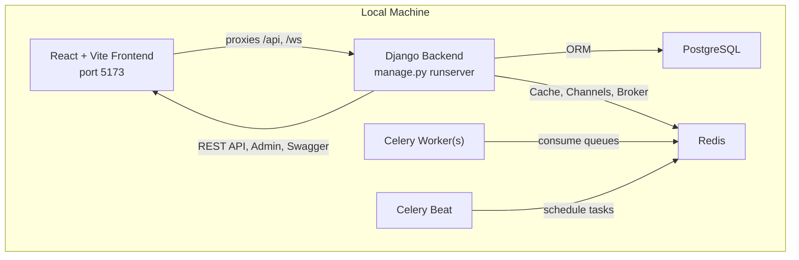
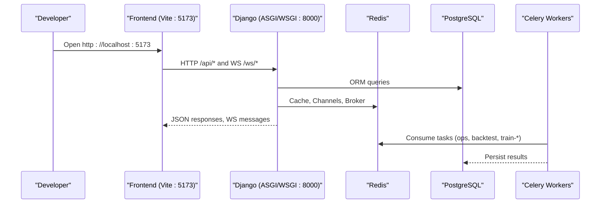
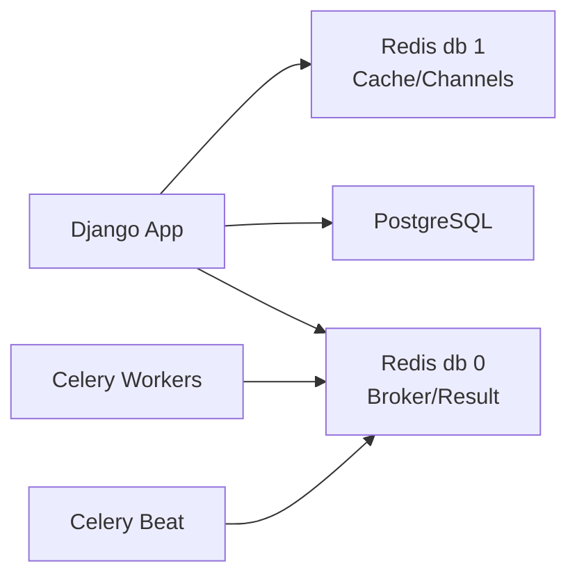

# Getting Started

<cite>
**Referenced Files in This Document**
- [README.md](file://README.md)
- [local-setup.md](file://docs/how-to/local-setup.md)
- [backfill.md](file://docs/how-to/backfill.md)
- [base.txt](file://requirements/base.txt)
- [docker-compose.yml](file://docker-compose.yml)
- [verify_local_stack.sh](file://scripts/verify_local_stack.sh)
- [verify_local_stack.ps1](file://scripts/verify_local_stack.ps1)
- [run_backend.sh](file://scripts/run_backend.sh)
- [run_frontend.sh](file://scripts/run_frontend.sh)
- [package.json](file://frontend/package.json)
- [base.py](file://config/settings/base.py)
</cite>

## Table of Contents
1. Introduction
2. Project Structure
3. Core Components
4. Architecture Overview
5. Detailed Component Analysis
6. Dependency Analysis
7. Performance Considerations
8. Troubleshooting Guide
9. Conclusion
10. Appendices

## Introduction
This guide helps you set up FinanceAnalysis locally, start the four runtime components (PostgreSQL, Redis, Django backend, React frontend), verify connectivity, and run your first checks. It also explains how to populate data after setup and provides troubleshooting tips for common issues such as TA-Lib installation, database connectivity, and port conflicts.

FinanceAnalysis is a Django-based platform that ingests market, fundamental, macro, and news data; derives technical and factor features; runs prediction models; and backtests strategies against point-in-time benchmarks. The local stack uses PostgreSQL for persistence, Redis for caching/broker/Channels, Django + DRF for the REST API and admin, Celery workers for background tasks, and a React + Vite dashboard on port 5173.

## Project Structure
At a high level:
- Python/Django backend lives under apps/ with configuration in config/.
- Frontend lives under frontend/ using Vite and React.
- Scripts under scripts/ launch and verify each component.
- Requirements are declared under requirements/.
- Docker Compose exists but does not start PostgreSQL or Redis locally; those must be provisioned externally.

**Diagram sources**
- [base.py:122-200](file://config/settings/base.py#L122-L200)
- [docker-compose.yml:1-39](file://docker-compose.yml#L1-L39)

**Section sources**
- [README.md:48-114](file://README.md#L48-L114)
- [local-setup.md:10-23](file://docs/how-to/local-setup.md#L10-L23)

## Core Components
- PostgreSQL: Primary relational store for all domain data. Must be reachable from your machine and configured with a role/database matching DATABASE_URL.
- Redis: Used for three logical purposes: Celery broker/result backend (db 0), Django cache/Channels layer (db 1). Requires authentication per your deployment.
- Django backend: Serves REST API, admin, OpenAPI schema, and ASGI WebSocket endpoint via Channels.
- Celery worker(s): Consume background tasks across four queues (ops, backtest, train-lightgbm, train-lstm).
- Celery Beat: Schedules periodic tasks.
- React frontend: Vite dev server on port 5173 proxies API and WebSocket requests to the backend.

**Section sources**
- [README.md:107-114](file://README.md#L107-L114)
- [base.py:174-200](file://config/settings/base.py#L174-L200)
- [local-setup.md:297-331](file://docs/how-to/local-setup.md#L297-L331)

## Architecture Overview
The local development architecture consists of four services plus background workers:
- PostgreSQL and Redis are external services you provision before starting the app.
- Django runs the web server and ASGI application.
- Celery workers process queued jobs.
- Frontend serves the UI and proxies API/WebSocket calls to the backend.

**Diagram sources**
- [base.py:122-200](file://config/settings/base.py#L122-L200)
- [local-setup.md:297-331](file://docs/how-to/local-setup.md#L297-L331)

## Detailed Component Analysis

### Local Development Setup
Follow these steps to get a working local environment:

1. Provision external services
   - PostgreSQL: Create a role and database accessible from your host. Ensure network access and authentication settings allow connections.
   - Redis: Configure authentication and memory policy. Use db 0 for Celery broker/result backend and db 1 for Django cache/Channels.

2. Create Python virtual environment and install dependencies
   - Create a venv with Python 3.14.
   - Install requirements from requirements/local.txt (which includes base.txt).
   - TA-Lib requires the underlying C library; see the next section for installation guidance.

3. Configure environment variables
   - Copy .env.example to .env and edit at minimum:
     - DJANGO_SECRET_KEY
     - DATABASE_URL
     - REDIS_URL
     - CELERY_BROKER_URL
     - TUSHARE_TOKEN
     - FRONTEND_URL (must match Vite dev server port 5173)

4. Verify services and Python environment
   - Run the verification script for your OS:
     - Windows: scripts/verify_local_stack.ps1
     - Unix: scripts/verify_local_stack.sh
   - These scripts probe PostgreSQL and both Redis databases through Python drivers, import required packages, and run Django’s check command.

5. Initialize the database
   - Run migrations and create a superuser.

6. Start the four components
   - Backend: scripts/run_backend.sh or scripts/run_backend.ps1
   - Celery worker(s): one per queue if needed
   - Celery Beat: scheduled tasks
   - Frontend: scripts/run_frontend.sh or scripts/run_frontend.ps1

7. First-run smoke checks
   - Django check, migration status, and a simple API call to confirm routing and pagination.

**Section sources**
- [local-setup.md:27-278](file://docs/how-to/local-setup.md#L27-L278)
- [local-setup.md:297-331](file://docs/how-to/local-setup.md#L297-L331)
- [local-setup.md:455-465](file://docs/how-to/local-setup.md#L455-L465)
- [verify_local_stack.sh:1-72](file://scripts/verify_local_stack.sh#L1-L72)
- [verify_local_stack.ps1:1-100](file://scripts/verify_local_stack.ps1#L1-L100)
- [run_backend.sh:1-9](file://scripts/run_backend.sh#L1-L9)
- [run_frontend.sh:1-26](file://scripts/run_frontend.sh#L1-L26)

### TA-Lib Installation
TA-Lib is declared in requirements/base.txt and requires the underlying C library at build/import time.

- Windows: Try installing the wheel directly; if compilation fails, install a prebuilt binary wheel matching your Python version and architecture, then reinstall TA-Lib.
- Linux/WSL2: Build the C library from source, then install TA-Lib. Confirm import works from the same shell used by launcher scripts.

If importing talib fails, recreate the virtual environment after installing the C library so the interpreter can find it.

**Section sources**
- [base.txt:1-23](file://requirements/base.txt#L1-L23)
- [local-setup.md:135-187](file://docs/how-to/local-setup.md#L135-L187)

### Database Initialization and Migrations
After provisioning PostgreSQL and configuring DATABASE_URL:
- Run Django migrations to create tables.
- Create a superuser for the admin interface.
- The database starts empty; data population is a separate workflow described later.

**Section sources**
- [local-setup.md:270-278](file://docs/how-to/local-setup.md#L270-L278)

### Frontend Setup with npm
- Navigate to frontend and install dependencies with npm.
- Start the development server; it listens on port 5173 and proxies API and WebSocket requests to the backend.
- Use npm run dev rather than npx vite to avoid path-resolution issues on Windows.

**Section sources**
- [local-setup.md:411-425](file://docs/how-to/local-setup.md#L411-L425)
- [package.json:1-40](file://frontend/package.json#L1-L40)

### Four-Component Startup Process
Start these four components in separate terminals or via VS Code tasks:

- PostgreSQL: External service; ensure it is running and reachable.
- Redis: External service; ensure authentication and correct DB numbers.
- Django backend: scripts/run_backend.sh or scripts/run_backend.ps1 binds to 0.0.0.0:8000 by default.
- Celery workers: One per queue if you need backtests or model training; otherwise start the default ops worker.
- Celery Beat: Scheduled tasks driver.
- Frontend: scripts/run_frontend.sh or scripts/run_frontend.ps1.

Access points:
- Frontend: http://localhost:5173/
- API root: http://localhost:8000/api/v1/
- Admin: http://localhost:8000/admin/
- Swagger: http://localhost:8000/api/v1/schema/swagger-ui/

**Section sources**
- [local-setup.md:297-331](file://docs/how-to/local-setup.md#L297-L331)
- [README.md:146-151](file://README.md#L146-L151)

### Data Population Workflow (Backfill)
After migrations, populate data in stages:

- Stage 1: Universe and market foundation (index constituents, OHLCV history, asset list dates, suspensions, trading calendar, benchmark index history, PIT benchmark).
- Stage 2: Raw factor, macro, and news sources (fundamentals, capital flow, macro snapshots, news pipeline).
- Stage 3: Derived analytics and model inputs (market context, signal events, technical indicators, model data).

Use checkpointing for long-running commands and follow the documented ordering to avoid failures due to missing reference data.

**Section sources**
- [backfill.md:44-171](file://docs/how-to/backfill.md#L44-L171)
- [backfill.md:174-197](file://docs/how-to/backfill.md#L174-L197)

## Dependency Analysis
Key runtime dependencies and their roles:
- PostgreSQL: Relational storage accessed via Django ORM.
- Redis: Celery broker/result backend (db 0), Django cache/Channels (db 1).
- Python packages: Django, DRF, Channels, channels-redis, psycopg2-binary, redis, celery, TA-Lib, lightgbm, torch, scikit-learn, mlflow, drf-spectacular.

**Diagram sources**
- [base.py:122-200](file://config/settings/base.py#L122-L200)
- [base.txt:1-23](file://requirements/base.txt#L1-L23)

**Section sources**
- [base.py:122-200](file://config/settings/base.py#L122-L200)
- [base.txt:1-23](file://requirements/base.txt#L1-L23)

## Performance Considerations
- Use WSL2 for heavy workloads like backtests and model training to benefit from native Linux performance and Celery prefork workers.
- On Windows, Celery defaults to solo pool with concurrency 1; run multiple workers instead of increasing concurrency to avoid oversubscription.
- Set thread-limiting environment variables (OMP_NUM_THREADS, MKL_NUM_THREADS, OPENBLAS_NUM_THREADS, NUMEXPR_NUM_THREADS) when running CPU-bound tasks on Windows.
- Ensure Redis memory policy is noeviction to prevent silent task loss or cache resets.

[No sources needed since this section provides general guidance]

## Troubleshooting Guide

Common issues and resolutions:

- TA-Lib import failure
  - Cause: Missing C library or incompatible wheel.
  - Fix: Install the C library (Windows prebuilt wheel or Linux source build), then reinstall TA-Lib and verify import from the same shell used by launcher scripts. If necessary, recreate the virtual environment after installing the C library.

- PostgreSQL connection errors
  - Cause: Wrong credentials, host/port, or network restrictions.
  - Fix: Ensure DATABASE_URL matches the running instance, the role has login and CREATE privileges, and pg_hba.conf permits your client network.

- Redis authentication or URL shape errors
  - Cause: Incorrect username/password form or wrong database number.
  - Fix: Use the correct URL form for your Redis configuration (ACL user vs requirepass), ensure db 0 for broker and db 1 for cache/Channels, and percent-encode special characters in passwords.

- Port conflicts
  - Frontend: Default port 5173; change if occupied.
  - Backend: Default bind 0.0.0.0:8000; override with DJANGO_BIND if needed.

- Verification script returns success but services fail later
  - Cause: Misleading checks or missing CLI tools.
  - Fix: Use the provided verify_local_stack scripts which probe via Python drivers and redact credentials in output.

- Celery tasks not executing
  - Cause: Workers not consuming the right queues.
  - Fix: Start workers with appropriate CELERY_WORKER_QUEUES for backtest and training queues.

**Section sources**
- [local-setup.md:43-131](file://docs/how-to/local-setup.md#L43-L131)
- [local-setup.md:135-187](file://docs/how-to/local-setup.md#L135-L187)
- [local-setup.md:249-267](file://docs/how-to/local-setup.md#L249-L267)
- [local-setup.md:334-407](file://docs/how-to/local-setup.md#L334-L407)
- [verify_local_stack.sh:1-72](file://scripts/verify_local_stack.sh#L1-L72)
- [verify_local_stack.ps1:1-100](file://scripts/verify_local_stack.ps1#L1-L100)

## Conclusion
You now have the steps to set up PostgreSQL, Redis, Django, Celery, and the React frontend; verify connectivity; initialize the database; and begin populating data. Use the verification scripts early and often, follow the staged backfill workflow for data, and consult the troubleshooting section for common pitfalls.

[No sources needed since this section summarizes without analyzing specific files]

## Appendices

### Quick Commands Reference
- Create venv and install dependencies:
  - Python venv creation and pip install from requirements/local.txt
- Configure .env:
  - Copy .env.example and edit required variables
- Verify local stack:
  - Windows: scripts/verify_local_stack.ps1
  - Unix: scripts/verify_local_stack.sh
- Migrate and create superuser:
  - Django migrate and createsuperuser
- Start components:
  - Backend: scripts/run_backend.sh or scripts/run_backend.ps1
  - Celery worker(s): per queue
  - Celery Beat: scheduler
  - Frontend: scripts/run_frontend.sh or scripts/run_frontend.ps1
- Smoke checks:
  - Django check, showmigrations, and a sample API call

**Section sources**
- [local-setup.md:190-278](file://docs/how-to/local-setup.md#L190-L278)
- [local-setup.md:297-331](file://docs/how-to/local-setup.md#L297-L331)
- [local-setup.md:455-465](file://docs/how-to/local-setup.md#L455-L465)