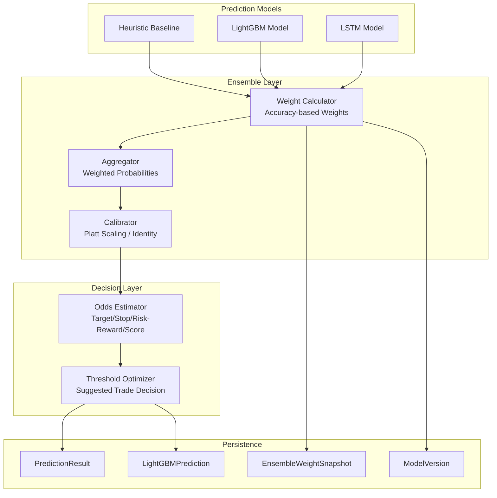
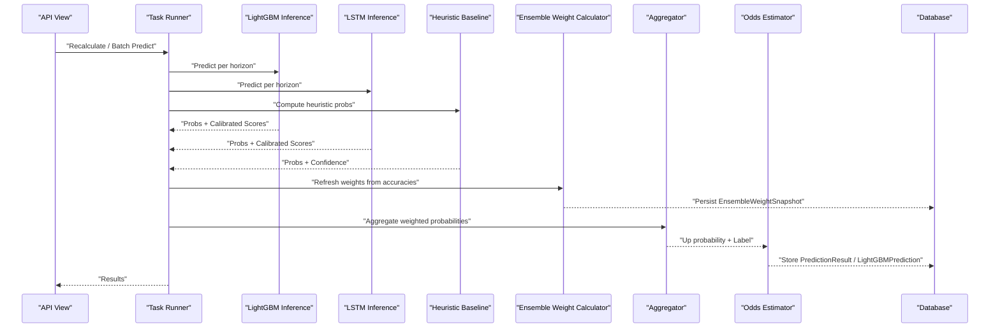
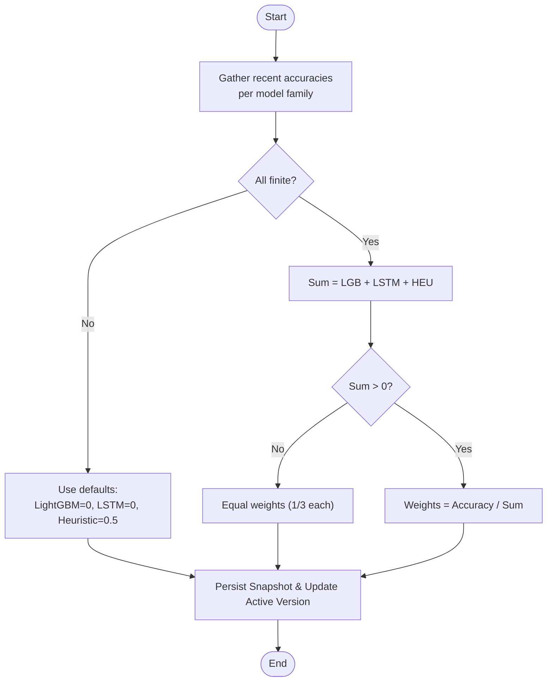
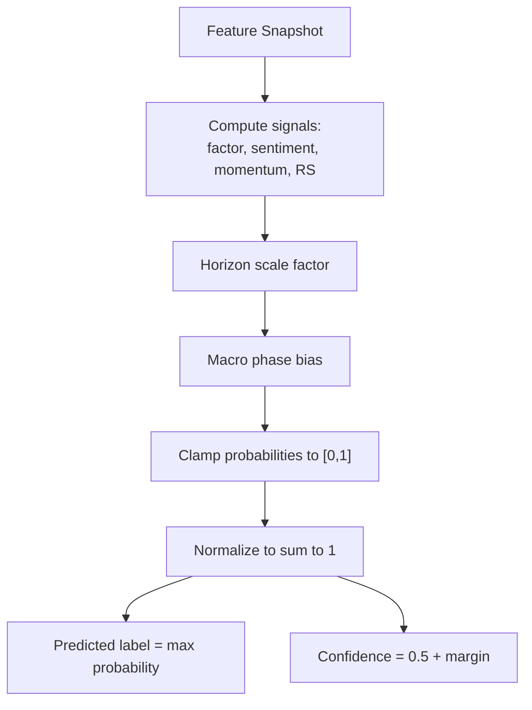
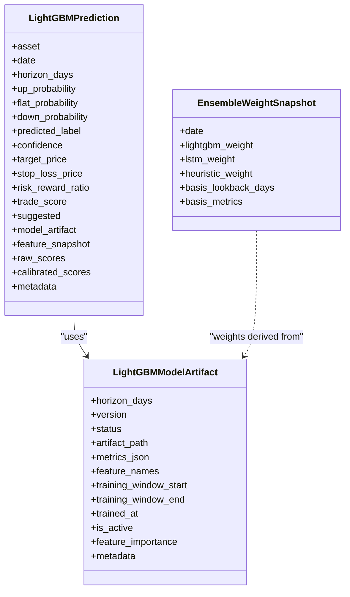
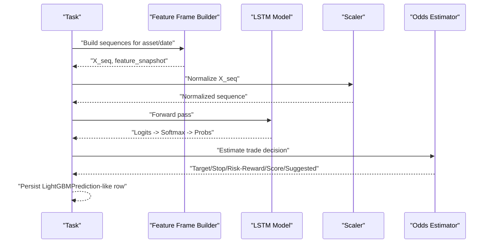
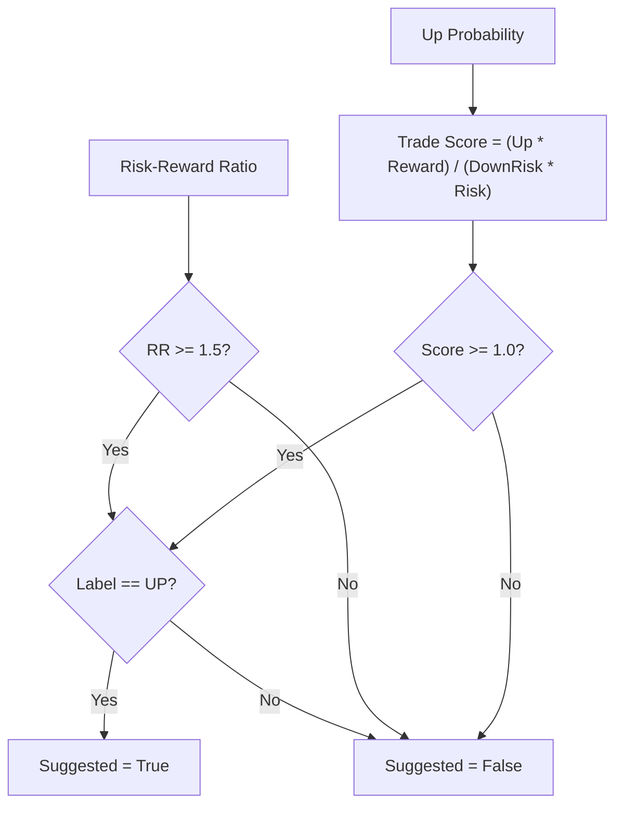
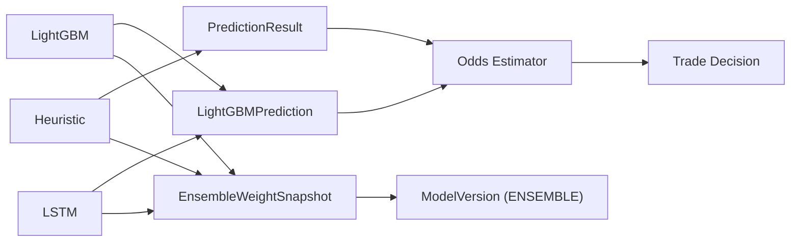

# Ensemble Systems

<cite>
**Referenced Files in This Document**
- [models.py](file://apps/prediction/models.py)
- [models_lightgbm.py](file://apps/prediction/models_lightgbm.py)
- [tasks.py](file://apps/prediction/tasks.py)
- [tasks_lightgbm.py](file://apps/prediction/tasks_lightgbm.py)
- [tasks_lstm.py](file://apps/prediction/tasks_lstm.py)
- [odds.py](file://apps/prediction/odds.py)
- [views.py](file://apps/prediction/views.py)
- [views_lightgbm.py](file://apps/prediction/views_lightgbm.py)
</cite>

## Table of Contents
1. [Introduction](#introduction)
2. [Project Structure](#project-structure)
3. [Core Components](#core-components)
4. [Architecture Overview](#architecture-overview)
5. [Detailed Component Analysis](#detailed-component-analysis)
6. [Dependency Analysis](#dependency-analysis)
7. [Performance Considerations](#performance-considerations)
8. [Troubleshooting Guide](#troubleshooting-guide)
9. [Conclusion](#conclusion)
10. [Appendices](#appendices)

## Introduction
This document explains the ensemble weighting system that combines predictions from three model families: heuristic, LightGBM, and LSTM. It covers how weights are computed from model accuracy metrics, how ensemble predictions are aggregated, how probabilities are calibrated, how decision thresholds are optimized for trade suggestions, and how ensemble weight snapshots and historical tracking support monitoring and troubleshooting. It also details odds estimation and how trade decisions are generated from ensemble outputs.

## Project Structure
The ensemble system spans several modules under apps/prediction:
- Data models define prediction results, model versions, and ensemble weight snapshots.
- Tasks implement training, inference, and ensemble weight refresh logic for LightGBM and LSTM, plus a heuristic baseline.
- Odds utilities compute target prices, stop losses, risk-reward ratios, and trade scores used to derive suggested trades.
- Views expose APIs to trigger training, recalculation, and retrieval of predictions and ensemble weight history.

**Diagram sources**
- [tasks_lightgbm.py:631-729](file://apps/prediction/tasks_lightgbm.py#L631-L729)
- [tasks.py:82-127](file://apps/prediction/tasks.py#L82-L127)
- [tasks_lstm.py:371-441](file://apps/prediction/tasks_lstm.py#L371-L441)
- [odds.py:60-158](file://apps/prediction/odds.py#L60-L158)
- [models.py:43-97](file://apps/prediction/models.py#L43-L97)
- [models_lightgbm.py:97-110](file://apps/prediction/models_lightgbm.py#L97-L110)

**Section sources**
- [models.py:7-31](file://apps/prediction/models.py#L7-L31)
- [models_lightgbm.py:7-38](file://apps/prediction/models_lightgbm.py#L7-L38)
- [tasks.py:149-243](file://apps/prediction/tasks.py#L149-L243)
- [tasks_lightgbm.py:1849-2098](file://apps/prediction/tasks_lightgbm.py#L1849-L2098)
- [tasks_lstm.py:592-800](file://apps/prediction/tasks_lstm.py#L592-L800)
- [odds.py:60-158](file://apps/prediction/odds.py#L60-L158)
- [views.py:27-162](file://apps/prediction/views.py#L27-L162)
- [views_lightgbm.py:124-282](file://apps/prediction/views_lightgbm.py#L124-L282)

## Core Components
- Heuristic baseline: Computes up/flat/down probabilities from factor, sentiment, momentum, and relative strength signals, adjusted by macro phase and horizon scaling. Confidence is derived from probability margins.
- LightGBM pipeline: Trains multi-class classifiers per horizon with feature engineering, optional pruning based on feature importance snapshots, calibration via Platt scaling or identity fallback, and stores artifacts and metrics.
- LSTM pipeline: Builds sequences from features, trains an LSTM classifier per horizon, saves model artifacts and scaler parameters, and produces calibrated softmax probabilities.
- Ensemble weight calculator: Aggregates recent accuracies across models to compute normalized weights; persists daily snapshots and updates active ensemble version metadata.
- Odds estimator: Derives target price, stop loss, risk-reward ratio, and trade score using technical indicators and policy constraints; determines suggested trades based on label and thresholds.

**Section sources**
- [tasks.py:82-127](file://apps/prediction/tasks.py#L82-L127)
- [tasks_lightgbm.py:1849-2098](file://apps/prediction/tasks_lightgbm.py#L1849-L2098)
- [tasks_lstm.py:371-441](file://apps/prediction/tasks_lstm.py#L371-L441)
- [tasks_lightgbm.py:631-729](file://apps/prediction/tasks_lightgbm.py#L631-L729)
- [odds.py:60-158](file://apps/prediction/odds.py#L60-L158)

## Architecture Overview
The ensemble architecture integrates multiple predictive models into a unified decision layer:
- Each model produces class probabilities (UP, FLAT, DOWN) and confidence.
- The weight calculator normalizes recent model accuracies into weights for each model family.
- The aggregator computes weighted probabilities across horizons.
- Calibration ensures well-calibrated probabilities before decision-making.
- The odds estimator translates probabilities into actionable trade parameters and flags suggested trades.
- Snapshots persist weights and metrics for monitoring and retrospective analysis.

**Diagram sources**
- [views.py:152-162](file://apps/prediction/views.py#L152-L162)
- [tasks_lightgbm.py:2204-2304](file://apps/prediction/tasks_lightgbm.py#L2204-L2304)
- [tasks_lstm.py:371-441](file://apps/prediction/tasks_lstm.py#L371-L441)
- [tasks.py:177-243](file://apps/prediction/tasks.py#L177-L243)
- [tasks_lightgbm.py:631-729](file://apps/prediction/tasks_lightgbm.py#L631-L729)
- [odds.py:60-158](file://apps/prediction/odds.py#L60-L158)

## Detailed Component Analysis

### Ensemble Weight Calculation
- Inputs: Recent accuracies for LightGBM, LSTM, and Heuristic baselines.
- Algorithm: Normalize accuracies to sum to 1; if total is non-positive, assign equal weights.
- Persistence: Daily EnsembleWeightSnapshot records weights and basis metrics; active Ensemble ModelVersion updated with weight metadata.

**Diagram sources**
- [tasks_lightgbm.py:631-681](file://apps/prediction/tasks_lightgbm.py#L631-L681)
- [tasks_lightgbm.py:683-729](file://apps/prediction/tasks_lightgbm.py#L683-L729)

**Section sources**
- [tasks_lightgbm.py:631-729](file://apps/prediction/tasks_lightgbm.py#L631-L729)
- [models_lightgbm.py:97-110](file://apps/prediction/models_lightgbm.py#L97-L110)

### Heuristic Probability Computation
- Features: Factor composite/bottom probability, sentiment score, RSI, 5-day momentum, relative strength score.
- Horizon scaling: Adjusts signal impact by horizon (e.g., 3d, 7d, 30d).
- Macro adjustments: Adds bias in recession/recovery phases.
- Confidence: Margin between top two probabilities clamped to [0.5, 1].

**Diagram sources**
- [tasks.py:55-127](file://apps/prediction/tasks.py#L55-L127)

**Section sources**
- [tasks.py:55-127](file://apps/prediction/tasks.py#L55-L127)

### LightGBM Training and Calibration
- Feature matrix: Technical indicators, factors, macro context, sentiment, lag/delta features, interaction terms.
- Pruning: Optional snapshot-based pruning to retain top features by cumulative importance within bounds.
- Calibration: Platt scaling when possible; identity fallback for boosters already outputting probabilities.
- Metrics: Accuracy computed on training set; feature importance stored; artifact persisted with metadata.

**Diagram sources**
- [models_lightgbm.py:7-38](file://apps/prediction/models_lightgbm.py#L7-L38)
- [models_lightgbm.py:41-94](file://apps/prediction/models_lightgbm.py#L41-L94)
- [models_lightgbm.py:97-110](file://apps/prediction/models_lightgbm.py#L97-L110)

**Section sources**
- [tasks_lightgbm.py:1849-2098](file://apps/prediction/tasks_lightgbm.py#L1849-L2098)
- [tasks_lightgbm.py:1162-1760](file://apps/prediction/tasks_lightgbm.py#L1162-L1760)
- [tasks_lightgbm.py:477-579](file://apps/prediction/tasks_lightgbm.py#L477-L579)

### LSTM Training and Inference
- Sequences: Built from feature frames with missingness indicators; standardized per sequence.
- Training: Multi-class classification with cross-entropy; best validation accuracy saved.
- Inference: Loads artifact, builds sequence, normalizes, runs model, applies softmax, derives probabilities and labels.
- Trade decision: Uses odds estimator to compute target/stop/risk-reward/score.

**Diagram sources**
- [tasks_lstm.py:202-368](file://apps/prediction/tasks_lstm.py#L202-L368)
- [tasks_lstm.py:371-441](file://apps/prediction/tasks_lstm.py#L371-L441)
- [tasks_lstm.py:473-589](file://apps/prediction/tasks_lstm.py#L473-L589)
- [odds.py:60-158](file://apps/prediction/odds.py#L60-L158)

**Section sources**
- [tasks_lstm.py:371-441](file://apps/prediction/tasks_lstm.py#L371-L441)
- [tasks_lstm.py:473-589](file://apps/prediction/tasks_lstm.py#L473-L589)
- [tasks_lstm.py:592-800](file://apps/prediction/tasks_lstm.py#L592-L800)

### Probability Calibration Techniques
- LightGBM: Uses Platt scaling via CalibratedClassifierCV when supported; otherwise identity calibrator passes raw probabilities.
- LSTM: Outputs softmax probabilities directly; treated as calibrated scores.
- Storage: Both raw and calibrated scores are persisted for auditability.

**Section sources**
- [tasks_lightgbm.py:170-181](file://apps/prediction/tasks_lightgbm.py#L170-L181)
- [tasks_lightgbm.py:249-278](file://apps/prediction/tasks_lightgbm.py#L249-L278)
- [tasks_lightgbm.py:1984-1990](file://apps/prediction/tasks_lightgbm.py#L1984-L1990)
- [tasks_lstm.py:399-408](file://apps/prediction/tasks_lstm.py#L399-L408)

### Decision Threshold Optimization and Trade Suggestions
- Risk-reward threshold: Suggest only if predicted label is UP and risk-reward ratio meets minimum.
- Trade score threshold: Combine up probability with reward/risk to compute a score; suggest if above threshold.
- Policy options: Enforce minimum target return and minimum stop distance to constrain targets/stops.

**Diagram sources**
- [odds.py:143-158](file://apps/prediction/odds.py#L143-L158)

**Section sources**
- [odds.py:60-158](file://apps/prediction/odds.py#L60-L158)

### Ensemble Prediction Aggregation Methods
- Current state: The heuristic baseline task generates PredictionResult rows directly without explicit weighted aggregation across model families.
- Future integration: The ensemble weight calculation exists and can be extended to aggregate LightGBM/LSTM/heuristic probabilities into a unified ensemble prediction per asset/horizon.

**Section sources**
- [tasks.py:177-243](file://apps/prediction/tasks.py#L177-L243)
- [tasks_lightgbm.py:2204-2304](file://apps/prediction/tasks_lightgbm.py#L2204-L2304)
- [tasks_lstm.py:371-441](file://apps/prediction/tasks_lstm.py#L371-L441)

### Ensemble Weight Snapshots and Historical Tracking
- Snapshot model: Records date, per-model weights, lookback window, and basis metrics.
- Active version: Updates Ensemble ModelVersion with weight metadata and training windows.
- Monitoring: API exposes snapshots for trend analysis and performance review.

**Section sources**
- [models_lightgbm.py:97-110](file://apps/prediction/models_lightgbm.py#L97-L110)
- [tasks_lightgbm.py:631-729](file://apps/prediction/tasks_lightgbm.py#L631-L729)
- [views_lightgbm.py:272-282](file://apps/prediction/views_lightgbm.py#L272-L282)

### Guidance on Adjusting Ensemble Weights
- Increase weight for models with higher recent accuracy; ensure metrics are finite and meaningful.
- Use basis lookback days to smooth short-term volatility in weights.
- Monitor EnsembleWeightSnapshot trends to detect regime shifts and adjust thresholds accordingly.
- Validate that active Ensemble ModelVersion reflects current weights and training windows.

**Section sources**
- [tasks_lightgbm.py:631-729](file://apps/prediction/tasks_lightgbm.py#L631-L729)
- [models_lightgbm.py:97-110](file://apps/prediction/models_lightgbm.py#L97-L110)

### Evaluating Individual Model Contributions
- Compare per-horizon accuracies stored in model artifacts and ensemble basis metrics.
- Inspect feature importance snapshots to understand drivers of LightGBM performance.
- Review LSTM summary metrics and per-horizon results for training quality.
- Track changes in ensemble weights over time to assess contribution stability.

**Section sources**
- [tasks_lightgbm.py:1996-2001](file://apps/prediction/tasks_lightgbm.py#L1996-L2001)
- [tasks_lightgbm.py:2062-2080](file://apps/prediction/tasks_lightgbm.py#L2062-L2080)
- [tasks_lstm.py:743-765](file://apps/prediction/tasks_lstm.py#L743-L765)

### Troubleshooting Ensemble Performance Issues
- Missing data: Ensure OHLCV and indicators have sufficient coverage; use exact/rolling gap masks to validate feature availability.
- Calibration failures: If LightGBM does not support predict_proba, identity calibrator will be used; verify downstream thresholds still hold.
- No active models: For LSTM, raise error if no READY version available; retrain or provide fallback.
- Low trade suggestions: Check risk-reward and trade score thresholds; adjust policy options like min target return and min stop distance.

**Section sources**
- [tasks_lightgbm.py:1162-1760](file://apps/prediction/tasks_lightgbm.py#L1162-L1760)
- [tasks_lightgbm.py:1984-1990](file://apps/prediction/tasks_lightgbm.py#L1984-L1990)
- [tasks_lstm.py:234-263](file://apps/prediction/tasks_lstm.py#L234-L263)
- [odds.py:60-158](file://apps/prediction/odds.py#L60-L158)

## Dependency Analysis
- Heuristic depends on factor scores, sentiment, technical indicators, and macro context.
- LightGBM depends on engineered features, calibration, and artifact persistence.
- LSTM depends on sequence construction, scaler parameters, and PyTorch runtime.
- Odds estimator depends on OHLCV, Bollinger Bands, SMAs, and policy options.
- Ensemble weight calculation depends on model accuracies and persists snapshots and active versions.

**Diagram sources**
- [tasks.py:177-243](file://apps/prediction/tasks.py#L177-L243)
- [tasks_lightgbm.py:2204-2304](file://apps/prediction/tasks_lightgbm.py#L2204-L2304)
- [tasks_lstm.py:371-441](file://apps/prediction/tasks_lstm.py#L371-L441)
- [tasks_lightgbm.py:631-729](file://apps/prediction/tasks_lightgbm.py#L631-L729)
- [odds.py:60-158](file://apps/prediction/odds.py#L60-L158)

**Section sources**
- [tasks.py:177-243](file://apps/prediction/tasks.py#L177-L243)
- [tasks_lightgbm.py:2204-2304](file://apps/prediction/tasks_lightgbm.py#L2204-L2304)
- [tasks_lstm.py:371-441](file://apps/prediction/tasks_lstm.py#L371-L441)
- [tasks_lightgbm.py:631-729](file://apps/prediction/tasks_lightgbm.py#L631-L729)
- [odds.py:60-158](file://apps/prediction/odds.py#L60-L158)

## Performance Considerations
- Cache model artifacts and runtime data to reduce I/O overhead during batch inference.
- Use GPU acceleration for LightGBM when supported; fall back to CPU otherwise.
- Limit feature sets via snapshot-based pruning to improve training/inference speed while retaining importance coverage.
- Sequence length and chunk sizes in LSTM training affect memory usage and throughput; tune based on hardware constraints.
- Avoid redundant queries by caching recent OHLCV and indicator values within tasks.

[No sources needed since this section provides general guidance]

## Troubleshooting Guide
- Verify active model versions: Ensure at least one READY model per family exists; otherwise retrain or provide fallbacks.
- Check data staleness: Confirm technical indicators and macro context are up-to-date; gaps may cause neutral fills or true missing values.
- Inspect calibration method: If Platt scaling fails, identity calibration is used; validate thresholds remain appropriate.
- Review ensemble weights: If weights are equal or default-heavy, investigate accuracy computation and metric availability.
- Adjust thresholds: If few trades are suggested, relax policy options or recalibrate thresholds based on recent performance.

**Section sources**
- [tasks_lightgbm.py:1849-2098](file://apps/prediction/tasks_lightgbm.py#L1849-L2098)
- [tasks_lstm.py:234-263](file://apps/prediction/tasks_lstm.py#L234-L263)
- [tasks_lightgbm.py:631-729](file://apps/prediction/tasks_lightgbm.py#L631-L729)
- [odds.py:60-158](file://apps/prediction/odds.py#L60-L158)

## Conclusion
The ensemble system integrates heuristic, LightGBM, and LSTM predictions through accuracy-based weighting, calibration, and robust decision thresholds. While the current heuristic baseline generates standalone predictions, the infrastructure supports future unified ensemble aggregation. Ensemble weight snapshots and detailed model artifacts enable continuous monitoring, evaluation, and tuning of contributions across model families.

[No sources needed since this section summarizes without analyzing specific files]

## Appendices

### API Access Points
- Heuristic predictions: Retrieve or trigger via prediction endpoints.
- LightGBM predictions: Train, recalculate, and retrieve via LightGBM endpoints.
- Ensemble weights: Query historical snapshots via dedicated endpoint.

**Section sources**
- [views.py:27-162](file://apps/prediction/views.py#L27-L162)
- [views_lightgbm.py:124-282](file://apps/prediction/views_lightgbm.py#L124-L282)