# Feature Engineering

<cite>
**Referenced Files in This Document**
- [tasks_lightgbm.py](file://apps/prediction/tasks_lightgbm.py)
- [tasks_lstm.py](file://apps/prediction/tasks_lstm.py)
- [historical_features.py](file://apps/prediction/historical_features.py)
- [technical_staleness.py](file://apps/analytics/technical_staleness.py)
- [fundamental_materialization.py](file://apps/factors/fundamental_materialization.py)
- [providers.py](file://apps/sentiment/providers.py)
- [services.py](file://apps/macro/services.py)
- [validate_data_quality.py](file://apps/core/management/commands/validate_data_quality.py)
- [metadata.json](file://models/lightgbm/30d_lgb-30d-2024-12-31-core80-v1/metadata.json)
- [metadata.json](file://models/lightgbm/7d_lgb-7d-2024-12-31-core80-v1/metadata.json)
- [metadata.json](file://models/lightgbm/3d_lgb-3d-2024-12-31-core80-v1/metadata.json)
</cite>

## Table of Contents
1. [Introduction](#introduction)
2. [Project Structure](#project-structure)
3. [Core Components](#core-components)
4. [Architecture Overview](#architecture-overview)
5. [Detailed Component Analysis](#detailed-component-analysis)
6. [Dependency Analysis](#dependency-analysis)
7. [Performance Considerations](#performance-considerations)
8. [Troubleshooting Guide](#troubleshooting-guide)
9. [Conclusion](#conclusion)
10. [Appendices](#appendices)

## Introduction
This document explains the feature engineering system that constructs prediction features from multiple data sources: technical indicators, fundamental factors, macroeconomic context, and sentiment scores. It covers temporal alignment, missing-data handling with configurable strategies, lag window calculations, interaction features, normalization techniques, quality checks, guidance for adding new features, validation, debugging, and performance optimization through caching and efficient data access patterns.

## Project Structure
The feature pipeline spans several apps:
- Prediction tasks orchestrate feature matrix creation, lagging, interactions, and model-specific augmentation.
- Historical feature helpers retrieve per-asset technical indicators and OHLCV with freshness checks.
- Analytics staleness utilities enforce trading-day-aware recency and gap rules.
- Factors materialize fundamentals into point-in-time snapshots.
- Sentiment providers normalize heterogeneous news feeds into a unified schema.
- Macro services resolve market context weights and event adjustments.
- Validation commands audit coverage, continuity, and consistency across feature sources.

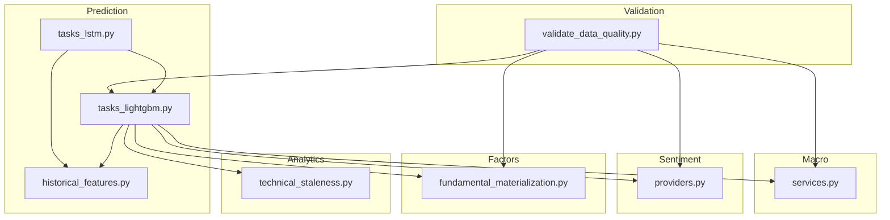

**Diagram sources**
- [tasks_lightgbm.py:1162-1400](file://apps/prediction/tasks_lightgbm.py#L1162-L1400)
- [tasks_lstm.py:188-231](file://apps/prediction/tasks_lstm.py#L188-L231)
- [historical_features.py:142-397](file://apps/prediction/historical_features.py#L142-L397)
- [technical_staleness.py:64-190](file://apps/analytics/technical_staleness.py#L64-L190)
- [fundamental_materialization.py:123-190](file://apps/factors/fundamental_materialization.py#L123-L190)
- [providers.py:221-312](file://apps/sentiment/providers.py#L221-L312)
- [services.py:51-90](file://apps/macro/services.py#L51-L90)
- [validate_data_quality.py:61-194](file://apps/core/management/commands/validate_data_quality.py#L61-L194)

**Section sources**
- [tasks_lightgbm.py:1162-1400](file://apps/prediction/tasks_lightgbm.py#L1162-L1400)
- [tasks_lstm.py:188-231](file://apps/prediction/tasks_lstm.py#L188-L231)
- [historical_features.py:142-397](file://apps/prediction/historical_features.py#L142-L397)
- [technical_staleness.py:64-190](file://apps/analytics/technical_staleness.py#L64-L190)
- [fundamental_materialization.py:123-190](file://apps/factors/fundamental_materialization.py#L123-L190)
- [providers.py:221-312](file://apps/sentiment/providers.py#L221-L312)
- [services.py:51-90](file://apps/macro/services.py#L51-L90)
- [validate_data_quality.py:61-194](file://apps/core/management/commands/validate_data_quality.py#L61-L194)

## Core Components
- Feature matrix builder: Assembles OHLCV, factor scores, sentiment, and technical indicators into a training matrix with warmup windows and PIT membership filtering.
- Lag and delta engine: Generates lagged values and deltas for RSI, momentum, and relative strength across configured windows.
- Interaction feature creator: Multiplies selected pairs (e.g., RSI x macro phase, factor composite x sentiment).
- Missing value strategy: Supports legacy neutral fill and native NaN modes; LSTM augments with explicit missingness indicators.
- Temporal alignment: Uses trading calendars and staleness checks to ensure as-of correctness and avoid look-ahead bias.
- Normalization: Scaler fit on sequences for LSTM; LightGBM artifacts include scaler metadata.
- Quality checks: Validation command audits coverage, continuity, and anomalies across all feature families.

**Section sources**
- [tasks_lightgbm.py:380-408](file://apps/prediction/tasks_lightgbm.py#L380-L408)
- [tasks_lightgbm.py:770-813](file://apps/prediction/tasks_lightgbm.py#L770-L813)
- [tasks_lightgbm.py:1162-1400](file://apps/prediction/tasks_lightgbm.py#L1162-L1400)
- [tasks_lstm.py:96-106](file://apps/prediction/tasks_lstm.py#L96-L106)
- [technical_staleness.py:64-190](file://apps/analytics/technical_staleness.py#L64-L190)
- [validate_data_quality.py:61-194](file://apps/core/management/commands/validate_data_quality.py#L61-L194)

## Architecture Overview
The feature pipeline is orchestrated by the prediction layer, which pulls aligned time series from markets, analytics, factors, sentiment, and macro sources. Staleness guards ensure only valid, timely data enters the matrix. The resulting matrix supports both tree-based models (LightGBM) and sequence models (LSTM), each with tailored missing-value handling and normalization.

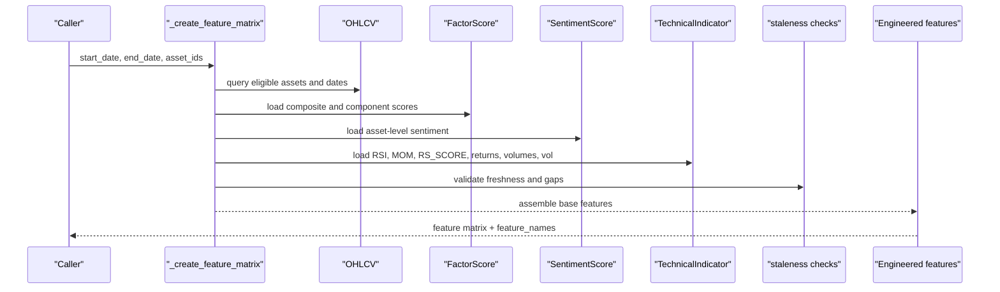

**Diagram sources**
- [tasks_lightgbm.py:1162-1400](file://apps/prediction/tasks_lightgbm.py#L1162-L1400)
- [technical_staleness.py:64-190](file://apps/analytics/technical_staleness.py#L64-L190)

## Detailed Component Analysis

### Technical Indicators and Freshness
- Retrieval uses parameter-aware queries to match indicator variants (e.g., RSI with timeperiod=14).
- Freshness enforced via trading-day distance against configured max gaps per indicator type.
- Helpers return latest values or defaults when stale or missing, preserving intended semantics.

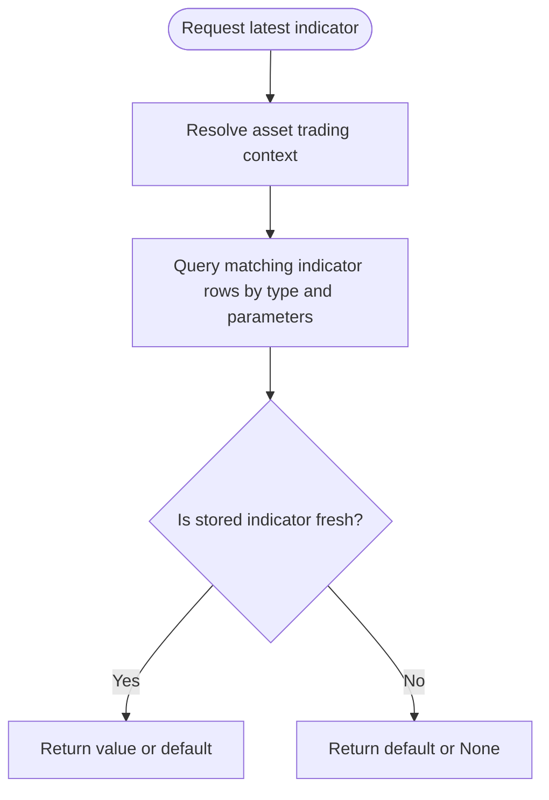

**Diagram sources**
- [historical_features.py:142-397](file://apps/prediction/historical_features.py#L142-L397)
- [technical_staleness.py:64-190](file://apps/analytics/technical_staleness.py#L64-L190)

**Section sources**
- [historical_features.py:142-397](file://apps/prediction/historical_features.py#L142-L397)
- [technical_staleness.py:64-190](file://apps/analytics/technical_staleness.py#L64-L190)

### Fundamental Factors Materialization
- Normalizes daily basic and financial indicator frames, aligning dates and rates.
- Produces point-in-time snapshots using backward merges so announcements are not used before availability.
- Exposes fields such as PE, PB, ROE trends, and capital flow metrics for scoring.

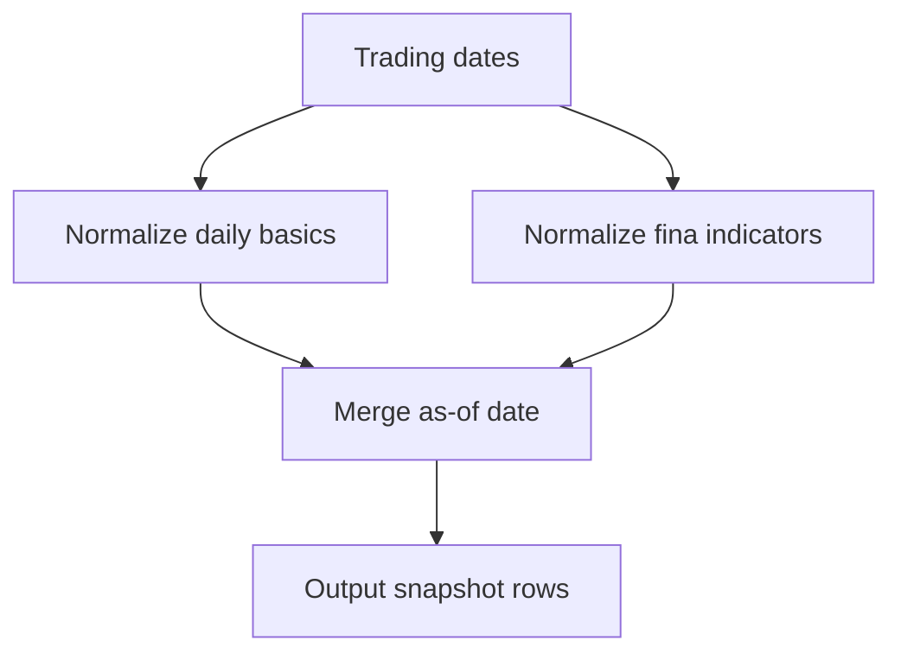

**Diagram sources**
- [fundamental_materialization.py:61-190](file://apps/factors/fundamental_materialization.py#L61-L190)

**Section sources**
- [fundamental_materialization.py:61-190](file://apps/factors/fundamental_materialization.py#L61-L190)

### Macroeconomic Context Integration
- Resolves active macro phase and optional event tag to adjust weights across financial, flow, and technical components.
- Normalizes weights after applying presets and event multipliers.

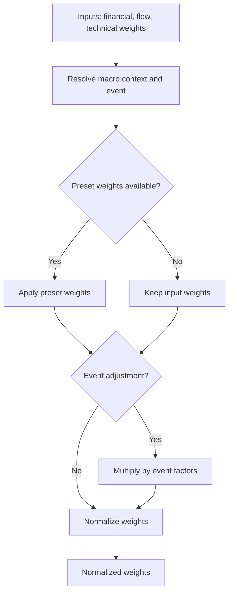

**Diagram sources**
- [services.py:51-90](file://apps/macro/services.py#L51-L90)

**Section sources**
- [services.py:51-90](file://apps/macro/services.py#L51-L90)

### Sentiment Scores and News Normalization
- Providers fetch from multiple sources and normalize records into a common schema with deterministic identity keys.
- Time parsing is provider-specific to prevent misalignment across trading days.

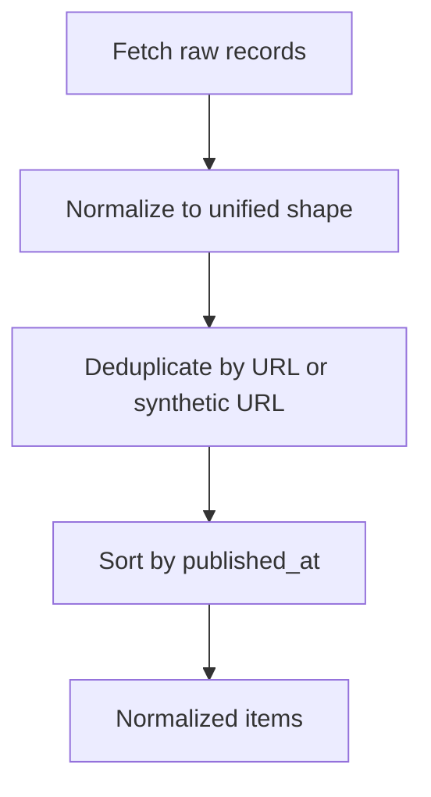

**Diagram sources**
- [providers.py:221-312](file://apps/sentiment/providers.py#L221-L312)

**Section sources**
- [providers.py:221-312](file://apps/sentiment/providers.py#L221-L312)

### Lag Windows and Delta Features
- For each configured lag window, computes lagged values for RSI, momentum, and relative strength where exact trading windows exist.
- Creates delta features as differences between current and lagged values.
- Applies missing-value strategy consistently, preserving true missingness when required.

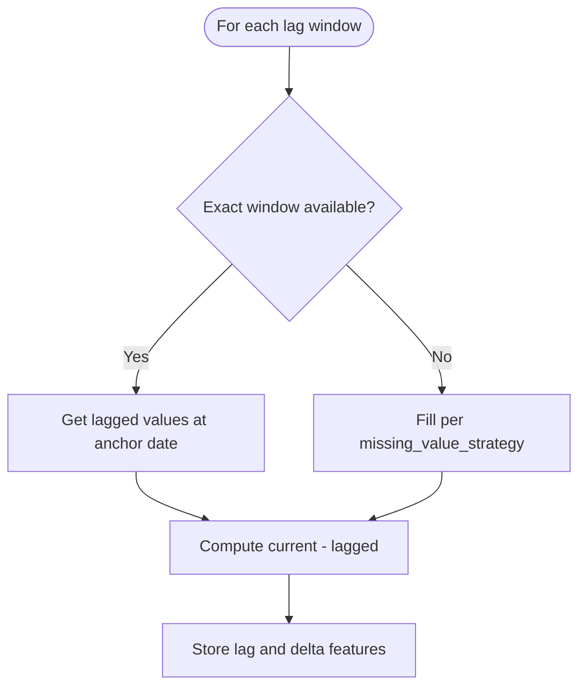

**Diagram sources**
- [tasks_lightgbm.py:770-813](file://apps/prediction/tasks_lightgbm.py#L770-L813)
- [technical_staleness.py:157-171](file://apps/analytics/technical_staleness.py#L157-L171)

**Section sources**
- [tasks_lightgbm.py:770-813](file://apps/prediction/tasks_lightgbm.py#L770-L813)
- [technical_staleness.py:157-171](file://apps/analytics/technical_staleness.py#L157-L171)

### Interaction Features
- Defined by a spec list that multiplies pairs such as RSI with relative volume or macro phase, and factor composite with sentiment.
- Applied both in batch matrix construction and single-asset augmentation paths.

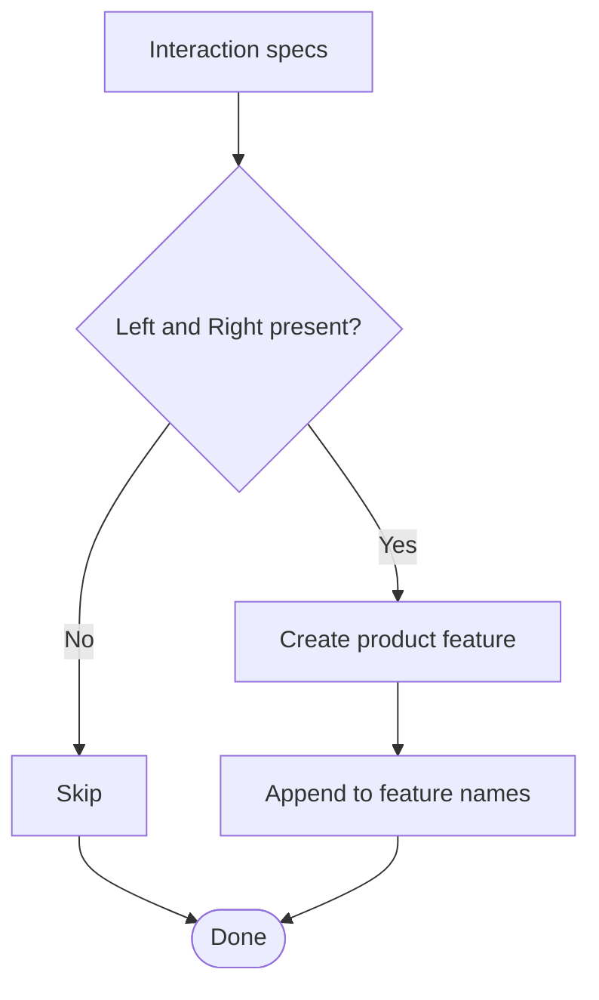

**Diagram sources**
- [tasks_lightgbm.py:380-408](file://apps/prediction/tasks_lightgbm.py#L380-L408)

**Section sources**
- [tasks_lightgbm.py:380-408](file://apps/prediction/tasks_lightgbm.py#L380-L408)

### Missing Data Strategies and LSTM Augmentation
- Legacy mode fills missing values with neutral defaults; native NaN mode preserves NaNs for downstream logic.
- LSTM path augments each base feature with an explicit missingness indicator column and uses a mask-and-zero-impute strategy during inference.

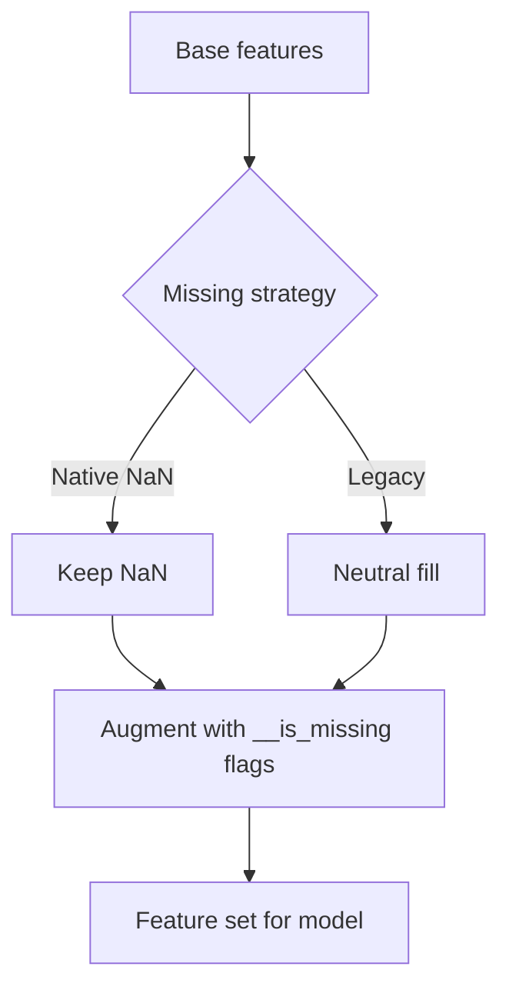

**Diagram sources**
- [tasks_lightgbm.py:163-167](file://apps/prediction/tasks_lightgbm.py#L163-L167)
- [tasks_lstm.py:96-106](file://apps/prediction/tasks_lstm.py#L96-L106)
- [tasks_lstm.py:188-231](file://apps/prediction/tasks_lstm.py#L188-L231)

**Section sources**
- [tasks_lightgbm.py:163-167](file://apps/prediction/tasks_lightgbm.py#L163-L167)
- [tasks_lstm.py:96-106](file://apps/prediction/tasks_lstm.py#L96-L106)
- [tasks_lstm.py:188-231](file://apps/prediction/tasks_lstm.py#L188-L231)

### Normalization Techniques
- LightGBM artifacts store scaler and calibrator metadata alongside model files; feature selection retains top contributors based on cumulative importance thresholds.
- LSTM sequences are scaled using StandardScaler fitted on flattened training sequences; NaNs are replaced with zeros post-transform.

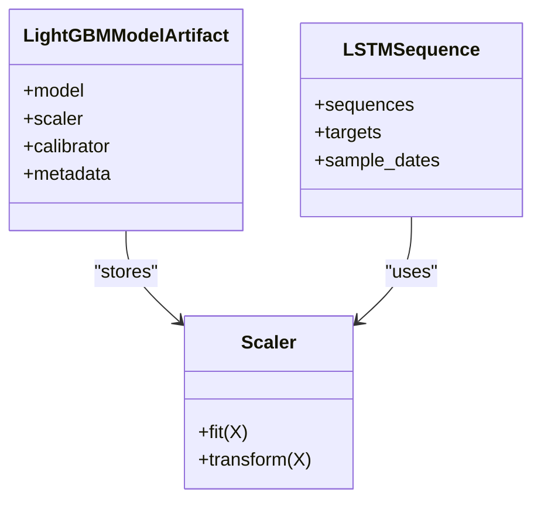

**Diagram sources**
- [tasks_lightgbm.py:95-156](file://apps/prediction/tasks_lightgbm.py#L95-L156)
- [tasks_lstm.py:144-155](file://apps/prediction/tasks_lstm.py#L144-L155)
- [metadata.json:49-135](file://models/lightgbm/30d_lgb-30d-2024-12-31-core80-v1/metadata.json#L49-L135)

**Section sources**
- [tasks_lightgbm.py:95-156](file://apps/prediction/tasks_lightgbm.py#L95-L156)
- [tasks_lstm.py:144-155](file://apps/prediction/tasks_lstm.py#L144-L155)
- [metadata.json:49-135](file://models/lightgbm/30d_lgb-30d-2024-12-31-core80-v1/metadata.json#L49-L135)

### Quality Checks and Validation
- Validation command enumerates expected fields across factor scores, fundamentals, capital flows, macro, and sentiment.
- Audits continuity gaps, technical indicator freshness, and reconciliation samples to detect anomalies and mismatches.

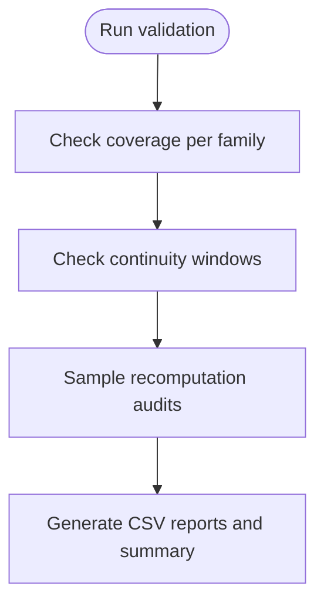

**Diagram sources**
- [validate_data_quality.py:61-194](file://apps/core/management/commands/validate_data_quality.py#L61-L194)

**Section sources**
- [validate_data_quality.py:61-194](file://apps/core/management/commands/validate_data_quality.py#L61-L194)

## Dependency Analysis
- Prediction tasks depend on markets (OHLCV), analytics (technical indicators and staleness), factors (scores), sentiment (scores), and macro (context).
- LSTM builds on LightGBM’s shared feature matrix utilities and adds missingness augmentation and sequence construction.
- Metadata artifacts record retained features and importance thresholds, ensuring reproducibility.

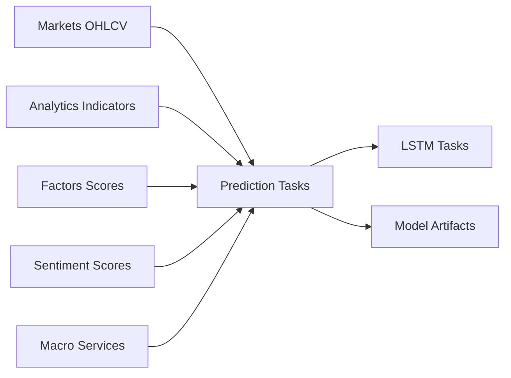

**Diagram sources**
- [tasks_lightgbm.py:1162-1400](file://apps/prediction/tasks_lightgbm.py#L1162-L1400)
- [tasks_lstm.py:188-231](file://apps/prediction/tasks_lstm.py#L188-L231)
- [metadata.json:49-135](file://models/lightgbm/30d_lgb-30d-2024-12-31-core80-v1/metadata.json#L49-L135)

**Section sources**
- [tasks_lightgbm.py:1162-1400](file://apps/prediction/tasks_lightgbm.py#L1162-L1400)
- [tasks_lstm.py:188-231](file://apps/prediction/tasks_lstm.py#L188-L231)
- [metadata.json:49-135](file://models/lightgbm/30d_lgb-30d-2024-12-31-core80-v1/metadata.json#L49-L135)

## Performance Considerations
- Caching:
  - Process-level caches for model artifacts, inference asset sets, and feature frames reduce repeated computation.
  - Parameterized cache keys ensure isolation by target date, sequence length, and missing-value strategy.
- Efficient data access:
  - Batch queries for OHLCV, factor scores, sentiment, and technical indicators minimize round-trips.
  - Warmup windows extend back slightly to support indicator stabilization without excessive memory use.
- Vectorization:
  - Pandas operations and groupby-based sequence building leverage vectorized computations.
- Model artifact caching:
  - Ordered dictionary with bounded entries prevents unbounded growth while retaining recent artifacts.

[No sources needed since this section provides general guidance]

## Troubleshooting Guide
- Missing or stale indicators:
  - Verify trading calendar coverage and indicator max-gap thresholds; stale values fall back to defaults or None depending on strategy.
- Unexpected NaNs:
  - Confirm missing_value_strategy; native NaN preserves gaps, while legacy fills with neutral values.
  - For LSTM, check __is_missing flags to diagnose missingness patterns.
- Lag features incorrect:
  - Ensure exact_trading_window_available returns True for the desired lag window; otherwise, fills apply per strategy.
- Macro context misalignment:
  - Validate active MarketContext and event_tag; weights are normalized after application.
- Validation issues:
  - Inspect generated CSV reports for continuity gaps, reconciliation mismatches, and null reason buckets.

**Section sources**
- [technical_staleness.py:64-190](file://apps/analytics/technical_staleness.py#L64-L190)
- [tasks_lightgbm.py:770-813](file://apps/prediction/tasks_lightgbm.py#L770-L813)
- [tasks_lstm.py:96-106](file://apps/prediction/tasks_lstm.py#L96-L106)
- [services.py:51-90](file://apps/macro/services.py#L51-L90)
- [validate_data_quality.py:61-194](file://apps/core/management/commands/validate_data_quality.py#L61-L194)

## Conclusion
The feature engineering system integrates multiple data sources with strict temporal alignment, robust missing-data handling, and comprehensive quality checks. It supports both tree-based and sequence-based models through shared foundations and model-specific augmentations. Caching and efficient queries keep performance scalable, while validation tools provide continuous assurance of data integrity.

[No sources needed since this section summarizes without analyzing specific files]

## Appendices

### Adding New Features
- Define retrieval:
  - If technical: add a query in the feature matrix builder with appropriate parameter matching and staleness checks.
  - If fundamental: extend normalization and materialization to include new fields and ensure point-in-time alignment.
  - If sentiment/macro: integrate via existing score/context mechanisms.
- Create engineered features:
  - Add lag/delta entries if applicable, referencing configured lag windows.
  - Add interaction specs if combining with other features.
- Update missing-value strategy behavior:
  - Ensure legacy vs native NaN semantics are respected.
- Validate:
  - Run validation commands and inspect continuity and reconciliation reports.
  - Rebuild model artifacts to capture new feature importance and retention decisions.

[No sources needed since this section provides general guidance]

### Validating Feature Integrity
- Use validation command outputs to identify:
  - Coverage gaps per feature family.
  - Continuity gaps in fundamentals, capital flows, and technical indicators.
  - Reconciliation mismatches for sampled recomputations.
- Cross-check metadata artifacts for retained features and importance thresholds.

**Section sources**
- [validate_data_quality.py:61-194](file://apps/core/management/commands/validate_data_quality.py#L61-L194)
- [metadata.json:49-135](file://models/lightgbm/30d_lgb-30d-2024-12-31-core80-v1/metadata.json#L49-L135)

### Debugging Feature Computation Issues
- Trace feature origins:
  - Confirm source tables contain rows for the asset/date range.
  - Check staleness thresholds and trading-day distances.
- Inspect intermediate frames:
  - Validate OHLCV, factor, sentiment, and indicator frames before merging.
- Confirm strategy effects:
  - Compare legacy vs native NaN outcomes for missing values.
- Review LSTM augmentation:
  - Ensure __is_missing flags align with NaN presence.

**Section sources**
- [historical_features.py:142-397](file://apps/prediction/historical_features.py#L142-L397)
- [technical_staleness.py:64-190](file://apps/analytics/technical_staleness.py#L64-L190)
- [tasks_lstm.py:96-106](file://apps/prediction/tasks_lstm.py#L96-L106)