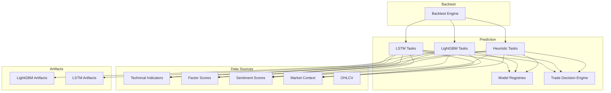
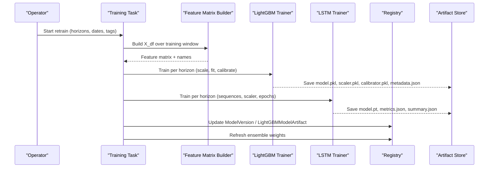
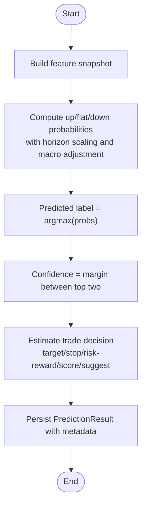
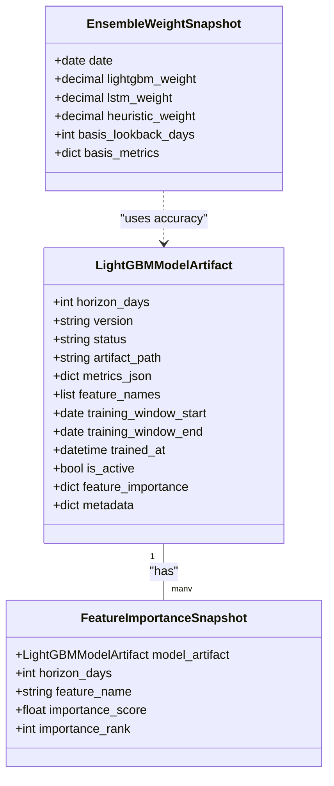
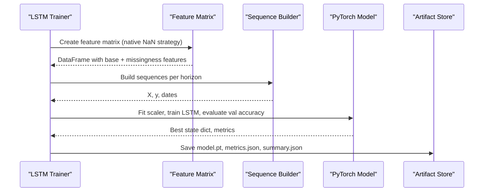
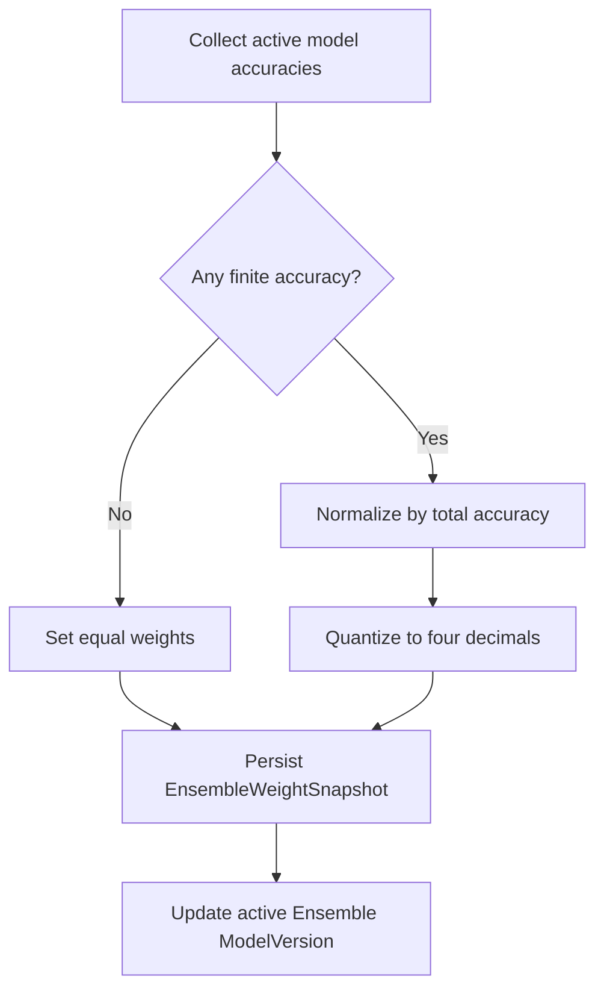
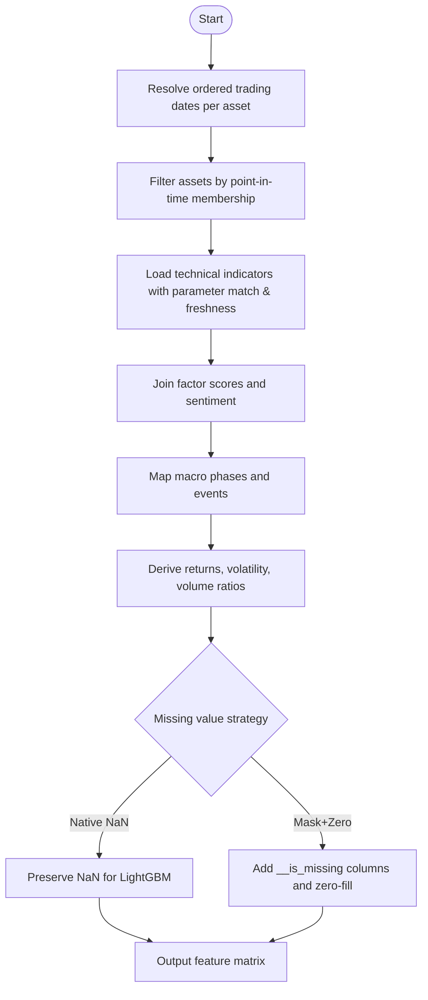
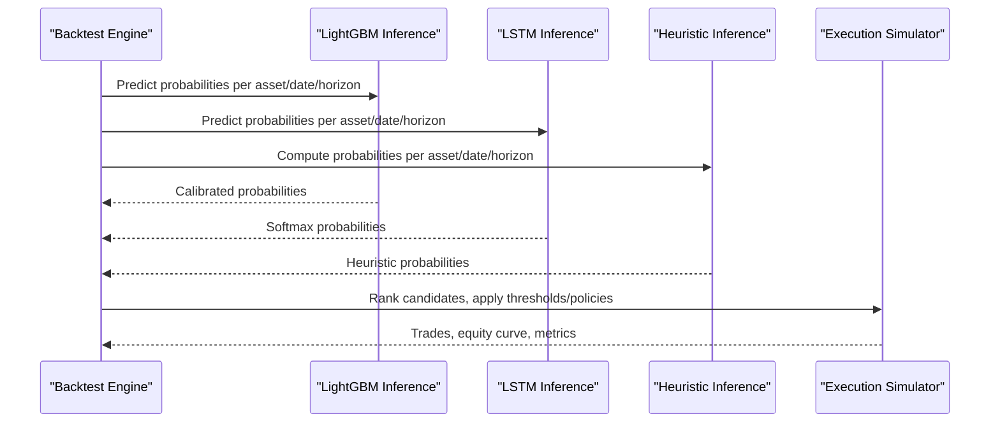
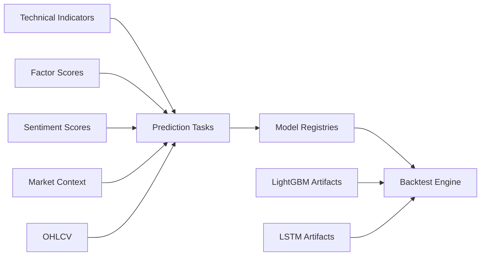

# Machine Learning Pipeline

<cite>
**Referenced Files in This Document**
- [tasks.py](file://apps/prediction/tasks.py)
- [models.py](file://apps/prediction/models.py)
- [tasks_lightgbm.py](file://apps/prediction/tasks_lightgbm.py)
- [tasks_lstm.py](file://apps/prediction/tasks_lstm.py)
- [historical_features.py](file://apps/prediction/historical_features.py)
- [odds.py](file://apps/prediction/odds.py)
- [models_lightgbm.py](file://apps/prediction/models_lightgbm.py)
- [backtest_tasks.py](file://apps/backtest/tasks.py)
- [backtest_models.py](file://apps/backtest/models.py)
- [retrain.md](file://docs/how-to/retrain.md)
- [metadata.json](file://models/lightgbm/30d_lgb-30d-2024-12-31/metadata.json)
</cite>

## Table of Contents
1. Introduction
2. Project Structure
3. Core Components
4. Architecture Overview
5. Detailed Component Analysis
6. Dependency Analysis
7. Performance Considerations
8. Troubleshooting Guide
9. Conclusion
10. Appendices

## Introduction
This document explains the machine learning pipeline that produces three prediction models: a heuristic baseline, LightGBM, and LSTM. It covers feature engineering, validation strategies, hyperparameter tuning, artifact versioning, ensemble weighting, retraining workflows, promotion to production, monitoring for degradation, evaluation metrics, backtesting integration, deployment strategies, and troubleshooting guidance.

## Project Structure
The ML pipeline is implemented as Django apps with Celery tasks:
- Prediction app: heuristic baseline, LightGBM training/inference, LSTM training/inference, model registries, and ensemble weight snapshots.
- Backtest app: live candidate generation from artifacts, trade simulation, and performance reporting.
- Feature utilities: technical indicators, OHLCV access, trading calendar alignment, and point-in-time universe handling.
- Models directory: persisted artifacts and metadata for reproducibility.

**Diagram sources**
- [tasks.py:149-243](file://apps/prediction/tasks.py#L149-L243)
- [tasks_lightgbm.py:1888-1950](file://apps/prediction/tasks_lightgbm.py#L1888-L1950)
- [tasks_lstm.py:592-765](file://apps/prediction/tasks_lstm.py#L592-L765)
- [backtest_tasks.py:681-800](file://apps/backtest/tasks.py#L681-L800)

**Section sources**
- [tasks.py:149-243](file://apps/prediction/tasks.py#L149-L243)
- [tasks_lightgbm.py:1888-1950](file://apps/prediction/tasks_lightgbm.py#L1888-L1950)
- [tasks_lstm.py:592-765](file://apps/prediction/tasks_lstm.py#L592-L765)
- [backtest_tasks.py:681-800](file://apps/backtest/tasks.py#L681-L800)

## Core Components
- Heuristic baseline: builds probabilities from factor, sentiment, momentum, relative strength, RSI, and macro phase; persists predictions and updates an active ensemble registry entry.
- LightGBM: trains multiclass classifiers per horizon (3/7/30 days), standardizes features, calibrates probabilities, saves artifacts, records feature importance, and refreshes ensemble weights.
- LSTM: trains sequence-based classifiers per horizon using PyTorch, stores model state dicts and scaler parameters, and supports missingness-aware inference.
- Model registries: track versions, statuses, metrics, feature schemas, training windows, and active flags.
- Ensemble weighting: computes weights from recent accuracy across all three models and persists snapshots.
- Trade decision engine: converts probabilities into target price, stop loss, risk-reward ratio, trade score, and suggestion flags.

**Section sources**
- [models.py:7-31](file://apps/prediction/models.py#L7-L31)
- [models_lightgbm.py:7-38](file://apps/prediction/models_lightgbm.py#L7-L38)
- [models_lightgbm.py:97-137](file://apps/prediction/models_lightgbm.py#L97-L137)
- [tasks.py:82-146](file://apps/prediction/tasks.py#L82-L146)
- [tasks_lightgbm.py:586-729](file://apps/prediction/tasks_lightgbm.py#L586-L729)
- [tasks_lstm.py:444-589](file://apps/prediction/tasks_lstm.py#L444-L589)
- [odds.py:60-158](file://apps/prediction/odds.py#L60-L158)

## Architecture Overview
The system separates training, inference, and backtesting:
- Training pipelines build feature matrices aligned to point-in-time universes, generate labels by horizon, train models, persist artifacts, and update registries.
- Inference uses active artifacts to produce probabilities and trade decisions for assets on a given date.
- Backtesting recomputes candidates at runtime from current artifacts and data, simulates trades with realistic fees, and reports performance.

**Diagram sources**
- [tasks_lightgbm.py:1888-1950](file://apps/prediction/tasks_lightgbm.py#L1888-L1950)
- [tasks_lstm.py:592-765](file://apps/prediction/tasks_lstm.py#L592-L765)
- [tasks_lightgbm.py:586-729](file://apps/prediction/tasks_lightgbm.py#L586-L729)
- [tasks_lstm.py:444-589](file://apps/prediction/tasks_lstm.py#L444-L589)

## Detailed Component Analysis

### Heuristic Baseline
- Feature snapshot pulls composite factor scores, bottom probability, sentiment, RSI, 5-day momentum, and relative strength score.
- Probabilities are computed from signals scaled by horizon and adjusted by macro phase, then normalized to sum to one.
- Predicted label is the max-probability class; confidence is derived from the margin between top two classes.
- Trade decision estimates target price, stop loss, risk-reward ratio, trade score, and suggestion based on recent highs/lows, Bollinger Bands, moving averages, and policy thresholds.
- Results are persisted with model version linkage and feature payload for traceability.

**Diagram sources**
- [tasks.py:55-127](file://apps/prediction/tasks.py#L55-L127)
- [odds.py:60-158](file://apps/prediction/odds.py#L60-L158)

**Section sources**
- [tasks.py:55-127](file://apps/prediction/tasks.py#L55-L127)
- [odds.py:60-158](file://apps/prediction/odds.py#L60-L158)
- [models.py:43-97](file://apps/prediction/models.py#L43-L97)

### LightGBM Training and Inference
- Feature matrix construction aggregates stored technical indicators, factors, sentiment, macro context, and OHLC-derived features with lag/delta windows and interaction terms. Missing values can be preserved as NaN or filled via legacy defaults depending on strategy.
- Labels are created per horizon using future returns and direction mapping.
- Training standardizes features, fits a multiclass booster, optionally prunes features based on cumulative importance snapshots, calibrates probabilities, and persists artifacts with metadata including feature names and training window.
- Inference loads artifacts, extracts features for an asset/date, scales, predicts probabilities, and integrates trade decisions. GPU acceleration is probed when applicable.

**Diagram sources**
- [models_lightgbm.py:7-38](file://apps/prediction/models_lightgbm.py#L7-L38)
- [models_lightgbm.py:97-137](file://apps/prediction/models_lightgbm.py#L97-L137)

**Section sources**
- [tasks_lightgbm.py:160-180](file://apps/prediction/tasks_lightgbm.py#L160-L180)
- [tasks_lightgbm.py:1162-1179](file://apps/prediction/tasks_lightgbm.py#L1162-L1179)
- [tasks_lightgbm.py:1888-1950](file://apps/prediction/tasks_lightgbm.py#L1888-L1950)
- [tasks_lightgbm.py:586-729](file://apps/prediction/tasks_lightgbm.py#L586-L729)
- [metadata.json:1-112](file://models/lightgbm/30d_lgb-30d-2024-12-31/metadata.json#L1-L112)

### LSTM Training and Inference
- Sequences are built from feature frames with rolling windows per asset; missingness is encoded via indicator columns and zero-imputed after scaling.
- Training splits sequences chronologically, fits a StandardScaler on training sequences, trains an LSTM classifier for fixed epochs, selects best validation accuracy state, and saves model state dict plus scaler parameters and metrics.
- Inference resolves active model version, loads artifact, builds sequence, normalizes with saved scaler parameters, runs softmax, and produces probabilities and trade decisions.

**Diagram sources**
- [tasks_lstm.py:96-141](file://apps/prediction/tasks_lstm.py#L96-L141)
- [tasks_lstm.py:444-589](file://apps/prediction/tasks_lstm.py#L444-L589)
- [tasks_lstm.py:592-765](file://apps/prediction/tasks_lstm.py#L592-L765)

**Section sources**
- [tasks_lstm.py:96-141](file://apps/prediction/tasks_lstm.py#L96-L141)
- [tasks_lstm.py:444-589](file://apps/prediction/tasks_lstm.py#L444-L589)
- [tasks_lstm.py:592-765](file://apps/prediction/tasks_lstm.py#L592-L765)

### Ensemble Weighting System
- Weights are refreshed after successful LightGBM or LSTM retraining.
- Basis accuracies are aggregated from active model metrics over a trailing lookback window.
- Weights are proportional to each model’s accuracy and quantized; fallback equal weights are used if no valid accuracy exists.
- Snapshot rows record date, weights, basis metrics, and lookback window; active ensemble version is updated with latest metrics and training window.

**Diagram sources**
- [tasks_lightgbm.py:631-729](file://apps/prediction/tasks_lightgbm.py#L631-L729)

**Section sources**
- [tasks_lightgbm.py:631-729](file://apps/prediction/tasks_lightgbm.py#L631-L729)

### Feature Matrix Construction and Temporal Validation
- The feature matrix builder constructs a wide DataFrame over a date range and asset set, aligning to point-in-time membership so only assets tradable on each date are included.
- Technical indicators are fetched with parameter matching and freshness checks against the trading calendar; OHLCV-derived features use recent bars and gaps validated by trading positions.
- Macro context is mapped to numeric phases and integrated; sentiment and factor scores are joined by date and asset.
- Missing value strategies differ: LightGBM can preserve true NaNs; LSTM augments with missingness masks and zero imputation.

**Diagram sources**
- [tasks_lightgbm.py:1162-1179](file://apps/prediction/tasks_lightgbm.py#L1162-L1179)
- [historical_features.py:86-179](file://apps/prediction/historical_features.py#L86-L179)
- [tasks_lstm.py:96-141](file://apps/prediction/tasks_lstm.py#L96-L141)

**Section sources**
- [tasks_lightgbm.py:1162-1179](file://apps/prediction/tasks_lightgbm.py#L1162-L1179)
- [historical_features.py:86-179](file://apps/prediction/historical_features.py#L86-L179)
- [tasks_lstm.py:96-141](file://apps/prediction/tasks_lstm.py#L96-L141)

### Model Evaluation Metrics and Backtesting Integration
- Evaluation metrics include directional accuracy per horizon, calibration quality (via calibrated probabilities), and trade-level metrics such as risk-reward ratio and trade score.
- Backtesting recomputes candidates at runtime from active artifacts and current data, ensuring comparability across horizons and avoiding leakage from historical predictions.
- Fee models support structured CN A-share costs and legacy flat fee modes; exits prefer conservative outcomes when both stop and target trigger on the same bar.
- Runs are chunked and resumable, persisting runtime state to survive worker restarts.

**Diagram sources**
- [backtest_tasks.py:681-800](file://apps/backtest/tasks.py#L681-L800)
- [backtest_models.py:24-117](file://apps/backtest/models.py#L24-L117)

**Section sources**
- [backtest_tasks.py:681-800](file://apps/backtest/tasks.py#L681-L800)
- [backtest_models.py:24-117](file://apps/backtest/models.py#L24-L117)

### Deployment Strategies for Production Inference
- Active artifacts are selected via registry flags:
  - LightGBM: active per horizon via `LightGBMModelArtifact.is_active`.
  - LSTM: active via `ModelVersion(model_type=LSTM, is_active=True)` with artifact path pointing to model files.
- Inference caches artifacts and feature frames to reduce latency; GPU detection is attempted for LightGBM where supported.
- Trade decision policies can be tuned via minimum target return and stop distance constraints.

**Section sources**
- [tasks_lightgbm.py:121-156](file://apps/prediction/tasks_lightgbm.py#L121-L156)
- [tasks_lstm.py:234-319](file://apps/prediction/tasks_lstm.py#L234-L319)
- [odds.py:60-158](file://apps/prediction/odds.py#L60-L158)

## Dependency Analysis
- Prediction tasks depend on analytics indicators, factors, sentiment, market context, and markets OHLCV data.
- Backtest depends on prediction tasks and artifacts to compute candidates at runtime.
- Registries link artifacts to predictions and ensemble snapshots.

**Diagram sources**
- [tasks.py:8-16](file://apps/prediction/tasks.py#L8-L16)
- [tasks_lightgbm.py:26-51](file://apps/prediction/tasks_lightgbm.py#L26-L51)
- [tasks_lstm.py:15-30](file://apps/prediction/tasks_lstm.py#L15-L30)
- [backtest_tasks.py:54-68](file://apps/backtest/tasks.py#L54-L68)

**Section sources**
- [tasks.py:8-16](file://apps/prediction/tasks.py#L8-L16)
- [tasks_lightgbm.py:26-51](file://apps/prediction/tasks_lightgbm.py#L26-L51)
- [tasks_lstm.py:15-30](file://apps/prediction/tasks_lstm.py#L15-L30)
- [backtest_tasks.py:54-68](file://apps/backtest/tasks.py#L54-L68)

## Performance Considerations
- Batched LightGBM inference and GPU probing can reduce latency; process-level caches bound memory usage during backtests.
- LSTM training uses sequence chunking and capped samples per horizon to control peak memory; scaler fitting is performed on flattened sequences.
- Feature extraction leverages caching keys to avoid redundant queries across assets and dates.
- Backtest chunking enables long runs to resume safely; clearing caches between unrelated batches prevents cross-contamination.

[No sources needed since this section provides general guidance]

## Troubleshooting Guide
Common issues and resolutions:
- Training failures due to insufficient data: ensure adequate sequence samples and valid labels; check horizon-specific sample counts and adjust chunk sizes or max samples.
- Data quality issues: validate stored indicators’ freshness and parameter compatibility; confirm point-in-time universe coverage and trading calendar alignment.
- Missing-value contract mismatches: verify artifact metadata indicates expected strategy; retrain if key is absent to avoid silent degradation to legacy fills.
- Performance bottlenecks: enable batched inference, clear backtest caches between runs, and tune asset chunk size and sequence length for LSTM.
- Ensemble weight anomalies: inspect basis metrics and lookback window; remove leaked artifacts causing inflated accuracy before refreshing weights.

**Section sources**
- [tasks_lstm.py:484-502](file://apps/prediction/tasks_lstm.py#L484-L502)
- [tasks_lightgbm.py:477-579](file://apps/prediction/tasks_lightgbm.py#L477-L579)
- [retrain.md:163-186](file://docs/how-to/retrain.md#L163-L186)
- [backtest_tasks.py:149-160](file://apps/backtest/tasks.py#L149-L160)

## Conclusion
The pipeline integrates heuristic, LightGBM, and LSTM models with robust feature engineering, temporal validation, and artifact versioning. Ensemble weighting adapts to recent performance, while backtesting ensures out-of-sample evaluation under realistic conditions. Retraining, promotion, and rollback procedures maintain reproducibility and operational safety. Monitoring ensemble weights and validation backtests helps detect drift and guide timely retraining.

[No sources needed since this section summarizes without analyzing specific files]

## Appendices

### Artifact Versioning and Metadata
- LightGBM artifacts store model, scaler, calibrator, and metadata including feature names, training window, and pruning rules.
- LSTM artifacts store model state dict, scaler parameters, sequence length, architecture settings, and per-horizon metrics plus a summary file.
- Registries track version lifecycle, metrics, feature schema, and active flags for inference selection.

**Section sources**
- [tasks_lightgbm.py:95-118](file://apps/prediction/tasks_lightgbm.py#L95-L118)
- [tasks_lstm.py:444-470](file://apps/prediction/tasks_lstm.py#L444-L470)
- [models.py:7-31](file://apps/prediction/models.py#L7-L31)
- [models_lightgbm.py:7-38](file://apps/prediction/models_lightgbm.py#L7-L38)
- [metadata.json:1-112](file://models/lightgbm/30d_lgb-30d-2024-12-31/metadata.json#L1-L112)

### Retraining Commands and Workflows
- Retrain LightGBM with horizon selection, optional backfill skipping, and version tagging; supports snapshot-based feature pruning.
- Retrain LSTM with sequence length, asset chunk size, and sample caps; outputs per-horizon models and summary metrics.
- Validate before promotion using validation backtests and reference benchmark suites; compare new families against incumbents on out-of-sample metrics.
- Promote by activating artifacts per horizon; rollback by deactivating bad artifacts and reactivating previous generations.

**Section sources**
- [retrain.md:82-128](file://docs/how-to/retrain.md#L82-L128)
- [retrain.md:131-159](file://docs/how-to/retrain.md#L131-L159)
- [retrain.md:190-223](file://docs/how-to/retrain.md#L190-L223)
- [retrain.md:227-272](file://docs/how-to/retrain.md#L227-L272)