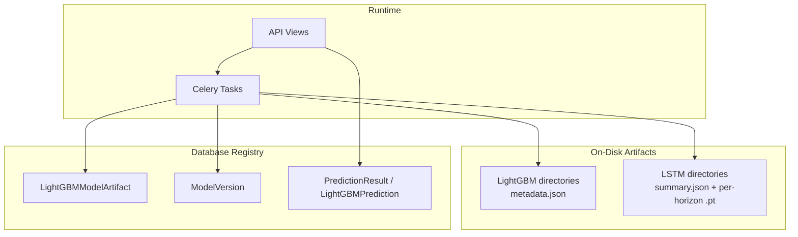
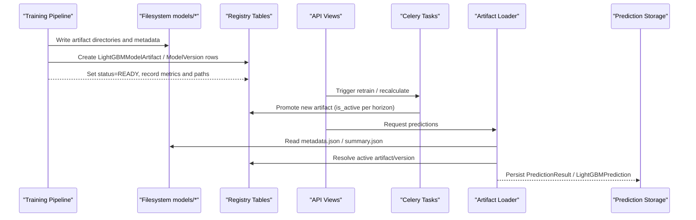
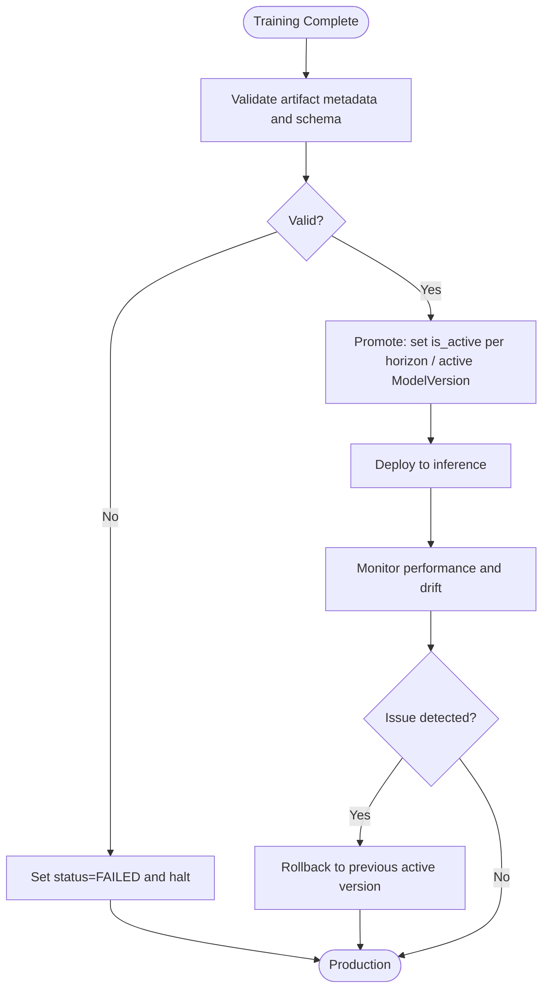
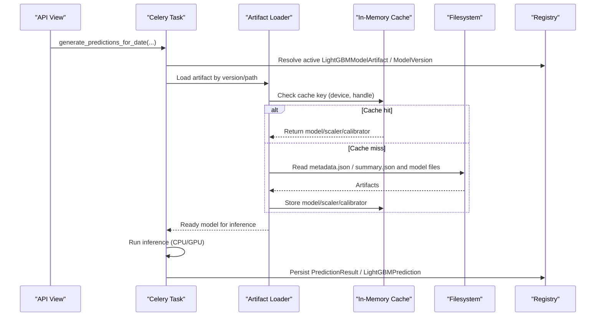
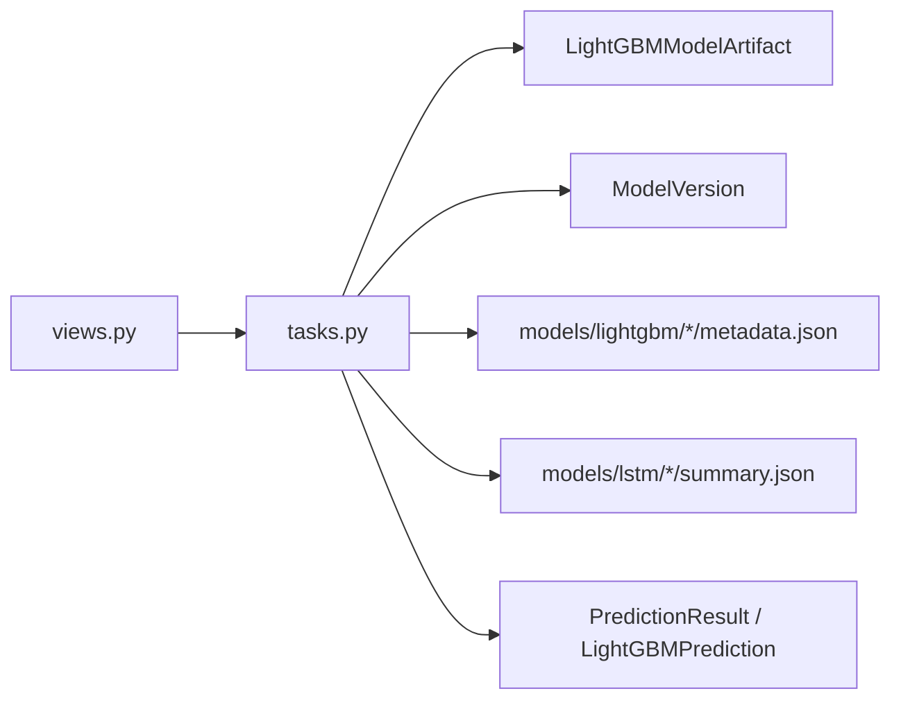

# Model Artifact Management

<cite>
**Referenced Files in This Document**
- [metadata.json](file://models/lightgbm/30d_lgb-30d-2024-12-31/metadata.json)
- [summary.json](file://models/lstm/lstm-2024-12-31/summary.json)
- [models.py](file://apps/prediction/models.py)
- [models_lightgbm.py](file://apps/prediction/models_lightgbm.py)
- [tasks.py](file://apps/prediction/tasks.py)
- [views.py](file://apps/prediction/views.py)
- [models.md](file://docs/reference/models.md)
- [retrain.md](file://docs/how-to/retrain.md)
- [technical_guide.md](file://TECHNICAL_GUIDE.md)
- [backlog.md](file://BACKLOG.md)
- [base.py](file://config/settings/base.py)
</cite>

## Table of Contents
1. Introduction
2. Project Structure
3. Core Components
4. Architecture Overview
5. Detailed Component Analysis
6. Dependency Analysis
7. Performance Considerations
8. Troubleshooting Guide
9. Conclusion
10. Appendices

## Introduction
This document explains the model artifact management system used to store, version, promote, and load trained models for prediction workloads. It covers the on-disk artifact layout under models/, metadata tracking in both filesystem artifacts and database registries, promotion and rollback workflows, loading mechanisms with caching strategies, GPU acceleration support, validation and integrity checks, cleanup procedures, security considerations, backup strategies, and disaster recovery guidance for production environments.

## Project Structure
The artifact system spans three layers:
- On-disk artifacts:
  - LightGBM: one directory per horizon/version containing a metadata file describing features, training window, parameters, and pruning strategy.
  - LSTM: one directory per version containing per-horizon metrics and a summary file that records model paths and aggregate accuracy.
- Database registry:
  - LightGBMModelArtifact: per-horizon active artifact registry with status, metrics, feature names, training windows, and path resolution.
  - ModelVersion: higher-level registry for LSTM, ensemble, and historical LightGBM entries with status and metadata.
- Runtime orchestration:
  - Views expose endpoints to trigger retraining and inference.
  - Celery tasks perform training, promotion, and prediction generation.

**Diagram sources**
- [models_lightgbm.py:7-38](file://apps/prediction/models_lightgbm.py#L7-L38)
- [models.py:7-37](file://apps/prediction/models.py#L7-L37)
- [tasks.py:149-174](file://apps/prediction/tasks.py#L149-L174)
- [views.py:15-24](file://apps/prediction/views.py#L15-L24)

**Section sources**
- [models_lightgbm.py:7-38](file://apps/prediction/models_lightgbm.py#L7-L38)
- [models.py:7-37](file://apps/prediction/models.py#L7-L37)
- [models.md:13-21](file://docs/reference/models.md#L13-L21)
- [models.md:78-118](file://docs/reference/models.md#L78-L118)

## Core Components
- LightGBMModelArtifact: Tracks per-horizon LightGBM artifacts, including status (TRAINING/READY/FAILED/ARCHIVED), artifact_path, metrics, feature_names, training_window_start/end, trained_at, is_active, and metadata. Unique constraint on (horizon_days, version).
- ModelVersion: Higher-level registry for LSTM, ensemble, and historical LightGBM entries with fields like model_type, version, status, artifact_path, metrics, feature_schema, training_window_start/end, trained_at, is_active, metadata.
- PredictionResult and LightGBMPrediction: Persist predictions linked to the model version/artifact used at inference time, along with feature payloads and metadata.

Key responsibilities:
- Versioning: Each artifact family is identified by a version tag; multiple generations are retained.
- Promotion: Exactly one active row per horizon for LightGBM via is_active; LSTM/ensemble tracked via ModelVersion.
- Metadata: Both filesystem and DB carry complementary information for traceability and diagnostics.

**Section sources**
- [models_lightgbm.py:7-38](file://apps/prediction/models_lightgbm.py#L7-L38)
- [models.py:7-37](file://apps/prediction/models.py#L7-L37)
- [models_lightgbm.py:41-94](file://apps/prediction/models_lightgbm.py#L41-L94)
- [models.md:13-21](file://docs/reference/models.md#L13-L21)

## Architecture Overview
The lifecycle flows from training completion to production deployment:
- Training produces artifacts under models/<model_family>/<version>/ with metadata files.
- The training pipeline registers artifacts in the database registry and sets statuses accordingly.
- Promotion activates the new artifact(s) and deactivates previous ones per horizon (LightGBM) or marks the appropriate ModelVersion as active (LSTM/ensemble).
- Inference loads artifacts by version, validates schema and missing-value strategy, caches loaded objects, and persists predictions linked to the active model.

**Diagram sources**
- [tasks.py:149-174](file://apps/prediction/tasks.py#L149-L174)
- [tasks.py:177-243](file://apps/prediction/tasks.py#L177-L243)
- [views.py:15-24](file://apps/prediction/views.py#L15-L24)
- [models_lightgbm.py:7-38](file://apps/prediction/models_lightgbm.py#L7-L38)
- [models.py:7-37](file://apps/prediction/models.py#L7-L37)

## Detailed Component Analysis

### Artifact Storage Structure
- LightGBM:
  - Directory naming encodes horizon and version (e.g., 3d_lgb-3d-YYYY-MM-DD).
  - Each directory contains metadata.json with horizon_days, version, feature_names, trained_at, training_window_start/end, lgb_params, and pruning details (rule, engineered_feature_count, final_keep_count, kept_features, pruned_features).
- LSTM:
  - Directory naming encodes version (e.g., lstm-YYYY-MM-DD[-suffix]).
  - Per-horizon metrics files (e.g., 3d_metrics.json, 7d_metrics.json, 30d_metrics.json) and a summary.json recording version, training window, horizons, sequence_length, results (status, accuracy, samples, artifact_path, feature_count, sequence_length), and aggregate_accuracy.

These structures provide full provenance for each artifact and enable deterministic loading and validation.

**Section sources**
- [metadata.json:1-112](file://models/lightgbm/30d_lgb-30d-2024-12-31/metadata.json#L1-L112)
- [summary.json:1-41](file://models/lstm/lstm-2024-12-31/summary.json#L1-L41)
- [models.md:78-118](file://docs/reference/models.md#L78-L118)

### Metadata Tracking and Versioning Schemes
- Filesystem metadata:
  - LightGBM metadata.json includes feature contract, training window, hyperparameters, and pruning rule.
  - LSTM summary.json includes per-horizon results and artifact paths.
- Database registry:
  - LightGBMModelArtifact tracks per-horizon versions with status, metrics, feature_names, training windows, trained_at, is_active, and metadata.
  - ModelVersion tracks LSTM/ensemble/historical LightGBM with model_type, version, status, artifact_path, metrics, feature_schema, training windows, trained_at, is_active, and metadata.
- Versioning scheme:
  - New generations are appended rather than overwritten; promotion toggles is_active per horizon for LightGBM and selects an active ModelVersion for LSTM/ensemble.

**Section sources**
- [models_lightgbm.py:7-38](file://apps/prediction/models_lightgbm.py#L7-L38)
- [models.py:7-37](file://apps/prediction/models.py#L7-L37)
- [models.md:24-64](file://docs/reference/models.md#L24-L64)
- [retrain.md:227-272](file://docs/how-to/retrain.md#L227-L272)

### Lifecycle: Training Completion to Production Deployment
- Training completion:
  - Artifacts written to models/<family>/<version>.
  - Registry rows created with status TRAINING then updated to READY upon success; failures set FAILED.
- Validation:
  - Feature schema and missing-value strategy must be present and consistent; absence falls back to legacy neutral fills unless explicitly handled.
- Promotion:
  - For LightGBM: set is_active=True on the new artifact per horizon and clear it on incumbents.
  - For LSTM/ensemble: mark the appropriate ModelVersion as active.
- Rollback:
  - Reverse promotion: deactivate bad artifacts and reactivate previous known-good versions per horizon. No deletion occurs during rollback.

**Diagram sources**
- [retrain.md:227-272](file://docs/how-to/retrain.md#L227-L272)
- [technical_guide.md:593-614](file://TECHNICAL_GUIDE.md#L593-L614)

**Section sources**
- [retrain.md:227-272](file://docs/how-to/retrain.md#L227-L272)
- [technical_guide.md:593-614](file://TECHNICAL_GUIDE.md#L593-L614)

### Artifact Loading Mechanisms, Caching, and GPU Acceleration
- Loading:
  - LightGBM artifacts are resolved by active per-horizon artifact_path; metadata.json provides feature_names and missing-value strategy.
  - LSTM artifacts are resolved via ModelVersion.artifact_path pointing to a directory containing summary.json and per-horizon model files.
- Caching:
  - Tests reference GPU-aware cache key normalization for LightGBM predictors, indicating runtime caching of loaded models to avoid repeated disk I/O and device transfers.
  - Heuristic baseline uses a runtime cache for feature lookups during batch prediction.
- GPU acceleration:
  - Backtest tests demonstrate selection between CPU and GPU backends based on supported devices, preserving cache keys across backends.
- Memory management:
  - Cache keys normalize underlying handles (e.g., ctypes pointers) to ensure stable caching across processes and devices.
  - Predictions persist minimal payloads; heavy model state remains cached in memory where appropriate.

**Diagram sources**
- [tasks.py:177-243](file://apps/prediction/tasks.py#L177-L243)
- [tests_lightgbm.py:89-97](file://apps/prediction/tests_lightgbm.py#L89-L97)
- [tests.py:2427-2580](file://apps/backtest/tests.py#L2427-L2580)

**Section sources**
- [tasks.py:177-243](file://apps/prediction/tasks.py#L177-L243)
- [tests_lightgbm.py:89-97](file://apps/prediction/tests_lightgbm.py#L89-L97)
- [tests.py:2427-2580](file://apps/backtest/tests.py#L2427-L2580)

### Artifact Validation, Integrity Checks, and Cleanup
- Validation:
  - Missing-value strategy must be present; absence triggers legacy neutral-fill behavior which can silently degrade correctness.
  - Feature schema should be validated strictly at inference time to fail loudly on mismatches.
- Integrity:
  - Ensure artifact_path resolves on the current host; absolute paths recorded on other hosts may not resolve.
  - Verify exactly one active artifact per horizon for LightGBM and correct ModelVersion for LSTM/ensemble.
- Cleanup:
  - Retire leaked or invalid artifacts by moving them to ARCHIVED status to prevent accidental activation.
  - Avoid deleting artifacts; retention enables rollback without retraining.

**Section sources**
- [technical_guide.md:593-614](file://TECHNICAL_GUIDE.md#L593-L614)
- [backlog.md:258-269](file://BACKLOG.md#L258-L269)
- [retrain.md:227-272](file://docs/how-to/retrain.md#L227-L272)

### Security, Backup, and Disaster Recovery
- Security:
  - API access requires JWT Bearer tokens or API Key authentication; rate limits apply per tier.
  - Ensure artifact directories are protected at the filesystem level and only accessible to authorized services.
- Backup:
  - Back up both filesystem artifacts (models/) and database registry tables (LightGBMModelArtifact, ModelVersion, PredictionResult/LightGBMPrediction).
  - Include generated documentation facts (export_documentation_facts) to capture live registry snapshots.
- Disaster recovery:
  - Restore filesystem artifacts and database state to a known good point.
  - Re-run export_documentation_facts to reconcile registry and filesystem state.
  - If artifact paths are non-portable, retrain on the target host to rewrite paths or copy artifacts to recorded locations.

**Section sources**
- [base.py:354-388](file://config/settings/base.py#L354-L388)
- [models.md:118-119](file://docs/reference/models.md#L118-L119)
- [retrain.md:274-291](file://docs/how-to/retrain.md#L274-L291)

## Dependency Analysis
- Registry dependencies:
  - LightGBMModelArtifact depends on filesystem artifacts referenced by artifact_path.
  - ModelVersion references LSTM/ensemble artifacts similarly.
  - PredictionResult and LightGBMPrediction depend on the active model version/artifact at inference time.
- Orchestration dependencies:
  - views.py exposes endpoints that enqueue tasks in tasks.py.
  - tasks.py reads from databases and filesystems to produce predictions and update registries.

**Diagram sources**
- [views.py:15-24](file://apps/prediction/views.py#L15-L24)
- [tasks.py:149-174](file://apps/prediction/tasks.py#L149-L174)
- [models_lightgbm.py:7-38](file://apps/prediction/models_lightgbm.py#L7-L38)
- [models.py:7-37](file://apps/prediction/models.py#L7-L37)

**Section sources**
- [views.py:15-24](file://apps/prediction/views.py#L15-L24)
- [tasks.py:149-174](file://apps/prediction/tasks.py#L149-L174)
- [models_lightgbm.py:7-38](file://apps/prediction/models_lightgbm.py#L7-L38)
- [models.py:7-37](file://apps/prediction/models.py#L7-L37)

## Performance Considerations
- Caching:
  - Use in-memory caches keyed by normalized handles to avoid repeated model loads and device transfers.
  - Batch prediction pipelines reuse runtime caches for feature lookups.
- GPU acceleration:
  - Select GPU backends when supported; preserve cache keys across backends to maintain performance.
- Storage:
  - Keep artifact directories co-located with application base directory to minimize path resolution overhead.
- Monitoring:
  - Track ensemble weights and per-model accuracy over trailing windows to detect drift early.

[No sources needed since this section provides general guidance]

## Troubleshooting Guide
- Path resolution failures:
  - Absolute artifact_path values may not resolve on different hosts; retrain on the target host or copy artifacts to recorded locations.
- Silent degradation due to missing missing-value strategy:
  - Ensure metadata includes explicit missing_value_strategy; otherwise legacy neutral fills may mask issues.
- Stuck runs or incorrect promotions:
  - Verify exactly one active artifact per horizon for LightGBM and correct ModelVersion for LSTM/ensemble.
  - Use export_documentation_facts to inspect live registry state.

**Section sources**
- [retrain.md:274-291](file://docs/how-to/retrain.md#L274-L291)
- [technical_guide.md:593-614](file://TECHNICAL_GUIDE.md#L593-L614)
- [models.md:118-119](file://docs/reference/models.md#L118-L119)

## Conclusion
The artifact management system combines robust filesystem layouts with a dual-layer database registry to ensure traceability, reproducibility, and safe promotion/rollback. Proper validation of schemas and missing-value strategies, combined with caching and GPU acceleration, supports efficient production inference. Security, backups, and disaster recovery procedures protect against data loss and unauthorized access. Following the documented promotion and rollback workflows ensures reliable model lifecycle management.

[No sources needed since this section summarizes without analyzing specific files]

## Appendices

### A. Artifact Metadata Fields
- LightGBM metadata.json fields include horizon_days, version, feature_names, trained_at, training_window_start/end, lgb_params, and pruning details (rule, counts, lists).
- LSTM summary.json fields include version, training_window_start/end, horizons, sequence_length, results per horizon (status, accuracy, samples, artifact_path, feature_count, sequence_length), and aggregate_accuracy.

**Section sources**
- [metadata.json:1-112](file://models/lightgbm/30d_lgb-30d-2024-12-31/metadata.json#L1-L112)
- [summary.json:1-41](file://models/lstm/lstm-2024-12-31/summary.json#L1-L41)

### B. Registry Schema Highlights
- LightGBMModelArtifact: horizon_days, version, status, artifact_path, metrics_json, feature_names, training_window_start/end, trained_at, is_active, feature_importance, metadata.
- ModelVersion: model_type, version, status, artifact_path, metrics, feature_schema, training_window_start/end, trained_at, is_active, metadata.

**Section sources**
- [models_lightgbm.py:7-38](file://apps/prediction/models_lightgbm.py#L7-L38)
- [models.py:7-37](file://apps/prediction/models.py#L7-L37)