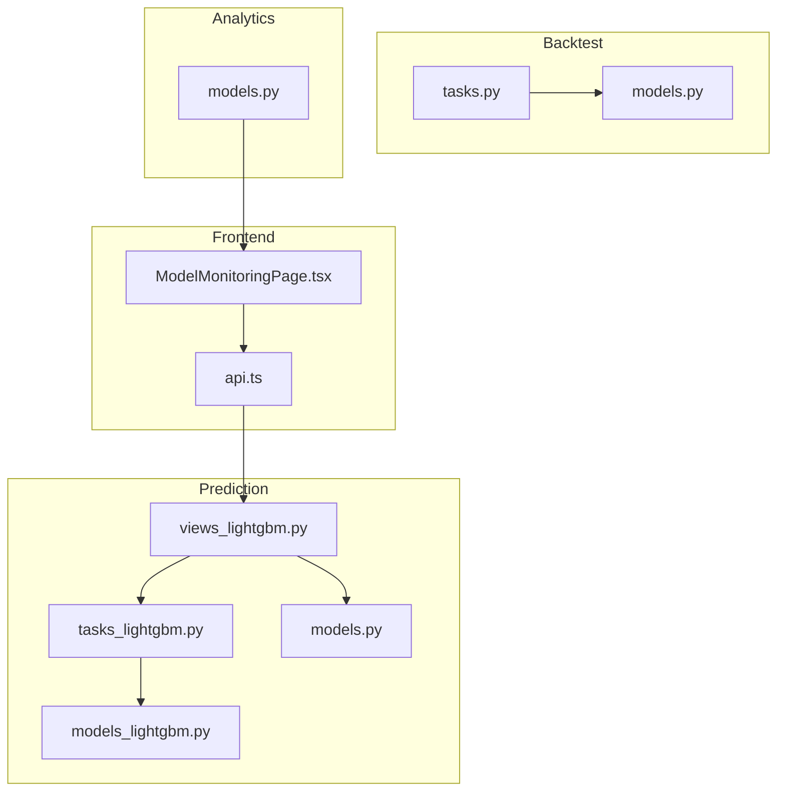
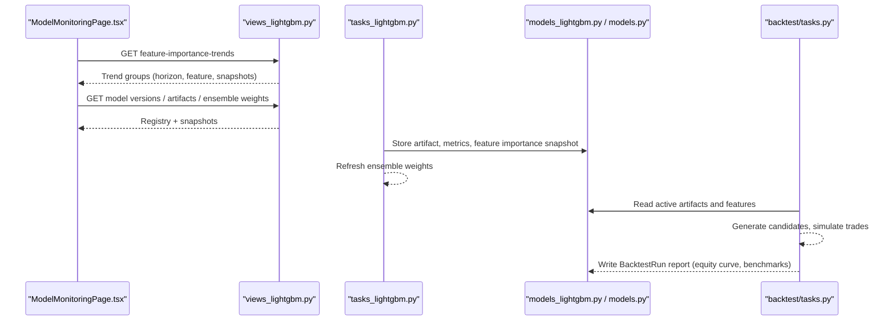
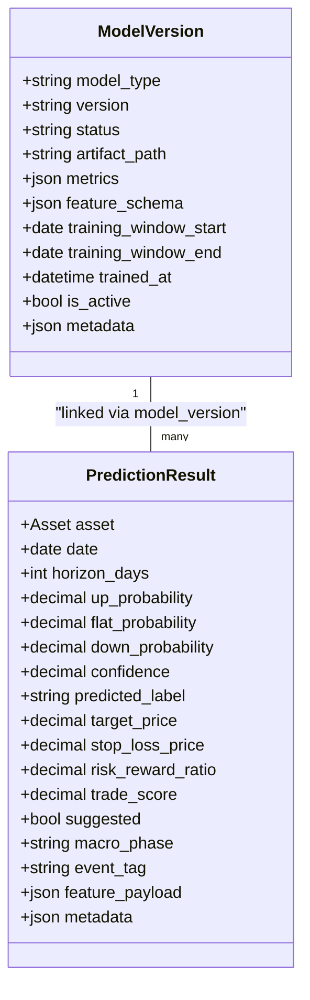
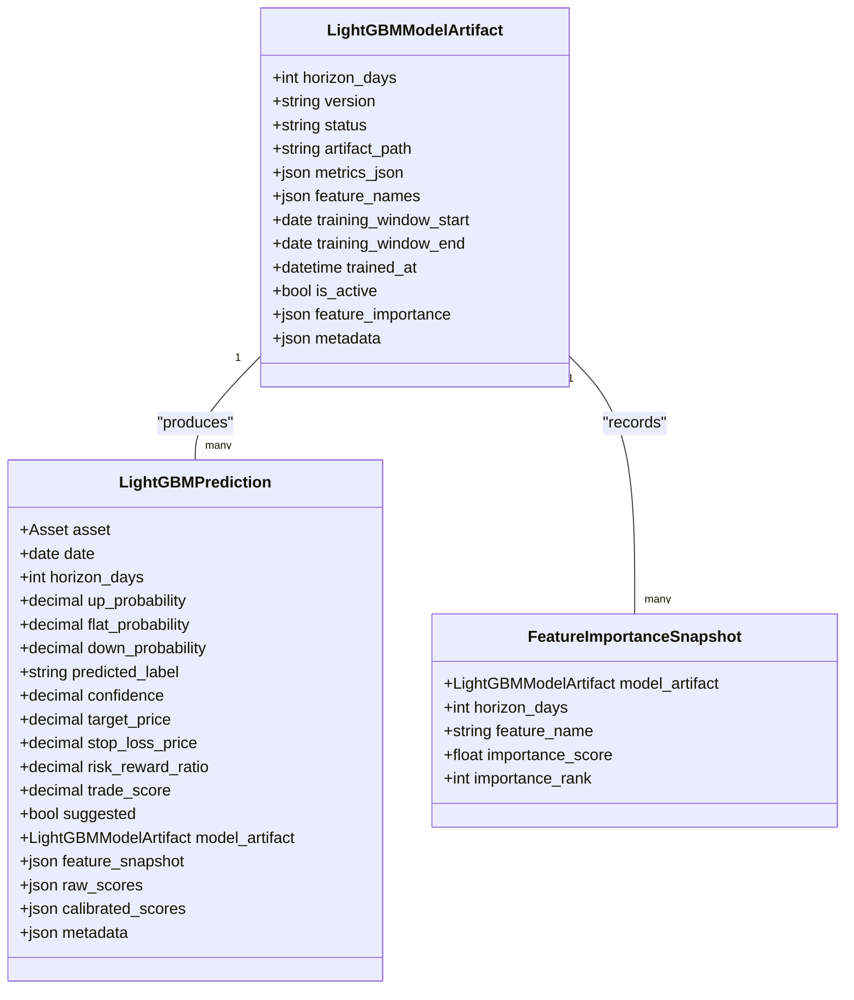
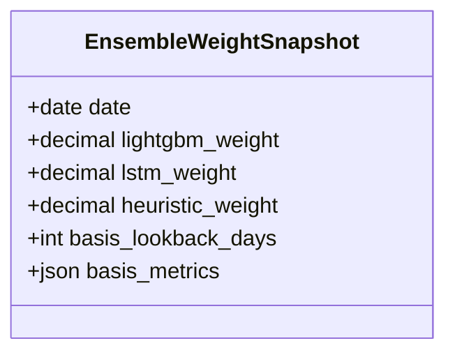
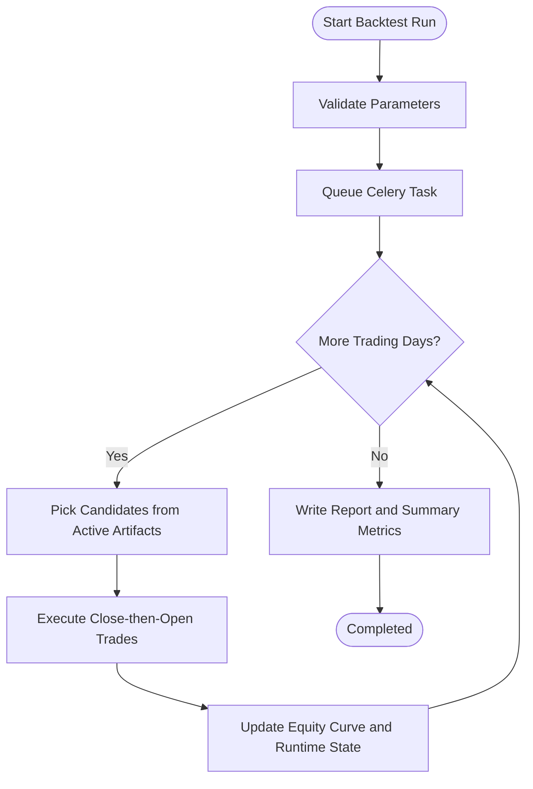
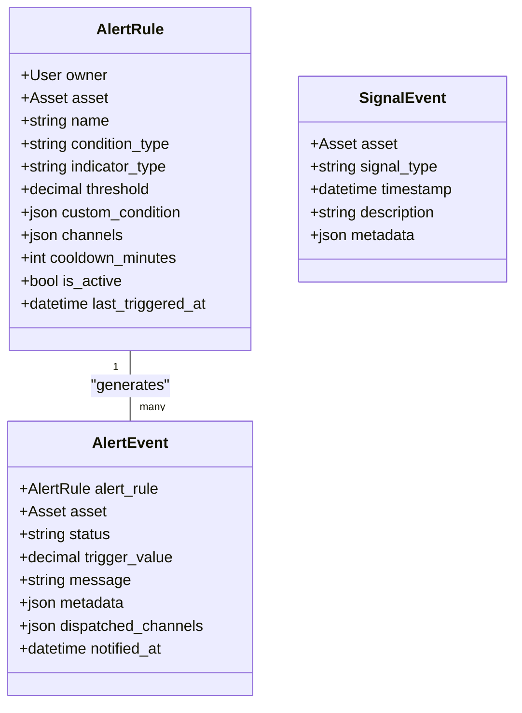
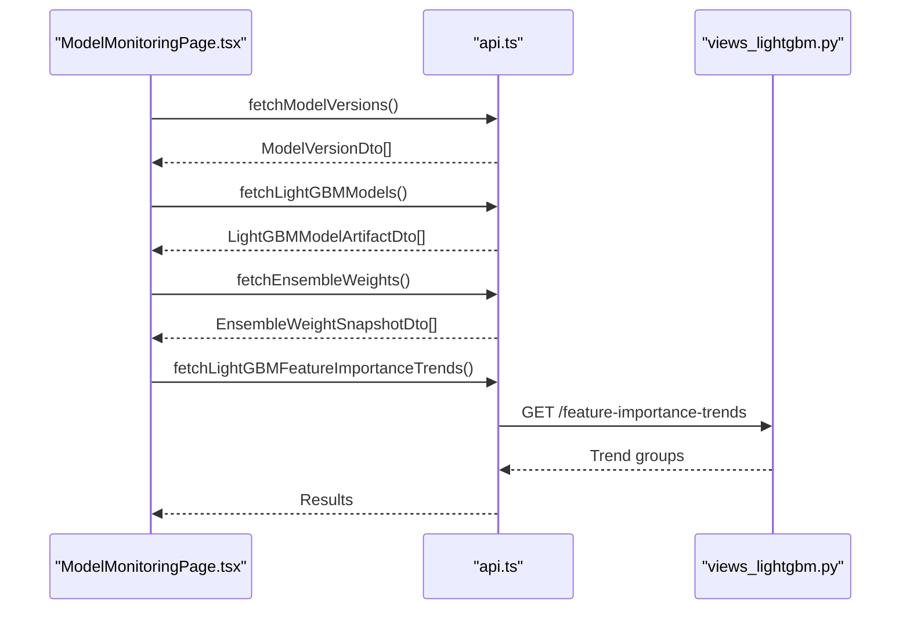
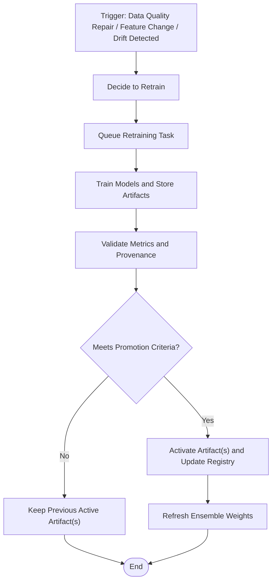
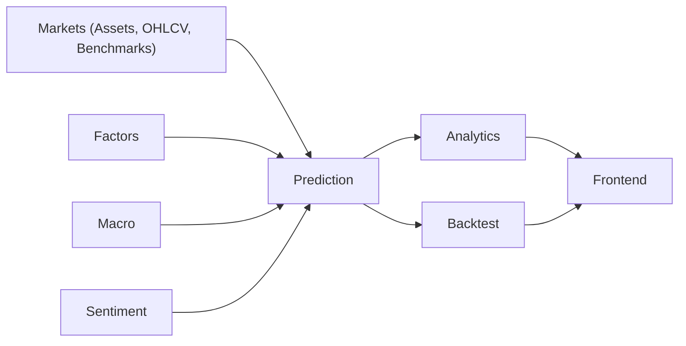

# Model Monitoring & Performance

<cite>
**Referenced Files in This Document**
- [apps/prediction/models.py](file://apps/prediction/models.py)
- [apps/prediction/models_lightgbm.py](file://apps/prediction/models_lightgbm.py)
- [apps/backtest/models.py](file://apps/backtest/models.py)
- [apps/analytics/models.py](file://apps/analytics/models.py)
- [apps/backtest/tasks.py](file://apps/backtest/tasks.py)
- [apps/prediction/views_lightgbm.py](file://apps/prediction/views_lightgbm.py)
- [apps/prediction/tasks_lightgbm.py](file://apps/prediction/tasks_lightgbm.py)
- [frontend/src/pages/ModelMonitoringPage.tsx](file://frontend/src/pages/ModelMonitoringPage.tsx)
- [frontend/src/lib/api.ts](file://frontend/src/lib/api.ts)
- [docs/reference/metrics.md](file://docs/reference/metrics.md)
- [TECHNICAL_GUIDE.md](file://TECHNICAL_GUIDE.md)
- [docs/how-to/retrain.md](file://docs/how-to/retrain.md)
- [apps/core/management/commands/validate_data_quality.py](file://apps/core/management/commands/validate_data_quality.py)
- [apps/markets/migrations/0011_remove_scheduled_model_retraining_tasks.py](file://apps/markets/migrations/0011_remove_scheduled_model_retraining_tasks.py)
</cite>

## Table of Contents
1. Introduction
2. Project Structure
3. Core Components
4. Architecture Overview
5. Detailed Component Analysis
6. Dependency Analysis
7. Performance Considerations
8. Troubleshooting Guide
9. Conclusion
10. Appendices

## Introduction
This document explains how the system monitors model performance, tracks accuracy and related metrics across horizons, detects degradation, supports alerting and retraining triggers, integrates backtesting for validation and benchmark comparisons, and provides feature importance tracking and explainability. It also includes guidance for dashboards, interpreting reports, investigating drift, and preparing compliance-ready artifacts.

## Project Structure
The monitoring and performance tracking system spans several Django apps and a React frontend:
- Prediction app stores model versions, predictions, ensemble weights, and LightGBM-specific artifacts and snapshots.
- Backtest app executes strategy simulations, writes equity curves, trade ledgers, and reports used for validation and benchmarking.
- Analytics app stores technical indicators, alerts, and signal events that feed dashboards and monitoring views.
- Frontend pages and API client surface model monitoring data to users.

**Diagram sources**
- [apps/prediction/views_lightgbm.py:49-79](file://apps/prediction/views_lightgbm.py#L49-L79)
- [apps/prediction/tasks_lightgbm.py:2062-2096](file://apps/prediction/tasks_lightgbm.py#L2062-L2096)
- [apps/prediction/models.py:7-31](file://apps/prediction/models.py#L7-L31)
- [apps/prediction/models_lightgbm.py:7-38](file://apps/prediction/models_lightgbm.py#L7-L38)
- [apps/backtest/tasks.py:1-37](file://apps/backtest/tasks.py#L1-L37)
- [apps/backtest/models.py:24-117](file://apps/backtest/models.py#L24-L117)
- [apps/analytics/models.py:8-42](file://apps/analytics/models.py#L8-L42)
- [frontend/src/pages/ModelMonitoringPage.tsx:27-71](file://frontend/src/pages/ModelMonitoringPage.tsx#L27-L71)
- [frontend/src/lib/api.ts:184-200](file://frontend/src/lib/api.ts#L184-L200)

**Section sources**
- [apps/prediction/models.py:7-31](file://apps/prediction/models.py#L7-L31)
- [apps/prediction/models_lightgbm.py:7-38](file://apps/prediction/models_lightgbm.py#L7-L38)
- [apps/backtest/models.py:24-117](file://apps/backtest/models.py#L24-L117)
- [apps/analytics/models.py:8-42](file://apps/analytics/models.py#L8-L42)
- [frontend/src/pages/ModelMonitoringPage.tsx:27-71](file://frontend/src/pages/ModelMonitoringPage.tsx#L27-L71)
- [frontend/src/lib/api.ts:184-200](file://frontend/src/lib/api.ts#L184-L200)

## Core Components
- Model registry and versioning: Tracks model type, status, artifact path, metrics, training windows, and active flags.
- Prediction storage: Stores per-asset probabilities, labels, confidence, trade-related fields, and macro context tags.
- LightGBM artifacts and snapshots: Stores trained artifacts, metrics JSON, feature names, and per-feature importance snapshots.
- Ensemble weight snapshots: Records time-varying weights and basis metrics used to blend models.
- Backtest runs and trades: Captures run parameters, lifecycle state, summary metrics, equity/benchmark curves, and detailed trade legs with signal provenance.
- Analytics signals and alerts: Technical indicators, alert rules/events, and signal events used by dashboards and monitoring.

Key responsibilities:
- Accuracy and related metrics are persisted in model registries and artifact metadata; horizon-specific results are tracked via separate records or JSON summaries.
- Feature importance is captured per artifact and horizon, enabling trend analysis and drift investigation.
- Backtests provide out-of-sample validation, benchmark comparisons, and performance attribution through trade-level signal payloads.

**Section sources**
- [apps/prediction/models.py:7-31](file://apps/prediction/models.py#L7-L31)
- [apps/prediction/models.py:43-97](file://apps/prediction/models.py#L43-L97)
- [apps/prediction/models_lightgbm.py:7-38](file://apps/prediction/models_lightgbm.py#L7-L38)
- [apps/prediction/models_lightgbm.py:41-94](file://apps/prediction/models_lightgbm.py#L41-L94)
- [apps/prediction/models_lightgbm.py:97-136](file://apps/prediction/models_lightgbm.py#L97-L136)
- [apps/backtest/models.py:24-117](file://apps/backtest/models.py#L24-L117)
- [apps/analytics/models.py:8-42](file://apps/analytics/models.py#L8-L42)

## Architecture Overview
The system separates training, inference, monitoring, and validation:
- Training pipelines produce artifacts and store metrics, feature schemas, and importance snapshots.
- Inference generates predictions stored alongside macro context and trade decision fields.
- Backtesting recomputes candidates at runtime using current artifacts and features, producing equity curves and benchmark comparisons.
- The frontend aggregates model versions, artifacts, ensemble weights, and feature trends into a monitoring dashboard.

**Diagram sources**
- [frontend/src/pages/ModelMonitoringPage.tsx:36-71](file://frontend/src/pages/ModelMonitoringPage.tsx#L36-L71)
- [apps/prediction/views_lightgbm.py:49-79](file://apps/prediction/views_lightgbm.py#L49-L79)
- [apps/prediction/tasks_lightgbm.py:2062-2096](file://apps/prediction/tasks_lightgbm.py#L2062-L2096)
- [apps/prediction/models_lightgbm.py:7-38](file://apps/prediction/models_lightgbm.py#L7-L38)
- [apps/prediction/models.py:7-31](file://apps/prediction/models.py#L7-L31)
- [apps/backtest/tasks.py:1-37](file://apps/backtest/tasks.py#L1-L37)

## Detailed Component Analysis

### Model Versioning and Metrics Storage
- ModelVersion captures model type, version, status, artifact path, metrics, feature schema, training window, and activity flag.
- PredictionResult stores per-asset, per-date, per-horizon probabilities, label, confidence, target price, stop loss, risk-reward ratio, trade score, suggestion flag, macro phase, event tag, and feature payload.
- These tables enable cross-horizon metric aggregation and auditability.

**Diagram sources**
- [apps/prediction/models.py:7-31](file://apps/prediction/models.py#L7-L31)
- [apps/prediction/models.py:43-97](file://apps/prediction/models.py#L43-L97)

**Section sources**
- [apps/prediction/models.py:7-31](file://apps/prediction/models.py#L7-L31)
- [apps/prediction/models.py:43-97](file://apps/prediction/models.py#L43-L97)

### LightGBM Artifacts, Predictions, and Feature Importance
- LightGBMModelArtifact stores horizon, version, status, artifact path, metrics JSON, feature names, training window, activity flag, top feature importance, and metadata.
- LightGBMPrediction mirrors prediction fields with additional raw/calibrated scores and feature snapshots for debugging.
- FeatureImportanceSnapshot records per-feature importance and rank per artifact and horizon, enabling trend analysis.

**Diagram sources**
- [apps/prediction/models_lightgbm.py:7-38](file://apps/prediction/models_lightgbm.py#L7-L38)
- [apps/prediction/models_lightgbm.py:41-94](file://apps/prediction/models_lightgbm.py#L41-L94)
- [apps/prediction/models_lightgbm.py:113-136](file://apps/prediction/models_lightgbm.py#L113-L136)

**Section sources**
- [apps/prediction/models_lightgbm.py:7-38](file://apps/prediction/models_lightgbm.py#L7-L38)
- [apps/prediction/models_lightgbm.py:41-94](file://apps/prediction/models_lightgbm.py#L41-L94)
- [apps/prediction/models_lightgbm.py:113-136](file://apps/prediction/models_lightgbm.py#L113-L136)

### Ensemble Weights and Basis Metrics
- EnsembleWeightSnapshot records daily weights for LightGBM, LSTM, and heuristic components along with basis lookback days and basis metrics (e.g., per-model accuracy over a rolling window).
- This enables retrospective analysis of model blending stability and performance attribution.

**Diagram sources**
- [apps/prediction/models_lightgbm.py:97-105](file://apps/prediction/models_lightgbm.py#L97-L105)

**Section sources**
- [apps/prediction/models_lightgbm.py:97-105](file://apps/prediction/models_lightgbm.py#L97-L105)

### Backtesting Integration and Benchmark Comparisons
- BacktestRun stores strategy type, lifecycle status, dates, capital, summary metrics (return, drawdown, Sharpe, win rate), parameters, report (equity curve, benchmark curve, runtime state), and control actions.
- BacktestTrade stores leg-level trades with signal payload capturing candidate ranking, thresholds, trade-decision levels, and model provenance.
- The backtest engine recomputes candidates at runtime from active artifacts and features, ensuring fair comparisons and avoiding leakage.

**Diagram sources**
- [apps/backtest/tasks.py:1-37](file://apps/backtest/tasks.py#L1-L37)
- [apps/backtest/models.py:24-117](file://apps/backtest/models.py#L24-L117)

**Section sources**
- [apps/backtest/models.py:24-117](file://apps/backtest/models.py#L24-L117)
- [apps/backtest/tasks.py:1-37](file://apps/backtest/tasks.py#L1-L37)

### Alerting Mechanisms and Signal Events
- AlertRule defines conditions on price or indicator thresholds, channels, cooldowns, and activation state.
- AlertEvent logs triggered events, statuses, messages, and dispatch details.
- SignalEvent stores technical signal events (e.g., golden crosses, Bollinger breakouts, momentum signals) used for monitoring and dashboards.

**Diagram sources**
- [apps/analytics/models.py:87-142](file://apps/analytics/models.py#L87-L142)
- [apps/analytics/models.py:148-192](file://apps/analytics/models.py#L148-L192)
- [apps/analytics/models.py:198-251](file://apps/analytics/models.py#L198-L251)

**Section sources**
- [apps/analytics/models.py:87-142](file://apps/analytics/models.py#L87-L142)
- [apps/analytics/models.py:148-192](file://apps/analytics/models.py#L148-L192)
- [apps/analytics/models.py:198-251](file://apps/analytics/models.py#L198-L251)

### Monitoring Dashboard and Data Flow
- ModelMonitoringPage fetches model versions, LightGBM artifacts, ensemble weights, and feature importance trends, then renders them in tables for quick inspection.
- The frontend API client exposes typed DTOs for model versions and artifacts, enabling consistent UI consumption.

**Diagram sources**
- [frontend/src/pages/ModelMonitoringPage.tsx:36-71](file://frontend/src/pages/ModelMonitoringPage.tsx#L36-L71)
- [frontend/src/lib/api.ts:184-200](file://frontend/src/lib/api.ts#L184-L200)
- [apps/prediction/views_lightgbm.py:49-79](file://apps/prediction/views_lightgbm.py#L49-L79)

**Section sources**
- [frontend/src/pages/ModelMonitoringPage.tsx:27-71](file://frontend/src/pages/ModelMonitoringPage.tsx#L27-L71)
- [frontend/src/lib/api.ts:184-200](file://frontend/src/lib/api.ts#L184-L200)
- [apps/prediction/views_lightgbm.py:49-79](file://apps/prediction/views_lightgbm.py#L49-L79)

### Retraining Triggers and Lifecycle Controls
- Retraining is deliberate and not scheduled by default; migration removes periodic tasks to avoid automatic retraining.
- Retraining can be queued via API endpoints, and successful runs refresh ensemble weights and update registry entries.
- Guidance emphasizes retraining when data quality repairs, feature contract changes, universe expansions, or validation backtests show drift.

**Diagram sources**
- [apps/markets/migrations/0011_remove_scheduled_model_retraining_tasks.py:1-42](file://apps/markets/migrations/0011_remove_scheduled_model_retraining_tasks.py#L1-L42)
- [apps/prediction/views_lightgbm.py:195-205](file://apps/prediction/views_lightgbm.py#L195-L205)
- [apps/prediction/tasks_lightgbm.py:2062-2096](file://apps/prediction/tasks_lightgbm.py#L2062-L2096)
- [docs/how-to/retrain.md:10-23](file://docs/how-to/retrain.md#L10-L23)

**Section sources**
- [apps/markets/migrations/0011_remove_scheduled_model_retraining_tasks.py:1-42](file://apps/markets/migrations/0011_remove_scheduled_model_retraining_tasks.py#L1-L42)
- [apps/prediction/views_lightgbm.py:195-205](file://apps/prediction/views_lightgbm.py#L195-L205)
- [apps/prediction/tasks_lightgbm.py:2062-2096](file://apps/prediction/tasks_lightgbm.py#L2062-L2096)
- [docs/how-to/retrain.md:10-23](file://docs/how-to/retrain.md#L10-L23)

## Dependency Analysis
- Prediction depends on markets assets, factors, macro context, and sentiment inputs to generate predictions and store them with macro phase and event tags.
- Backtest depends on active artifacts and features to compute candidates at runtime; it writes trades and reports consumed by dashboards and export tools.
- Analytics depends on technical indicators and signal events to power dashboards and alerting.
- Frontend depends on backend APIs to render monitoring views.

**Diagram sources**
- [apps/prediction/models.py:4-5](file://apps/prediction/models.py#L4-L5)
- [apps/backtest/tasks.py:54-68](file://apps/backtest/tasks.py#L54-L68)
- [apps/analytics/models.py:5-6](file://apps/analytics/models.py#L5-L6)
- [frontend/src/pages/ModelMonitoringPage.tsx:27-71](file://frontend/src/pages/ModelMonitoringPage.tsx#L27-L71)

**Section sources**
- [apps/prediction/models.py:4-5](file://apps/prediction/models.py#L4-L5)
- [apps/backtest/tasks.py:54-68](file://apps/backtest/tasks.py#L54-L68)
- [apps/analytics/models.py:5-6](file://apps/analytics/models.py#L5-L6)
- [frontend/src/pages/ModelMonitoringPage.tsx:27-71](file://frontend/src/pages/ModelMonitoringPage.tsx#L27-L71)

## Performance Considerations
- Backtest execution uses process-level caches bounded by environment variables to limit memory usage and improve throughput.
- Long runs are chunked and resumable via runtime state, allowing resilience to worker restarts and soft time limits.
- LightGBM runtime metrics capture inference backend and timing breakdowns to identify bottlenecks during backtests.
- Plausible accuracy bounds are narrow; implausibly high values indicate leakage and should halt promotion until resolved.

[No sources needed since this section provides general guidance]

## Troubleshooting Guide
- Data quality validation identifies continuity gaps and coverage issues in technical indicators and features; repaired findings may invalidate previous fits and require retraining.
- Missing-value contracts differ between LightGBM and LSTM; artifacts without expected keys silently degrade to legacy neutral fills, which can mask correctness problems.
- Backtest task health checks detect runs whose workers have disappeared; use pending control actions to pause, restart, or delete stuck runs.
- When investigating drift:
  - Compare ensemble weights and basis metrics over time.
  - Inspect feature importance trends per horizon and model artifact.
  - Review backtest equity curves and benchmark comparisons for divergence.
  - Check data quality reports for upstream provider blackouts or schema changes.

**Section sources**
- [apps/core/management/commands/validate_data_quality.py:1618-1637](file://apps/core/management/commands/validate_data_quality.py#L1618-L1637)
- [docs/how-to/retrain.md:163-176](file://docs/how-to/retrain.md#L163-L176)
- [apps/backtest/models.py:24-35](file://apps/backtest/models.py#L24-L35)
- [TECHNICAL_GUIDE.md:650-660](file://TECHNICAL_GUIDE.md#L650-L660)

## Conclusion
The system provides a robust foundation for model monitoring and performance tracking:
- Metrics and provenance are persisted at model and artifact levels, with horizon-specific tracking.
- Backtesting validates strategies against benchmarks and produces auditable trade-level evidence.
- Feature importance snapshots and ensemble weight histories support drift detection and explainability.
- Alerting and analytics surfaces enable operational visibility.
- Retraining is deliberate, guided by data quality and validation outcomes, with clear promotion and rollback paths.

[No sources needed since this section summarizes without analyzing specific files]

## Appendices

### Appendix A: Metrics Collection Across Horizons
- Horizon set: 3-day, 7-day, 30-day.
- Accuracy and related metrics are stored in model registries and artifact metadata; ensemble basis metrics aggregate recent performance for blending decisions.
- Use the monitoring page to compare accuracy across horizons and model versions.

**Section sources**
- [apps/prediction/models_lightgbm.py:7-38](file://apps/prediction/models_lightgbm.py#L7-L38)
- [apps/prediction/models_lightgbm.py:97-105](file://apps/prediction/models_lightgbm.py#L97-L105)
- [frontend/src/pages/ModelMonitoringPage.tsx:131-160](file://frontend/src/pages/ModelMonitoringPage.tsx#L131-L160)

### Appendix B: Backtesting and Benchmark Comparisons
- Backtest runs write equity curves and benchmark series; comparison endpoints allow overlaying multiple runs for analysis.
- Trade signal payloads capture why entries occurred, enabling performance attribution to models and strategies.

**Section sources**
- [apps/backtest/models.py:24-117](file://apps/backtest/models.py#L24-L117)
- [apps/backtest/tasks.py:1-37](file://apps/backtest/tasks.py#L1-L37)

### Appendix C: Regulatory Compliance Reporting
- Persisted artifacts include training windows, feature schemas, metrics, and metadata, providing an audit trail for promotions and rollbacks.
- Backtest reports and trade ledgers offer reproducible evidence for strategy evaluation and benchmark comparisons.
- Data quality reports document coverage and continuity, supporting compliance reviews of input integrity.

**Section sources**
- [apps/prediction/models.py:7-31](file://apps/prediction/models.py#L7-L31)
- [apps/backtest/models.py:24-117](file://apps/backtest/models.py#L24-L117)
- [docs/reference/metrics.md:140-188](file://docs/reference/metrics.md#L140-L188)