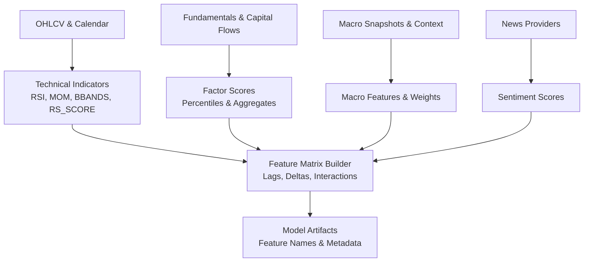
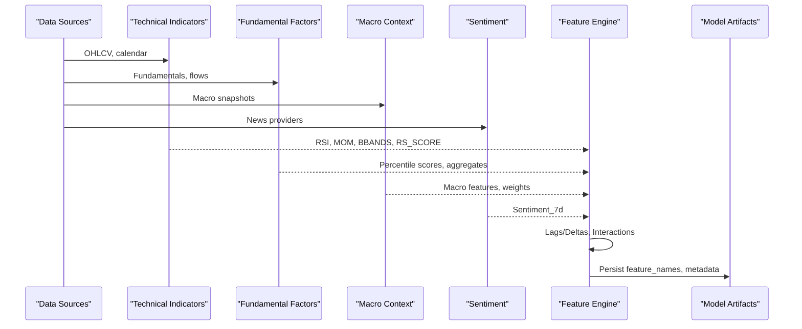
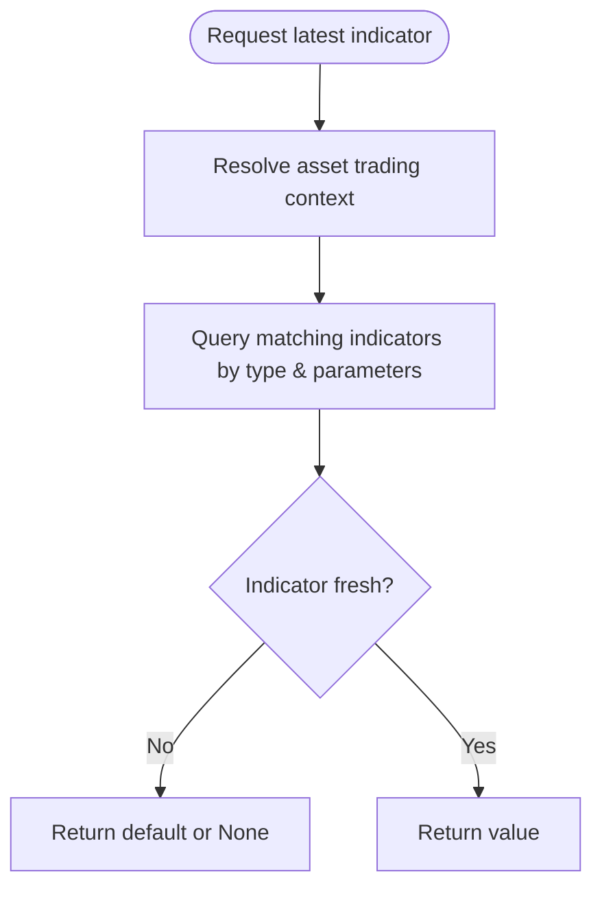
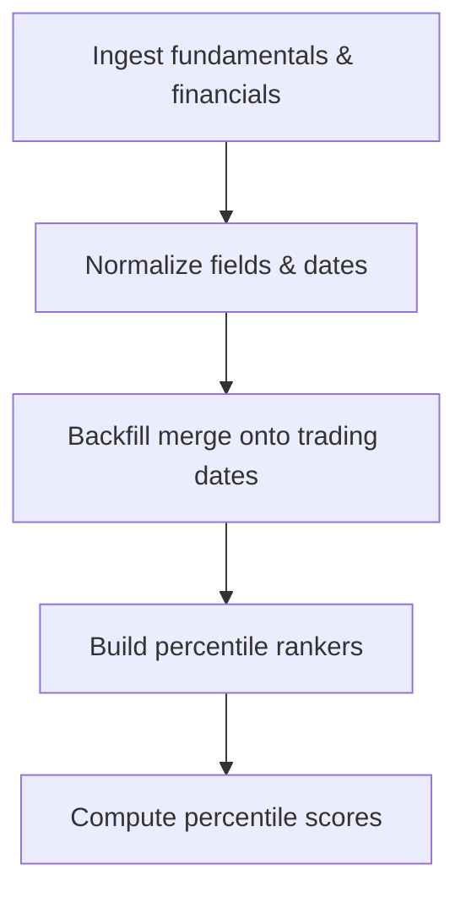
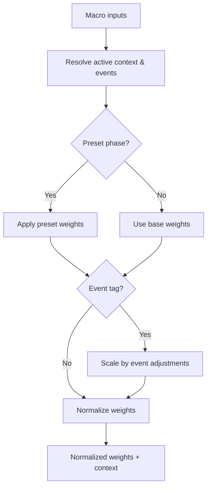
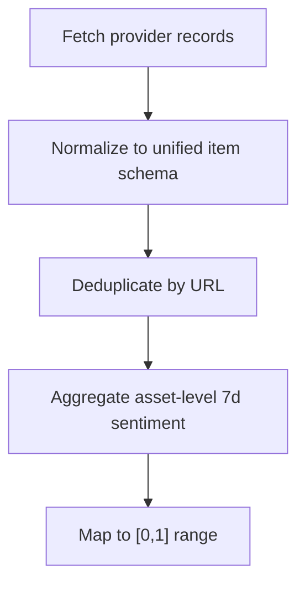
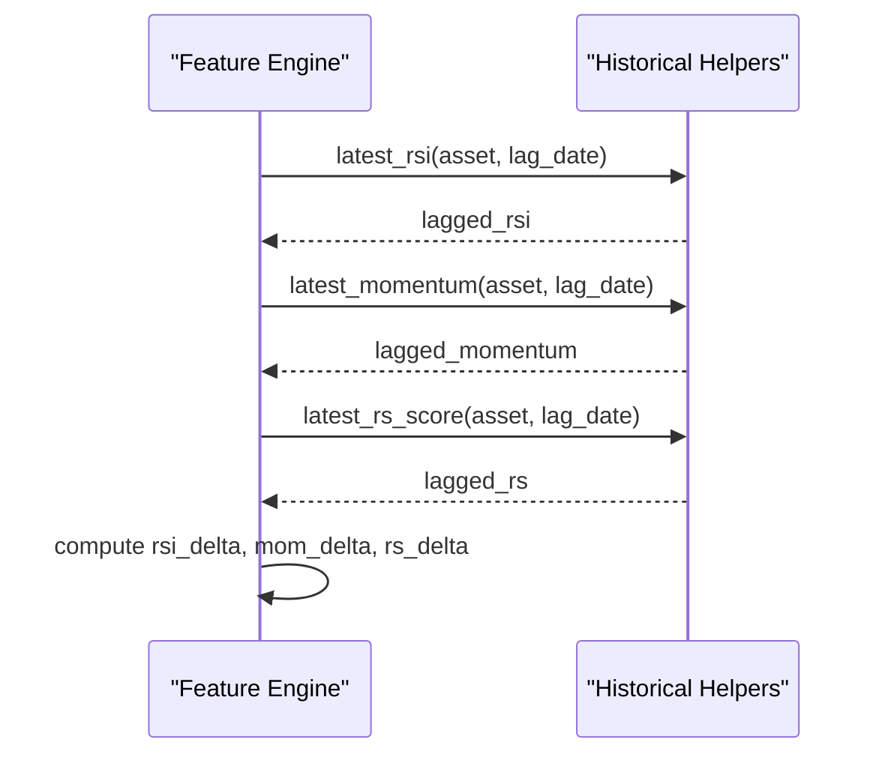
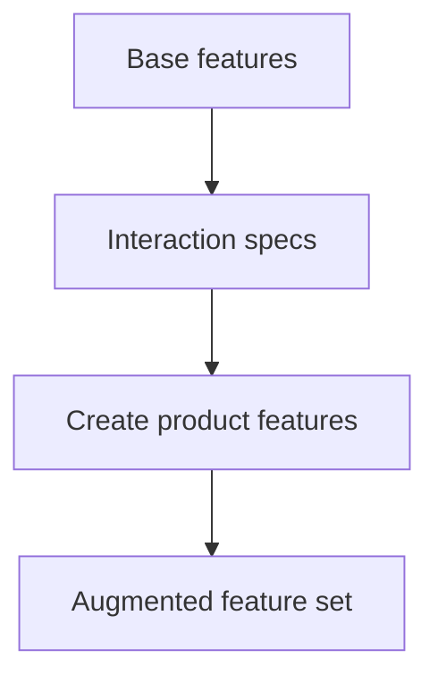
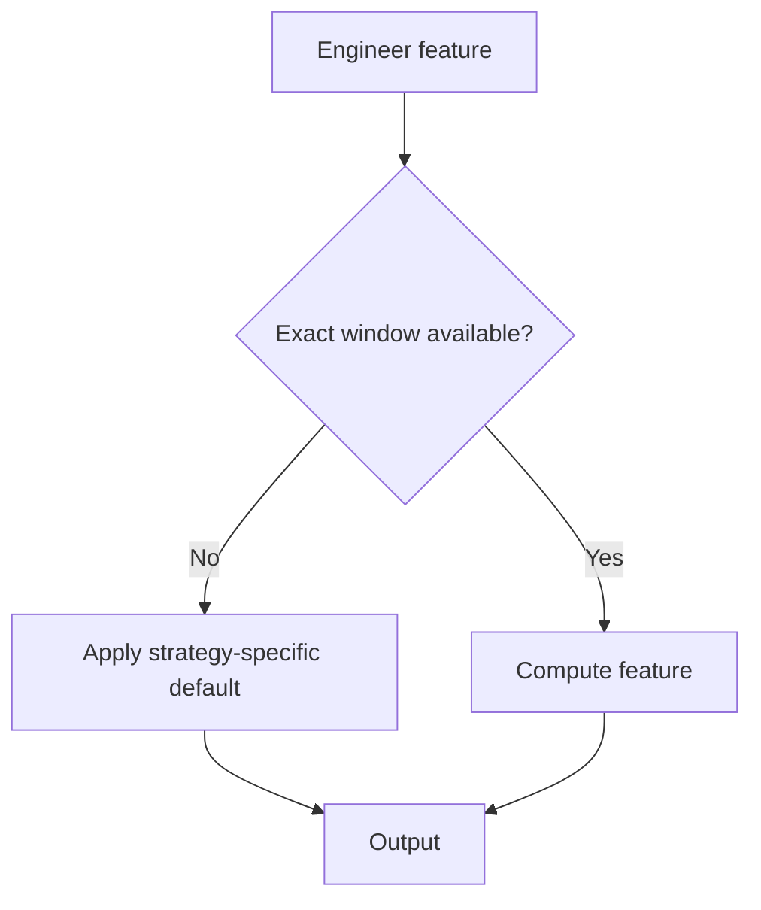
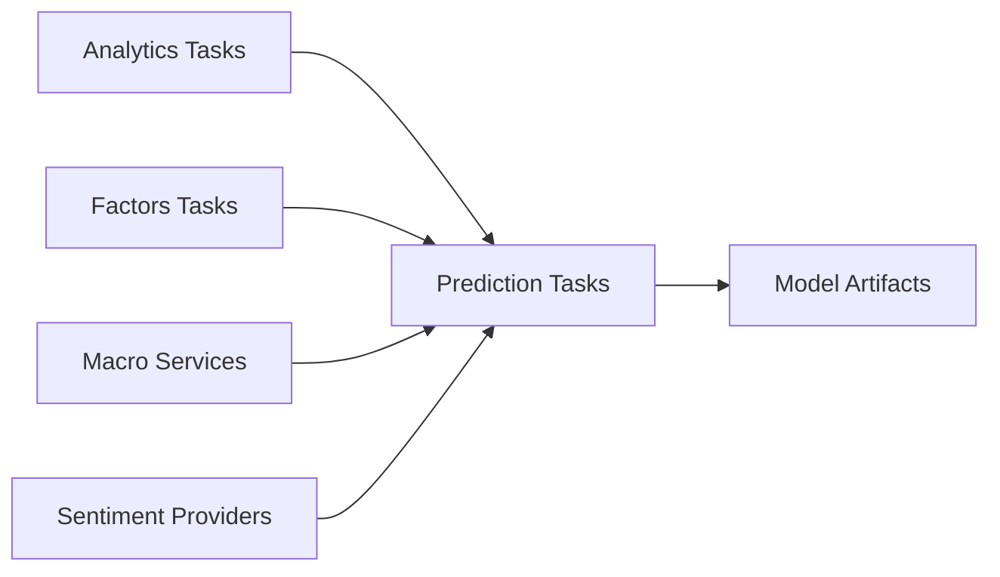

# Feature Engineering Pipeline

<cite>
**Referenced Files in This Document**
- [tasks_lightgbm.py](file://apps/prediction/tasks_lightgbm.py)
- [historical_features.py](file://apps/prediction/historical_features.py)
- [tasks.py](file://apps/factors/tasks.py)
- [fundamental_materialization.py](file://apps/factors/fundamental_materialization.py)
- [services.py](file://apps/macro/services.py)
- [providers.py](file://apps/sentiment/providers.py)
- [validate_data_quality.py](file://apps/core/management/commands/validate_data_quality.py)
- [metadata.json (30d 2024-12-31 core80 v1)](file://models/lightgbm/30d_lgb-30d-2024-12-31-core80-v1/metadata.json)
- [metadata.json (7d 2026-04-15)](file://models/lightgbm/7d_lgb-7d-2026-04-15/metadata.json)
- [metadata.json (3d 2024-12-31 stored-ti-v2)](file://models/lightgbm/3d_lgb-3d-2024-12-31-stored-ti-v2/metadata.json)
- [analytics_tasks.py](file://apps/analytics/tasks.py)
- [metrics.md](file://docs/reference/metrics.md)
</cite>

## Table of Contents
1. Introduction
2. Project Structure
3. Core Components
4. Architecture Overview
5. Detailed Component Analysis
6. Dependency Analysis
7. Performance Considerations
8. Troubleshooting Guide
9. Conclusion
10. Appendices

## Introduction
This document explains the feature engineering pipeline that constructs predictive features from multiple data sources: technical indicators, fundamental factors, macroeconomic context, and sentiment scores. It covers temporal alignment across frequencies, missing-data strategies, lagged and interaction features, normalization techniques, quality checks, and guidance for extending and optimizing the pipeline for large asset universes.

## Project Structure
The pipeline spans several apps:
- Technical indicators are computed and persisted by analytics tasks and accessed via historical feature helpers.
- Fundamental factors are materialized into daily snapshots and then ranked into percentile scores.
- Macroeconomic context is resolved to weights and features used for interactions.
- Sentiment scores are normalized and integrated into factor scoring and features.
- Prediction tasks assemble final feature matrices with lags, deltas, and interactions, apply missing-value handling, and persist model artifacts with metadata describing feature sets.

**Diagram sources**
- [analytics_tasks.py:600-800](file://apps/analytics/tasks.py#L600-L800)
- [tasks_lightgbm.py:380-408](file://apps/prediction/tasks_lightgbm.py#L380-L408)
- [tasks_lightgbm.py:770-813](file://apps/prediction/tasks_lightgbm.py#L770-L813)
- [tasks_lightgbm.py:926-963](file://apps/prediction/tasks_lightgbm.py#L926-L963)
- [tasks.py:316-345](file://apps/factors/tasks.py#L316-L345)
- [services.py:51-89](file://apps/macro/services.py#L51-L89)
- [providers.py:284-312](file://apps/sentiment/providers.py#L284-L312)

**Section sources**
- [analytics_tasks.py:600-800](file://apps/analytics/tasks.py#L600-L800)
- [tasks_lightgbm.py:380-408](file://apps/prediction/tasks_lightgbm.py#L380-L408)
- [tasks_lightgbm.py:770-813](file://apps/prediction/tasks_lightgbm.py#L770-L813)
- [tasks_lightgbm.py:926-963](file://apps/prediction/tasks_lightgbm.py#L926-L963)
- [tasks.py:316-345](file://apps/factors/tasks.py#L316-L345)
- [services.py:51-89](file://apps/macro/services.py#L51-L89)
- [providers.py:284-312](file://apps/sentiment/providers.py#L284-L312)

## Core Components
- Technical indicators: RSI, momentum (MOM), Bollinger Bands, relative strength score (RS_SCORE), returns, realized volatility, relative volume.
- Fundamental factors: PE, PB, ROE trend; capital flow metrics; composite and component scores.
- Macroeconomic context: PMI, yield curve, exchange rates; context-aware weights.
- Sentiment: Multi-provider news normalized to a unified schema; asset-level 7-day sentiment.
- Feature assembly: Lags and deltas across windows, interaction terms, missing-value handling, and normalization.

**Section sources**
- [historical_features.py:207-397](file://apps/prediction/historical_features.py#L207-L397)
- [tasks.py:316-345](file://apps/factors/tasks.py#L316-L345)
- [services.py:51-89](file://apps/macro/services.py#L51-L89)
- [providers.py:284-312](file://apps/sentiment/providers.py#L284-L312)
- [tasks_lightgbm.py:380-408](file://apps/prediction/tasks_lightgbm.py#L380-L408)
- [tasks_lightgbm.py:770-813](file://apps/prediction/tasks_lightgbm.py#L770-L813)
- [tasks_lightgbm.py:926-963](file://apps/prediction/tasks_lightgbm.py#L926-L963)

## Architecture Overview
The pipeline computes raw indicators and factor scores, then builds a unified feature matrix with engineered terms. Model artifacts store the exact feature names used at training time, ensuring consistent inference.

**Diagram sources**
- [analytics_tasks.py:600-800](file://apps/analytics/tasks.py#L600-L800)
- [tasks_lightgbm.py:380-408](file://apps/prediction/tasks_lightgbm.py#L380-L408)
- [tasks_lightgbm.py:770-813](file://apps/prediction/tasks_lightgbm.py#L770-L813)
- [tasks_lightgbm.py:926-963](file://apps/prediction/tasks_lightgbm.py#L926-L963)
- [tasks.py:316-345](file://apps/factors/tasks.py#L316-L345)
- [services.py:51-89](file://apps/macro/services.py#L51-L89)
- [providers.py:284-312](file://apps/sentiment/providers.py#L284-L312)

## Detailed Component Analysis

### Technical Indicators and Temporal Alignment
- Indicator retrieval uses parameter-aware lookups and staleness checks against the latest official trade date to ensure features are aligned to trading days and not stale.
- Functions provide latest values for RSI, momentum, Bollinger Bands, SMA, RS_SCORE, returns, relative volume, and realized volatility with safe defaults when data is missing or gaps exist.

**Diagram sources**
- [historical_features.py:36-48](file://apps/prediction/historical_features.py#L36-L48)
- [historical_features.py:86-139](file://apps/prediction/historical_features.py#L86-L139)
- [historical_features.py:142-179](file://apps/prediction/historical_features.py#L142-L179)
- [historical_features.py:207-397](file://apps/prediction/historical_features.py#L207-L397)

**Section sources**
- [historical_features.py:36-48](file://apps/prediction/historical_features.py#L36-L48)
- [historical_features.py:86-139](file://apps/prediction/historical_features.py#L86-L139)
- [historical_features.py:142-179](file://apps/prediction/historical_features.py#L142-L179)
- [historical_features.py:207-397](file://apps/prediction/historical_features.py#L207-L397)

### Fundamental Factors and Percentile Normalization
- Daily fundamentals and financial indicators are normalized and merged using point-in-time backfilling to produce per-trading-date snapshots.
- Percentile rankers convert raw metrics (PE, PB, ROE trend, capital flows) into [0,1] scores used in factor aggregation and modeling.

**Diagram sources**
- [fundamental_materialization.py:61-120](file://apps/factors/fundamental_materialization.py#L61-L120)
- [fundamental_materialization.py:123-190](file://apps/factors/fundamental_materialization.py#L123-L190)
- [tasks.py:40-69](file://apps/factors/tasks.py#L40-L69)
- [tasks.py:316-345](file://apps/factors/tasks.py#L316-L345)

**Section sources**
- [fundamental_materialization.py:61-120](file://apps/factors/fundamental_materialization.py#L61-L120)
- [fundamental_materialization.py:123-190](file://apps/factors/fundamental_materialization.py#L123-L190)
- [tasks.py:40-69](file://apps/factors/tasks.py#L40-L69)
- [tasks.py:316-345](file://apps/factors/tasks.py#L316-L345)

### Macroeconomic Context and Weight Resolution
- Macro context resolves active phase and optional event tags to adjust weighting between financial, flow, and technical components.
- Weights are normalized to sum to one and can be overridden explicitly or inferred from current market context.

**Diagram sources**
- [services.py:51-89](file://apps/macro/services.py#L51-L89)

**Section sources**
- [services.py:51-89](file://apps/macro/services.py#L51-L89)

### Sentiment Integration
- Multiple news providers are normalized to a common schema with deterministic synthetic URLs for deduplication.
- Asset-level 7-day sentiment scores are mapped into [0,1] and incorporated into factor scoring and features.

**Diagram sources**
- [providers.py:284-312](file://apps/sentiment/providers.py#L284-L312)
- [tasks.py:85-98](file://apps/factors/tasks.py#L85-L98)

**Section sources**
- [providers.py:284-312](file://apps/sentiment/providers.py#L284-L312)
- [tasks.py:85-98](file://apps/factors/tasks.py#L85-L98)

### Lagged Features and Delta Construction
- For each configured lag window (3, 5, 10 days), the pipeline retrieves lagged technical indicators and computes deltas relative to the current value.
- Missingness is handled either by preserving true missing values or by falling back to current values depending on the chosen strategy.

**Diagram sources**
- [tasks_lightgbm.py:770-813](file://apps/prediction/tasks_lightgbm.py#L770-L813)
- [historical_features.py:207-397](file://apps/prediction/historical_features.py#L207-L397)

**Section sources**
- [tasks_lightgbm.py:770-813](file://apps/prediction/tasks_lightgbm.py#L770-L813)
- [historical_features.py:207-397](file://apps/prediction/historical_features.py#L207-L397)

### Interaction Features
- Interaction terms multiply pairs of base features to capture regime-dependent effects (e.g., RSI × macro phase, factor composite × sentiment).
- Both DataFrame and single-asset paths create these interactions consistently.

**Diagram sources**
- [tasks_lightgbm.py:380-408](file://apps/prediction/tasks_lightgbm.py#L380-L408)

**Section sources**
- [tasks_lightgbm.py:380-408](file://apps/prediction/tasks_lightgbm.py#L380-L408)

### Missing Data Strategies and Defaults
- Two strategies are supported:
  - Legacy neutral fill: fills missing numeric features with neutral values (e.g., 0.5 for percentiles).
  - Native NaN: preserves NaN where appropriate for models that handle missingness natively.
- When exact trading windows are unavailable, engineered features like returns and relative volume fall back to sensible defaults (e.g., return=0, relative_volume=1, realized_volatility=0).

**Diagram sources**
- [tasks_lightgbm.py:163-167](file://apps/prediction/tasks_lightgbm.py#L163-L167)
- [tasks_lightgbm.py:411-434](file://apps/prediction/tasks_lightgbm.py#L411-L434)
- [tasks_lightgbm.py:926-963](file://apps/prediction/tasks_lightgbm.py#L926-L963)
- [tests_lightgbm.py:417-441](file://apps/prediction/tests_lightgbm.py#L417-L441)

**Section sources**
- [tasks_lightgbm.py:163-167](file://apps/prediction/tasks_lightgbm.py#L163-L167)
- [tasks_lightgbm.py:411-434](file://apps/prediction/tasks_lightgbm.py#L411-L434)
- [tasks_lightgbm.py:926-963](file://apps/prediction/tasks_lightgbm.py#L926-L963)
- [tests_lightgbm.py:417-441](file://apps/prediction/tests_lightgbm.py#L417-L441)

### Normalization Techniques
- Percentile ranking converts raw fundamentals and flows into standardized [0,1] scores.
- Sentiment scores are linearly mapped from [-1,1] to [0,1].
- Macro weights are normalized to sum to one after applying presets and event adjustments.

**Section sources**
- [tasks.py:40-69](file://apps/factors/tasks.py#L40-L69)
- [tasks.py:85-98](file://apps/factors/tasks.py#L85-L98)
- [services.py:44-89](file://apps/macro/services.py#L44-L89)

### Quality Checks and Coverage Monitoring
- Validation commands define expected field sets for factors, fundamentals, macro, and sentiment, and track coverage and null issues.
- Metrics documentation reports non-null coverage for key tables and fields to detect upstream provider blackouts or ingestion failures.

**Section sources**
- [validate_data_quality.py:156-198](file://apps/core/management/commands/validate_data_quality.py#L156-L198)
- [validate_data_quality.py:224-247](file://apps/core/management/commands/validate_data_quality.py#L224-L247)
- [validate_data_quality.py:2807-2820](file://apps/core/management/commands/validate_data_quality.py#L2807-L2820)
- [metrics.md:140-188](file://docs/reference/metrics.md#L140-L188)

## Dependency Analysis
Key dependencies and relationships:
- Prediction tasks depend on analytics indicators, factors, macro, and sentiment modules to build features.
- Historical feature helpers encapsulate indicator freshness and parameter matching logic used across pipelines.
- Model artifacts record the exact feature names used during training, enabling consistent inference and pruning decisions.

**Diagram sources**
- [tasks_lightgbm.py:26-51](file://apps/prediction/tasks_lightgbm.py#L26-L51)
- [tasks_lightgbm.py:380-408](file://apps/prediction/tasks_lightgbm.py#L380-L408)
- [tasks_lightgbm.py:770-813](file://apps/prediction/tasks_lightgbm.py#L770-L813)
- [tasks_lightgbm.py:926-963](file://apps/prediction/tasks_lightgbm.py#L926-L963)

**Section sources**
- [tasks_lightgbm.py:26-51](file://apps/prediction/tasks_lightgbm.py#L26-L51)
- [tasks_lightgbm.py:380-408](file://apps/prediction/tasks_lightgbm.py#L380-L408)
- [tasks_lightgbm.py:770-813](file://apps/prediction/tasks_lightgbm.py#L770-L813)
- [tasks_lightgbm.py:926-963](file://apps/prediction/tasks_lightgbm.py#L926-L963)

## Performance Considerations
- Batch processing: Use chunking for asset IDs when building feature matrices to control memory usage.
- Caching: Leverage runtime caches for historical lookups and model artifacts to reduce repeated DB calls and model loads.
- Indicator freshness: Staleness checks avoid recomputation and ensure only valid windows contribute to features.
- Vectorization: Prefer pandas/numpy operations for batch computations over per-row loops.
- Pruning: Use cumulative importance thresholds to retain a compact, high-signal feature set for faster training and inference.

[No sources needed since this section provides general guidance]

## Troubleshooting Guide
Common issues and remedies:
- Stale or missing indicators: Verify indicator freshness and parameter matches; check if exact trading windows are available for lag/delta computation.
- Unexpected defaults: Confirm missing-value strategy and whether preserve_missing is enabled; inspect fallback behavior for gappy histories.
- Low coverage: Review validation metrics for non-null counts and identify provider blackouts or ingestion gaps.
- Feature mismatch: Ensure inference uses the same feature names recorded in model artifact metadata; update aliases if renaming features.

**Section sources**
- [historical_features.py:86-139](file://apps/prediction/historical_features.py#L86-L139)
- [tasks_lightgbm.py:411-434](file://apps/prediction/tasks_lightgbm.py#L411-L434)
- [validate_data_quality.py:2807-2820](file://apps/core/management/commands/validate_data_quality.py#L2807-L2820)
- [metadata.json (30d 2024-12-31 core80 v1):49-135](file://models/lightgbm/30d_lgb-30d-2024-12-31-core80-v1/metadata.json#L49-L135)

## Conclusion
The feature engineering pipeline integrates technical, fundamental, macro, and sentiment signals into a robust, lagged, and interactive feature set with explicit missing-data handling and quality controls. Model artifacts document the exact feature set used for training, enabling reproducible inference and continuous monitoring. Extending the pipeline involves adding new indicators or factors, defining interactions, and updating missing-value strategies while maintaining temporal alignment and freshness checks.

[No sources needed since this section summarizes without analyzing specific files]

## Appendices

### Adding New Features
Steps:
- Define or compute the base feature (technical indicator, fundamental metric, macro series, or sentiment aggregate).
- Add it to the feature assembly path (DataFrame or single-asset builder).
- If needed, add interaction specs to include cross-feature products.
- Update missing-value handling and defaults for edge cases.
- Validate coverage and test with both legacy and native-NaN strategies.
- Retrain or re-prune models and verify artifact metadata includes the new feature name.

**Section sources**
- [tasks_lightgbm.py:380-408](file://apps/prediction/tasks_lightgbm.py#L380-L408)
- [tasks_lightgbm.py:770-813](file://apps/prediction/tasks_lightgbm.py#L770-L813)
- [tasks_lightgbm.py:926-963](file://apps/prediction/tasks_lightgbm.py#L926-L963)
- [metadata.json (7d 2026-04-15):1-45](file://models/lightgbm/7d_lgb-7d-2026-04-15/metadata.json#L1-L45)
- [metadata.json (3d 2024-12-31 stored-ti-v2):1-49](file://models/lightgbm/3d_lgb-3d-2024-12-31-stored-ti-v2/metadata.json#L1-L49)

### Debugging Feature Computation Issues
- Inspect indicator freshness and parameter compatibility for lookups.
- Check exact trading window availability for lag/delta features.
- Validate defaults applied under missing data or gappy histories.
- Cross-check feature names against model artifact metadata to avoid mismatches.

**Section sources**
- [historical_features.py:86-139](file://apps/prediction/historical_features.py#L86-L139)
- [tasks_lightgbm.py:411-434](file://apps/prediction/tasks_lightgbm.py#L411-L434)
- [metadata.json (30d 2024-12-31 core80 v1):49-135](file://models/lightgbm/30d_lgb-30d-2024-12-31-core80-v1/metadata.json#L49-L135)

### Optimizing Feature Extraction for Large Universes
- Chunk assets when building matrices and use caching for historical lookups.
- Reuse model artifacts via an in-process cache to avoid reload overhead.
- Limit lookback windows to necessary ranges and prune low-importance features based on cumulative importance thresholds.
- Monitor coverage and staleness to prevent unnecessary recomputation.

**Section sources**
- [tasks_lightgbm.py:121-156](file://apps/prediction/tasks_lightgbm.py#L121-L156)
- [tasks_lightgbm.py:380-408](file://apps/prediction/tasks_lightgbm.py#L380-L408)
- [metadata.json (30d 2024-12-31 core80 v1):49-135](file://models/lightgbm/30d_lgb-30d-2024-12-31-core80-v1/metadata.json#L49-L135)