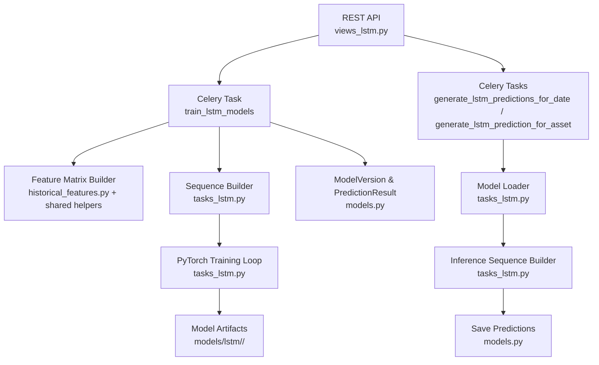
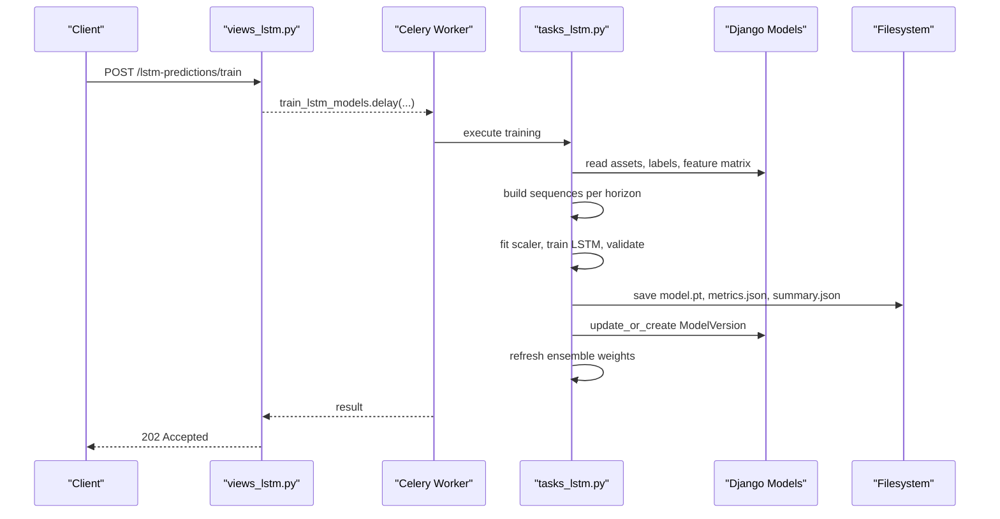
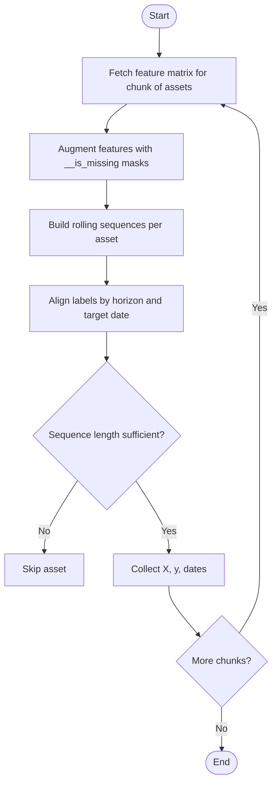
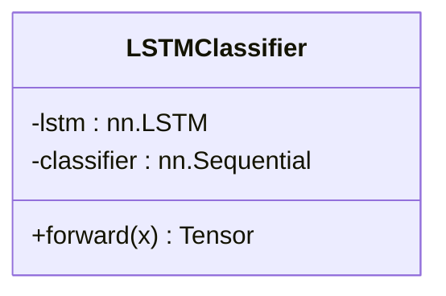
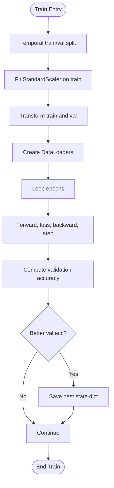
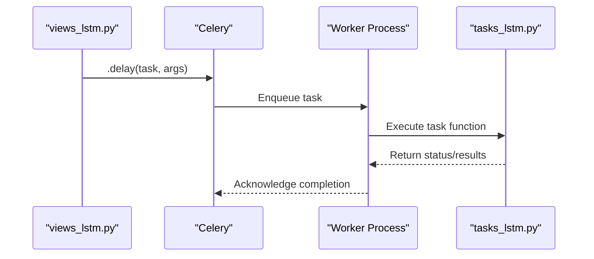
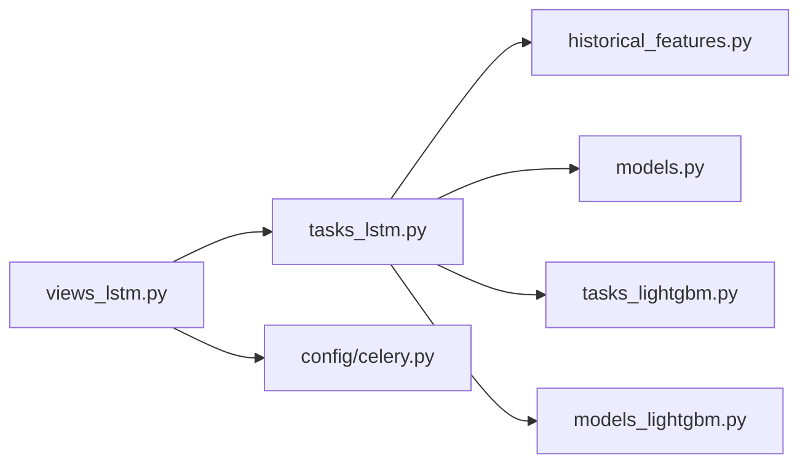

# LSTM Model Training

<cite>
**Referenced Files in This Document**
- [tasks_lstm.py](file://apps/prediction/tasks_lstm.py)
- [views_lstm.py](file://apps/prediction/views_lstm.py)
- [models.py](file://apps/prediction/models.py)
- [celery.py](file://config/celery.py)
- [tasks_lightgbm.py](file://apps/prediction/tasks_lightgbm.py)
- [models_lightgbm.py](file://apps/prediction/models_lightgbm.py)
- [historical_features.py](file://apps/prediction/historical_features.py)
- [TECHNICAL_GUIDE.md](file://TECHNICAL_GUIDE.md)
- [models.md](file://docs/reference/models.md)
</cite>

## Table of Contents
1. [Introduction](#introduction)
2. [Project Structure](#project-structure)
3. [Core Components](#core-components)
4. [Architecture Overview](#architecture-overview)
5. [Detailed Component Analysis](#detailed-component-analysis)
6. [Dependency Analysis](#dependency-analysis)
7. [Performance Considerations](#performance-considerations)
8. [Troubleshooting Guide](#troubleshooting-guide)
9. [Conclusion](#conclusion)
10. [Appendices](#appendices)

## Introduction
This document explains the end-to-end LSTM model training workflow used for multi-horizon directional forecasting (UP/FLAT/DOWN). It covers how historical OHLCV and derived features are transformed into time series sequences, how the PyTorch-based LSTM is trained with temporal validation splits, how Celery schedules batch training and inference tasks, how memory is managed during large dataset processing, and how artifacts are checkpointed and integrated into the broader ensemble prediction pipeline. It also provides guidance on hyperparameter configuration, handling variable-length sequences, interpreting training loss curves and convergence behavior, and monitoring performance through ensemble weights and metrics.

## Project Structure
The LSTM training and inference live primarily under the prediction app:
- Task orchestration and training logic: `apps/prediction/tasks_lstm.py`
- REST endpoints to trigger training and retrieve predictions: `apps/prediction/views_lstm.py`
- Persistent registries for model versions and prediction results: `apps/prediction/models.py`
- Celery application wiring: `config/celery.py`
- Shared feature extraction utilities used by both LightGBM and LSTM: `apps/prediction/historical_features.py`
- Ensemble weighting integration with LightGBM: `apps/prediction/tasks_lightgbm.py`, `apps/prediction/models_lightgbm.py`
- Reference documentation and artifact registry summaries: `TECHNICAL_GUIDE.md`, `docs/reference/models.md`

**Diagram sources**
- [views_lstm.py:19-171](file://apps/prediction/views_lstm.py#L19-L171)
- [tasks_lstm.py:592-826](file://apps/prediction/tasks_lstm.py#L592-L826)
- [tasks_lstm.py:829-967](file://apps/prediction/tasks_lstm.py#L829-L967)
- [models.py:7-107](file://apps/prediction/models.py#L7-L107)
- [historical_features.py:1-397](file://apps/prediction/historical_features.py#L1-L397)

**Section sources**
- [views_lstm.py:19-171](file://apps/prediction/views_lstm.py#L19-L171)
- [tasks_lstm.py:592-826](file://apps/prediction/tasks_lstm.py#L592-L826)
- [tasks_lstm.py:829-967](file://apps/prediction/tasks_lstm.py#L829-L967)
- [models.py:7-107](file://apps/prediction/models.py#L7-L107)
- [historical_features.py:1-397](file://apps/prediction/historical_features.py#L1-L397)

## Core Components
- LSTMClassifier: A PyTorch module that stacks an LSTM layer followed by a small MLP classifier head producing class logits for UP/FLAT/DOWN.
- Sequence builder: Converts per-asset feature matrices into fixed-length rolling sequences aligned to labels for each horizon.
- Scaler: Per-feature StandardScaler fitted on training sequences and applied consistently to train/validation/inference.
- Trainer: Temporal 80/20 split, Adam optimizer, cross-entropy loss, best-validation checkpoint selection, and artifact persistence.
- Task orchestrator: Celery tasks to train models and generate predictions across horizons and assets.
- Registry: ModelVersion tracks active model artifacts; PredictionResult stores per-asset, per-date, per-horizon outputs.

**Section sources**
- [tasks_lstm.py:41-62](file://apps/prediction/tasks_lstm.py#L41-L62)
- [tasks_lstm.py:109-156](file://apps/prediction/tasks_lstm.py#L109-L156)
- [tasks_lstm.py:473-589](file://apps/prediction/tasks_lstm.py#L473-L589)
- [tasks_lstm.py:592-826](file://apps/prediction/tasks_lstm.py#L592-L826)
- [models.py:7-107](file://apps/prediction/models.py#L7-L107)

## Architecture Overview
The system supports two primary flows: training and inference.

Training flow:
- REST endpoint triggers a Celery task to build features, construct sequences, train per-horizon LSTM models, save artifacts, update ModelVersion, and refresh ensemble weights.

Inference flow:
- REST endpoint triggers Celery tasks to load the active LSTM model version, build sequences from recent features, run inference, compute trade decisions, and persist PredictionResult rows.

**Diagram sources**
- [views_lstm.py:93-106](file://apps/prediction/views_lstm.py#L93-L106)
- [tasks_lstm.py:592-826](file://apps/prediction/tasks_lstm.py#L592-L826)
- [models.py:7-31](file://apps/prediction/models.py#L7-L31)

**Section sources**
- [views_lstm.py:93-106](file://apps/prediction/views_lstm.py#L93-L106)
- [tasks_lstm.py:592-826](file://apps/prediction/tasks_lstm.py#L592-L826)

## Detailed Component Analysis

### Data Preparation: From OHLCV to Sequences
- Feature matrix construction uses shared utilities that pull technical indicators, factor scores, sentiment, and OHLCV-derived features. Missing values are handled via native NaN or mask-and-zero imputation depending on strategy.
- For LSTM, each base feature is augmented with a missingness indicator column, effectively doubling the input dimensionality compared to non-masked strategies.
- Sequences are built per asset by sliding a fixed window over sorted dates. Only samples with valid labels at the target date are included. Variable-length histories shorter than the sequence length are skipped.

**Diagram sources**
- [tasks_lstm.py:96-141](file://apps/prediction/tasks_lstm.py#L96-L141)
- [historical_features.py:1-397](file://apps/prediction/historical_features.py#L1-L397)

**Section sources**
- [tasks_lstm.py:96-141](file://apps/prediction/tasks_lstm.py#L96-L141)
- [historical_features.py:1-397](file://apps/prediction/historical_features.py#L1-L397)

### Model Architecture Configuration
- The LSTMClassifier consists of:
  - An LSTM layer with configurable hidden size, number of layers, dropout, and batch-first input.
  - A classifier head with linear layers, ReLU activation, dropout, and final output to three classes (DOWN, FLAT, UP).
- Input size equals the number of features after augmentation. Output is logits for cross-entropy classification.

**Diagram sources**
- [tasks_lstm.py:41-62](file://apps/prediction/tasks_lstm.py#L41-L62)

**Section sources**
- [tasks_lstm.py:41-62](file://apps/prediction/tasks_lstm.py#L41-L62)

### PyTorch-Based Training Pipeline
- Data splitting: Temporal 80/20 split based on sorted sample dates to avoid leakage.
- Scaling: StandardScaler fitted on training sequences only; applied to validation and inference with safe handling of infinities and NaNs.
- Optimization: Adam optimizer with cross-entropy loss; fixed epoch count; best validation accuracy checkpoint saved.
- Device selection: Automatically uses CUDA if available, otherwise CPU.
- Artifact persistence: Saves state dict, scaler parameters, feature names, sequence length, architecture metadata, and metrics per horizon.

**Diagram sources**
- [tasks_lstm.py:473-589](file://apps/prediction/tasks_lstm.py#L473-L589)

**Section sources**
- [tasks_lstm.py:473-589](file://apps/prediction/tasks_lstm.py#L473-L589)

### Validation Strategies for Time Series Forecasting
- Temporal split ensures no future data leaks into training.
- Best validation accuracy checkpoint prevents overfitting by selecting the most generalizable weights.
- Metrics include per-horizon accuracy and aggregate accuracy across horizons.

**Section sources**
- [tasks_lstm.py:491-555](file://apps/prediction/tasks_lstm.py#L491-L555)
- [TECHNICAL_GUIDE.md:423-429](file://TECHNICAL_GUIDE.md#L423-L429)

### Task Scheduling with Celery
- Celery app is configured to discover Django tasks automatically.
- Training and inference tasks are registered and executed asynchronously:
  - `train_lstm_models`: Orchestrates full retraining across horizons.
  - `generate_lstm_predictions_for_date`: Generates predictions for all assets on a given date.
  - `generate_lstm_prediction_for_asset`: Generates predictions for a single asset.

**Diagram sources**
- [celery.py:1-17](file://config/celery.py#L1-L17)
- [views_lstm.py:93-117](file://apps/prediction/views_lstm.py#L93-L117)
- [tasks_lstm.py:592-826](file://apps/prediction/tasks_lstm.py#L592-L826)
- [tasks_lstm.py:829-967](file://apps/prediction/tasks_lstm.py#L829-L967)

**Section sources**
- [celery.py:1-17](file://config/celery.py#L1-L17)
- [views_lstm.py:93-117](file://apps/prediction/views_lstm.py#L93-L117)
- [tasks_lstm.py:592-826](file://apps/prediction/tasks_lstm.py#L592-L826)
- [tasks_lstm.py:829-967](file://apps/prediction/tasks_lstm.py#L829-L967)

### Batch Processing for Large Datasets
- Asset chunking: Features are fetched in chunks to control memory usage.
- Sample capping: Each horizon caps the number of sequences collected to bound memory and training time.
- Buffered accumulation: Sequences are buffered per horizon and concatenated before training.

**Section sources**
- [tasks_lstm.py:649-700](file://apps/prediction/tasks_lstm.py#L649-L700)
- [tasks_lstm.py:717-741](file://apps/prediction/tasks_lstm.py#L717-L741)

### Memory Management During Training
- Chunked feature extraction reduces peak memory.
- Sequence building iterates per asset and discards intermediate frames.
- Scaler fitting operates on flattened arrays but is bounded by capped samples.
- Inference caches feature frames and asset IDs to avoid redundant queries.

**Section sources**
- [tasks_lstm.py:144-156](file://apps/prediction/tasks_lstm.py#L144-L156)
- [tasks_lstm.py:171-231](file://apps/prediction/tasks_lstm.py#L171-L231)
- [TECHNICAL_GUIDE.md:428-429](file://TECHNICAL_GUIDE.md#L428-L429)

### Model Checkpointing Mechanisms
- Artifacts are saved per horizon under `models/lstm/<version>/<horizon>d_model.pt`.
- Metadata includes feature names, sequence length, architecture hyperparameters, scaler parameters, and missing value strategy.
- Summary JSON aggregates results across horizons and records training window and version tag.
- Active ModelVersion is updated and previous active versions are deactivated.

**Section sources**
- [tasks_lstm.py:444-470](file://apps/prediction/tasks_lstm.py#L444-L470)
- [tasks_lstm.py:746-804](file://apps/prediction/tasks_lstm.py#L746-L804)
- [models.md:109-117](file://docs/reference/models.md#L109-L117)

### Integration with Broader Prediction Pipeline
- After training, ensemble weights are refreshed using current LightGBM artifacts and LSTM metrics.
- Weights are computed over a lookback window and stored as snapshots for monitoring.
- Inference integrates trade decision estimation and persists results with rich metadata.

**Section sources**
- [tasks_lstm.py:806-817](file://apps/prediction/tasks_lstm.py#L806-L817)
- [tasks_lightgbm.py:668-694](file://apps/prediction/tasks_lightgbm.py#L668-L694)
- [models_lightgbm.py:97-114](file://apps/prediction/models_lightgbm.py#L97-L114)
- [models.md:66-75](file://docs/reference/models.md#L66-L75)

### Ensemble Weighting with Other Models
- Ensemble combines LightGBM, LSTM, and heuristic baselines.
- Weights are proportional to recent accuracies and quantized to four decimals.
- Fallback weights approximate equal distribution when accurate metrics are unavailable.

**Section sources**
- [TECHNICAL_GUIDE.md:436-454](file://TECHNICAL_GUIDE.md#L436-L454)
- [models.md:66-75](file://docs/reference/models.md#L66-L75)

### Performance Monitoring
- Per-horizon metrics and aggregate accuracy are recorded in model artifacts and summary files.
- Ensemble weight snapshots track model contributions over time.
- PredictionResult rows store raw and calibrated scores, feature snapshots, and metadata for auditability.

**Section sources**
- [tasks_lstm.py:556-589](file://apps/prediction/tasks_lstm.py#L556-L589)
- [tasks_lstm.py:862-895](file://apps/prediction/tasks_lstm.py#L862-L895)
- [models.md:66-75](file://docs/reference/models.md#L66-L75)

## Dependency Analysis
Key dependencies and relationships:
- `tasks_lstm.py` depends on:
  - Shared feature extraction utilities (`historical_features.py`)
  - Django models (`models.py`)
  - LightGBM integration for ensemble weighting (`tasks_lightgbm.py`, `models_lightgbm.py`)
  - Celery for asynchronous execution (`config/celery.py`)
- `views_lstm.py` exposes REST actions that enqueue Celery tasks.
- `models.py` defines persistent registries for model versions and prediction results.

**Diagram sources**
- [views_lstm.py:19-171](file://apps/prediction/views_lstm.py#L19-L171)
- [tasks_lstm.py:592-826](file://apps/prediction/tasks_lstm.py#L592-L826)
- [historical_features.py:1-397](file://apps/prediction/historical_features.py#L1-L397)
- [models.py:7-107](file://apps/prediction/models.py#L7-L107)
- [tasks_lightgbm.py:668-694](file://apps/prediction/tasks_lightgbm.py#L668-L694)
- [models_lightgbm.py:97-114](file://apps/prediction/models_lightgbm.py#L97-L114)
- [celery.py:1-17](file://config/celery.py#L1-L17)

**Section sources**
- [views_lstm.py:19-171](file://apps/prediction/views_lstm.py#L19-L171)
- [tasks_lstm.py:592-826](file://apps/prediction/tasks_lstm.py#L592-L826)
- [historical_features.py:1-397](file://apps/prediction/historical_features.py#L1-L397)
- [models.py:7-107](file://apps/prediction/models.py#L7-L107)
- [tasks_lightgbm.py:668-694](file://apps/prediction/tasks_lightgbm.py#L668-L694)
- [models_lightgbm.py:97-114](file://apps/prediction/models_lightgbm.py#L97-L114)
- [celery.py:1-17](file://config/celery.py#L1-L17)

## Performance Considerations
- Use appropriate sequence lengths relative to signal horizon; longer sequences increase memory and computation.
- Cap max samples per horizon to control training time and memory footprint.
- Prefer temporal splits to prevent leakage and ensure realistic validation metrics.
- Monitor device utilization (CPU vs GPU) and adjust batch sizes accordingly.
- Leverage caching of feature frames and asset IDs during inference to reduce repeated queries.

[No sources needed since this section provides general guidance]

## Troubleshooting Guide
Common issues and resolutions:
- No READY LSTM model version available: Ensure training completed successfully and ModelVersion is set to READY; check artifact paths and file existence.
- Insufficient data: Verify assets exist, feature matrix is non-empty, and enough sequences were constructed per horizon.
- Missing features or mismatched schema: Ensure feature augmentation matches artifact’s expected feature names and missing value strategy.
- Inference returns None: Check that the latest sequence has sufficient length and that feature values are present and normalized correctly.
- Ensemble weights not updating: Confirm LightGBM artifacts are active and metrics are available; verify `_refresh_ensemble_weights` runs post-training.

**Section sources**
- [tasks_lstm.py:234-263](file://apps/prediction/tasks_lstm.py#L234-L263)
- [tasks_lstm.py:484-502](file://apps/prediction/tasks_lstm.py#L484-L502)
- [tasks_lstm.py:701-709](file://apps/prediction/tasks_lstm.py#L701-L709)
- [tasks_lstm.py:806-817](file://apps/prediction/tasks_lstm.py#L806-L817)

## Conclusion
The LSTM training workflow integrates robust data preparation, temporal validation, efficient memory management, and reliable artifact checkpointing within a Celery-driven pipeline. It complements LightGBM and heuristic models through dynamic ensemble weighting, enabling resilient multi-horizon forecasting. Proper configuration of sequence length, missing value strategy, and sample limits ensures scalability and stability. Monitoring via metrics and ensemble snapshots supports ongoing model governance and performance tracking.

[No sources needed since this section summarizes without analyzing specific files]

## Appendices

### Hyperparameter Configuration Guidance
- Hidden size, number of layers, and dropout are embedded in the model and persisted with artifacts. Adjust these to balance capacity and regularization for your dataset characteristics.
- Learning rate and optimizer are fixed to Adam with a moderate learning rate; consider tuning if convergence is unstable.
- Epoch count is fixed; monitor validation accuracy to determine early stopping needs.

**Section sources**
- [tasks_lstm.py:41-62](file://apps/prediction/tasks_lstm.py#L41-L62)
- [tasks_lstm.py:517-524](file://apps/prediction/tasks_lstm.py#L517-L524)
- [TECHNICAL_GUIDE.md:407-434](file://TECHNICAL_GUIDE.md#L407-L434)

### Handling Variable-Length Sequences
- Assets with fewer observations than the sequence length are skipped during sequence construction.
- Inference requires the last N timestamps to be present; otherwise, predictions are not generated for that asset/date.

**Section sources**
- [tasks_lstm.py:121-141](file://apps/prediction/tasks_lstm.py#L121-L141)
- [tasks_lstm.py:344-368](file://apps/prediction/tasks_lstm.py#L344-L368)

### Interpreting Training Loss Curves and Convergence Behavior
- Cross-entropy loss should decrease over epochs; plateaus may indicate insufficient capacity or need for learning rate adjustment.
- Validation accuracy should improve initially; declines suggest overfitting—reduce capacity or increase regularization.
- Temporal splits ensure realistic evaluation; spikes in validation loss often reflect regime changes rather than bugs.

**Section sources**
- [tasks_lstm.py:525-555](file://apps/prediction/tasks_lstm.py#L525-L555)
- [TECHNICAL_GUIDE.md:423-429](file://TECHNICAL_GUIDE.md#L423-L429)