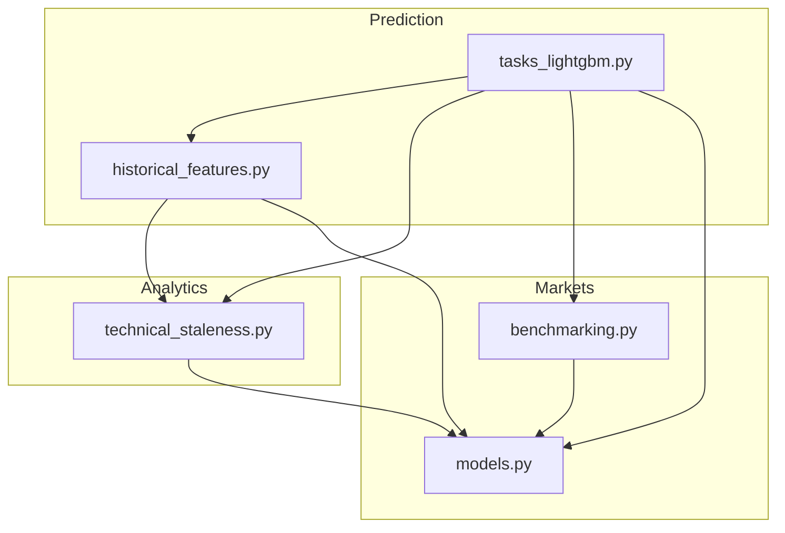
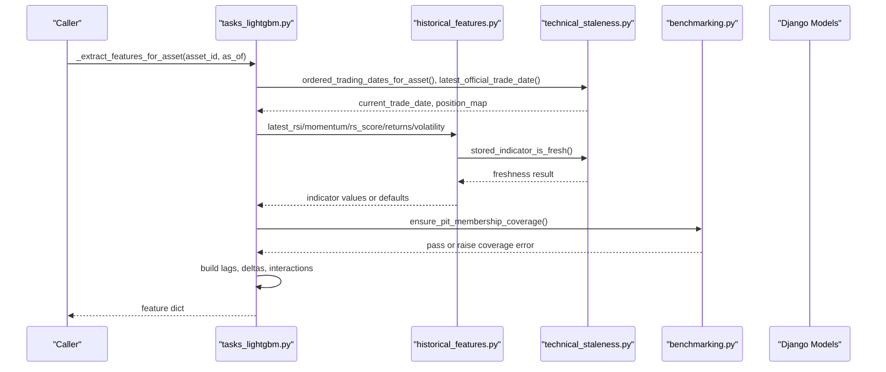
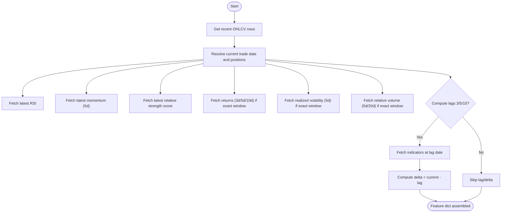
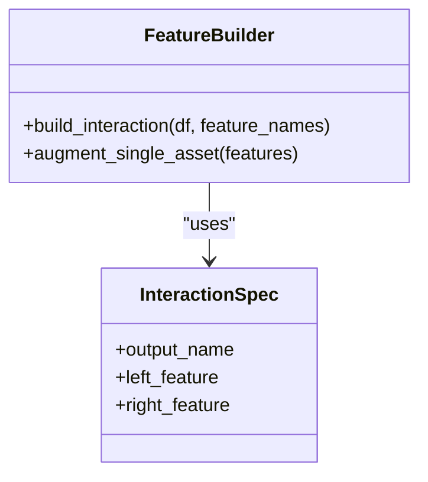
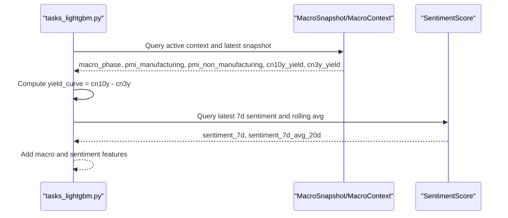
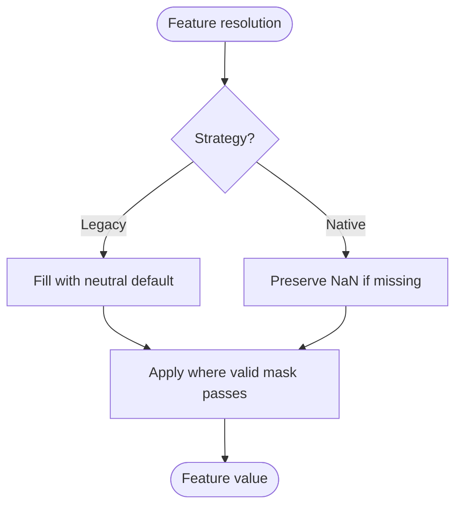
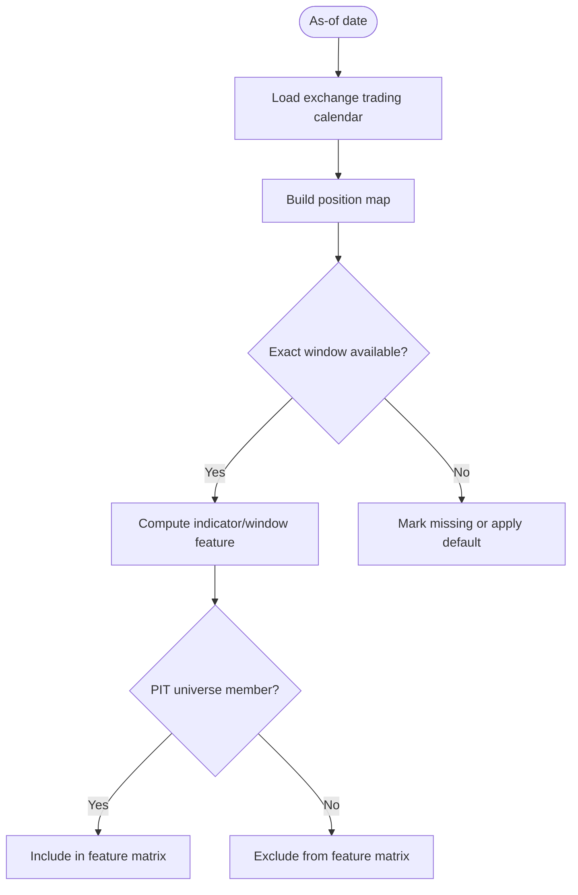
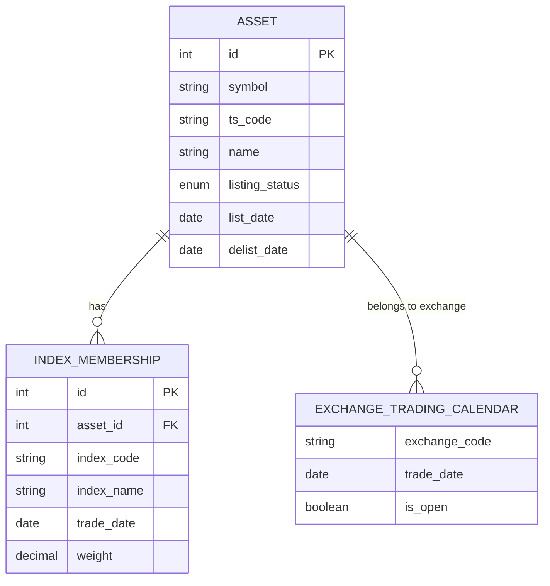
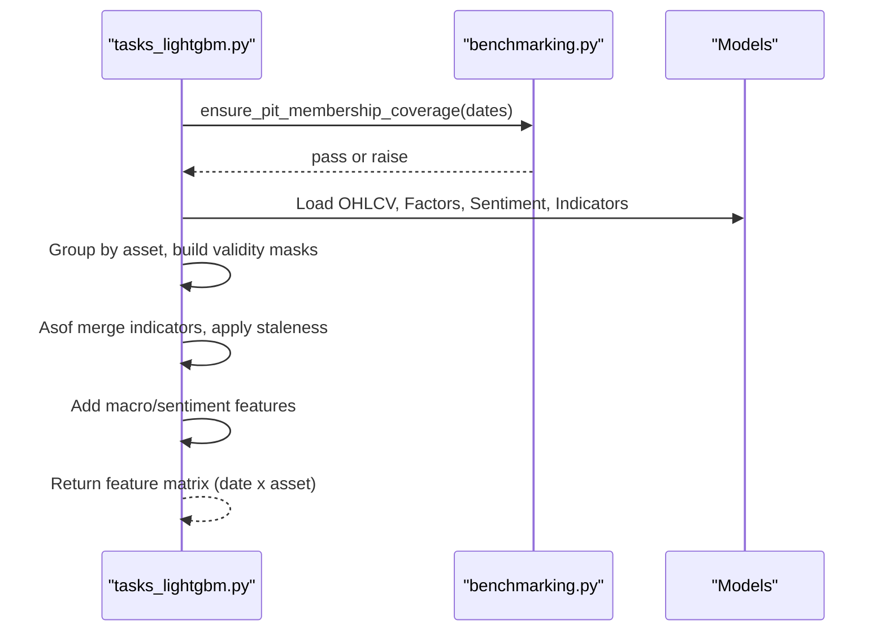
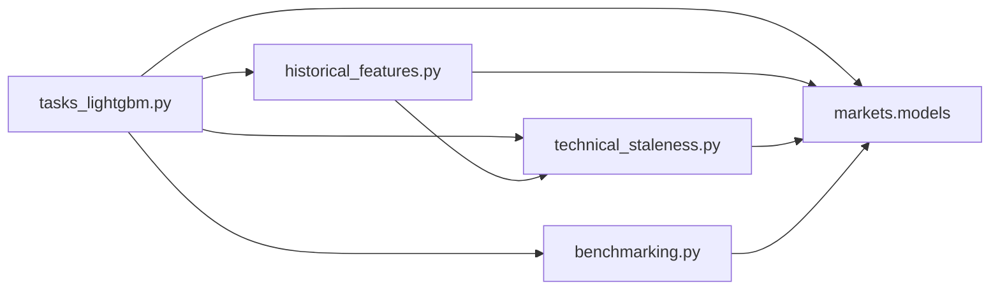

# Data Preparation & Feature Engineering

<cite>
**Referenced Files in This Document**
- [tasks_lightgbm.py](file://apps/prediction/tasks_lightgbm.py)
- [historical_features.py](file://apps/prediction/historical_features.py)
- [technical_staleness.py](file://apps/analytics/technical_staleness.py)
- [benchmarking.py](file://apps/markets/benchmarking.py)
- [models.py](file://apps/markets/models.py)
</cite>

## Table of Contents
1. [Introduction](#introduction)
2. [Project Structure](#project-structure)
3. [Core Components](#core-components)
4. [Architecture Overview](#architecture-overview)
5. [Detailed Component Analysis](#detailed-component-analysis)
6. [Dependency Analysis](#dependency-analysis)
7. [Performance Considerations](#performance-considerations)
8. [Troubleshooting Guide](#troubleshooting-guide)
9. [Conclusion](#conclusion)

## Introduction
This document explains the LightGBM data preparation and feature engineering pipeline that transforms raw upstream data (markets, analytics, factors, macro, sentiment) into model-ready features. It covers technical indicator extraction (RSI, momentum, relative strength), lag windows (3, 5, 10 days), interaction features with macro phases and sentiment, missing value handling strategies (legacy neutral fill vs native NaN preservation), point-in-time integrity, trading calendar validation, asset lifecycle considerations, and performance optimization techniques for large-scale computation.

## Project Structure
The pipeline is implemented primarily within the prediction app, with supporting utilities in analytics and markets apps:
- Prediction tasks orchestrate per-asset and batch feature construction, missing value handling, interaction features, and model artifact management.
- Historical features provide safe retrieval of stored indicators with staleness checks.
- Technical staleness defines freshness rules and trading date utilities.
- Markets benchmarking enforces point-in-time universe membership and tradeable coverage.
- Markets models define assets, calendars, suspensions, and index memberships used throughout.

**Diagram sources**
- [tasks_lightgbm.py:160-168](file://apps/prediction/tasks_lightgbm.py#L160-L168)
- [historical_features.py:1-13](file://apps/prediction/historical_features.py#L1-L13)
- [technical_staleness.py:1-33](file://apps/analytics/technical_staleness.py#L1-L33)
- [benchmarking.py:1-13](file://apps/markets/benchmarking.py#L1-L13)
- [models.py:19-85](file://apps/markets/models.py#L19-L85)

**Section sources**
- [tasks_lightgbm.py:160-168](file://apps/prediction/tasks_lightgbm.py#L160-L168)
- [historical_features.py:1-13](file://apps/prediction/historical_features.py#L1-L13)
- [technical_staleness.py:1-33](file://apps/analytics/technical_staleness.py#L1-L33)
- [benchmarking.py:1-13](file://apps/markets/benchmarking.py#L1-L13)
- [models.py:19-85](file://apps/markets/models.py#L19-L85)

## Core Components
- Per-asset feature extraction: builds a feature dict for an asset on a given date using stored indicators, factors, macro context, and sentiment.
- Batch feature matrix creation: constructs a DataFrame over a date range across eligible assets, merging OHLCV, indicators, factors, macro, and sentiment with strict validity masks.
- Staleness and calendar validation: ensures indicators are fresh and windows are complete using exchange trading calendars and gap policies.
- Point-in-time universe enforcement: restricts training and inference to effective universe members at each date.
- Missing value strategy: supports legacy neutral fill or native NaN preservation to control how missing values propagate.

**Section sources**
- [tasks_lightgbm.py:731-1051](file://apps/prediction/tasks_lightgbm.py#L731-L1051)
- [tasks_lightgbm.py:1162-1600](file://apps/prediction/tasks_lightgbm.py#L1162-L1600)
- [technical_staleness.py:9-33](file://apps/analytics/technical_staleness.py#L9-L33)
- [technical_staleness.py:122-190](file://apps/analytics/technical_staleness.py#L122-L190)
- [benchmarking.py:240-278](file://apps/markets/benchmarking.py#L240-L278)

## Architecture Overview
The pipeline follows a two-phase approach:
- Phase A: Per-asset feature extraction for single-day predictions or diagnostics.
- Phase B: Batch feature matrix generation for training or historical analysis.

Both phases rely on:
- Trading calendar and position mapping to compute exact windows and gaps.
- Indicator freshness checks to avoid stale signals.
- PIT universe constraints to ensure valid membership.
- Consistent missing value handling to preserve data integrity.

**Diagram sources**
- [tasks_lightgbm.py:731-1051](file://apps/prediction/tasks_lightgbm.py#L731-L1051)
- [historical_features.py:142-180](file://apps/prediction/historical_features.py#L142-L180)
- [technical_staleness.py:173-190](file://apps/analytics/technical_staleness.py#L173-L190)
- [benchmarking.py:133-146](file://apps/markets/benchmarking.py#L133-L146)

## Detailed Component Analysis

### Technical Indicators and Lag Windows
- RSI, momentum (5-day), and relative strength score are extracted from stored indicators with parameter matching and freshness checks.
- Lags at 3, 5, and 10 days are computed by retrieving indicator values at earlier trading dates validated via exact trading window availability.
- Deltas between current and lagged values are created for modeling.

**Diagram sources**
- [tasks_lightgbm.py:731-814](file://apps/prediction/tasks_lightgbm.py#L731-L814)
- [historical_features.py:207-257](file://apps/prediction/historical_features.py#L207-L257)
- [technical_staleness.py:157-171](file://apps/analytics/technical_staleness.py#L157-L171)

**Section sources**
- [tasks_lightgbm.py:731-814](file://apps/prediction/tasks_lightgbm.py#L731-L814)
- [historical_features.py:207-257](file://apps/prediction/historical_features.py#L207-L257)
- [technical_staleness.py:157-171](file://apps/analytics/technical_staleness.py#L157-L171)

### Interaction Features
Interaction features combine technical indicators with macro phases and sentiment scores:
- rsi_x_relative_volume_5d
- rsi_x_macro_phase
- factor_composite_x_sentiment
- northbound_flow_x_mom_5d (placeholder kept neutral at asset level)
- pe_ttm_percentile_x_macro_phase

These are created both per-asset and in batch pipelines to maintain compatibility with trained artifacts.

**Diagram sources**
- [tasks_lightgbm.py:380-408](file://apps/prediction/tasks_lightgbm.py#L380-L408)

**Section sources**
- [tasks_lightgbm.py:380-408](file://apps/prediction/tasks_lightgbm.py#L380-L408)

### Macro and Sentiment Integration
- Macro phase is mapped from MarketContext to numeric codes and applied per asset/date.
- Macro snapshots provide PMI manufacturing/non-manufacturing and yield curve derived from CN10Y and CN3Y yields.
- Sentiment scores are pulled from asset-level 7-day sentiment series; rolling averages can be computed.

**Diagram sources**
- [tasks_lightgbm.py:982-1051](file://apps/prediction/tasks_lightgbm.py#L982-L1051)

**Section sources**
- [tasks_lightgbm.py:982-1051](file://apps/prediction/tasks_lightgbm.py#L982-L1051)

### Missing Value Handling Strategies
Two strategies are supported:
- Legacy neutral fill: fills missing values with domain-neutral defaults (e.g., RSI=50, momentum=0, relative volume=1).
- Native NaN preservation: preserves true missingness as NaN when required by downstream logic or model behavior.

Helpers enforce consistent behavior across per-asset and batch paths, including indicator age validation and window completeness.

**Diagram sources**
- [tasks_lightgbm.py:281-313](file://apps/prediction/tasks_lightgbm.py#L281-L313)
- [tasks_lightgbm.py:1078-1117](file://apps/prediction/tasks_lightgbm.py#L1078-L1117)

**Section sources**
- [tasks_lightgbm.py:281-313](file://apps/prediction/tasks_lightgbm.py#L281-L313)
- [tasks_lightgbm.py:1078-1117](file://apps/prediction/tasks_lightgbm.py#L1078-L1117)

### Point-in-Time Data Integrity and Trading Calendar Validation
- Trading calendar provides official open days per exchange; position maps enable precise day-distance calculations.
- Exact window checks ensure required consecutive trading days exist before computing returns, momentum, and volatility.
- Rolling gap checks validate continuity within indicator windows based on max gap thresholds per indicator type.
- PIT universe enforcement ensures only effective constituents at each date are included in training/inference.

**Diagram sources**
- [technical_staleness.py:80-120](file://apps/analytics/technical_staleness.py#L80-L120)
- [technical_staleness.py:122-190](file://apps/analytics/technical_staleness.py#L122-L190)
- [benchmarking.py:240-278](file://apps/markets/benchmarking.py#L240-L278)

**Section sources**
- [technical_staleness.py:80-120](file://apps/analytics/technical_staleness.py#L80-L120)
- [technical_staleness.py:122-190](file://apps/analytics/technical_staleness.py#L122-L190)
- [benchmarking.py:240-278](file://apps/markets/benchmarking.py#L240-L278)

### Asset Lifecycle Considerations
- Assets have listing and delisting dates and status flags.
- Index membership snapshots determine effective universe membership over time.
- Suspensions are recorded and can affect availability of OHLCV and indicator windows.
- The pipeline uses membership tables and calendars to respect lifecycle changes during feature construction.

**Diagram sources**
- [models.py:19-85](file://apps/markets/models.py#L19-L85)
- [models.py:117-145](file://apps/markets/models.py#L117-L145)

**Section sources**
- [models.py:19-85](file://apps/markets/models.py#L19-L85)
- [models.py:117-145](file://apps/markets/models.py#L117-L145)

### Batch Feature Matrix Construction
The batch pipeline:
- Validates PIT membership coverage for target dates.
- Loads warmup periods for OHLCV and indicators.
- Builds per-asset frames, computes validity masks, merges indicators via asof joins, applies staleness checks, and fills or preserves missing values.
- Adds macro and sentiment features aligned to trading dates.
- Produces a final feature matrix suitable for LightGBM training.

**Diagram sources**
- [tasks_lightgbm.py:1162-1600](file://apps/prediction/tasks_lightgbm.py#L1162-L1600)
- [benchmarking.py:133-146](file://apps/markets/benchmarking.py#L133-L146)

**Section sources**
- [tasks_lightgbm.py:1162-1600](file://apps/prediction/tasks_lightgbm.py#L1162-L1600)

## Dependency Analysis
Key dependencies and relationships:
- tasks_lightgbm.py depends on historical_features.py for safe indicator retrieval and on technical_staleness.py for calendar and freshness logic.
- benchmarking.py enforces PIT universe constraints used by both per-asset and batch pipelines.
- markets.models provides core entities (Asset, ExchangeTradingCalendar, IndexMembership) referenced throughout.

**Diagram sources**
- [tasks_lightgbm.py:16-51](file://apps/prediction/tasks_lightgbm.py#L16-L51)
- [historical_features.py:1-13](file://apps/prediction/historical_features.py#L1-L13)
- [technical_staleness.py:1-7](file://apps/analytics/technical_staleness.py#L1-L7)
- [benchmarking.py:15-23](file://apps/markets/benchmarking.py#L15-L23)
- [models.py:19-85](file://apps/markets/models.py#L19-L85)

**Section sources**
- [tasks_lightgbm.py:16-51](file://apps/prediction/tasks_lightgbm.py#L16-L51)
- [historical_features.py:1-13](file://apps/prediction/historical_features.py#L1-L13)
- [technical_staleness.py:1-7](file://apps/analytics/technical_staleness.py#L1-L7)
- [benchmarking.py:15-23](file://apps/markets/benchmarking.py#L15-L23)
- [models.py:19-85](file://apps/markets/models.py#L19-L85)

## Performance Considerations
- Warmup windows: extend back ~40 days to ensure sufficient history for indicators and windows.
- Caching: runtime caches reduce repeated queries for recent OHLCV and asset trading context.
- Vectorized operations: pandas asof merges and groupby operations minimize Python loops.
- Validity masks: precompute rolling and exact window masks to avoid redundant checks.
- Indicator parameter filtering: match parameters precisely to avoid unnecessary computations.
- PIT membership checks: fail fast when coverage is missing to prevent expensive processing on invalid datasets.

[No sources needed since this section provides general guidance]

## Troubleshooting Guide
Common issues and resolutions:
- Missing PIT membership coverage: ensure IndexMembership backfill for required indices on target dates.
- Stale indicators: verify technical indicator refresh jobs and max gap thresholds; adjust if necessary.
- Incomplete windows: confirm OHLCV continuity and trading calendar correctness; handle suspensions appropriately.
- Unexpected NaNs: choose appropriate missing value strategy; legacy fill may hide data gaps while native NaN preserves them for diagnostics.
- Model artifact mismatch: ensure feature names and pruning plans align with trained artifacts; use feature importance snapshots to prune consistently.

**Section sources**
- [benchmarking.py:133-146](file://apps/markets/benchmarking.py#L133-L146)
- [technical_staleness.py:9-33](file://apps/analytics/technical_staleness.py#L9-L33)
- [tasks_lightgbm.py:477-579](file://apps/prediction/tasks_lightgbm.py#L477-L579)

## Conclusion
The LightGBM data preparation and feature engineering pipeline integrates market data, technical indicators, factors, macro context, and sentiment into robust, point-in-time-aligned features. It enforces strict trading calendar validation, staleness checks, and PIT universe constraints while offering flexible missing value strategies. The design supports both per-asset and batch workflows optimized for large-scale computation, ensuring reliable, reproducible feature construction for model training and inference.

[No sources needed since this section summarizes without analyzing specific files]