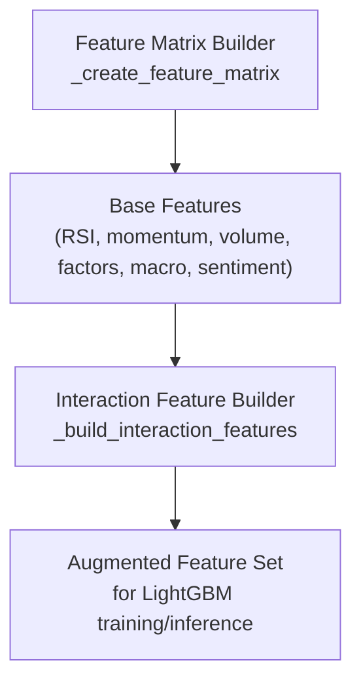
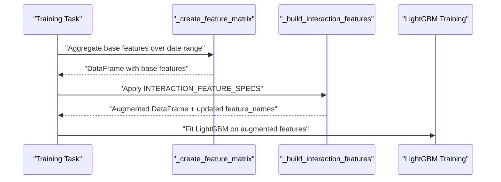
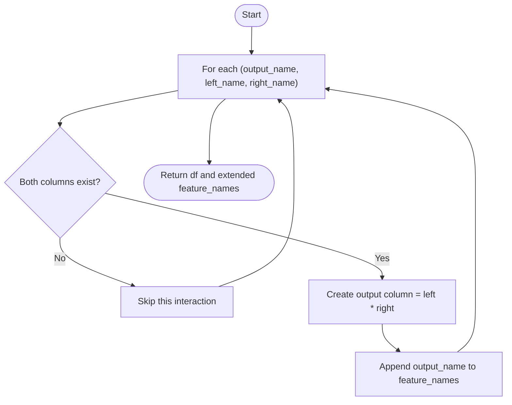
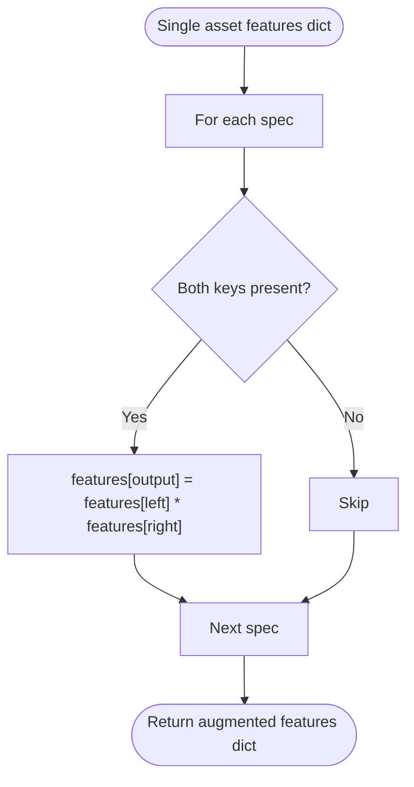
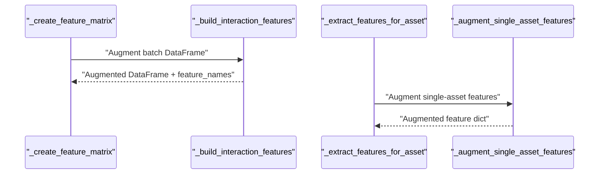
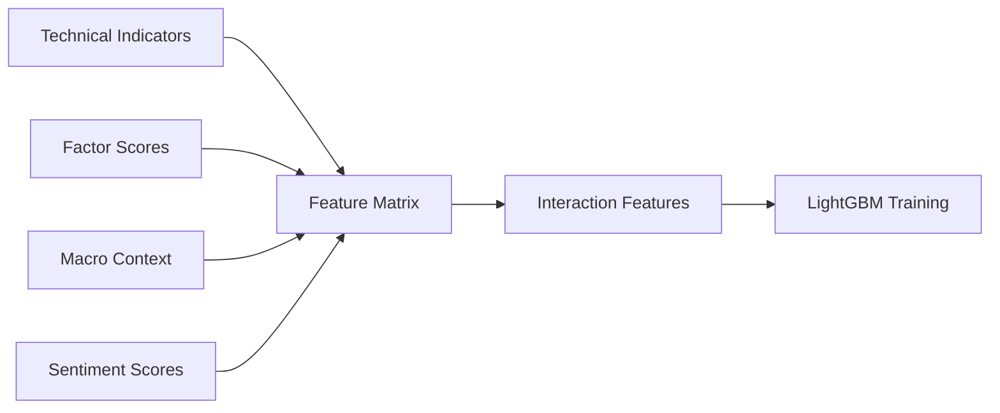

# Interaction Feature Creation

<cite>
**Referenced Files in This Document**
- [tasks_lightgbm.py](file://apps/prediction/tasks_lightgbm.py)
- [models_lightgbm.py](file://apps/prediction/models_lightgbm.py)
</cite>

## Table of Contents
1. Introduction
2. Project Structure
3. Core Components
4. Architecture Overview
5. Detailed Component Analysis
6. Dependency Analysis
7. Performance Considerations
8. Troubleshooting Guide
9. Conclusion

## Introduction
This document explains how interaction features are created in the LightGBM pipeline to capture non-linear relationships between base features. It focuses on the INTERACTION_FEATURE_SPECS configuration and the _build_interaction_features() function, detailing how pairs of base features are multiplied to form new signals that enhance model performance by encoding complex market dynamics across technical indicators, macro phases, sentiment scores, and fundamental factors.

## Project Structure
The interaction feature logic is implemented within the prediction app’s LightGBM tasks module. The training pipeline constructs a feature matrix from multiple data sources (technical indicators, fundamentals, macro context, sentiment), then augments it with interaction features before training or inference.

**Diagram sources**
- [tasks_lightgbm.py:1162-1760](file://apps/prediction/tasks_lightgbm.py#L1162-L1760)

**Section sources**
- [tasks_lightgbm.py:1162-1760](file://apps/prediction/tasks_lightgbm.py#L1162-L1760)

## Core Components
- INTERACTION_FEATURE_SPECS: Declares which base feature pairs to multiply into interaction features.
- _build_interaction_features(): Applies the configured interactions to a DataFrame during batch processing.
- _augment_single_asset_features(): Applies the same interactions for single-asset feature extraction used in real-time or per-asset flows.
- Base feature construction: Technical indicators (e.g., RSI, momentum, relative volume), fundamentals (e.g., factor composite, PE percentile), macro phase, and sentiment features are assembled prior to interaction creation.

Key responsibilities:
- Define interaction pairs declaratively for maintainability and reproducibility.
- Safely create interactions only when both base features exist.
- Extend the feature_names list so downstream components know the final schema.

**Section sources**
- [tasks_lightgbm.py:380-408](file://apps/prediction/tasks_lightgbm.py#L380-L408)
- [tasks_lightgbm.py:731-1051](file://apps/prediction/tasks_lightgbm.py#L731-L1051)
- [tasks_lightgbm.py:1162-1760](file://apps/prediction/tasks_lightgbm.py#L1162-L1760)

## Architecture Overview
The pipeline builds a unified feature matrix and then augments it with interaction features. The flow ensures consistent behavior across training and inference paths.

**Diagram sources**
- [tasks_lightgbm.py:1162-1760](file://apps/prediction/tasks_lightgbm.py#L1162-L1760)
- [tasks_lightgbm.py:380-408](file://apps/prediction/tasks_lightgbm.py#L380-L408)

## Detailed Component Analysis

### INTERACTION_FEATURE_SPECS Configuration
INTERACTION_FEATURE_SPECS defines five interaction pairs:
- rsi_x_relative_volume_5d = rsi × relative_volume_5d
- rsi_x_macro_phase = rsi × macro_phase
- factor_composite_x_sentiment = factor_composite × sentiment_7d
- northbound_flow_x_mom_5d = northbound_flow × mom_5d
- pe_ttm_percentile_x_macro_phase = pe_ttm_percentile × macro_phase

These pairs combine:
- Technical indicators (RSI, momentum)
- Volume signals (relative volume)
- Macro regime (macro_phase)
- Fundamental factors (factor_composite, PE percentile)
- Sentiment (sentiment_7d)

The design intentionally multiplies two base features to capture non-linear interactions without adding heavy computation.

**Section sources**
- [tasks_lightgbm.py:380-388](file://apps/prediction/tasks_lightgbm.py#L380-L388)

### _build_interaction_features() Function
Purpose:
- Iterates through each interaction spec.
- Checks if both left and right base features exist in the DataFrame.
- Creates the product column named after the output_name.
- Appends newly created columns to the feature_names list.

Behavior highlights:
- Safe creation: Only creates an interaction if both inputs are present.
- Deterministic: Order of specs determines order of appended features.
- Extensible: New interactions can be added by appending tuples to INTERACTION_FEATURE_SPECS.

**Diagram sources**
- [tasks_lightgbm.py:395-401](file://apps/prediction/tasks_lightgbm.py#L395-L401)

**Section sources**
- [tasks_lightgbm.py:395-401](file://apps/prediction/tasks_lightgbm.py#L395-L401)

### Single-Asset Interaction Augmentation
For per-asset feature extraction, the same interaction rules are applied to a dictionary of features using _augment_single_asset_features(). This ensures consistency between batch and single-asset pipelines.

**Diagram sources**
- [tasks_lightgbm.py:404-408](file://apps/prediction/tasks_lightgbm.py#L404-L408)

**Section sources**
- [tasks_lightgbm.py:404-408](file://apps/prediction/tasks_lightgbm.py#L404-L408)

### Base Features Used in Interactions
The following base features are constructed before interactions are applied:
- Technical indicators:
  - rsi: latest RSI value
  - mom_5d: 5-day momentum
  - relative_volume_5d: recent volume ratio
- Fundamentals:
  - factor_composite: composite factor score
  - pe_ttm_percentile: PE TTM percentile score
- Macro:
  - macro_phase: encoded macro regime (e.g., recovery, overheating, stagflation, recession)
- Sentiment:
  - sentiment_7d: 7-day asset sentiment score

These are assembled in the per-asset extractor and merged into the training feature matrix.

**Section sources**
- [tasks_lightgbm.py:731-1051](file://apps/prediction/tasks_lightgbm.py#L731-L1051)
- [tasks_lightgbm.py:1737-1759](file://apps/prediction/tasks_lightgbm.py#L1737-L1759)

### Integration Points in the Pipeline
- Batch training path:
  - _create_feature_matrix aggregates base features and calls _build_interaction_features to augment the DataFrame.
  - The resulting feature_names attribute reflects the final schema including interactions.
- Single-asset path:
  - _extract_features_for_asset returns a feature dict; _augment_single_asset_features applies the same interactions.

**Diagram sources**
- [tasks_lightgbm.py:1162-1760](file://apps/prediction/tasks_lightgbm.py#L1162-L1760)
- [tasks_lightgbm.py:395-408](file://apps/prediction/tasks_lightgbm.py#L395-L408)

**Section sources**
- [tasks_lightgbm.py:1162-1760](file://apps/prediction/tasks_lightgbm.py#L1162-L1760)
- [tasks_lightgbm.py:395-408](file://apps/prediction/tasks_lightgbm.py#L395-L408)

## Dependency Analysis
- Data dependencies:
  - Technical indicators from analytics models
  - Factor scores from factors models
  - Macro context and snapshots from macro models
  - Sentiment scores from sentiment models
- Processing dependencies:
  - Feature matrix builder depends on base feature assembly functions
  - Interaction builder depends on INTERACTION_FEATURE_SPECS and presence of base columns
- Output dependencies:
  - Downstream LightGBM training consumes the augmented feature set and metadata (feature_names)

**Diagram sources**
- [tasks_lightgbm.py:731-1051](file://apps/prediction/tasks_lightgbm.py#L731-L1051)
- [tasks_lightgbm.py:1162-1760](file://apps/prediction/tasks_lightgbm.py#L1162-L1760)

**Section sources**
- [tasks_lightgbm.py:731-1051](file://apps/prediction/tasks_lightgbm.py#L731-L1051)
- [tasks_lightgbm.py:1162-1760](file://apps/prediction/tasks_lightgbm.py#L1162-L1760)

## Performance Considerations
- Multiplicative interactions are computationally lightweight and vectorized via pandas/numpy operations.
- Conditional checks ensure no unnecessary computations when base features are missing.
- Interaction features increase dimensionality modestly; monitor feature importance and consider pruning strategies if needed.
- Consistent application across batch and single-asset paths avoids redundant code and reduces maintenance overhead.

## Troubleshooting Guide
Common issues and resolutions:
- Missing base features:
  - If either left or right base feature is absent, the interaction will not be created. Ensure base features are computed and present in the DataFrame or feature dict.
- Inconsistent schemas:
  - Verify that feature_names includes all interaction outputs. The pipeline appends created interactions automatically; confirm downstream consumers use the updated schema.
- Northbound flow placeholder:
  - The northbound_flow_x_mom_5d interaction uses a market-wide placeholder for northbound_flow to keep per-stock features neutral. This is intentional to avoid leakage.

Validation steps:
- Confirm presence of required base columns before training.
- Inspect the feature_names attribute after augmentation to verify interaction columns were added.
- Review feature importance snapshots to assess whether interactions contribute meaningfully.

**Section sources**
- [tasks_lightgbm.py:380-408](file://apps/prediction/tasks_lightgbm.py#L380-L408)
- [tasks_lightgbm.py:1737-1759](file://apps/prediction/tasks_lightgbm.py#L1737-L1759)

## Conclusion
Interaction features in the LightGBM pipeline are defined declaratively and computed by multiplying pairs of base features. This approach captures non-linear relationships between technical indicators, macro regimes, sentiment, and fundamentals, improving model expressiveness while keeping implementation simple and maintainable. The _build_interaction_features() function ensures safe, consistent augmentation across batch and single-asset flows, and the resulting features integrate seamlessly into the training and inference pipeline.