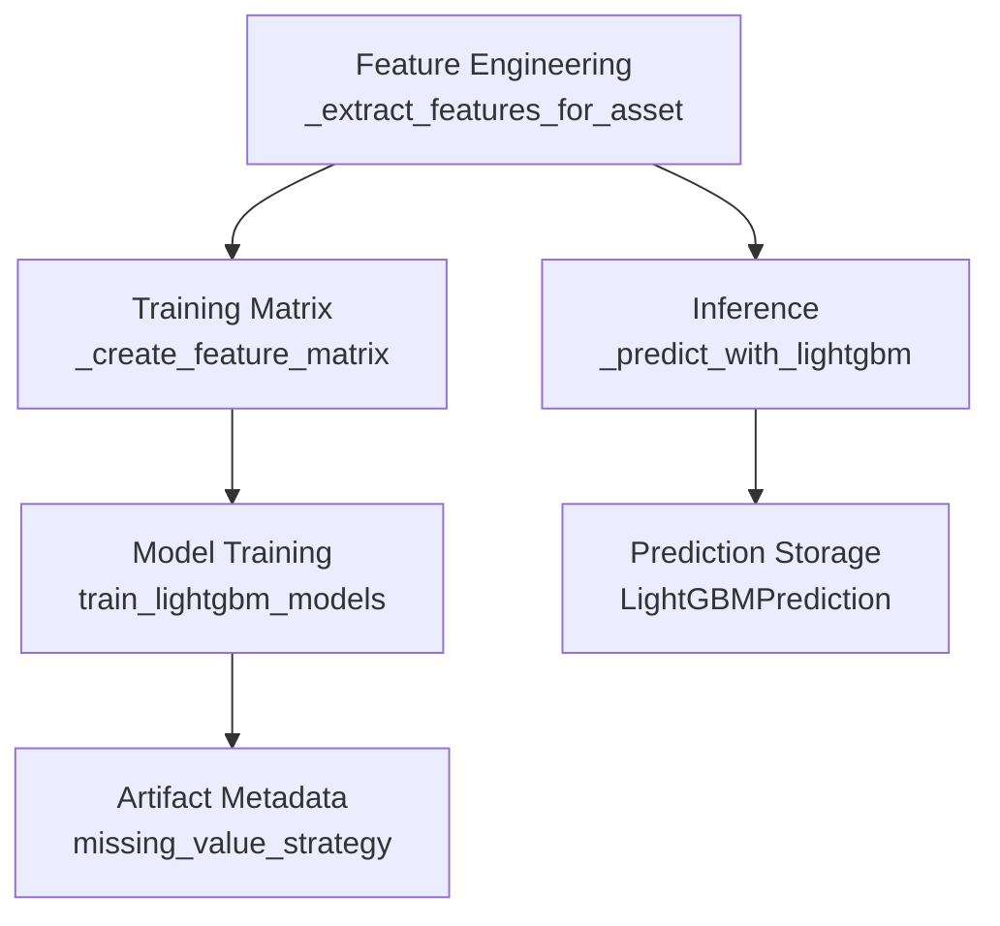
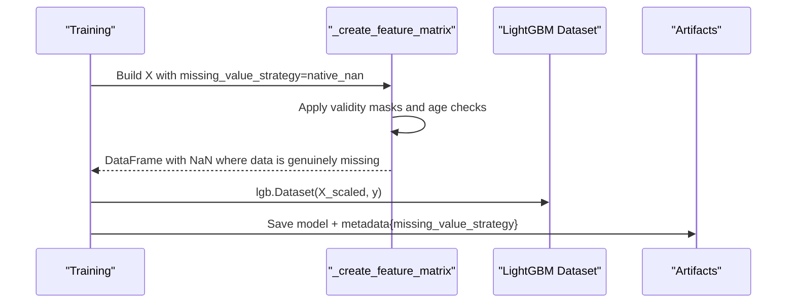
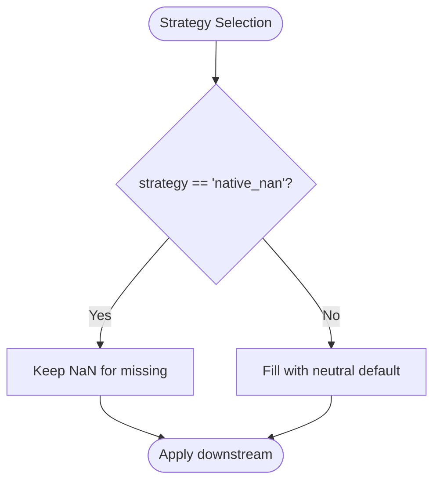
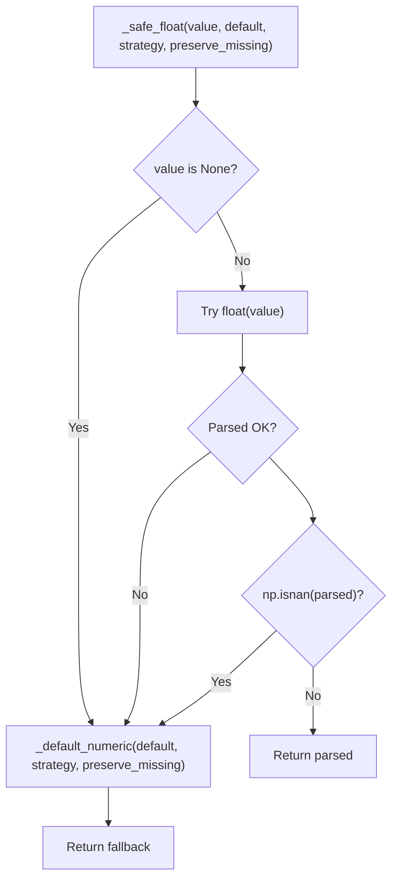
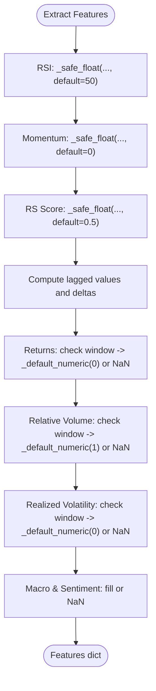
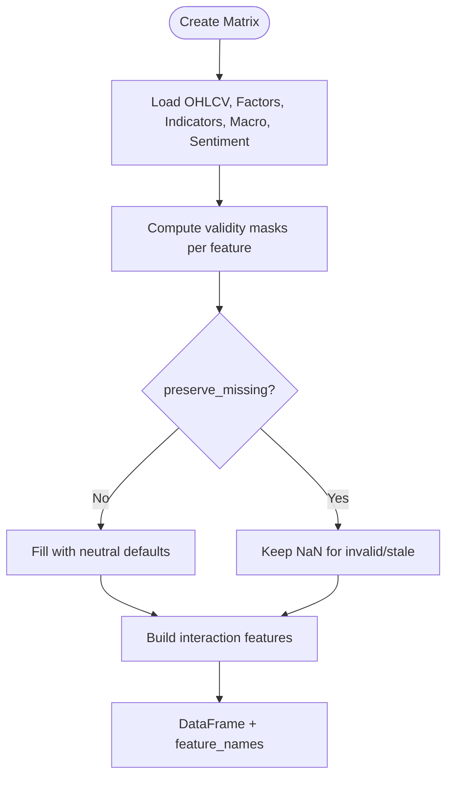
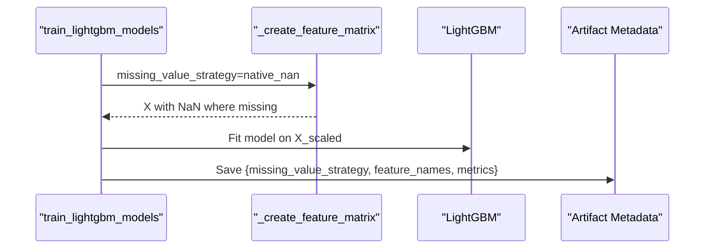
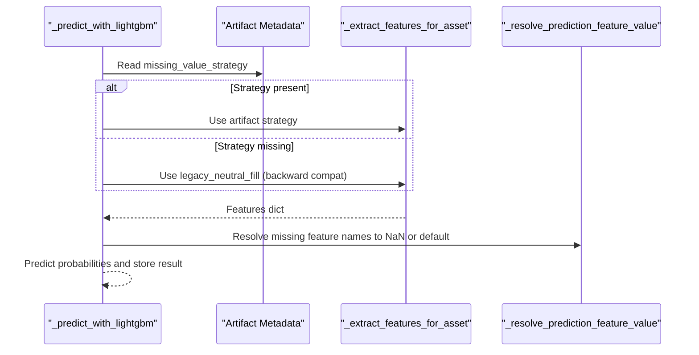
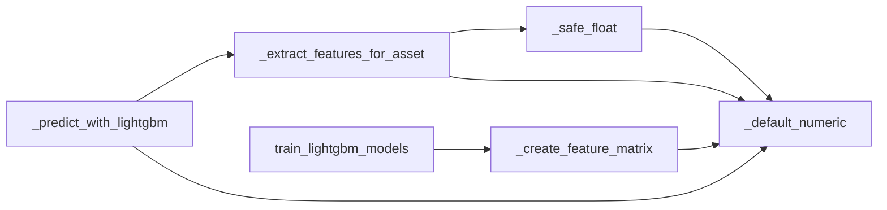

# Missing Value Handling Strategies

<cite>
**Referenced Files in This Document**
- [tasks_lightgbm.py](file://apps/prediction/tasks_lightgbm.py)
- [models_lightgbm.py](file://apps/prediction/models_lightgbm.py)
- [tests_lightgbm.py](file://apps/prediction/tests_lightgbm.py)
</cite>

## Table of Contents
1. [Introduction](#introduction)
2. [Project Structure](#project-structure)
3. [Core Components](#core-components)
4. [Architecture Overview](#architecture-overview)
5. [Detailed Component Analysis](#detailed-component-analysis)
6. [Dependency Analysis](#dependency-analysis)
7. [Performance Considerations](#performance-considerations)
8. [Troubleshooting Guide](#troubleshooting-guide)
9. [Conclusion](#conclusion)
10. [Appendices](#appendices)

## Introduction
This document explains how missing values are handled in the LightGBM pipeline, focusing on two strategies:
- legacy_neutral_fill (default): fills missing technical indicators with neutral defaults such as 50 for RSI and 0 for momentum/returns/volatility.
- native_nan: preserves true NaN values to signal genuine data gaps through the feature engineering pipeline into training and inference.

It documents the key helpers _safe_float() and _default_numeric(), the preserve_missing parameter usage, propagation behavior across engineered features, and the impact on model training and prediction quality. It also covers backward compatibility and migration paths between strategies.

## Project Structure
The missing value handling logic is centralized in the LightGBM tasks module and exercised by both training and inference flows. The models module stores artifacts and predictions that record metadata including the strategy used. Tests validate behavior under both strategies.

**Diagram sources**
- [tasks_lightgbm.py:731-1051](file://apps/prediction/tasks_lightgbm.py#L731-L1051)
- [tasks_lightgbm.py:1162-1760](file://apps/prediction/tasks_lightgbm.py#L1162-L1760)
- [tasks_lightgbm.py:1849-2098](file://apps/prediction/tasks_lightgbm.py#L1849-L2098)
- [tasks_lightgbm.py:2105-2201](file://apps/prediction/tasks_lightgbm.py#L2105-L2201)
- [models_lightgbm.py:7-28](file://apps/prediction/models_lightgbm.py#L7-L28)

**Section sources**
- [tasks_lightgbm.py:165-167](file://apps/prediction/tasks_lightgbm.py#L165-L167)
- [tasks_lightgbm.py:281-312](file://apps/prediction/tasks_lightgbm.py#L281-L312)
- [tasks_lightgbm.py:731-1051](file://apps/prediction/tasks_lightgbm.py#L731-L1051)
- [tasks_lightgbm.py:1162-1760](file://apps/prediction/tasks_lightgbm.py#L1162-L1760)
- [tasks_lightgbm.py:1849-2098](file://apps/prediction/tasks_lightgbm.py#L1849-L2098)
- [tasks_lightgbm.py:2105-2201](file://apps/prediction/tasks_lightgbm.py#L2105-L2201)
- [models_lightgbm.py:7-28](file://apps/prediction/models_lightgbm.py#L7-L28)

## Core Components
- Strategy constants and metadata key:
  - MISSING_VALUE_STRATEGY_LEGACY = 'legacy_neutral_fill'
  - MISSING_VALUE_STRATEGY_NATIVE_NAN = 'native_nan'
  - MISSING_VALUE_STRATEGY_METADATA_KEY = 'missing_value_strategy'
- Helpers:
  - _preserves_true_missing(strategy): returns True when strategy is native_nan.
  - _default_numeric(default, strategy, preserve_missing): returns np.nan when preserving true missing and strategy is native_nan; otherwise returns float(default).
  - _safe_float(value, default=0.0, strategy, preserve_missing): converts to float or falls back to _default_numeric; treats None or NaN-like inputs as missing.
  - _resolve_prediction_feature_value(features_dict, feature_name, strategy): resolves a feature value from a dict or alias, returning NaN for missing keys under native_nan.

These functions are used consistently across feature extraction for single assets and during batch matrix creation for training.

**Section sources**
- [tasks_lightgbm.py:165-167](file://apps/prediction/tasks_lightgbm.py#L165-L167)
- [tasks_lightgbm.py:281-312](file://apps/prediction/tasks_lightgbm.py#L281-L312)
- [tasks_lightgbm.py:411-434](file://apps/prediction/tasks_lightgbm.py#L411-L434)

## Architecture Overview
Missing value handling is applied at multiple layers:
- Per-feature extraction for a single asset uses _safe_float with preserve_missing=True so that missingness can propagate if strategy is native_nan.
- Batch feature matrix construction applies per-feature fill rules based on validity masks and age checks, using _default_numeric to either fill with neutral values or leave NaN.
- Inference reads the artifact’s stored missing_value_strategy and reuses it to ensure runtime feature generation matches training assumptions.

**Diagram sources**
- [tasks_lightgbm.py:1162-1760](file://apps/prediction/tasks_lightgbm.py#L1162-L1760)
- [tasks_lightgbm.py:1849-2098](file://apps/prediction/tasks_lightgbm.py#L1849-L2098)

## Detailed Component Analysis

### Strategy Constants and Decision Logic
- Two strategies are defined and used throughout:
  - legacy_neutral_fill: fills missing values with domain-neutral defaults (e.g., 50 for RSI, 0 for momentum/returns/volatility, 1.0 for relative volume baseline).
  - native_nan: preserves NaN to indicate missingness explicitly.
- _preserves_true_missing determines whether to keep NaN or fill with defaults.

**Diagram sources**
- [tasks_lightgbm.py:165-167](file://apps/prediction/tasks_lightgbm.py#L165-L167)
- [tasks_lightgbm.py:281-288](file://apps/prediction/tasks_lightgbm.py#L281-L288)

**Section sources**
- [tasks_lightgbm.py:165-167](file://apps/prediction/tasks_lightgbm.py#L165-L167)
- [tasks_lightgbm.py:281-288](file://apps/prediction/tasks_lightgbm.py#L281-L288)

### _default_numeric and _safe_float
- _default_numeric(default, strategy, preserve_missing):
  - If preserve_missing is True and strategy is native_nan, returns np.nan.
  - Otherwise returns float(default).
- _safe_float(value, default=0.0, strategy, preserve_missing):
  - Computes fallback via _default_numeric.
  - Returns fallback if value is None or not convertible to float or is NaN-like.
  - Otherwise returns parsed float.

Usage patterns:
- Technical indicators like RSI, momentum, RS score use _safe_float with preserve_missing=True so missingness can be preserved when appropriate.
- Derived features (returns, relative volume, realized volatility) use conditional availability checks plus _default_numeric to either fill or preserve NaN.

**Diagram sources**
- [tasks_lightgbm.py:285-312](file://apps/prediction/tasks_lightgbm.py#L285-L312)

**Section sources**
- [tasks_lightgbm.py:285-312](file://apps/prediction/tasks_lightgbm.py#L285-L312)

### Feature Extraction for Single Asset
_extract_features_for_asset builds features per asset/date with strategy-aware defaults:
- RSI defaults to 50 when missing under legacy_neutral_fill; NaN under native_nan.
- Momentum and RS score default to 0 and 0.5 respectively under legacy_neutral_fill; NaN under native_nan.
- Lagged features and deltas use current values as fallbacks under legacy_neutral_fill; NaN under native_nan when windows are invalid.
- Returns, relative volume, and realized volatility check exact trading window availability; if unavailable, they use _default_numeric to either fill or preserve NaN.

**Diagram sources**
- [tasks_lightgbm.py:731-1051](file://apps/prediction/tasks_lightgbm.py#L731-L1051)

**Section sources**
- [tasks_lightgbm.py:731-1051](file://apps/prediction/tasks_lightgbm.py#L731-L1051)

### Batch Feature Matrix Creation
_create_feature_matrix constructs the training matrix with strategy-aware filling:
- For each indicator, validity masks ensure sufficient recent data points and recency constraints.
- Under legacy_neutral_fill, missing values are filled with neutral defaults (e.g., 50 for RSI, 0 for momentum/returns/volatility, 1.0 for relative volume).
- Under native_nan, missing values remain NaN when data is insufficient or stale.
- Interaction features are appended after base features.

**Diagram sources**
- [tasks_lightgbm.py:1162-1760](file://apps/prediction/tasks_lightgbm.py#L1162-L1760)

**Section sources**
- [tasks_lightgbm.py:1162-1760](file://apps/prediction/tasks_lightgbm.py#L1162-L1760)

### Training Flow and Artifact Metadata
- Training sets missing_value_strategy to native_nan for consistency with modern pipelines.
- The chosen strategy is recorded in artifact metadata and persisted alongside model, scaler, and calibrator.
- Feature pruning plans and importance snapshots are saved; strategy remains part of the artifact context.

**Diagram sources**
- [tasks_lightgbm.py:1849-2098](file://apps/prediction/tasks_lightgbm.py#L1849-L2098)

**Section sources**
- [tasks_lightgbm.py:1849-2098](file://apps/prediction/tasks_lightgbm.py#L1849-L2098)

### Inference Flow and Backward Compatibility
- Inference loads the active artifact and reads its stored missing_value_strategy from metadata.
- If absent, it falls back to legacy_neutral_fill for backward compatibility with older artifacts.
- Features are extracted using the same strategy as training to ensure consistent behavior.
- Missing keys in the feature dict are resolved via _resolve_prediction_feature_value, which returns NaN under native_nan.

**Diagram sources**
- [tasks_lightgbm.py:2105-2201](file://apps/prediction/tasks_lightgbm.py#L2105-L2201)

**Section sources**
- [tasks_lightgbm.py:2105-2201](file://apps/prediction/tasks_lightgbm.py#L2105-L2201)

### Examples of When to Use Each Strategy
- Use legacy_neutral_fill:
  - When you need robust, always-complete numeric inputs for models trained historically with neutral fills.
  - When downstream systems cannot handle NaN and require stable defaults (e.g., dashboards expecting non-NaN numbers).
- Use native_nan:
  - When you want to explicitly represent missingness due to insufficient history, stale indicators, or data gaps.
  - When training models that can leverage LightGBM’s native handling of missing values and when you want to diagnose data quality via NaN patterns.

**Section sources**
- [tasks_lightgbm.py:165-167](file://apps/prediction/tasks_lightgbm.py#L165-L167)
- [tasks_lightgbm.py:281-312](file://apps/prediction/tasks_lightgbm.py#L281-L312)
- [tasks_lightgbm.py:2105-2201](file://apps/prediction/tasks_lightgbm.py#L2105-L2201)

### Impact on Model Training and Prediction Quality
- legacy_neutral_fill:
  - Pros: Stable inputs; avoids NaN-related issues; maintains compatibility with older models.
  - Cons: Masks data quality problems; may bias signals toward neutral assumptions.
- native_nan:
  - Pros: Preserves true missingness; enables better diagnostics; allows models to learn from absence of information.
  - Cons: Requires careful handling in scaling and modeling; may reduce effective sample size if many features are NaN.

Tests demonstrate:
- Under native_nan, gappy recent history yields NaN for derived features like return_3d, relative_volume_5d, realized_volatility_5d.
- Under legacy_neutral_fill, those features are filled with neutral defaults.

**Section sources**
- [tests_lightgbm.py:417-476](file://apps/prediction/tests_lightgbm.py#L417-L476)
- [tests_lightgbm.py:478-485](file://apps/prediction/tests_lightgbm.py#L478-L485)

## Dependency Analysis
Key dependencies and relationships:
- _safe_float depends on _default_numeric and _is_nan_like.
- _extract_features_for_asset calls _safe_float and _default_numeric extensively for all features.
- _create_feature_matrix applies strategy-aware filling across all indicators and macro/sentiment features.
- train_lightgbm_models sets missing_value_strategy to native_nan and persists it in artifact metadata.
- _predict_with_lightgbm reads strategy from artifact metadata and falls back to legacy_neutral_fill for backward compatibility.

**Diagram sources**
- [tasks_lightgbm.py:281-312](file://apps/prediction/tasks_lightgbm.py#L281-L312)
- [tasks_lightgbm.py:731-1051](file://apps/prediction/tasks_lightgbm.py#L731-L1051)
- [tasks_lightgbm.py:1162-1760](file://apps/prediction/tasks_lightgbm.py#L1162-L1760)
- [tasks_lightgbm.py:1849-2098](file://apps/prediction/tasks_lightgbm.py#L1849-L2098)
- [tasks_lightgbm.py:2105-2201](file://apps/prediction/tasks_lightgbm.py#L2105-L2201)

**Section sources**
- [tasks_lightgbm.py:281-312](file://apps/prediction/tasks_lightgbm.py#L281-L312)
- [tasks_lightgbm.py:731-1051](file://apps/prediction/tasks_lightgbm.py#L731-L1051)
- [tasks_lightgbm.py:1162-1760](file://apps/prediction/tasks_lightgbm.py#L1162-L1760)
- [tasks_lightgbm.py:1849-2098](file://apps/prediction/tasks_lightgbm.py#L1849-L2098)
- [tasks_lightgbm.py:2105-2201](file://apps/prediction/tasks_lightgbm.py#L2105-L2201)

## Performance Considerations
- Using native_nan reduces artificial inflation of features and can improve model interpretability but may increase sparsity in training matrices.
- legacy_neutral_fill ensures dense matrices and predictable performance but can mask data quality issues.
- Feature validity checks and age constraints minimize unnecessary computation by skipping invalid windows early.

[No sources needed since this section provides general guidance]

## Troubleshooting Guide
Common issues and resolutions:
- Unexpected NaN in predictions:
  - Verify the artifact’s missing_value_strategy and ensure runtime extraction uses the same strategy.
  - Check validity masks and age constraints for indicators; gappy histories will produce NaN under native_nan.
- Legacy model incompatibility:
  - Older artifacts without explicit strategy metadata fall back to legacy_neutral_fill during inference.
  - Retrain models with native_nan to align with current expectations if desired.
- Data quality concerns:
  - Inspect feature snapshots and NaN patterns to identify stale or missing indicators.
  - Adjust data ingestion or warmup periods to reduce gaps.

**Section sources**
- [tasks_lightgbm.py:2105-2201](file://apps/prediction/tasks_lightgbm.py#L2105-L2201)
- [tests_lightgbm.py:417-476](file://apps/prediction/tests_lightgbm.py#L417-L476)

## Conclusion
The LightGBM pipeline supports two complementary missing value strategies:
- legacy_neutral_fill provides stable, neutral-filled features suitable for backward compatibility and systems that cannot handle NaN.
- native_nan preserves true missingness, enabling better diagnostics and potentially more honest modeling of uncertainty.

Consistent use of _safe_float and _default_numeric with preserve_missing ensures coherent behavior across single-asset extraction and batch matrix creation. Training artifacts record the strategy, and inference respects it while falling back to legacy behavior for older models. Migration should involve retraining with native_nan and validating performance and data quality before switching production workflows.

[No sources needed since this section summarizes without analyzing specific files]

## Appendices

### Migration Path Between Strategies
- To migrate from legacy_neutral_fill to native_nan:
  - Retrain models using native_nan to capture true missingness patterns.
  - Validate that downstream consumers can handle NaN in features and predictions.
  - Monitor feature coverage and adjust data ingestion/warmup to reduce excessive gaps.
- To maintain backward compatibility:
  - Ensure inference reads artifact metadata and falls back to legacy_neutral_fill for older artifacts.
  - Gradually update artifacts and pipelines while monitoring performance.

**Section sources**
- [tasks_lightgbm.py:1849-2098](file://apps/prediction/tasks_lightgbm.py#L1849-L2098)
- [tasks_lightgbm.py:2105-2201](file://apps/prediction/tasks_lightgbm.py#L2105-L2201)