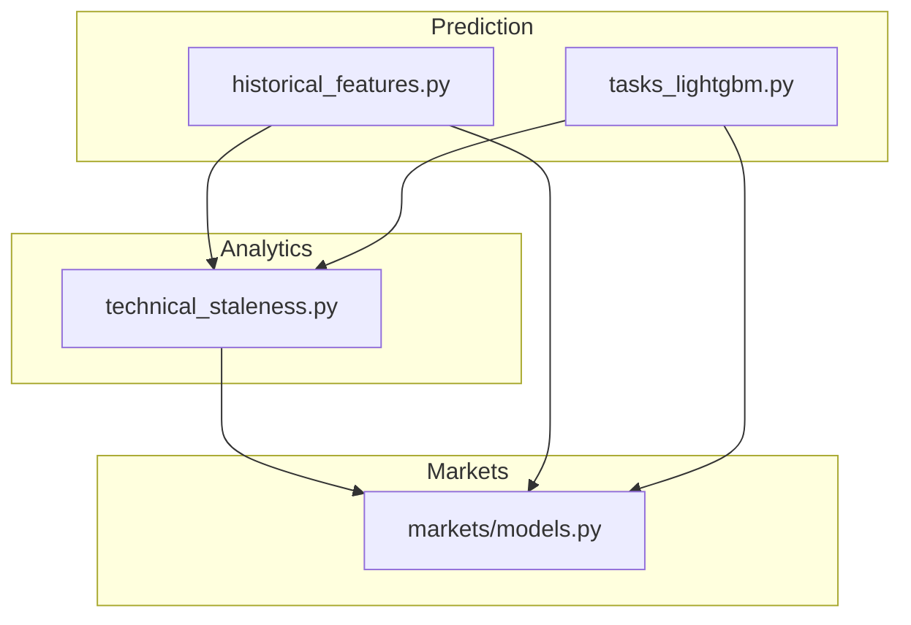
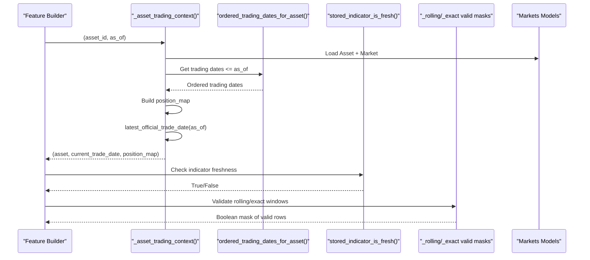
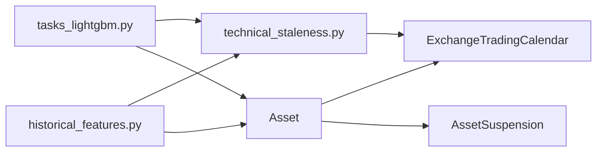

# Point-in-Time Data Validation

<cite>
**Referenced Files in This Document**
- [historical_features.py](file://apps/prediction/historical_features.py)
- [tasks_lightgbm.py](file://apps/prediction/tasks_lightgbm.py)
- [technical_staleness.py](file://apps/analytics/technical_staleness.py)
- [models.py](file://apps/markets/models.py)
</cite>

## Table of Contents
1. [Introduction](#introduction)
2. [Project Structure](#project-structure)
3. [Core Components](#core-components)
4. [Architecture Overview](#architecture-overview)
5. [Detailed Component Analysis](#detailed-component-analysis)
6. [Dependency Analysis](#dependency-analysis)
7. [Performance Considerations](#performance-considerations)
8. [Troubleshooting Guide](#troubleshooting-guide)
9. [Conclusion](#conclusion)

## Introduction
This document explains how point-in-time (PIT) data validation is enforced in the LightGBM pipeline to prevent look-ahead bias and ensure that features are only computed from information available at each historical decision date. It focuses on:
- How _asset_trading_context() resolves a consistent trading context per asset and as-of date
- How ordered_trading_dates_for_asset(), latest_official_trade_date(), and position_map enforce strict PIT constraints
- How _rolling_gap_valid_mask() and _exact_window_valid_mask() validate sufficient and contiguous historical data
- How stored_indicator_is_fresh() and related staleness checks protect against stale or missing indicators
- Examples of validation failures, handling of suspended assets, and performance implications during large-scale feature computation

## Project Structure
The PIT validation logic spans three primary modules:
- apps/prediction/historical_features.py: High-level helpers for retrieving latest indicator values with PIT-aware freshness checks
- apps/prediction/tasks_lightgbm.py: Core LightGBM feature engineering and PIT validation masks used during training and inference
- apps/analytics/technical_staleness.py: Shared utilities for trading calendar membership, official trade dates, and staleness thresholds
- apps/markets/models.py: Domain models for Asset, ExchangeTradingCalendar, and AssetSuspension that underpin calendar and lifecycle checks

**Diagram sources**
- [historical_features.py:36-48](file://apps/prediction/historical_features.py#L36-L48)
- [tasks_lightgbm.py:342-377](file://apps/prediction/tasks_lightgbm.py#L342-L377)
- [technical_staleness.py:80-112](file://apps/analytics/technical_staleness.py#L80-L112)
- [models.py:19-84](file://apps/markets/models.py#L19-L84)

**Section sources**
- [historical_features.py:36-48](file://apps/prediction/historical_features.py#L36-L48)
- [tasks_lightgbm.py:342-377](file://apps/prediction/tasks_lightgbm.py#L342-L377)
- [technical_staleness.py:80-112](file://apps/analytics/technical_staleness.py#L80-L112)
- [models.py:19-84](file://apps/markets/models.py#L19-L84)

## Core Components
- _asset_trading_context(): Resolves an asset’s official trading context at a given as-of date by fetching its exchange code, ordered trading dates up to as_of, mapping those dates to positions, and determining the latest official trade date. The result is cached per (asset_id, as_of).
- ordered_trading_dates_for_asset(): Returns strictly increasing trading dates for an asset’s exchange up to a given end date, ensuring calendar membership.
- latest_official_trade_date(): Finds the most recent official trading date on or before as_of using binary search over ordered trading dates.
- position_map: A dictionary mapping each trading date to its ordinal index; enables O(1) distance calculations between dates and gap detection.
- _rolling_gap_valid_mask(): Ensures rolling windows have no gaps larger than max_gap across required_points consecutive positions.
- _exact_window_valid_mask(): Ensures exact spacing between current and lagged positions equals periods, validating contiguous windows without gaps.
- stored_indicator_is_fresh(): Validates that a stored indicator value is not older than allowed max_gap relative to the current trade date.

These components collectively enforce PIT integrity by restricting computations to officially traded days prior to or on the as-of date and by rejecting stale or gappy histories.

**Section sources**
- [historical_features.py:36-48](file://apps/prediction/historical_features.py#L36-L48)
- [technical_staleness.py:80-112](file://apps/analytics/technical_staleness.py#L80-L112)
- [technical_staleness.py:173-190](file://apps/analytics/technical_staleness.py#L173-L190)
- [tasks_lightgbm.py:357-377](file://apps/prediction/tasks_lightgbm.py#L357-L377)

## Architecture Overview
The LightGBM pipeline constructs features per asset per as-of date while enforcing PIT rules:
- Resolve trading context via _asset_trading_context()
- Retrieve OHLCV and technical indicators with staleness checks
- Validate historical continuity using _rolling_gap_valid_mask() and _exact_window_valid_mask()
- Apply defaulting strategies for missing values based on missing_value_strategy

**Diagram sources**
- [historical_features.py:36-48](file://apps/prediction/historical_features.py#L36-L48)
- [technical_staleness.py:80-112](file://apps/analytics/technical_staleness.py#L80-L112)
- [technical_staleness.py:173-190](file://apps/analytics/technical_staleness.py#L173-L190)
- [tasks_lightgbm.py:357-377](file://apps/prediction/tasks_lightgbm.py#L357-L377)

## Detailed Component Analysis

### _asset_trading_context()
Purpose:
- Ensures that all subsequent feature computations use a consistent view of the market as of a specific date
- Guarantees that only trading days up to as_of are considered, preventing future leakage

Key behaviors:
- Loads Asset with related Market to determine exchange code
- Retrieves ordered trading dates for the exchange up to as_of
- Builds a position_map for fast date-to-index mapping
- Determines the latest official trade date on or before as_of
- Caches results per (asset_id, as_of) to reduce repeated queries

Validation outcomes:
- If no trading dates exist up to as_of, current_trade_date becomes None, causing downstream staleness checks to fail safely
- Suspended assets are implicitly handled because suspension days are excluded from the exchange trading calendar used here; however, explicit suspension records can be combined with other filters if needed

**Section sources**
- [tasks_lightgbm.py:342-354](file://apps/prediction/tasks_lightgbm.py#L342-L354)
- [historical_features.py:36-48](file://apps/prediction/historical_features.py#L36-L48)
- [technical_staleness.py:80-112](file://apps/analytics/technical_staleness.py#L80-L112)
- [models.py:19-84](file://apps/markets/models.py#L19-L84)

### ordered_trading_dates_for_asset() and latest_official_trade_date()
Purpose:
- Provide a strict, ordered sequence of trading days for a given exchange up to a cutoff date
- Identify the effective “as-of” trading day for computations

Implementation highlights:
- Uses ExchangeTradingCalendar filtered by exchange_code and is_open=True
- Applies bisect_right to find the latest official trade date efficiently

Edge cases:
- Empty calendars return empty tuples, leading to None current_trade_date
- Non-trading days are skipped, ensuring no weekend/holiday leakage

**Section sources**
- [technical_staleness.py:80-112](file://apps/analytics/technical_staleness.py#L80-L112)

### position_map and Date Distance Calculations
Purpose:
- Map each trading date to a sequential index to compute distances and detect gaps
- Enable efficient window validations without repeated scans

Usage:
- Used by trailing_indicator_window_is_fresh(), exact_trading_window_available(), and stored_indicator_is_fresh()
- Supports gap checks and exact spacing requirements for lags

**Section sources**
- [technical_staleness.py:110-120](file://apps/analytics/technical_staleness.py#L110-L120)
- [technical_staleness.py:122-171](file://apps/analytics/technical_staleness.py#L122-L171)

### _rolling_gap_valid_mask()
Purpose:
- Ensure that within a rolling window of required_points, there are no gaps exceeding max_gap between consecutive trading dates

Logic:
- Computes differences between consecutive positions
- Uses a rolling maximum over (required_points - 1) to detect any excessive gap
- Returns a boolean mask indicating valid rows where both non-null and gap constraints hold

Failure modes:
- If any gap exceeds max_gap within the window, the row is marked invalid
- Useful for indicators requiring contiguous history (e.g., realized volatility, returns)

**Section sources**
- [tasks_lightgbm.py:357-365](file://apps/prediction/tasks_lightgbm.py#L357-L365)

### _exact_window_valid_mask()
Purpose:
- Validate that a lagged window aligns exactly with periods trading days ago, ensuring no gaps and correct spacing

Logic:
- Shifts positions by periods and compares difference to expected periods
- Requires both current and lagged positions to be non-null and spaced exactly by periods

Failure modes:
- Any missing data or unexpected gap breaks the exact window, marking the row invalid
- Critical for precise lag-based features like momentum or returns

**Section sources**
- [tasks_lightgbm.py:368-377](file://apps/prediction/tasks_lightgbm.py#L368-L377)

### stored_indicator_is_fresh() and Related Checks
Purpose:
- Prevent using outdated indicator values beyond allowed staleness thresholds
- Enforce per-indicator max_gap rules derived from technical_staleness configuration

Behavior:
- Calculates trading_day_distance between indicator_date and current_trade_date
- Compares against resolved_max_gap, which varies by indicator type and parameters
- Returns False when age exceeds threshold or when either date is missing

Integration:
- Called by historical feature getters (e.g., latest_rsi, latest_momentum) to gate indicator usage
- Works alongside _rolling_gap_valid_mask() and _exact_window_valid_mask() for comprehensive PIT validation

**Section sources**
- [technical_staleness.py:173-190](file://apps/analytics/technical_staleness.py#L173-L190)
- [technical_staleness.py:64-78](file://apps/analytics/technical_staleness.py#L64-L78)
- [historical_features.py:142-179](file://apps/prediction/historical_features.py#L142-L179)

### Example Validation Failures
- Missing trading dates: If no trading dates exist up to as_of, current_trade_date is None; stored_indicator_is_fresh() fails, resulting in default values or nulls
- Excessive gaps: _rolling_gap_valid_mask() marks rows invalid if any gap within the window exceeds max_gap
- Inexact lags: _exact_window_valid_mask() rejects rows where the lagged position does not match the expected period spacing
- Stale indicators: stored_indicator_is_fresh() returns False if the indicator is too old relative to current_trade_date

Handling suspended assets:
- Suspension days are typically excluded from the exchange trading calendar used by ordered_trading_dates_for_asset(), so features will not include data on suspension days
- Additional suspension-specific filters can be applied upstream if business rules require excluding suspended assets entirely for certain windows

**Section sources**
- [technical_staleness.py:80-112](file://apps/analytics/technical_staleness.py#L80-L112)
- [technical_staleness.py:173-190](file://apps/analytics/technical_staleness.py#L173-L190)
- [tasks_lightgbm.py:357-377](file://apps/prediction/tasks_lightgbm.py#L357-L377)
- [models.py:87-114](file://apps/markets/models.py#L87-L114)

## Dependency Analysis
The PIT validation layer depends on:
- Markets models for Asset, ExchangeTradingCalendar, and AssetSuspension
- Analytics utilities for calendar queries, date positioning, and staleness thresholds
- Prediction tasks for applying masks and integrating into feature pipelines

**Diagram sources**
- [models.py:19-114](file://apps/markets/models.py#L19-L114)
- [technical_staleness.py:80-112](file://apps/analytics/technical_staleness.py#L80-L112)
- [tasks_lightgbm.py:342-377](file://apps/prediction/tasks_lightgbm.py#L342-L377)
- [historical_features.py:36-48](file://apps/prediction/historical_features.py#L36-L48)

**Section sources**
- [models.py:19-114](file://apps/markets/models.py#L19-L114)
- [technical_staleness.py:80-112](file://apps/analytics/technical_staleness.py#L80-L112)
- [tasks_lightgbm.py:342-377](file://apps/prediction/tasks_lightgbm.py#L342-L377)
- [historical_features.py:36-48](file://apps/prediction/historical_features.py#L36-L48)

## Performance Considerations
- Caching: _asset_trading_context() caches results per (asset_id, as_of), reducing repeated database queries during large-scale feature computation
- Efficient date lookup: latest_official_trade_date() uses binary search over ordered trading dates for O(log N) resolution
- Vectorized gap checks: _rolling_gap_valid_mask() and _exact_window_valid_mask() operate on pandas Series for vectorized performance
- Indicator staleness: Per-indicator max_gap thresholds minimize unnecessary recomputation and avoid expensive queries for stale data
- Database indexing: ExchangeTradingCalendar and AssetSuspension are indexed on key fields to accelerate filtering and joins

Optimization tips:
- Reuse cache objects across batches of assets and as-of dates
- Precompute position_map once per asset/as_of pair and pass it through the pipeline
- Use exact window checks to short-circuit computations when historical continuity is insufficient

[No sources needed since this section provides general guidance]

## Troubleshooting Guide
Common issues and resolutions:
- No trading dates found: Verify that ExchangeTradingCalendar contains open days up to as_of for the asset’s exchange; check asset.market.code mapping
- Stale indicators: Adjust max_gap thresholds or backfill missing indicator data; confirm indicator_type and parameters match configured staleness rules
- Gappy histories: Investigate data ingestion gaps; ensure OHLCV and indicators are populated for all trading days; consider relaxing max_gap if appropriate
- Suspensions: Confirm whether suspension days should be excluded; combine AssetSuspension filters with calendar checks if necessary

Diagnostic steps:
- Inspect current_trade_date and position_map for the asset/as_of pair
- Validate indicator_date vs current_trade_date using stored_indicator_is_fresh()
- Check rolling and exact window masks to identify failing rows

**Section sources**
- [technical_staleness.py:173-190](file://apps/analytics/technical_staleness.py#L173-L190)
- [tasks_lightgbm.py:357-377](file://apps/prediction/tasks_lightgbm.py#L357-L377)
- [models.py:87-114](file://apps/markets/models.py#L87-L114)

## Conclusion
Point-in-time validation in the LightGBM pipeline is enforced through a layered approach:
- Trading context resolution ensures decisions are made only on information available at each historical date
- Calendar membership and official trade dates prevent leakage from weekends, holidays, or future data
- Position maps and gap/window validators maintain strict historical continuity
- Staleness checks guard against using outdated indicators
Together, these mechanisms provide robust PIT integrity essential for reliable feature computation and model training at scale.

[No sources needed since this section summarizes without analyzing specific files]