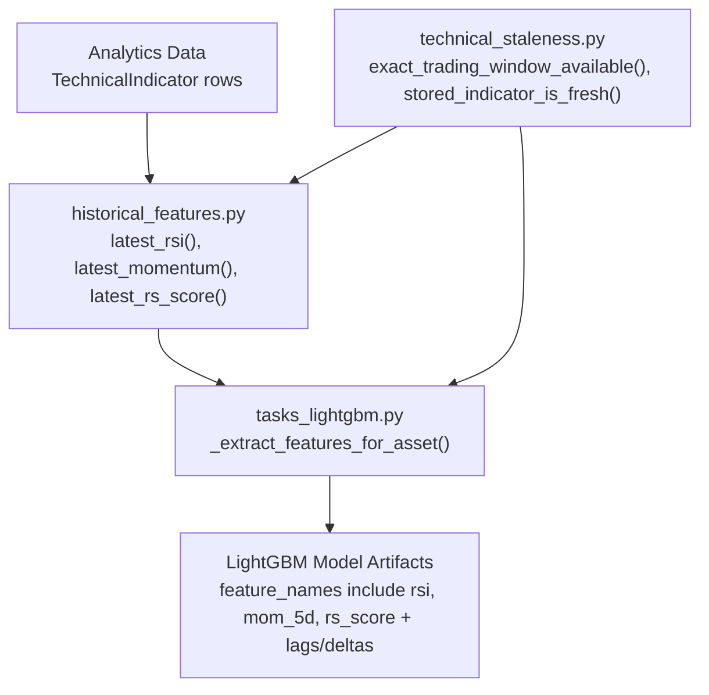
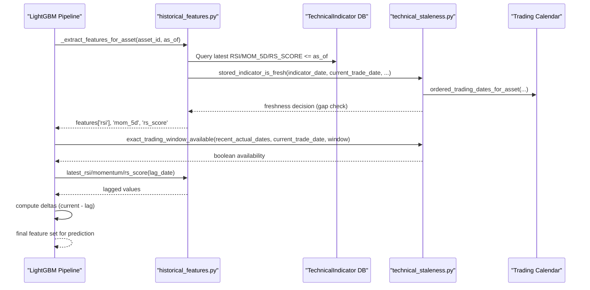
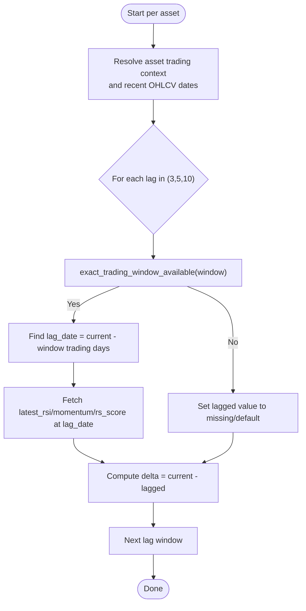
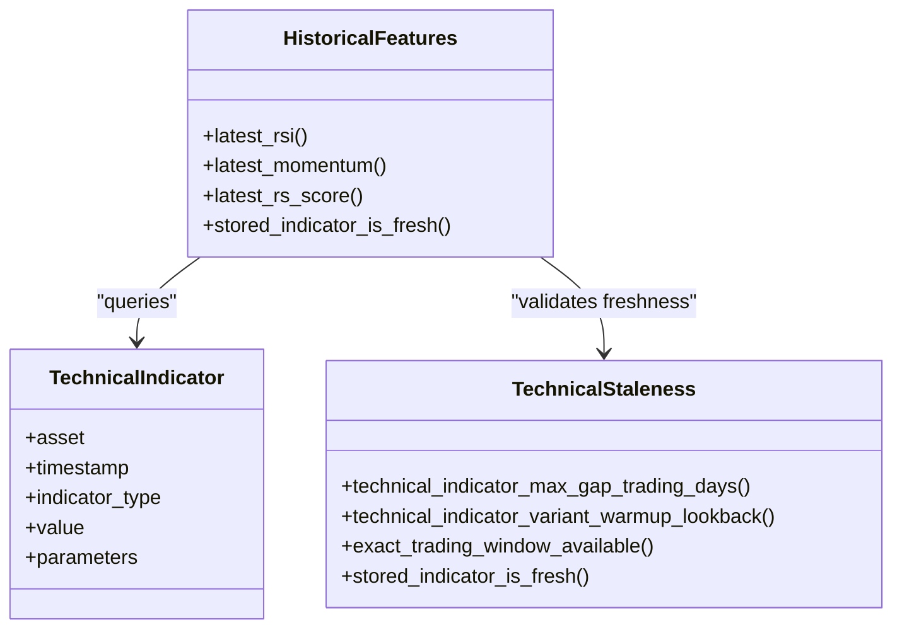
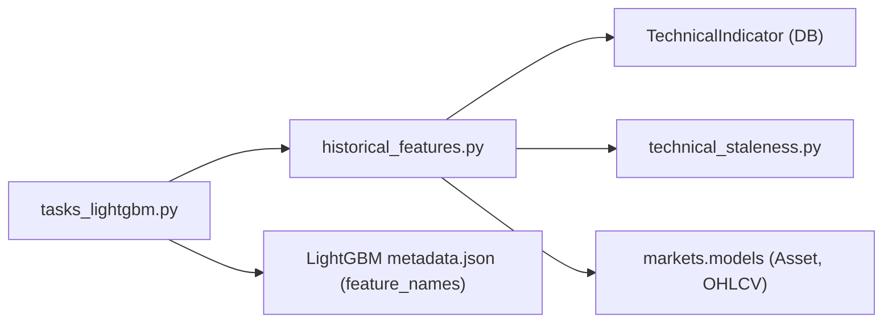

# Technical Indicator Extraction

<cite>
**Referenced Files in This Document**
- [historical_features.py](file://apps/prediction/historical_features.py)
- [tasks_lightgbm.py](file://apps/prediction/tasks_lightgbm.py)
- [models.py](file://apps/analytics/models.py)
- [technical_staleness.py](file://apps/analytics/technical_staleness.py)
- [indicator_warmup.py](file://apps/analytics/indicator_warmup.py)
- [tasks.py](file://apps/analytics/tasks.py)
- [metadata.json](file://models/lightgbm/3d_lgb-3d-2024-12-31-regstrong-v1/metadata.json)
</cite>

## Table of Contents
1. [Introduction](#introduction)
2. [Project Structure](#project-structure)
3. [Core Components](#core-components)
4. [Architecture Overview](#architecture-overview)
5. [Detailed Component Analysis](#detailed-component-analysis)
6. [Dependency Analysis](#dependency-analysis)
7. [Performance Considerations](#performance-considerations)
8. [Troubleshooting Guide](#troubleshooting-guide)
9. [Conclusion](#conclusion)

## Introduction
This document explains how technical indicators are extracted for the LightGBM pipeline, focusing on RSI, 5-day momentum (mom_5d), and relative strength scores (rs_score). It details:
- How values are pulled from upstream analytics data stored as TechnicalIndicator records.
- How lag windows of 3, 5, and 10 trading days are computed using exact trading calendar validation.
- The interaction between the historical features module and the LightGBM feature extraction pipeline.
- Handling of missing data points and staleness checks.
- Performance optimizations used when extracting indicators at scale across many assets.

## Project Structure
The indicator extraction spans three main areas:
- Upstream analytics storage and freshness logic under apps/analytics.
- Feature extraction helpers under apps/prediction/historical_features.py.
- LightGBM pipeline orchestration and feature assembly under apps/prediction/tasks_lightgbm.py.

**Diagram sources**
- [historical_features.py:142-179](file://apps/prediction/historical_features.py#L142-L179)
- [tasks_lightgbm.py:731-813](file://apps/prediction/tasks_lightgbm.py#L731-L813)
- [technical_staleness.py:157-190](file://apps/analytics/technical_staleness.py#L157-L190)

**Section sources**
- [historical_features.py:142-179](file://apps/prediction/historical_features.py#L142-L179)
- [tasks_lightgbm.py:731-813](file://apps/prediction/tasks_lightgbm.py#L731-L813)
- [technical_staleness.py:157-190](file://apps/analytics/technical_staleness.py#L157-L190)

## Core Components
- TechnicalIndicator model stores per-asset indicator values with timestamps and parameters.
- Historical features functions retrieve the latest valid indicator value for a given asset and date, enforcing parameter matching and freshness.
- Staleness utilities validate that stored indicators are recent enough based on trading calendars and indicator-specific max gaps.
- LightGBM feature extraction pulls current and lagged indicators and computes deltas for modeling.

Key responsibilities:
- Storage schema and indexing for fast retrieval by asset, timestamp, and type.
- Parameter-aware selection to ensure correct indicator variants (e.g., RSI timeperiod=14).
- Trading-calendar-aware lagging and gap checks to avoid look-ahead bias and stale inputs.

**Section sources**
- [models.py:8-43](file://apps/analytics/models.py#L8-L43)
- [historical_features.py:142-179](file://apps/prediction/historical_features.py#L142-L179)
- [technical_staleness.py:9-24](file://apps/analytics/technical_staleness.py#L9-L24)

## Architecture Overview
The end-to-end flow for technical indicator extraction into the LightGBM pipeline:

**Diagram sources**
- [tasks_lightgbm.py:731-813](file://apps/prediction/tasks_lightgbm.py#L731-L813)
- [historical_features.py:207-257](file://apps/prediction/historical_features.py#L207-L257)
- [technical_staleness.py:99-120](file://apps/analytics/technical_staleness.py#L99-L120)
- [technical_staleness.py:157-190](file://apps/analytics/technical_staleness.py#L157-L190)

## Detailed Component Analysis

### TechnicalIndicator model and storage
- Stores one row per asset, timestamp, indicator_type, and parameters combination.
- Indexed on (asset, timestamp, indicator_type) for efficient queries.
- Parameters allow multiple variants (e.g., different timeperiods for RSI or n_days for momentum).

Implications:
- Queries must match both indicator_type and relevant parameters to select the correct variant.
- Bulk writes and ignore_conflicts are used during backfills to handle duplicates efficiently.

**Section sources**
- [models.py:8-43](file://apps/analytics/models.py#L8-L43)
- [tasks.py:698-730](file://apps/analytics/tasks.py#L698-L730)

### Indicator retrieval helpers: latest_rsi, latest_momentum, latest_rs_score
- latest_rsi: selects RSI with timeperiod=14; returns default if missing or stale.
- latest_momentum: selects MOM_5D (or dynamic MOM_nD); returns default if missing or stale.
- latest_rs_score: selects RS_SCORE; returns default if missing or stale.

All helpers:
- Resolve the asset’s trading context (current trade date and position map).
- Match indicator rows by type and parameters.
- Enforce freshness via stored_indicator_is_fresh with indicator-specific max gaps.
- Convert values to Decimal safely with defaults for missing data.

**Section sources**
- [historical_features.py:207-231](file://apps/prediction/historical_features.py#L207-L231)
- [historical_features.py:234-257](file://apps/prediction/historical_features.py#L234-L257)
- [historical_features.py:325-348](file://apps/prediction/historical_features.py#L325-L348)
- [historical_features.py:142-179](file://apps/prediction/historical_features.py#L142-L179)

### Lag window implementation for 3, 5, and 10 days
- LAG_WINDOWS is defined as (3, 5, 10).
- For each lag window, the pipeline checks exact_trading_window_available using recent OHLCV dates and the current trade date.
- If available, it identifies the lag_date exactly N trading days before the current date and retrieves lagged indicators via the same helper functions.
- Deltas are computed as current minus lagged values for each indicator.

**Diagram sources**
- [tasks_lightgbm.py:770-813](file://apps/prediction/tasks_lightgbm.py#L770-L813)
- [technical_staleness.py:157-170](file://apps/analytics/technical_staleness.py#L157-L170)

**Section sources**
- [tasks_lightgbm.py:163-163](file://apps/prediction/tasks_lightgbm.py#L163-L163)
- [tasks_lightgbm.py:770-813](file://apps/prediction/tasks_lightgbm.py#L770-L813)
- [technical_staleness.py:157-170](file://apps/analytics/technical_staleness.py#L157-L170)

### Interaction with TechnicalIndicator models and historical features
- The LightGBM pipeline calls _extract_features_for_asset to assemble features.
- Current indicators are fetched via latest_rsi, latest_momentum, latest_rs_score.
- Staleness checks use indicator-specific max gaps (e.g., RSI max gap 3, RS_SCORE max gap 5).
- Warm-up lookbacks define minimum history required for reliable indicator computation (e.g., RSI warm-up 14 days).

**Diagram sources**
- [models.py:8-43](file://apps/analytics/models.py#L8-L43)
- [historical_features.py:142-179](file://apps/prediction/historical_features.py#L142-L179)
- [technical_staleness.py:64-78](file://apps/analytics/technical_staleness.py#L64-L78)
- [technical_staleness.py:173-190](file://apps/analytics/technical_staleness.py#L173-L190)

**Section sources**
- [tasks_lightgbm.py:731-768](file://apps/prediction/tasks_lightgbm.py#L731-L768)
- [technical_staleness.py:9-24](file://apps/analytics/technical_staleness.py#L9-L24)
- [indicator_warmup.py:4-23](file://apps/analytics/indicator_warmup.py#L4-L23)

### Examples of indicator computation and missing data handling
- RSI: latest_rsi uses timeperiod=14; if no fresh RSI exists, returns default (e.g., 50). Missing data is preserved according to missing_value_strategy and then converted to float with safe fallbacks.
- Momentum (mom_5d): latest_momentum uses n_days=5; if not fresh, returns default (e.g., 0).
- Relative strength score (rs_score): latest_rs_score returns default (e.g., 0.5) if missing or stale.
- Deltas: computed only when exact trading windows are available; otherwise, lagged values may be missing and deltas reflect that.

Behavior highlights:
- Defaults are applied consistently to avoid NaN propagation.
- Exact trading calendar validation ensures lagged values align with actual trading days, preventing leakage.
- Warm-up lookbacks ensure indicators have sufficient prior data to be meaningful.

**Section sources**
- [historical_features.py:207-231](file://apps/prediction/historical_features.py#L207-L231)
- [historical_features.py:234-257](file://apps/prediction/historical_features.py#L234-L257)
- [historical_features.py:325-348](file://apps/prediction/historical_features.py#L325-L348)
- [tasks_lightgbm.py:745-768](file://apps/prediction/tasks_lightgbm.py#L745-L768)
- [tasks_lightgbm.py:770-813](file://apps/prediction/tasks_lightgbm.py#L770-L813)

### Performance optimization techniques for large-scale extraction
- In-memory cache keyed by (asset_id, as_of, indicator_type, parameters, limit) reduces repeated DB queries within a single extraction run.
- Batched retrieval of candidate indicator rows with order_by('-timestamp') and slicing limits query size while still allowing best-match selection by parameter compatibility scoring.
- Trading calendar caching via _asset_trading_context avoids repeated lookups for the same asset/date context.
- Bulk creation during backfills minimizes database overhead when writing large volumes of indicators.
- Indicator-specific max gaps reduce unnecessary checks and allow early exits for stale data.

**Section sources**
- [historical_features.py:15-20](file://apps/prediction/historical_features.py#L15-L20)
- [historical_features.py:36-48](file://apps/prediction/historical_features.py#L36-L48)
- [historical_features.py:86-139](file://apps/prediction/historical_features.py#L86-L139)
- [tasks.py:727-730](file://apps/analytics/tasks.py#L727-L730)

## Dependency Analysis
- historical_features.py depends on:
  - apps.analytics.models.TechnicalIndicator for querying stored indicators.
  - apps.analytics.technical_staleness for trading calendar and freshness checks.
  - apps.markets.models.Asset and OHLCV for trading context and recent price/volume data.
- tasks_lightgbm.py orchestrates feature extraction and consumes outputs from historical_features.py.
- metadata.json files confirm the expected feature names consumed by LightGBM artifacts, including rsi, mom_5d, rs_score and their lag/delta variants.

**Diagram sources**
- [historical_features.py:1-13](file://apps/prediction/historical_features.py#L1-L13)
- [tasks_lightgbm.py:731-813](file://apps/prediction/tasks_lightgbm.py#L731-L813)
- [metadata.json:4-24](file://models/lightgbm/3d_lgb-3d-2024-12-31-regstrong-v1/metadata.json#L4-L24)

**Section sources**
- [metadata.json:4-24](file://models/lightgbm/3d_lgb-3d-2024-12-31-regstrong-v1/metadata.json#L4-L24)
- [tasks_lightgbm.py:731-813](file://apps/prediction/tasks_lightgbm.py#L731-L813)
- [historical_features.py:1-13](file://apps/prediction/historical_features.py#L1-L13)

## Performance Considerations
- Use runtime caches for indicator lookups to minimize DB round-trips during batch processing.
- Limit candidate rows and rank by parameter compatibility to avoid scanning entire histories.
- Leverage indicator-specific max gaps to short-circuit stale checks quickly.
- Ensure warm-up periods are respected to avoid computing indicators without sufficient history.
- Prefer bulk operations when backfilling indicators to reduce write overhead.

[No sources needed since this section provides general guidance]

## Troubleshooting Guide
Common issues and resolutions:
- Missing RSI or momentum:
  - Verify that TechnicalIndicator rows exist for the asset and date range with correct indicator_type and parameters.
  - Check stored_indicator_is_fresh thresholds (e.g., RSI max gap 3, RS_SCORE max gap 5).
- Incorrect lagged values:
  - Confirm exact_trading_window_available returns True for the desired lag window.
  - Validate recent_actual_dates and current_trade_date alignment with the trading calendar.
- Unexpected defaults:
  - Inspect missing_value_strategy and preserve_missing flags in feature extraction to understand default behavior.
- Stale indicators:
  - Review BASE_MAX_GAP_TRADING_DAYS and indicator warm-up lookbacks to ensure data freshness expectations are met.

**Section sources**
- [technical_staleness.py:9-24](file://apps/analytics/technical_staleness.py#L9-L24)
- [technical_staleness.py:173-190](file://apps/analytics/technical_staleness.py#L173-L190)
- [tasks_lightgbm.py:745-768](file://apps/prediction/tasks_lightgbm.py#L745-L768)
- [tasks_lightgbm.py:770-813](file://apps/prediction/tasks_lightgbm.py#L770-L813)

## Conclusion
The LightGBM pipeline extracts RSI, 5-day momentum, and relative strength scores from upstream analytics by querying TechnicalIndicator records with strict parameter matching and trading-calendar-aware freshness checks. Lag windows of 3, 5, and 10 days are validated using exact trading day distances, and deltas are computed to enrich the feature set. Robust defaults and warm-up lookbacks ensure stable inputs even when data is missing or stale. Performance is optimized through caching, limited candidate scans, and bulk operations, enabling scalable indicator extraction across large universes of assets.

[No sources needed since this section summarizes without analyzing specific files]