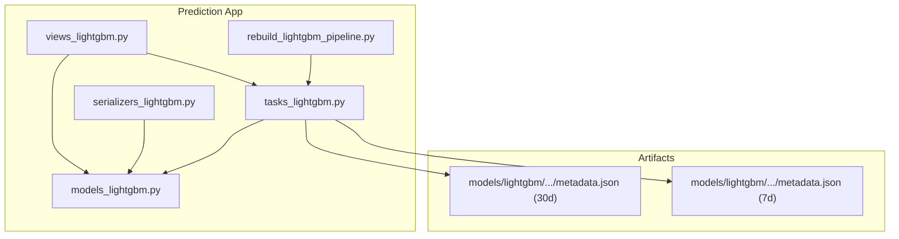
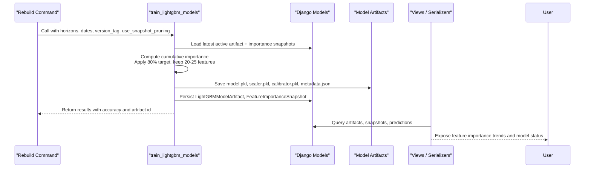
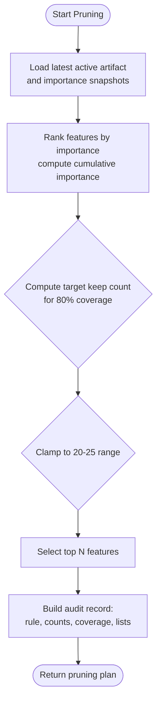
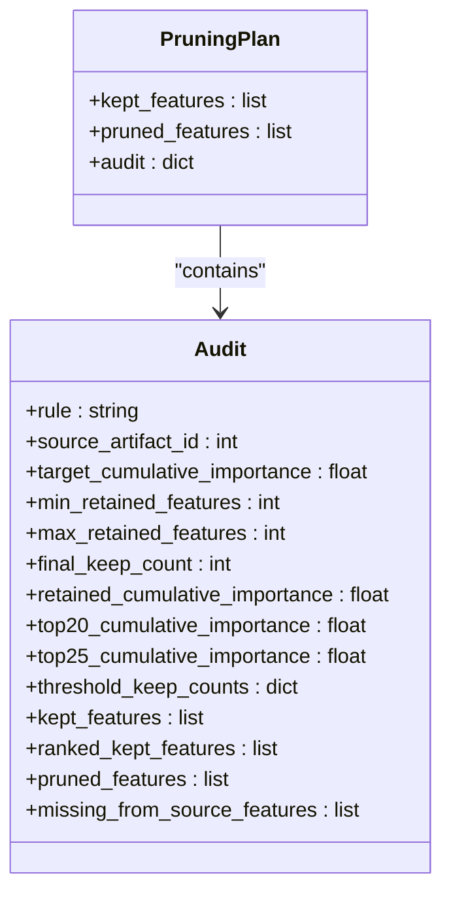
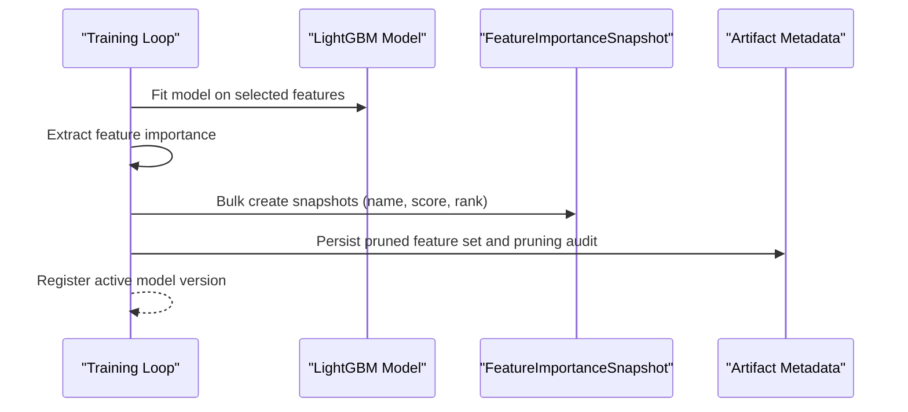
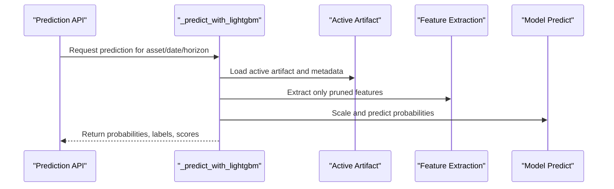
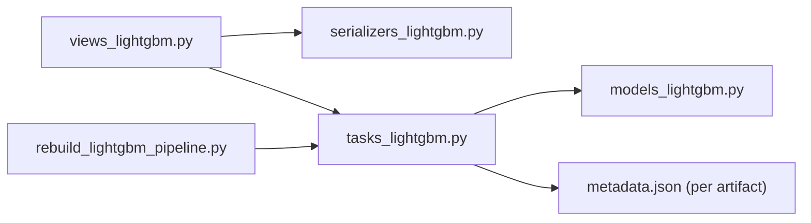

# Feature Pruning & Optimization

<cite>
**Referenced Files in This Document**
- [tasks_lightgbm.py](file://apps/prediction/tasks_lightgbm.py)
- [models_lightgbm.py](file://apps/prediction/models_lightgbm.py)
- [views_lightgbm.py](file://apps/prediction/views_lightgbm.py)
- [serializers_lightgbm.py](file://apps/prediction/serializers_lightgbm.py)
- [rebuild_lightgbm_pipeline.py](file://apps/prediction/management/commands/rebuild_lightgbm_pipeline.py)
- [metadata.json (30d core80)](file://models/lightgbm/30d_lgb-30d-2024-12-31-core80-v1/metadata.json)
- [metadata.json (7d core80)](file://models/lightgbm/7d_lgb-7d-2024-12-31-core80-v1/metadata.json)
</cite>

## Table of Contents
1. Introduction
2. Project Structure
3. Core Components
4. Architecture Overview
5. Detailed Component Analysis
6. Dependency Analysis
7. Performance Considerations
8. Troubleshooting Guide
9. Conclusion
10. Appendices

## Introduction
This document explains the LightGBM feature pruning system and model optimization strategies used in the prediction pipeline. It focuses on snapshot-based feature importance analysis, a rules engine that selects a compact “core” feature set using cumulative importance thresholds, backward-compatible feature aliasing, and an audit trail for every pruning decision. It also covers automatic feature selection during training, interpretation of feature importance rankings, impact assessment on accuracy, and how pruning improves inference performance, memory usage, and interpretability.

## Project Structure
The feature pruning and optimization logic is implemented primarily in the prediction application:
- Training and pruning orchestration live in the task module.
- Data models store artifacts, predictions, ensemble weights, and historical feature importance snapshots.
- Views expose APIs to query model artifacts, feature importance trends, and trigger training or recalculation.
- Serializers define API payloads for artifacts, predictions, and snapshots.
- A management command orchestrates end-to-end retraining with optional snapshot-based pruning.
- Model metadata files persist the final selected features and pruning audit details per artifact version.

**Diagram sources**
- [tasks_lightgbm.py:72-75](file://apps/prediction/tasks_lightgbm.py#L72-L75)
- [models_lightgbm.py:7-28](file://apps/prediction/models_lightgbm.py#L7-L28)
- [views_lightgbm.py:30-121](file://apps/prediction/views_lightgbm.py#L30-L121)
- [serializers_lightgbm.py:11-58](file://apps/prediction/serializers_lightgbm.py#L11-L58)
- [rebuild_lightgbm_pipeline.py:22-57](file://apps/prediction/management/commands/rebuild_lightgbm_pipeline.py#L22-L57)

**Section sources**
- [tasks_lightgbm.py:72-75](file://apps/prediction/tasks_lightgbm.py#L72-L75)
- [models_lightgbm.py:7-28](file://apps/prediction/models_lightgbm.py#L7-L28)
- [views_lightgbm.py:30-121](file://apps/prediction/views_lightgbm.py#L30-L121)
- [serializers_lightgbm.py:11-58](file://apps/prediction/serializers_lightgbm.py#L11-L58)
- [rebuild_lightgbm_pipeline.py:22-57](file://apps/prediction/management/commands/rebuild_lightgbm_pipeline.py#L22-L57)

## Core Components
- Snapshot-based pruning rule: Uses the latest active LightGBM artifact’s stored feature importance snapshots to compute cumulative importance and select a compact feature set targeting ~80% coverage while retaining between 20 and 25 features.
- Feature aliasing: Maps legacy feature names to current names so older pipelines remain compatible without breaking inference.
- Audit trail: Every pruning decision is recorded with rule name, source artifact, thresholds, counts, retained/pruned lists, and cumulative coverage metrics.
- Automatic feature selection: During training, the system computes feature importance from the trained model, stores snapshots, and persists the pruned feature set into the artifact metadata.
- Inference alignment: At inference time, only the pruned features are extracted and fed to the model, reducing memory and improving speed.

**Section sources**
- [tasks_lightgbm.py:477-579](file://apps/prediction/tasks_lightgbm.py#L477-L579)
- [tasks_lightgbm.py:389-434](file://apps/prediction/tasks_lightgbm.py#L389-L434)
- [tasks_lightgbm.py:612-628](file://apps/prediction/tasks_lightgbm.py#L612-L628)
- [tasks_lightgbm.py:2000-2098](file://apps/prediction/tasks_lightgbm.py#L2000-L2098)
- [models_lightgbm.py:7-28](file://apps/prediction/models_lightgbm.py#L7-L28)
- [models_lightgbm.py:113-136](file://apps/prediction/models_lightgbm.py#L113-L136)

## Architecture Overview
The pruning and optimization flow spans training, persistence, and inference:

**Diagram sources**
- [rebuild_lightgbm_pipeline.py:84-135](file://apps/prediction/management/commands/rebuild_lightgbm_pipeline.py#L84-L135)
- [tasks_lightgbm.py:477-579](file://apps/prediction/tasks_lightgbm.py#L477-L579)
- [tasks_lightgbm.py:2000-2098](file://apps/prediction/tasks_lightgbm.py#L2000-L2098)
- [views_lightgbm.py:30-121](file://apps/prediction/views_lightgbm.py#L30-L121)

## Detailed Component Analysis

### Snapshot-Based Feature Importance Analysis
- Source: The latest active LightGBM artifact is identified by horizon and readiness status.
- Data: Feature importance snapshots are read from the database and normalized to cumulative importance across all features present in the current engineered schema.
- Thresholds: The algorithm targets cumulative importance of 80% but enforces a minimum of 20 and maximum of 25 retained features. If the threshold suggests fewer than 20, it uses at least 20; if more than 25, it caps at 25.
- Output: A pruning plan includes kept and pruned feature lists, plus detailed audit fields such as top-20 and top-25 coverage and threshold-based keep counts.

**Diagram sources**
- [tasks_lightgbm.py:477-579](file://apps/prediction/tasks_lightgbm.py#L477-L579)

**Section sources**
- [tasks_lightgbm.py:477-579](file://apps/prediction/tasks_lightgbm.py#L477-L579)

### Pruning Rules Engine
- Rule identity: The rule is named to reflect its behavior (latest snapshot, cumulative 80%, core 20–25).
- Latest snapshot comparison: The engine compares the current engineered feature set against the source artifact’s stored importance ranking to decide what to keep.
- Backward compatibility: Legacy feature aliases map old names to new names so older pipelines can still resolve values during inference.
- Audit trail: The pruning plan records the rule, source artifact identifiers, thresholds, counts, retained/pruned lists, and missing-from-source features.

**Diagram sources**
- [tasks_lightgbm.py:477-579](file://apps/prediction/tasks_lightgbm.py#L477-L579)

**Section sources**
- [tasks_lightgbm.py:389-434](file://apps/prediction/tasks_lightgbm.py#L389-L434)
- [tasks_lightgbm.py:477-579](file://apps/prediction/tasks_lightgbm.py#L477-L579)

### Automatic Feature Selection During Training
- After training, the system extracts feature importance from the model and stores a full snapshot in the database.
- The pruned feature set is persisted into the artifact metadata and used for subsequent inference.
- The rebuild command supports enabling snapshot-based pruning via a flag, allowing controlled experimentation and rollout.

**Diagram sources**
- [tasks_lightgbm.py:612-628](file://apps/prediction/tasks_lightgbm.py#L612-L628)
- [tasks_lightgbm.py:2000-2098](file://apps/prediction/tasks_lightgbm.py#L2000-L2098)
- [rebuild_lightgbm_pipeline.py:120-135](file://apps/prediction/management/commands/rebuild_lightgbm_pipeline.py#L120-L135)

**Section sources**
- [tasks_lightgbm.py:612-628](file://apps/prediction/tasks_lightgbm.py#L612-L628)
- [tasks_lightgbm.py:2000-2098](file://apps/prediction/tasks_lightgbm.py#L2000-L2098)
- [rebuild_lightgbm_pipeline.py:120-135](file://apps/prediction/management/commands/rebuild_lightgbm_pipeline.py#L120-L135)

### Inference Alignment and Memory/Performance Benefits
- During inference, only the pruned features defined in the active artifact are extracted and passed to the model.
- This reduces input vector size, lowering memory footprint and speeding up scaling and prediction steps.
- The same aliasing mechanism ensures legacy feature names still resolve correctly, preventing runtime errors when schemas evolve.

**Diagram sources**
- [tasks_lightgbm.py:2105-2201](file://apps/prediction/tasks_lightgbm.py#L2105-L2201)

**Section sources**
- [tasks_lightgbm.py:2105-2201](file://apps/prediction/tasks_lightgbm.py#L2105-L2201)

### Practical Examples and Interpretation
- Example configurations:
  - Enable snapshot-based pruning when rebuilding models via the management command flag.
  - Use version tags to preserve existing artifact families while testing new pruning strategies.
- Interpreting rankings:
  - Review the ranked kept features and their cumulative importance to understand which features drive model decisions.
  - Compare top-20 and top-25 coverage to assess how much additional importance is gained by including more features.
- Impact assessment:
  - Track accuracy changes across versions to ensure pruning does not degrade performance.
  - Inspect pruned features to identify low-value or redundant inputs removed by the rules engine.

**Section sources**
- [rebuild_lightgbm_pipeline.py:22-57](file://apps/prediction/management/commands/rebuild_lightgbm_pipeline.py#L22-L57)
- [metadata.json (30d core80):44-135](file://models/lightgbm/30d_lgb-30d-2024-12-31-core80-v1/metadata.json#L44-L135)
- [metadata.json (7d core80):44-135](file://models/lightgbm/7d_lgb-7d-2024-12-31-core80-v1/metadata.json#L44-L135)

## Dependency Analysis
Key dependencies and relationships:
- Tasks depend on Django models for artifacts, predictions, and snapshots.
- Views depend on serializers to expose data through REST endpoints.
- Management commands orchestrate training and optionally enable pruning.
- Model metadata files capture the final feature sets and pruning audits for each artifact version.

**Diagram sources**
- [tasks_lightgbm.py:72-75](file://apps/prediction/tasks_lightgbm.py#L72-L75)
- [models_lightgbm.py:7-28](file://apps/prediction/models_lightgbm.py#L7-L28)
- [views_lightgbm.py:30-121](file://apps/prediction/views_lightgbm.py#L30-L121)
- [serializers_lightgbm.py:11-58](file://apps/prediction/serializers_lightgbm.py#L11-L58)
- [rebuild_lightgbm_pipeline.py:84-135](file://apps/prediction/management/commands/rebuild_lightgbm_pipeline.py#L84-L135)

**Section sources**
- [tasks_lightgbm.py:72-75](file://apps/prediction/tasks_lightgbm.py#L72-L75)
- [models_lightgbm.py:7-28](file://apps/prediction/models_lightgbm.py#L7-L28)
- [views_lightgbm.py:30-121](file://apps/prediction/views_lightgbm.py#L30-L121)
- [serializers_lightgbm.py:11-58](file://apps/prediction/serializers_lightgbm.py#L11-L58)
- [rebuild_lightgbm_pipeline.py:84-135](file://apps/prediction/management/commands/rebuild_lightgbm_pipeline.py#L84-L135)

## Performance Considerations
- Inference speed: Reducing features to a compact core lowers matrix operations cost during scaling and prediction.
- Memory usage: Smaller input vectors reduce memory consumption per prediction batch.
- GPU acceleration: The inference path probes for GPU-capable predictors when applicable, further optimizing throughput.
- Stability: Enforcing a minimum and maximum number of retained features prevents overly aggressive pruning that could harm accuracy.

[No sources needed since this section provides general guidance]

## Troubleshooting Guide
Common issues and resolutions:
- No active artifact available: Ensure at least one LightGBM artifact is marked ready and active for the target horizon before running snapshot-based pruning.
- No feature importance snapshots: Verify that training completed successfully and snapshots were stored for the source artifact.
- Missing features from source: Some engineered features may not exist in the source artifact’s schema; these are logged in the audit under missing-from-source features.
- Aliasing mismatches: Confirm legacy aliases map to current feature names to avoid null or default values during inference.

**Section sources**
- [tasks_lightgbm.py:477-579](file://apps/prediction/tasks_lightgbm.py#L477-L579)
- [tasks_lightgbm.py:389-434](file://apps/prediction/tasks_lightgbm.py#L389-L434)

## Conclusion
The LightGBM feature pruning system leverages snapshot-based importance analysis to maintain a compact, high-impact feature set aligned with business goals (80% cumulative importance, 20–25 retained features). The rules engine ensures reproducibility through detailed audit trails and maintains backward compatibility via feature aliasing. By aligning training and inference to the pruned feature set, the system improves inference performance and memory efficiency while preserving model accuracy and interpretability.

[No sources needed since this section summarizes without analyzing specific files]

## Appendices

### API Endpoints for Monitoring and Control
- List and filter model artifacts by horizon.
- Retrieve feature importance trends grouped by horizon and top features.
- Trigger training and recalculation tasks for LightGBM models.

**Section sources**
- [views_lightgbm.py:30-121](file://apps/prediction/views_lightgbm.py#L30-L121)
- [views_lightgbm.py:124-269](file://apps/prediction/views_lightgbm.py#L124-L269)

### Data Models Reference
- LightGBMModelArtifact: Stores model binaries, metrics, feature names, training windows, and metadata including pruning details.
- FeatureImportanceSnapshot: Historical per-feature importance for each artifact, enabling trend analysis and pruning decisions.
- EnsembleWeightSnapshot: Tracks ensemble weights over time for multi-model combinations.

**Section sources**
- [models_lightgbm.py:7-28](file://apps/prediction/models_lightgbm.py#L7-L28)
- [models_lightgbm.py:97-136](file://apps/prediction/models_lightgbm.py#L97-L136)