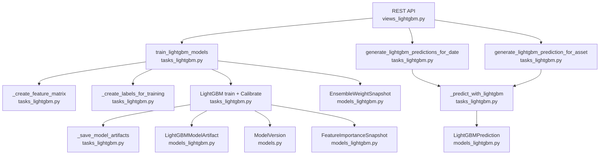
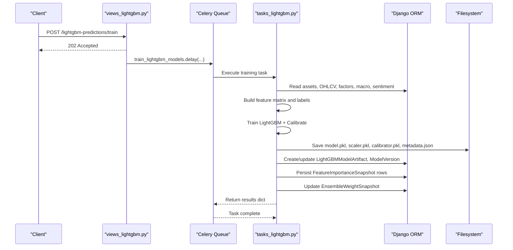
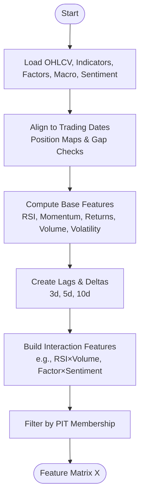
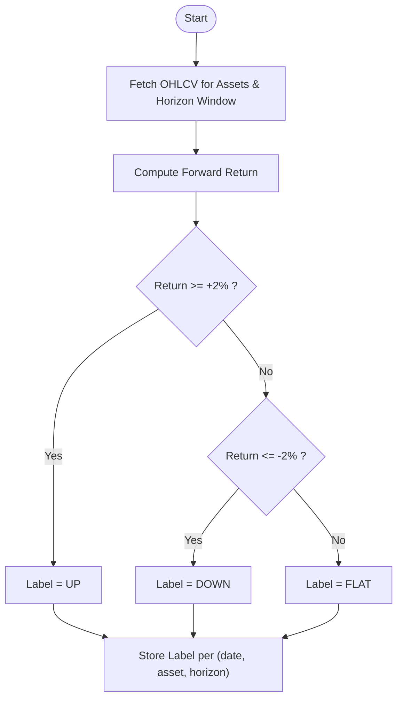
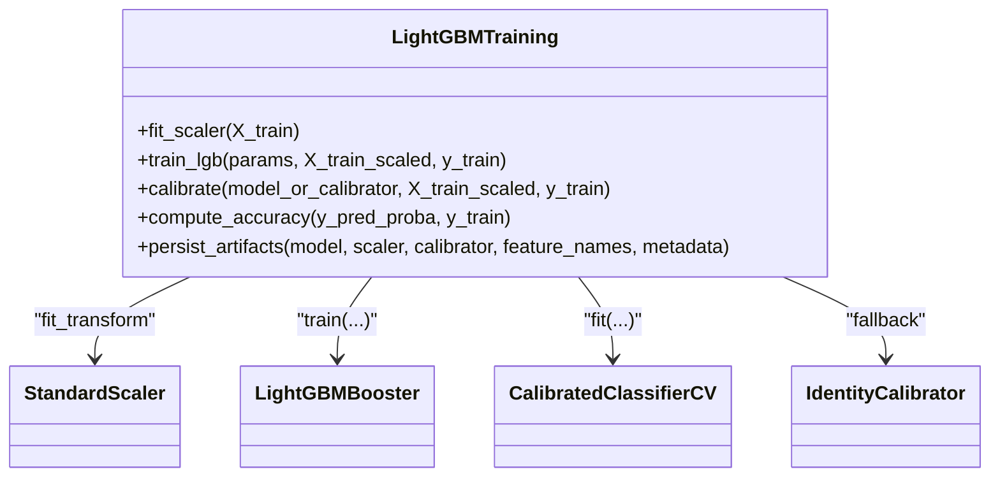
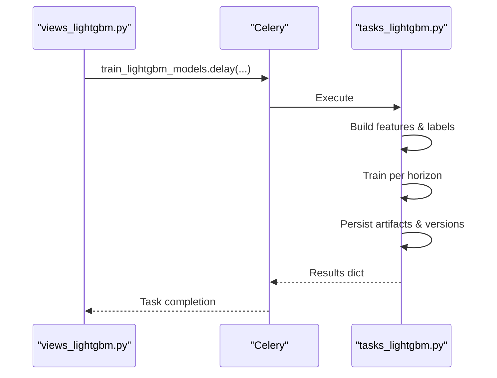
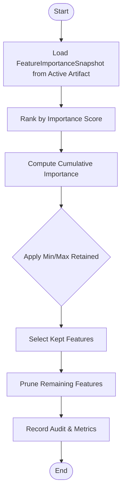
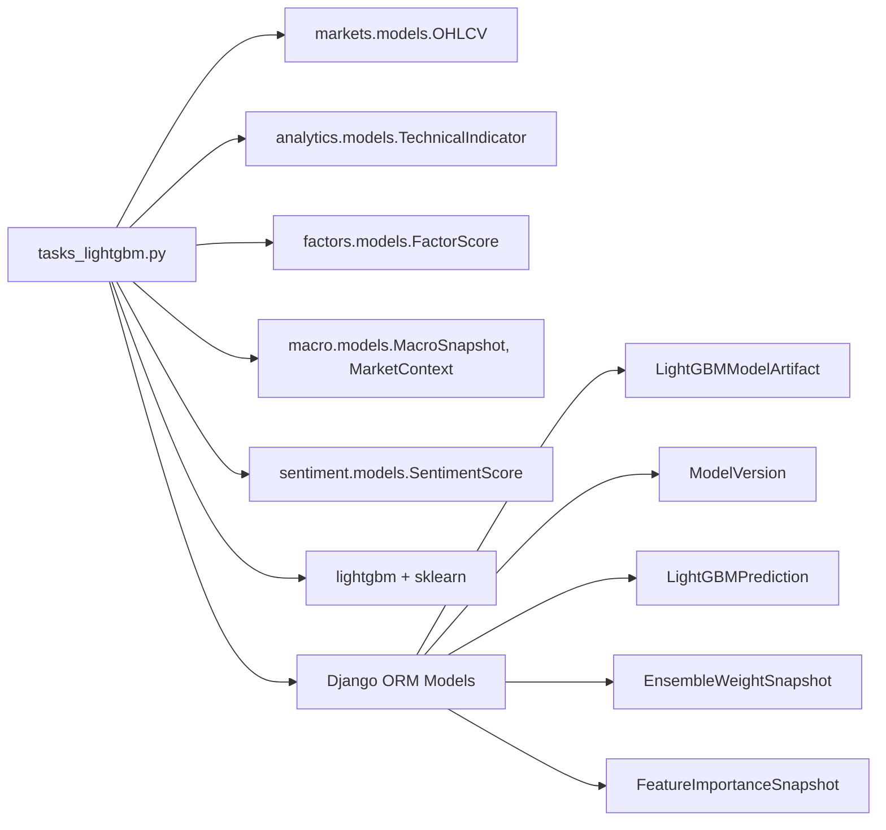

# LightGBM Model Training

<cite>
**Referenced Files in This Document**
- [tasks_lightgbm.py](file://apps/prediction/tasks_lightgbm.py)
- [models_lightgbm.py](file://apps/prediction/models_lightgbm.py)
- [serializers_lightgbm.py](file://apps/prediction/serializers_lightgbm.py)
- [views_lightgbm.py](file://apps/prediction/views_lightgbm.py)
- [models.py](file://apps/prediction/models.py)
- [celery.py](file://config/celery.py)
- [rebuild_lightgbm_pipeline.py](file://apps/prediction/management/commands/rebuild_lightgbm_pipeline.py)
- [technical_guide.md](file://TECHNICAL_GUIDE.md)
</cite>

## Table of Contents
1. [Introduction](#introduction)
2. [Project Structure](#project-structure)
3. [Core Components](#core-components)
4. [Architecture Overview](#architecture-overview)
5. [Detailed Component Analysis](#detailed-component-analysis)
6. [Dependency Analysis](#dependency-analysis)
7. [Performance Considerations](#performance-considerations)
8. [Troubleshooting Guide](#troubleshooting-guide)
9. [Conclusion](#conclusion)
10. [Appendices](#appendices)

## Introduction
This document explains the end-to-end LightGBM model training workflow used to predict short-horizon asset direction (UP, FLAT, DOWN) for 3, 7, and 30-day horizons. It covers data preparation from upstream sources (markets, analytics, factors, macro, sentiment), feature engineering with technical indicators and interaction features, model configuration and calibration, hyperparameter defaults, validation and metrics, Celery task orchestration for distributed training and batch inference, error handling, artifact persistence, feature pruning based on importance snapshots, GPU acceleration support during inference, ensemble weight integration, and practical usage patterns for monitoring and versioning.

## Project Structure
The LightGBM pipeline lives primarily under the prediction app:
- Tasks implement training, inference, and orchestration via Celery.
- Models define artifacts, predictions, ensemble weights, and feature importance snapshots.
- Serializers expose these models through REST APIs.
- Views provide endpoints to trigger training, recalculate predictions, and query results.
- A management command orchestrates backfill and retraining.

**Diagram sources**
- [views_lightgbm.py:195-269](file://apps/prediction/views_lightgbm.py#L195-L269)
- [tasks_lightgbm.py:1849-2098](file://apps/prediction/tasks_lightgbm.py#L1849-L2098)
- [tasks_lightgbm.py:2105-2304](file://apps/prediction/tasks_lightgbm.py#L2105-L2304)
- [models_lightgbm.py:7-137](file://apps/prediction/models_lightgbm.py#L7-L137)
- [models.py:7-41](file://apps/prediction/models.py#L7-L41)

**Section sources**
- [views_lightgbm.py:1-282](file://apps/prediction/views_lightgbm.py#L1-L282)
- [tasks_lightgbm.py:1-2304](file://apps/prediction/tasks_lightgbm.py#L1-L2304)
- [models_lightgbm.py:1-137](file://apps/prediction/models_lightgbm.py#L1-L137)
- [models.py:1-107](file://apps/prediction/models.py#L1-L107)
- [celery.py:1-17](file://config/celery.py#L1-L17)
- [rebuild_lightgbm_pipeline.py:1-145](file://apps/prediction/management/commands/rebuild_lightgbm_pipeline.py#L1-L145)

## Core Components
- Data preparation and feature matrix construction across markets, analytics, factors, macro, and sentiment.
- Label creation using forward returns over horizon windows.
- LightGBM training with StandardScaler and probability calibration.
- Artifact persistence (model, scaler, calibrator, metadata).
- Versioning and active model promotion.
- Feature importance snapshots and snapshot-based pruning.
- Ensemble weight refresh integrating LightGBM, LSTM, and heuristic baselines.
- Celery tasks for training and batch/single-asset inference.
- REST endpoints to trigger jobs and retrieve results.

**Section sources**
- [tasks_lightgbm.py:1162-1760](file://apps/prediction/tasks_lightgbm.py#L1162-L1760)
- [tasks_lightgbm.py:1763-1843](file://apps/prediction/tasks_lightgbm.py#L1763-L1843)
- [tasks_lightgbm.py:1849-2098](file://apps/prediction/tasks_lightgbm.py#L1849-L2098)
- [models_lightgbm.py:7-137](file://apps/prediction/models_lightgbm.py#L7-L137)
- [models.py:7-41](file://apps/prediction/models.py#L7-L41)
- [views_lightgbm.py:124-269](file://apps/prediction/views_lightgbm.py#L124-L269)

## Architecture Overview
The system is a Django application backed by Celery workers. The API triggers asynchronous tasks that build features, train models, persist artifacts, and update versions. Inference tasks load the active model artifacts, compute features per asset/date, run predictions, and store results.

**Diagram sources**
- [views_lightgbm.py:195-205](file://apps/prediction/views_lightgbm.py#L195-L205)
- [tasks_lightgbm.py:1849-2098](file://apps/prediction/tasks_lightgbm.py#L1849-L2098)
- [celery.py:1-17](file://config/celery.py#L1-L17)

## Detailed Component Analysis

### Data Preparation and Feature Engineering
- Sources:
  - Markets: OHLCV history and trading calendar alignment.
  - Analytics: Technical indicators (RSI, momentum, returns, relative volume, realized volatility).
  - Factors: Composite and component scores (PE/PB percentiles, ROE trend, main force flow, margin flow, composite score).
  - Macro: PMI series and yield curve; macro phase context.
  - Sentiment: Asset-level sentiment scores and rolling averages.
- Processing:
  - Per-asset time series are aligned to trading dates with position maps and gap checks.
  - Lagged features and deltas are created for RSI, momentum, and RS score at multiple windows.
  - Interaction features multiply pairs such as RSI × relative volume, RSI × macro phase, factor composite × sentiment, northbound flow × momentum, PE percentile × macro phase.
  - Missing value strategy supports legacy neutral fill or native NaN preservation.
  - PIT membership filtering ensures only in-universe assets contribute per date.

**Diagram sources**
- [tasks_lightgbm.py:1162-1760](file://apps/prediction/tasks_lightgbm.py#L1162-L1760)
- [tasks_lightgbm.py:380-408](file://apps/prediction/tasks_lightgbm.py#L380-L408)

**Section sources**
- [tasks_lightgbm.py:315-408](file://apps/prediction/tasks_lightgbm.py#L315-L408)
- [tasks_lightgbm.py:731-1051](file://apps/prediction/tasks_lightgbm.py#L731-L1051)
- [tasks_lightgbm.py:1162-1760](file://apps/prediction/tasks_lightgbm.py#L1162-L1760)

### Label Creation
- Labels are derived from forward returns over each horizon window:
  - UP if return ≥ +2%
  - DOWN if return ≤ −2%
  - FLAT otherwise
- Labels are aligned to the same PIT universe used for features.

**Diagram sources**
- [tasks_lightgbm.py:1763-1843](file://apps/prediction/tasks_lightgbm.py#L1763-L1843)

**Section sources**
- [tasks_lightgbm.py:1763-1843](file://apps/prediction/tasks_lightgbm.py#L1763-L1843)

### Model Configuration and Calibration
- Scaler: StandardScaler fitted on training features.
- LightGBM parameters:
  - objective: multiclass
  - num_class: 3
  - num_leaves: 15
  - learning_rate: 0.05
  - feature_fraction: 0.6
  - bagging_fraction: 0.8
  - bagging_freq: 5
  - lambda_l1: 1.0
  - lambda_l2: 1.0
  - min_data_in_leaf: 50
  - random_state: 42
  - verbose: -1
- Calibration:
  - If the model supports predict_proba or decision_function, use CalibratedClassifierCV with sigmoid method and CV=5.
  - Otherwise, an IdentityCalibrator passes raw probabilities directly.

**Diagram sources**
- [tasks_lightgbm.py:1963-1990](file://apps/prediction/tasks_lightgbm.py#L1963-L1990)
- [tasks_lightgbm.py:170-181](file://apps/prediction/tasks_lightgbm.py#L170-L181)

**Section sources**
- [tasks_lightgbm.py:1963-1990](file://apps/prediction/tasks_lightgbm.py#L1963-L1990)
- [technical_guide.md:392-405](file://TECHNICAL_GUIDE.md#L392-L405)

### Hyperparameter Tuning Strategies
- Current defaults emphasize regularization and subsampling to mitigate noise and weak signal.
- Practical strategies:
  - Grid or randomized search over learning_rate, num_leaves, feature_fraction, bagging_fraction, lambda_l1, lambda_l2, min_data_in_leaf.
  - Use cross-validation within the training task or external tuning scripts while preserving PIT alignment and label definitions.
  - Track top features and accuracy per run; compare across runs to select best configurations.
  - Consider early stopping if supported by your LightGBM setup.

[No sources needed since this section provides general guidance]

### Validation Approaches
- In-sample accuracy is computed from calibrated probabilities.
- For robust validation:
  - Implement walk-forward or time-series cross-validation respecting temporal order.
  - Evaluate out-of-sample performance using held-out windows not seen during training.
  - Record calibration quality (e.g., reliability diagrams) and hit rates per horizon.
  - Compare against baseline heuristics and LSTM to assess incremental value.

[No sources needed since this section provides general guidance]

### Celery Task Architecture
- Celery app configured to read settings and autodiscover tasks.
- Training task:
  - train_lightgbm_models trains 3/7/30-day models, persists artifacts, updates versions, stores feature importance snapshots, and refreshes ensemble weights.
- Inference tasks:
  - generate_lightgbm_predictions_for_date processes all tradeable assets for a given date and horizons.
  - generate_lightgbm_prediction_for_asset processes a single asset.
- Error handling:
  - Each horizon result records status, metrics, and failure reasons.
  - Insufficient data leads to a specific status without failing the entire job.

**Diagram sources**
- [celery.py:1-17](file://config/celery.py#L1-L17)
- [views_lightgbm.py:195-205](file://apps/prediction/views_lightgbm.py#L195-L205)
- [tasks_lightgbm.py:1849-2098](file://apps/prediction/tasks_lightgbm.py#L1849-L2098)

**Section sources**
- [celery.py:1-17](file://config/celery.py#L1-L17)
- [views_lightgbm.py:195-269](file://apps/prediction/views_lightgbm.py#L195-L269)
- [tasks_lightgbm.py:1849-2304](file://apps/prediction/tasks_lightgbm.py#L1849-L2304)

### Batch Processing Capabilities
- Batch inference:
  - generate_lightgbm_predictions_for_date iterates effective_universe_tradeable_assets and processes all horizons per asset.
  - Uses runtime caching to avoid repeated model loads and feature computations.
- Single-asset inference:
  - generate_lightgbm_prediction_for_asset targets one asset efficiently.
- Management command:
  - rebuild_lightgbm_pipeline can optionally skip backfill and run retraining directly.

**Section sources**
- [tasks_lightgbm.py:2204-2304](file://apps/prediction/tasks_lightgbm.py#L2204-L2304)
- [rebuild_lightgbm_pipeline.py:84-145](file://apps/prediction/management/commands/rebuild_lightgbm_pipeline.py#L84-L145)

### Error Handling Mechanisms
- Graceful handling of missing LightGBM installation returns a structured unavailable result per horizon.
- Insufficient training samples mark a horizon as insufficient_data rather than failing the whole job.
- Exceptions during training are caught and recorded in results with reason strings.
- Inference handles missing model artifacts and unknown assets gracefully.

**Section sources**
- [tasks_lightgbm.py:1870-1878](file://apps/prediction/tasks_lightgbm.py#L1870-L1878)
- [tasks_lightgbm.py:1952-1958](file://apps/prediction/tasks_lightgbm.py#L1952-L1958)
- [tasks_lightgbm.py:2089-2094](file://apps/prediction/tasks_lightgbm.py#L2089-L2094)
- [tasks_lightgbm.py:2268-2271](file://apps/prediction/tasks_lightgbm.py#L2268-L2271)

### Model Artifact Persistence
- Artifacts saved per horizon/version include:
  - model.pkl, scaler.pkl, calibrator.pkl, metadata.json
- Metadata includes training window, feature names, calibration method, missing value strategy, interaction features, pruning audit, and LightGBM parameters.
- Active model promotion:
  - New artifact sets is_active=True and deactivates previous active artifacts for the same horizon.
- Version registry:
  - ModelVersion tracks model_type, version, metrics, feature schema, training window, trained_at, and metadata.

**Section sources**
- [tasks_lightgbm.py:95-156](file://apps/prediction/tasks_lightgbm.py#L95-L156)
- [tasks_lightgbm.py:2003-2080](file://apps/prediction/tasks_lightgbm.py#L2003-L2080)
- [models_lightgbm.py:7-39](file://apps/prediction/models_lightgbm.py#L7-L39)
- [models.py:7-41](file://apps/prediction/models.py#L7-L41)

### Feature Pruning System Based on Importance Snapshots
- Snapshot-based pruning selects a subset of features based on cumulative importance from the latest active artifact’s FeatureImportanceSnapshot.
- Rules:
  - Target cumulative importance threshold (e.g., 80%).
  - Minimum and maximum retained features enforced (e.g., 20–25).
  - Audit captures kept/pruned lists, coverage, and thresholds.
- Integration:
  - Pruning plan applied before training to reduce feature set.
  - Pruned features recorded in artifact metadata and results.

**Diagram sources**
- [tasks_lightgbm.py:477-579](file://apps/prediction/tasks_lightgbm.py#L477-L579)

**Section sources**
- [tasks_lightgbm.py:477-579](file://apps/prediction/tasks_lightgbm.py#L477-L579)
- [tasks_lightgbm.py:1922-1933](file://apps/prediction/tasks_lightgbm.py#L1922-L1933)

### GPU Acceleration Support
- During inference, the code probes whether the loaded model supports GPU prediction via device_type='cuda' or 'gpu'.
- If supported and the calibrator is identity (probabilities already emitted), predictions may be executed on GPU for speed.
- Device capability is cached per model instance to avoid repeated probing.

**Section sources**
- [tasks_lightgbm.py:183-278](file://apps/prediction/tasks_lightgbm.py#L183-L278)

### Ensemble Weight Integration
- After training, ensemble weights are refreshed based on recent accuracies:
  - LightGBM accuracy from successful horizon results.
  - Heuristic and LSTM accuracies from their active versions.
- Weights are normalized and stored in EnsembleWeightSnapshot with basis metrics.
- An ensemble model version entry is created or updated with source metadata and weights.

**Section sources**
- [tasks_lightgbm.py:631-729](file://apps/prediction/tasks_lightgbm.py#L631-L729)
- [models_lightgbm.py:97-111](file://apps/prediction/models_lightgbm.py#L97-L111)

### Practical Examples

#### Training Configuration Example
- Use the management command to retrain with custom windows and options:
  - Specify start-date, end-date, horizons, optional version-tag, and snapshot pruning flag.
  - Optionally skip backfill to run retraining directly.

**Section sources**
- [rebuild_lightgbm_pipeline.py:22-57](file://apps/prediction/management/commands/rebuild_lightgbm_pipeline.py#L22-L57)
- [rebuild_lightgbm_pipeline.py:84-145](file://apps/prediction/management/commands/rebuild_lightgbm_pipeline.py#L84-L145)

#### Monitoring Training Progress Through Celery Tasks
- Trigger training via API:
  - POST /api/v1/lightgbm-predictions/train with optional training_start_date and training_end_date.
- Monitor:
  - Check LightGBMModelArtifact entries for status and metrics.
  - Review ModelVersion entries for active versions and timestamps.
  - Inspect FeatureImportanceSnapshot for top features and ranks.

**Section sources**
- [views_lightgbm.py:195-205](file://apps/prediction/views_lightgbm.py#L195-L205)
- [models_lightgbm.py:7-39](file://apps/prediction/models_lightgbm.py#L7-L39)
- [models.py:7-41](file://apps/prediction/models.py#L7-L41)

#### Interpreting Training Metrics
- Accuracy reflects in-sample classification performance after calibration.
- Feature counts and pruned feature counts indicate dimensionality choices.
- Top features help interpret model behavior and detect drift.

**Section sources**
- [tasks_lightgbm.py:1992-2001](file://apps/prediction/tasks_lightgbm.py#L1992-L2001)
- [tasks_lightgbm.py:2040-2055](file://apps/prediction/tasks_lightgbm.py#L2040-L2055)

#### Managing Model Versions
- New artifacts deactivate prior active artifacts per horizon.
- ModelVersion tracks lifecycle and metadata for each model type.
- Ensemble versions capture blend weights and source provenance.

**Section sources**
- [tasks_lightgbm.py:2035-2080](file://apps/prediction/tasks_lightgbm.py#L2035-L2080)
- [models.py:7-41](file://apps/prediction/models.py#L7-L41)
- [tasks_lightgbm.py:691-729](file://apps/prediction/tasks_lightgbm.py#L691-L729)

## Dependency Analysis
Key dependencies and relationships:
- Prediction tasks depend on markets, analytics, factors, macro, and sentiment models for feature extraction.
- Training depends on LightGBM and scikit-learn components.
- Artifacts and versions are persisted via Django ORM.
- Celery orchestrates asynchronous execution.

**Diagram sources**
- [tasks_lightgbm.py:26-51](file://apps/prediction/tasks_lightgbm.py#L26-L51)
- [models_lightgbm.py:7-137](file://apps/prediction/models_lightgbm.py#L7-L137)
- [models.py:7-41](file://apps/prediction/models.py#L7-L41)

**Section sources**
- [tasks_lightgbm.py:26-51](file://apps/prediction/tasks_lightgbm.py#L26-L51)
- [models_lightgbm.py:7-137](file://apps/prediction/models_lightgbm.py#L7-L137)
- [models.py:7-41](file://apps/prediction/models.py#L7-L41)

## Performance Considerations
- Feature computation uses efficient DataFrame operations and merge-asof joins aligned to trading calendars.
- Runtime caches reduce repeated model loads and feature queries during batch inference.
- GPU acceleration is probed and used when available for inference paths that emit probabilities directly.
- Conservative LightGBM parameters reduce overfitting risk but may limit capacity; tune carefully for performance gains.
- Feature pruning reduces dimensionality and improves inference speed while retaining most predictive power.

[No sources needed since this section provides general guidance]

## Troubleshooting Guide
- LightGBM not installed:
  - Training returns unavailable status per horizon; install LightGBM to proceed.
- Insufficient data:
  - Ensure adequate historical coverage and PIT membership; adjust training window.
- No active model artifact:
  - Run training first; ensure artifacts are saved and promoted as active.
- Missing indicators or factors:
  - Verify backfills for technical indicators and factor scores; check staleness utilities.
- GPU inference fallback:
  - If GPU detection fails, inference falls back to CPU automatically.

**Section sources**
- [tasks_lightgbm.py:1870-1878](file://apps/prediction/tasks_lightgbm.py#L1870-L1878)
- [tasks_lightgbm.py:1952-1958](file://apps/prediction/tasks_lightgbm.py#L1952-L1958)
- [tasks_lightgbm.py:2120-2132](file://apps/prediction/tasks_lightgbm.py#L2120-L2132)

## Conclusion
The LightGBM training pipeline integrates rich multi-source features, robust label generation, conservative model configuration, and strong artifact and version management. Celery enables scalable training and inference, while snapshot-based pruning and ensemble weighting maintain operational efficiency and adaptability. With clear APIs, commands, and persistence layers, the system supports iterative experimentation, monitoring, and production deployment.

[No sources needed since this section summarizes without analyzing specific files]

## Appendices

### API Endpoints Summary
- Train models:
  - POST /api/v1/lightgbm-predictions/train
- Recalculate predictions:
  - POST /api/v1/lightgbm-predictions/recalculate
- Batch predictions:
  - POST /api/v1/lightgbm-predictions/batch
- Query stock predictions:
  - GET /api/v1/lightgbm-predictions/{stock_code}/?date=&horizons=
- List model artifacts:
  - GET /api/v1/lightgbm-models/
- Feature importance trends:
  - GET /api/v1/lightgbm-models/feature-importance-trends/?horizon_days=&limit_models=&top_n=
- Ensemble weights:
  - GET /api/v1/ensemble-weights/

**Section sources**
- [views_lightgbm.py:30-121](file://apps/prediction/views_lightgbm.py#L30-L121)
- [views_lightgbm.py:124-269](file://apps/prediction/views_lightgbm.py#L124-L269)
- [views_lightgbm.py:272-282](file://apps/prediction/views_lightgbm.py#L272-L282)