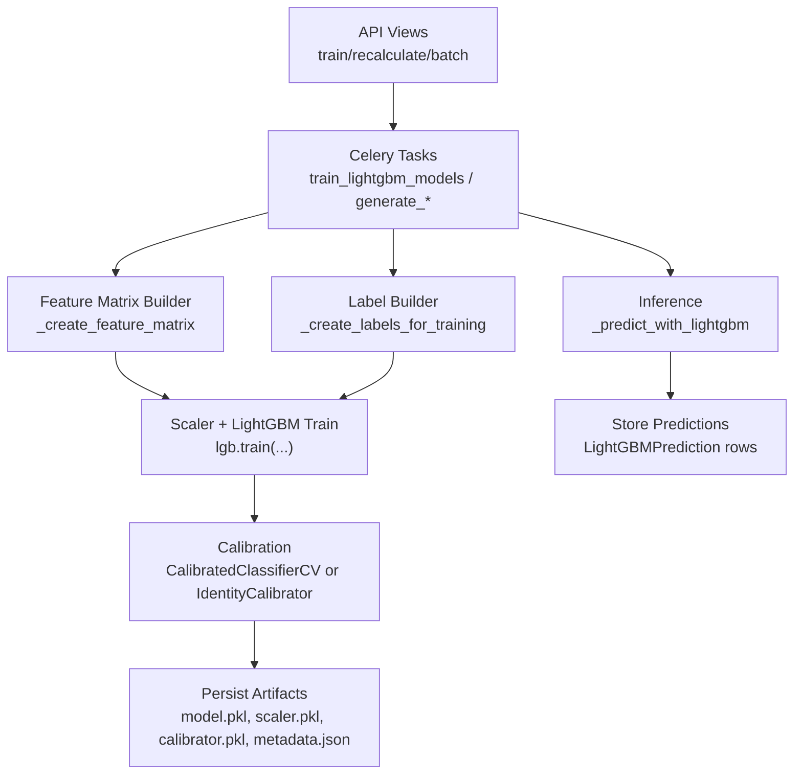
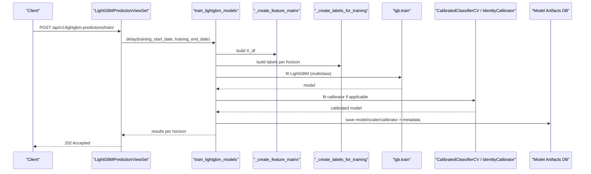
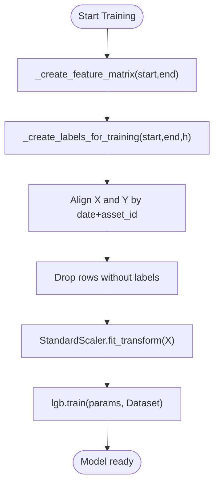
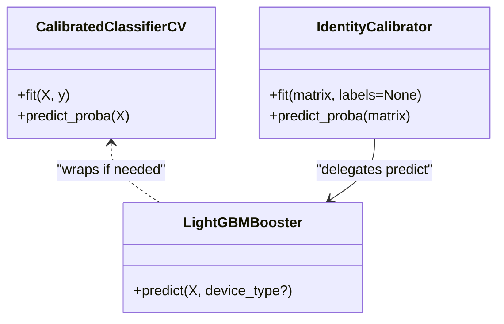
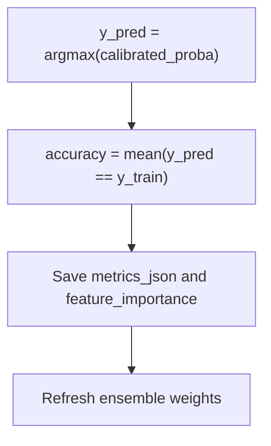
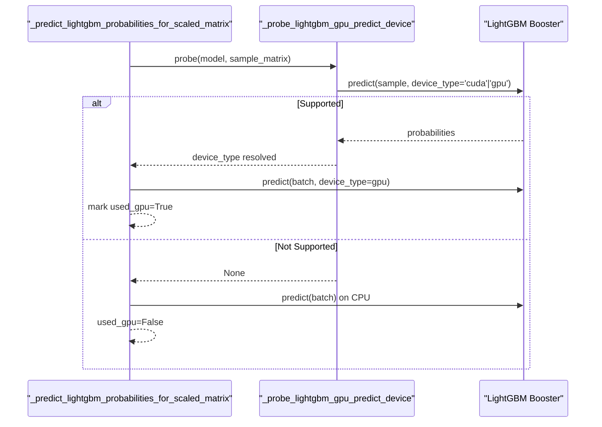
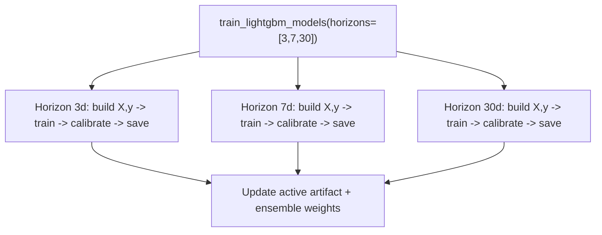
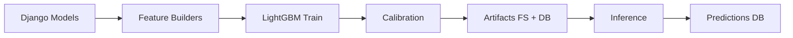

# Model Configuration & Hyperparameter Tuning

<cite>
**Referenced Files in This Document**
- [tasks_lightgbm.py](file://apps/prediction/tasks_lightgbm.py)
- [models_lightgbm.py](file://apps/prediction/models_lightgbm.py)
- [views_lightgbm.py](file://apps/prediction/views_lightgbm.py)
- [serializers_lightgbm.py](file://apps/prediction/serializers_lightgbm.py)
- [tests_lightgbm.py](file://apps/prediction/tests_lightgbm.py)
</cite>

## Table of Contents
1. [Introduction](#introduction)
2. [Project Structure](#project-structure)
3. [Core Components](#core-components)
4. [Architecture Overview](#architecture-overview)
5. [Detailed Component Analysis](#detailed-component-analysis)
6. [Dependency Analysis](#dependency-analysis)
7. [Performance Considerations](#performance-considerations)
8. [Troubleshooting Guide](#troubleshooting-guide)
9. [Conclusion](#conclusion)
10. [Appendices](#appendices)

## Introduction
This document explains how LightGBM models are configured, trained, and evaluated for multi-horizon directional predictions (3-day, 7-day, 30-day). It covers dataset preparation, label creation, model parameters, calibration, GPU acceleration support, monitoring via Celery tasks, and interpretation of training metrics. The goal is to provide a clear, code-grounded guide for configuring and tuning the LightGBM pipeline used in this project.

## Project Structure
The LightGBM workflow spans several modules:
- Data and feature engineering: building time-series features from OHLCV, technical indicators, factors, macro context, and sentiment.
- Label generation: creating UP/FLAT/DOWN labels based on forward returns over each horizon.
- Training: fitting LightGBM with scaling and optional probability calibration; persisting artifacts and metadata.
- Inference: generating per-asset predictions across horizons, storing results, and exposing APIs.
- Monitoring and orchestration: Celery tasks queue training and prediction jobs; views expose endpoints to trigger them.

**Diagram sources**
- [views_lightgbm.py:195-244](file://apps/prediction/views_lightgbm.py#L195-L244)
- [tasks_lightgbm.py:1849-2098](file://apps/prediction/tasks_lightgbm.py#L1849-L2098)
- [tasks_lightgbm.py:2105-2304](file://apps/prediction/tasks_lightgbm.py#L2105-L2304)

**Section sources**
- [views_lightgbm.py:30-282](file://apps/prediction/views_lightgbm.py#L30-L282)
- [tasks_lightgbm.py:1849-2304](file://apps/prediction/tasks_lightgbm.py#L1849-L2304)

## Core Components
- Feature matrix construction: aggregates multiple data sources into a consistent feature set per asset-date, including engineered interactions and missing-value handling.
- Label creation: defines UP/FLAT/DOWN using forward return thresholds over the target horizon.
- Model training: fits a multiclass LightGBM classifier with scaling and optional calibration; records accuracy and feature importance.
- Artifact management: persists model, scaler, calibrator, and metadata; tracks active versions and ensemble weights.
- Inference: loads active artifact, extracts features, scales, predicts probabilities (with optional GPU), stores calibrated outputs and trade decisions.

Key responsibilities and entry points:
- Training task: orchestrates feature/label creation, training, calibration, persistence, and metric recording.
- Prediction tasks: iterate assets and horizons, call inference, and persist results.
- API actions: accept requests to train, recalculate, or batch predictions.

**Section sources**
- [tasks_lightgbm.py:1162-1760](file://apps/prediction/tasks_lightgbm.py#L1162-L1760)
- [tasks_lightgbm.py:1763-1842](file://apps/prediction/tasks_lightgbm.py#L1763-L1842)
- [tasks_lightgbm.py:1849-2098](file://apps/prediction/tasks_lightgbm.py#L1849-L2098)
- [tasks_lightgbm.py:2105-2304](file://apps/prediction/tasks_lightgbm.py#L2105-L2304)
- [views_lightgbm.py:124-282](file://apps/prediction/views_lightgbm.py#L124-L282)

## Architecture Overview
The system implements a modular ML pipeline integrated with Django and Celery:
- Views expose REST endpoints to trigger training and inference.
- Celery tasks perform heavy computation off the request thread.
- Feature and label builders prepare aligned datasets for training.
- Training uses StandardScaler and LightGBM with optional CalibratedClassifierCV; identity fallback when the booster already emits probabilities.
- Artifacts are saved to disk and registered in the database; ensemble weights are refreshed based on recent performance.

**Diagram sources**
- [views_lightgbm.py:195-205](file://apps/prediction/views_lightgbm.py#L195-L205)
- [tasks_lightgbm.py:1849-2098](file://apps/prediction/tasks_lightgbm.py#L1849-L2098)

## Detailed Component Analysis

### Dataset Splitting and Labeling
- Labels are generated by computing forward returns over the horizon and binning into UP (>= +2%), DOWN (<= -2%), FLAT otherwise.
- Features are built per asset-date with careful handling of trading calendars, indicator gaps, and point-in-time membership.
- Missing values can be preserved as NaN or filled with defaults depending on strategy; interaction features are appended to the base feature set.

**Diagram sources**
- [tasks_lightgbm.py:1162-1760](file://apps/prediction/tasks_lightgbm.py#L1162-L1760)
- [tasks_lightgbm.py:1763-1842](file://apps/prediction/tasks_lightgbm.py#L1763-L1842)
- [tasks_lightgbm.py:1902-1982](file://apps/prediction/tasks_lightgbm.py#L1902-L1982)

**Section sources**
- [tasks_lightgbm.py:1162-1760](file://apps/prediction/tasks_lightgbm.py#L1162-L1760)
- [tasks_lightgbm.py:1763-1842](file://apps/prediction/tasks_lightgbm.py#L1763-L1842)

### Cross-Validation Approaches
- Probability calibration uses cross-validation internally via CalibratedClassifierCV with cv=5 when the underlying estimator supports predict_proba or decision_function.
- If the LightGBM booster already emits class probabilities, an IdentityCalibrator is used instead, bypassing CV-based calibration.

**Diagram sources**
- [tasks_lightgbm.py:170-181](file://apps/prediction/tasks_lightgbm.py#L170-L181)
- [tasks_lightgbm.py:1984-1990](file://apps/prediction/tasks_lightgbm.py#L1984-L1990)

**Section sources**
- [tasks_lightgbm.py:170-181](file://apps/prediction/tasks_lightgbm.py#L170-L181)
- [tasks_lightgbm.py:1984-1990](file://apps/prediction/tasks_lightgbm.py#L1984-L1990)

### Evaluation Metrics
- Accuracy is computed on the training set by comparing predicted classes (from calibrated probabilities) to true labels.
- Top features are ranked by gain importance and stored alongside artifact metadata.
- Ensemble weight refresh uses average accuracies across successful horizon runs to balance contributions from LightGBM, LSTM, and heuristic components.

**Diagram sources**
- [tasks_lightgbm.py:1992-2001](file://apps/prediction/tasks_lightgbm.py#L1992-L2001)
- [tasks_lightgbm.py:2040-2080](file://apps/prediction/tasks_lightgbm.py#L2040-L2080)
- [tasks_lightgbm.py:631-729](file://apps/prediction/tasks_lightgbm.py#L631-L729)

**Section sources**
- [tasks_lightgbm.py:1992-2001](file://apps/prediction/tasks_lightgbm.py#L1992-L2001)
- [tasks_lightgbm.py:2040-2080](file://apps/prediction/tasks_lightgbm.py#L2040-L2080)
- [tasks_lightgbm.py:631-729](file://apps/prediction/tasks_lightgbm.py#L631-L729)

### Key LightGBM Parameters
The training configuration includes:
- Objective and classes: multiclass with three classes (DOWN, FLAT, UP).
- Tree control: num_leaves controls tree complexity.
- Learning rate and rounds: learning_rate and num_boost_round govern step size and total iterations.
- Sampling: feature_fraction and bagging_fraction/bagging_freq introduce stochasticity for regularization.
- Regularization: lambda_l1 and lambda_l2 penalize leaf weights.
- Leaf constraints: min_data_in_leaf prevents overfitting on small leaves.
- Reproducibility: random_state fixed for deterministic runs.

These parameters are defined in the training routine and persisted in artifact metadata for reproducibility.

**Section sources**
- [tasks_lightgbm.py:1966-1982](file://apps/prediction/tasks_lightgbm.py#L1966-L1982)
- [tasks_lightgbm.py:2003-2014](file://apps/prediction/tasks_lightgbm.py#L2003-L2014)

### Class Weighting for Imbalanced Financial Data
- The current training path does not explicitly set class_weight or sample_weight in the LightGBM parameters.
- For imbalanced financial data, consider adding class weighting or sample weights during training to mitigate bias toward majority classes. This would require modifying the training routine to compute or supply weights per class or per sample before calling lgb.Dataset and lgb.train.

[No sources needed since this section provides general guidance]

### GPU Acceleration Support
- Device detection: probes the model’s predict method with device_type 'cuda' or 'gpu' to determine supported devices; result is cached per model handle.
- Memory and batching: inference prefers GPU only when the calibrator is IdentityCalibrator (booster already emits probabilities); otherwise falls back to CPU calibration.
- Performance optimization: caching of loaded artifacts and runtime caches reduce repeated IO and recomputation; GPU usage is recorded in metadata for observability.

**Diagram sources**
- [tasks_lightgbm.py:202-278](file://apps/prediction/tasks_lightgbm.py#L202-L278)

**Section sources**
- [tasks_lightgbm.py:202-278](file://apps/prediction/tasks_lightgbm.py#L202-L278)

### Model Calibration
- When the underlying estimator supports predict_proba or decision_function, CalibratedClassifierCV with sigmoid method and cv=5 is used to calibrate probabilities.
- If the LightGBM booster already emits class probabilities, IdentityCalibrator is used to pass through raw probabilities unchanged.
- During inference, both raw and calibrated probabilities are stored for auditability.

**Section sources**
- [tasks_lightgbm.py:170-181](file://apps/prediction/tasks_lightgbm.py#L170-L181)
- [tasks_lightgbm.py:1984-1990](file://apps/prediction/tasks_lightgbm.py#L1984-L1990)
- [tasks_lightgbm.py:2163-2195](file://apps/prediction/tasks_lightgbm.py#L2163-L2195)

### Practical Training Configurations by Horizon
- Horizons: 3-day, 7-day, 30-day are supported and trained independently in a single run.
- Each horizon builds its own labels and trains a separate model; feature sets may be pruned based on historical feature importance snapshots to retain top contributors within bounds.
- Versioning: model versions encode horizon and training end date, with optional tags; active version is tracked and persisted.

**Diagram sources**
- [tasks_lightgbm.py:1849-1919](file://apps/prediction/tasks_lightgbm.py#L1849-L1919)
- [tasks_lightgbm.py:1922-2098](file://apps/prediction/tasks_lightgbm.py#L1922-L2098)

**Section sources**
- [tasks_lightgbm.py:1849-2098](file://apps/prediction/tasks_lightgbm.py#L1849-L2098)

### Monitoring Training Progress Through Celery Tasks
- Training is queued via Celery: POST /api/v1/lightgbm-predictions/train triggers train_lightgbm_models.delay(...).
- Recalculation and batch prediction are also queued via Celery tasks to avoid blocking the API.
- Results include status, accuracy, artifact IDs, and model versions per horizon.

**Section sources**
- [views_lightgbm.py:195-244](file://apps/prediction/views_lightgbm.py#L195-L244)
- [tasks_lightgbm.py:1849-2098](file://apps/prediction/tasks_lightgbm.py#L1849-L2098)

### Interpreting Training Metrics
- Accuracy: overall fraction of correct predictions on the training set; useful for quick sanity checks but not sufficient alone for imbalanced markets.
- Feature importance: gain-based ranking helps understand drivers; stored per artifact and snapshot for trend analysis.
- Ensemble weights: updated based on recent accuracies across models to balance contributions in downstream decisions.

**Section sources**
- [tasks_lightgbm.py:1992-2001](file://apps/prediction/tasks_lightgbm.py#L1992-L2001)
- [tasks_lightgbm.py:2040-2080](file://apps/prediction/tasks_lightgbm.py#L2040-L2080)
- [tasks_lightgbm.py:631-729](file://apps/prediction/tasks_lightgbm.py#L631-L729)

## Dependency Analysis
- Data dependencies: OHLCV, TechnicalIndicator, FactorScore, SentimentScore, MacroSnapshot, MarketContext, Asset, IndexMembership.
- ML dependencies: LightGBM (optional import), scikit-learn (StandardScaler, CalibratedClassifierCV), NumPy, Pandas.
- Persistence: Django ORM for artifacts, predictions, and snapshots; file system for model binaries and metadata.
- Orchestration: Celery for background tasks; REST framework for API exposure.

**Diagram sources**
- [tasks_lightgbm.py:1162-1760](file://apps/prediction/tasks_lightgbm.py#L1162-L1760)
- [tasks_lightgbm.py:1849-2098](file://apps/prediction/tasks_lightgbm.py#L1849-L2098)
- [tasks_lightgbm.py:2105-2304](file://apps/prediction/tasks_lightgbm.py#L2105-L2304)
- [models_lightgbm.py:7-137](file://apps/prediction/models_lightgbm.py#L7-L137)

**Section sources**
- [tasks_lightgbm.py:1162-1760](file://apps/prediction/tasks_lightgbm.py#L1162-L1760)
- [tasks_lightgbm.py:1849-2098](file://apps/prediction/tasks_lightgbm.py#L1849-L2098)
- [tasks_lightgbm.py:2105-2304](file://apps/prediction/tasks_lightgbm.py#L2105-L2304)
- [models_lightgbm.py:7-137](file://apps/prediction/models_lightgbm.py#L7-L137)

## Performance Considerations
- Use native NaN handling for training to preserve true missingness where appropriate; inference respects artifact metadata to maintain consistency.
- Prefer GPU inference when the model emits probabilities directly; otherwise fall back to CPU calibration to ensure correctness.
- Cache model artifacts and runtime computations to reduce IO overhead during batch predictions.
- Feature pruning based on historical importance reduces dimensionality while retaining most predictive power.

[No sources needed since this section provides general guidance]

## Troubleshooting Guide
- Insufficient training data: if samples below threshold for a horizon, training skips that horizon and marks status accordingly.
- Missing LightGBM: if not installed, tasks return unavailable status for all horizons.
- Calibration mismatch: if the model does not support predict_proba/decision_function, IdentityCalibrator is used; verify artifact metadata to confirm calibration method.
- GPU fallback: if device probing fails, inference proceeds on CPU; check logs for used_gpu flags.

**Section sources**
- [tasks_lightgbm.py:1870-1878](file://apps/prediction/tasks_lightgbm.py#L1870-L1878)
- [tasks_lightgbm.py:1952-1958](file://apps/prediction/tasks_lightgbm.py#L1952-L1958)
- [tasks_lightgbm.py:1984-1990](file://apps/prediction/tasks_lightgbm.py#L1984-L1990)
- [tasks_lightgbm.py:249-278](file://apps/prediction/tasks_lightgbm.py#L249-L278)

## Conclusion
The LightGBM pipeline integrates robust feature engineering, clear labeling, and practical calibration strategies to produce reliable directional forecasts across multiple horizons. While the current implementation focuses on accuracy and feature importance, it provides a solid foundation for extending evaluation metrics (precision, recall, AUC-ROC), introducing class weighting for imbalance, and optimizing throughput via GPU inference and feature pruning.

[No sources needed since this section summarizes without analyzing specific files]

## Appendices

### API Endpoints for Training and Inference
- Train: POST /api/v1/lightgbm-predictions/train/
- Recalculate: POST /api/v1/lightgbm-predictions/recalculate/
- Batch: POST /api/v1/lightgbm-predictions/batch/
- Per-stock predictions: GET /api/v1/lightgbm-predictions/{stock_code}/

**Section sources**
- [views_lightgbm.py:124-282](file://apps/prediction/views_lightgbm.py#L124-L282)

### Data Models for Artifacts and Predictions
- LightGBMModelArtifact: stores model version, horizon, status, metrics, feature names, training windows, and metadata.
- LightGBMPrediction: stores per-asset probabilities, labels, confidence, trade-related fields, and feature snapshots.
- EnsembleWeightSnapshot and FeatureImportanceSnapshot: track ensemble composition and feature importance over time.

**Section sources**
- [models_lightgbm.py:7-137](file://apps/prediction/models_lightgbm.py#L7-L137)