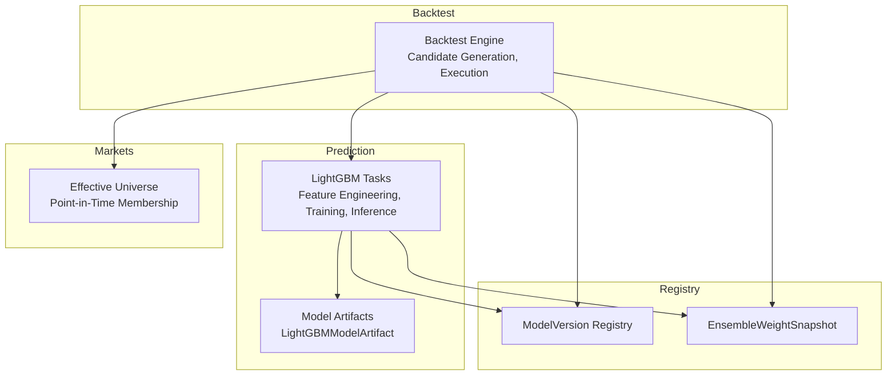
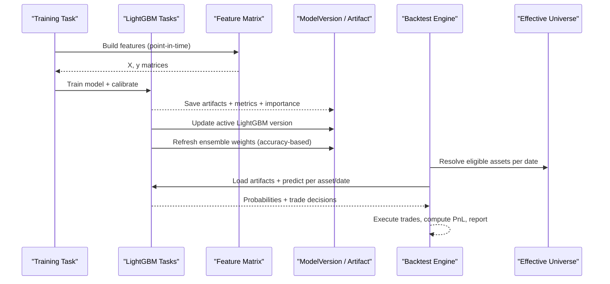
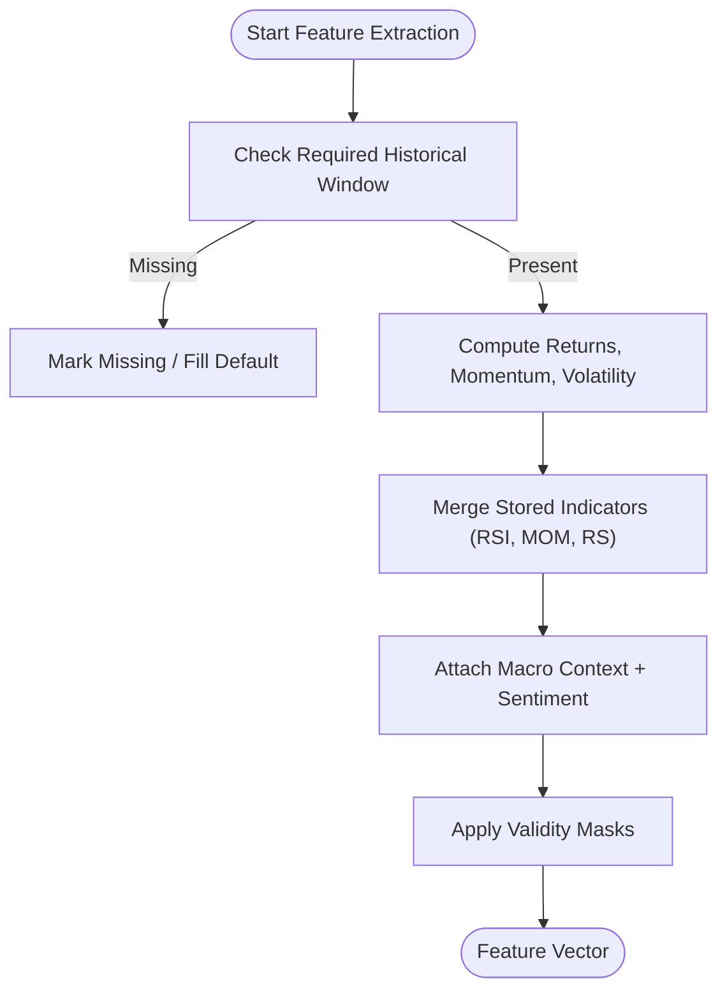
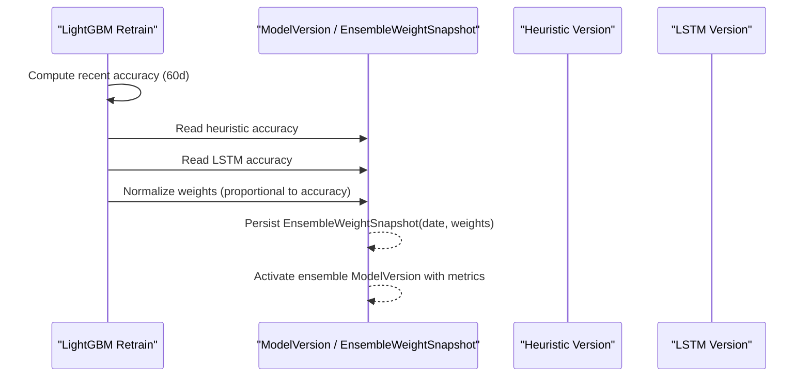
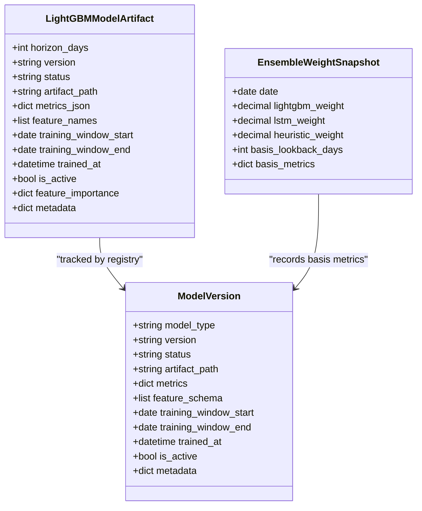
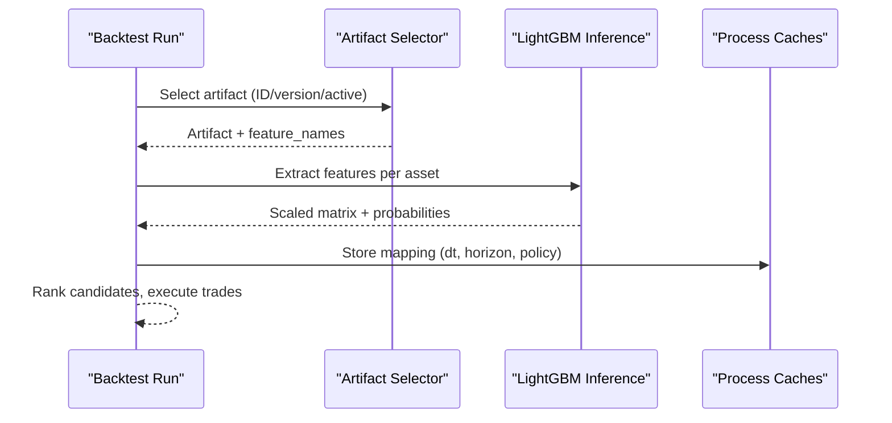
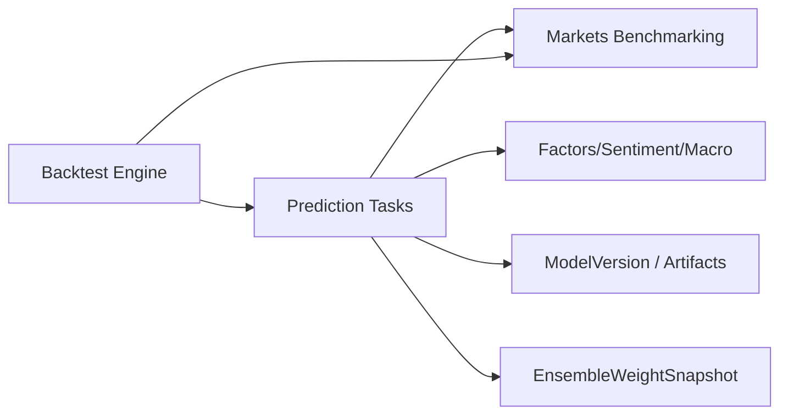

# Validation & Model Evaluation

<cite>
**Referenced Files in This Document**
- [tasks_lightgbm.py](file://apps/prediction/tasks_lightgbm.py)
- [models_lightgbm.py](file://apps/prediction/models_lightgbm.py)
- [backtest_tasks.py](file://apps/backtest/tasks.py)
- [benchmarking.py](file://apps/markets/benchmarking.py)
- [retrain.md](file://docs/how-to/retrain.md)
- [technical_guide.md](file://TECHNICAL_GUIDE.md)
- [tests_lightgbm.py](file://apps/prediction/tests_lightgbm.py)
- [summary.json](file://models/lstm/lstm-2024-12-31-stored-ti-v1/summary.json)
</cite>

## Table of Contents
1. Introduction
2. Project Structure
3. Core Components
4. Architecture Overview
5. Detailed Component Analysis
6. Dependency Analysis
7. Performance Considerations
8. Troubleshooting Guide
9. Conclusion

## Introduction
This document explains how LightGBM models are validated, evaluated, and integrated into an ensemble with heuristic and LSTM models for financial predictions. It focuses on time-series cross-validation that prevents look-ahead bias, evaluation metrics including accuracy, precision, recall, F1-score, and custom financial metrics such as directional accuracy and profit factor, ensemble weight calculation based on recent performance, model versioning and artifact persistence, deployment workflows, validation datasets, benchmarking against baselines, drift detection mechanisms, and common pitfalls like overfitting, data leakage, and robustness across market regimes.

## Project Structure
The validation and evaluation pipeline spans prediction tasks, backtesting, market universe selection, and model registries:
- Prediction tasks implement feature engineering, training, calibration, inference, and artifact persistence for LightGBM.
- Backtesting recomputes candidates per trading date from active artifacts to ensure fair, point-in-time evaluation without using stored predictions.
- Market benchmarking enforces a canonical effective universe and point-in-time membership to avoid leakage.
- Model registries track versions, artifacts, and ensemble weights over time.

**Diagram sources**
- [tasks_lightgbm.py:58-156](file://apps/prediction/tasks_lightgbm.py#L58-L156)
- [models_lightgbm.py:7-137](file://apps/prediction/models_lightgbm.py#L7-L137)
- [backtest_tasks.py:681-834](file://apps/backtest/tasks.py#L681-L834)
- [benchmarking.py:240-278](file://apps/markets/benchmarking.py#L240-L278)

**Section sources**
- [tasks_lightgbm.py:58-156](file://apps/prediction/tasks_lightgbm.py#L58-L156)
- [models_lightgbm.py:7-137](file://apps/prediction/models_lightgbm.py#L7-L137)
- [backtest_tasks.py:681-834](file://apps/backtest/tasks.py#L681-L834)
- [benchmarking.py:240-278](file://apps/markets/benchmarking.py#L240-L278)

## Core Components
- LightGBM model artifacts: persisted model, scaler, calibrator, metadata, feature names, training windows, metrics, and feature importance snapshots.
- Ensemble weight snapshots: daily records of LightGBM, LSTM, and heuristic weights derived from recent accuracies.
- Feature matrix construction: point-in-time feature assembly with strict temporal guards and missing value strategies.
- Backtest candidate generation: on-demand prediction per trading date using active artifacts, ensuring no look-ahead bias.
- Effective universe enforcement: canonical membership by index codes and trade dates to prevent silent widening.

Key responsibilities:
- Prevent look-ahead bias via exact window checks and point-in-time membership.
- Persist artifacts with versioned paths and metadata for reproducibility.
- Track ensemble weights for monitoring and reporting.
- Provide runtime caches and batched inference for performance.

**Section sources**
- [models_lightgbm.py:7-137](file://apps/prediction/models_lightgbm.py#L7-L137)
- [tasks_lightgbm.py:1162-1599](file://apps/prediction/tasks_lightgbm.py#L1162-L1599)
- [backtest_tasks.py:681-834](file://apps/backtest/tasks.py#L681-L834)
- [benchmarking.py:240-278](file://apps/markets/benchmarking.py#L240-L278)

## Architecture Overview
The system trains LightGBM models, persists artifacts, computes ensemble weights, and runs backtests that recompute signals per date using active artifacts. The effective universe ensures only eligible assets participate at each date.

**Diagram sources**
- [tasks_lightgbm.py:586-730](file://apps/prediction/tasks_lightgbm.py#L586-L730)
- [backtest_tasks.py:681-834](file://apps/backtest/tasks.py#L681-L834)
- [benchmarking.py:240-278](file://apps/markets/benchmarking.py#L240-L278)

## Detailed Component Analysis

### Time-Series Cross-Validation and Look-Ahead Bias Prevention
- Temporal splits: The LSTM documentation specifies a temporal 80/20 train/validation split, never random, to avoid leaking future information through adjacent samples of the same asset.
- Exact window checks: Feature extraction uses exact or rolling gap validity masks to ensure required historical windows exist before computing returns, momentum, volatility, and relative volume.
- Point-in-time membership: Effective universe functions enforce required index coverage per date; missing coverage fails fast rather than widening silently.
- As-of resolution: All inputs resolve to the latest row on or before the target date; same-day-only lookups are avoided where appropriate.

**Diagram sources**
- [tasks_lightgbm.py:731-1051](file://apps/prediction/tasks_lightgbm.py#L731-L1051)
- [tasks_lightgbm.py:1162-1599](file://apps/prediction/tasks_lightgbm.py#L1162-L1599)
- [technical_guide.md:294-300](file://TECHNICAL_GUIDE.md#L294-L300)
- [technical_guide.md:423-426](file://TECHNICAL_GUIDE.md#L423-L426)

**Section sources**
- [technical_guide.md:423-426](file://TECHNICAL_GUIDE.md#L423-L426)
- [tasks_lightgbm.py:731-1051](file://apps/prediction/tasks_lightgbm.py#L731-L1051)
- [tasks_lightgbm.py:1162-1599](file://apps/prediction/tasks_lightgbm.py#L1162-L1599)
- [benchmarking.py:240-278](file://apps/markets/benchmarking.py#L240-L278)

### Evaluation Metrics and Custom Financial Metrics
- Standard classification metrics: Accuracy, precision, recall, F1-score are supported and recorded in model artifacts and summaries.
- Directional accuracy: Derived from predicted labels versus realized direction over horizons; used in ensemble weight basis.
- Profit factor: Not explicitly implemented in the referenced code; can be computed post-hoc from backtest trade ledgers by summing gross profits divided by gross losses.
- Trade decision outputs: Target price, stop loss, risk-reward ratio, suggested flag enable downstream financial metric computation.

Practical example references:
- LSTM summary includes accuracy per horizon and aggregate accuracy.
- LightGBM artifact metrics JSON stores accuracy and other metrics.

**Section sources**
- [summary.json:1-43](file://models/lstm/lstm-2024-12-31-stored-ti-v1/summary.json#L1-L43)
- [models_lightgbm.py:15-26](file://apps/prediction/models_lightgbm.py#L15-L26)
- [backtest_tasks.py:1461-1504](file://apps/backtest/tasks.py#L1461-L1504)

### Ensemble Weight Calculation Process
- Basis window: Last 60 days.
- Weights proportional to model accuracies (LightGBM, LSTM, heuristic), quantized to four decimals.
- Fallback when no usable accuracy exists: approximately equal weights.
- Active ensemble ModelVersion updated with latest metrics; EnsembleWeightSnapshot records chronological monitoring data.

**Diagram sources**
- [tasks_lightgbm.py:631-730](file://apps/prediction/tasks_lightgbm.py#L631-L730)
- [retrain.md:294-310](file://docs/how-to/retrain.md#L294-L310)
- [technical_guide.md:436-454](file://TECHNICAL_GUIDE.md#L436-L454)

**Section sources**
- [tasks_lightgbm.py:631-730](file://apps/prediction/tasks_lightgbm.py#L631-L730)
- [retrain.md:294-310](file://docs/how-to/retrain.md#L294-L310)
- [technical_guide.md:436-454](file://TECHNICAL_GUIDE.md#L436-L454)

### Model Versioning Strategies and Artifact Persistence
- Version naming: Horizon-prefixed versions with normalized tags (e.g., lgb-7d-YYYY-MM-DD-tag).
- Artifact storage: model.pkl, scaler.pkl, calibrator.pkl, metadata.json under models/lightgbm/<horizon>_<version>.
- Registry updates: Active LightGBM versions set; older versions deactivated per horizon; ensemble versions dated to retrain window end.
- Provenance: Backtest collects model references from executed trades for auditability.

**Diagram sources**
- [models_lightgbm.py:7-137](file://apps/prediction/models_lightgbm.py#L7-L137)
- [tasks_lightgbm.py:586-730](file://apps/prediction/tasks_lightgbm.py#L586-L730)
- [backtest_tasks.py:1250-1326](file://apps/backtest/tasks.py#L1250-L1326)

**Section sources**
- [tasks_lightgbm.py:78-118](file://apps/prediction/tasks_lightgbm.py#L78-L118)
- [tasks_lightgbm.py:586-730](file://apps/prediction/tasks_lightgbm.py#L586-L730)
- [models_lightgbm.py:7-137](file://apps/prediction/models_lightgbm.py#L7-L137)
- [backtest_tasks.py:1250-1326](file://apps/backtest/tasks.py#L1250-L1326)

### Deployment Workflows and On-Demand Backtest Signals
- Backtest recomputes candidates per trading date from artifacts and feature tables active now, avoiding reliance on stored predictions for comparability.
- Selection of LightGBM artifact: explicit ID/version or active artifact by horizon; errors if not READY.
- Inference backend resolution: auto/cpu_batched/windows_gpu with GPU device probing and fallback.
- Batched inference: configurable batch size, process-level caches bounded, runtime metrics tracked.

**Diagram sources**
- [backtest_tasks.py:1382-1453](file://apps/backtest/tasks.py#L1382-L1453)
- [backtest_tasks.py:1507-1582](file://apps/backtest/tasks.py#L1507-L1582)
- [backtest_tasks.py:681-834](file://apps/backtest/tasks.py#L681-L834)

**Section sources**
- [backtest_tasks.py:681-834](file://apps/backtest/tasks.py#L681-L834)
- [backtest_tasks.py:1382-1453](file://apps/backtest/tasks.py#L1382-L1453)
- [backtest_tasks.py:1507-1582](file://apps/backtest/tasks.py#L1507-L1582)

### Practical Examples: Validation Datasets and Benchmarking
- Validation dataset construction: Use effective universe membership by date to select eligible assets; build feature matrices with warmup periods and strict validity masks.
- Baseline comparison: Heuristic baseline provides independent signals; combined mode averages trade scores and up-probabilities for ranking.
- Benchmarking: Point-in-time union benchmark constructed from CSI300 and CSI A500 constituents with free-float market cap weighting.

Example references:
- Tests seed trading calendar, PIT membership, OHLCV, technical indicators, factors, sentiment to validate feature consistency between training and runtime.
- Backtest candidate builders demonstrate top-N and trade-score modes with thresholds.

**Section sources**
- [tests_lightgbm.py:99-177](file://apps/prediction/tests_lightgbm.py#L99-L177)
- [tests_lightgbm.py:192-248](file://apps/prediction/tests_lightgbm.py#L192-L248)
- [backtest_tasks.py:992-1140](file://apps/backtest/tasks.py#L992-L1140)
- [benchmarking.py:312-428](file://apps/markets/benchmarking.py#L312-L428)

### Drift Detection Mechanisms
- Feature importance snapshots: Per-artifact feature importance ranks enable tracking of input distribution shifts over time.
- Snapshot pruning plan: Uses source artifact importance to prune features while retaining cumulative importance targets; helps monitor stability of feature contributions.
- Ensemble weight snapshots: Changes in weights reflect relative performance drift across models.

Operational guidance:
- Monitor changes in top features and their ranks; large shifts may indicate regime changes or data quality issues.
- Review basis metrics in EnsembleWeightSnapshot to detect sustained underperformance.

**Section sources**
- [tasks_lightgbm.py:612-628](file://apps/prediction/tasks_lightgbm.py#L612-L628)
- [tasks_lightgbm.py:477-579](file://apps/prediction/tasks_lightgbm.py#L477-L579)
- [tasks_lightgbm.py:631-730](file://apps/prediction/tasks_lightgbm.py#L631-L730)

### Common Validation Pitfalls and Mitigations
- Overfitting prevention:
  - Temporal splits for validation; no random splits to avoid leakage.
  - Regularization parameters and feature fraction controls in training.
- Data leakage avoidance:
  - Strict as-of resolution and exact window checks.
  - Effective universe enforcement; fail fast on missing membership coverage.
- Robustness across market regimes:
  - Macro context integration and phase-aware adjustments.
  - Ensemble weights adapt to recent performance; monitor basis metrics.

**Section sources**
- [technical_guide.md:423-426](file://TECHNICAL_GUIDE.md#L423-L426)
- [technical_guide.md:294-300](file://TECHNICAL_GUIDE.md#L294-L300)
- [benchmarking.py:133-146](file://apps/markets/benchmarking.py#L133-L146)
- [tasks_lightgbm.py:982-1051](file://apps/prediction/tasks_lightgbm.py#L982-L1051)

## Dependency Analysis
- Prediction tasks depend on markets benchmarking for effective universe and on analytics/factors/sentiment/macro models for features.
- Backtest depends on prediction tasks for on-demand signals and on markets for universe eligibility.
- Model registries depend on training outcomes and ensemble refresh logic.

**Diagram sources**
- [tasks_lightgbm.py:26-50](file://apps/prediction/tasks_lightgbm.py#L26-L50)
- [backtest_tasks.py:54-69](file://apps/backtest/tasks.py#L54-L69)
- [benchmarking.py:1-40](file://apps/markets/benchmarking.py#L1-L40)

**Section sources**
- [tasks_lightgbm.py:26-50](file://apps/prediction/tasks_lightgbm.py#L26-L50)
- [backtest_tasks.py:54-69](file://apps/backtest/tasks.py#L54-L69)
- [benchmarking.py:1-40](file://apps/markets/benchmarking.py#L1-L40)

## Performance Considerations
- Batched inference: Configurable batch size reduces overhead; process-level caches bound memory usage.
- GPU acceleration: Windows GPU device probing with fallback to CPU; identity calibrator allows direct GPU predict when compatible.
- Runtime metrics: Track feature extraction, row assembly, scaler transform, probability inference, trade decision seconds; record backend and batch size.
- Artifact cache: In-memory cache with max entries avoids repeated disk I/O during inference.

Recommendations:
- Tune batch size based on hardware and feature dimensionality.
- Validate GPU availability per model handle; fall back gracefully.
- Monitor runtime metrics to identify bottlenecks in feature assembly vs inference.

**Section sources**
- [backtest_tasks.py:114-231](file://apps/backtest/tasks.py#L114-L231)
- [backtest_tasks.py:1507-1582](file://apps/backtest/tasks.py#L1507-L1582)
- [tasks_lightgbm.py:183-278](file://apps/prediction/tasks_lightgbm.py#L183-L278)
- [tasks_lightgbm.py:58-70](file://apps/prediction/tasks_lightgbm.py#L58-L70)

## Troubleshooting Guide
- Missing point-in-time membership: Ensure IndexMembership backfill for required indices; failures raise explicit errors instead of widening silently.
- No active LightGBM artifact: Verify artifact status is READY and horizon matches; error raised if none available.
- Artifact path portability: Absolute paths recorded on host may not resolve elsewhere; verify path resolution during promotion or retrain on current host.
- Stuck backtest runs: Use task health utilities to identify stuck runs; decide restart or fail.

Common diagnostics:
- Check EnsembleWeightSnapshot basis metrics for unexpected spikes indicating leakage.
- Inspect feature importance snapshots for abrupt shifts.
- Validate as-of resolutions and exact window availability for gappy histories.

**Section sources**
- [benchmarking.py:133-146](file://apps/markets/benchmarking.py#L133-L146)
- [backtest_tasks.py:1382-1406](file://apps/backtest/tasks.py#L1382-L1406)
- [retrain.md:274-290](file://docs/how-to/retrain.md#L274-L290)
- [BACKLOG.md:242-269](file://BACKLOG.md#L242-L269)

## Conclusion
The system implements rigorous time-series validation and evaluation for LightGBM with strict point-in-time guarantees, preventing look-ahead bias and data leakage. Evaluation metrics include standard classification measures and financial-oriented outputs enabling directional accuracy and profit factor computation. Ensemble weights adapt to recent performance across LightGBM, LSTM, and heuristic models. Model versioning and artifact persistence support reproducible deployments, while backtesting recomputes signals per date for fair comparisons. Monitoring via feature importance snapshots and ensemble weight snapshots aids drift detection. Operational safeguards and performance optimizations ensure robust, scalable validation and evaluation in production environments.