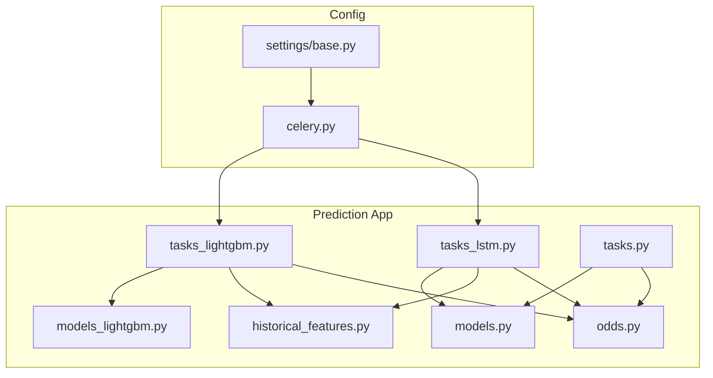
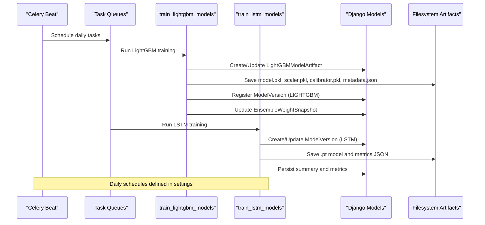
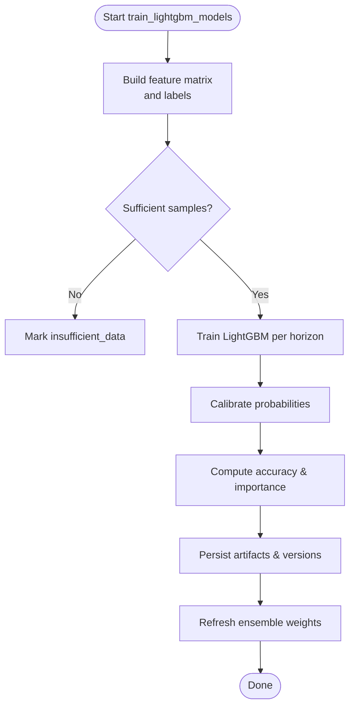
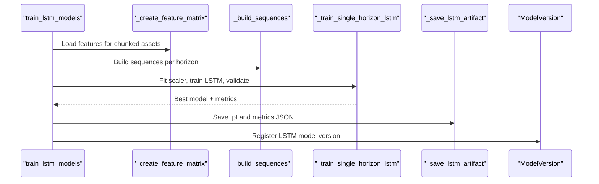
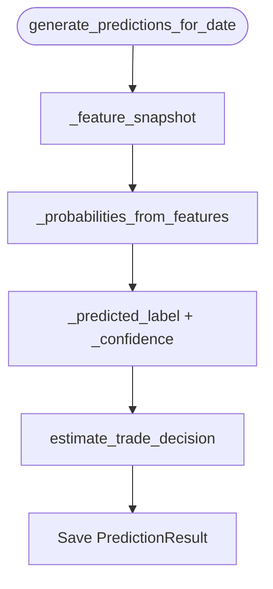
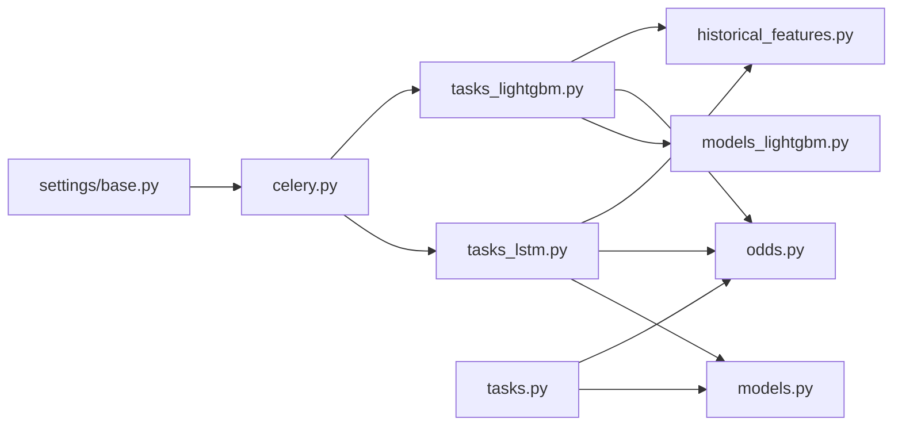

# Model Training Workflows

<cite>
**Referenced Files in This Document**
- [tasks_lightgbm.py](file://apps/prediction/tasks_lightgbm.py)
- [tasks_lstm.py](file://apps/prediction/tasks_lstm.py)
- [tasks.py](file://apps/prediction/tasks.py)
- [historical_features.py](file://apps/prediction/historical_features.py)
- [odds.py](file://apps/prediction/odds.py)
- [models.py](file://apps/prediction/models.py)
- [models_lightgbm.py](file://apps/prediction/models_lightgbm.py)
- [celery.py](file://config/celery.py)
- [base.py](file://config/settings/base.py)
</cite>

## Table of Contents
1. [Introduction](#introduction)
2. [Project Structure](#project-structure)
3. [Core Components](#core-components)
4. [Architecture Overview](#architecture-overview)
5. [Detailed Component Analysis](#detailed-component-analysis)
6. [Dependency Analysis](#dependency-analysis)
7. [Performance Considerations](#performance-considerations)
8. [Troubleshooting Guide](#troubleshooting-guide)
9. [Conclusion](#conclusion)
10. [Appendices](#appendices)

## Introduction
This document explains the end-to-end model training workflows for LightGBM and LSTM models used to predict asset price direction over multiple horizons (3, 7, and 30 days). It covers data preparation from upstream sources (markets, analytics, factors, macro, sentiment), feature engineering, model configuration, hyperparameter choices, validation strategies, Celery-based task orchestration, batch processing, error handling, temporal splitting, cross-validation considerations, monitoring, and scaling guidance for large datasets.

## Project Structure
The prediction pipeline is implemented under the prediction app with separate modules for:
- Task orchestration and training/inference entry points
- Feature engineering and label construction
- Model artifacts and versioning
- Shared utilities for trade decision logic and historical indicators

**Diagram sources**
- [tasks_lightgbm.py:1849-2098](file://apps/prediction/tasks_lightgbm.py#L1849-L2098)
- [tasks_lstm.py:592-800](file://apps/prediction/tasks_lstm.py#L592-L800)
- [tasks.py:149-243](file://apps/prediction/tasks.py#L149-L243)
- [historical_features.py:182-397](file://apps/prediction/historical_features.py#L182-L397)
- [odds.py:60-158](file://apps/prediction/odds.py#L60-L158)
- [models.py:7-107](file://apps/prediction/models.py#L7-L107)
- [models_lightgbm.py:7-137](file://apps/prediction/models_lightgbm.py#L7-L137)
- [celery.py:1-17](file://config/celery.py#L1-L17)
- [base.py:174-255](file://config/settings/base.py#L174-L255)

**Section sources**
- [tasks_lightgbm.py:1849-2098](file://apps/prediction/tasks_lightgbm.py#L1849-L2098)
- [tasks_lstm.py:592-800](file://apps/prediction/tasks_lstm.py#L592-L800)
- [tasks.py:149-243](file://apps/prediction/tasks.py#L149-L243)
- [historical_features.py:182-397](file://apps/prediction/historical_features.py#L182-L397)
- [odds.py:60-158](file://apps/prediction/odds.py#L60-L158)
- [models.py:7-107](file://apps/prediction/models.py#L7-L107)
- [models_lightgbm.py:7-137](file://apps/prediction/models_lightgbm.py#L7-L137)
- [celery.py:1-17](file://config/celery.py#L1-L17)
- [base.py:174-255](file://config/settings/base.py#L174-L255)

## Core Components
- LightGBM training and inference tasks: build features, labels, train per horizon, persist artifacts, register versions, refresh ensemble weights.
- LSTM training and inference tasks: build sequences, fit scaler, train classifier, persist PyTorch artifacts, register versions.
- Heuristic baseline predictions: compute probabilities from factor/sentiment/technical signals and store results.
- Data utilities: historical indicators, OHLCV access, technical staleness checks, trading date alignment.
- Trade decision engine: target/stop-loss estimation, risk-reward scoring, suggestion flags.
- Versioning and artifacts: model registry, snapshots of importance and ensemble weights.

**Section sources**
- [tasks_lightgbm.py:1849-2098](file://apps/prediction/tasks_lightgbm.py#L1849-L2098)
- [tasks_lstm.py:592-800](file://apps/prediction/tasks_lstm.py#L592-L800)
- [tasks.py:149-243](file://apps/prediction/tasks.py#L149-L243)
- [historical_features.py:182-397](file://apps/prediction/historical_features.py#L182-L397)
- [odds.py:60-158](file://apps/prediction/odds.py#L60-L158)
- [models.py:7-107](file://apps/prediction/models.py#L7-L107)
- [models_lightgbm.py:7-137](file://apps/prediction/models_lightgbm.py#L7-L137)

## Architecture Overview
Training and inference are orchestrated via Celery tasks routed to dedicated queues. The settings define scheduled jobs that run daily pipelines for heuristic and ML predictions.

**Diagram sources**
- [base.py:174-255](file://config/settings/base.py#L174-L255)
- [tasks_lightgbm.py:1849-2098](file://apps/prediction/tasks_lightgbm.py#L1849-L2098)
- [tasks_lstm.py:592-800](file://apps/prediction/tasks_lstm.py#L592-L800)
- [models_lightgbm.py:7-137](file://apps/prediction/models_lightgbm.py#L7-L137)
- [models.py:7-107](file://apps/prediction/models.py#L7-L107)

## Detailed Component Analysis

### LightGBM Training Pipeline
- Feature matrix construction:
  - Aggregates OHLCV, technical indicators (RSI, momentum, returns, relative volume, realized volatility), factor scores, macro context, and sentiment.
  - Applies trading-date alignment, gap checks, and window validity masks.
  - Builds lagged and delta features; computes interaction features.
- Label construction:
  - Computes forward returns over horizon windows and assigns UP/DOWN/FLAT based on thresholds.
- Model training:
  - Scales features, trains multiclass LightGBM with fixed hyperparameters, applies calibration (sigmoid or identity fallback).
  - Stores artifacts (model, scaler, calibrator, metadata) and registers ModelVersion/LightGBMModelArtifact.
  - Saves feature importance snapshots and updates ensemble weights.
- Inference:
  - Loads active artifact, extracts features using same strategy, predicts calibrated probabilities, stores LightGBMPrediction rows.

**Diagram sources**
- [tasks_lightgbm.py:1849-2098](file://apps/prediction/tasks_lightgbm.py#L1849-L2098)
- [tasks_lightgbm.py:1162-1760](file://apps/prediction/tasks_lightgbm.py#L1162-L1760)
- [tasks_lightgbm.py:1763-1843](file://apps/prediction/tasks_lightgbm.py#L1763-L1843)

**Section sources**
- [tasks_lightgbm.py:1162-1760](file://apps/prediction/tasks_lightgbm.py#L1162-L1760)
- [tasks_lightgbm.py:1763-1843](file://apps/prediction/tasks_lightgbm.py#L1763-L1843)
- [tasks_lightgbm.py:1849-2098](file://apps/prediction/tasks_lightgbm.py#L1849-L2098)
- [models_lightgbm.py:7-137](file://apps/prediction/models_lightgbm.py#L7-L137)

### LSTM Training Pipeline
- Sequence construction:
  - Builds time-series sequences per asset using a configurable sequence length.
  - Adds missingness indicator features when using mask-and-zero-impute strategy.
- Scaling and training:
  - Fits StandardScaler on flattened sequences, normalizes both train and validation sets.
  - Trains an LSTM classifier with Adam optimizer and cross-entropy loss; selects best validation accuracy state.
- Persistence and versioning:
  - Saves model state dict, scaler parameters, and metadata to disk; writes per-horizon metrics and a summary file.
  - Registers ModelVersion (LSTM) with metrics and schema.
- Inference:
  - Loads active model artifact, builds last sequence, normalizes, runs softmax, and persists predictions.

**Diagram sources**
- [tasks_lstm.py:592-800](file://apps/prediction/tasks_lstm.py#L592-L800)
- [tasks_lstm.py:109-156](file://apps/prediction/tasks_lstm.py#L109-L156)
- [tasks_lstm.py:473-589](file://apps/prediction/tasks_lstm.py#L473-L589)
- [tasks_lstm.py:444-470](file://apps/prediction/tasks_lstm.py#L444-L470)

**Section sources**
- [tasks_lstm.py:109-156](file://apps/prediction/tasks_lstm.py#L109-L156)
- [tasks_lstm.py:473-589](file://apps/prediction/tasks_lstm.py#L473-L589)
- [tasks_lstm.py:592-800](file://apps/prediction/tasks_lstm.py#L592-L800)
- [tasks_lstm.py:444-470](file://apps/prediction/tasks_lstm.py#L444-L470)

### Heuristic Baseline Predictions
- Computes probabilities from composite factor score, bottom probability, sentiment, RSI, momentum, and relative strength score.
- Adjusts probabilities by horizon scale and macro phase, then derives predicted label and confidence.
- Persists PredictionResult rows with feature payloads and metadata.

**Diagram sources**
- [tasks.py:55-127](file://apps/prediction/tasks.py#L55-L127)
- [tasks.py:177-243](file://apps/prediction/tasks.py#L177-L243)
- [odds.py:60-158](file://apps/prediction/odds.py#L60-L158)

**Section sources**
- [tasks.py:55-127](file://apps/prediction/tasks.py#L55-L127)
- [tasks.py:177-243](file://apps/prediction/tasks.py#L177-L243)
- [odds.py:60-158](file://apps/prediction/odds.py#L60-L158)

### Data Preparation and Feature Engineering
- Upstream sources:
  - Markets: OHLCV prices and trading calendars.
  - Analytics: Technical indicators (RSI, momentum, returns, relative volume, realized volatility).
  - Factors: Composite and component factor scores.
  - Macro: PMI, yield curve, market context phases.
  - Sentiment: Asset-level sentiment scores.
- Temporal alignment:
  - Uses point-in-time universe membership and trading date positions to avoid look-ahead bias.
  - Validates gaps and freshness of indicators before inclusion.
- Feature set:
  - Includes base indicators, lags/deltas, interactions, macro variables, and sentiment aggregates.

**Section sources**
- [tasks_lightgbm.py:1162-1760](file://apps/prediction/tasks_lightgbm.py#L1162-L1760)
- [historical_features.py:182-397](file://apps/prediction/historical_features.py#L182-L397)

### Model Configuration and Hyperparameters
- LightGBM:
  - Multiclass objective with three classes; fixed hyperparameters including learning rate, tree size, subsampling, regularization, and minimum leaf size.
  - Calibration via Platt scaling when supported; otherwise identity mapping.
- LSTM:
  - Fixed architecture: hidden size, number of layers, dropout; trained with Adam and cross-entropy loss.
  - Sequence length configurable; scaler fitted per training run.

**Section sources**
- [tasks_lightgbm.py:1966-1982](file://apps/prediction/tasks_lightgbm.py#L1966-L1982)
- [tasks_lstm.py:41-62](file://apps/prediction/tasks_lstm.py#L41-L62)
- [tasks_lstm.py:517-519](file://apps/prediction/tasks_lstm.py#L517-L519)

### Validation Strategies and Cross-Validation
- LightGBM:
  - Internal calibration uses 5-fold CV within CalibratedClassifierCV.
  - Accuracy computed on training set post-calibration; no explicit hold-out split shown in code.
- LSTM:
  - Time-based split into train/validation (first 80% by sorted dates); best validation accuracy saved.
  - No explicit cross-validation loop beyond single split.

**Section sources**
- [tasks_lightgbm.py:1984-1994](file://apps/prediction/tasks_lightgbm.py#L1984-L1994)
- [tasks_lstm.py:491-551](file://apps/prediction/tasks_lstm.py#L491-L551)

### Celery Integration and Batch Processing
- Tasks:
  - Dedicated queues for backtest, train-lightgbm, and train-lstm.
  - Scheduled daily tasks for heuristic and LightGBM predictions.
- Batching:
  - LSTM training processes assets in chunks to control memory usage.
  - Feature matrix construction groups by asset and merges indicators efficiently.
- Timeouts:
  - Soft and hard time limits configured for tasks.

**Section sources**
- [base.py:174-255](file://config/settings/base.py#L174-L255)
- [tasks_lstm.py:649-700](file://apps/prediction/tasks_lstm.py#L649-L700)
- [tasks_lightgbm.py:1162-1760](file://apps/prediction/tasks_lightgbm.py#L1162-L1760)

### Error Handling Mechanisms
- Graceful failures:
  - Insufficient data paths return structured status messages without crashing.
  - Missing model artifacts or assets handled with early returns and informative messages.
- Robustness:
  - GPU device probing and fallback to CPU if unavailable.
  - NaN-safe conversions and default fills for missing values.

**Section sources**
- [tasks_lightgbm.py:1870-1878](file://apps/prediction/tasks_lightgbm.py#L1870-L1878)
- [tasks_lightgbm.py:2089-2095](file://apps/prediction/tasks_lightgbm.py#L2089-L2095)
- [tasks_lstm.py:484-502](file://apps/prediction/tasks_lstm.py#L484-L502)
- [tasks.py:305-327](file://apps/prediction/tasks.py#L305-L327)

### Monitoring and Metrics Interpretation
- LightGBM:
  - Accuracy, training sample count, feature counts, top features, and pruning audit stored in artifacts and model versions.
- LSTM:
  - Per-horizon accuracy, training/validation sample sizes, and aggregate accuracy recorded in summary and metrics files.
- Ensemble:
  - Weight snapshots reflect recent performance across LightGBM, LSTM, and heuristic baselines.

**Section sources**
- [tasks_lightgbm.py:1996-2088](file://apps/prediction/tasks_lightgbm.py#L1996-L2088)
- [tasks_lstm.py:743-800](file://apps/prediction/tasks_lstm.py#L743-L800)
- [tasks_lightgbm.py:631-729](file://apps/prediction/tasks_lightgbm.py#L631-L729)

### Distributed Training, Resource Management, and Scaling
- Current implementation:
  - Single-process training per task; batching and chunking manage memory.
  - Optional GPU acceleration for LightGBM prediction path; LSTM uses CUDA if available.
- Scaling recommendations:
  - Increase worker concurrency per queue to parallelize horizon-wise training.
  - Use larger instance types or GPU-enabled workers for LSTM training.
  - Shard assets across multiple workers for feature matrix generation and sequence building.
  - Monitor broker and database throughput; consider read replicas for heavy queries.

[No sources needed since this section provides general guidance]

## Dependency Analysis
Key dependencies between components:
- Training tasks depend on feature matrix builders and label constructors.
- Inference depends on active model artifacts and consistent feature extraction.
- Settings configure Celery queues and schedules that drive task execution.
- Models define persistent registries for versions, artifacts, and predictions.

**Diagram sources**
- [tasks_lightgbm.py:1849-2098](file://apps/prediction/tasks_lightgbm.py#L1849-L2098)
- [tasks_lstm.py:592-800](file://apps/prediction/tasks_lstm.py#L592-L800)
- [tasks.py:149-243](file://apps/prediction/tasks.py#L149-L243)
- [historical_features.py:182-397](file://apps/prediction/historical_features.py#L182-L397)
- [odds.py:60-158](file://apps/prediction/odds.py#L60-L158)
- [models_lightgbm.py:7-137](file://apps/prediction/models_lightgbm.py#L7-L137)
- [models.py:7-107](file://apps/prediction/models.py#L7-L107)
- [base.py:174-255](file://config/settings/base.py#L174-L255)
- [celery.py:1-17](file://config/celery.py#L1-L17)

**Section sources**
- [tasks_lightgbm.py:1849-2098](file://apps/prediction/tasks_lightgbm.py#L1849-L2098)
- [tasks_lstm.py:592-800](file://apps/prediction/tasks_lstm.py#L592-L800)
- [tasks.py:149-243](file://apps/prediction/tasks.py#L149-L243)
- [historical_features.py:182-397](file://apps/prediction/historical_features.py#L182-L397)
- [odds.py:60-158](file://apps/prediction/odds.py#L60-L158)
- [models_lightgbm.py:7-137](file://apps/prediction/models_lightgbm.py#L7-L137)
- [models.py:7-107](file://apps/prediction/models.py#L7-L107)
- [base.py:174-255](file://config/settings/base.py#L174-L255)
- [celery.py:1-17](file://config/celery.py#L1-L17)

## Performance Considerations
- Feature computation:
  - Use caching for repeated queries within a task run.
  - Prefer vectorized pandas operations and merge-asof joins for temporal alignment.
- Training efficiency:
  - Limit max samples per horizon to control memory and runtime.
  - For LSTM, tune sequence length and batch size based on hardware capacity.
- Inference optimization:
  - Cache loaded model artifacts and probe GPU availability for LightGBM.
  - Reuse runtime caches for OHLCV and indicators during batch prediction.

[No sources needed since this section provides general guidance]

## Troubleshooting Guide
Common issues and resolutions:
- Insufficient data:
  - Ensure OHLCV and indicators cover required windows; verify trading calendar and PIT membership.
- Missing artifacts:
  - Confirm model artifacts exist on disk and ModelVersion points to valid artifact paths.
- GPU not available:
  - LightGBM prediction falls back to CPU; ensure CUDA drivers if GPU is desired.
- Broker/connection errors:
  - Verify Redis connectivity and Celery worker health; check queue routing and task timeouts.

**Section sources**
- [tasks_lightgbm.py:1870-1878](file://apps/prediction/tasks_lightgbm.py#L1870-L1878)
- [tasks_lightgbm.py:2089-2095](file://apps/prediction/tasks_lightgbm.py#L2089-L2095)
- [tasks_lstm.py:484-502](file://apps/prediction/tasks_lstm.py#L484-L502)
- [base.py:174-203](file://config/settings/base.py#L174-L203)

## Conclusion
The system implements robust, production-oriented training workflows for LightGBM and LSTM models with clear separation of concerns: data preparation, feature engineering, model training, artifact persistence, and version management. Celery orchestration enables scheduled and queued execution, while built-in error handling and resource controls support reliable operation at scale. Ensemble weighting integrates multiple model families to improve overall predictive stability.

[No sources needed since this section summarizes without analyzing specific files]

## Appendices

### Key Entry Points and Schedules
- Daily heuristic predictions: scheduled via Celery Beat.
- Daily LightGBM predictions: scheduled via Celery Beat.
- Manual training tasks: callable via Celery queues.

**Section sources**
- [base.py:218-255](file://config/settings/base.py#L218-L255)
- [celery.py:1-17](file://config/celery.py#L1-L17)