# Model Validation & Metrics

<cite>
**Referenced Files in This Document**
- [apps/prediction/odds.py](file://apps/prediction/odds.py)
- [apps/prediction/tasks.py](file://apps/prediction/tasks.py)
- [apps/prediction/tasks_lightgbm.py](file://apps/prediction/tasks_lightgbm.py)
- [apps/prediction/models.py](file://apps/prediction/models.py)
- [apps/backtest/tasks.py](file://apps/backtest/tasks.py)
- [apps/backtest/models.py](file://apps/backtest/models.py)
- [apps/backtest/management/commands/run_validation_backtests.py](file://apps/backtest/management/commands/run_validation_backtests.py)
- [apps/core/management/commands/validate_data_quality.py](file://apps/core/management/commands/validate_data_quality.py)
- [apps/markets/migrations/0011_remove_scheduled_model_retraining_tasks.py](file://apps/markets/migrations/0011_remove_scheduled_model_retraining_tasks.py)
- [docs/how-to/retrain.md](file://docs/how-to/retrain.md)
- [TECHNICAL_GUIDE.md](file://TECHNICAL_GUIDE.md)
</cite>

## Table of Contents
1. Introduction
2. Project Structure
3. Core Components
4. Architecture Overview
5. Detailed Component Analysis
6. Dependency Analysis
7. Performance Considerations
8. Troubleshooting Guide
9. Conclusion
10. Appendices

## Introduction
This document explains the model validation strategies and performance metrics used across the training and backtesting pipeline. It focuses on:
- Temporal cross-validation that prevents look-ahead bias
- Train-test splitting for financial time series
- Evaluation metrics including accuracy, precision, recall, and AUC-ROC
- Odds estimation and probability calibration
- Backtesting integration to validate predictions
- Monitoring model drift, detecting performance degradation, and triggering retraining
- Interpreting validation results, setting thresholds, and comparing model versions

## Project Structure
The validation and evaluation logic spans prediction, backtesting, data quality, and operational triggers:
- Prediction tasks generate probabilities and labels, persist results, and compute trade decisions
- LightGBM training computes calibrated probabilities and stores artifacts and metrics
- Backtesting executes rolling out-of-sample runs to measure realistic performance
- Data quality validation ensures feature integrity and alignment with point-in-time universe
- Operational migrations remove scheduled retraining to enforce deliberate retraining

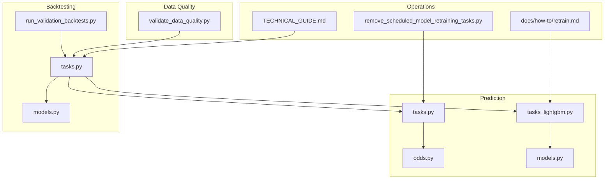

**Diagram sources**
- [apps/prediction/tasks.py:149-243](file://apps/prediction/tasks.py#L149-L243)
- [apps/prediction/tasks_lightgbm.py:1981-2001](file://apps/prediction/tasks_lightgbm.py#L1981-L2001)
- [apps/prediction/odds.py:60-158](file://apps/prediction/odds.py#L60-L158)
- [apps/backtest/tasks.py:1-800](file://apps/backtest/tasks.py#L1-L800)
- [apps/backtest/models.py:24-168](file://apps/backtest/models.py#L24-L168)
- [apps/backtest/management/commands/run_validation_backtests.py:1-144](file://apps/backtest/management/commands/run_validation_backtests.py#L1-L144)
- [apps/core/management/commands/validate_data_quality.py:136-198](file://apps/core/management/commands/validate_data_quality.py#L136-L198)
- [apps/markets/migrations/0011_remove_scheduled_model_retraining_tasks.py:1-42](file://apps/markets/migrations/0011_remove_scheduled_model_retraining_tasks.py#L1-L42)
- [TECHNICAL_GUIDE.md:656-687](file://TECHNICAL_GUIDE.md#L656-L687)
- [docs/how-to/retrain.md:190-224](file://docs/how-to/retrain.md#L190-L224)

**Section sources**
- [apps/prediction/tasks.py:149-243](file://apps/prediction/tasks.py#L149-L243)
- [apps/backtest/tasks.py:1-800](file://apps/backtest/tasks.py#L1-L800)
- [apps/backtest/management/commands/run_validation_backtests.py:1-144](file://apps/backtest/management/commands/run_validation_backtests.py#L1-L144)
- [apps/core/management/commands/validate_data_quality.py:136-198](file://apps/core/management/commands/validate_data_quality.py#L136-L198)
- [apps/markets/migrations/0011_remove_scheduled_model_retraining_tasks.py:1-42](file://apps/markets/migrations/0011_remove_scheduled_model_retraining_tasks.py#L1-L42)
- [TECHNICAL_GUIDE.md:656-687](file://TECHNICAL_GUIDE.md#L656-L687)
- [docs/how-to/retrain.md:190-224](file://docs/how-to/retrain.md#L190-L224)

## Core Components
- Probability generation and label assignment for heuristic baseline
- LightGBM training with calibration and artifact management
- Trade decision engine converting probabilities into target/stop-loss and risk-reward scoring
- Rolling validation backtests producing out-of-sample performance per window
- Data quality validation ensuring features align with point-in-time universe and are free of leakage
- Operational controls removing scheduled retraining to enforce deliberate model lifecycle

Key responsibilities:
- Heuristic baseline: produces up/flat/down probabilities and labels based on factor, sentiment, momentum, RS score, and macro context
- LightGBM: trains multiclass models, calibrates probabilities, records metrics and feature importance, and updates ensemble weights
- Odds estimation: derives target price, stop loss, risk-reward ratio, trade score, and suggestion flags from recent OHLCV, bands, and moving averages
- Backtesting: executes candidate selection and exits using live features and point-in-time universe; persists trades and run reports
- Data quality: audits coverage gaps, continuity, and technical indicator reconciliation; validates effective universe alignment
- Operations: removes periodic retraining schedules to avoid accidental model drift

**Section sources**
- [apps/prediction/tasks.py:55-127](file://apps/prediction/tasks.py#L55-L127)
- [apps/prediction/tasks_lightgbm.py:1981-2001](file://apps/prediction/tasks_lightgbm.py#L1981-L2001)
- [apps/prediction/odds.py:60-158](file://apps/prediction/odds.py#L60-L158)
- [apps/backtest/tasks.py:1-800](file://apps/backtest/tasks.py#L1-L800)
- [apps/core/management/commands/validate_data_quality.py:136-198](file://apps/core/management/commands/validate_data_quality.py#L136-L198)
- [apps/markets/migrations/0011_remove_scheduled_model_retraining_tasks.py:1-42](file://apps/markets/migrations/0011_remove_scheduled_model_retraining_tasks.py#L1-L42)

## Architecture Overview
The system separates training, inference, odds estimation, and backtesting to prevent look-ahead bias and ensure robust validation:
- Training uses historical windows and point-in-time features
- Inference resolves features as of a specific date
- Odds estimation uses only available history at as_of
- Backtesting recomputes candidates per trading date from current artifacts and feature tables

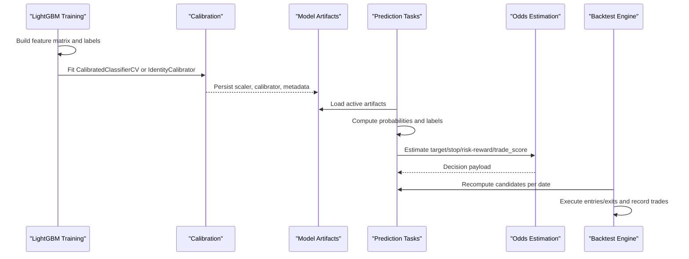

**Diagram sources**
- [apps/prediction/tasks_lightgbm.py:1981-2001](file://apps/prediction/tasks_lightgbm.py#L1981-L2001)
- [apps/prediction/tasks.py:149-243](file://apps/prediction/tasks.py#L149-L243)
- [apps/prediction/odds.py:60-158](file://apps/prediction/odds.py#L60-L158)
- [apps/backtest/tasks.py:1-800](file://apps/backtest/tasks.py#L1-L800)

## Detailed Component Analysis

### Temporal Cross-Validation and Look-Ahead Bias Prevention
- Rolling validation backtests create multiple non-overlapping or overlapping windows to evaluate out-of-sample performance across regimes
- Each window is configured with fixed strategy parameters so only the temporal window changes
- The backtest engine recomputes candidates at runtime from artifacts and feature tables, avoiding reliance on stored predictions that could introduce leakage
- Point-in-time universe selection excludes assets outside listing windows or covered by suspensions, failing closed when coverage is missing

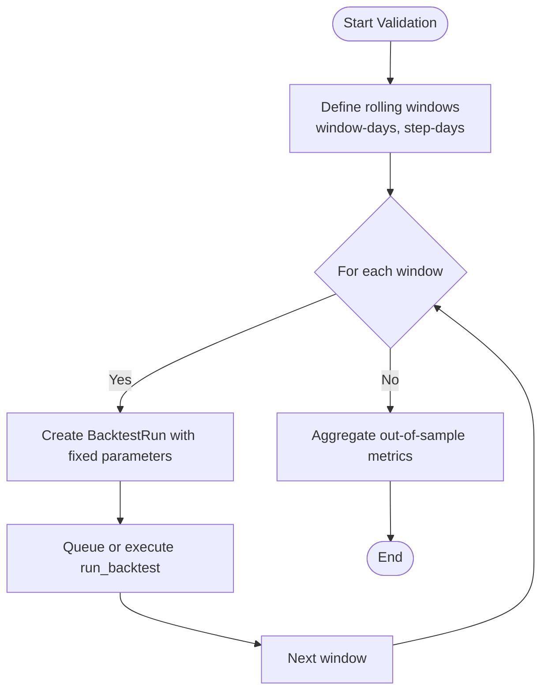

**Diagram sources**
- [apps/backtest/management/commands/run_validation_backtests.py:1-144](file://apps/backtest/management/commands/run_validation_backtests.py#L1-L144)
- [apps/backtest/tasks.py:1-800](file://apps/backtest/tasks.py#L1-L800)

**Section sources**
- [apps/backtest/management/commands/run_validation_backtests.py:1-144](file://apps/backtest/management/commands/run_validation_backtests.py#L1-L144)
- [apps/backtest/tasks.py:1-800](file://apps/backtest/tasks.py#L1-L800)

### Train-Test Splitting Strategy for Financial Time Series
- Training windows are bounded by start and end dates, aligned to point-in-time features
- Labels are constructed per horizon (3, 7, 30 days) and aligned to feature rows
- Missing-value contracts are enforced via artifact metadata; legacy neutral fills degrade gracefully but must be audited
- Ensemble weights refresh based on recent accuracy over a trailing basis window

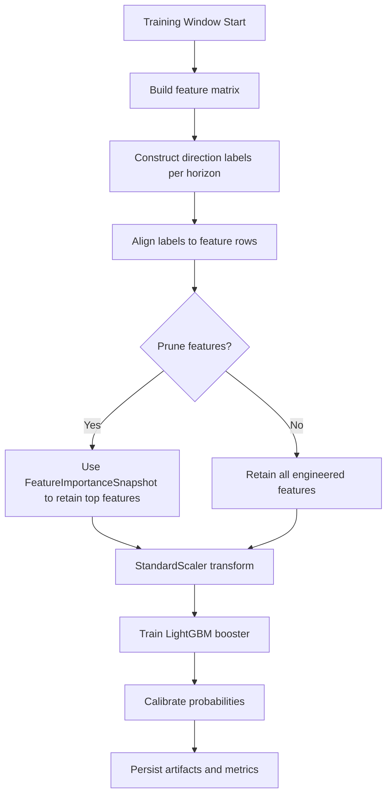

**Diagram sources**
- [apps/prediction/tasks_lightgbm.py:1981-2001](file://apps/prediction/tasks_lightgbm.py#L1981-L2001)
- [apps/prediction/tasks_lightgbm.py:477-579](file://apps/prediction/tasks_lightgbm.py#L477-L579)
- [docs/how-to/retrain.md:115-127](file://docs/how-to/retrain.md#L115-L127)

**Section sources**
- [apps/prediction/tasks_lightgbm.py:477-579](file://apps/prediction/tasks_lightgbm.py#L477-L579)
- [apps/prediction/tasks_lightgbm.py:1981-2001](file://apps/prediction/tasks_lightgbm.py#L1981-L2001)
- [docs/how-to/retrain.md:115-127](file://docs/how-to/retrain.md#L115-L127)

### Evaluation Metrics: Accuracy, Precision, Recall, AUC-ROC
- Accuracy is computed during LightGBM training on scaled training data using predicted class probabilities
- Precision and recall are not explicitly computed in the referenced code; they can be derived from backtest trade outcomes and confusion matrices built from prediction results versus realized returns
- AUC-ROC is not present in the referenced files; it would require storing true labels and predicted probabilities for ROC computation
- Ensemble weight snapshots use accuracy as the basis metric for weighting components

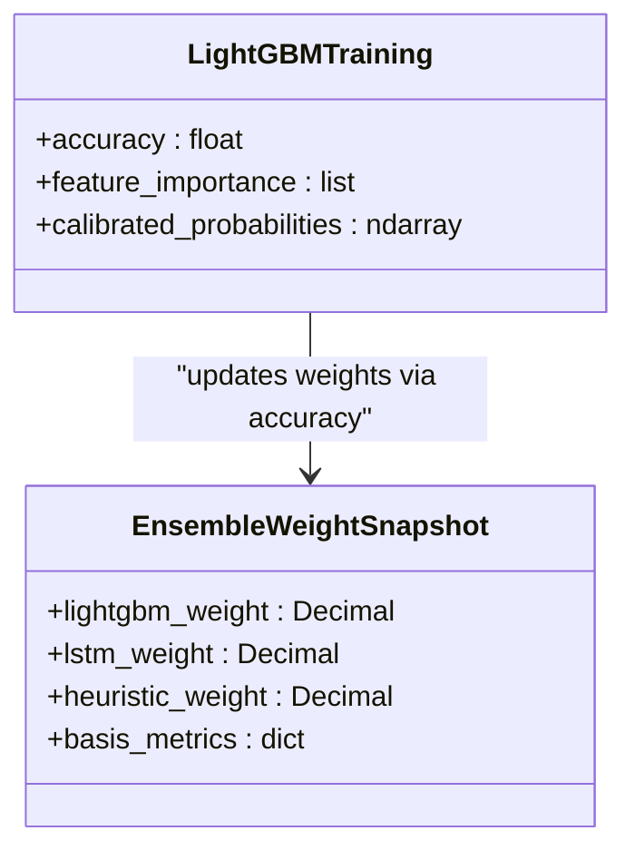

**Diagram sources**
- [apps/prediction/tasks_lightgbm.py:1981-2001](file://apps/prediction/tasks_lightgbm.py#L1981-L2001)
- [apps/prediction/tasks_lightgbm.py:631-681](file://apps/prediction/tasks_lightgbm.py#L631-L681)

**Section sources**
- [apps/prediction/tasks_lightgbm.py:1981-2001](file://apps/prediction/tasks_lightgbm.py#L1981-L2001)
- [apps/prediction/tasks_lightgbm.py:631-681](file://apps/prediction/tasks_lightgbm.py#L631-L681)

### Odds Estimation Process
- Inputs include asset ID, as-of date, horizon days, up probability, and predicted label
- Recent OHLCV rows are queried to derive resistance and support candidates
- Bollinger Bands and Simple Moving Averages inform target and stop-loss placement
- Policy options allow minimum target return and minimum stop distance constraints
- Risk-reward ratio and trade score combine probabilities with reward/risk to produce a suggested trade flag

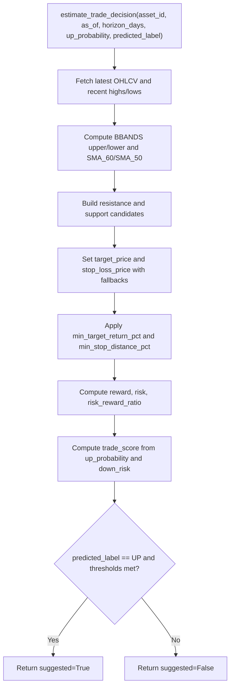

**Diagram sources**
- [apps/prediction/odds.py:60-158](file://apps/prediction/odds.py#L60-L158)

**Section sources**
- [apps/prediction/odds.py:60-158](file://apps/prediction/odds.py#L60-L158)

### Probability Calibration Techniques
- LightGBM training fits a CalibratedClassifierCV with sigmoid method when supported; otherwise falls back to an identity calibrator
- GPU acceleration is probed and cached when the underlying model supports direct predict with device type
- Calibrated probabilities are used for downstream decisions and metrics

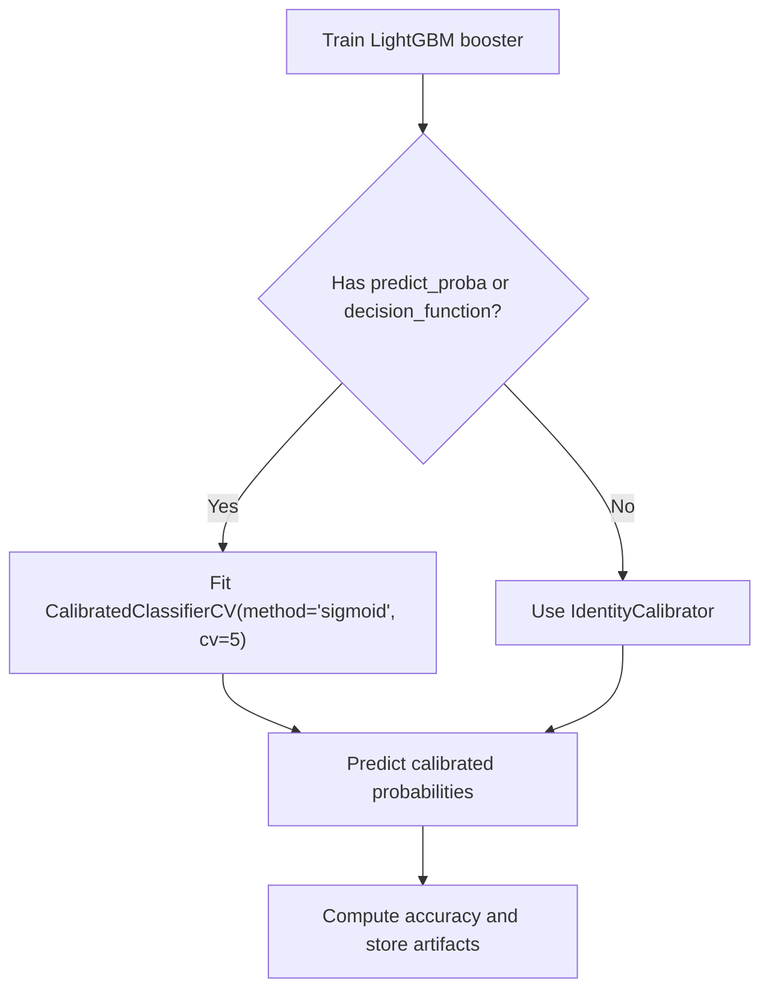

**Diagram sources**
- [apps/prediction/tasks_lightgbm.py:1981-2001](file://apps/prediction/tasks_lightgbm.py#L1981-L2001)
- [apps/prediction/tasks_lightgbm.py:170-181](file://apps/prediction/tasks_lightgbm.py#L170-L181)

**Section sources**
- [apps/prediction/tasks_lightgbm.py:170-181](file://apps/prediction/tasks_lightgbm.py#L170-L181)
- [apps/prediction/tasks_lightgbm.py:1981-2001](file://apps/prediction/tasks_lightgbm.py#L1981-L2001)

### Backtesting Integration for Validating Predictions
- Candidates are generated at runtime from artifacts and feature tables, ensuring comparability across runs
- Positions close before open on the same day to free capital and slots immediately
- Exits prefer conservative outcomes when both target and stop trigger on the same bar
- Fee models reflect CN A-share asymmetry (stamp duty on sells only), preventing inflated short-holding performance

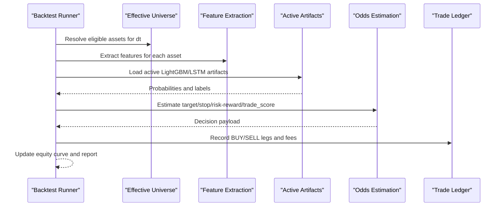

**Diagram sources**
- [apps/backtest/tasks.py:1-800](file://apps/backtest/tasks.py#L1-L800)
- [apps/backtest/models.py:24-168](file://apps/backtest/models.py#L24-L168)

**Section sources**
- [apps/backtest/tasks.py:1-800](file://apps/backtest/tasks.py#L1-L800)
- [apps/backtest/models.py:24-168](file://apps/backtest/models.py#L24-L168)

### Monitoring Model Drift and Performance Degradation Detection
- Data quality validation checks coverage gaps, continuity, and technical indicator reconciliation against OHLCV replay
- Effective universe alignment ensures features match the point-in-time universe on audit dates
- Backtest runs expose regime sensitivity through rolling windows; deviations versus benchmarks indicate drift
- Ensemble weight snapshots track recent accuracy trends; anomalies suggest upstream issues

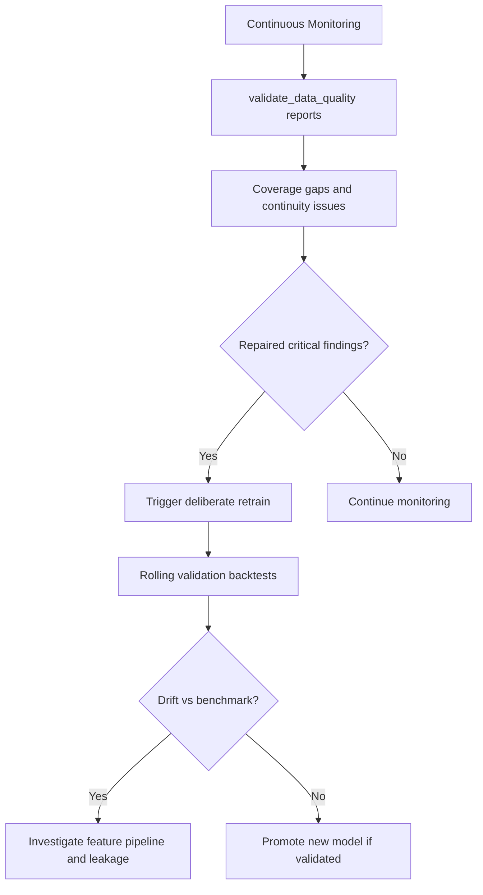

**Diagram sources**
- [apps/core/management/commands/validate_data_quality.py:136-198](file://apps/core/management/commands/validate_data_quality.py#L136-L198)
- [docs/how-to/retrain.md:190-224](file://docs/how-to/retrain.md#L190-L224)

**Section sources**
- [apps/core/management/commands/validate_data_quality.py:136-198](file://apps/core/management/commands/validate_data_quality.py#L136-L198)
- [docs/how-to/retrain.md:190-224](file://docs/how-to/retrain.md#L190-L224)

### Automated Retraining Triggers
- Scheduled retraining tasks have been removed to enforce deliberate retraining
- Triggers include material feature backfill changes, feature contract changes, effective universe expansion, validation backtest drift, and repaired critical data quality findings
- Retrain commands support version tagging, pruning, and skipping backfill stages

**Section sources**
- [apps/markets/migrations/0011_remove_scheduled_model_retraining_tasks.py:1-42](file://apps/markets/migrations/0011_remove_scheduled_model_retraining_tasks.py#L1-L42)
- [docs/how-to/retrain.md:10-23](file://docs/how-to/retrain.md#L10-L23)
- [docs/how-to/retrain.md:82-127](file://docs/how-to/retrain.md#L82-L127)

### Interpreting Validation Results and Setting Thresholds
- Directional accuracy typically lies within a narrow band; values significantly above plausible ranges indicate leakage
- Compare new families against incumbents on out-of-sample return, Sharpe, win rate, and alpha gap
- Use rolling validation backtests to assess stability across regimes rather than single aggregate numbers
- Set performance thresholds based on benchmark comparison and risk-adjusted metrics

**Section sources**
- [docs/how-to/retrain.md:190-224](file://docs/how-to/retrain.md#L190-L224)
- [TECHNICAL_GUIDE.md:656-687](file://TECHNICAL_GUIDE.md#L656-L687)

### Comparing Model Versions for Selection Decisions
- Read active artifacts from the appropriate registry table per model type
- Verify missing-value strategy presence and artifact path resolution
- Compare rolling validation results and ensemble weight snapshots to select the best-performing family
- Promote by activating artifacts per horizon and verify post-promotion state

**Section sources**
- [docs/how-to/retrain.md:27-48](file://docs/how-to/retrain.md#L27-L48)
- [docs/how-to/retrain.md:227-253](file://docs/how-to/retrain.md#L227-L253)

## Dependency Analysis
Key dependencies and relationships:
- Prediction tasks depend on factors, sentiment, technical indicators, and market context
- LightGBM tasks depend on artifacts, scalers, calibrators, and feature importance snapshots
- Backtest tasks depend on prediction tasks and odds estimation to generate candidates and decisions
- Data quality validation depends on OHLCV, technical indicators, and effective universe functions
- Operational migration removes periodic retraining tasks to enforce deliberate lifecycle

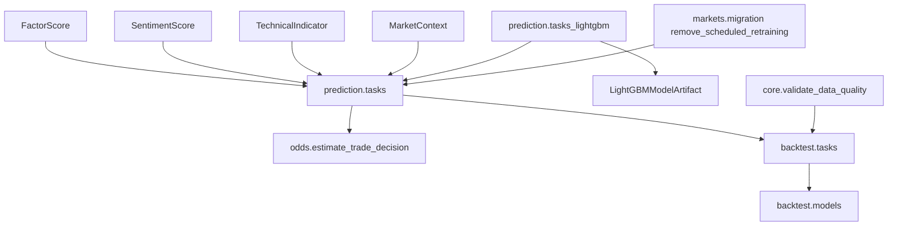

**Diagram sources**
- [apps/prediction/tasks.py:55-127](file://apps/prediction/tasks.py#L55-L127)
- [apps/prediction/tasks_lightgbm.py:1981-2001](file://apps/prediction/tasks_lightgbm.py#L1981-L2001)
- [apps/backtest/tasks.py:1-800](file://apps/backtest/tasks.py#L1-L800)
- [apps/core/management/commands/validate_data_quality.py:136-198](file://apps/core/management/commands/validate_data_quality.py#L136-L198)
- [apps/markets/migrations/0011_remove_scheduled_model_retraining_tasks.py:1-42](file://apps/markets/migrations/0011_remove_scheduled_model_retraining_tasks.py#L1-L42)

**Section sources**
- [apps/prediction/tasks.py:55-127](file://apps/prediction/tasks.py#L55-L127)
- [apps/prediction/tasks_lightgbm.py:1981-2001](file://apps/prediction/tasks_lightgbm.py#L1981-L2001)
- [apps/backtest/tasks.py:1-800](file://apps/backtest/tasks.py#L1-L800)
- [apps/core/management/commands/validate_data_quality.py:136-198](file://apps/core/management/commands/validate_data_quality.py#L136-L198)
- [apps/markets/migrations/0011_remove_scheduled_model_retraining_tasks.py:1-42](file://apps/markets/migrations/0011_remove_scheduled_model_retraining_tasks.py#L1-L42)

## Performance Considerations
- Batched LightGBM inference and GPU probing reduce latency during backtests
- Process-level caches bound trading dates, price maps, and matrix signals to control memory
- Chunked backtest execution enables long runs to survive worker restarts and soft time limits
- Asymmetric fee modeling prevents overstated short-holding performance
- Feature pruning retains top features while limiting computational overhead

[No sources needed since this section provides general guidance]

## Troubleshooting Guide
Common issues and resolutions:
- Implausibly high accuracy indicates leakage; investigate feature pipeline and missing-value strategy
- Missing artifact paths cause inference failures; verify path resolution after promotion
- Data quality gaps signal upstream provider blackouts or membership issues; repair and retrain
- Backtest failures due to missing OHLCV or suspension coverage; check effective universe and calendar

**Section sources**
- [docs/how-to/retrain.md:190-224](file://docs/how-to/retrain.md#L190-L224)
- [docs/how-to/retrain.md:274-290](file://docs/how-to/retrain.md#L274-L290)
- [apps/core/management/commands/validate_data_quality.py:136-198](file://apps/core/management/commands/validate_data_quality.py#L136-L198)

## Conclusion
The pipeline enforces rigorous temporal validation, calibrated probability estimation, and realistic backtesting to prevent look-ahead bias and detect drift. Deliberate retraining, comprehensive data quality auditing, and clear promotion criteria ensure model selection decisions are grounded in out-of-sample evidence. Use rolling validation backtests, accuracy sanity bounds, and ensemble weight snapshots to monitor performance and guide retraining and promotion.

[No sources needed since this section summarizes without analyzing specific files]

## Appendices

### Key Data Models for Validation and Metrics
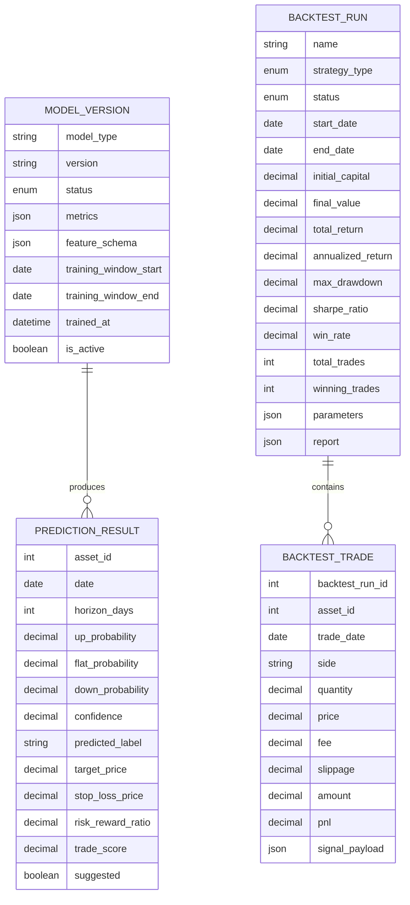

**Diagram sources**
- [apps/prediction/models.py:7-107](file://apps/prediction/models.py#L7-L107)
- [apps/backtest/models.py:24-168](file://apps/backtest/models.py#L24-L168)