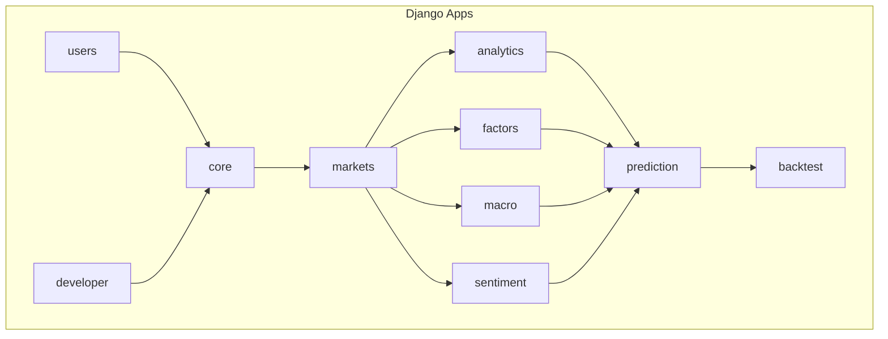
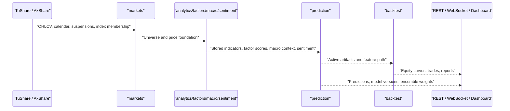
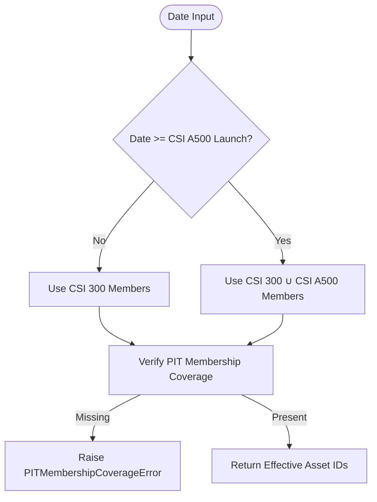
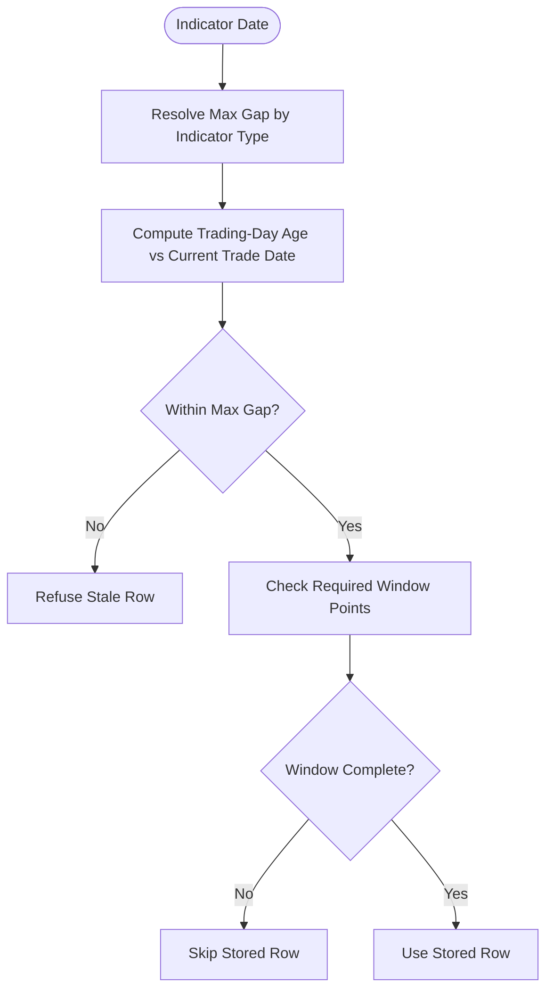
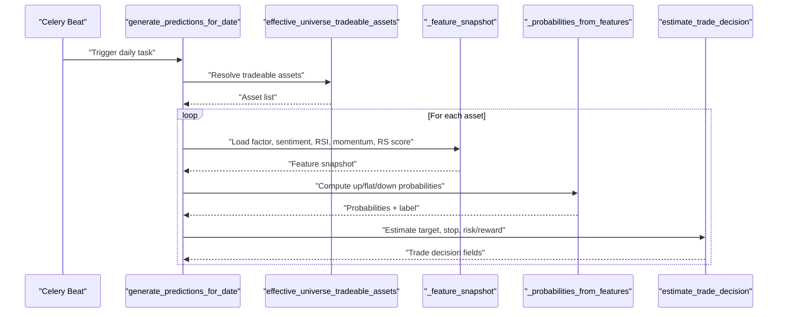
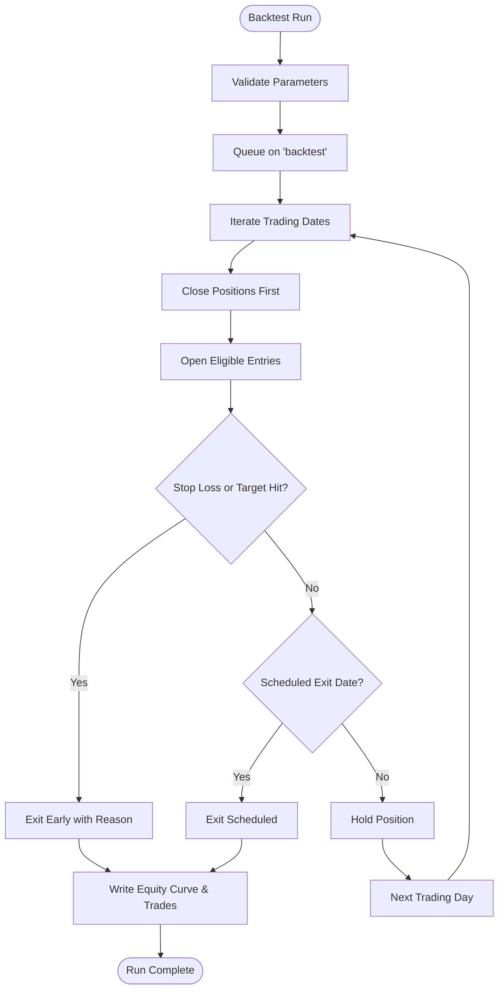
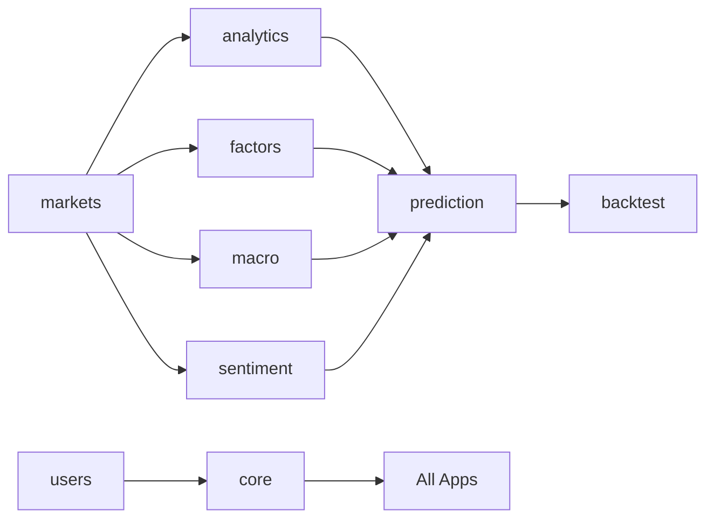

# Project Overview

<cite>
**Referenced Files in This Document**
- [README.md](file://README.md)
- [TECHNICAL_GUIDE.md](file://TECHNICAL_GUIDE.md)
- [config/settings/base.py](file://config/settings/base.py)
- [config/urls.py](file://config/urls.py)
- [apps/markets/benchmarking.py](file://apps/markets/benchmarking.py)
- [apps/analytics/technical_staleness.py](file://apps/analytics/technical_staleness.py)
- [apps/prediction/tasks.py](file://apps/prediction/tasks.py)
- [apps/backtest/tasks.py](file://apps/backtest/tasks.py)
</cite>

## Table of Contents
1. [Introduction](#introduction)
2. [Project Structure](#project-structure)
3. [Core Components](#core-components)
4. [Architecture Overview](#architecture-overview)
5. [Detailed Component Analysis](#detailed-component-analysis)
6. [Dependency Analysis](#dependency-analysis)
7. [Performance Considerations](#performance-considerations)
8. [Troubleshooting Guide](#troubleshooting-guide)
9. [Conclusion](#conclusion)

## Introduction
FinanceAnalysis is a Django-based financial analytics platform focused on Chinese A-share markets with CSI 300 and CSI A500 as the core benchmark universes. It ingests market, fundamental, macro, and news data; derives technical indicators and factor features; runs multiple prediction models (heuristic, LightGBM, LSTM); and backtests strategies against point-in-time benchmarks. The system exposes a REST API, a React dashboard, and live WebSocket alerts.

The platform’s core value proposition is rigorous point-in-time integrity: every cross-sectional calculation, training-sample filter, backtest candidate pool, benchmark build, and daily prediction resolves membership through a canonical effective-universe rule that expands from CSI 300-only to CSI 300 ∪ CSI A500 at a defined launch date. This prevents survivorship bias and ensures predictions and backtests reflect what was actually knowable at each date.

For beginners: think of the system as a pipeline that turns raw market data into actionable signals and trades, while strictly respecting “what was available when” so results are realistic and comparable. For experienced developers: the ten-app modular architecture enforces an upstream → derived ordering, with explicit staleness policies, point-in-time membership, and artifact governance to keep training, inference, and backtesting consistent.

**Section sources**
- [README.md:1-10](file://README.md#L1-L10)
- [README.md:48-114](file://README.md#L48-L114)

## Project Structure
The project follows a strict ten-app modular design with a clear upstream → derived ordering. Apps are registered in settings and routed via a central URL configuration. Celery queues separate operational, backtesting, and training workloads, while Redis provides caching, messaging, and Channels for real-time alerts. PostgreSQL persists all domain data.

**Diagram sources**
- [config/settings/base.py:64-88](file://config/settings/base.py#L64-L88)
- [config/urls.py:74-107](file://config/urls.py#L74-L107)

**Section sources**
- [config/settings/base.py:64-88](file://config/settings/base.py#L64-L88)
- [config/urls.py:74-107](file://config/urls.py#L74-L107)

## Core Components
- Point-in-time universe contract: Canonical rules define which assets belong to the effective universe on any given date, expanding from CSI 300-only to CSI 300 ∪ CSI A500 at a specific launch date. Missing coverage fails fast rather than silently widening.
- Technical freshness policy: Stored indicators and signals must be fresh according to trading-day gap rules. Stale rows are refused because they mislead models into reasoning about the wrong date.
- Prediction models: Heuristic probabilities combine factors, sentiment, momentum, and relative strength; LightGBM and LSTM provide multiclass direction predictions; ensemble weights monitor model performance over a basis window.
- Backtest engine: Generates candidates at runtime using active artifacts, closes positions before opening new ones per session, supports chunked resumable runs, and applies realistic CN A-share fee asymmetry.

These components ensure that data ingestion flows through derivation layers into prediction and backtesting with strict temporal integrity and transparent failure modes.

**Section sources**
- [apps/markets/benchmarking.py:1-13](file://apps/markets/benchmarking.py#L1-L13)
- [apps/analytics/technical_staleness.py:9-32](file://apps/analytics/technical_staleness.py#L9-L32)
- [apps/prediction/tasks.py:55-112](file://apps/prediction/tasks.py#L55-L112)
- [apps/backtest/tasks.py:1-37](file://apps/backtest/tasks.py#L1-L37)

## Architecture Overview
The platform implements a layered data flow: upstream market data feeds reference and price foundations; derived layers compute indicators, factors, macro context, and sentiment; prediction consumes these to generate probabilities and trade decisions; backtesting evaluates strategies against point-in-time benchmarks.

**Diagram sources**
- [README.md:65-90](file://README.md#L65-L90)
- [config/settings/base.py:218-255](file://config/settings/base.py#L218-L255)

## Detailed Component Analysis

### Effective Universe and Point-in-Time Membership
The canonical effective_universe rule governs all cross-sectional calculations and benchmark construction. Before the CSI A500 launch date, only CSI 300 members are considered; after that date, the union of both indices forms the universe. Coverage gaps raise explicit errors instead of silently widening to all assets.

**Diagram sources**
- [apps/markets/benchmarking.py:93-146](file://apps/markets/benchmarking.py#L93-L146)
- [apps/markets/benchmarking.py:240-278](file://apps/markets/benchmarking.py#L240-L278)

**Section sources**
- [apps/markets/benchmarking.py:1-13](file://apps/markets/benchmarking.py#L1-L13)
- [apps/markets/benchmarking.py:93-146](file://apps/markets/benchmarking.py#L93-L146)
- [apps/markets/benchmarking.py:240-278](file://apps/markets/benchmarking.py#L240-L278)

### Technical Freshness and Stale Data Policies
Technical indicators and signals are governed by trading-day gap rules. Gap-tolerant metrics allow bounded interior gaps; exact-window metrics require precise anchors and zero tolerance. Stale rows are refused because they cause silent misreasoning. Signal events also suppress stale outputs to maintain alignment with stored-indicator guards.

**Diagram sources**
- [apps/analytics/technical_staleness.py:9-32](file://apps/analytics/technical_staleness.py#L9-L32)
- [apps/analytics/technical_staleness.py:122-154](file://apps/analytics/technical_staleness.py#L122-L154)
- [apps/analytics/technical_staleness.py:173-190](file://apps/analytics/technical_staleness.py#L173-L190)

**Section sources**
- [apps/analytics/technical_staleness.py:9-32](file://apps/analytics/technical_staleness.py#L9-L32)
- [apps/analytics/technical_staleness.py:122-154](file://apps/analytics/technical_staleness.py#L122-L154)
- [apps/analytics/technical_staleness.py:173-190](file://apps/analytics/technical_staleness.py#L173-L190)

### Prediction Pipeline: From Features to Probabilities
Daily predictions consume stored technical indicators, factor scores, sentiment, and macro context. The heuristic model combines momentum, sentiment, relative strength, and factor bottom probability with horizon scaling and macro adjustments. LightGBM and LSTM produce multiclass direction labels calibrated to probabilities. Ensemble weights monitor recent accuracy across models.

**Diagram sources**
- [config/settings/base.py:218-255](file://config/settings/base.py#L218-L255)
- [apps/prediction/tasks.py:55-112](file://apps/prediction/tasks.py#L55-L112)
- [apps/prediction/tasks.py:177-200](file://apps/prediction/tasks.py#L177-L200)

**Section sources**
- [apps/prediction/tasks.py:55-112](file://apps/prediction/tasks.py#L55-L112)
- [apps/prediction/tasks.py:177-200](file://apps/prediction/tasks.py#L177-L200)

### Backtest Engine: Runtime Candidate Generation and Execution
Backtests do not rely on stored predictions; they regenerate candidates at runtime using active artifacts and feature tables. Each session closes positions before opening new ones, enabling accurate capital usage. Long runs are chunked and resumable, persisting progress in report state. Exit logic prioritizes stop-loss over target when both trigger on the same bar, and fees reflect CN A-share stamp duty asymmetry.

**Diagram sources**
- [apps/backtest/tasks.py:1-37](file://apps/backtest/tasks.py#L1-L37)
- [config/settings/base.py:184-200](file://config/settings/base.py#L184-L200)

**Section sources**
- [apps/backtest/tasks.py:1-37](file://apps/backtest/tasks.py#L1-L37)
- [config/settings/base.py:184-200](file://config/settings/base.py#L184-L200)

## Dependency Analysis
The ten-app architecture enforces a strict upstream → derived ordering. Market data and universe foundations feed derived layers (indicators, factors, macro, sentiment), which then feed prediction and backtesting. Cross-cutting concerns like pagination, throttling, and authentication are handled by core and users apps.

**Diagram sources**
- [config/settings/base.py:64-88](file://config/settings/base.py#L64-L88)
- [README.md:48-64](file://README.md#L48-L64)

**Section sources**
- [config/settings/base.py:64-88](file://config/settings/base.py#L64-L88)
- [README.md:48-64](file://README.md#L48-L64)

## Performance Considerations
- Chunked execution: Backtests process trading days in configurable chunks to survive worker restarts and soft time limits.
- Process-level caches: Bounded caches for trading dates, price maps, and signal matrices reduce repeated queries during long runs.
- Staleness guards: Refusing stale indicator rows avoids expensive but incorrect computations downstream.
- Feature extraction: LightGBM and LSTM use batched feature matrices and memory controls to bound peak usage.
- Fee modeling: Asymmetric CN A-share fees prevent underestimating turnover costs, improving realism without extra computation.

[No sources needed since this section provides general guidance]

## Troubleshooting Guide
Common issues and their diagnostics:

- Missing point-in-time membership coverage: If workflows fail due to missing IndexMembership snapshots, backfill index constituents before continuing. The error explicitly names the first missing date and affected codes.
- Stale technical indicators: When indicators are too old or windows are incomplete, stored rows are skipped and runtime falls back to documented neutral values. Rebuild the affected slices using backfill commands.
- Signal suppression: Signal tasks skip stale technical events; rebuild historical non-RS signals if needed.
- Model artifact paths: Absolute artifact paths may become invalid after migration; check generated models sheet for path resolution status before promotion.
- Plausible accuracy bounds: Directional accuracy typically sits between 0.42–0.58; significantly higher values suggest leakage and should be investigated before promoting artifacts.

**Section sources**
- [apps/markets/benchmarking.py:133-146](file://apps/markets/benchmarking.py#L133-L146)
- [apps/analytics/technical_staleness.py:117-125](file://apps/analytics/technical_staleness.py#L117-L125)
- [TECHNICAL_GUIDE.md:553-661](file://TECHNICAL_GUIDE.md#L553-L661)

## Conclusion
FinanceAnalysis delivers a robust, point-in-time-aware financial analytics platform for Chinese A-share markets. Its ten-app modular architecture, strict upstream → derived ordering, and explicit staleness policies ensure that predictions and backtests reflect realistic historical conditions. By anchoring analysis to CSI 300 and CSI A500 membership changes and refusing stale data, the system maintains integrity across ingestion, derivation, prediction, and evaluation stages. This makes it suitable for both exploratory research and production-grade strategy development where temporal correctness is paramount.

[No sources needed since this section summarizes without analyzing specific files]