# Backend Testing

<cite>
**Referenced Files in This Document**
- [manage.py](file://manage.py)
- [apps/analytics/tests.py](file://apps/analytics/tests.py)
- [apps/backtest/tests.py](file://apps/backtest/tests.py)
- [apps/core/tests.py](file://apps/core/tests.py)
- [apps/developer/tests.py](file://apps/developer/tests.py)
- [apps/factors/tests.py](file://apps/factors/tests.py)
- [apps/macro/tests.py](file://apps/macro/tests.py)
- [apps/markets/tests.py](file://apps/markets/tests.py)
- [apps/prediction/tests.py](file://apps/prediction/tests.py)
- [apps/sentiment/tests.py](file://apps/sentiment/tests.py)
- [apps/users/tests.py](file://apps/users/tests.py)
</cite>

## Table of Contents
1. [Introduction](#introduction)
2. [Project Structure](#project-structure)
3. [Core Components](#core-components)
4. [Architecture Overview](#architecture-overview)
5. [Detailed Component Analysis](#detailed-component-analysis)
6. [Dependency Analysis](#dependency-analysis)
7. [Performance Considerations](#performance-considerations)
8. [Troubleshooting Guide](#troubleshooting-guide)
9. [Conclusion](#conclusion)
10. [Appendices](#appendices)

## Introduction
This document explains the backend testing strategy for FinanceAnalysis, covering 339 tests across 11 modules: backtest, markets, prediction, analytics, users, core, factors, macro, developer, and sentiment. It describes how to run the Django test suite, manage databases with --keepdb, organize tests using django.test.TestCase, mock external dependencies with unittest.mock.patch, and follow class naming conventions that encode delivery phases (e.g., Phase9, Phase10, ...). It also provides guidance for running specific classes or methods, parallel execution, known failures such as Redis authentication issues, environment-specific problems, troubleshooting flaky tests, managing fixtures, and performance considerations for large, database-heavy suites.

## Project Structure
The test suite is organized per Django app under apps/<app>/tests.py. Each file contains phase-prefixed test classes that align with feature delivery phases. Tests commonly:
- Use django.test.TestCase for transactional DB isolation
- Use APIClient for API-level assertions
- Seed minimal data via setUp or helpers
- Mock external services (Tushare/AkShare providers, Celery tasks, ML artifacts) with unittest.mock.patch
- Validate business logic end-to-end through management commands and API endpoints

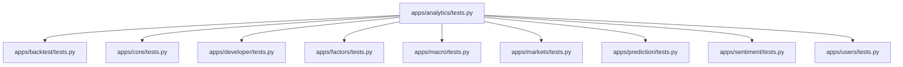

**Section sources**
- [apps/analytics/tests.py:39-800](file://apps/analytics/tests.py#L39-L800)
- [apps/backtest/tests.py:92-800](file://apps/backtest/tests.py#L92-L800)
- [apps/core/tests.py:51-800](file://apps/core/tests.py#L51-L800)
- [apps/developer/tests.py:12-223](file://apps/developer/tests.py#L12-L223)
- [apps/factors/tests.py:42-800](file://apps/factors/tests.py#L42-L800)
- [apps/macro/tests.py:22-800](file://apps/macro/tests.py#L22-L800)
- [apps/markets/tests.py:26-800](file://apps/markets/tests.py#L26-L800)
- [apps/prediction/tests.py:58-800](file://apps/prediction/tests.py#L58-L800)
- [apps/sentiment/tests.py:19-303](file://apps/sentiment/tests.py#L19-L303)
- [apps/users/tests.py:27-375](file://apps/users/tests.py#L27-L375)

## Core Components
- Test runner entry point: manage.py drives Django’s test discovery and execution.
- TestCase base: All tests inherit from django.test.TestCase to ensure a clean transactional database per test.
- API testing: rest_framework.test.APIClient is used to assert HTTP status codes, JSON payloads, and auth behavior.
- External dependency mocking: unittest.mock.patch is used extensively to stub Celery task delays, provider clients (Tushare/AkShare), and model artifact loaders.
- Management command validation: call_command is used to exercise data quality, backfill, and maintenance commands within tests.

**Section sources**
- [manage.py:1-200](file://manage.py#L1-L200)
- [apps/analytics/tests.py:1-800](file://apps/analytics/tests.py#L1-L800)
- [apps/backtest/tests.py:1-800](file://apps/backtest/tests.py#L1-L800)
- [apps/core/tests.py:1-800](file://apps/core/tests.py#L1-L800)
- [apps/developer/tests.py:1-223](file://apps/developer/tests.py#L1-L223)
- [apps/factors/tests.py:1-800](file://apps/factors/tests.py#L1-L800)
- [apps/macro/tests.py:1-800](file://apps/macro/tests.py#L1-L800)
- [apps/markets/tests.py:1-800](file://apps/markets/tests.py#L1-L800)
- [apps/prediction/tests.py:1-800](file://apps/prediction/tests.py#L1-L800)
- [apps/sentiment/tests.py:1-303](file://apps/sentiment/tests.py#L1-L303)
- [apps/users/tests.py:1-375](file://apps/users/tests.py#L1-L375)

## Architecture Overview
The test suite validates both unit and integration paths:
- Unit-style checks validate functions like indicator calculations, factor scoring, and prediction pipelines by seeding minimal data and asserting outputs.
- Integration-style checks hit API endpoints and management commands, ensuring correct routing, serialization, permissions, and side effects.
- Asynchronous workflows are validated by patching Celery .delay calls and asserting queue routing and state transitions.

```mermaid
sequenceDiagram
participant Runner as "Django Test Runner"
participant Client as "APIClient"
participant View as "API View"
participant Task as "Celery Task"
participant DB as "Test Database"
Runner->>Client : POST /api/v1/backtest/
Client->>View : Create BacktestRun
View->>DB : Persist run record
View-->>Client : 202 Accepted
View->>Task : run_backtest.delay(run_id)
Note over Task,DB : Task executes on worker; tests assert state changes after commit callbacks
```

**Diagram sources**
- [apps/backtest/tests.py:251-327](file://apps/backtest/tests.py#L251-L327)

**Section sources**
- [apps/backtest/tests.py:251-327](file://apps/backtest/tests.py#L251-L327)

## Detailed Component Analysis

### Analytics Tests
- Alert rule evaluation and cooldowns are tested by creating assets, OHLCV rows, and alert rules, then invoking check_alert_rules and asserting event creation and notification queuing.
- Dashboard stock API tests seed technical indicators, factor scores, predictions, and index memberships to verify filtering, ordering, and candidate overlays.
- Indicator recalculation endpoint queues background tasks with custom parameters.

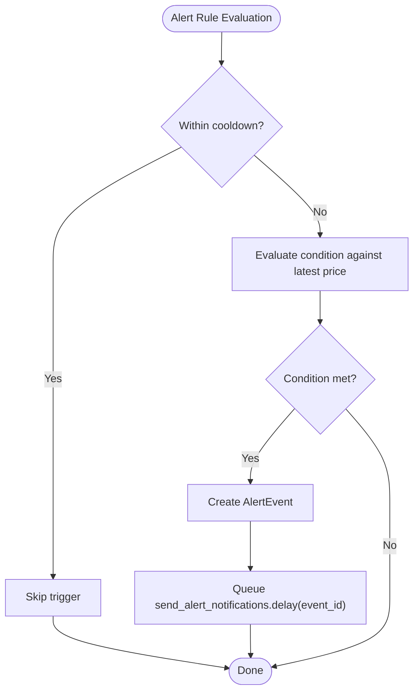

**Diagram sources**
- [apps/analytics/tests.py:39-106](file://apps/analytics/tests.py#L39-L106)

**Section sources**
- [apps/analytics/tests.py:39-106](file://apps/analytics/tests.py#L39-L106)
- [apps/analytics/tests.py:195-498](file://apps/analytics/tests.py#L195-L498)
- [apps/analytics/tests.py:500-800](file://apps/analytics/tests.py#L500-L800)

### Backtest Tests
- Lifecycle controls: pause, resume, restart, destroy operations transition BacktestRun states and interact with Celery task revocation and requeueing.
- Candidate selection filters respect point-in-time union membership and can use heuristic or LightGBM prediction sources.
- Backtest run task completes successfully when required data exists and fails gracefully on missing PIT coverage or database errors.

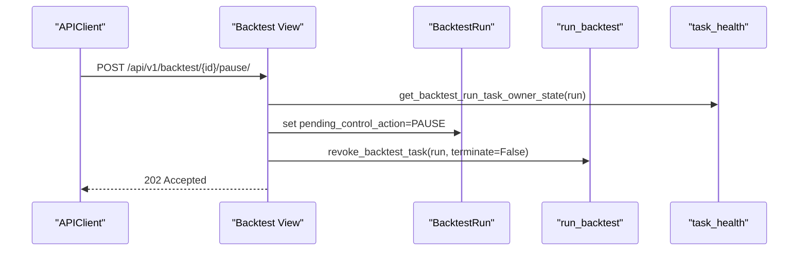

**Diagram sources**
- [apps/backtest/tests.py:275-305](file://apps/backtest/tests.py#L275-L305)
- [apps/backtest/tests.py:374-448](file://apps/backtest/tests.py#L374-L448)

**Section sources**
- [apps/backtest/tests.py:92-800](file://apps/backtest/tests.py#L92-L800)

### Core Tests
- Data quality validation command produces comprehensive CSV reports and metadata, asserting presence and content of multiple diagnostic files.
- Capital flow null reason bucketing distinguishes expected vs suspicious nulls based on source availability and warmup windows.

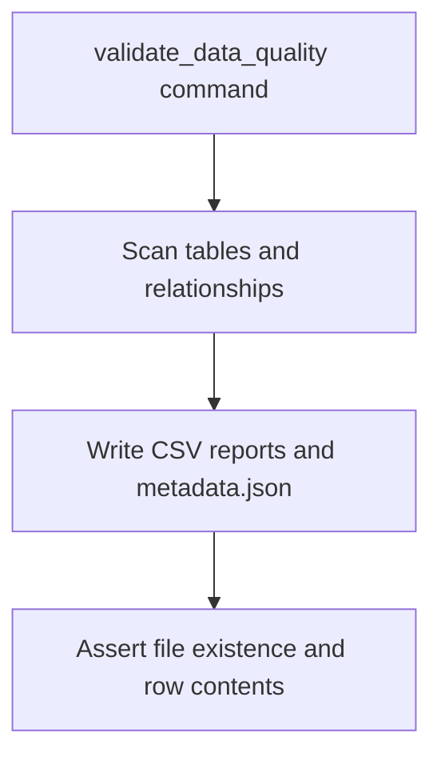

**Diagram sources**
- [apps/core/tests.py:286-524](file://apps/core/tests.py#L286-L524)

**Section sources**
- [apps/core/tests.py:51-800](file://apps/core/tests.py#L51-L800)

### Developer Tests
- API key lifecycle: create returns raw_key once, list excludes raw_key, rotate deactivates old key and returns new raw_key, delete revokes access.
- Authentication via X-API-Key header grants access; invalid keys return 401.
- Changelog and OpenAPI schema endpoints are accessible without authentication.

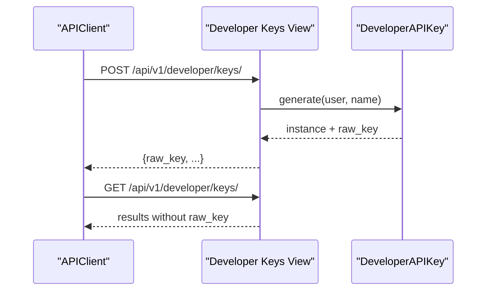

**Diagram sources**
- [apps/developer/tests.py:48-139](file://apps/developer/tests.py#L48-L139)

**Section sources**
- [apps/developer/tests.py:12-223](file://apps/developer/tests.py#L12-L223)

### Factors Tests
- Factor score calculation creates composite scores, ignores future OHLCV, refreshes existing rows without duplicates, and filters to point-in-time union membership.
- Backfill commands materialize fundamental snapshots and capital flow snapshots, handling missing fields and reprocessing stale rows.

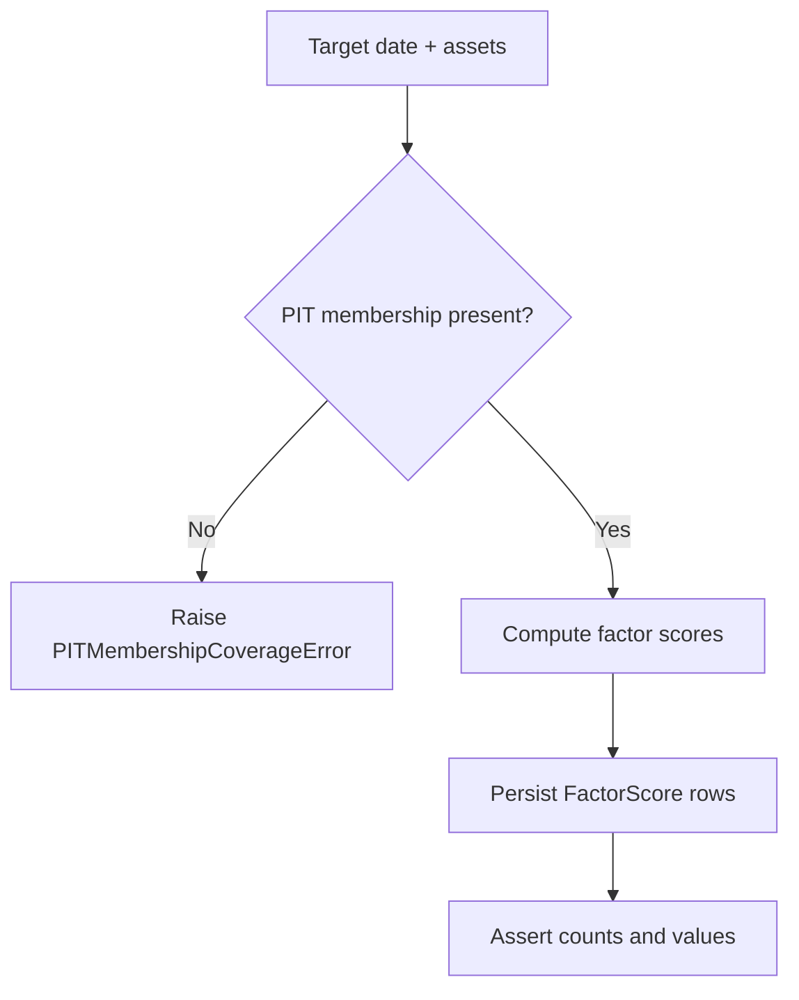

**Diagram sources**
- [apps/factors/tests.py:154-220](file://apps/factors/tests.py#L154-L220)
- [apps/factors/tests.py:285-304](file://apps/factors/tests.py#L285-L304)

**Section sources**
- [apps/factors/tests.py:42-800](file://apps/factors/tests.py#L42-L800)

### Macro Tests
- Market context inference updates current context based on macro snapshots and preserves history.
- Backfill commands build historical contexts and handle retries and fallbacks for yield curves and FX quotes.

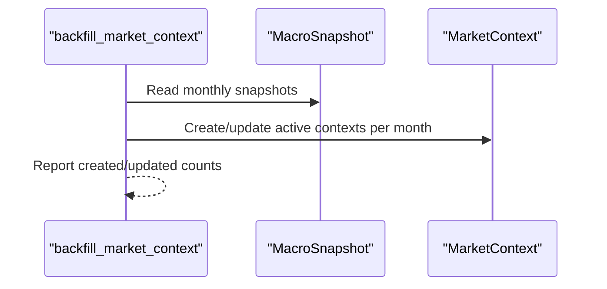

**Diagram sources**
- [apps/macro/tests.py:176-237](file://apps/macro/tests.py#L176-L237)

**Section sources**
- [apps/macro/tests.py:22-800](file://apps/macro/tests.py#L22-L800)

### Markets Tests
- Pagination and admin exposure verified for assets and OHLCV lists.
- Backfill commands extend repair windows for technical indicator warmup and dispatch merged CSV repairs for delisted assets.
- Trading calendar and suspension sync persist open days and full-day flags, deduplicate same-day rows, and reject partial calendar payloads.

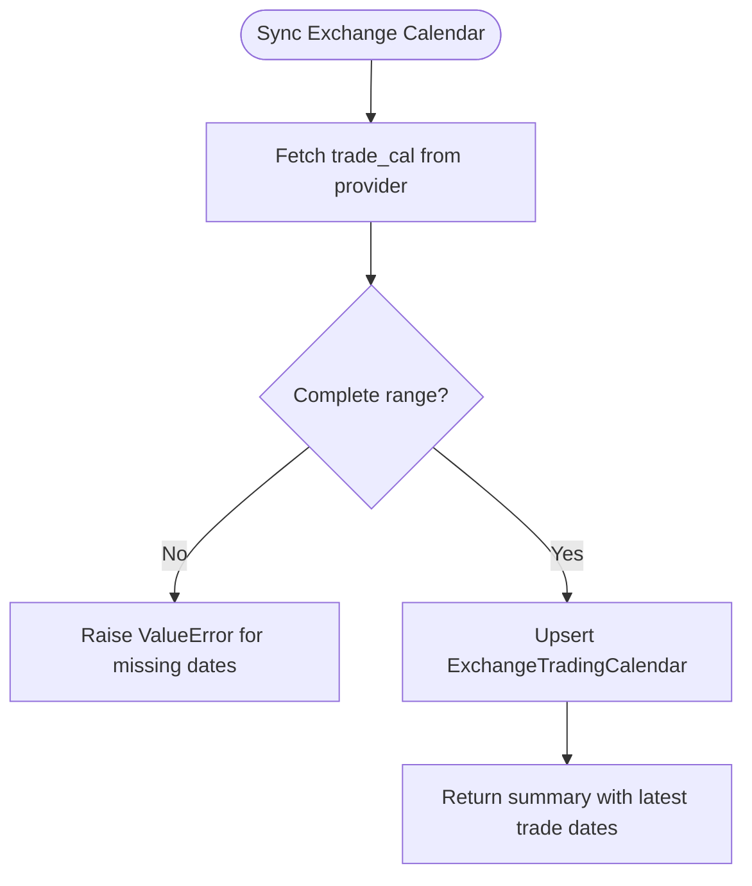

**Diagram sources**
- [apps/markets/tests.py:423-458](file://apps/markets/tests.py#L423-L458)
- [apps/markets/tests.py:500-531](file://apps/markets/tests.py#L500-L531)

**Section sources**
- [apps/markets/tests.py:26-800](file://apps/markets/tests.py#L26-L800)

### Prediction Tests
- Prediction generation creates snapshot rows for requested horizons, filters to effective universe, and uses market context at target date.
- LSTM predictions filter to PIT membership and resolve model versions; training pipeline refreshes ensemble registry while retiring legacy stubs.
- Recalculate endpoints queue training and prediction tasks.

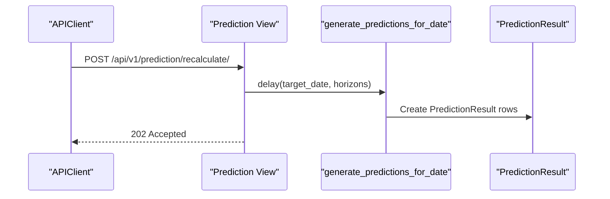

**Diagram sources**
- [apps/prediction/tests.py:525-532](file://apps/prediction/tests.py#L525-L532)
- [apps/prediction/tests.py:216-224](file://apps/prediction/tests.py#L216-L224)

**Section sources**
- [apps/prediction/tests.py:58-800](file://apps/prediction/tests.py#L58-L800)

### Sentiment Tests
- Daily sentiment creates article and asset scores, falls back for historically listed/delisted assets, and integrates into factor scores.
- Backfill and hourly historical backfill ingest news items, handle provider quotas, and defer when rate-limited.

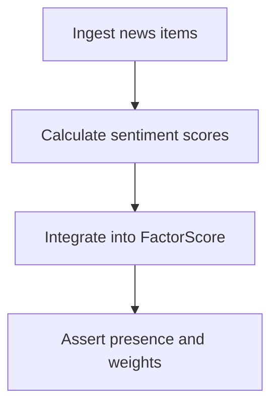

**Diagram sources**
- [apps/sentiment/tests.py:42-101](file://apps/sentiment/tests.py#L42-L101)
- [apps/sentiment/tests.py:110-159](file://apps/sentiment/tests.py#L110-L159)

**Section sources**
- [apps/sentiment/tests.py:19-303](file://apps/sentiment/tests.py#L19-L303)

### Users Tests
- Registration, email verification, password reset flows assert user creation, token handling, and security behaviors.
- Auth throttling uses dedicated scopes and respects configured limits.
- Profile, subscription, and usage stats endpoints enforce authentication and scoping.

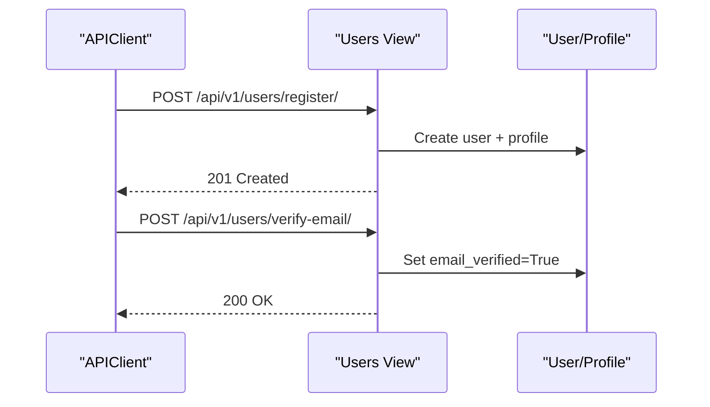

**Diagram sources**
- [apps/users/tests.py:41-83](file://apps/users/tests.py#L41-L83)

**Section sources**
- [apps/users/tests.py:27-375](file://apps/users/tests.py#L27-L375)

## Dependency Analysis
Tests depend on:
- Django ORM models across apps (Markets, Analytics, Factors, Prediction, Macro, Sentiment, Users)
- External providers mocked via Tushare/AkShare interfaces
- Celery tasks for asynchronous processing
- REST framework for API testing

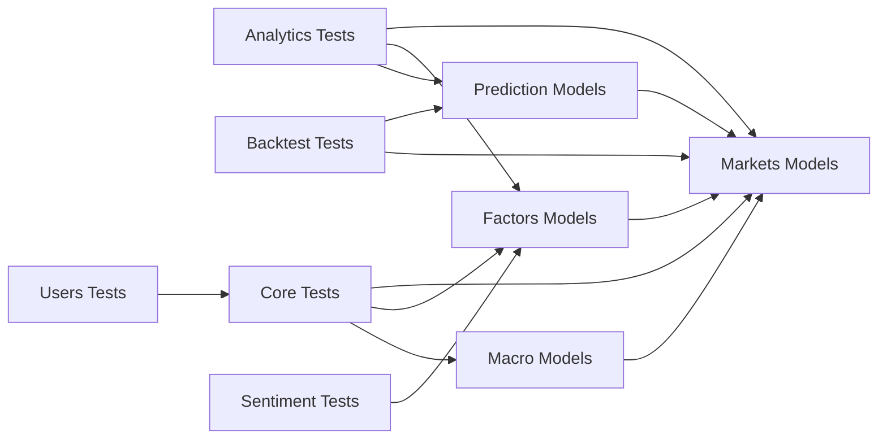

**Diagram sources**
- [apps/analytics/tests.py:1-800](file://apps/analytics/tests.py#L1-L800)
- [apps/backtest/tests.py:1-800](file://apps/backtest/tests.py#L1-L800)
- [apps/core/tests.py:1-800](file://apps/core/tests.py#L1-L800)
- [apps/factors/tests.py:1-800](file://apps/factors/tests.py#L1-L800)
- [apps/macro/tests.py:1-800](file://apps/macro/tests.py#L1-L800)
- [apps/markets/tests.py:1-800](file://apps/markets/tests.py#L1-L800)
- [apps/prediction/tests.py:1-800](file://apps/prediction/tests.py#L1-L800)
- [apps/sentiment/tests.py:1-303](file://apps/sentiment/tests.py#L1-L303)
- [apps/users/tests.py:1-375](file://apps/users/tests.py#L1-L375)

**Section sources**
- [apps/analytics/tests.py:1-800](file://apps/analytics/tests.py#L1-L800)
- [apps/backtest/tests.py:1-800](file://apps/backtest/tests.py#L1-L800)
- [apps/core/tests.py:1-800](file://apps/core/tests.py#L1-L800)
- [apps/factors/tests.py:1-800](file://apps/factors/tests.py#L1-L800)
- [apps/macro/tests.py:1-800](file://apps/macro/tests.py#L1-L800)
- [apps/markets/tests.py:1-800](file://apps/markets/tests.py#L1-L800)
- [apps/prediction/tests.py:1-800](file://apps/prediction/tests.py#L1-L800)
- [apps/sentiment/tests.py:1-303](file://apps/sentiment/tests.py#L1-L303)
- [apps/users/tests.py:1-375](file://apps/users/tests.py#L1-L375)

## Performance Considerations
- Prefer --keepdb to avoid recreating the test database between runs, reducing setup overhead.
- Use selective test discovery to run only affected modules or classes to speed up feedback loops.
- For database-heavy tests (e.g., backfills, data quality), consider splitting into smaller batches or using fixtures where appropriate.
- Mock expensive external calls (provider APIs, model artifact loads) to keep tests fast and deterministic.
- Avoid unnecessary bulk writes in setUp; create only the minimal dataset required for each assertion.

[No sources needed since this section provides general guidance]

## Troubleshooting Guide
- Running the suite:
  - Execute all tests: python manage.py test
  - Keep DB between runs: python manage.py test --keepdb
  - Run a specific module: python manage.py test apps.backtest.tests
  - Run a specific class: python manage.py test apps.backtest.tests.Phase15BacktestTests
  - Run a specific method: python manage.py test apps.backtest.tests.Phase15BacktestTests.test_create_backtest_queues_task
  - Parallel execution: python manage.py test --parallel
- Known issues:
  - Redis authentication failures may occur if cache or session backends rely on Redis during tests. Ensure Redis is available or configure an in-memory cache for tests.
  - Environment-specific provider credentials (e.g., TUSHARE_TOKEN) must be set or patched; tests often override settings or mock providers.
- Flaky tests:
  - Time-sensitive tests should mock timezone.now or use fixed dates to avoid drift.
  - Concurrency-related tests should isolate caches and clear state before/after runs.
- Fixture management:
  - Prefer inline setUp data for small, focused scenarios.
  - Use helper functions (e.g., _make_ohlcv_sequence, _seed_trading_calendar_dates) to reduce duplication and ensure consistent calendar alignment.
- Debugging:
  - Use verbosity: python manage.py test --verbosity=2
  - Isolate failing tests with -k or path selectors
  - Inspect stdout/stderr from management commands via StringIO captures

**Section sources**
- [apps/macro/tests.py:532-584](file://apps/macro/tests.py#L532-L584)
- [apps/sentiment/tests.py:267-303](file://apps/sentiment/tests.py#L267-L303)
- [apps/markets/tests.py:500-531](file://apps/markets/tests.py#L500-L531)

## Conclusion
The FinanceAnalysis backend test suite provides robust coverage across critical domains, combining unit and integration approaches with careful data seeding and external dependency mocking. By following the patterns described here—using TestCase, APIClient, patching Celery and providers, and leveraging management commands—you can confidently add new tests, maintain stability, and optimize performance for large datasets and complex pipelines.

[No sources needed since this section summarizes without analyzing specific files]

## Appendices
- Test organization tips:
  - Group related assertions in phase-prefixed classes to reflect delivery milestones.
  - Keep setUp minimal; extract common seeds into helpers.
  - Use override_settings for environment-specific configurations in tests.
- Best practices:
  - Always mock network-bound providers to avoid flakiness.
  - Validate both success and failure paths (e.g., missing PIT membership, database errors).
  - Assert side effects (queued tasks, persisted records, report files) to ensure correctness.

[No sources needed since this section provides general guidance]