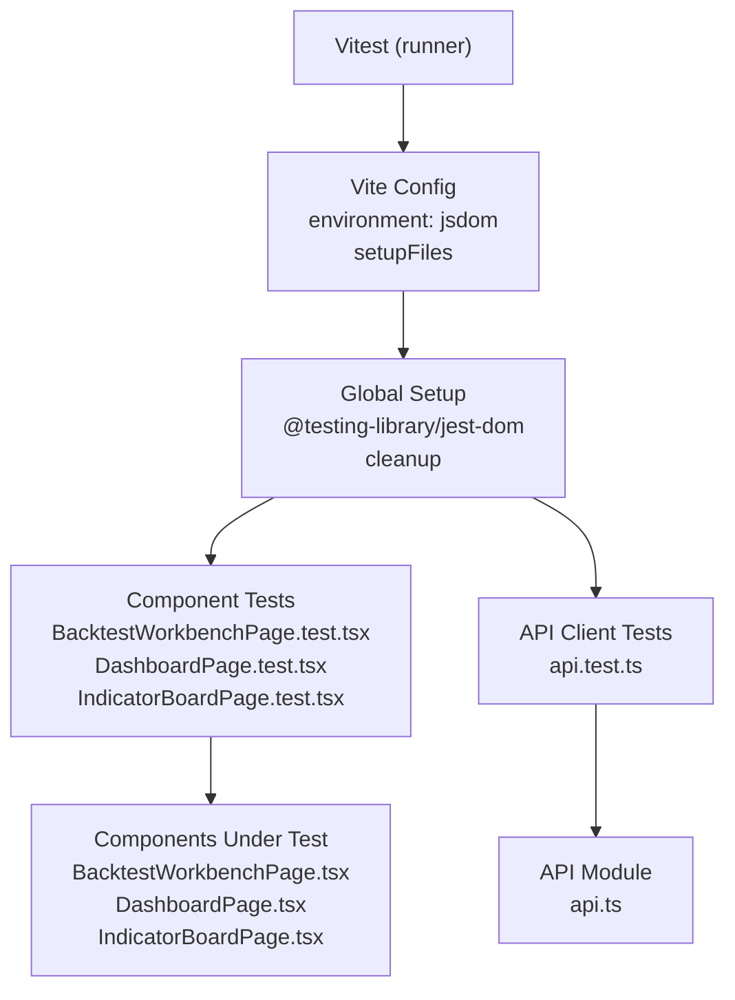
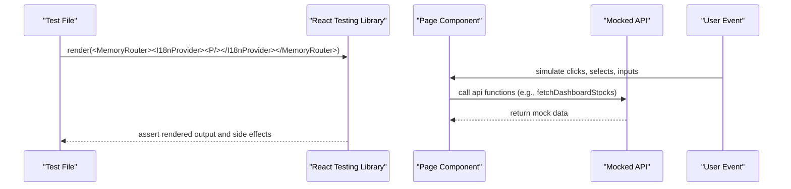
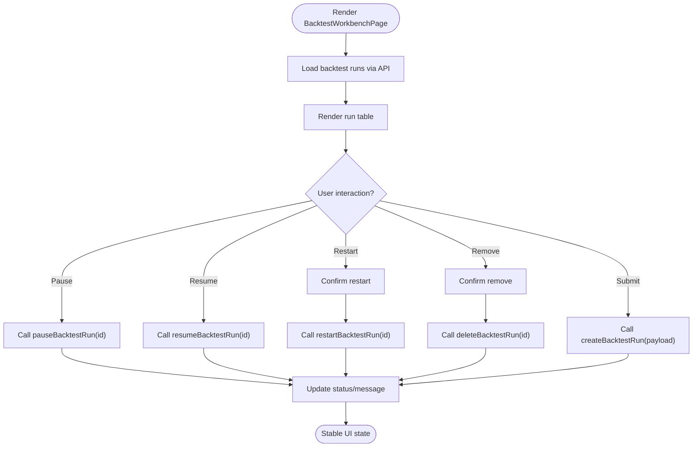
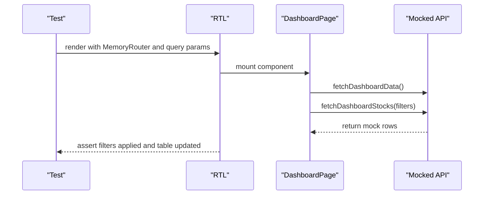
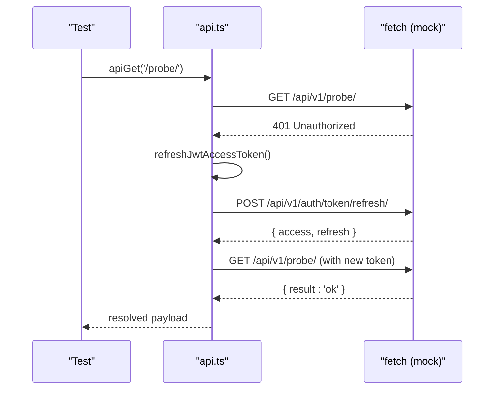
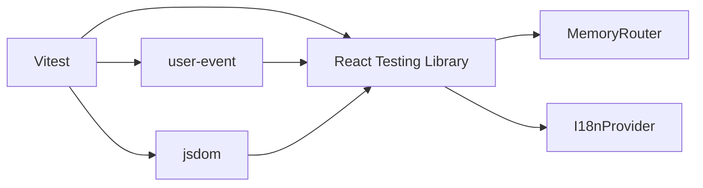

# Frontend Testing

<cite>
**Referenced Files in This Document**
- [vite.config.ts](file://frontend/vite.config.ts)
- [package.json](file://frontend/package.json)
- [setup.ts](file://frontend/src/test/setup.ts)
- [api.test.ts](file://frontend/src/lib/api.test.ts)
- [BacktestWorkbenchPage.test.tsx](file://frontend/src/pages/BacktestWorkbenchPage.test.tsx)
- [DashboardPage.test.tsx](file://frontend/src/pages/DashboardPage.test.tsx)
- [IndicatorBoardPage.test.tsx](file://frontend/src/pages/IndicatorBoardPage.test.tsx)
- [api.ts](file://frontend/src/lib/api.ts)
- [BacktestWorkbenchPage.tsx](file://frontend/src/pages/BacktestWorkbenchPage.tsx)
- [DashboardPage.tsx](file://frontend/src/pages/DashboardPage.tsx)
- [IndicatorBoardPage.tsx](file://frontend/src/pages/IndicatorBoardPage.tsx)
</cite>

## Table of Contents
1. Introduction
2. Project Structure
3. Core Components
4. Architecture Overview
5. Detailed Component Analysis
6. Dependency Analysis
7. Performance Considerations
8. Troubleshooting Guide
9. Conclusion

## Introduction
This document explains the frontend testing setup and strategies for the FinanceAnalysis React application. The project uses Vitest with a jsdom environment, React Testing Library for component tests, and user-event for simulating interactions. There are 31 tests across four files covering:
- BacktestWorkbenchPage
- DashboardPage
- IndicatorBoardPage
- API client utilities

It also covers how to run tests, development mode behavior, configuration via Vite, mocking approaches, state management testing patterns, async handling, cross-browser considerations, and performance testing guidance for financial charts and real-time updates.

## Project Structure
The test suite is organized under the frontend directory:
- Test runner and environment configured in Vite config
- Global test setup file for DOM assertions and cleanup
- Page-level tests using React Testing Library and mocked API modules
- Unit tests for the API client module

**Diagram sources**
- [vite.config.ts:24-27](file://frontend/vite.config.ts#L24-L27)
- [setup.ts:1-7](file://frontend/src/test/setup.ts#L1-L7)
- [BacktestWorkbenchPage.test.tsx:1-19](file://frontend/src/pages/BacktestWorkbenchPage.test.tsx#L1-L19)
- [DashboardPage.test.tsx:1-22](file://frontend/src/pages/DashboardPage.test.tsx#L1-L22)
- [IndicatorBoardPage.test.tsx:1-19](file://frontend/src/pages/IndicatorBoardPage.test.tsx#L1-L19)
- [api.test.ts:1-14](file://frontend/src/lib/api.test.ts#L1-L14)

**Section sources**
- [vite.config.ts:1-29](file://frontend/vite.config.ts#L1-L29)
- [package.json:6-11](file://frontend/package.json#L6-L11)
- [setup.ts:1-7](file://frontend/src/test/setup.ts#L1-L7)

## Core Components
- Test runner: Vitest invoked via npm script
- Environment: jsdom for DOM APIs
- Assertions: @testing-library/jest-dom matchers
- Cleanup: automatic cleanup after each test
- Routing: MemoryRouter for isolated page tests
- Internationalization: I18nProvider wrapper for i18n-aware components
- Mocking: vi.mock for API layer; vi.stubGlobal for browser APIs like ResizeObserver and fetch

Key execution commands:
- Run tests once: npm test
- Development watch mode: use Vitest’s watch mode by running vitest directly or configure an npm script if desired

Configuration highlights:
- Vite test block sets environment to jsdom and registers setup file
- package.json defines scripts including "test" that runs Vitest

**Section sources**
- [package.json:6-11](file://frontend/package.json#L6-L11)
- [vite.config.ts:24-27](file://frontend/vite.config.ts#L24-L27)
- [setup.ts:1-7](file://frontend/src/test/setup.ts#L1-L7)

## Architecture Overview
The testing architecture isolates UI behavior from backend dependencies by mocking the API layer. Pages render within MemoryRouter and I18nProvider, ensuring stable routing and localization contexts. User interactions are simulated with user-event, and asynchronous flows are handled with waitFor and timers.

**Diagram sources**
- [BacktestWorkbenchPage.test.tsx:30-336](file://frontend/src/pages/BacktestWorkbenchPage.test.tsx#L30-L336)
- [DashboardPage.test.tsx:14-22](file://frontend/src/pages/DashboardPage.test.tsx#L14-L22)
- [IndicatorBoardPage.test.tsx:12-19](file://frontend/src/pages/IndicatorBoardPage.test.tsx#L12-L19)

## Detailed Component Analysis

### BacktestWorkbenchPage Tests
Coverage includes:
- Mode-scoped control visibility toggling
- Auto-syncing horizon when metric changes
- Loading previous run configuration and updating rerun prefix
- Conditional rendering of weekday selectors
- Submitting backtest jobs with compare target
- Pausing, resuming, restarting, and removing runs
- Handling stale/dead task states
- Auto-refresh intervals for run list and trades

Testing strategies:
- Full API module mock with vi.mock('../lib/api', ...) returning realistic DTOs
- Use of MemoryRouter to isolate routes
- I18nProvider to ensure localized labels
- userEvent for form interactions
- waitFor to handle async renders and network calls
- Spying on window.confirm for destructive actions
- Intercepting setInterval/clearInterval to drive auto-refresh logic deterministically

**Diagram sources**
- [BacktestWorkbenchPage.test.tsx:416-800](file://frontend/src/pages/BacktestWorkbenchPage.test.tsx#L416-L800)
- [BacktestWorkbenchPage.tsx:1-200](file://frontend/src/pages/BacktestWorkbenchPage.tsx#L1-L200)

**Section sources**
- [BacktestWorkbenchPage.test.tsx:1-800](file://frontend/src/pages/BacktestWorkbenchPage.test.tsx#L1-L800)
- [BacktestWorkbenchPage.tsx:1-200](file://frontend/src/pages/BacktestWorkbenchPage.tsx#L1-L200)

### DashboardPage Tests
Coverage includes:
- Hydrating filters and reminders from URL parameters
- Applying trade-score mode filters from the dashboard form
- Rendering only selected prediction source columns
- Sorting filtered candidate lists via sortable headers

Testing strategies:
- Mock API functions for dashboard data and stocks
- Use MemoryRouter with initial query strings to simulate URL-driven state
- Assert that fetchDashboardStocks is called with correct filter objects
- Verify visible elements reflect applied filters and sorting

**Diagram sources**
- [DashboardPage.test.tsx:103-209](file://frontend/src/pages/DashboardPage.test.tsx#L103-L209)
- [DashboardPage.tsx:93-200](file://frontend/src/pages/DashboardPage.tsx#L93-L200)

**Section sources**
- [DashboardPage.test.tsx:1-209](file://frontend/src/pages/DashboardPage.test.tsx#L1-L209)
- [DashboardPage.tsx:1-200](file://frontend/src/pages/DashboardPage.tsx#L1-L200)

### IndicatorBoardPage Tests
Coverage includes:
- Rendering standalone indicator board
- Loading dashboard rows with default pagination and horizon

Testing strategies:
- Minimal mock of fetchDashboardStocks
- Assert that the page loads expected title and asset row
- Validate API call arguments (predictionHorizon and pageSize)

**Section sources**
- [IndicatorBoardPage.test.tsx:1-89](file://frontend/src/pages/IndicatorBoardPage.test.tsx#L1-L89)
- [IndicatorBoardPage.tsx:1-180](file://frontend/src/pages/IndicatorBoardPage.tsx#L1-L180)

### API Client Tests
Coverage includes:
- JWT refresh token rotation persistence
- Coalescing concurrent refresh requests behind a single refresh
- Clearing dead JWT tokens while preserving API keys
- Fetching paginated OHLCV data with larger page sizes to reduce fan-out

Testing strategies:
- Stub global fetch to control responses
- Use deferred responses to simulate timing-sensitive scenarios
- Verify persisted tokens via readAuthToken/readRefreshToken
- Ensure error paths clear credentials appropriately

**Diagram sources**
- [api.test.ts:33-93](file://frontend/src/lib/api.test.ts#L33-L93)
- [api.ts:531-583](file://frontend/src/lib/api.ts#L531-L583)

**Section sources**
- [api.test.ts:1-131](file://frontend/src/lib/api.test.ts#L1-L131)
- [api.ts:1-800](file://frontend/src/lib/api.ts#L1-L800)

## Dependency Analysis
The tests depend on:
- Vitest for test orchestration and mocking
- React Testing Library for DOM queries and assertions
- user-event for realistic user interactions
- jsdom for DOM APIs in Node
- MemoryRouter for isolated routing context
- I18nProvider for consistent internationalization during tests

**Diagram sources**
- [package.json:20-37](file://frontend/package.json#L20-L37)
- [vite.config.ts:24-27](file://frontend/vite.config.ts#L24-L27)

**Section sources**
- [package.json:20-37](file://frontend/package.json#L20-L37)
- [vite.config.ts:24-27](file://frontend/vite.config.ts#L24-L27)

## Performance Considerations
- Chart rendering: Financial charts (e.g., lightweight-charts, recharts) can be heavy. In tests, prefer stubbing chart libraries or mocking their initialization to avoid expensive renders. For example, mock chart constructors or canvas operations where necessary.
- Real-time updates: The BacktestWorkbenchPage uses periodic polling. Tests intercept setInterval/clearInterval to control refresh cycles deterministically. When adding new timers, follow this pattern to avoid flaky tests.
- Large datasets: Dashboard and IndicatorBoard pages load paginated data. Keep test payloads small and focused on critical fields to speed up renders and assertions.
- Network latency: Mock all API calls to return immediately. Avoid real network calls in unit tests to keep them fast and deterministic.
- Memory usage: Clean up listeners and timers in tests. The global setup already cleans up RTL containers; ensure any custom subscriptions are torn down in afterEach or within tests.

[No sources needed since this section provides general guidance]

## Troubleshooting Guide
Common issues and resolutions:
- Missing DOM APIs: If tests fail due to missing APIs (e.g., ResizeObserver), stub them globally as shown in BacktestWorkbenchPage tests.
- Flaky async tests: Use waitFor instead of fixed delays. Ensure you await async operations before asserting.
- Timer-related flakiness: Spy on setInterval/clearInterval and invoke callbacks manually to control timing.
- Authentication state leakage: Reset auth settings in beforeEach/afterEach to avoid cross-test pollution.
- Router context: Always wrap components in MemoryRouter when testing route-dependent logic.
- i18n mismatches: Set locale in localStorage or provide I18nProvider consistently across tests.

**Section sources**
- [BacktestWorkbenchPage.test.tsx:21-28](file://frontend/src/pages/BacktestWorkbenchPage.test.tsx#L21-L28)
- [BacktestWorkbenchPage.test.tsx:694-800](file://frontend/src/pages/BacktestWorkbenchPage.test.tsx#L694-L800)
- [api.test.ts:33-42](file://frontend/src/lib/api.test.ts#L33-L42)
- [setup.ts:5-7](file://frontend/src/test/setup.ts#L5-L7)

## Conclusion
The FinanceAnalysis frontend employs a robust, modern testing stack centered around Vitest and React Testing Library. Tests isolate UI behavior through comprehensive API mocking, simulate realistic user interactions, and handle asynchronous flows deterministically. The configuration leverages jsdom for DOM support and a centralized setup for consistent assertions and cleanup. Following the patterns documented here will help maintain reliable, fast, and maintainable tests as the application evolves, especially for complex financial dashboards and real-time features.

[No sources needed since this section summarizes without analyzing specific files]