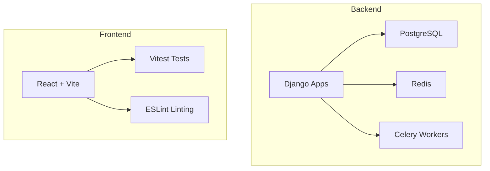
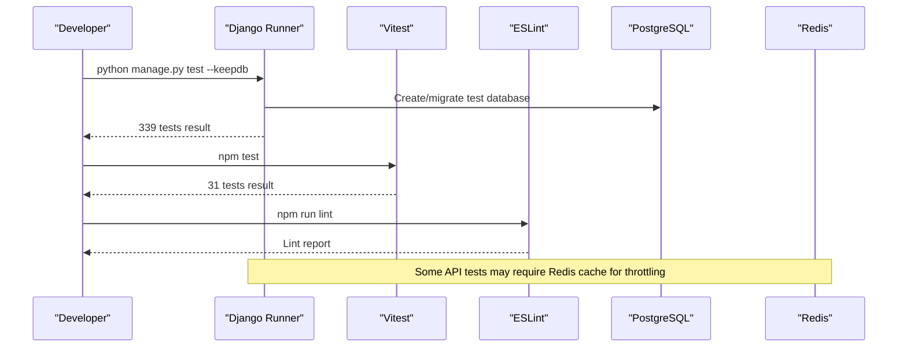
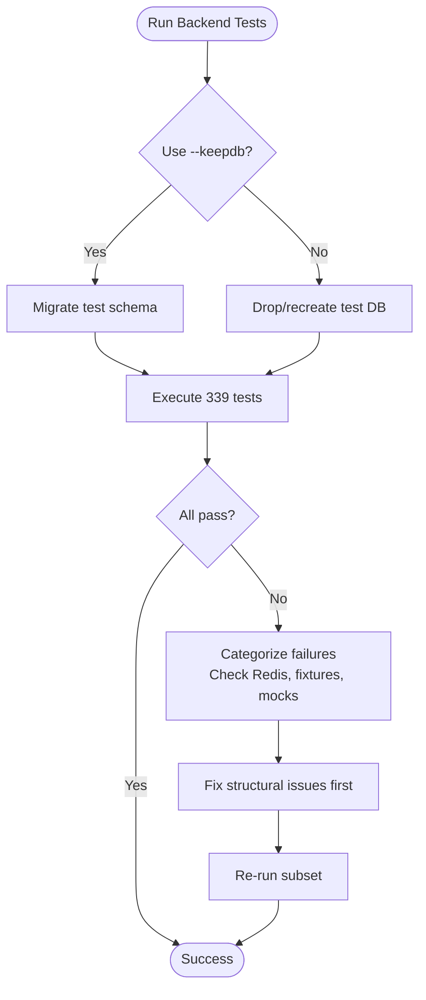
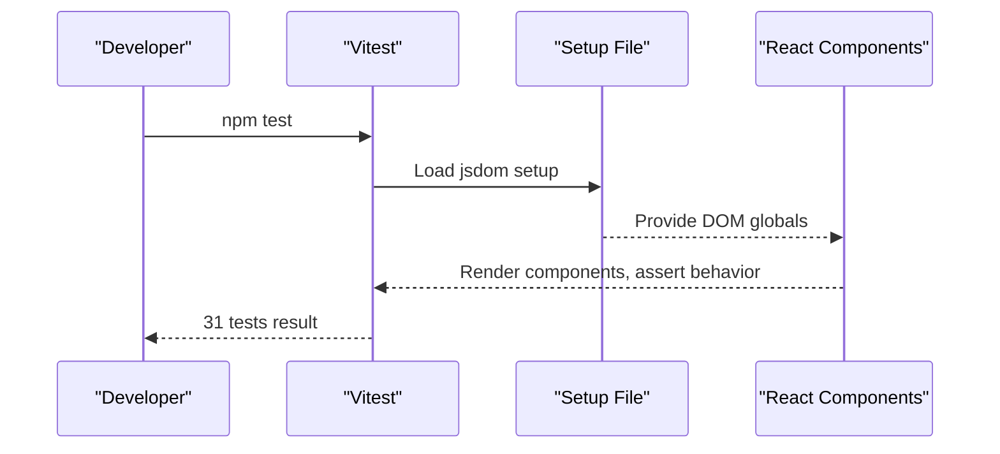
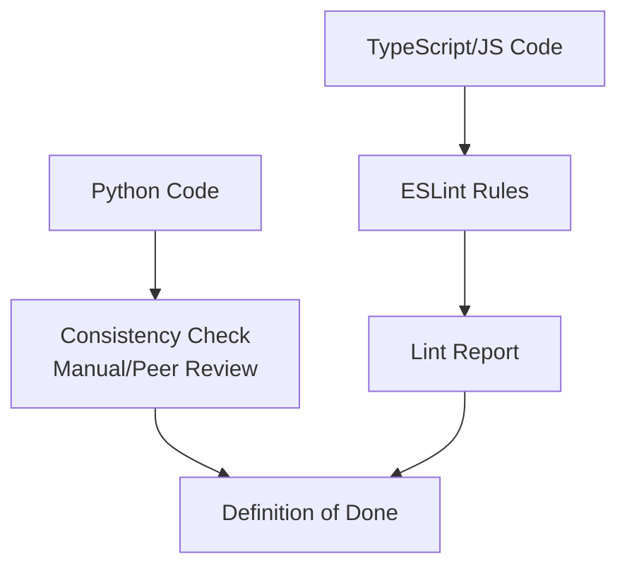
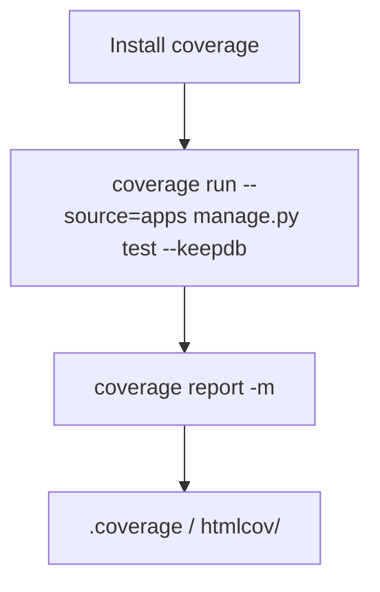
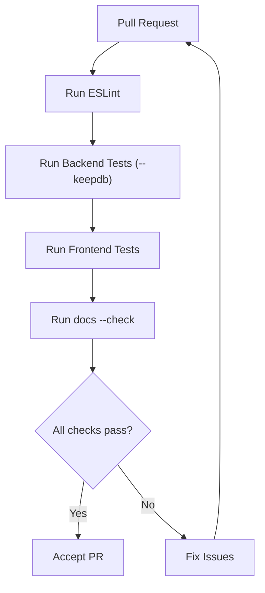
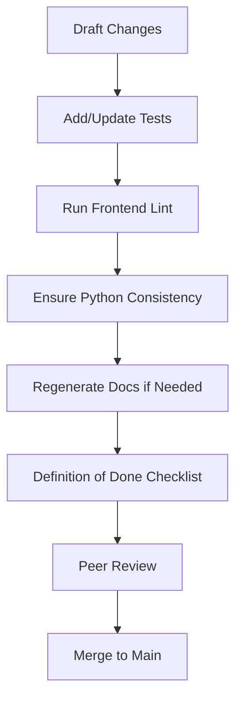
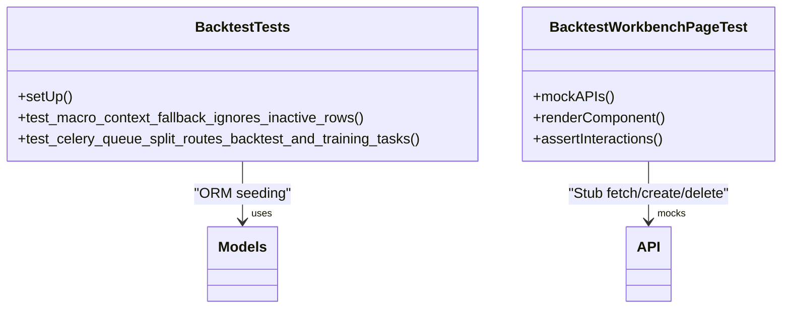
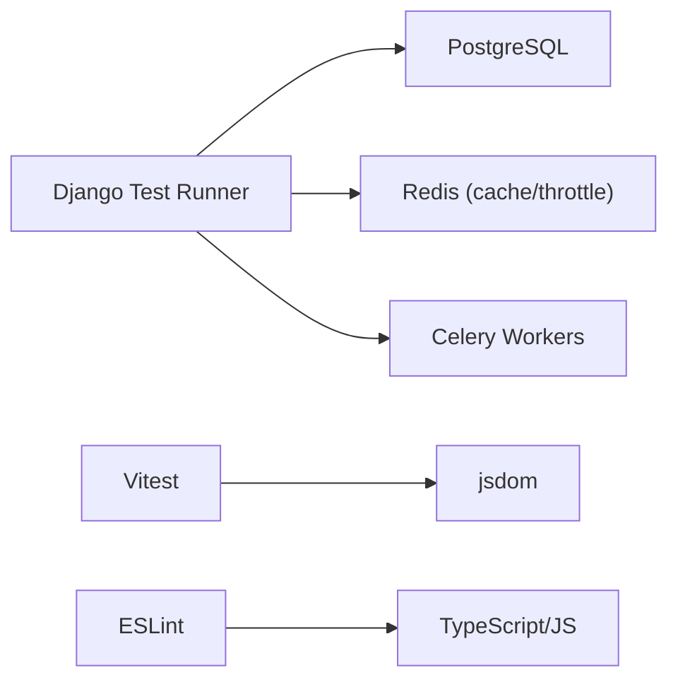

# Quality Assurance & Code Standards

<cite>
**Referenced Files in This Document**
- [README.md](file://README.md)
- [CONTRIBUTING.md](file://CONTRIBUTING.md)
- [docs/how-to/testing.md](file://docs/how-to/testing.md)
- [frontend/package.json](file://frontend/package.json)
- [frontend/eslint.config.js](file://frontend/eslint.config.js)
- [frontend/vite.config.ts](file://frontend/vite.config.ts)
- [apps/backtest/tests.py](file://apps/backtest/tests.py)
- [frontend/src/pages/BacktestWorkbenchPage.test.tsx](file://frontend/src/pages/BacktestWorkbenchPage.test.tsx)
- [BACKLOG.md](file://BACKLOG.md)
- [docker-compose.yml](file://docker-compose.yml)
</cite>

## Table of Contents
1. [Introduction](#introduction)
2. [Project Structure](#project-structure)
3. [Core Components](#core-components)
4. [Architecture Overview](#architecture-overview)
5. [Detailed Component Analysis](#detailed-component-analysis)
6. [Dependency Analysis](#dependency-analysis)
7. [Performance Considerations](#performance-considerations)
8. [Troubleshooting Guide](#troubleshooting-guide)
9. [Conclusion](#conclusion)
10. [Appendices](#appendices)

## Introduction
This document defines the quality assurance standards, code review practices, and quality gates for FinanceAnalysis. It consolidates current testing strategy (370 total tests: 339 backend + 31 frontend), coverage measurement approaches using the coverage tool, and continuous integration setup recommendations. It also documents linting and formatting standards for Python and TypeScript/JavaScript, guidance for writing maintainable tests and managing test data, regression testing strategies for financial calculations, performance and load testing considerations, monitoring test health, collecting and reporting quality metrics, and troubleshooting common quality issues.

## Project Structure
FinanceAnalysis is a Django-based platform with ten apps and a React/Vitest frontend. The repository currently has no CI configuration; quality gates are enforced manually by developers before committing.

**Diagram sources**
- [docker-compose.yml:1-38](file://docker-compose.yml#L1-L38)

**Section sources**
- [README.md:48-114](file://README.md#L48-L114)
- [docker-compose.yml:1-38](file://docker-compose.yml#L1-L38)

## Core Components
- Backend test suite: 339 tests across 11 modules using Django’s test runner.
- Frontend test suite: 31 tests using Vitest with jsdom environment.
- Linting: ESLint configured for TypeScript/JavaScript; no Python linter/formatter configured.
- Coverage: Not configured; ad hoc usage via coverage CLI available.
- Documentation facts: Generated documentation can be validated with a check command.

Key references:
- Test counts and execution instructions are documented centrally.
- Frontend scripts define how to run tests and linting.
- Contribution guidelines describe conventions and definition of done.

**Section sources**
- [docs/how-to/testing.md:9-42](file://docs/how-to/testing.md#L9-L42)
- [frontend/package.json:6-11](file://frontend/package.json#L6-L11)
- [CONTRIBUTING.md:188-233](file://CONTRIBUTING.md#L188-L233)
- [docs/how-to/testing.md:283-299](file://docs/how-to/testing.md#L283-L299)

## Architecture Overview
Quality-related flows span both backend and frontend:

**Diagram sources**
- [docs/how-to/testing.md:59-127](file://docs/how-to/testing.md#L59-L127)
- [docs/how-to/testing.md:129-147](file://docs/how-to/testing.md#L129-L147)
- [frontend/package.json:6-11](file://frontend/package.json#L6-L11)

**Section sources**
- [docs/how-to/testing.md:59-147](file://docs/how-to/testing.md#L59-L147)
- [frontend/package.json:6-11](file://frontend/package.json#L6-L11)

## Detailed Component Analysis

### Backend Testing Strategy
- Framework: Django’s unittest-based TestCase with unittest.mock.patch.
- Scope: 339 tests across 11 modules covering backtest, markets, prediction, analytics, users, core, factors, macro, developer, sentiment.
- Execution: Use --keepdb to avoid interactive prompts and speed up runs; use -v 2, --failfast, --parallel, --debug-sql, and tagging for targeted runs.
- Data seeding: Seed rows per test via ORM; use Decimal for money/probability fields; ensure ordering independence.
- Known non-hermetic areas: Sentiment tests may emit real provider traffic; macro tests may depend on local fixtures not tracked in git.

**Diagram sources**
- [docs/how-to/testing.md:59-127](file://docs/how-to/testing.md#L59-L127)
- [docs/how-to/testing.md:188-280](file://docs/how-to/testing.md#L188-L280)

**Section sources**
- [docs/how-to/testing.md:9-42](file://docs/how-to/testing.md#L9-L42)
- [docs/how-to/testing.md:59-127](file://docs/how-to/testing.md#L59-L127)
- [docs/how-to/testing.md:188-280](file://docs/how-to/testing.md#L188-L280)
- [apps/backtest/tests.py:92-200](file://apps/backtest/tests.py#L92-L200)

### Frontend Testing Strategy
- Framework: Vitest with jsdom environment; setup file registered via Vite config.
- Scope: 31 tests across 4 files focusing on UI interactions and API client behavior.
- Execution: npm test runs single-pass; npm run lint executes ESLint; npm run build compiles and builds.
- Mocking: External API calls are stubbed/mocked in tests to isolate UI logic.

**Diagram sources**
- [frontend/vite.config.ts:24-27](file://frontend/vite.config.ts#L24-L27)
- [frontend/package.json:6-11](file://frontend/package.json#L6-L11)
- [frontend/src/pages/BacktestWorkbenchPage.test.tsx:1-30](file://frontend/src/pages/BacktestWorkbenchPage.test.tsx#L1-L30)

**Section sources**
- [docs/how-to/testing.md:31-42](file://docs/how-to/testing.md#L31-L42)
- [docs/how-to/testing.md:129-147](file://docs/how-to/testing.md#L129-L147)
- [frontend/vite.config.ts:24-27](file://frontend/vite.config.ts#L24-L27)
- [frontend/src/pages/BacktestWorkbenchPage.test.tsx:1-30](file://frontend/src/pages/BacktestWorkbenchPage.test.tsx#L1-L30)

### Linting and Formatting Standards
- Python: No formatter or linter configured; style follows consistency with surrounding code. Observed conventions include 4-space indent, single quotes, Decimal for monetary values, explicit choices, point-in-time lookups, and indexes on hot-path columns.
- TypeScript/JavaScript: ESLint configured with recommended rules for JS, TypeScript, React Hooks, and React Refresh; runs via npm run lint.

**Diagram sources**
- [CONTRIBUTING.md:188-233](file://CONTRIBUTING.md#L188-L233)
- [frontend/eslint.config.js:1-24](file://frontend/eslint.config.js#L1-L24)

**Section sources**
- [CONTRIBUTING.md:188-233](file://CONTRIBUTING.md#L188-L233)
- [frontend/eslint.config.js:1-24](file://frontend/eslint.config.js#L1-L24)

### Coverage Measurement Approaches
- Current state: No coverage tooling configured; no .coveragerc; coverage dependency absent from requirements.
- Ad hoc measurement: Install coverage and run against Django tests; generate reports locally.

**Diagram sources**
- [docs/how-to/testing.md:283-299](file://docs/how-to/testing.md#L283-L299)

**Section sources**
- [docs/how-to/testing.md:283-299](file://docs/how-to/testing.md#L283-L299)
- [BACKLOG.md:365-368](file://BACKLOG.md#L365-L368)

### Continuous Integration Setup Recommendations
- Repository status: No CI configuration exists; tests and generated docs checks are designed to be gate-able but not automated.
- Recommended pipeline:
  - Lint: Run ESLint for frontend; optionally add Python linting later.
  - Backend tests: Execute Django tests with --keepdb.
  - Frontend tests: Run Vitest.
  - Docs validation: Run export_documentation_facts --check.
  - Optional: Add coverage collection and threshold enforcement.

**Diagram sources**
- [BACKLOG.md:358-363](file://BACKLOG.md#L358-L363)
- [docs/how-to/testing.md:59-127](file://docs/how-to/testing.md#L59-L127)
- [docs/how-to/testing.md:129-147](file://docs/how-to/testing.md#L129-L147)

**Section sources**
- [BACKLOG.md:358-363](file://BACKLOG.md#L358-L363)
- [docs/how-to/testing.md:59-147](file://docs/how-to/testing.md#L59-L147)

### Code Review Guidelines and Pull Request Requirements
- Branching and commits: Work happens on main; use Conventional Commits with imperative mood, concise summary, and explanatory body.
- Definition of done: Ensure backend tests pass with --keepdb, frontend tests and lint pass, generated docs are current, migrations are clean, and authored docs updated where needed.
- Review focus: Verify test additions match behavior changes, mocks are applied at import sites, Decimal used for financial fields, and no hand-typed content in generated files.

**Diagram sources**
- [CONTRIBUTING.md:12-93](file://CONTRIBUTING.md#L12-L93)
- [CONTRIBUTING.md:300-316](file://CONTRIBUTING.md#L300-L316)

**Section sources**
- [CONTRIBUTING.md:12-93](file://CONTRIBUTING.md#L12-L93)
- [CONTRIBUTING.md:300-316](file://CONTRIBUTING.md#L300-L316)

### Writing Maintainable Tests and Test Data Management
- Backend:
  - Use django.test.TestCase and unittest.mock.patch; patch collaborators at import site.
  - Seed rows per test via ORM; use Decimal for money/probability fields; ensure deterministic ordering.
  - Avoid network calls; mock external providers; handle known non-hermetic cases explicitly.
- Frontend:
  - Use Vitest with jsdom; mock API functions to isolate component behavior.
  - Stub browser APIs (e.g., ResizeObserver) when necessary.
- Regression testing for financial calculations:
  - Assert precise Decimal outcomes for prices, probabilities, and ratios.
  - Validate point-in-time filters and freshness guards.
  - Include edge cases around calendar boundaries, suspensions, and index membership changes.

**Diagram sources**
- [apps/backtest/tests.py:92-200](file://apps/backtest/tests.py#L92-L200)
- [frontend/src/pages/BacktestWorkbenchPage.test.tsx:1-30](file://frontend/src/pages/BacktestWorkbenchPage.test.tsx#L1-L30)

**Section sources**
- [docs/how-to/testing.md:303-324](file://docs/how-to/testing.md#L303-L324)
- [apps/backtest/tests.py:92-200](file://apps/backtest/tests.py#L92-L200)
- [frontend/src/pages/BacktestWorkbenchPage.test.tsx:1-30](file://frontend/src/pages/BacktestWorkbenchPage.test.tsx#L1-L30)

### Performance Testing Strategies and Load Testing for Financial Workloads
- Current state: No performance or load testing framework configured.
- Recommendations:
  - Backend: Use Django’s test client for endpoint-level load checks; consider adding synthetic workloads for backtest runs and Celery task queues.
  - Frontend: Use Vitest for unit performance assertions; integrate benchmarking libraries for critical rendering paths.
  - End-to-end: Simulate realistic user sessions hitting REST endpoints and WebSocket streams under controlled load.
  - Metrics: Track response times, error rates, and queue throughput; alert on regressions.

[No sources needed since this section provides general guidance]

### Monitoring Test Health
- Observe “Ran N tests” output to ensure suites execute meaningful work.
- Categorize failures by exception type before investigating individual tests.
- Address structural issues first (e.g., Redis credentials, fixture availability) to recover large numbers of failing tests quickly.
- Track non-hermetic tests and local fixture dependencies; move them into reproducible fixtures.

**Section sources**
- [docs/how-to/testing.md:150-185](file://docs/how-to/testing.md#L150-L185)
- [docs/how-to/testing.md:188-280](file://docs/how-to/testing.md#L188-L280)

### Quality Metrics Collection, Reporting, and Improvement Processes
- Test counts: Backend 339, Frontend 31; track trends over time.
- Coverage: Implement coverage collection and report generation; set thresholds to prevent regressions.
- Documentation drift: Enforce export_documentation_facts --check to catch stale facts.
- Migration hygiene: Require makemigrations --check to be clean before commit.
- Process: Collect metrics weekly, publish dashboards, and prioritize improvements based on failure categories and coverage gaps.

**Section sources**
- [docs/how-to/testing.md:9-42](file://docs/how-to/testing.md#L9-L42)
- [docs/how-to/testing.md:283-299](file://docs/how-to/testing.md#L283-L299)
- [BACKLOG.md:358-368](file://BACKLOG.md#L358-L368)

## Dependency Analysis
Quality tools and their relationships:

**Diagram sources**
- [docs/how-to/testing.md:46-55](file://docs/how-to/testing.md#L46-L55)
- [docs/how-to/testing.md:218-258](file://docs/how-to/testing.md#L218-L258)
- [frontend/vite.config.ts:24-27](file://frontend/vite.config.ts#L24-L27)
- [frontend/eslint.config.js:1-24](file://frontend/eslint.config.js#L1-L24)

**Section sources**
- [docs/how-to/testing.md:46-55](file://docs/how-to/testing.md#L46-L55)
- [docs/how-to/testing.md:218-258](file://docs/how-to/testing.md#L218-L258)
- [frontend/vite.config.ts:24-27](file://frontend/vite.config.ts#L24-L27)
- [frontend/eslint.config.js:1-24](file://frontend/eslint.config.js#L1-L24)

## Performance Considerations
- Use --keepdb to avoid repeated database recreation and migration overhead.
- Parallelize backend tests judiciously; each process gets its own test database clone.
- Minimize network calls in tests; mock external providers and caches.
- For frontend, keep tests focused on component logic and mocked APIs to reduce flakiness.

[No sources needed since this section provides general guidance]

## Troubleshooting Guide
Common quality issues and resolutions:
- Stale test database prompts: Always use --keepdb; drop test database deliberately if needed.
- Redis authentication errors: Verify REDIS_URL and CELERY_BROKER_URL; confirm server ACL/password; re-run smoke checks.
- Non-hermetic tests: Mock provider traffic; move local fixtures into temp directories; track known non-hermetic cases.
- Missing local fixtures: Generate fixtures in tests rather than relying on untracked files.
- Silent no-op test runs: Confirm “Ran N tests” line; ensure apps/__init__.py exists for app-label discovery.

**Section sources**
- [docs/how-to/testing.md:84-127](file://docs/how-to/testing.md#L84-L127)
- [docs/how-to/testing.md:150-185](file://docs/how-to/testing.md#L150-L185)
- [docs/how-to/testing.md:218-280](file://docs/how-to/testing.md#L218-L280)

## Conclusion
FinanceAnalysis has a robust test base (370 tests) and clear conventions for maintaining quality. While CI is not yet implemented, the repository is structured to support automated gating with linting, tests, and documentation checks. Adopting coverage measurement, formalizing code review gates, and implementing a minimal CI pipeline will significantly improve reliability and maintainability, especially for financial calculations and data-driven workflows.

[No sources needed since this section summarizes without analyzing specific files]

## Appendices

### Quick Reference Commands
- Backend tests: python manage.py test --keepdb
- Frontend tests: cd frontend && npm test
- Frontend lint: cd frontend && npm run lint
- Coverage (ad hoc): pip install coverage; coverage run --source=apps manage.py test --keepdb; coverage report -m
- Docs validation: python manage.py export_documentation_facts --check

**Section sources**
- [docs/how-to/testing.md:327-341](file://docs/how-to/testing.md#L327-L341)
- [docs/how-to/testing.md:283-299](file://docs/how-to/testing.md#L283-L299)