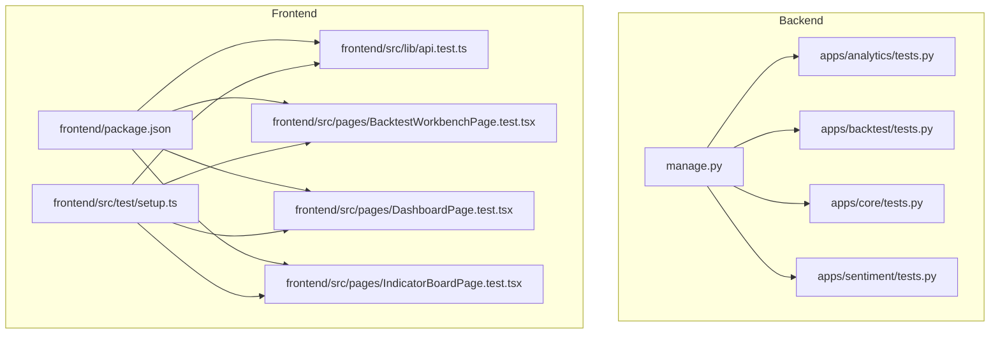
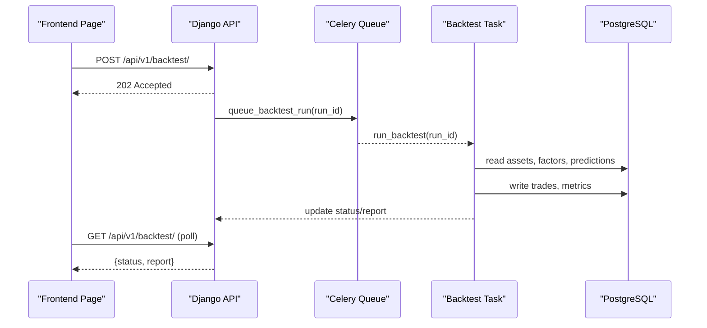
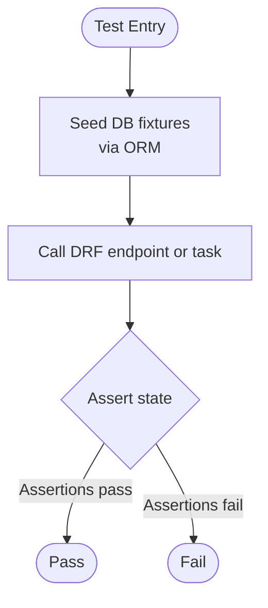
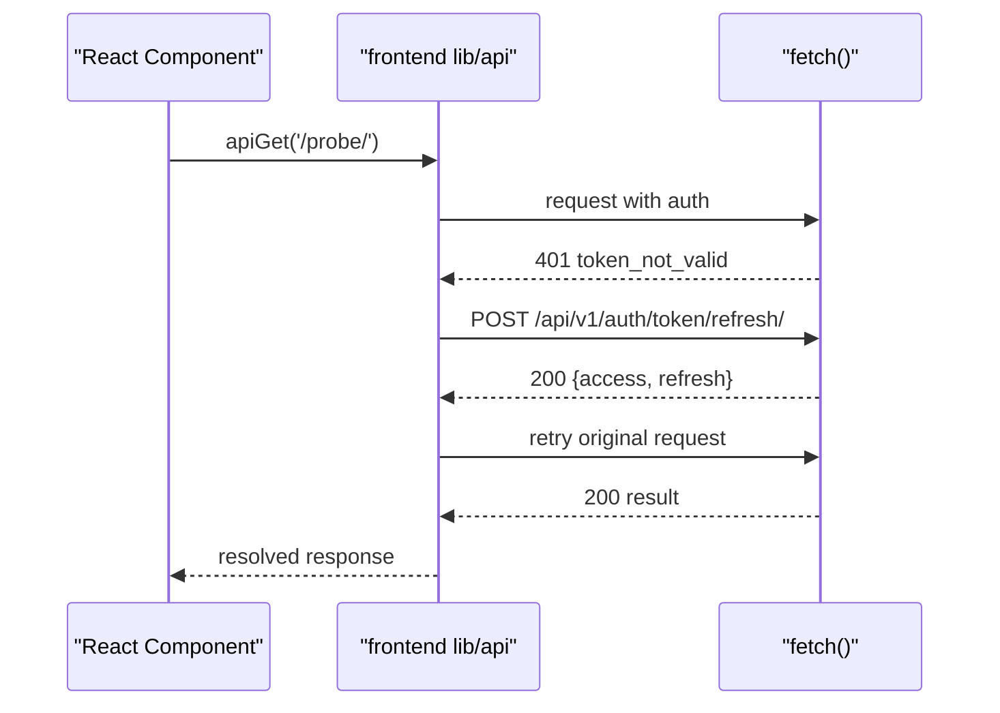
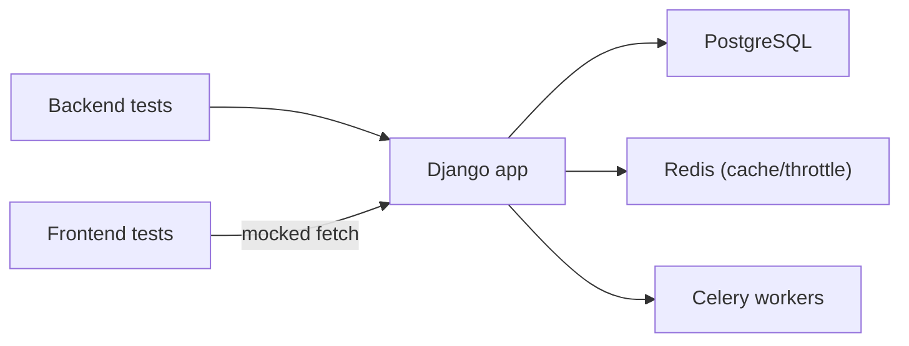

# Testing & Quality Assurance

<cite>
**Referenced Files in This Document**
- [testing.md](file://docs/how-to/testing.md)
- [manage.py](file://manage.py)
- [apps/analytics/tests.py](file://apps/analytics/tests.py)
- [apps/backtest/tests.py](file://apps/backtest/tests.py)
- [apps/core/tests.py](file://apps/core/tests.py)
- [apps/sentiment/tests.py](file://apps/sentiment/tests.py)
- [frontend/src/lib/api.test.ts](file://frontend/src/lib/api.test.ts)
- [frontend/src/pages/BacktestWorkbenchPage.test.tsx](file://frontend/src/pages/BacktestWorkbenchPage.test.tsx)
- [frontend/src/pages/DashboardPage.test.tsx](file://frontend/src/pages/DashboardPage.test.tsx)
- [frontend/src/pages/IndicatorBoardPage.test.tsx](file://frontend/src/pages/IndicatorBoardPage.test.tsx)
- [frontend/src/test/setup.ts](file://frontend/src/test/setup.ts)
- [frontend/package.json](file://frontend/package.json)
</cite>

## Table of Contents
1. Introduction
2. Project Structure
3. Core Components
4. Architecture Overview
5. Detailed Component Analysis
6. Dependency Analysis
7. Performance Considerations
8. Troubleshooting Guide
9. Conclusion
10. Appendices

## Introduction
This document provides comprehensive testing and quality assurance guidance for FinanceAnalysis across backend (Django + DRF) and frontend (React + Vitest). It covers unit, integration, and end-to-end testing strategies; test data management; mocking external APIs and databases; running tests with --keepdb; coverage measurement; CI setup recommendations; frontend component testing with Jest/Vitest and React Testing Library; quality gates and code review processes; performance and load testing strategies; regression testing for financial calculations; and troubleshooting flaky tests, test data issues, and environment-specific problems.

## Project Structure
The repository contains:
- Backend test suites under apps/* using Django’s TestCase and APIClient.
- Frontend tests under frontend/src using Vitest and React Testing Library.
- A how-to guide that documents suite inventory, execution commands, flags, known failures, and conventions.

**Diagram sources**
- [manage.py:1-27](file://manage.py#L1-L27)
- [apps/analytics/tests.py:1-800](file://apps/analytics/tests.py#L1-L800)
- [apps/backtest/tests.py:1-800](file://apps/backtest/tests.py#L1-L800)
- [apps/core/tests.py:1-800](file://apps/core/tests.py#L1-L800)
- [apps/sentiment/tests.py:1-303](file://apps/sentiment/tests.py#L1-L303)
- [frontend/src/lib/api.test.ts:1-131](file://frontend/src/lib/api.test.ts#L1-L131)
- [frontend/src/pages/BacktestWorkbenchPage.test.tsx:1-800](file://frontend/src/pages/BacktestWorkbenchPage.test.tsx#L1-L800)
- [frontend/src/pages/DashboardPage.test.tsx:1-209](file://frontend/src/pages/DashboardPage.test.tsx#L1-L209)
- [frontend/src/pages/IndicatorBoardPage.test.tsx:1-89](file://frontend/src/pages/IndicatorBoardPage.test.tsx#L1-L89)
- [frontend/src/test/setup.ts:1-8](file://frontend/src/test/setup.ts#L1-L8)
- [frontend/package.json:1-40](file://frontend/package.json#L1-L40)

**Section sources**
- [testing.md:1-342](file://docs/how-to/testing.md#L1-L342)
- [manage.py:1-27](file://manage.py#L1-L27)
- [frontend/package.json:1-40](file://frontend/package.json#L1-L40)

## Core Components
- Backend test runner: Django’s manage.py test discovers all apps and runs unittest-based tests. Use --keepdb to reuse the PostgreSQL test database and avoid interactive prompts on stale DBs.
- Frontend test runner: Vitest via npm scripts in package.json; jsdom environment configured by setup file.

Key practices observed in the codebase:
- Use django.test.TestCase and APIClient for API and task-level tests.
- Mock expensive or external collaborators at import sites using unittest.mock.patch.
- Seed per-test data through ORM with Decimal values for money/probability fields.
- For frontend, mock fetch and API functions to isolate UI behavior from network calls.

**Section sources**
- [testing.md:59-127](file://docs/how-to/testing.md#L59-L127)
- [testing.md:303-324](file://docs/how-to/testing.md#L303-L324)
- [apps/analytics/tests.py:1-800](file://apps/analytics/tests.py#L1-L800)
- [apps/backtest/tests.py:1-800](file://apps/backtest/tests.py#L1-L800)
- [apps/core/tests.py:1-800](file://apps/core/tests.py#L1-L800)
- [apps/sentiment/tests.py:1-303](file://apps/sentiment/tests.py#L1-L303)
- [frontend/src/lib/api.test.ts:1-131](file://frontend/src/lib/api.test.ts#L1-L131)
- [frontend/src/pages/BacktestWorkbenchPage.test.tsx:1-800](file://frontend/src/pages/BacktestWorkbenchPage.test.tsx#L1-L800)

## Architecture Overview
End-to-end flow for a backtest run as validated by tests:

**Diagram sources**
- [apps/backtest/tests.py:251-327](file://apps/backtest/tests.py#L251-L327)
- [apps/backtest/tests.py:470-489](file://apps/backtest/tests.py#L470-L489)

## Detailed Component Analysis

### Backend Unit and Integration Tests
- Analytics: Alert rule evaluation, cooldown handling, indicator recalculation endpoints, technical indicators, signal events, dashboard stocks aggregation, and filtering/ordering.
- Backtest: Lifecycle control (pause/resume/restart/destroy), serializer staleness reporting, candidate selection with PIT membership constraints, LightGBM/LSTM prediction sources, error persistence, and trade creation.
- Core: Data quality validation command producing multiple CSV reports, continuity gap detection, anomaly detection, lifecycle issues, and cross-section audits.
- Sentiment: Auth enforcement, daily sentiment pipeline, factor score integration, provider quota handling, and news ingestion.

**Diagram sources**
- [apps/analytics/tests.py:39-106](file://apps/analytics/tests.py#L39-L106)
- [apps/backtest/tests.py:92-178](file://apps/backtest/tests.py#L92-L178)
- [apps/core/tests.py:51-146](file://apps/core/tests.py#L51-L146)
- [apps/sentiment/tests.py:19-108](file://apps/sentiment/tests.py#L19-L108)

**Section sources**
- [apps/analytics/tests.py:1-800](file://apps/analytics/tests.py#L1-L800)
- [apps/backtest/tests.py:1-800](file://apps/backtest/tests.py#L1-L800)
- [apps/core/tests.py:1-800](file://apps/core/tests.py#L1-L800)
- [apps/sentiment/tests.py:1-303](file://apps/sentiment/tests.py#L1-L303)

### Frontend Component and API Tests
- API layer: Token refresh coalescing, persisted refresh tokens, dead token cleanup, and OHLCV pagination optimization.
- Backtest Workbench: Mode-scoped controls, rerun loading, weekday selector visibility, pause/resume/restart/delete flows, progress display, and auto-refresh intervals.
- Dashboard: URL-driven filter hydration, form-driven filters, column visibility by prediction source, sorting.
- Indicator Board: Standalone board rendering and data fetching.

**Diagram sources**
- [frontend/src/lib/api.test.ts:44-93](file://frontend/src/lib/api.test.ts#L44-L93)

**Section sources**
- [frontend/src/lib/api.test.ts:1-131](file://frontend/src/lib/api.test.ts#L1-L131)
- [frontend/src/pages/BacktestWorkbenchPage.test.tsx:1-800](file://frontend/src/pages/BacktestWorkbenchPage.test.tsx#L1-L800)
- [frontend/src/pages/DashboardPage.test.tsx:1-209](file://frontend/src/pages/DashboardPage.test.tsx#L1-L209)
- [frontend/src/pages/IndicatorBoardPage.test.tsx:1-89](file://frontend/src/pages/IndicatorBoardPage.test.tsx#L1-L89)
- [frontend/src/test/setup.ts:1-8](file://frontend/src/test/setup.ts#L1-L8)
- [frontend/package.json:1-40](file://frontend/package.json#L1-L40)

## Dependency Analysis
- Backend tests depend on:
  - PostgreSQL (test database created/managed by Django).
  - Celery queues for async tasks (validated by settings assertions).
  - Optional Redis for throttling/caching; misconfiguration can cause broad failures.
- Frontend tests depend on:
  - Vitest runtime and jsdom.
  - Mocked fetch and API modules to avoid real network calls.

**Diagram sources**
- [apps/backtest/tests.py:200-213](file://apps/backtest/tests.py#L200-L213)
- [testing.md:218-258](file://docs/how-to/testing.md#L218-L258)

**Section sources**
- [apps/backtest/tests.py:200-213](file://apps/backtest/tests.py#L200-L213)
- [testing.md:218-258](file://docs/how-to/testing.md#L218-L258)

## Performance Considerations
- Use --keepdb to avoid repeated schema migrations and index rebuilds during test runs.
- Prefer targeted invocations (by app/module/class/test) for fast iteration.
- Use parallel execution judiciously (--parallel N) when appropriate; each process gets its own test database clone.
- For frontend, keep mocks minimal and deterministic; avoid unnecessary re-renders by isolating API calls.

[No sources needed since this section provides general guidance]

## Troubleshooting Guide
Common issues and resolutions grounded in the codebase:

- Stale test database prompts:
  - Symptom: Interactive prompt to delete test_finance_analysis; non-interactive shells abort with EOFError.
  - Resolution: Use --keepdb to reuse DB; if truly clean is needed, drop the DB explicitly.

- Redis credential failures:
  - Symptom: Broad API failures due to throttle checks failing with authentication errors.
  - Resolution: Verify and correct REDIS_URL, CELERY_BROKER_URL, and CELERY_RESULT_BACKEND; use local stack verification script.

- Non-hermetic sentiment tests:
  - Symptom: Provider traffic varies run to run.
  - Resolution: Mock provider calls; ensure tests do not hit real providers.

- Missing local fixture files:
  - Symptom: Tests requiring gitignored CSVs fail on fresh clones.
  - Resolution: Build fixtures in temp directories within tests; avoid relying on untracked files.

- App-label discovery previously silent:
  - Symptom: Bare manage.py test discovered zero tests.
  - Resolution: Ensure apps/__init__.py exists; always check “Ran N tests” line.

- Coverage tooling:
  - Not configured by default; install coverage ad hoc and run against apps.

**Section sources**
- [testing.md:84-127](file://docs/how-to/testing.md#L84-L127)
- [testing.md:150-185](file://docs/how-to/testing.md#L150-L185)
- [testing.md:188-280](file://docs/how-to/testing.md#L188-L280)
- [testing.md:283-299](file://docs/how-to/testing.md#L283-L299)

## Conclusion
FinanceAnalysis has a robust, multi-layered test suite covering critical financial workflows: alerting, indicators, signals, backtesting, data quality, and frontend interactions. The suite emphasizes deterministic data seeding, precise mocking of external systems, and careful handling of asynchronous tasks and database state. Adopting the documented practices—especially --keepdb usage, structured mocking, and clear separation of concerns—will improve reliability, speed, and maintainability. Integrating automated pipelines and quality gates will further strengthen confidence in releases.

[No sources needed since this section summarizes without analyzing specific files]

## Appendices

### Running Tests
- Backend:
  - Run all: python manage.py test
  - Targeted: python manage.py test apps.backtest
  - With keepdb: python manage.py test --keepdb apps.backtest
- Frontend:
  - cd frontend && npm test

**Section sources**
- [testing.md:59-127](file://docs/how-to/testing.md#L59-L127)
- [testing.md:129-147](file://docs/how-to/testing.md#L129-L147)
- [frontend/package.json:6-11](file://frontend/package.json#L6-L11)

### Test Data Management
- Create users, markets, assets, OHLCV, factors, predictions, and model artifacts directly via ORM in setUp or helpers.
- Use Decimal for monetary and probability fields to preserve precision.
- Seed trading calendar rows when technical indicators rely on official calendars.

**Section sources**
- [apps/analytics/tests.py:39-106](file://apps/analytics/tests.py#L39-L106)
- [apps/analytics/tests.py:558-627](file://apps/analytics/tests.py#L558-L627)
- [apps/backtest/tests.py:92-178](file://apps/backtest/tests.py#L92-L178)
- [apps/core/tests.py:51-146](file://apps/core/tests.py#L51-L146)

### Mocking Strategies
- Backend:
  - Patch at import site (e.g., apps.analytics.tasks.send_alert_notifications.delay).
  - Stub ML/artifact loaders and predictors to avoid heavy computations.
  - Mock Celery AsyncResult for task health checks.
- Frontend:
  - Stub global fetch and mock API module functions to simulate responses and error flows.

**Section sources**
- [apps/analytics/tests.py:65-106](file://apps/analytics/tests.py#L65-L106)
- [apps/backtest/tests.py:553-651](file://apps/backtest/tests.py#L553-L651)
- [apps/backtest/tests.py:374-422](file://apps/backtest/tests.py#L374-L422)
- [frontend/src/lib/api.test.ts:14-31](file://frontend/src/lib/api.test.ts#L14-L31)
- [frontend/src/pages/BacktestWorkbenchPage.test.tsx:30-336](file://frontend/src/pages/BacktestWorkbenchPage.test.tsx#L30-L336)

### Database Testing Approaches
- Use Django’s test database isolation; prefer --keepdb for speed.
- Seed only what is necessary per test; avoid shared mutable state.
- Validate both ORM writes and query behaviors (e.g., filtering by user scope, ordering, pagination).

**Section sources**
- [testing.md:84-127](file://docs/how-to/testing.md#L84-L127)
- [apps/analytics/tests.py:129-183](file://apps/analytics/tests.py#L129-L183)
- [apps/backtest/tests.py:235-249](file://apps/backtest/tests.py#L235-L249)

### Continuous Integration Setup Recommendations
- Add a CI job that:
  - Provisions PostgreSQL and optional Redis.
  - Runs backend tests with --keepdb where supported or with a fresh DB per job.
  - Installs frontend dependencies and runs npm test.
  - Enforces exit codes and collects logs for failures.
  - Optionally installs coverage and publishes reports.

[No sources needed since this section provides general guidance]

### Quality Gates and Code Review Processes
- Gate PRs on:
  - All backend tests passing.
  - All frontend tests passing.
  - Linting and type checks (if added).
- Require:
  - New tests for new features and bug fixes.
  - Clear commit messages referencing affected areas.
  - Review of test data and mocks for realism and stability.

[No sources needed since this section provides general guidance]

### Performance and Load Testing Strategies
- Backend:
  - Use --parallel for CPU-bound tests cautiously; ensure DB isolation.
  - Profile slow tests with debug-sql and targeted invocations.
- Frontend:
  - Keep mocks lightweight; avoid large payloads in tests.
- System-level:
  - Introduce dedicated load tests outside the unit suite to validate API throughput and backtest queue capacity.

[No sources needed since this section provides general guidance]

### Regression Testing for Financial Calculations
- Maintain fixtures that exercise indicator windows, signal thresholds, and factor score computations.
- Pin dates and calendar seeds to ensure reproducibility.
- Validate outputs with Decimal comparisons and tolerance where appropriate.

**Section sources**
- [apps/analytics/tests.py:500-556](file://apps/analytics/tests.py#L500-L556)
- [apps/analytics/tests.py:630-800](file://apps/analytics/tests.py#L630-L800)
- [apps/core/tests.py:286-524](file://apps/core/tests.py#L286-L524)