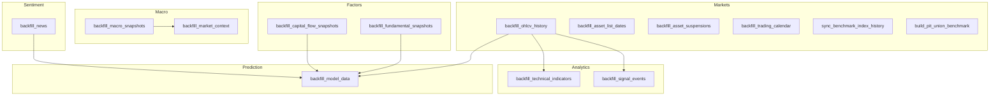
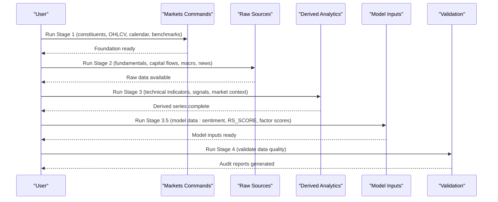
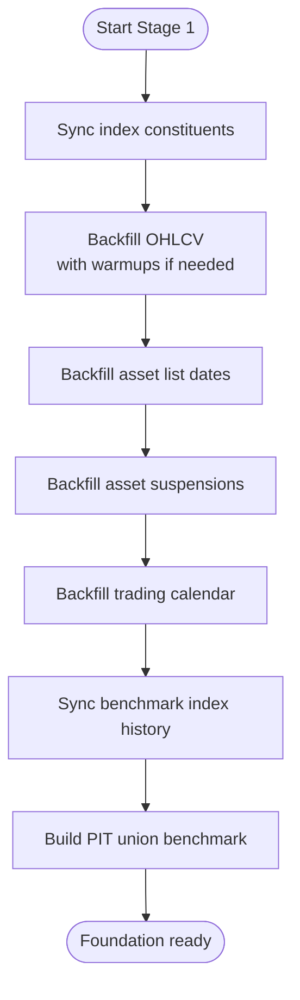
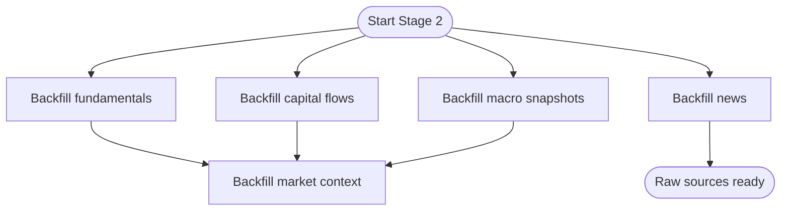
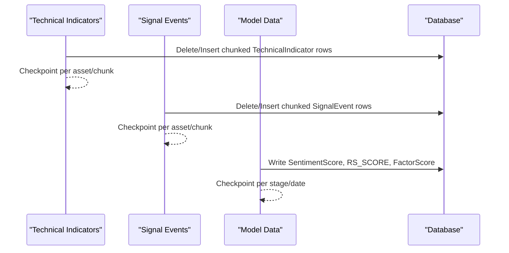
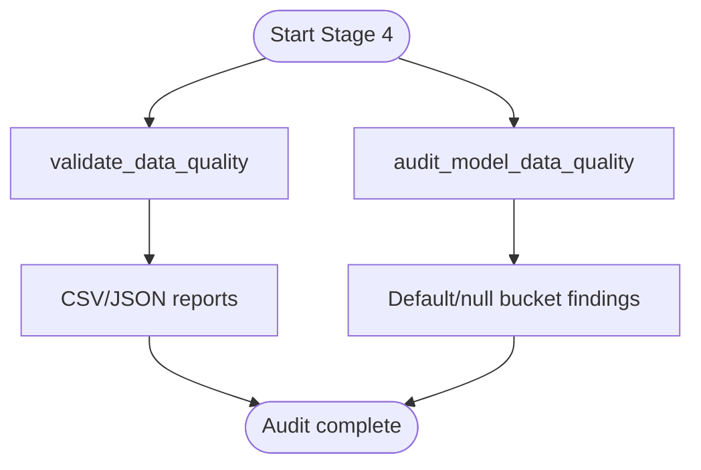
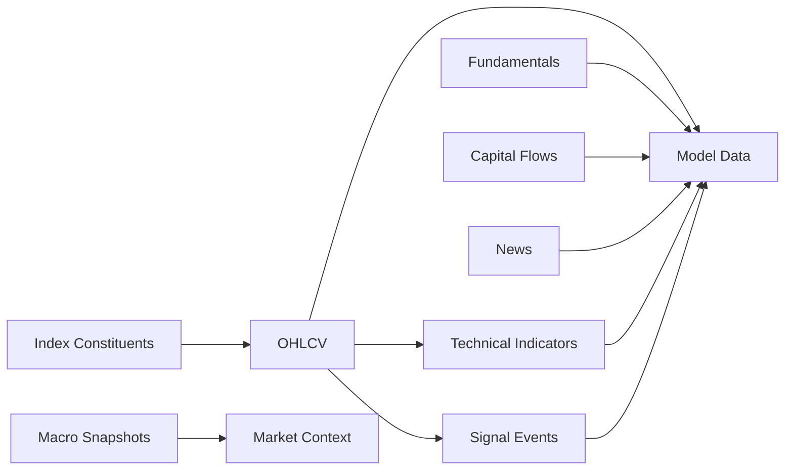

# Data Backfill Procedures

<cite>
**Referenced Files in This Document**
- [backfill.md](file://docs/how-to/backfill.md)
- [commands.md](file://docs/reference/commands.md)
- [backfill_ohlcv_history.py](file://apps/markets/management/commands/backfill_ohlcv_history.py)
- [backfill_technical_indicators.py](file://apps/analytics/management/commands/backfill_technical_indicators.py)
- [backfill_signal_events.py](file://apps/analytics/management/commands/backfill_signal_events.py)
- [backfill_fundamental_snapshots.py](file://apps/factors/management/commands/backfill_fundamental_snapshots.py)
- [backfill_capital_flow_snapshots.py](file://apps/factors/management/commands/backfill_capital_flow_snapshots.py)
- [backfill_macro_snapshots.py](file://apps/macro/management/commands/backfill_macro_snapshots.py)
- [backfill_market_context.py](file://apps/macro/management/commands/backfill_market_context.py)
- [backfill_news.py](file://apps/sentiment/management/commands/backfill_news.py)
- [backfill_model_data.py](file://apps/prediction/management/commands/backfill_model_data.py)
</cite>

## Table of Contents
1. Introduction
2. Project Structure
3. Core Components
4. Architecture Overview
5. Detailed Component Analysis
6. Dependency Analysis
7. Performance Considerations
8. Troubleshooting Guide
9. Conclusion
10. Appendices

## Introduction
This document explains how to execute data backfill operations across FinanceAnalysis, including the command structure, parameter options, idempotent execution patterns, and the recommended sequence for backfilling market data, technical indicators, fundamental factors, macro indicators, and sentiment data. It also covers date range selection, partial backfills, resuming interrupted jobs, performance optimization, memory management, progress monitoring, common scenarios, checkpoint mechanisms, error recovery, and validation steps to ensure integrity.

## Project Structure
Backfill commands are organized by domain under Django management commands:
- Markets: OHLCV history, asset list dates, suspensions, trading calendar, benchmark indices
- Analytics: technical indicators and signal events
- Factors: fundamental snapshots and capital flow snapshots
- Macro: macro snapshots and market context
- Sentiment: news ingestion and pipeline scoring
- Prediction: model inputs (sentiment scores, RS_SCORE, factor scores)

**Diagram sources**
- [backfill.md:44-170](file://docs/how-to/backfill.md#L44-L170)
- [commands.md:23-52](file://docs/reference/commands.md#L23-L52)
- [commands.md:218-265](file://docs/reference/commands.md#L218-L265)
- [commands.md:278-335](file://docs/reference/commands.md#L278-L335)
- [commands.md:450-461](file://docs/reference/commands.md#L450-L461)
- [commands.md:508-523](file://docs/reference/commands.md#L508-L523)

**Section sources**
- [backfill.md:44-170](file://docs/how-to/backfill.md#L44-L170)
- [commands.md:23-52](file://docs/reference/commands.md#L23-L52)
- [commands.md:218-265](file://docs/reference/commands.md#L218-L265)
- [commands.md:278-335](file://docs/reference/commands.md#L278-L335)
- [commands.md:450-461](file://docs/reference/commands.md#L450-L461)
- [commands.md:508-523](file://docs/reference/commands.md#L508-L523)

## Core Components
- Market foundation: index constituents, OHLCV, asset lifecycle, calendar, benchmarks
- Raw sources: fundamentals, capital flows, macro, news
- Derived analytics: technical indicators, signals, market context
- Model inputs: sentiment coverage, RS_SCORE, factor scores
- Validation and audit: quality checks and documentation facts

Key behaviors:
- Idempotent per chunk or per row via upserts and delete/insert transactions
- Checkpoint-based resume for long-running derived stages
- Date floor enforcement with warm-up windows where required
- Provider throttling and retries for external APIs

**Section sources**
- [backfill.md:9-42](file://docs/how-to/backfill.md#L9-L42)
- [backfill.md:44-170](file://docs/how-to/backfill.md#L44-L170)
- [backfill.md:174-213](file://docs/how-to/backfill.md#L174-L213)
- [backfill.md:216-247](file://docs/how-to/backfill.md#L216-L247)

## Architecture Overview
The backfill workflow is staged to respect dependencies and enforce the effective universe and historical floor. Stage 1 builds the foundation; Stage 2 ingests raw sources; Stage 3 computes derived series; Stage 4 validates; Stage 5 updates docs; Stage 6 retrains models.

**Diagram sources**
- [backfill.md:44-170](file://docs/how-to/backfill.md#L44-L170)
- [backfill.md:216-247](file://docs/how-to/backfill.md#L216-L247)

## Detailed Component Analysis

### Stage 1 — Universe and Market Foundation
- sync_index_constituents: persists membership history and tags; use --skip-sync-dispatch when you will run OHLCV explicitly
- backfill_ohlcv_history: backfills OHLCV from configured floor; supports CSV-driven repairs, technical-indicator warmup, and effective-universe-entry warmup
- backfill_asset_list_dates: sets listing/delisting dates and status
- backfill_asset_suspensions: records suspension days to avoid treating them as missing data
- backfill_trading_calendar: authoritative open-day source for continuity checks
- sync_benchmark_index_history and build_pit_union_benchmark: official and internal PIT benchmarks

**Diagram sources**
- [backfill.md:44-83](file://docs/how-to/backfill.md#L44-L83)
- [backfill_ohlcv_history.py:29-45](file://apps/markets/management/commands/backfill_ohlcv_history.py#L29-L45)
- [backfill_ohlcv_history.py:318-387](file://apps/markets/management/commands/backfill_ohlcv_history.py#L318-L387)

**Section sources**
- [backfill.md:44-95](file://docs/how-to/backfill.md#L44-L95)
- [backfill_ohlcv_history.py:29-45](file://apps/markets/management/commands/backfill_ohlcv_history.py#L29-L45)
- [backfill_ohlcv_history.py:318-387](file://apps/markets/management/commands/backfill_ohlcv_history.py#L318-L387)
- [commands.md:278-335](file://docs/reference/commands.md#L278-L335)

### Stage 2 — Raw Factor, Macro, and News Sources
- backfill_fundamental_snapshots: upserts FundamentalFactorSnapshot from daily_basic and fina_indicator; supports repair of stale ROE rows
- backfill_capital_flow_snapshots: upserts moneyflow, margin detail, and derived CapitalFlowSnapshot
- backfill_macro_snapshots: monthly macro fields with yield curve and FX fallbacks; supports resume-yields
- backfill_market_context: derives MarketContext from MacroSnapshot
- backfill_news: datetime-bounded news ingestion with throttling, retries, optional pipeline scoring

**Diagram sources**
- [backfill.md:99-129](file://docs/how-to/backfill.md#L99-L129)
- [backfill_fundamental_snapshots.py:43-126](file://apps/factors/management/commands/backfill_fundamental_snapshots.py#L43-L126)
- [backfill_capital_flow_snapshots.py:60-118](file://apps/factors/management/commands/backfill_capital_flow_snapshots.py#L60-L118)
- [backfill_macro_snapshots.py:121-129](file://apps/macro/management/commands/backfill_macro_snapshots.py#L121-L129)
- [backfill_market_context.py:18-58](file://apps/macro/management/commands/backfill_market_context.py#L18-L58)
- [backfill_news.py:43-61](file://apps/sentiment/management/commands/backfill_news.py#L43-L61)

**Section sources**
- [backfill.md:99-129](file://docs/how-to/backfill.md#L99-L129)
- [backfill_fundamental_snapshots.py:43-126](file://apps/factors/management/commands/backfill_fundamental_snapshots.py#L43-L126)
- [backfill_capital_flow_snapshots.py:60-118](file://apps/factors/management/commands/backfill_capital_flow_snapshots.py#L60-L118)
- [backfill_macro_snapshots.py:121-129](file://apps/macro/management/commands/backfill_macro_snapshots.py#L121-L129)
- [backfill_market_context.py:18-58](file://apps/macro/management/commands/backfill_market_context.py#L18-L58)
- [backfill_news.py:43-61](file://apps/sentiment/management/commands/backfill_news.py#L43-L61)
- [commands.md:218-265](file://docs/reference/commands.md#L218-L265)
- [commands.md:508-523](file://docs/reference/commands.md#L508-L523)

### Stage 3 — OHLCV-Derived Analytics and Model Inputs
- backfill_technical_indicators: deletes and re-inserts indicator chunks; supports checkpointing and resume
- backfill_signal_events: generates non-RS signals; supports checkpointing and resume
- backfill_model_data: runs sentiment coverage, RS_SCORE, and factor scores; supports stage-level checkpointing and resume

**Diagram sources**
- [backfill_technical_indicators.py:100-114](file://apps/analytics/management/commands/backfill_technical_indicators.py#L100-L114)
- [backfill_technical_indicators.py:264-393](file://apps/analytics/management/commands/backfill_technical_indicators.py#L264-L393)
- [backfill_signal_events.py:78-92](file://apps/analytics/management/commands/backfill_signal_events.py#L78-L92)
- [backfill_signal_events.py:241-355](file://apps/analytics/management/commands/backfill_signal_events.py#L241-L355)
- [backfill_model_data.py:45-52](file://apps/prediction/management/commands/backfill_model_data.py#L45-L52)
- [backfill_model_data.py:109-238](file://apps/prediction/management/commands/backfill_model_data.py#L109-L238)

**Section sources**
- [backfill.md:132-170](file://docs/how-to/backfill.md#L132-L170)
- [backfill.md:174-213](file://docs/how-to/backfill.md#L174-L213)
- [backfill_technical_indicators.py:100-114](file://apps/analytics/management/commands/backfill_technical_indicators.py#L100-L114)
- [backfill_technical_indicators.py:264-393](file://apps/analytics/management/commands/backfill_technical_indicators.py#L264-L393)
- [backfill_signal_events.py:78-92](file://apps/analytics/management/commands/backfill_signal_events.py#L78-L92)
- [backfill_signal_events.py:241-355](file://apps/analytics/management/commands/backfill_signal_events.py#L241-L355)
- [backfill_model_data.py:45-52](file://apps/prediction/management/commands/backfill_model_data.py#L45-L52)
- [backfill_model_data.py:109-238](file://apps/prediction/management/commands/backfill_model_data.py#L109-L238)
- [commands.md:23-52](file://docs/reference/commands.md#L23-L52)
- [commands.md:450-461](file://docs/reference/commands.md#L450-L461)

### Stage 4 — Validation and Audit
- validate_data_quality: writes CSV/JSON reports without mutating data; uses ExchangeTradingCalendar as authoritative open-day source
- audit_model_data_quality: fast inspection of default/null buckets for model data

**Diagram sources**
- [backfill.md:216-247](file://docs/how-to/backfill.md#L216-L247)
- [commands.md:177-201](file://docs/reference/commands.md#L177-L201)

**Section sources**
- [backfill.md:216-247](file://docs/how-to/backfill.md#L216-L247)
- [commands.md:177-201](file://docs/reference/commands.md#L177-L201)

### Stage 5 — Regenerate Documentation Facts
- export_documentation_facts: regenerates reference sheets from live state; review diff before committing

**Section sources**
- [backfill.md:250-260](file://docs/how-to/backfill.md#L250-L260)
- [commands.md:156-165](file://docs/reference/commands.md#L156-L165)

### Stage 6 — Retrain
- Retraining is separate from backfilling inputs; see retrain guidance after backfill completes

**Section sources**
- [backfill.md:264-267](file://docs/how-to/backfill.md#L264-L267)

## Dependency Analysis
Ownership and ordering rules:
- Index membership must exist before any cross-sectional computation
- OHLCV must exist before indicators/signals/model data
- Fundamentals and capital flows feed model data
- Macro feeds market context
- News feeds sentiment coverage and model data
- RS_SCORE and HIGH_RS_SCORE are owned by model data backfill, not technical indicators

**Diagram sources**
- [backfill.md:9-42](file://docs/how-to/backfill.md#L9-L42)
- [backfill.md:44-170](file://docs/how-to/backfill.md#L44-L170)
- [backfill.md:155-170](file://docs/how-to/backfill.md#L155-L170)

**Section sources**
- [backfill.md:9-42](file://docs/how-to/backfill.md#L9-L42)
- [backfill.md:44-170](file://docs/how-to/backfill.md#L44-L170)
- [backfill.md:155-170](file://docs/how-to/backfill.md#L155-L170)

## Performance Considerations
- Chunking: Use --chunk-size-days for technical indicators and signal events to bound delete/insert transactions; smaller chunks reduce retry cost but increase transaction overhead
- Warm-ups: Apply technical-indicator warmup and effective-universe-entry warmup to initialize indicators at first effective universe entry
- Throttling: For news and TuShare-backed sources, use provider-specific sleep/retry settings and chunk sizes to avoid rate limits
- Batch writes: Bulk create/upsert with appropriate batch sizes to reduce round-trips
- Memory: Group processing by horizon or assets where applicable; clear caches between groups for large matrices
- Database retries: Commands include database operation retries and connection resets on transient errors

[No sources needed since this section provides general guidance]

## Troubleshooting Guide
Common issues and resolutions:
- Partial failure: Resume with --resume-from-checkpoint for Stage 3 commands; fix upstream input first if failures persist
- Dropped connections: Resume from checkpoint rather than restarting; commands handle retries internally where implemented
- Stale derived series: Repair upstream first, then re-run downstream owner; ownership table clarifies responsibilities
- Pre-floor data removal: Use purge_pre_floor_historical_data dry-run then execute to remove data before HISTORICAL_DATA_FLOOR

Recovery patterns and validation:
- Always run Stage 4 validation after backfill to confirm completeness and correctness
- Use audit tools to inspect default/null buckets and reconcile upstream sources when necessary

**Section sources**
- [backfill.md:174-213](file://docs/how-to/backfill.md#L174-L213)
- [backfill.md:271-303](file://docs/how-to/backfill.md#L271-L303)
- [backfill.md:216-247](file://docs/how-to/backfill.md#L216-L247)
- [backfill_technical_indicators.py:395-413](file://apps/analytics/management/commands/backfill_technical_indicators.py#L395-L413)
- [backfill_signal_events.py:160-177](file://apps/analytics/management/commands/backfill_signal_events.py#L160-L177)
- [backfill_model_data.py:109-238](file://apps/prediction/management/commands/backfill_model_data.py#L109-L238)

## Conclusion
FinanceAnalysis provides a staged, idempotent, and resumable backfill system that enforces the effective universe and historical floor while supporting robust error handling and validation. Follow the prescribed order, use checkpoints for long-running jobs, apply warm-ups where needed, and validate results before retraining models.

[No sources needed since this section summarizes without analyzing specific files]

## Appendices

### Command Options Summary
- Markets: OHLCV, asset lifecycle, calendar, benchmarks
- Analytics: technical indicators and signal events with chunking and checkpoints
- Factors: fundamentals and capital flows with upserts and lookbacks
- Macro: monthly fields with yield curves and FX fallbacks; market context derivation
- Sentiment: datetime-bounded news with throttling and optional pipeline scoring
- Prediction: model inputs with stage-level checkpoints and resume

**Section sources**
- [commands.md:23-52](file://docs/reference/commands.md#L23-L52)
- [commands.md:218-265](file://docs/reference/commands.md#L218-L265)
- [commands.md:278-335](file://docs/reference/commands.md#L278-L335)
- [commands.md:450-461](file://docs/reference/commands.md#L450-L461)
- [commands.md:508-523](file://docs/reference/commands.md#L508-L523)