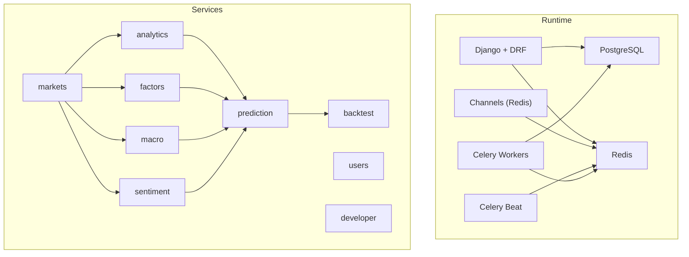
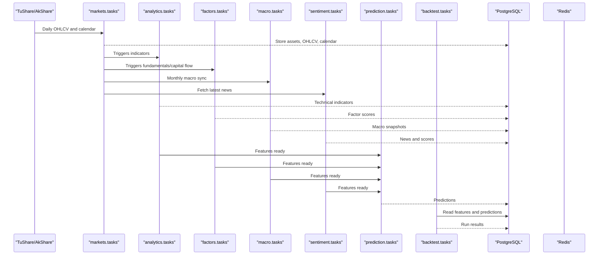
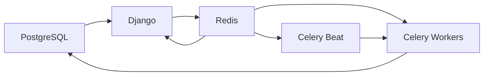

# Emergency Procedures

<cite>
**Referenced Files in This Document**
- [README.md](file://README.md)
- [docker-compose.yml](file://docker-compose.yml)
- [config/settings/base.py](file://config/settings/base.py)
- [manage.py](file://manage.py)
- [scripts/run_backend.sh](file://scripts/run_backend.sh)
- [scripts/run_celery_worker.sh](file://scripts/run_celery_worker.sh)
- [scripts/run_celery_beat.sh](file://scripts/run_celery_beat.sh)
- [compose/local/django/entrypoint.sh](file://compose/local/django/entrypoint.sh)
- [compose/local/django/start.sh](file://compose/local/django/start.sh)
- [docs/how-to/backfill.md](file://docs/how-to/backfill.md)
- [docs/how-to/runbook-sync-failure.md](file://docs/how-to/runbook-sync-failure.md)
- [docs/how-to/runbook-provider-blackout.md](file://docs/how-to/runbook-provider-blackout.md)
- [docs/how-to/runbook-stale-data.md](file://docs/how-to/runbook-stale-data.md)
- [apps/analytics/management/commands/backfill_technical_indicators.py](file://apps/analytics/management/commands/backfill_technical_indicators.py)
</cite>

## Table of Contents
1. [Introduction](#introduction)
2. [Project Structure](#project-structure)
3. [Core Components](#core-components)
4. [Architecture Overview](#architecture-overview)
5. [Detailed Component Analysis](#detailed-component-analysis)
6. [Dependency Analysis](#dependency-analysis)
7. [Performance Considerations](#performance-considerations)
8. [Troubleshooting Guide](#troubleshooting-guide)
9. [Conclusion](#conclusion)
10. [Appendices](#appendices)

## Introduction
This document defines emergency response procedures for critical system failures in FinanceAnalysis, focusing on disaster recovery for database corruption, complete system outages, and data loss scenarios. It provides step-by-step instructions to restore from backups, rebuild the system from scratch, recover critical data, escalate incidents by severity, communicate during incidents, perform emergency maintenance, shut down and restart safely, respond to security incidents, and conduct post-incident reviews.

The procedures are grounded in the project’s documented runtime components (Django + DRF, Channels over Redis, PostgreSQL, Celery queues), operational scripts, and runbooks for backfills, sync failures, provider blackouts, and stale data.

## Project Structure
FinanceAnalysis is a Django-based platform with ten apps that process market, fundamental, macro, and news data into analytics, predictions, and backtests. The runtime consists of:
- Django + DRF serving REST API, admin, and OpenAPI schema
- Channels over Redis for WebSocket alerts
- PostgreSQL as the primary store
- Redis as cache, Celery broker, and Channels layer
- Celery Beat scheduling daily tasks across four queues: ops, backtest, train-lightgbm, train-lstm
- React dashboard proxying /api and /ws to the backend

**Diagram sources**
- [README.md:48-114](file://README.md#L48-L114)
- [config/settings/base.py:174-255](file://config/settings/base.py#L174-L255)

**Section sources**
- [README.md:48-114](file://README.md#L48-L114)
- [config/settings/base.py:174-255](file://config/settings/base.py#L174-L255)

## Core Components
- Database: PostgreSQL configured via DATABASE_URL; atomic requests enabled
- Cache and messaging: Redis configured via REDIS_URL for caching, Celery broker, and Channels
- Task scheduling: Celery Beat schedules daily ingestion, sentiment pipeline, predictions, and alert checks
- Queues: ops (default), backtest, train-lightgbm, train-lstm with explicit routing
- Management commands: Backfill, validation, audit, and retrain workflows
- Operational scripts: Backend server, Celery worker, and Celery Beat launchers

Key configuration references:
- Database URL and atomic requests
- Celery broker/result backend, queues, routes, time limits
- Scheduled tasks and cron expressions
- Email and SMS alerting toggles

**Section sources**
- [config/settings/base.py:122-126](file://config/settings/base.py#L122-L126)
- [config/settings/base.py:174-255](file://config/settings/base.py#L174-L255)
- [config/settings/base.py:323-347](file://config/settings/base.py#L323-L347)
- [config/settings/base.py:399-403](file://config/settings/base.py#L399-L403)

## Architecture Overview
The daily pipeline flows from upstream providers through markets into derived analytics, factors, macro, sentiment, then prediction and backtesting. Celery orchestrates scheduled tasks; Redis brokers messages and stores state; PostgreSQL persists all data.

**Diagram sources**
- [README.md:65-90](file://README.md#L65-L90)
- [config/settings/base.py:218-255](file://config/settings/base.py#L218-L255)

## Detailed Component Analysis

### Disaster Recovery: Database Corruption
Goal: Restore PostgreSQL to a known-good state and rebuild derived data if necessary.

Steps:
1. Stop services to prevent writes:
   - Stop Django, Celery workers, and Celery Beat
   - Use Docker Compose or service managers to stop containers/processes
2. Restore database from backup:
   - Restore PostgreSQL dump to a clean instance
   - Verify connectivity and schema integrity
3. Re-run migrations only if schema changed:
   - Apply migrations using manage.py migrate
4. Validate coverage and freshness:
   - Regenerate documentation facts and compare metrics
   - Run data quality validation for affected ranges
5. Rebuild derived data if needed:
   - Follow backfill stages in order: universe foundation, raw sources, derived analytics, validation, retrain
6. Restart services:
   - Start Celery Beat, workers, and Django server

References:
- Service orchestration via docker-compose
- Entry point runs migrations and collects static files
- Backfill ordering and checkpointing
- Data quality validation and audit commands

**Section sources**
- [docker-compose.yml:1-39](file://docker-compose.yml#L1-L39)
- [compose/local/django/entrypoint.sh:1-14](file://compose/local/django/entrypoint.sh#L1-L14)
- [docs/how-to/backfill.md:44-172](file://docs/how-to/backfill.md#L44-L172)
- [docs/how-to/backfill.md:216-267](file://docs/how-to/backfill.md#L216-L267)

### Disaster Recovery: Complete System Outage
Goal: Rebuild the entire stack from scratch and restore data.

Steps:
1. Provision infrastructure:
   - Ensure PostgreSQL and Redis are available
   - Configure environment variables (DATABASE_URL, REDIS_URL, TUSHARE_TOKEN)
2. Build and start services:
   - Use docker-compose to build and run Django, Celery worker, and Celery Beat
   - Alternatively, run local scripts for backend, worker, and beat
3. Initialize schema and users:
   - Run migrations and create superuser
4. Populate data:
   - Execute backfill stages per backfill.md
   - Use checkpointing for long-running commands
5. Validate and go live:
   - Confirm coverage via export_documentation_facts
   - Run validate_data_quality and audit_model_data_quality
   - Start frontend and verify API endpoints

References:
- README quickstart and architecture
- docker-compose services
- Local scripts for running backend and Celery components
- Backfill workflow and validation

**Section sources**
- [README.md:118-158](file://README.md#L118-L158)
- [docker-compose.yml:1-39](file://docker-compose.yml#L1-L39)
- [scripts/run_backend.sh:1-9](file://scripts/run_backend.sh#L1-L9)
- [scripts/run_celery_worker.sh:1-28](file://scripts/run_celery_worker.sh#L1-L28)
- [scripts/run_celery_beat.sh:1-12](file://scripts/run_celery_beat.sh#L1-L12)
- [docs/how-to/backfill.md:44-172](file://docs/how-to/backfill.md#L44-L172)

### Disaster Recovery: Data Loss Scenarios
Goal: Recover missing or corrupted data using backfills and validations.

Steps:
1. Identify affected tables and date ranges:
   - Use export_documentation_facts to inspect Latest dates
   - Use validate_data_quality to classify gaps as excused or suspicious
2. Repair upstream first:
   - Fix OHLCV, trading calendar, suspensions, listing dates
3. Re-run owning backfill commands:
   - Use checkpointing to resume interrupted runs
   - Respect ownership: technical indicators vs model data vs signals
4. Re-trigger daily tasks for missed dates:
   - Manually delay prediction tasks for specific dates
5. Validate and document:
   - Regenerate metrics and commit diffs
   - Record findings in changelog if structural

References:
- Staleness enforcement and guard rules
- Backfill ownership and dependency map
- Sync failure recovery and manual task triggering
- Provider blackout handling and classification

**Section sources**
- [docs/how-to/runbook-stale-data.md:13-28](file://docs/how-to/runbook-stale-data.md#L13-L28)
- [docs/how-to/runbook-stale-data.md:105-165](file://docs/how-to/runbook-stale-data.md#L105-L165)
- [docs/how-to/backfill.md:132-172](file://docs/how-to/backfill.md#L132-L172)
- [docs/how-to/runbook-sync-failure.md:84-113](file://docs/how-to/runbook-sync-failure.md#L84-L113)
- [docs/how-to/runbook-provider-blackout.md:104-129](file://docs/how-to/runbook-provider-blackout.md#L104-L129)

### Escalation Procedures by Severity
Severity levels and actions:
- Critical (P1): Complete outage or database corruption
  - Immediate: Stop services, isolate incident, begin restoration
  - Notify: On-call engineer, data engineering lead, product owner
  - Communicate: Status page update every 15 minutes until resolved
  - Resolve: Restore DB, rebuild derived data, validate, restart
- High (P2): Major feature degradation or large data gap
  - Immediate: Diagnose failing stage, repair upstream, re-run backfill
  - Notify: Data engineering lead, relevant app owners
  - Communicate: Update stakeholders within 1 hour
  - Resolve: Validate coverage, retrain models if needed
- Medium (P3): Minor sync delays or provider throttling
  - Immediate: Check worker fleet, broker, and provider status
  - Notify: On-call engineer
  - Communicate: Log incident and plan remediation
  - Resolve: Resume backfill with checkpoint, adjust concurrency
- Low (P4): Non-blocking issues or informational
  - Immediate: Investigate and document
  - Notify: Relevant team members
  - Communicate: Add to backlog and track
  - Resolve: Schedule fix

Contact information:
- Maintain an internal contact list with roles and escalation paths
- Include on-call rotation, data engineering leads, product owners, and security contacts
- Store contact details in a secure location accessible to responders

Communication protocols:
- Use a dedicated incident channel for real-time updates
- Provide concise status updates with impact, actions, and next steps
- Avoid speculative root causes until validated

[No sources needed since this section provides general guidance]

### Emergency Maintenance Procedures
- Plan maintenance windows and notify stakeholders
- Stop non-essential tasks:
  - Pause Celery Beat or disable specific schedules temporarily
  - Scale down workers for non-critical queues
- Perform schema changes or data repairs:
  - Run migrations in a controlled manner
  - Use dry-run options where available
- Validate after maintenance:
  - Run data quality checks and regenerate metrics
  - Confirm services are healthy and coverage advanced

References:
- Celery Beat schedules and queues
- Validation and audit commands

**Section sources**
- [config/settings/base.py:218-255](file://config/settings/base.py#L218-L255)
- [docs/how-to/backfill.md:216-267](file://docs/how-to/backfill.md#L216-L267)

### System Shutdown Protocols
Safe shutdown sequence:
1. Stop incoming traffic:
   - Disable load balancer or reverse proxy if applicable
2. Gracefully stop workers:
   - Stop Celery workers to finish in-flight tasks
3. Stop scheduler:
   - Stop Celery Beat to prevent new task scheduling
4. Stop application:
   - Stop Django server
5. Shut down dependencies:
   - Stop Redis and PostgreSQL last

Startup sequence:
1. Start dependencies:
   - Start PostgreSQL and Redis
2. Start scheduler:
   - Start Celery Beat
3. Start workers:
   - Start Celery workers for required queues
4. Start application:
   - Start Django server
5. Validate:
   - Check health endpoints, coverage, and task execution

References:
- docker-compose services and commands
- Local scripts for backend, worker, and beat

**Section sources**
- [docker-compose.yml:1-39](file://docker-compose.yml#L1-L39)
- [scripts/run_backend.sh:1-9](file://scripts/run_backend.sh#L1-L9)
- [scripts/run_celery_worker.sh:1-28](file://scripts/run_celery_worker.sh#L1-L28)
- [scripts/run_celery_beat.sh:1-12](file://scripts/run_celery_beat.sh#L1-L12)

### Safe Restart Sequences
Recommended restart order:
- Dependencies first (PostgreSQL, Redis)
- Scheduler (Celery Beat)
- Workers (ops, backtest, train-lightgbm, train-lstm)
- Application (Django)
- Frontend (if applicable)

Validation:
- Inspect active queues and worker status
- Confirm latest coverage dates advanced
- Run smoke checks against API endpoints

References:
- Celery inspection commands and queue inventory
- Documentation facts for coverage verification

**Section sources**
- [docs/how-to/runbook-sync-failure.md:51-80](file://docs/how-to/runbook-sync-failure.md#L51-L80)
- [docs/how-to/runbook-sync-failure.md:233-246](file://docs/how-to/runbook-sync-failure.md#L233-L246)

### Security Incident Response
Detection:
- Monitor authentication logs and API usage middleware
- Alert on unusual access patterns or rate limit breaches
- Review JWT token lifecycle and blacklist settings

Containment:
- Rotate secrets (DJANGO_SECRET_KEY, tokens)
- Revoke compromised tokens and API keys
- Temporarily restrict access via ALLOWED_HOSTS and permissions

Recovery:
- Audit user accounts and permissions
- Reset credentials and enforce strong password policies
- Restore from verified backups if data was tampered with

Prevention:
- Enforce rate limiting tiers and monitor thresholds
- Enable email/SMS alerts for anomalies
- Regularly review authentication and authorization configurations

References:
- Authentication classes and JWT settings
- Throttling tiers and rates
- Email and SMS alerting toggles

**Section sources**
- [config/settings/base.py:264-301](file://config/settings/base.py#L264-L301)
- [config/settings/base.py:303-321](file://config/settings/base.py#L303-L321)
- [config/settings/base.py:399-403](file://config/settings/base.py#L399-L403)

### Post-Incident Review Processes
- Document timeline, impact, and root cause
- Capture evidence: logs, metrics, and command outputs
- Identify preventive measures and improvements
- Update runbooks and procedures based on lessons learned
- Share findings with stakeholders and schedule follow-ups

References:
- After recovery steps and validation
- Changelog and documentation updates

**Section sources**
- [docs/how-to/runbook-sync-failure.md:233-246](file://docs/how-to/runbook-sync-failure.md#L233-L246)
- [docs/how-to/runbook-provider-blackout.md:195-206](file://docs/how-to/runbook-provider-blackout.md#L195-L206)

## Dependency Analysis
Runtime dependencies and their roles:
- PostgreSQL: Primary data store for all models and metadata
- Redis: Cache, Celery broker, Channels layer
- Celery: Background processing with distinct queues for different workloads
- Django: Web framework serving API, admin, and schema
- Channels: WebSocket support for live alerts

**Diagram sources**
- [config/settings/base.py:122-126](file://config/settings/base.py#L122-L126)
- [config/settings/base.py:174-255](file://config/settings/base.py#L174-L255)
- [config/settings/base.py:323-347](file://config/settings/base.py#L323-L347)

**Section sources**
- [config/settings/base.py:122-126](file://config/settings/base.py#L122-L126)
- [config/settings/base.py:174-255](file://config/settings/base.py#L174-L255)
- [config/settings/base.py:323-347](file://config/settings/base.py#L323-L347)

## Performance Considerations
- Use chunked backfills with checkpointing to avoid long transactions and enable resumption
- Tune Celery time limits and queue routing to match workload characteristics
- Monitor Redis memory and connection pools to prevent saturation
- Validate data quality before and after backfills to catch performance regressions early
- Prefer management commands for long-running jobs to avoid Celery timeouts

[No sources needed since this section provides general guidance]

## Troubleshooting Guide
Common issues and resolutions:
- Sync failures:
  - Check worker fleet and active queues
  - Re-run failed stages with idempotent commands
  - Use manual task triggering for missed dates
- Provider blackouts:
  - Classify gaps as structural or suspicious
  - Adjust concurrency and use checkpointing
  - Validate token and network connectivity
- Stale data:
  - Repair upstream inputs first
  - Re-run owning backfill commands
  - Re-trigger daily tasks and predictions
- Database connection errors:
  - Resume from checkpoint for backfills
  - Restart workers holding stale connections
  - Verify server availability and credentials

References:
- Sync failure runbook
- Provider blackout runbook
- Stale data runbook
- Backfill connection drop guidance

**Section sources**
- [docs/how-to/runbook-sync-failure.md:8-80](file://docs/how-to/runbook-sync-failure.md#L8-L80)
- [docs/how-to/runbook-provider-blackout.md:28-80](file://docs/how-to/runbook-provider-blackout.md#L28-L80)
- [docs/how-to/runbook-stale-data.md:168-229](file://docs/how-to/runbook-stale-data.md#L168-L229)
- [docs/how-to/backfill.md:280-302](file://docs/how-to/backfill.md#L280-L302)

## Conclusion
Emergency procedures for FinanceAnalysis rely on well-defined backfill workflows, robust validation tools, and clear operational scripts. By following the outlined steps for disaster recovery, maintenance, shutdown/restart, security response, and post-incident review, teams can minimize downtime, preserve data integrity, and maintain trust in the platform’s outputs. Continuous improvement through updated runbooks and lessons learned ensures resilience against future incidents.

[No sources needed since this section summarizes without analyzing specific files]

## Appendices

### Appendix A: Quick Reference Commands
- Export coverage and metrics:
  - python manage.py export_documentation_facts
- Validate data quality:
  - python manage.py validate_data_quality --start-date <date> --end-date <today> --effective-universe-only --output-dir reports/ops_logs/<label>
- Audit model data quality:
  - python manage.py audit_model_data_quality --start-date <date> --end-date <today>
- Re-run backfills with checkpointing:
  - python manage.py backfill_technical_indicators --start-date <date> --end-date <today> --checkpoint-file reports/ops_logs/<label>.json --resume-from-checkpoint
- Trigger predictions manually:
  - python manage.py shell -c "from apps.prediction.tasks import generate_predictions_for_date; generate_predictions_for_date.delay('<date>')"

**Section sources**
- [docs/how-to/backfill.md:216-267](file://docs/how-to/backfill.md#L216-L267)
- [docs/how-to/runbook-sync-failure.md:102-113](file://docs/how-to/runbook-sync-failure.md#L102-L113)

### Appendix B: Database Retry Behavior
Technical detail:
- Some backfill commands implement retry logic for database operations:
  - Close all connections and retry on OperationalError or InterfaceError
  - Exponential backoff with configurable retries and delays

Reference:
- backfill_technical_indicators command includes retry wrapper for database operations

**Section sources**
- [apps/analytics/management/commands/backfill_technical_indicators.py:395-425](file://apps/analytics/management/commands/backfill_technical_indicators.py#L395-L425)