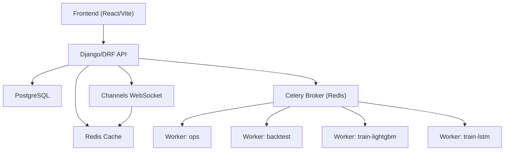
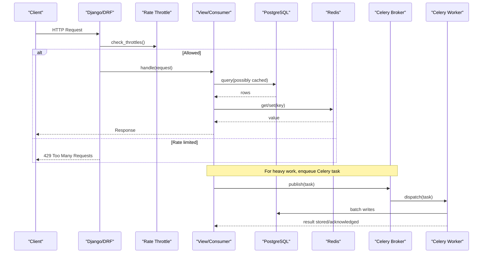
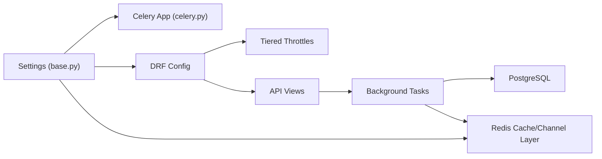

# Performance Troubleshooting

<cite>
**Referenced Files in This Document**
- [celery.py](file://config/celery.py)
- [base.py](file://config/settings/base.py)
- [production.py](file://config/settings/production.py)
- [throttling.py](file://apps/core/throttling.py)
- [tasks.py](file://apps/analytics/tasks.py)
- [tasks.py](file://apps/backtest/tasks.py)
- [task_health.py](file://apps/backtest/task_health.py)
- [tasks.py](file://apps/prediction/tasks.py)
- [tasks_lightgbm.py](file://apps/prediction/tasks_lightgbm.py)
- [metrics.md](file://docs/reference/metrics.md)
- [testing.md](file://docs/how-to/testing.md)
- [local-setup.md](file://docs/how-to/local-setup.md)
- [runbook-provider-blackout.md](file://docs/how-to/runbook-provider-blackout.md)
- [api.md](file://docs/reference/api.md)
- [README.md](file://README.md)
- [run_celery_worker.sh](file://scripts/run_celery_worker.sh)
</cite>

## Table of Contents
1. Introduction
2. Project Structure
3. Core Components
4. Architecture Overview
5. Detailed Component Analysis
6. Dependency Analysis
7. Performance Considerations
8. Troubleshooting Guide
9. Conclusion
10. Appendices

## Introduction
This document provides a comprehensive performance troubleshooting guide for FinanceAnalysis. It focuses on identifying slow queries, memory leaks, Celery worker bottlenecks, Redis cache issues, API latency, and frontend rendering problems. It also covers scaling strategies, database connection tuning, caching best practices, custom metrics, log analysis, capacity planning, throttling configuration, and load testing procedures.

## Project Structure
FinanceAnalysis is a Django + DRF backend with:
- PostgreSQL as the primary data store
- Redis for caching, Celery broker/channel layer, and WebSocket channels
- Celery workers organized into queues (ops, backtest, train-lightgbm, train-lstm)
- A React/Vite frontend that proxies /api and /ws to the backend
- Scheduled tasks via Celery Beat driving daily pipelines

**Diagram sources**
- [base.py:174-203](file://config/settings/base.py#L174-L203)
- [base.py:323-339](file://config/settings/base.py#L323-L339)
- [README.md:107-114](file://README.md#L107-L114)

**Section sources**
- [base.py:174-203](file://config/settings/base.py#L174-L203)
- [base.py:323-339](file://config/settings/base.py#L323-L339)
- [README.md:107-114](file://README.md#L107-L114)

## Core Components
- Celery configuration and task routing are centralized in settings and autodiscovered by the app.
- Throttling is tiered per user subscription and enforced at the API layer.
- Heavy computation runs in background tasks (analytics indicators, predictions, backtests).
- Redis powers caching, rate limiting counters, and real-time alerts.

Key implementation references:
- Celery app setup and queue definitions
- Tier-based DRF throttles
- Background tasks for indicator calculation and prediction generation
- Backtest engine with process-level caches and chunking

**Section sources**
- [celery.py:1-17](file://config/celery.py#L1-L17)
- [base.py:174-203](file://config/settings/base.py#L174-L203)
- [throttling.py:1-88](file://apps/core/throttling.py#L1-L88)
- [tasks.py:28-65](file://apps/analytics/tasks.py#L28-L65)
- [tasks.py:149-243](file://apps/prediction/tasks.py#L149-L243)
- [tasks.py:681-800](file://apps/backtest/tasks.py#L681-L800)

## Architecture Overview
The request path typically flows through DRF middleware (including throttling), then to views or async consumers. Long-running work is offloaded to Celery workers. Data is read from PostgreSQL and cached in Redis where applicable.

**Diagram sources**
- [base.py:264-301](file://config/settings/base.py#L264-L301)
- [base.py:323-339](file://config/settings/base.py#L323-L339)
- [base.py:174-203](file://config/settings/base.py#L174-L203)

## Detailed Component Analysis

### Slow Query Identification and Database Profiling
- Use Django Debug Toolbar in development to inspect SQL queries, N+1 patterns, and expensive joins.
- Enable database profiling tools (e.g., EXPLAIN ANALYZE) for hot queries identified by the toolbar or logs.
- Focus on large tables such as technical indicators and signal events when diagnosing latency.

Practical steps:
- Identify endpoints with high response times via Debug Toolbar.
- Inspect generated SQL; look for missing indexes or full table scans.
- Validate query plans with EXPLAIN ANALYZE and add targeted indexes if needed.
- Correlate slow queries with background tasks that may be generating heavy reads/writes.

**Section sources**
- [metrics.md:13-52](file://docs/reference/metrics.md#L13-L52)

### Memory Leak Detection
- The backtest engine uses process-level caches bounded by size limits to avoid unbounded growth. Clear them between unrelated batches to prevent memory leaks across runs.
- Monitor worker memory usage and restart workers periodically if long-lived processes accumulate state.

Recommended actions:
- Call the provided cache-clearing utility between unrelated backtest batches.
- Track peak memory per worker and set soft/hard time limits to force safe restarts.
- Profile Python memory (e.g., tracemalloc) during long-running tasks to locate leaks.

**Section sources**
- [tasks.py:106-159](file://apps/backtest/tasks.py#L106-L159)

### Celery Worker Performance Tuning
- Workers are configured via environment variables and scripts; concurrency and queues can be tuned per node.
- Separate queues isolate CPU-bound training jobs from operational tasks.

Tuning levers:
- Adjust CELERY_WORKER_CONCURRENCY per worker type.
- Run dedicated workers per queue (ops, backtest, train-lightgbm, train-lstm).
- Set appropriate soft/hard time limits to avoid stuck tasks.

**Section sources**
- [run_celery_worker.sh:1-28](file://scripts/run_celery_worker.sh#L1-L28)
- [base.py:174-203](file://config/settings/base.py#L174-L203)

### Redis Cache Optimization
- Redis serves as the default cache, channel layer, and Celery broker/result backend.
- Ensure correct credentials and URL shapes; misconfiguration breaks throttling, caching, and WebSockets.
- Configure maxmemory policy to avoid silent eviction of critical keys.

Optimization checklist:
- Verify REDIS_URL, CELERY_BROKER_URL, and CELERY_RESULT_BACKEND point to the intended databases.
- Use noeviction policy to protect throttle counters and cached responses.
- Warm up frequently accessed datasets and use short TTLs for volatile data.

**Section sources**
- [base.py:323-339](file://config/settings/base.py#L323-L339)
- [local-setup.md:43-127](file://docs/how-to/local-setup.md#L43-L127)
- [testing.md:218-254](file://docs/how-to/testing.md#L218-L254)

### Data Processing Pipeline Bottlenecks
- Indicator calculations and predictions run as Celery tasks and often depend on OHLCV and feature tables.
- Staleness checks skip redundant recomputation when windows are fresh.

Bottleneck identification:
- Inspect task logs for skipped/stale computations vs actual compute time.
- Measure feature extraction and model inference phases within backtest/prediction tasks.
- Use runtime metrics embedded in backtest runs to pinpoint slow stages.

**Section sources**
- [tasks.py:28-65](file://apps/analytics/tasks.py#L28-L65)
- [tasks.py:149-243](file://apps/prediction/tasks.py#L149-L243)
- [tasks.py:681-800](file://apps/backtest/tasks.py#L681-L800)

### API Response Latency Issues
- DRF throttling occurs early in request processing; Redis connectivity issues cause immediate failures.
- Caching reduces repeated DB hits; ensure cache keys and TTLs align with data freshness requirements.

Investigation flow:
- Confirm throttling is not rejecting requests due to Redis auth/cache errors.
- Check whether endpoints rely on expensive queries without pagination or filtering.
- Add selective caching for stable datasets and bypass cache for post-backfill reads.

**Section sources**
- [base.py:264-301](file://config/settings/base.py#L264-L301)
- [api.md:236-239](file://docs/reference/api.md#L236-L239)

### Frontend Rendering Problems
- Pages fetch paginated lists and render charts; large payloads or frequent re-renders can degrade UX.
- Use network timing and browser dev tools to identify slow API calls and heavy chart updates.

Remediation:
- Reduce page sizes and implement virtualization for large tables.
- Debounce rapid filter/sort changes and avoid unnecessary re-fetches.
- Offload heavy computations to the backend and return summarized results.

[No sources needed since this section doesn't analyze specific files]

## Dependency Analysis

**Diagram sources**
- [base.py:174-203](file://config/settings/base.py#L174-L203)
- [base.py:264-301](file://config/settings/base.py#L264-L301)
- [base.py:323-339](file://config/settings/base.py#L323-L339)
- [celery.py:1-17](file://config/celery.py#L1-L17)
- [throttling.py:1-88](file://apps/core/throttling.py#L1-L88)

**Section sources**
- [base.py:174-203](file://config/settings/base.py#L174-L203)
- [base.py:264-301](file://config/settings/base.py#L264-L301)
- [base.py:323-339](file://config/settings/base.py#L323-L339)
- [celery.py:1-17](file://config/celery.py#L1-L17)
- [throttling.py:1-88](file://apps/core/throttling.py#L1-L88)

## Performance Considerations
- Prefer batch operations and bulk writes in background tasks to reduce DB round trips.
- Use staleness checks to avoid recomputing indicators unnecessarily.
- Keep process-level caches bounded and clear between unrelated workloads.
- Tune Redis memory policies and ensure authentication is correct to avoid silent failures.
- Segment Celery queues to isolate heavy workloads and scale horizontally.

[No sources needed since this section provides general guidance]

## Troubleshooting Guide

### Slow Queries
- Enable Django Debug Toolbar in development to capture SQL timings and query counts.
- Use EXPLAIN ANALYZE on suspected queries; add indexes for filtered/joined columns.
- Watch for N+1 patterns in list/detail endpoints; apply select_related/prefetch_related.

**Section sources**
- [metrics.md:13-52](file://docs/reference/metrics.md#L13-L52)

### Memory Leaks
- Clear backtest process caches between unrelated batches to prevent cross-run leakage.
- Monitor worker RSS and set soft time limits to force periodic restarts.
- Profile with memory tools to detect growing structures in long-running tasks.

**Section sources**
- [tasks.py:106-159](file://apps/backtest/tasks.py#L106-L159)

### Celery Worker Performance
- Scale concurrency per queue using environment variables.
- Run separate worker nodes per queue for isolation.
- Use task time limits to contain runaway tasks.

**Section sources**
- [run_celery_worker.sh:1-28](file://scripts/run_celery_worker.sh#L1-L28)
- [base.py:174-203](file://config/settings/base.py#L174-L203)

### Redis Cache Optimization
- Validate REDIS_URL and CELERY_BROKER_URL credentials; mismatched passwords break throttling, caching, and WebSockets.
- Set maxmemory policy to noeviction to protect critical keys.
- Use cache-busting query parameters after backfills to force fresh reads.

**Section sources**
- [local-setup.md:43-127](file://docs/how-to/local-setup.md#L43-L127)
- [testing.md:218-254](file://docs/how-to/testing.md#L218-L254)
- [api.md:236-239](file://docs/reference/api.md#L236-L239)

### Data Processing Pipelines
- Inspect task logs for stale skips vs compute durations.
- Use backtest runtime metrics to identify slow feature extraction, scaler transforms, and inference.
- Chunk long runs and persist progress to enable resumption.

**Section sources**
- [tasks.py:149-243](file://apps/prediction/tasks.py#L149-L243)
- [tasks.py:681-800](file://apps/backtest/tasks.py#L681-L800)

### API Latency
- Confirm DRF throttling is not failing due to Redis connectivity issues.
- Apply pagination and server-side filtering to reduce payload sizes.
- Cache stable datasets and invalidate strategically after updates.

**Section sources**
- [base.py:264-301](file://config/settings/base.py#L264-L301)

### Frontend Rendering
- Use browser DevTools to measure network waterfall and main thread blocking.
- Virtualize large lists and debounce inputs to reduce re-renders.
- Minimize chart data points; aggregate on the backend when possible.

[No sources needed since this section doesn't analyze specific files]

### Scaling Celery Workers
- Spin up multiple worker processes per queue based on CPU/memory headroom.
- Use distinct hostnames/nodes per queue for observability and isolation.
- Monitor queue depths and adjust concurrency accordingly.

**Section sources**
- [run_celery_worker.sh:1-28](file://scripts/run_celery_worker.sh#L1-L28)
- [base.py:174-203](file://config/settings/base.py#L174-L203)

### Optimizing Database Connections
- Ensure connection pooling is enabled at the database driver level.
- Avoid long-running transactions in request paths; keep atomic requests small.
- Use read replicas for analytical queries if supported.

[No sources needed since this section provides general guidance]

### Effective Caching Strategies
- Cache expensive aggregations and reference data with appropriate TTLs.
- Use cache keys that include version or checksum to simplify invalidation.
- Bypass cache for post-backfill verification using unique query parameters.

**Section sources**
- [api.md:236-239](file://docs/reference/api.md#L236-L239)

### Custom Metrics and Log Analysis
- Capture runtime metrics inside backtest and prediction tasks (feature extraction, inference, batching).
- Persist metrics in task reports and review trends to spot regressions.
- Aggregate logs by task name and date to identify recurring bottlenecks.

**Section sources**
- [tasks.py:162-230](file://apps/backtest/tasks.py#L162-L230)

### Capacity Planning for Production
- Size workers based on queue-specific workloads (ops vs training vs backtest).
- Plan Redis capacity for broker, cache, and channels; monitor memory and eviction.
- Establish SLOs for task completion times and API latency; instrument dashboards.

[No sources needed since this section provides general guidance]

### Throttling Mechanisms and Configuration
- DRF enforces tiered rate limits per user subscription; anonymous and authenticated endpoints have separate scopes.
- Misconfigured Redis will cause all authenticated requests to fail at throttle checks.

Configuration references:
- Default throttle classes and rates
- Tier-based throttle implementations

**Section sources**
- [base.py:264-301](file://config/settings/base.py#L264-L301)
- [throttling.py:1-88](file://apps/core/throttling.py#L1-L88)

### Load Testing Procedures
- Simulate realistic traffic patterns including bursts and sustained loads.
- Measure API latency, error rates, and queue backlogs under load.
- Validate Redis resilience and Celery throughput; tune concurrency and timeouts.

[No sources needed since this section provides general guidance]

### Stuck or Orphaned Backtest Runs
- Distinguish between legitimately queued continuations and orphaned runs.
- Use health utilities to detect stale owners and take corrective action.

**Section sources**
- [task_health.py:1-95](file://apps/backtest/task_health.py#L1-L95)

## Conclusion
Performance issues in FinanceAnalysis typically stem from database inefficiencies, Redis misconfiguration, unbounded caches, or insufficient worker scaling. By combining Django Debug Toolbar, Redis validation, task-level metrics, and disciplined caching and scaling practices, you can reliably identify and resolve bottlenecks across the API, background pipelines, and frontend rendering.

[No sources needed since this section summarizes without analyzing specific files]

## Appendices

### Key Environment Variables and Queues
- Broker and result backend URLs
- Task queues and routes
- Time limits and scheduler

**Section sources**
- [base.py:174-203](file://config/settings/base.py#L174-L203)

### Provider Quotas and Backfill Safeguards
- Respect per-minute quotas and use checkpointing to avoid partial backfills.
- Reduce concurrency to one for provider-bound backfills to prevent throttling storms.

**Section sources**
- [runbook-provider-blackout.md:41-76](file://docs/how-to/runbook-provider-blackout.md#L41-L76)