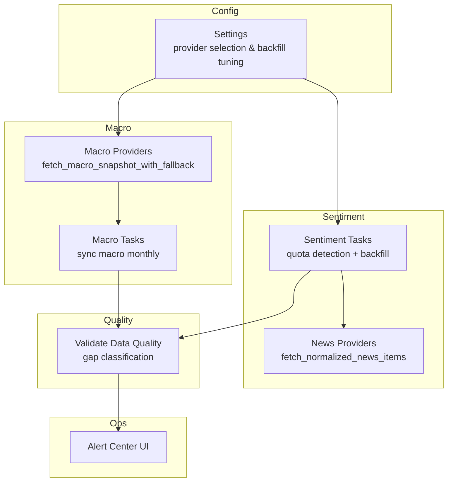
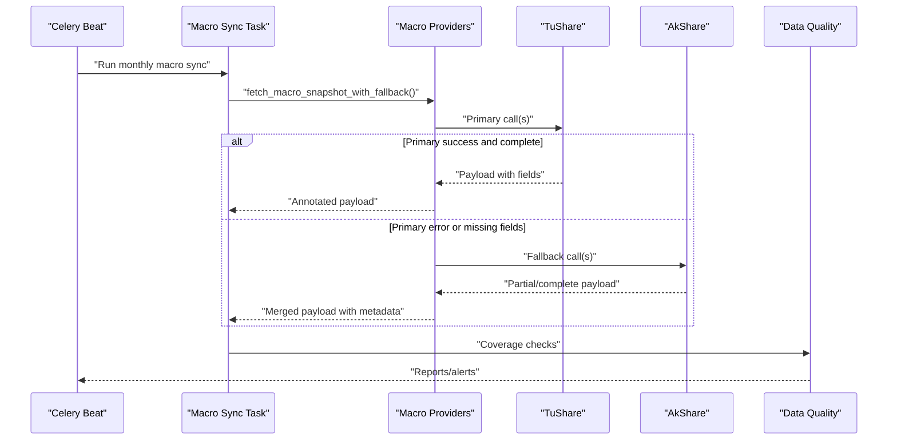
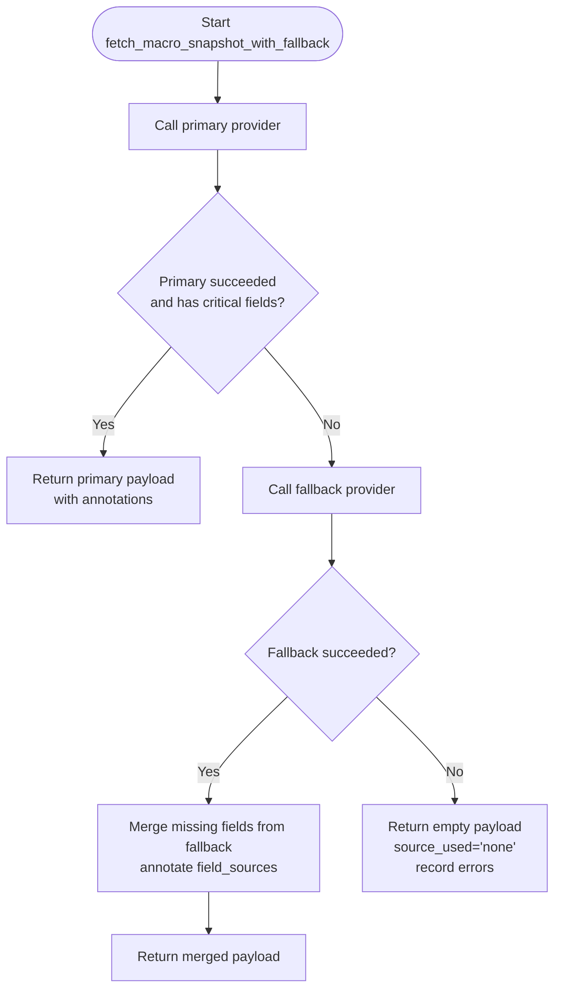
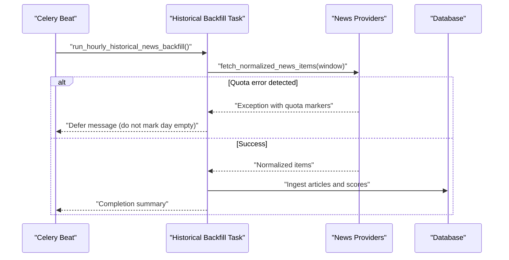
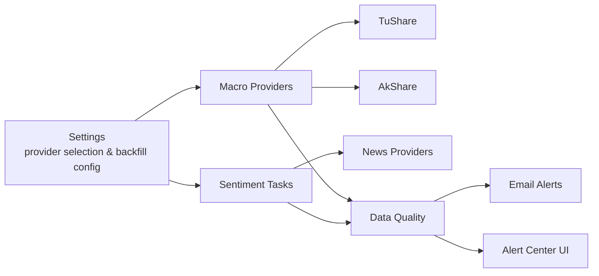

# Provider Blackout Runbook

<cite>
**Referenced Files in This Document**
- [runbook-provider-blackout.md](file://docs/how-to/runbook-provider-blackout.md)
- [providers.py](file://apps/macro/providers.py)
- [tasks.py](file://apps/sentiment/tasks.py)
- [providers.py](file://apps/sentiment/providers.py)
- [base.py](file://config/settings/base.py)
- [validate_data_quality.py](file://apps/core/management/commands/validate_data_quality.py)
- [backfill_news.py](file://apps/sentiment/management/commands/backfill_news.py)
- [throttling.py](file://apps/core/throttling.py)
- [AlertCenterPage.tsx](file://frontend/src/pages/AlertCenterPage.tsx)
</cite>

## Table of Contents
1. Introduction
2. Project Structure
3. Core Components
4. Architecture Overview
5. Detailed Component Analysis
6. Dependency Analysis
7. Performance Considerations
8. Troubleshooting Guide
9. Conclusion
10. Appendices

## Introduction
This runbook documents how FinanceAnalysis detects, responds to, and recovers from external data provider blackouts and API failures for TuShare and AkShare. It covers provider status monitoring, fallback mechanisms, graceful degradation, authentication failure handling, quota management, retry logic configuration, alerting thresholds, and procedures for communicating outages and adjusting processing schedules.

## Project Structure
Provider-related behavior spans several modules:
- Macro data providers with primary/fallback orchestration and per-field source tracking
- News ingestion with provider adapters and quota-aware retries
- Configuration of provider selection, sleep intervals, and backfill windows
- Data quality validation that classifies gaps as structural vs suspicious
- Frontend alert center for operational visibility

**Diagram sources**
- [providers.py:540-615](file://apps/macro/providers.py#L540-L615)
- [tasks.py:328-390](file://apps/sentiment/tasks.py#L328-L390)
- [base.py:205-217](file://config/settings/base.py#L205-L217)
- [validate_data_quality.py:119-145](file://apps/core/management/commands/validate_data_quality.py#L119-L145)
- [AlertCenterPage.tsx:33-67](file://frontend/src/pages/AlertCenterPage.tsx#L33-L67)

**Section sources**
- [runbook-provider-blackout.md:9-24](file://docs/how-to/runbook-provider-blackout.md#L9-L24)
- [base.py:205-217](file://config/settings/base.py#L205-L217)

## Core Components
- Macro provider orchestrator: fetches from a primary provider (TuShare by default), falls back to AkShare when fields are missing or the primary fails, and annotates metadata with field-level provenance and errors.
- News provider adapters: normalize heterogeneous upstream records into a common schema; tasks detect provider quota errors and defer backfills instead of marking days empty.
- Settings: configure primary/fallback providers, sleep between calls, and backfill windows/retries for macro yield series and news backfill.
- Data quality validator: distinguishes structural gaps (provider never had data) from suspicious gaps (fetch failures) and can email alerts on critical issues.
- Throttling: application-level rate limits for API consumers; separate from upstream provider quotas but relevant for overall system load during outages.

**Section sources**
- [providers.py:261-307](file://apps/macro/providers.py#L261-L307)
- [providers.py:540-615](file://apps/macro/providers.py#L540-L615)
- [tasks.py:58-66](file://apps/sentiment/tasks.py#L58-L66)
- [tasks.py:328-390](file://apps/sentiment/tasks.py#L328-L390)
- [base.py:205-217](file://config/settings/base.py#L205-L217)
- [validate_data_quality.py:3061-3093](file://apps/core/management/commands/validate_data_quality.py#L3061-L3093)
- [throttling.py:17-88](file://apps/core/throttling.py#L17-L88)

## Architecture Overview
The system uses a layered approach to resilience:
- Primary provider first; if it fails or returns incomplete data, a fallback provider is tried.
- Per-field provenance is recorded so downstream consumers know which source provided each value.
- Quota errors are recognized and treated as retryable conditions rather than permanent failures.
- Backfills use windowing, sleeps, and retries tuned to clear per-minute quotas.
- Data quality validation classifies gaps and can trigger alerts.

**Diagram sources**
- [providers.py:540-615](file://apps/macro/providers.py#L540-L615)
- [base.py:231-241](file://config/settings/base.py#L231-L241)

## Detailed Component Analysis

### Macro Provider Orchestration and Fallback
- Primary/Fallback selection: configurable via settings; defaults to TuShare primary and AkShare fallback.
- Retry wrapper: per-call retries with exponential-ish backoff using configured sleep; records retry counts and errors in metadata.
- Field-level merging: missing fields from primary are filled from fallback; metadata tracks which fields came from where and any errors encountered.
- Empty payload strategy: if both providers fail, an empty payload is returned with metadata indicating source_used=none and errors.

**Diagram sources**
- [providers.py:540-615](file://apps/macro/providers.py#L540-L615)
- [providers.py:276-307](file://apps/macro/providers.py#L276-L307)
- [providers.py:330-356](file://apps/macro/providers.py#L330-L356)

**Section sources**
- [providers.py:261-307](file://apps/macro/providers.py#L261-L307)
- [providers.py:540-615](file://apps/macro/providers.py#L540-L615)

### News Ingestion and Quota Handling
- Provider adapters normalize multiple upstream formats into a single item schema with deterministic synthetic URLs for deduplication.
- Quota detection: task-level function recognizes provider quota error messages and defers historical backfills instead of treating them as zero-news days.
- Backfill command: supports chunking, sleeps, retries, and dry-run planning to avoid burning quota.

**Diagram sources**
- [tasks.py:353-390](file://apps/sentiment/tasks.py#L353-L390)
- [tasks.py:58-66](file://apps/sentiment/tasks.py#L58-L66)
- [providers.py:221-312](file://apps/sentiment/providers.py#L221-L312)

**Section sources**
- [tasks.py:58-66](file://apps/sentiment/tasks.py#L58-L66)
- [tasks.py:328-390](file://apps/sentiment/tasks.py#L328-L390)
- [providers.py:221-312](file://apps/sentiment/providers.py#L221-L312)
- [backfill_news.py:25-44](file://apps/sentiment/management/commands/backfill_news.py#L25-L44)

### Configuration and Tuning
- Provider selection: primary and fallback providers for macro sync are environment-configured.
- Sleep and retry tuning: inter-call sleeps and retry sleeps sized to clear per-minute quotas; backfill windows limit request size.
- News backfill controls: enable/disable, provider, chunk size, floor date, and per-provider limits.

Key configuration variables:
- MACRO_SYNC_PRIMARY_PROVIDER
- MACRO_SYNC_FALLBACK_PROVIDER
- MACRO_SYNC_PROVIDER_SLEEP_SECONDS
- MACRO_YIELD_BACKFILL_WINDOW_MONTHS
- MACRO_YIELD_BACKFILL_MAX_RETRIES
- MACRO_YIELD_BACKFILL_RETRY_SLEEP_SECONDS
- MACRO_YIELD_BACKFILL_CALL_SLEEP_SECONDS
- NEWS_BACKFILL_ENABLED
- NEWS_BACKFILL_PROVIDER
- NEWS_BACKFILL_CHUNK_DAYS
- NEWS_BACKFILL_FLOOR
- NEWS_BACKFILL_LIMIT_PER_PROVIDER

**Section sources**
- [base.py:205-217](file://config/settings/base.py#L205-L217)
- [runbook-provider-blackout.md:41-79](file://docs/how-to/runbook-provider-blackout.md#L41-L79)

### Graceful Degradation and Missing Value Defaults
When inputs are missing due to provider blackouts, downstream components apply neutral defaults to keep pipelines running:
- Technical factors receive neutral values (e.g., RSI defaults, momentum defaults).
- Sentiment defaults to neutral when no related articles exist.
- Market context defaults to recovery/neutral when macro yields are unavailable.

Operational effect: predictions continue with reduced signal strength rather than failing outright. Coverage should be measured and published to track impact.

**Section sources**
- [runbook-provider-blackout.md:153-177](file://docs/how-to/runbook-provider-blackout.md#L153-L177)

### Data Quality Validation and Gap Classification
The validator separates structural gaps (provider never had data) from suspicious gaps (fetch failures):
- Structural findings require documentation and expectation adjustments.
- Suspicious gaps warrant re-running the owning backfill for the affected window.
- Alerts can be emailed with top issues when critical counts exceed thresholds.

**Section sources**
- [runbook-provider-blackout.md:83-129](file://docs/how-to/runbook-provider-blackout.md#L83-L129)
- [validate_data_quality.py:3061-3093](file://apps/core/management/commands/validate_data_quality.py#L3061-L3093)

### Authentication Failures and Token Management
- TuShare requires a token; absence or expiration causes auth errors that can mimic throttling.
- Several commands explicitly check for TUSHARE_TOKEN and raise clear errors when missing.
- Use earliest-data checks to validate token validity and coverage before large backfills.

Recommended steps:
- Verify token presence and validity before running provider-bound backfills.
- If all calls fail consistently, treat as authentication failure and rotate tokens.
- Re-run affected windows after fixing credentials.

**Section sources**
- [runbook-provider-blackout.md:69-75](file://docs/how-to/runbook-provider-blackout.md#L69-L75)
- [providers.py:261-267](file://apps/macro/providers.py#L261-L267)
- [providers.py:618-632](file://apps/macro/providers.py#L618-L632)

### Rate Limiting and Quota Limits
- TuShare quotas are per minute and per account tier; backfills are tuned with inter-call and retry sleeps to respect these windows.
- Do not reduce sleep intervals to speed up backfills; this increases throttle risk and creates partial coverage that looks like blackouts.
- For news backfills, use chunking, sleeps, retries, and dry-run to plan safely.

Operational guidance:
- Stop and wait when throttled; narrow ranges and resume from checkpoints.
- Reduce concurrency to one for provider-bound backfills.
- Use checkpointing flags supported by backfill commands.

**Section sources**
- [runbook-provider-blackout.md:41-79](file://docs/how-to/runbook-provider-blackout.md#L41-L79)
- [base.py:205-217](file://config/settings/base.py#L205-L217)

### Alerting and Stakeholder Communication
- Data quality validation can send emails summarizing critical issues and top buckets.
- The frontend Alert Center displays live connection status and recent alert events for operators.
- During outages, communicate:
  - Which provider is affected (primary/fallback)
  - Whether data is structurally missing or temporarily throttled
  - Expected recovery time based on quota reset cadence
  - Impact on signals/predictions due to neutral defaults

**Section sources**
- [validate_data_quality.py:3061-3093](file://apps/core/management/commands/validate_data_quality.py#L3061-L3093)
- [AlertCenterPage.tsx:33-67](file://frontend/src/pages/AlertCenterPage.tsx#L33-L67)

## Dependency Analysis

**Diagram sources**
- [base.py:205-217](file://config/settings/base.py#L205-L217)
- [providers.py:540-615](file://apps/macro/providers.py#L540-L615)
- [tasks.py:328-390](file://apps/sentiment/tasks.py#L328-L390)
- [validate_data_quality.py:3061-3093](file://apps/core/management/commands/validate_data_quality.py#L3061-L3093)
- [AlertCenterPage.tsx:33-67](file://frontend/src/pages/AlertCenterPage.tsx#L33-L67)

**Section sources**
- [base.py:205-217](file://config/settings/base.py#L205-L217)
- [providers.py:540-615](file://apps/macro/providers.py#L540-L615)
- [tasks.py:328-390](file://apps/sentiment/tasks.py#L328-L390)

## Performance Considerations
- Keep inter-call and retry sleeps at documented values to honor per-minute quotas; reducing them risks partial coverage and longer effective downtime.
- Run provider-bound backfills with single concurrency to avoid doubling throttle rates.
- Use checkpointing and smaller windows to minimize wasted work during throttling.
- Monitor Celery queues and task durations to ensure backfills progress without blocking other jobs.

[No sources needed since this section provides general guidance]

## Troubleshooting Guide
Common symptoms and actions:
- Per-minute quota errors: stop, wait, narrow range, resume from checkpoint, reduce concurrency.
- Historical blackout (empty dataframe for a range): classify via data quality validation; do not retry into existence.
- Field-level nulls: identify whether structural or suspicious; re-run owning backfill only for suspicious gaps.
- Authentication failures: verify TUSHARE_TOKEN; test with earliest-data checks; rotate if expired.
- Publication lag: align expectations with provider cadence; adjust staleness tolerance rather than forcing early updates.

Post-remediation verification:
- Export metrics and diff to confirm improved coverage.
- Record structural findings in changelogs to prevent future misdiagnosis.

**Section sources**
- [runbook-provider-blackout.md:28-79](file://docs/how-to/runbook-provider-blackout.md#L28-L79)
- [runbook-provider-blackout.md:83-129](file://docs/how-to/runbook-provider-blackout.md#L83-L129)
- [runbook-provider-blackout.md:181-206](file://docs/how-to/runbook-provider-blackout.md#L181-L206)

## Conclusion
FinanceAnalysis implements robust provider blackout handling through primary/fallback orchestration, quota-aware retries, neutral fallbacks, and rigorous data quality validation. Operators should monitor provider status, follow the remediation decision table, and use configuration knobs to tune backfills and alerts. Transparent communication and post-remediation verification ensure consistent service quality even during upstream disruptions.

[No sources needed since this section summarizes without analyzing specific files]

## Appendices

### Provider-Specific Error Indicators and Detection
- TuShare quota markers recognized by sentiment tasks include Chinese-language strings indicating per-minute access limits and frequency exceeded conditions.
- Macro provider calls record per-field errors and retry counts in payload metadata for traceability.

**Section sources**
- [tasks.py:58-66](file://apps/sentiment/tasks.py#L58-L66)
- [providers.py:276-307](file://apps/macro/providers.py#L276-L307)

### Adjusting Processing Schedules During Blackouts
- Macro sync runs on days 2–8 of each month to accommodate publication lag; do not assume current-month macro snapshots are missing on day 1.
- News backfill runs hourly with chunking; pause or reduce frequency during sustained throttling.

**Section sources**
- [runbook-provider-blackout.md:132-149](file://docs/how-to/runbook-provider-blackout.md#L132-L149)
- [base.py:231-241](file://config/settings/base.py#L231-L241)