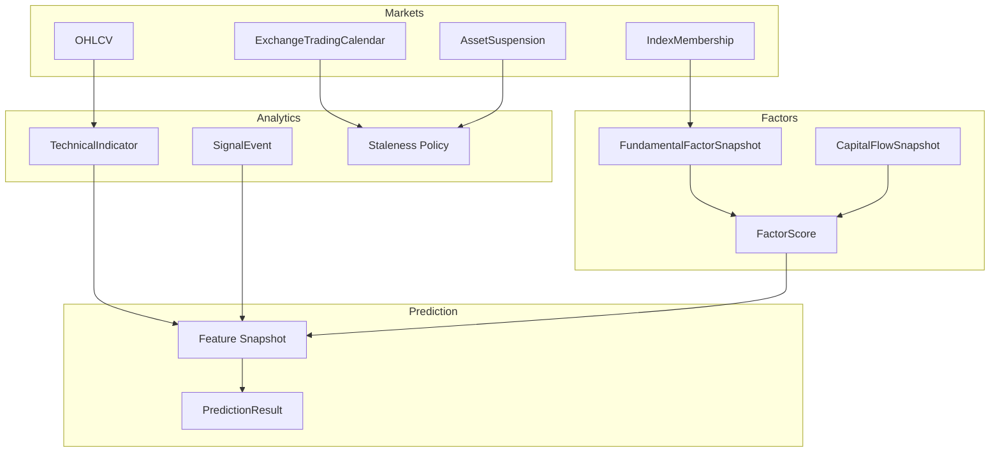
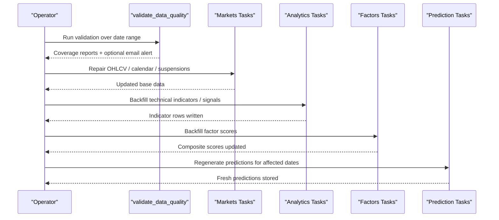
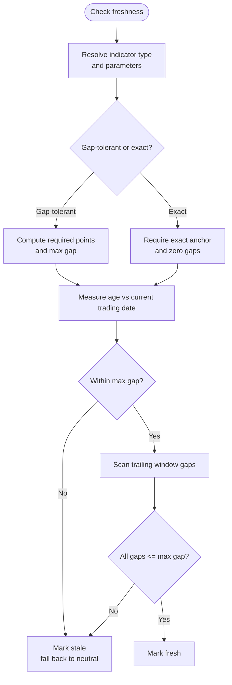
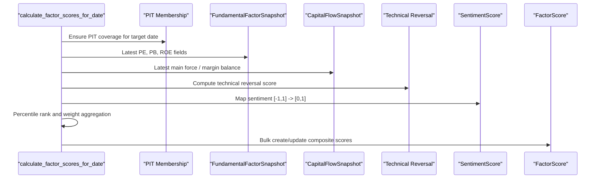
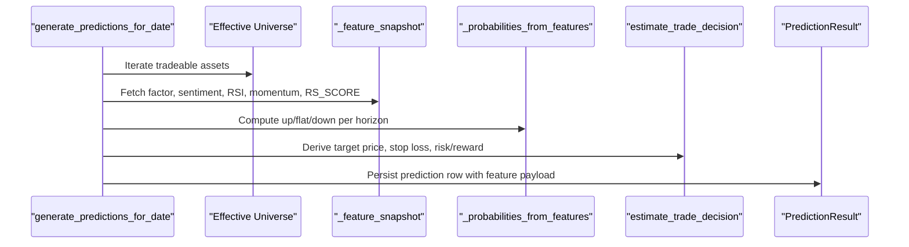
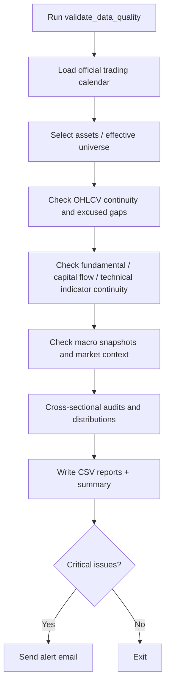
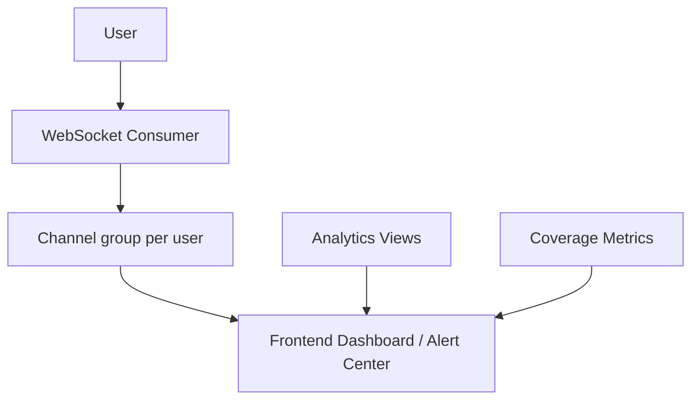
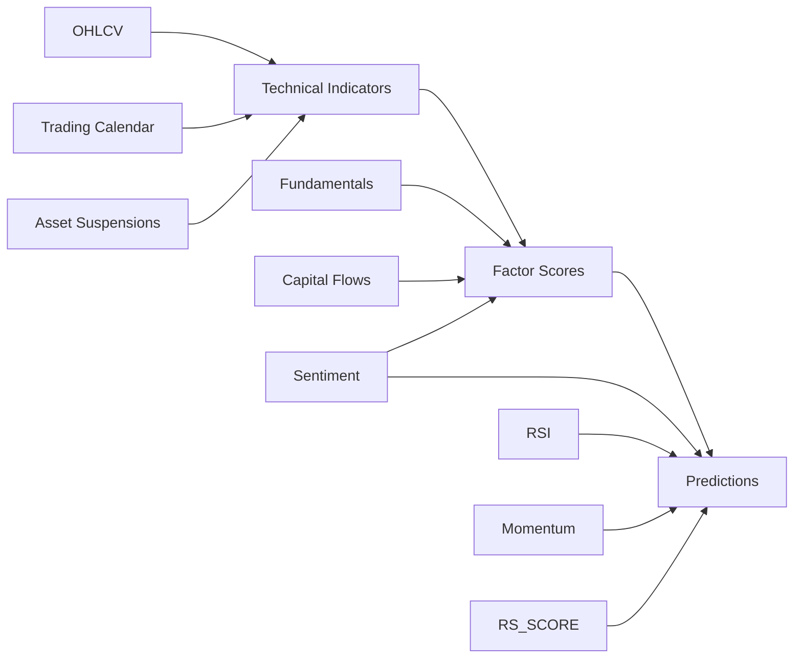

# Stale Data Detection & Resolution

<cite>
**Referenced Files in This Document**
- [technical_staleness.py](file://apps/analytics/technical_staleness.py)
- [runbook-stale-data.md](file://docs/how-to/runbook-stale-data.md)
- [tasks.py (factors)](file://apps/factors/tasks.py)
- [tasks.py (prediction)](file://apps/prediction/tasks.py)
- [tasks.py (markets)](file://apps/markets/tasks.py)
- [validate_data_quality.py](file://apps/core/management/commands/validate_data_quality.py)
- [metrics.md](file://docs/reference/metrics.md)
- [models.py (analytics)](file://apps/analytics/models.py)
- [consumers.py](file://apps/analytics/consumers.py)
- [views.py (analytics)](file://apps/analytics/views.py)
- [backfill_model_data.py](file://apps/prediction/management/commands/backfill_model_data.py)
- [commands.md](file://docs/reference/commands.md)
</cite>

## Table of Contents
1. Introduction
2. Project Structure
3. Core Components
4. Architecture Overview
5. Detailed Component Analysis
6. Dependency Analysis
7. Performance Considerations
8. Troubleshooting Guide
9. Conclusion
10. Appendices

## Introduction
This document explains how FinanceAnalysis detects, diagnoses, and resolves stale data across technical indicators, factor scores, and model predictions. It covers the staleness policies, freshness measurement using official trading days, procedures to trigger recomputation, dependency chains that cause staleness, validation after recovery, monitoring and alerting surfaces, and common causes such as upstream gaps, computation failures, and resource constraints.

## Project Structure
Stale data detection and resolution spans several apps:
- Analytics: staleness policy for technical indicators and signals; daily indicator tasks; WebSocket alert consumer.
- Factors: daily factor score computation from fundamentals, capital flows, technical reversal, and sentiment.
- Prediction: feature snapshot assembly and prediction generation using factor scores, sentiment, RSI, momentum, and RS_SCORE.
- Markets: OHLCV, trading calendar, suspensions, index membership, and benchmark history that underpin all derived data.
- Core: comprehensive data quality validator that produces actionable reports and optional alerts.

**Diagram sources**
- [technical_staleness.py:9-78](file://apps/analytics/technical_staleness.py#L9-L78)
- [tasks.py (factors):283-461](file://apps/factors/tasks.py#L283-L461)
- [tasks.py (prediction):55-243](file://apps/prediction/tasks.py#L55-L243)
- [tasks.py (markets):266-800](file://apps/markets/tasks.py#L266-L800)

**Section sources**
- [technical_staleness.py:9-78](file://apps/analytics/technical_staleness.py#L9-L78)
- [tasks.py (factors):283-461](file://apps/factors/tasks.py#L283-L461)
- [tasks.py (prediction):55-243](file://apps/prediction/tasks.py#L55-L243)
- [tasks.py (markets):266-800](file://apps/markets/tasks.py#L266-L800)

## Core Components
- Staleness policy for technical indicators defines gap tolerances and required trailing windows per indicator type and parameters.
- Factor score pipeline aggregates fundamentals, capital flows, technical reversal, and sentiment into composite scores used by downstream models.
- Prediction pipeline builds a feature snapshot per asset/date and generates up/flat/down probabilities and trade decisions.
- Data quality validator scans coverage gaps, continuity issues, and anomalies across tables and writes detailed CSVs with severity and issue types.

Key responsibilities:
- Measure freshness against official trading days, not calendar days or sparse OHLCV counts.
- Refuse to write or use stale rows; fall back to documented neutral values consistently.
- Provide commands and tasks to repair upstream inputs and recompute downstream stages.

**Section sources**
- [technical_staleness.py:9-78](file://apps/analytics/technical_staleness.py#L9-L78)
- [tasks.py (factors):283-461](file://apps/factors/tasks.py#L283-L461)
- [tasks.py (prediction):55-243](file://apps/prediction/tasks.py#L55-L243)
- [validate_data_quality.py:426-721](file://apps/core/management/commands/validate_data_quality.py#L426-L721)

## Architecture Overview
The system enforces freshness at multiple layers:
- Input layer: OHLCV, trading calendar, suspensions, index membership, benchmarks.
- Derived layer: technical indicators and signals, fundamental/capital flow snapshots, factor scores.
- Model layer: feature snapshots and predictions.

Freshness is measured using ExchangeTradingCalendar open dates. Indicators have bounded interior gap tolerance or exact-window requirements. Factor scores depend on latest available snapshots and technical reversal logic. Predictions consume factor scores, sentiment, RSI, momentum, and RS_SCORE.

**Diagram sources**
- [validate_data_quality.py:426-721](file://apps/core/management/commands/validate_data_quality.py#L426-L721)
- [tasks.py (markets):266-800](file://apps/markets/tasks.py#L266-L800)
- [commands.md:23-53](file://docs/reference/commands.md#L23-L53)
- [tasks.py (factors):283-461](file://apps/factors/tasks.py#L283-L461)
- [tasks.py (prediction):177-243](file://apps/prediction/tasks.py#L177-L243)

## Detailed Component Analysis

### Technical Indicator Staleness Policy
- Gap-tolerant metrics allow bounded interior gaps within the required trailing window and enforce recency against the current official trading date.
- Exact-window metrics require zero gaps and an exact aligned anchor date; missing any session invalidates the window.
- Moving averages use bucketed max-gap rules based on timeperiod.
- Warmup lookbacks vary by indicator variant; some require fixed point counts.

**Diagram sources**
- [technical_staleness.py:9-78](file://apps/analytics/technical_staleness.py#L9-L78)
- [technical_staleness.py:122-190](file://apps/analytics/technical_staleness.py#L122-L190)

**Section sources**
- [technical_staleness.py:9-78](file://apps/analytics/technical_staleness.py#L9-L78)
- [technical_staleness.py:122-190](file://apps/analytics/technical_staleness.py#L122-L190)
- [runbook-stale-data.md:31-102](file://docs/how-to/runbook-stale-data.md#L31-L102)

### Factor Score Computation and Freshness
- Daily factor scores combine fundamental, capital flow, technical reversal, and sentiment components.
- Inputs are pulled as latest available rows up to the target date; missing inputs map to defaults or neutral values.
- The task ensures PIT membership coverage and computes percentile ranks across assets before aggregating weighted scores.

**Diagram sources**
- [tasks.py (factors):283-461](file://apps/factors/tasks.py#L283-L461)

**Section sources**
- [tasks.py (factors):283-461](file://apps/factors/tasks.py#L283-L461)

### Prediction Feature Snapshot and Generation
- Builds a feature snapshot per asset/date from factor scores, sentiment, RSI, momentum, and RS_SCORE.
- Computes horizon-specific probabilities and labels; stores trade decision fields and metadata.
- Uses active ensemble model version context and macro phase adjustments.

**Diagram sources**
- [tasks.py (prediction):55-243](file://apps/prediction/tasks.py#L55-L243)

**Section sources**
- [tasks.py (prediction):55-243](file://apps/prediction/tasks.py#L55-L243)

### Data Quality Validation and Reporting
- Scans OHLCV continuity, fundamental and capital flow continuity, technical indicator continuity, macro snapshots, market context, and cross-sectional participants.
- Produces detailed CSVs with issue types, severities, and field-level diagnostics.
- Supports optional email alerts and fail-on-critical exit codes for CI gating.

**Diagram sources**
- [validate_data_quality.py:426-721](file://apps/core/management/commands/validate_data_quality.py#L426-L721)

**Section sources**
- [validate_data_quality.py:426-721](file://apps/core/management/commands/validate_data_quality.py#L426-L721)

### Monitoring Dashboards and Alerts
- WebSocket consumer streams alert notifications to authenticated users via channel groups keyed by user ID.
- Views expose dashboard candidate selection and prediction-related endpoints; alert rule/event models exist but may be empty by design.
- Metrics documentation provides table-level coverage summaries useful for freshness dashboards.

**Diagram sources**
- [consumers.py:18-59](file://apps/analytics/consumers.py#L18-L59)
- [views.py (analytics):196-200](file://apps/analytics/views.py#L196-L200)
- [metrics.md:13-53](file://docs/reference/metrics.md#L13-L53)

**Section sources**
- [consumers.py:18-59](file://apps/analytics/consumers.py#L18-L59)
- [views.py (analytics):196-200](file://apps/analytics/views.py#L196-L200)
- [metrics.md:13-53](file://docs/reference/metrics.md#L13-L53)

## Dependency Analysis
Staleness propagates through a strict dependency chain:
- OHLCV, trading calendar, suspensions, listing dates form the foundation.
- Technical indicators and signals depend on OHLCV and calendar continuity.
- Factor scores depend on fundamentals, capital flows, technical reversal, and sentiment.
- Predictions depend on factor scores, sentiment, RSI, momentum, and RS_SCORE.

**Diagram sources**
- [tasks.py (markets):266-800](file://apps/markets/tasks.py#L266-L800)
- [tasks.py (factors):283-461](file://apps/factors/tasks.py#L283-L461)
- [tasks.py (prediction):55-243](file://apps/prediction/tasks.py#L55-L243)

**Section sources**
- [tasks.py (markets):266-800](file://apps/markets/tasks.py#L266-L800)
- [tasks.py (factors):283-461](file://apps/factors/tasks.py#L283-L461)
- [tasks.py (prediction):55-243](file://apps/prediction/tasks.py#L55-L243)

## Performance Considerations
- Use chunked backfills and checkpoint files to resume long-running jobs without losing progress.
- Prefer bulk operations and distinct queries to minimize database load during large recomputations.
- Limit symbol sets when diagnosing narrow windows to reduce runtime.
- Avoid unnecessary full-range recalculations; target specific date ranges impacted by upstream repairs.

[No sources needed since this section provides general guidance]

## Troubleshooting Guide
Common causes of staleness:
- Upstream data gaps: Missing OHLCV on official trading days outside listing/suspension windows.
- Provider blackouts or throttling: TuShare rate limits or token/network issues.
- Cancellation or failure mid-backfill: Abandoned runs leave partial coverage.
- Resource constraints: Large date ranges or broad symbol sets overwhelm workers.

Diagnostic steps:
- Run the data quality validator to identify gaps and anomalies; review generated CSVs for issue_type and severity.
- Compare latest dates across indicator families; uneven latest dates indicate partial backfills.
- Check official trading calendar coverage; ensure it spans the full range before interpreting freshness.

Remediation steps:
- Repair upstream first: OHLCV, calendar, suspensions, listing dates.
- Re-run owning backfill commands for the affected window:
  - Technical indicators and signals.
  - Factor scores and RS_SCORE.
  - Predictions for affected dates.
- Re-trigger daily tasks to refresh today’s rows after historical repairs.

Validation after recovery:
- Re-run export_documentation_facts to regenerate coverage metrics and diff changes.
- Optionally run validate_data_quality with --alert and --fail-on-critical in scripted paths.

**Section sources**
- [runbook-stale-data.md:105-262](file://docs/how-to/runbook-stale-data.md#L105-L262)
- [validate_data_quality.py:426-721](file://apps/core/management/commands/validate_data_quality.py#L426-L721)
- [commands.md:23-53](file://docs/reference/commands.md#L23-L53)
- [backfill_model_data.py:497-515](file://apps/prediction/management/commands/backfill_model_data.py#L497-L515)

## Conclusion
FinanceAnalysis enforces strict freshness policies grounded in official trading days and indicator-specific gap tolerances. Staleness is detected by guards that refuse stale rows and by validators that surface coverage gaps. Resolution follows a clear dependency order: fix upstream inputs, re-run owning backfills, refresh daily tasks, and regenerate predictions. Monitoring via coverage metrics and optional alerts helps prevent recurrence and supports automated remediation workflows.

[No sources needed since this section summarizes without analyzing specific files]

## Appendices

### Staleness Thresholds and Neutral Fallbacks
- Gap-tolerant indicators allow bounded interior gaps; exact-window indicators require zero gaps and exact anchors.
- Neutral fallbacks apply when inputs are unusable; these keep training and inference consistent.

**Section sources**
- [technical_staleness.py:9-78](file://apps/analytics/technical_staleness.py#L9-L78)
- [runbook-stale-data.md:31-102](file://docs/how-to/runbook-stale-data.md#L31-L102)

### Commands and Ownership
- Technical indicators and non-RS signals: backfill_technical_indicators and backfill_signal_events.
- Factor scores and RS_SCORE: backfill_model_data.
- OHLCV repair: backfill_ohlcv_history.

**Section sources**
- [commands.md:23-53](file://docs/reference/commands.md#L23-L53)
- [runbook-stale-data.md:184-203](file://docs/how-to/runbook-stale-data.md#L184-L203)

### Coverage Metrics Reference
- Table-level coverage and field-level non-null ranges help identify structural provider floors or blackouts versus transient gaps.

**Section sources**
- [metrics.md:13-53](file://docs/reference/metrics.md#L13-L53)
- [metrics.md:140-188](file://docs/reference/metrics.md#L140-L188)