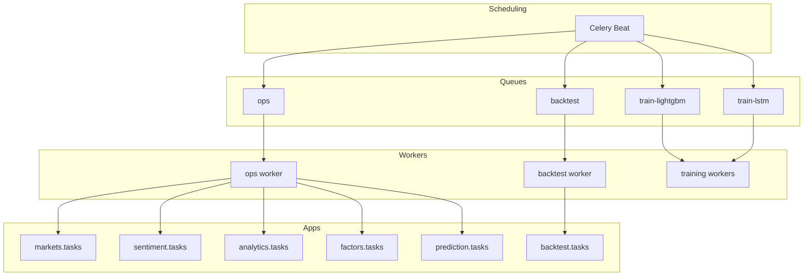
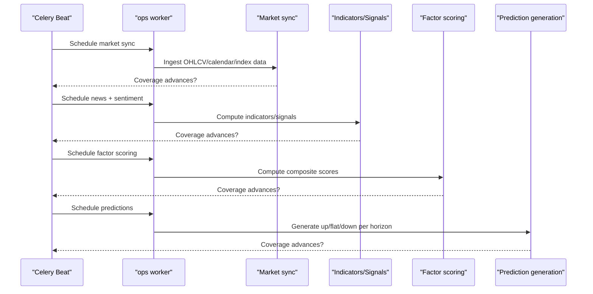
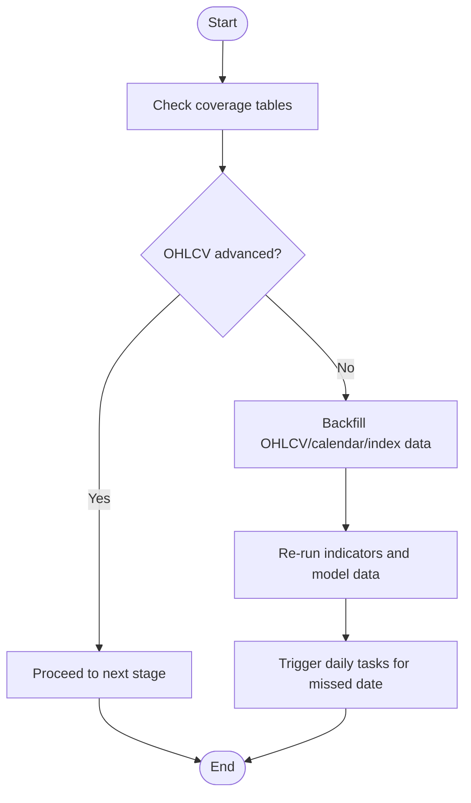
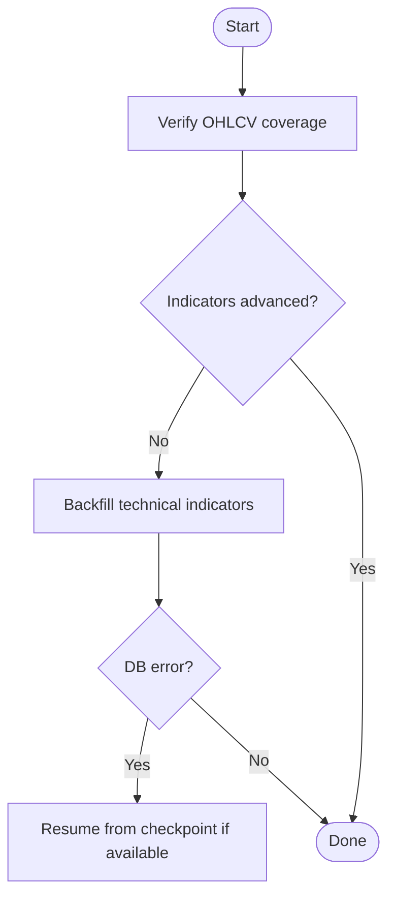
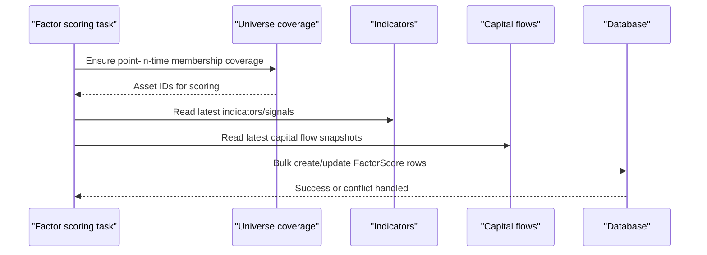
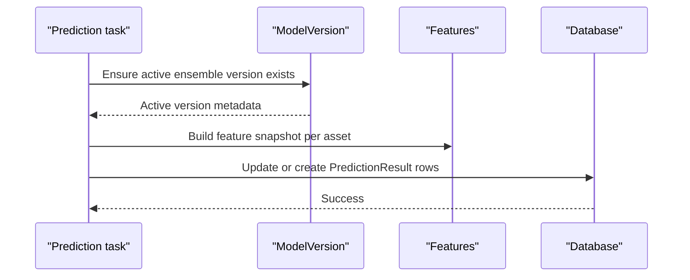
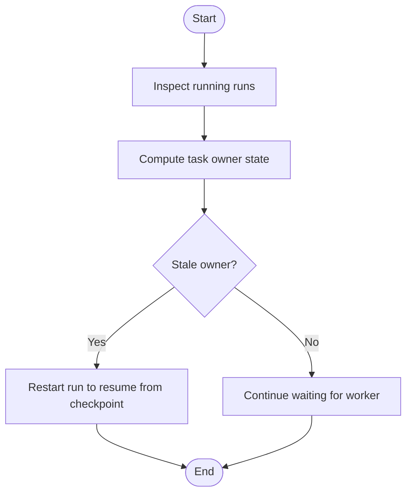
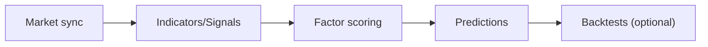

# Sync & Task Failure Runbook

<cite>
**Referenced Files in This Document**
- [celery.py](file://config/celery.py)
- [base.py](file://config/settings/base.py)
- [run_celery_beat.sh](file://scripts/run_celery_beat.sh)
- [tasks.py](file://apps/markets/tasks.py)
- [tasks.py](file://apps/factors/tasks.py)
- [tasks.py](file://apps/prediction/tasks.py)
- [tasks.py](file://apps/backtest/tasks.py)
- [task_health.py](file://apps/backtest/task_health.py)
- [backfill_technical_indicators.py](file://apps/analytics/management/commands/backfill_technical_indicators.py)
- [export_documentation_facts.py](file://apps/core/management/commands/export_documentation_facts.py)
- [celery.md](file://docs/reference/celery.md)
- [runbook-sync-failure.md](file://docs/how-to/runbook-sync-failure.md)
- [local-setup.md](file://docs/how-to/local-setup.md)
</cite>

## Table of Contents
1. Introduction
2. Project Structure
3. Core Components
4. Architecture Overview
5. Detailed Component Analysis
6. Dependency Analysis
7. Performance Considerations
8. Troubleshooting Guide
9. Conclusion
10. Appendices

## Introduction
This runbook documents how to diagnose and recover from sync failures and task execution problems in FinanceAnalysis. It covers the daily pipeline schedule, task dependencies, failure detection using data coverage tables and worker logs, recovery procedures for market data sync, indicator computation, factor scoring, and prediction generation, as well as Celery worker health checks, queue monitoring, timeout handling, stuck backtest resolution, database connection failure recovery, and post-recovery validation.

## Project Structure
FinanceAnalysis uses Django with Celery for asynchronous work. The daily pipeline is orchestrated by Celery Beat and executed by workers consuming specific queues. Key areas:
- Configuration and scheduling live under config/settings and scripts.
- Data ingestion and enrichment tasks are in apps/markets, apps/sentiment, apps/macro.
- Derived analytics (indicators, signals) live in apps/analytics.
- Factor scoring lives in apps/factors.
- Prediction generation lives in apps/prediction.
- Long-running backtests live in apps/backtest.

**Diagram sources**
- [base.py:174-203](file://config/settings/base.py#L174-L203)
- [celery.md:13-22](file://docs/reference/celery.md#L13-L22)
- [runbook-sync-failure.md:10-19](file://docs/how-to/runbook-sync-failure.md#L10-L19)

**Section sources**
- [base.py:174-203](file://config/settings/base.py#L174-L203)
- [celery.md:13-22](file://docs/reference/celery.md#L13-L22)
- [runbook-sync-failure.md:10-19](file://docs/how-to/runbook-sync-failure.md#L10-L19)

## Core Components
- Daily pipeline schedule and dependencies:
  - Market data sync at 16:10 UTC.
  - News fetch at 16:35 UTC.
  - Sentiment pipeline at 17:00 UTC.
  - Predictions at 18:00 UTC; LightGBM predictions at 18:30 UTC.
  - Alert rule checks every 5 minutes.
- Queues and routing:
  - Default queue ops for periodic syncs, indicators, sentiment, and predictions.
  - Dedicated backtest queue for long-running runs.
  - Training queues for model retrains.
- Time limits:
  - Global soft limit 60 seconds, hard limit 300 seconds.
  - Backtest task overrides to longer limits to support chunked runs.

**Section sources**
- [runbook-sync-failure.md:10-19](file://docs/how-to/runbook-sync-failure.md#L10-L19)
- [base.py:174-203](file://config/settings/base.py#L174-L203)
- [celery.md:25-31](file://docs/reference/celery.md#L25-L31)
- [celery.md:100-106](file://docs/reference/celery.md#L100-L106)

## Architecture Overview
The daily flow depends on upstream data availability. Each stage writes to its own tables; downstream stages read those tables. If a stage fails, downstream outputs remain stale.

**Diagram sources**
- [runbook-sync-failure.md:10-19](file://docs/how-to/runbook-sync-failure.md#L10-L19)
- [tasks.py:283-460](file://apps/factors/tasks.py#L283-L460)
- [tasks.py:177-243](file://apps/prediction/tasks.py#L177-L243)

## Detailed Component Analysis

### Market Data Sync Failures
Symptoms:
- OHLCV or calendar did not advance to the expected trading day.
- Index constituents or benchmark index history missing.

Diagnosis:
- Check coverage tables via metrics export to confirm latest dates.
- Inspect worker logs for provider errors or rate limiting.
- Confirm TUSHARE_TOKEN is configured.

Recovery:
- Re-run market data backfill for the affected date range.
- Re-run derived stages in order: indicators, then model data.
- Re-trigger daily tasks for the missed date.

**Diagram sources**
- [runbook-sync-failure.md:84-112](file://docs/how-to/runbook-sync-failure.md#L84-L112)
- [tasks.py:266-352](file://apps/markets/tasks.py#L266-L352)
- [tasks.py:491-574](file://apps/markets/tasks.py#L491-L574)

**Section sources**
- [runbook-sync-failure.md:84-112](file://docs/how-to/runbook-sync-failure.md#L84-L112)
- [tasks.py:266-352](file://apps/markets/tasks.py#L266-L352)
- [tasks.py:491-574](file://apps/markets/tasks.py#L491-L574)

### Indicator Computation Issues
Symptoms:
- OHLCV advanced but indicators/signals did not.
- Stale technical indicators despite fresh OHLCV.

Diagnosis:
- Use coverage tables to identify the first table that did not advance.
- Review worker logs for transient database errors or timeouts.
- Confirm upstream data completeness and lookback windows.

Recovery:
- Re-run technical indicators backfill for the affected window.
- If database connections dropped, resume from checkpoint where supported.

**Diagram sources**
- [runbook-sync-failure.md:84-112](file://docs/how-to/runbook-sync-failure.md#L84-L112)
- [backfill_technical_indicators.py:395-425](file://apps/analytics/management/commands/backfill_technical_indicators.py#L395-L425)

**Section sources**
- [runbook-sync-failure.md:84-112](file://docs/how-to/runbook-sync-failure.md#L84-L112)
- [backfill_technical_indicators.py:395-425](file://apps/analytics/management/commands/backfill_technical_indicators.py#L395-L425)

### Factor Scoring Problems
Symptoms:
- Indicators advanced but factor scores did not update.
- Composite scores missing or neutral-heavy.

Diagnosis:
- Confirm upstream indicators and capital flow snapshots exist.
- Check effective universe membership coverage for the target date.
- Validate weights and input ranges used in scoring.

Recovery:
- Re-run factor scoring for the affected date.
- Ensure capital flow snapshots are refreshed before scoring.

**Diagram sources**
- [tasks.py:283-460](file://apps/factors/tasks.py#L283-L460)

**Section sources**
- [tasks.py:283-460](file://apps/factors/tasks.py#L283-L460)

### Prediction Generation Failures
Symptoms:
- Scores advanced but predictions did not update.
- Partial output when LightGBM path fails while heuristic/LSTM continue.

Diagnosis:
- Confirm active model artifacts per horizon.
- Validate artifact paths resolve on the host.
- Check upstream feature tables (indicators, factors, sentiment).

Recovery:
- Promote or retrain models to activate artifacts.
- Re-run prediction generation for the missed date.

**Diagram sources**
- [tasks.py:177-243](file://apps/prediction/tasks.py#L177-L243)

**Section sources**
- [runbook-sync-failure.md:144-166](file://docs/how-to/runbook-sync-failure.md#L144-L166)
- [tasks.py:177-243](file://apps/prediction/tasks.py#L177-L243)

### Stuck Backtest Runs
Symptoms:
- Backtest row remains RUNNING after worker death.
- No progress visible; next continuation queued but not started.

Diagnosis:
- Use task health utility to detect stale owners based on task state and runtime progress.
- Check whether the run has resume state indicating legitimate queuing.

Recovery:
- Restart the run to resume from checkpoint state.
- Avoid deleting unless parameters are incorrect.

**Diagram sources**
- [task_health.py:45-95](file://apps/backtest/task_health.py#L45-L95)
- [runbook-sync-failure.md:170-205](file://docs/how-to/runbook-sync-failure.md#L170-L205)

**Section sources**
- [task_health.py:45-95](file://apps/backtest/task_health.py#L45-L95)
- [runbook-sync-failure.md:170-205](file://docs/how-to/runbook-sync-failure.md#L170-L205)

### Database Connection Failure Recovery
Symptoms:
- OperationalError or InterfaceError during long runs.
- Intermittent failures due to idle connection timeouts.

Diagnosis:
- Identify whether the failure occurred in backtest or backfill.
- Confirm broker and database connectivity.

Recovery:
- For backtests: restart to resume from checkpoint.
- For backfills: re-run with resume-from-checkpoint where supported.
- If persistent failures occur, verify local stack and credentials.

**Section sources**
- [runbook-sync-failure.md:209-229](file://docs/how-to/runbook-sync-failure.md#L209-L229)
- [backfill_technical_indicators.py:395-425](file://apps/analytics/management/commands/backfill_technical_indicators.py#L395-L425)

### Post-Recovery Validation
After recovery:
- Regenerate metrics to confirm coverage advanced across all tables.
- Run data quality validation over the affected date range.
- Commit regenerated facts with incident notes.

**Section sources**
- [runbook-sync-failure.md:233-249](file://docs/how-to/runbook-sync-failure.md#L233-L249)

## Dependency Analysis
- Daily pipeline dependency chain:
  - Market sync -> Indicators/Signals -> Factor scoring -> Predictions.
- Queue topology:
  - ops: default queue for most tasks.
  - backtest: dedicated queue for long-running runs.
  - train-lightgbm/train-lstm: training tasks.
- Routing:
  - Explicit routes for backtest and training tasks.
- Time limits:
  - Global soft/hard limits protect the ops queue.
  - Backtest overrides allow longer runs.

**Diagram sources**
- [runbook-sync-failure.md:10-19](file://docs/how-to/runbook-sync-failure.md#L10-L19)
- [base.py:174-203](file://config/settings/base.py#L174-L203)
- [celery.md:13-22](file://docs/reference/celery.md#L13-L22)

**Section sources**
- [runbook-sync-failure.md:10-19](file://docs/how-to/runbook-sync-failure.md#L10-L19)
- [base.py:174-203](file://config/settings/base.py#L174-L203)
- [celery.md:13-22](file://docs/reference/celery.md#L13-L22)

## Performance Considerations
- Chunked backtests:
  - Long runs are split into chunks and resume via runtime state.
  - Adjust chunk size to balance throughput and timeout risk.
- Process-level caches:
  - Trading dates, price maps, and matrix signals are cached within a process.
  - Clear caches between unrelated batches to bound memory.
- Worker pools:
  - Windows defaults to solo pool; parallelism achieved by multiple workers.
  - Cap native threading to avoid oversubscription.

**Section sources**
- [tasks.py:17-36](file://apps/backtest/tasks.py#L17-L36)
- [tasks.py:106-112](file://apps/backtest/tasks.py#L106-L112)
- [local-setup.md:334-400](file://docs/how-to/local-setup.md#L334-L400)

## Troubleshooting Guide

### Worker Health Checks and Queue Monitoring
- Inspect worker fleet status and active queues.
- Confirm each expected queue has a consumer.
- Verify broker reachability and beat process.

**Section sources**
- [runbook-sync-failure.md:51-69](file://docs/how-to/runbook-sync-failure.md#L51-L69)
- [run_celery_beat.sh:1-12](file://scripts/run_celery_beat.sh#L1-L12)

### Task Timeout Handling
- Distinguish timeouts from hangs:
  - Global limits: soft 60s, hard 300s.
  - Backtest overrides: soft 1800s, hard 2100s.
- SoftTimeLimitExceeded on ops tasks indicates sync exceeded 60s; narrow date range or run as management command.
- SoftTimeLimitExceeded on backtest indicates run exceeded 1800s; reduce window or rely on chunking.

**Section sources**
- [runbook-sync-failure.md:116-140](file://docs/how-to/runbook-sync-failure.md#L116-L140)
- [celery.md:25-31](file://docs/reference/celery.md#L25-L31)
- [celery.md:100-106](file://docs/reference/celery.md#L100-L106)

### Beat Scheduling Issues
- Without beat, nothing is scheduled; manual .delay() still works.
- Confirm beat is running and using the database scheduler.

**Section sources**
- [runbook-sync-failure.md:63-69](file://docs/how-to/runbook-sync-failure.md#L63-L69)
- [base.py:201-203](file://config/settings/base.py#L201-L203)
- [run_celery_beat.sh:1-12](file://scripts/run_celery_beat.sh#L1-L12)

### Common Symptoms and Actions
- SoftTimeLimitExceeded:
  - Narrow date ranges or use management commands for long jobs.
- Worker process deaths:
  - On Windows, solo pool may die silently; ensure console remains open or manage processes.
- Beat down:
  - Restart beat; verify scheduler configuration.

**Section sources**
- [runbook-sync-failure.md:116-140](file://docs/how-to/runbook-sync-failure.md#L116-L140)
- [local-setup.md:334-400](file://docs/how-to/local-setup.md#L334-L400)

## Conclusion
Use coverage tables to pinpoint the failing stage, then apply targeted recovery steps. Keep workers healthy, monitor queues, respect time limits, and prefer idempotent backfills with resume checkpoints. After recovery, validate coverage and run data quality checks to ensure the pipeline is fully restored.

## Appendices

### Daily Pipeline Schedule Summary
- 16:10 UTC: Market data sync.
- 16:35 UTC: Fetch latest market news.
- 17:00 UTC: Daily sentiment pipeline.
- 18:00 UTC: Predictions.
- 18:30 UTC: LightGBM predictions.
- Every 5 minutes: Alert rule checks.

**Section sources**
- [runbook-sync-failure.md:10-19](file://docs/how-to/runbook-sync-failure.md#L10-L19)
- [celery.md:34-46](file://docs/reference/celery.md#L34-L46)