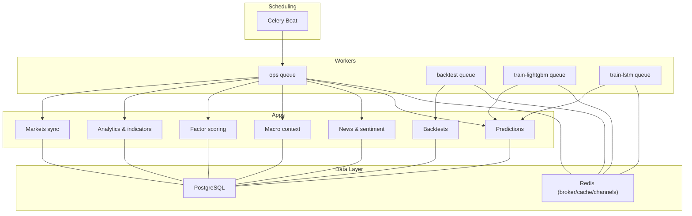
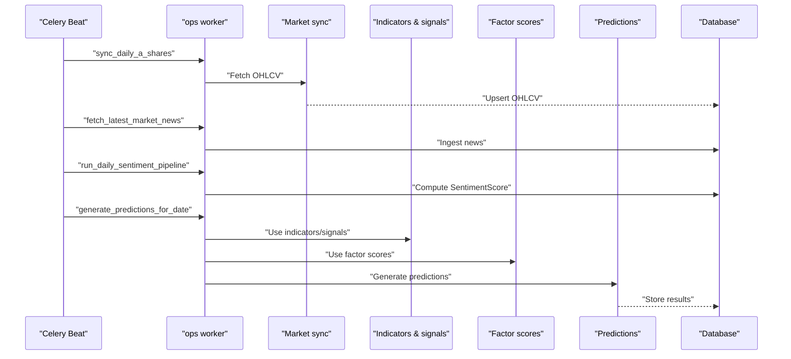
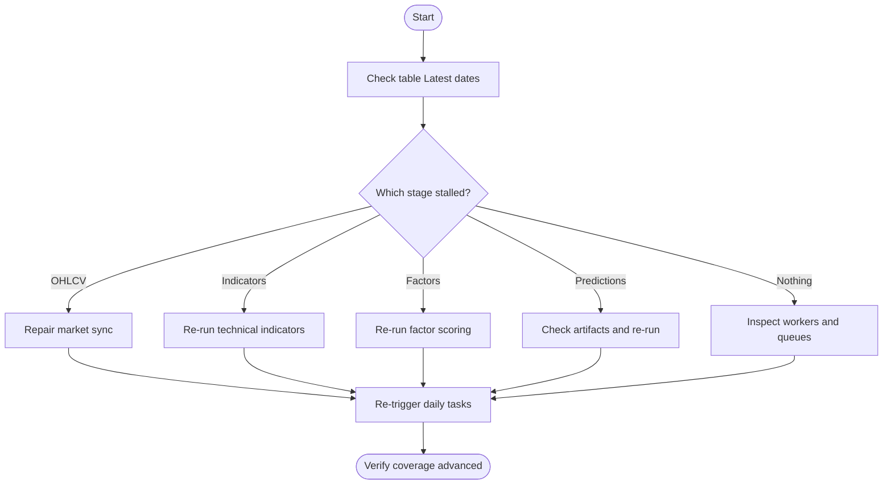
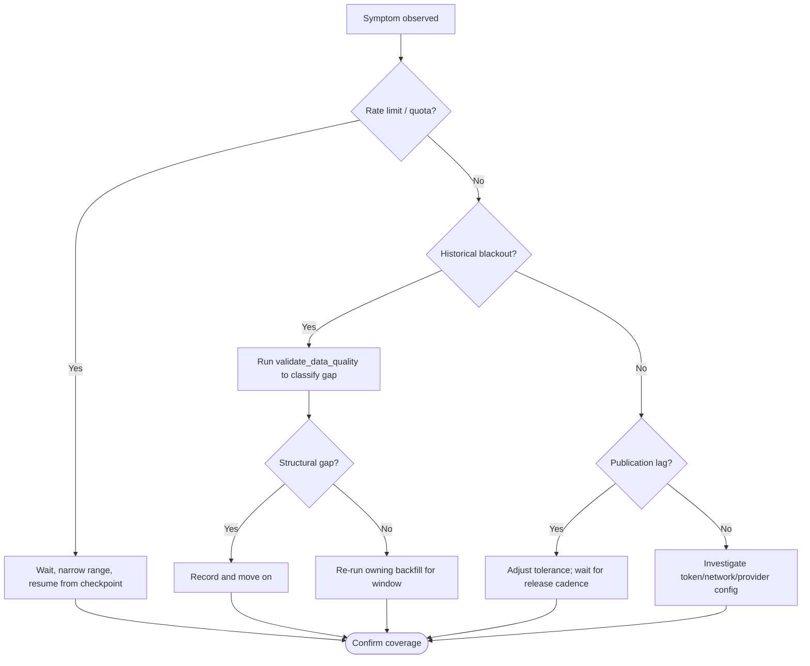
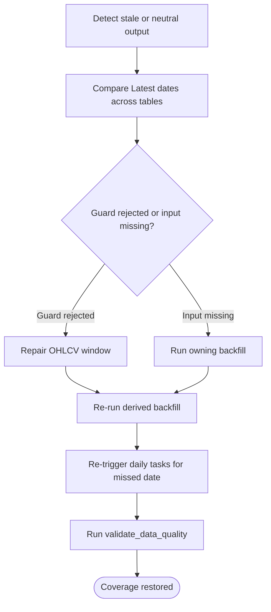
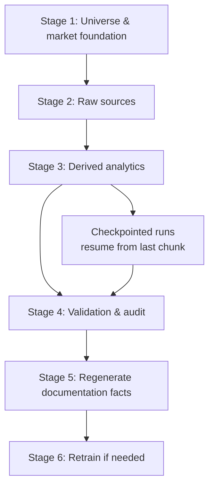
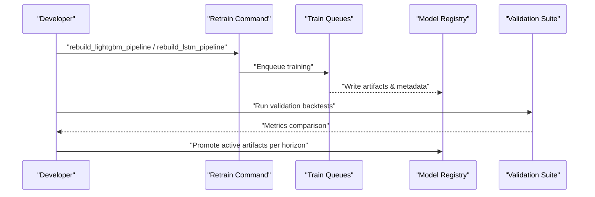
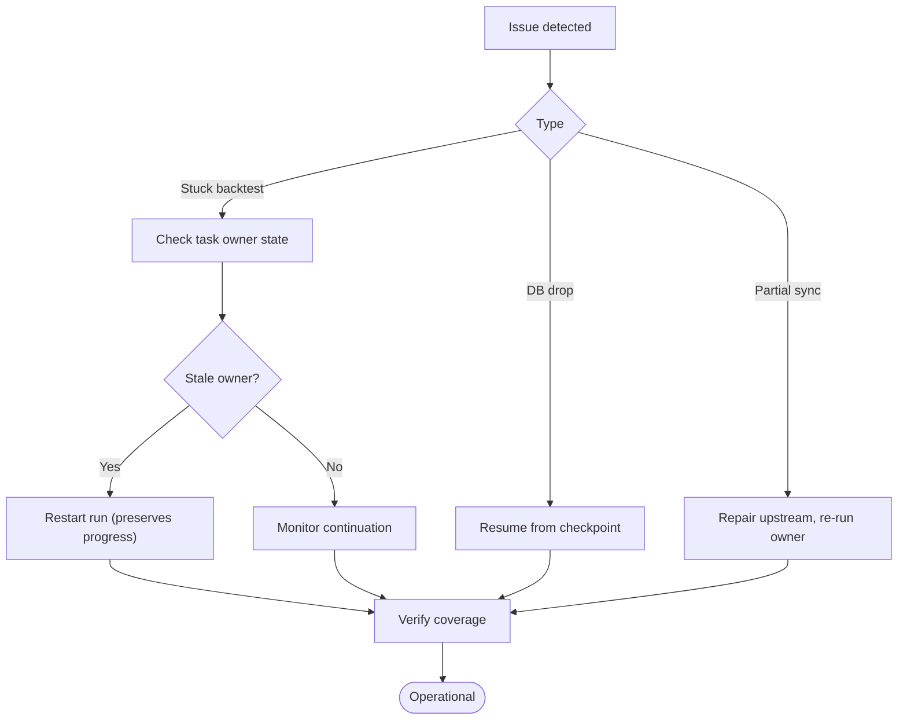
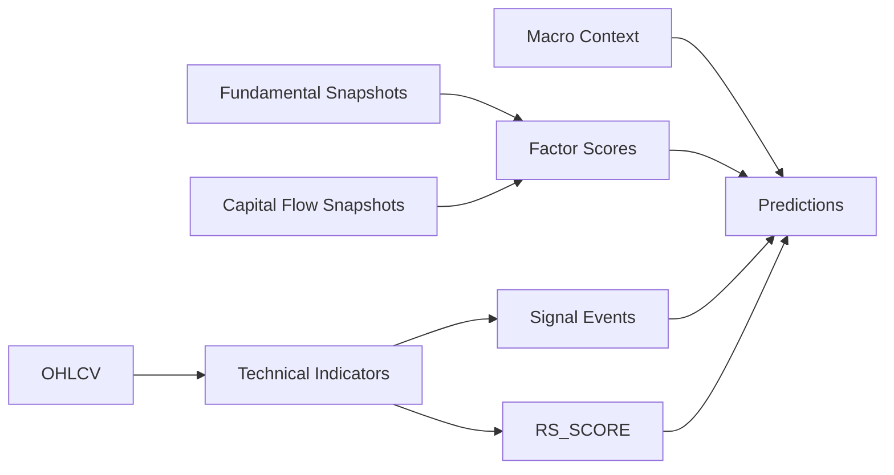

# Troubleshooting & Runbooks

<cite>
**Referenced Files in This Document**
- [runbook-sync-failure.md](file://docs/how-to/runbook-sync-failure.md)
- [runbook-stale-data.md](file://docs/how-to/runbook-stale-data.md)
- [runbook-provider-blackout.md](file://docs/how-to/runbook-provider-blackout.md)
- [backfill.md](file://docs/how-to/backfill.md)
- [retrain.md](file://docs/how-to/retrain.md)
- [celery.md](file://docs/reference/celery.md)
- [metrics.md](file://docs/reference/metrics.md)
- [base.py](file://config/settings/base.py)
- [task_health.py](file://apps/backtest/task_health.py)
- [technical_staleness.py](file://apps/analytics/technical_staleness.py)
- [validate_data_quality.py](file://apps/core/management/commands/validate_data_quality.py)
- [tasks.py](file://apps/analytics/tasks.py)
- [verify_local_stack.sh](file://scripts/verify_local_stack.sh)
- [smoke_api_check.sh](file://scripts/smoke_api_check.sh)
</cite>

## Table of Contents
1. Introduction
2. Project Structure
3. Core Components
4. Architecture Overview
5. Detailed Component Analysis
6. Dependency Analysis
7. Performance Considerations
8. Troubleshooting Guide
9. Conclusion
10. Appendices

## Introduction
This document provides operational runbooks and troubleshooting guidance for FinanceAnalysis. It focuses on:
- Sync failures, provider blackouts, stale data detection, and task execution problems
- Step-by-step diagnostics to identify root causes, check system health, and restore operations
- Data backfill procedures, model retraining workflows, and emergency recovery procedures
- Monitoring dashboards, log analysis techniques, and alert interpretation
- Performance troubleshooting for slow queries, memory issues, and Celery worker problems
- Data quality checks, validation procedures, and repair workflows for corrupted or inconsistent data
- Escalation procedures and contact information for critical system issues

## Project Structure
FinanceAnalysis is a Django application with multiple feature apps (markets, analytics, factors, macro, sentiment, prediction, backtest), Celery-based background tasks, and a frontend. Operational concerns are centralized in:
- Celery configuration and scheduled tasks
- Management commands for backfills, validation, and audits
- Staleness rules that protect derived features from being used when incomplete
- Health-check scripts for database, broker, and API smoke tests

**Diagram sources**
- [base.py:174-255](file://config/settings/base.py#L174-L255)
- [celery.md:13-48](file://docs/reference/celery.md#L13-L48)

**Section sources**
- [base.py:174-255](file://config/settings/base.py#L174-L255)
- [celery.md:13-48](file://docs/reference/celery.md#L13-L48)

## Core Components
- Celery queues and schedules define the daily pipeline timing and routing.
- Backfill commands rebuild historical data across stages with idempotent, resumable runs.
- Validation command produces detailed reports and can fail CI or send alerts.
- Staleness rules enforce freshness thresholds per indicator family.
- Health and smoke scripts validate infrastructure and API endpoints.

Key responsibilities:
- Daily ingestion and derived computation flow through Celery Beat and workers.
- Backfills repair upstream/downstream gaps using ownership tables and checkpoints.
- Validation ensures coverage, continuity, and value bounds; it never mutates history.
- Staleness prevents stale rows from silently degrading models.

**Section sources**
- [celery.md:13-48](file://docs/reference/celery.md#L13-L48)
- [backfill.md:44-170](file://docs/how-to/backfill.md#L44-L170)
- [validate_data_quality.py:426-721](file://apps/core/management/commands/validate_data_quality.py#L426-L721)
- [technical_staleness.py:9-32](file://apps/analytics/technical_staleness.py#L9-L32)

## Architecture Overview
The daily pipeline is a chain with deliberate spacing. A failure at any stage stops downstream progress. The first table whose latest date did not advance identifies the failing stage.

**Diagram sources**
- [base.py:218-255](file://config/settings/base.py#L218-L255)
- [celery.md:34-48](file://docs/reference/celery.md#L34-L48)

**Section sources**
- [runbook-sync-failure.md:8-33](file://docs/how-to/runbook-sync-failure.md#L8-L33)
- [base.py:218-255](file://config/settings/base.py#L218-L255)

## Detailed Component Analysis

### Sync and Task Failure Runbook
- Identify the broken stage by checking the latest dates per table.
- Verify worker fleet health and active queues.
- Recover failed stages by re-running the owning backfill for the affected range, then re-trigger daily tasks.
- Handle timeouts by distinguishing soft/hard limits and using management commands for long jobs.
- Address stuck backtest runs via staleness detection and restarts.

**Diagram sources**
- [runbook-sync-failure.md:8-113](file://docs/how-to/runbook-sync-failure.md#L8-L113)
- [celery.md:13-48](file://docs/reference/celery.md#L13-L48)

**Section sources**
- [runbook-sync-failure.md:8-113](file://docs/how-to/runbook-sync-failure.md#L8-L113)
- [celery.md:13-48](file://docs/reference/celery.md#L13-L48)

### Provider Blackout Runbook
- Distinguish rate limiting vs historical blackouts vs publication lag.
- Use throttling variables and checkpointing to avoid partial coverage.
- Classify gaps with validation; structural gaps are expected and not retried.
- Understand fallback behavior: missing inputs degrade signal quality but do not break predictions.

**Diagram sources**
- [runbook-provider-blackout.md:28-191](file://docs/how-to/runbook-provider-blackout.md#L28-L191)
- [validate_data_quality.py:426-721](file://apps/core/management/commands/validate_data_quality.py#L426-L721)

**Section sources**
- [runbook-provider-blackout.md:28-191](file://docs/how-to/runbook-provider-blackout.md#L28-L191)

### Stale Data Detection and Remediation
- Freshness is measured against official trading days, not calendar days.
- Gap-tolerant metrics allow bounded interior gaps; exact-window metrics require zero gaps.
- Diagnose by comparing Latest dates and running validation; remediate upstream first, then re-run owner.
- RS_SCORE has strict requirements and is owned by model data backfill.

**Diagram sources**
- [runbook-stale-data.md:13-165](file://docs/how-to/runbook-stale-data.md#L13-L165)
- [technical_staleness.py:9-32](file://apps/analytics/technical_staleness.py#L9-L32)

**Section sources**
- [runbook-stale-data.md:13-165](file://docs/how-to/runbook-stale-data.md#L13-L165)
- [technical_staleness.py:9-32](file://apps/analytics/technical_staleness.py#L9-L32)

### Data Backfill Procedures
- Follow staged ordering: universe foundation, raw sources, derived analytics, validation, regenerate facts, retrain.
- Use checkpointing for long runs; resume safely due to idempotency.
- Ownership matters: ensure you run the correct command for each series.

**Diagram sources**
- [backfill.md:44-170](file://docs/how-to/backfill.md#L44-L170)
- [backfill.md:174-213](file://docs/how-to/backfill.md#L174-L213)

**Section sources**
- [backfill.md:44-170](file://docs/how-to/backfill.md#L44-L170)
- [backfill.md:174-213](file://docs/how-to/backfill.md#L174-L213)

### Model Retraining Workflows
- Retrain when feature contracts change, effective universe expands, or validation shows drift.
- Promote by activating artifacts per horizon; rollback by reversing activation.
- Validate before promotion using rolling backtests and reference suites.
- Confirm missing-value strategy is present in artifacts.

**Diagram sources**
- [retrain.md:10-23](file://docs/how-to/retrain.md#L10-L23)
- [retrain.md:82-128](file://docs/how-to/retrain.md#L82-L128)
- [retrain.md:190-253](file://docs/how-to/retrain.md#L190-L253)

**Section sources**
- [retrain.md:10-23](file://docs/how-to/retrain.md#L10-L23)
- [retrain.md:82-128](file://docs/how-to/retrain.md#L82-L128)
- [retrain.md:190-253](file://docs/how-to/retrain.md#L190-L253)

### Emergency Recovery Procedures
- For stuck backtests, use staleness detection to determine if a restart is safe.
- For database connection drops, resume from checkpoint rather than restarting blindly.
- After recovery, confirm coverage and run validation to ensure no silent breakage.

**Diagram sources**
- [task_health.py:33-95](file://apps/backtest/task_health.py#L33-L95)
- [runbook-sync-failure.md:170-229](file://docs/how-to/runbook-sync-failure.md#L170-L229)

**Section sources**
- [task_health.py:33-95](file://apps/backtest/task_health.py#L33-L95)
- [runbook-sync-failure.md:170-229](file://docs/how-to/runbook-sync-failure.md#L170-L229)

## Dependency Analysis
- Daily pipeline dependencies: market sync -> indicators/signals -> factor scores -> predictions.
- Backfill ownership determines which command writes each series; misattribution leads to wasted effort.
- Staleness rules depend on ExchangeTradingCalendar and indicator warmup lookbacks.

**Diagram sources**
- [backfill.md:155-170](file://docs/how-to/backfill.md#L155-L170)
- [technical_staleness.py:9-32](file://apps/analytics/technical_staleness.py#L9-L32)

**Section sources**
- [backfill.md:155-170](file://docs/how-to/backfill.md#L155-L170)
- [technical_staleness.py:9-32](file://apps/analytics/technical_staleness.py#L9-L32)

## Performance Considerations
- Celery time limits: global defaults protect ops; backtests override to longer limits.
- Worker concurrency and pool choice affect throughput; Windows solo pool serializes tasks.
- Long backfills should use chunking and checkpointing to reduce retry cost.
- Memory pressure in LSTM training controlled by sequence length, asset chunk size, and max samples per horizon.

Recommendations:
- Use appropriate queues for workload type.
- Prefer management commands for long-running jobs to avoid task timeouts.
- Tune chunk sizes and concurrency based on environment constraints.
- Monitor worker logs and queue depths to detect bottlenecks.

**Section sources**
- [celery.md:25-48](file://docs/reference/celery.md#L25-L48)
- [local-setup.md:366-400](file://docs/how-to/local-setup.md#L366-L400)
- [backfill.md:174-213](file://docs/how-to/backfill.md#L174-L213)
- [retrain.md:131-159](file://docs/how-to/retrain.md#L131-L159)

## Troubleshooting Guide

### Common Failure Scenarios and Diagnostics
- Sync failures: check Latest dates per table; verify workers and queues; recover by re-running owner.
- Provider blackouts: classify gaps; use throttling controls; understand fallback behavior.
- Stale data: apply staleness rules; repair upstream; re-run owner; trigger daily tasks.
- Task execution problems: inspect Celery status; handle timeouts; restart stuck runs safely.

**Section sources**
- [runbook-sync-failure.md:8-113](file://docs/how-to/runbook-sync-failure.md#L8-L113)
- [runbook-provider-blackout.md:28-191](file://docs/how-to/runbook-provider-blackout.md#L28-L191)
- [runbook-stale-data.md:13-165](file://docs/how-to/runbook-stale-data.md#L13-L165)

### System Health Checks
- Infrastructure: verify PostgreSQL, Redis broker/cache, Python dependencies, and Django settings.
- API smoke test: authenticate and probe key endpoints to ensure data availability.

**Section sources**
- [verify_local_stack.sh:1-72](file://scripts/verify_local_stack.sh#L1-L72)
- [smoke_api_check.sh:1-84](file://scripts/smoke_api_check.sh#L1-L84)

### Log Analysis Techniques
- Worker output goes to the console launched with the worker; redirect to files for history.
- Read returned values from tasks that catch exceptions and return strings; Celery may report success while the task logic indicates failure.

**Section sources**
- [runbook-sync-failure.md:71-80](file://docs/how-to/runbook-sync-failure.md#L71-L80)
- [runbook-sync-failure.md:116-140](file://docs/how-to/runbook-sync-failure.md#L116-L140)

### Alert Interpretation
- Alerts are evaluated every 5 minutes; empty rule sets produce no events.
- Alert events record channels dispatched and status; failures are recorded when no channel succeeds.

**Section sources**
- [tasks.py:1283-1304](file://apps/analytics/tasks.py#L1283-L1304)
- [BACKLOG.md:279-291](file://BACKLOG.md#L279-L291)

### Performance Troubleshooting
- Slow queries: ensure indexes exist on frequently filtered fields; avoid scanning large ranges without filters.
- Memory issues: tune LSTM chunk sizes and sample caps; prefer CPU inference backend unless GPU is available.
- Celery worker problems: confirm correct queues are consumed; adjust concurrency and pool; watch for timeout patterns.

**Section sources**
- [retrain.md:131-159](file://docs/how-to/retrain.md#L131-L159)
- [celery.md:25-48](file://docs/reference/celery.md#L25-L48)

### Data Quality Checks and Repair Workflows
- Use validation command to generate detailed reports; it never mutates history.
- Focus on suspicious gaps; excused gaps are expected due to lifecycle or suspension.
- After repairs, regenerate documentation facts to capture coverage changes.

**Section sources**
- [validate_data_quality.py:426-721](file://apps/core/management/commands/validate_data_quality.py#L426-L721)
- [backfill.md:216-247](file://docs/how-to/backfill.md#L216-L247)

### Escalation Procedures
- If coverage regresses after repair, compare generated facts diffs to quantify impact.
- If critical findings persist, escalate to engineering with validation reports and logs.
- For provider-related outages, coordinate with data providers and adjust throttling parameters within safe bounds.

**Section sources**
- [runbook-provider-blackout.md:195-206](file://docs/how-to/runbook-provider-blackout.md#L195-L206)
- [runbook-sync-failure.md:233-249](file://docs/how-to/runbook-sync-failure.md#L233-L249)

## Conclusion
Effective operation of FinanceAnalysis depends on disciplined backfill ordering, robust validation, and clear understanding of staleness rules and provider behaviors. Use the provided runbooks to diagnose failures quickly, restore normal operations safely, and maintain high-quality data and models. Always validate changes and document regressions to prevent repeat incidents.

## Appendices

### Monitoring Dashboards and Metrics
- Coverage metrics are generated from the database and published into a reference sheet.
- Use the Latest column to detect stalls early; commit diffs after backfills to track changes.

**Section sources**
- [metrics.md:1-53](file://docs/reference/metrics.md#L1-L53)
- [backfill.md:250-260](file://docs/how-to/backfill.md#L250-L260)

### Celery Task and Queue Reference
- Queues separate operational workloads from long-running backtests and training jobs.
- Time limits protect the system; overrides exist for specific tasks like backtests.

**Section sources**
- [celery.md:13-48](file://docs/reference/celery.md#L13-L48)
- [celery.md:100-108](file://docs/reference/celery.md#L100-L108)

### Configuration Highlights
- Broker, result backend, queues, routes, and beat schedule are defined centrally.
- Macro provider selection and sleep intervals are configurable.

**Section sources**
- [base.py:174-255](file://config/settings/base.py#L174-L255)